# Introducció a Unity (Pong)

Unity és un **motor de videojocs** que permet fer jocs per diferents plataformes. (Windows, Linux, Android, iOS, ...)

El software de unity està compost per múltiples aplicacions. 

## Unity HUB

[Unity Hub](https://unity.com/es/download) és el gestor de Unity que permet organitzar:

- Els projectes
- Les versions del software

<center>
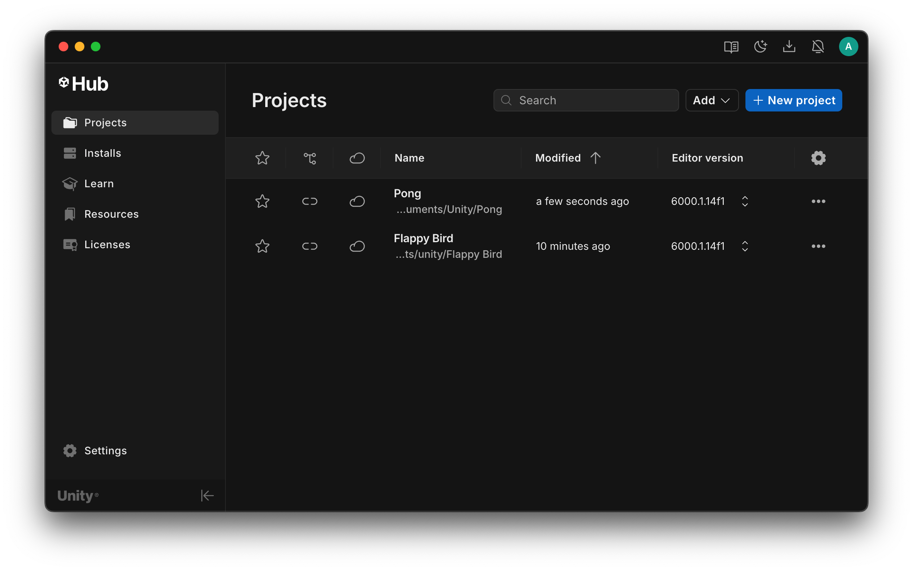
</center>

## Unity Engine

**Unity Engine** és el nucli que permet que un joc funcioni, són llibreries que faciliten la programació de:

- Físiques
- Animacions
- IA
- Recursos
- ...

## Unity Editor

**Unity Editor** és una aplicació gràfica que permet crear i organitzar els objectes del joc.

Fa servir **Unity Engine** com a base de les llibreries.

<center>

</center>

## Visual Studio Code

Permet programar el codi (controladors) del joc.

El codi dels jocs Unity és C# (C Sharp), i ens permetrà:

- Escriure el comportament dels objectes
- Programar la lògica del joc
- Gestionar recuros i interfícies
- Accedir al *Unity Engine* a través de la **API**

# Crear projectes Unity

Per crear un nou projecte Unity, cal fer servir **Unity HUB**

<center>
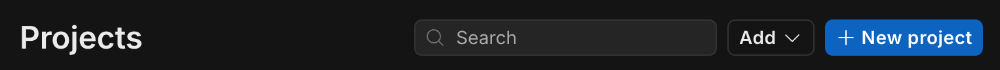
</center>

Escull la opció *"2D Built-In Render Pipeline"*, i posa nom al teu joc (projecte):

<center>
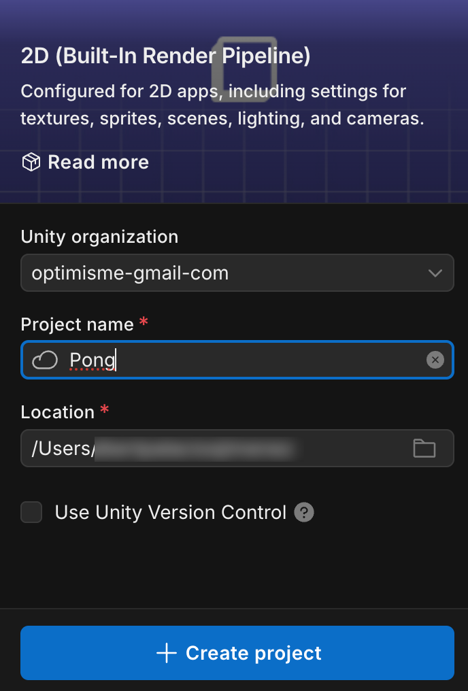
</center>

Escull la carpeta on guardaràs els projectes de Unity.

# Interfície de Unity Editor

La interfície de *Unity Editor* s'organitza en aquestes seccions:

<center>
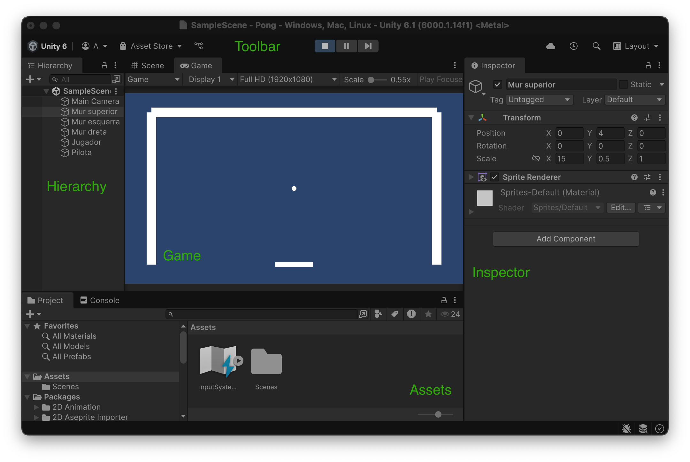
</center>

- **Toolbar**: Accés ràpid a accions essencials. 

- **Hierarchy**: Reperesentació de les escenes i objectes que té el joc.

- **Game**: Simulació visual de com el joc es veu a través de les càmeres.

- **Inspector**: Edició de les propietats dels objectes.

- **Assets**: llibreria d'objectes/arxius que es necessiten pel joc.

## Afegir objectes predefinits

A la secció 'Hierarchy', obrir el menú de context amb el botó dret.

Escollir "2D objects" > Sprites > Square

<center>

</center>

Això afegeix un "quadre" al nostre joc. Canvia-li les propietats amb l'inspector per tal que siguin:

<center>
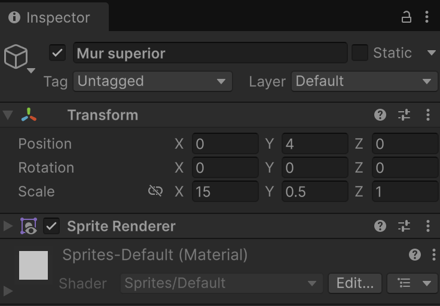
</center>

- **Nom**: Mur superior
- **Posició Y**: 4
- **Scale X**: 15
- **Scale Y**: 0.5

Fixa't que a la pestanya **"Scene"** hi ha opcions per canviar les propietats visualment:

<center>
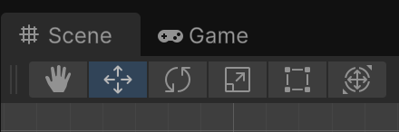
</center>

- **Hand**: La mà, canvia la posició de la vista sense canviar els objectes.

- **Direction arrows**: Canvien la posició dels objectes
    * La vermella a l'eix X
    * La fletxa verda a l'eix Y
    * La blava a l'eix Z

- **Rotation arrows**: Canvien la rotació dels objectes:
    * El cercle vermell la rotació X
    * El cercle verd la rotació Y
    * El cercle blau la rotació Z

- **Scale**: Canvien la mida dels objectes:
    * El quadre vermell la rotació X
    * El quadre verd la rotació Y
    * El quadre blau la rotació Z

Fes dues còpies del mur superior, i canvia les propietats per tal que siguin:

<center>
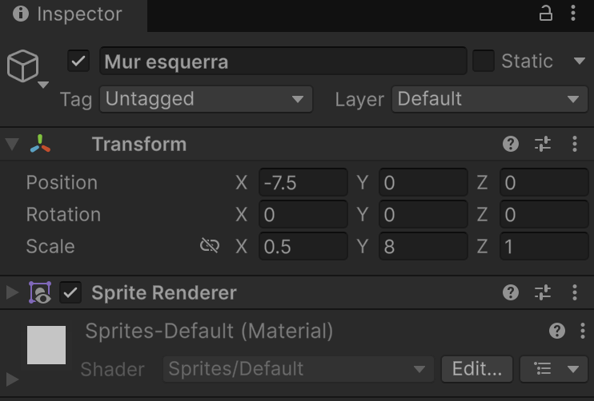
</center>

<center>
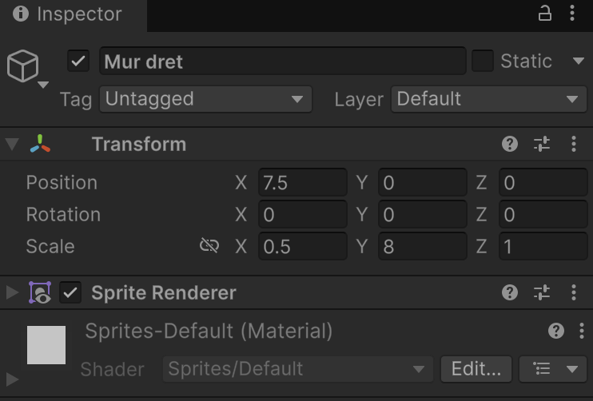
</center>

Afegeix el rectangle que serà el jugador:

<center>

</center>

Afegeix el cercle que serà la pilota:

<center>

</center>

Ara la jerarquia i l'escena s'haurien de veure així:

<center>

</center>

I s'hi s'apreta el botó de 'Play', el joc sense interactivitat:

<center>

</center>

## Definir objectes amb col·lisió

Per tal que els murs facin rebotar la pilota, cal definir-los una col·lisió.

Això es fa afegint un *"Component"* tipus **"Box Collider 2d"** des de l'inspector. 

### Col·lisions als murs

Cal afegir-lo als 3 murs (no al jugador):

<center>
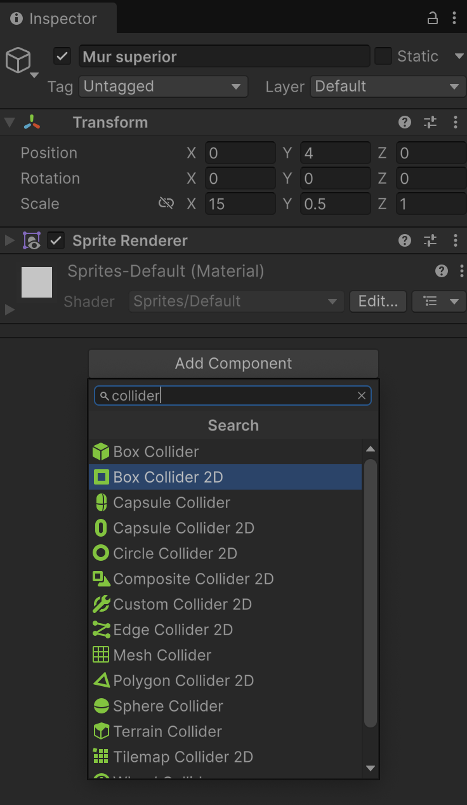
</center>

Cal fixar-se que el "Box Collider 2d" es marca a l'escena amb la forma taronja que fa la col·lisió:

<center>
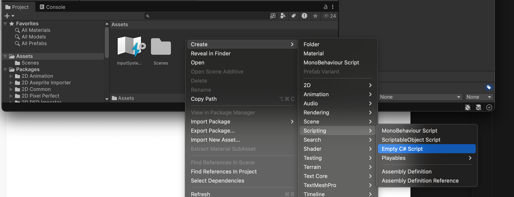
</center>

### Col·lisions al jugador (paleta)

El jugador necessita dos components:

- **"Box Collider 2d"**, per definir que la forma de la col·lisió sigui rodona
- **"Rigidbody 2d"**, per marcar la pilota com que està afectada per físiques

A més, el jugador ha de desactivar les físiques amb **"Body Type"** a *Kinematic*:

<center>
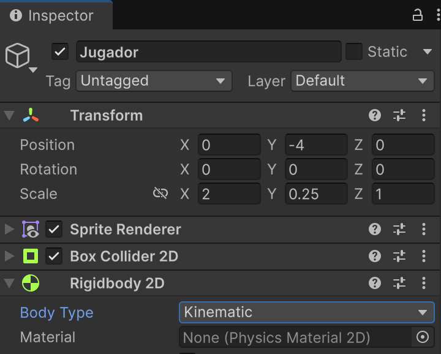
</center>

### Col·lisions a la pilota

La pilota cal afegir dos components:

- **"Circle Collider 2d"**, per definir que la forma de la col·lisió sigui rodona
- **"Rigidbody 2d"**, per marcar la pilota com que està afectada per físiques

A més, cal:

- Anular la gravetat posant el camp **"Gravity Scale"** a 0
- Posar la **"Collision detection"** a 'Contiuous'

**Important**: sobre *Collision detection*:

* **Discrete**, mira només si a la posició actual l'objecte *"xoca"*
* **Contiuous**, mira durant tot el recorrecut del moviment si *"xoca"*, cal posar-la per objectes que poden moure's molt ràpid, sinó podríen atrevesar murs o parets.

<center>

</center>

## Scripts de moviment

A la secció **"Project"** a la part inferior, afegir un **"Asset"** (tipus Mono Behaviour) amb el menú de context del botó dret:

<center>

</center>

Anomena l'script com "MovimentJugador"

<center>
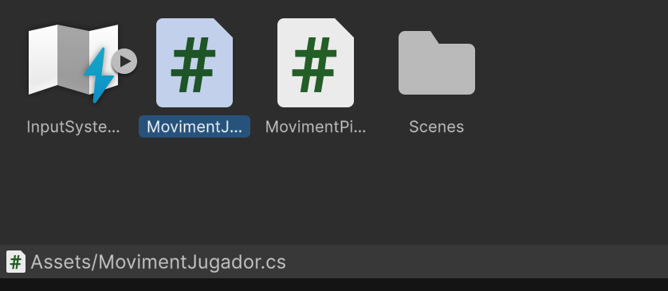
</center>

Obre l'script al **Visual Studio Code**, amb un doble click.

Posa-hi aquest codi:

```csharp
using UnityEngine;
using UnityEngine.InputSystem;

// Script que gestiona el moviment del jugador horitzontalment entre dues parets.
public class MovimentJugador : MonoBehaviour
{
    // Velocitat base de moviment del jugador.
    [SerializeField] private float baseSpeed = 5f;

    // Referències a les parets esquerra i dreta (definides a l’escena).
    [SerializeField] private Transform leftWall;
    [SerializeField] private Transform rightWall;

    // Components necessaris del jugador.
    private Rigidbody2D rb;
    private Collider2D playerCollider;

    // Límits de moviment (calculats segons les parets i l’amplada del jugador).
    private float leftBound, rightBound;

    private void Start()
    {
        // Assignem els components Rigidbody2D i Collider2D del jugador.
        rb = GetComponent<Rigidbody2D>();
        playerCollider = GetComponent<Collider2D>();
        
        // Si les parets no s’han assignat a l’Inspector, es busquen pel nom.
        if (!leftWall) leftWall = GameObject.Find("Mur esquerra")?.transform;
        if (!rightWall) rightWall = GameObject.Find("Mur dreta")?.transform;
        
        // Calculem els límits horitzontals i configurem el Rigidbody2D.
        CalculateBounds();
        SetupRigidbody();
    }

    private void SetupRigidbody()
    {
        // El jugador no té gravetat (no cau).
        rb.gravityScale = 0f;

        // Es congela la rotació i el moviment en Y (només pot moure’s en X).
        rb.constraints = RigidbodyConstraints2D.FreezeRotation | RigidbodyConstraints2D.FreezePositionY;
    }

    private void CalculateBounds()
    {
        // Si tenim parets i col·lisionador, calculem els límits de moviment.
        if (leftWall && rightWall && playerCollider)
        {
            // La meitat de l’amplada del jugador.
            float halfWidth = playerCollider.bounds.extents.x;

            // Límits horitzontals: just dins de les parets.
            leftBound = leftWall.GetComponent<Collider2D>().bounds.max.x + halfWidth;
            rightBound = rightWall.GetComponent<Collider2D>().bounds.min.x - halfWidth;
        }
    }

    // Es crida per actualitzar independentment dels FPS (ideal per moviments)
    private void FixedUpdate()
    {
        // Si el joc s’ha acabat, no hi ha moviment.
        if (GameState.gameOver) return;

        // Obtenim l’input del jugador (tecles esquerra/dreta o A/D).
        float input = GetMovementInput();

        // Calculem la velocitat tenint en compte l’input, la velocitat base
        // i el factor de velocitat global del joc.
        float velocity = baseSpeed * GameState.speedFactor * input;
        
        // Apliquem la velocitat al Rigidbody2D en l’eix X.
        rb.linearVelocity = new Vector2(velocity, 0f);

        // Assegurem que el jugador no surti dels límits.
        ClampPosition();
    }

    private float GetMovementInput()
    {
        float input = 0f;
        
        // Tecles per moure a l’esquerra (fletxa esquerra o A).
        if (Keyboard.current?.leftArrowKey.isPressed == true || 
            Keyboard.current?.aKey.isPressed == true)
            input -= 1f;
            
        // Tecles per moure a la dreta (fletxa dreta o D).
        if (Keyboard.current?.rightArrowKey.isPressed == true || 
            Keyboard.current?.dKey.isPressed == true)
            input += 1f;
            
        return input;
    }

    private void ClampPosition()
    {
        // Limita la posició X del jugador perquè no travessi les parets.
        if (leftWall && rightWall)
        {
            var pos = rb.position;
            pos.x = Mathf.Clamp(pos.x, leftBound, rightBound);
            rb.position = pos;
        }
    }
}
```

Fes el mateix per afegir un script "MovimentPilota.cs" (tipus MonoBehaviour)

Posa-hi aquest codi:

```csharp
using UnityEngine;

public class MovimentPilota : MonoBehaviour
{
    // Velocitat inicial de la pilota quan comença o es reinicia.
    [SerializeField] private float initialSpeed = 5f;

    // Increment de velocitat cada vegada que la pilota toca el jugador.
    [SerializeField] private float speedIncrement = 0.5f;

    // Referència al Rigidbody2D per controlar la física.
    private Rigidbody2D rb;

    // Velocitat actual de la pilota.
    private float currentSpeed;

    // Direcció actual del moviment de la pilota.
    private Vector2 direction;

    // Direccions diagonals predefinides (45 graus).
    private static readonly Vector2 UP_LEFT = new Vector2(-1, 1).normalized;
    private static readonly Vector2 UP_RIGHT = new Vector2(1, 1).normalized;

    private void Awake()
    {
        // Assigna el Rigidbody2D i inicialitza la velocitat.
        rb = GetComponent<Rigidbody2D>();
        currentSpeed = initialSpeed;
    }

    private void Start()
    {
        // Configura el Rigidbody2D i col·loca la pilota a l’inici.
        SetupRigidbody();
        ResetBall();
    }

    private void SetupRigidbody()
    {
        // La pilota no té gravetat.
        rb.gravityScale = 0f;

        // Es fa servir detecció contínua de col·lisions per evitar que travessi objectes.
        rb.collisionDetectionMode = CollisionDetectionMode2D.Continuous;

        // Es bloqueja la rotació de la pilota.
        rb.constraints = RigidbodyConstraints2D.FreezeRotation;
    }

    // Es crida per actualitzar independentment dels FPS (ideal per moviments)
    private void FixedUpdate()
    {
        // Només es mou si el joc no ha acabat.
        if (!GameState.gameOver)
        {
            // Manté velocitat constant en la direcció actual.
            rb.linearVelocity = direction * currentSpeed;
        }
    }

    private void OnCollisionEnter2D(Collision2D collision)
    {
        // Agafem la normal de la col·lisió (vector perpendicular al punt de contacte).
        Vector2 normal = collision.contacts[0].normal;
        
        // Si la normal és més horitzontal → rebot horitzontal.
        // Si és més vertical → rebot vertical.
        if (Mathf.Abs(normal.x) > Mathf.Abs(normal.y))
            direction = new Vector2(-direction.x, direction.y); // Canvia direcció en X.
        else
            direction = new Vector2(direction.x, -direction.y); // Canvia direcció en Y.
            
        direction = direction.normalized;

        // Si la col·lisió és amb l’objecte "Jugador", incrementa la velocitat i els punts.
        if (collision.gameObject.name == "Jugador" || collision.collider.transform.root.name == "Jugador")
        {
            OnPlayerHit();
        }
    }

    private void OnPlayerHit()
    {
        // Augmenta la velocitat cada cop que toca el jugador.
        currentSpeed += speedIncrement;

        // Suma un punt.
        GameState.points++;

        // Actualitza el factor de velocitat global segons la nova velocitat.
        GameState.speedFactor = Mathf.Max(1f, currentSpeed / initialSpeed);
    }

    private void OnBecameInvisible()
    {
        // Quan la pilota surt de la pantalla → game over.
        GameState.gameOver = true;

        // Atura la pilota.
        rb.linearVelocity = Vector2.zero;
    }

    public void ResetBall()
    {
        // Recol·loca la pilota al centre.
        transform.position = Vector3.zero;

        // Reinicia la velocitat.
        currentSpeed = initialSpeed;
        
        // Tria una direcció inicial aleatòria (amunt-esquerra o amunt-dreta).
        direction = Random.value < 0.5f ? UP_LEFT : UP_RIGHT;
        
        // Assigna la velocitat inicial al Rigidbody2D.
        if (rb) rb.linearVelocity = direction * currentSpeed;
    }
}
```

Vincula cada un dels cripts, amb el seu inspector, arrossegant l'script des dels **Assets** fins a **Inspector**

<center>
<video src="./assets/unity-editor-linkscript.mov" width="300" controls></video>
</center>

Fes un nou script amb les variables compartides entre els objectes del joc. 

Crea un script "GameState.cs" (Empty C# Script):

<center>
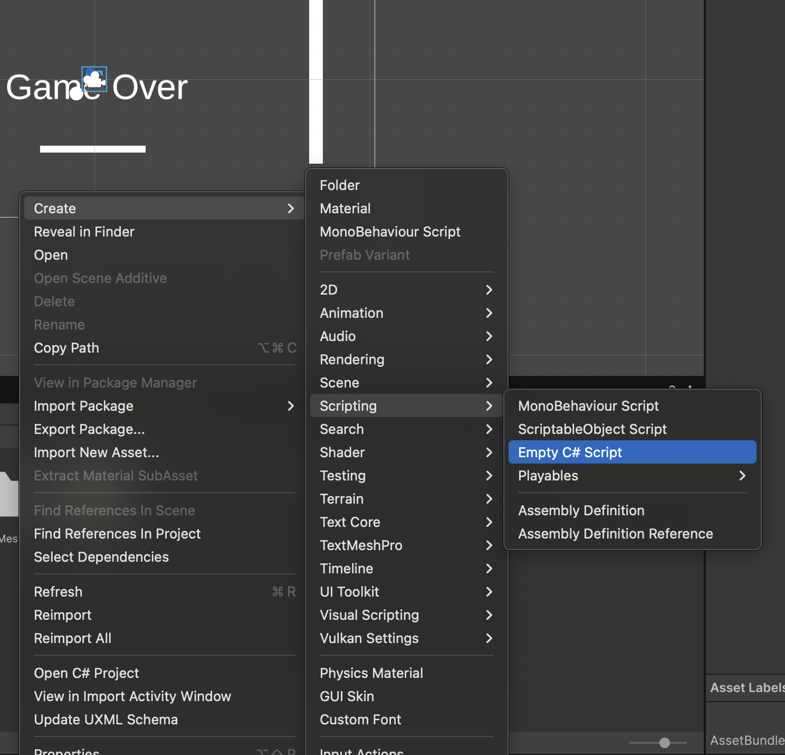
</center>

```csharp
using UnityEngine;

// Classe estàtica que manté l'estat global del joc.
// "static" vol dir que no cal crear instàncies d'aquesta classe, 
// es pot accedir directament a les seves variables i mètodes.
public static class GameState
{
    // Factor de velocitat del joc (per exemple, per fer el joc més ràpid amb el temps).
    public static float speedFactor = 1f;

    // Puntuació acumulada pel jugador.
    public static int points = 0;

    // Estat que indica si el joc s’ha acabat o no.
    public static bool gameOver = false;

    // Aquest mètode especial s’executa automàticament cada vegada que es carrega el joc
    // (abans d'iniciar qualsevol escena). 
    // Serveix per assegurar que l'estat comença reiniciat.
    [RuntimeInitializeOnLoadMethod(RuntimeInitializeLoadType.SubsystemRegistration)]
    static void ResetOnLoad()
    {
        speedFactor = 1f;
        points = 0;
        gameOver = false;
    }

    // Mètode públic per reiniciar manualment l’estat del joc. 
    // Es pot cridar des d’altres scripts, per exemple quan es reinicia la partida.
    public static void Reset()
    {
        speedFactor = 1f;
        points = 0;
        gameOver = false;
    }
}
```

### Valors inicials de les variables de l'Script

Les variables dels *scripts* marcades com a "public" permeten decidir el valor des de *l'inspector*, tot i tenir definit un altre valor inicial.

<center>

</center>

**Important!** El valor definit gràficament a Inspector té preferència al definit pel codi

**Prova**: Fes públiques les variables *murEsquerra* i *murDret* per assignar-les des de l'Inspector enlloc de fer-ho al mètode *Start()*


## UIHUD mostrar informació

**UIHUD (user interface heads-up display)** és el mètode pel que es mostra informació visual al jugador.

A 'Hierarchy' afegeix un 'Text (TMP)', segurament et demanarà que importis el paquet *TMP Essentials*

<center>
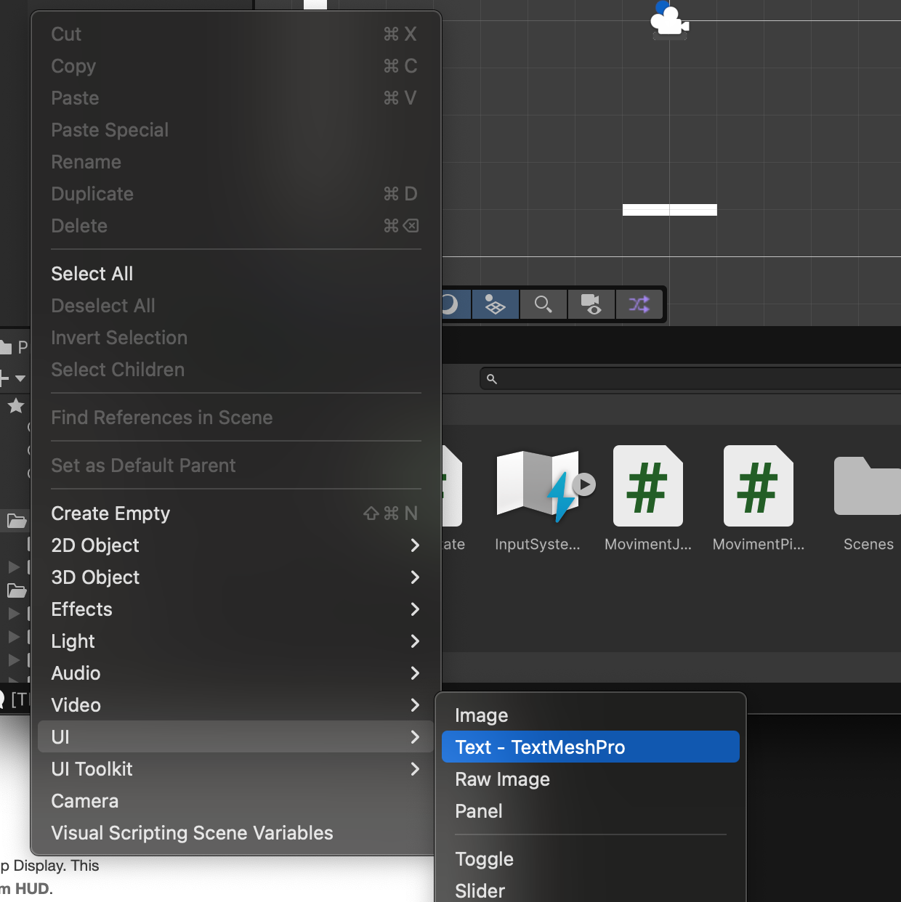
</center>

Importar 'TMP Essentials' si ho demana.

<center>
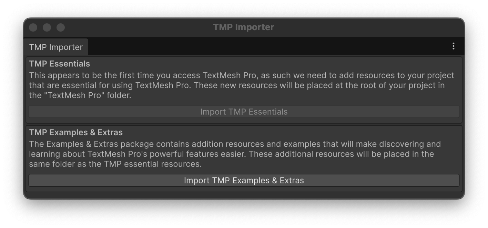
</center>

A la jerarquia creará dos objectes:

- Canvas per dibuixar-hi informació
- Text (amb la informació)

<center>
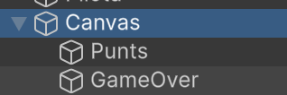
</center>

A l'inspector del *Canvas* assigna **"Render Mode"** com a **"Screen Space - Camera"**

I arrossega la **"Main Camera"** des de *Hierarchy* fins a la opció **"Render Camera"**

<center>
<video src="./assets/unity-editor-hud-camera.mov" width="400" controls></video>
</center>

Canvia el nom de l'objecte *"Text (TMP)"* per *Punts* 

A l'inspector de l'objecte *"Punts"* posa "..." com a valor per defecte del text.

I ajusta si ho veus conveninet *"Pos X" i "Pos Y"

<center>
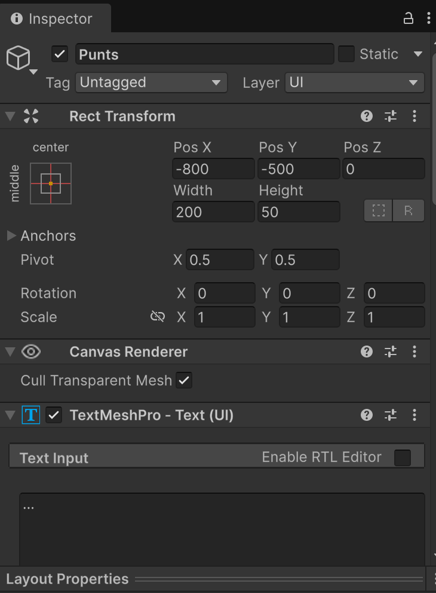
</center>

Augmenta la mida d'escriptura del text, amb la "Move Tool":

<center>
<video src="./assets/unity-editor-hud-textresize.mov" width="400" controls></video>
</center>

Afegeix l'script "UIHUD" següent:

```csharp
using UnityEngine;
using TMPro;

// Script encarregat de mostrar la interfície d’usuari (HUD) amb la puntuació i el missatge de "Game Over".
public class UIHUD : MonoBehaviour
{
    // Referències als elements de text de la UI (TextMeshPro).
    [SerializeField] private TextMeshProUGUI scoreText;
    [SerializeField] private TextMeshProUGUI gameOverText;
    
    // Variables internes per recordar l’últim estat mostrat i evitar actualitzacions innecessàries.
    private int lastPoints = -1;
    private float lastSpeedFactor = -1f;
    private bool lastGameOverState = false;

    private void Awake()
    {
        // Si no s’han assignat els elements a l’Inspector, es busquen pel nom.
        if (!scoreText) scoreText = GameObject.Find("Punts")?.GetComponent<TextMeshProUGUI>();
        if (!gameOverText) gameOverText = GameObject.Find("GameOver")?.GetComponent<TextMeshProUGUI>();
        
        // Al començar, amaguem el text de "Game Over".
        if (gameOverText) gameOverText.gameObject.SetActive(false);
    }

    private void Update()
    {
        // Cada frame actualitzem la puntuació i l’estat de "Game Over".
        UpdateScoreDisplay();
        UpdateGameOverDisplay();
    }

    private void UpdateScoreDisplay()
    {
        // Només actualitza el text si hi ha hagut canvis en punts o en el factor de velocitat.
        if (scoreText && (GameState.points != lastPoints || GameState.speedFactor != lastSpeedFactor))
        {
            // Mostra la velocitat i els punts al format: "Factor: x1.00 - Punts: 5".
            scoreText.text = $"Factor: x{GameState.speedFactor:F2} - Punts: {GameState.points}";

            // Desa els últims valors per detectar futurs canvis.
            lastPoints = GameState.points;
            lastSpeedFactor = GameState.speedFactor;
        }
    }

    private void UpdateGameOverDisplay()
    {
        // Només actualitza el missatge si hi ha un canvi a l’estat de gameOver.
        if (gameOverText && GameState.gameOver != lastGameOverState)
        {
            // Mostra o amaga el text segons si el joc s’ha acabat.
            gameOverText.gameObject.SetActive(GameState.gameOver);

            // Desa l’últim estat per evitar canvis repetits.
            lastGameOverState = GameState.gameOver;
        }
    }
}
```

Arrossega l'script **"UIHUD"** (tipus MonoBehaviour) com a un nou component a l'inspector de **"Punts"**

<center>
<video src="./assets/unity-editor-hud-textscript.mov" width="400" controls></video>
</center>

## Game Over i gestor del joc

Afegeix un nout ext dins del *Canvas* anomenat **GameOver**

<center>

</center>

Centra el text i fes-lo gran:

<center>
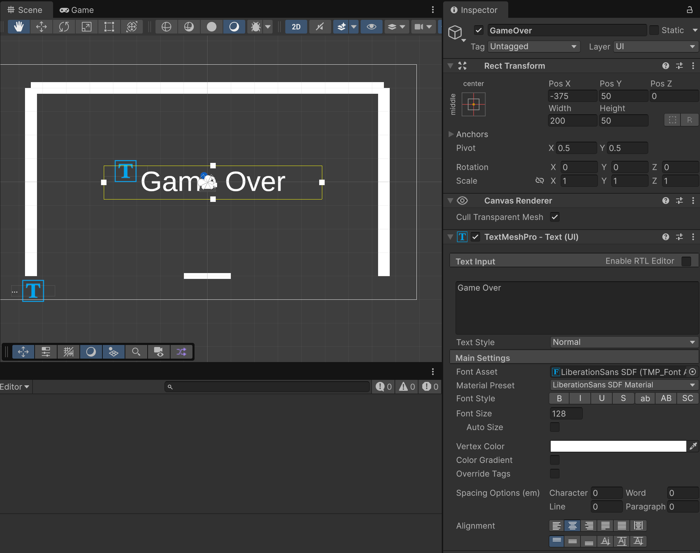
</center>

Crea un nou objecte **"Empty"**, això ens servirà per posar-hi un *Component* d'script i res més.

<center>
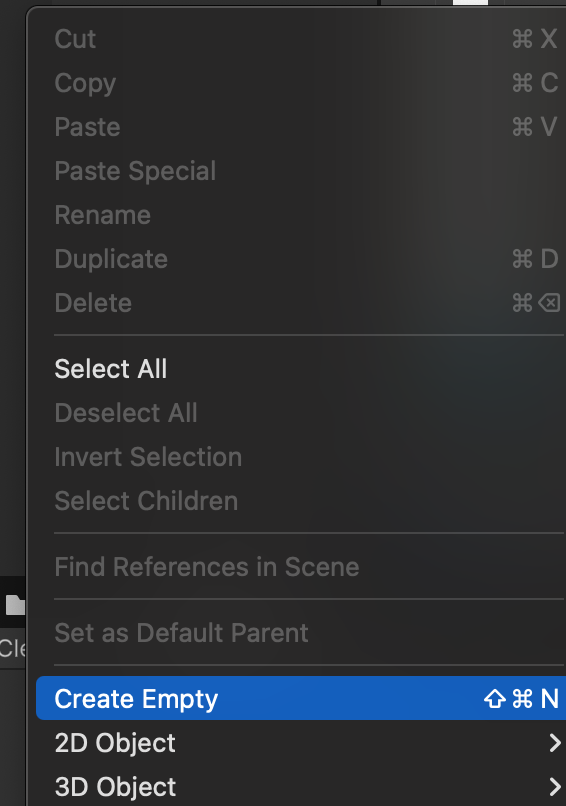
</center>

Anomena l'objecte anterior com a **"GameManager"

Crea un nou script **"GameManager"** amb aquest codi i arrossega'l a l'inspector de l'objecte "GameManaer" com un nou *Component*

```csharp
using UnityEngine;
using UnityEngine.InputSystem;

public class GameManager : MonoBehaviour
{
    // Referència a l'script MovimentPilota associat a la pilota.
    // S'indica amb [SerializeField] per poder assignar-ho des de l'Inspector.
    [SerializeField] private MovimentPilota ball;

    // Referència al Transform del jugador (la seva posició i rotació a l'escena).
    [SerializeField] private Transform player;

    private void Awake()
    {
        // Aquest mètode s'executa abans de Start(), en inicialitzar l'objecte.
        // Si no s'ha assignat la pilota manualment a l'Inspector:
        if (!ball)
        {
            // Es busca un GameObject amb el nom "Pilota".
            var go = GameObject.Find("Pilota");
            // Si existeix, s'assigna el component MovimentPilota.
            if (go) ball = go.GetComponent<MovimentPilota>();
            // Si no existeix, s'envia un avís a la consola.
            else Debug.LogWarning("[GameManager] No GameObject named 'Pilota' found");
        }

        // Mateixa lògica per al jugador.
        if (!player)
        {
            var go = GameObject.Find("Jugador");
            if (go) player = go.transform;
            else Debug.LogWarning("[GameManager] No GameObject named 'Jugador' found");
        }
    }

    private void Start()
    {
        // Quan comença el joc, es reinicia l'estat de la partida.
        RestartGame();
    }

    private void Update()
    {
        // A cada frame, si el joc està en "game over"
        // i el jugador prem la tecla d'espai, es reinicia la partida.
        if (GameState.gameOver && Keyboard.current?.spaceKey.wasPressedThisFrame == true)
        {
            RestartGame();
        }
    }

    public void RestartGame()
    {
        // Reinicia l'estat general del joc (GameState).
        GameState.Reset();
        // Centra el jugador a la posició inicial.
        CenterPlayer();
        // Si hi ha una pilota assignada, es reinicia la seva posició i estat.
        if (ball) ball.ResetBall();
    }

    private void CenterPlayer()
    {
        // Torna el jugador al centre de l'eix X (posició horitzontal).
        if (player)
        {
            var pos = player.position;
            pos.x = 0f; // Es força que la posició X sigui 0.
            player.position = pos;
        }
    }
}
```

Aquest codi controla el "Game Over" i reinici del joc.

## Introducció a la API de Unity

Sense entrar amb detalls del codi, cal saber que aquestes funcions són *"heredades"* de **"MonoBehaviour"**:

**Awake()**

- Es crida una sola vegada quan el GameObject s’instancia o la escena es carrega.
Serveix per inicialitzar variables i referències.
- Es crida abans que Start().

**OnEnable()**

- Es crida cada cop que el GameObject o component s’activa (.enabled = true).
- Útil per subscriure’s a events o reiniciar estats.

**Start()**

- Es crida la primera vegada que el component està actiu, després de Awake().
- Bona per inicialitzacions que depenen d’altres objectes ja carregats.

**Update()**

- Es crida cada frame.
- S’utilitza per lògica dependent del temps (input, moviments, animacions).

**FixedUpdate()**

- Es crida a intervals fixes (no depèn dels FPS).
- Ideal per física i forces (Rigidbody).

**LateUpdate()**

- Es crida després de tots els Update().
- Útil per càmeres o accions que han d’esperar que la resta d’objectes s’hagin mogut.

**OnDisable()**

- Es crida quan el component o GameObject es desactiva (.enabled = false).
- Serveix per des-subcriure’s a events o alliberar recursos temporals.

**OnDestroy()**

- Es crida quan el GameObject es destrueix.
- Bona per netejar recursos, tancar connexions o alliberar memòria.

