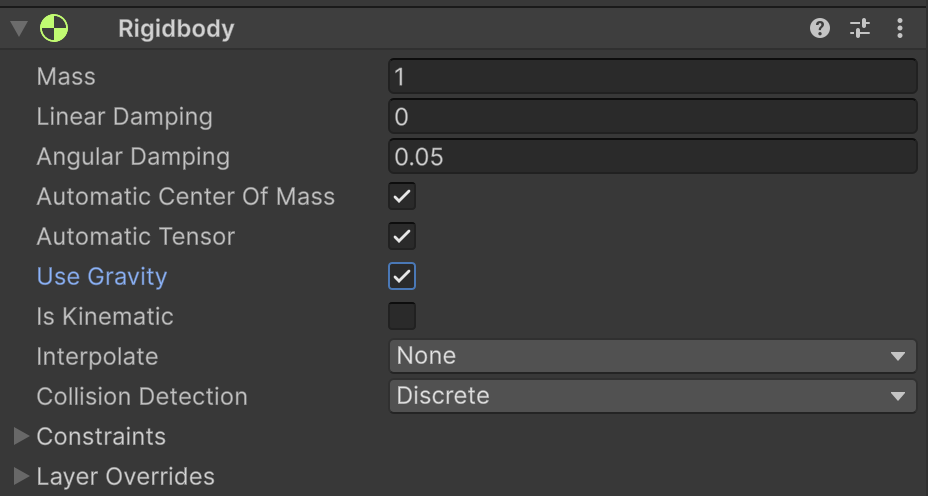
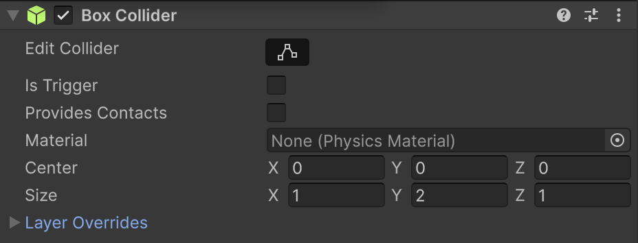
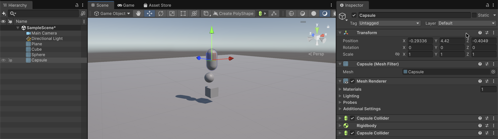

# Físiques

Unity té dos mòduls per aplicar físiques als objectes **`Rigidbody`** i **`Box Collider`**

## Rigidbody

El component **`Rigidbody`** aplica físiques als objectes. 

- Fer caure l'objecte segons la gravetat
- Que l'objecte es mogui al rebre un cop
- Que l'objecte tingui velocitat

Un objecte **`Kinematic`** no aplica les físiques però si que:

- Intervé en col·lisions
- Executa els events *`OnCollision`*  i *`OnTrigger`*

 

**NOTA:** No es recomana aplicar **`Rigidbody`** als personatges animats, perquè les físiques realistes trenquen la jugabilitat. En aquest cas, es recomana definir físiques personalitzades.

## Box Collider (Sphere, Capsule, ...)

Defineix la forma de col·lisió de l'objecte. 

Perquè funcioni una col·lisió tots dos objectes han de tenir **`Box Collider`**, però només cal que un dels dos tingui **`Rigidbody`**.

 

# Exemple

Afegeix un plà a l'escena, escala el plà amb:

- **x**: 10
- **z**: 10

A sobre del plà, afegeix diferents objectes (caixes, esferes, capsules) sobreposades amb:

- Diferents altures
- Diferents posicions

Assigna'ls **`Rigidbody`** i el **`Collider`** que li correspon (Box, Sphere, Capsule)

 

Activa el programa i comprova com cauen els objectes sobre el plà, i xoquen entre ells.

<video src="./assets/fisiques-anim.mov" controls style="width: 50%; max-width: 400px; max-width: 600px"></video>

 