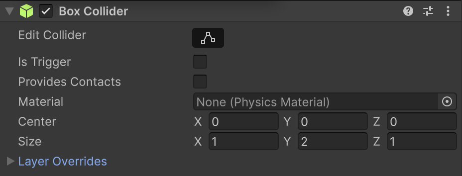
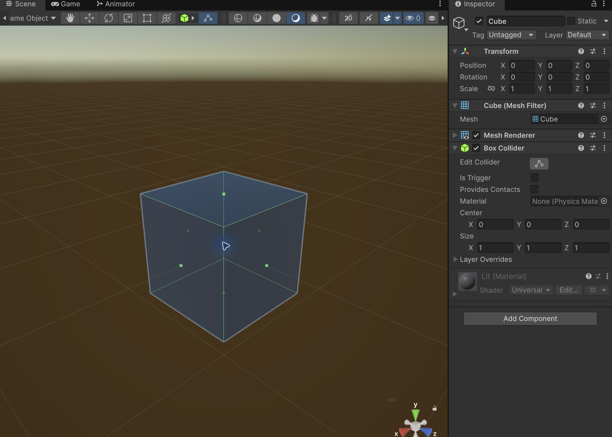
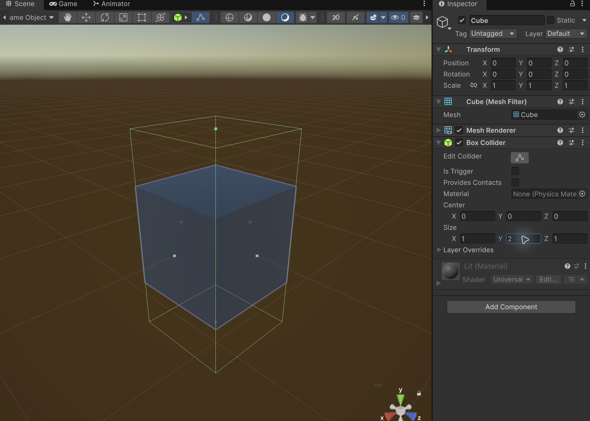
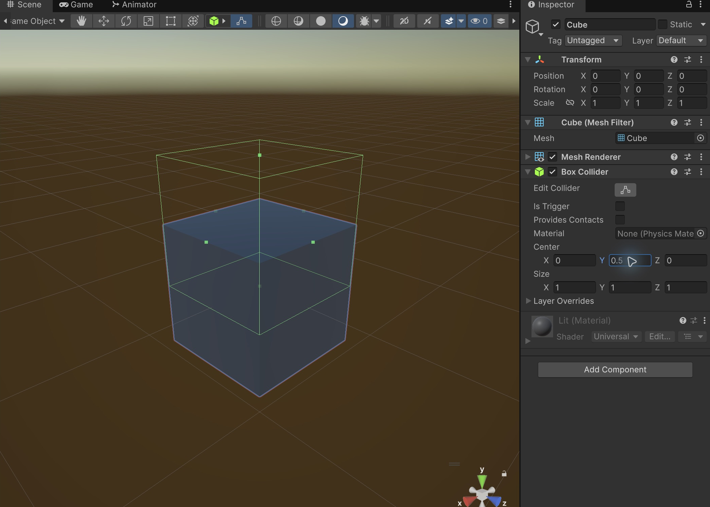
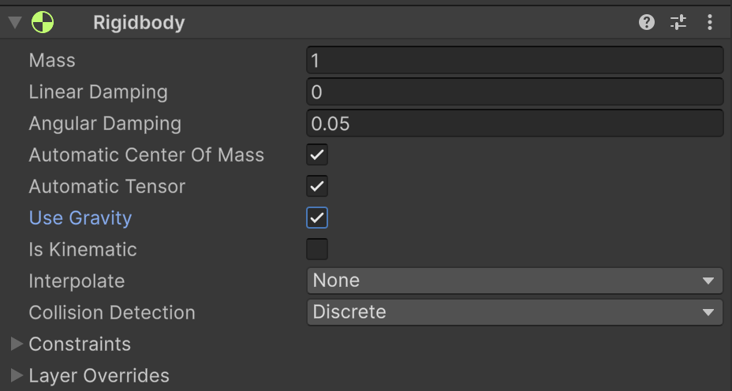
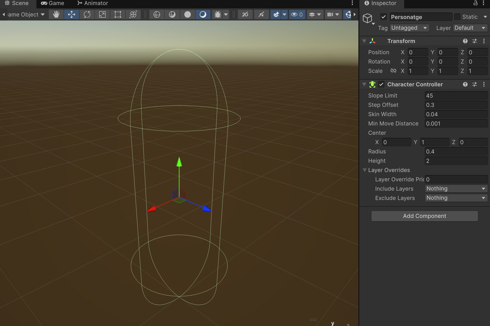
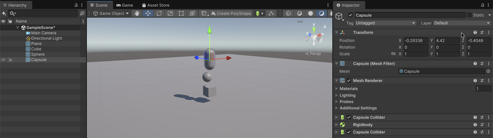

# Físiques

A Unity, els components **`Collider`** i **`Rigidbody`** tenen funcions diferents: el collider defineix la forma de contacte i el Rigidbody controla el comportament físic del cos.

Aquest apartat explica com configurar-los des de l'editor per treballar amb **objectes 3D**.

## Objecte visual i forma de col·lisió

Un **`GameObject`** agrupa components. En un objecte 3D amb una malla, podem distingir:

| Component | Funció |
|---|---|
| `Transform` | Defineix la posició, la rotació i l'escala |
| `Mesh Filter` | Conté la referència a la malla, és a dir, la geometria visual |
| `Mesh Renderer` | Dibuixa la malla amb els seus materials |
| `Collider` | Defineix la forma que utilitza el motor de física per detectar contactes |
| `Rigidbody` | Permet simular el moviment físic o configurar un cos cinemàtic |

**La forma visible i la forma de col·lisió no han de coincidir exactament.** Un arbre pot tenir un tronc i moltes branques a la malla, però utilitzar només un `Capsule Collider` al tronc si és l'única part que ha de bloquejar el pas.

El collider no es dibuixa com a part del joc. A la vista **Scene**, podem veure'n el contorn amb l'objecte seleccionat i els **Gizmos** activats.

- Un objecte visible sense collider no ofereix una superfície de col·lisió a la física.
- Un collider pot existir sense cap malla visible, per exemple per definir una zona de detecció.
- Si el collider és més gran que la malla, els objectes poden tocar-se físicament abans que les formes visibles arribin a tocar-se.

## Tipus de collider

Escull una forma que representi prou bé la part de l'objecte amb què es podrà interactuar:

| Component | Forma | Exemple d'ús |
|---|---|---|
| `Box Collider` | Caixa | Caixes, parets o plataformes |
| `Sphere Collider` | Esfera | Pilotes o zones de detecció al voltant d'un punt |
| `Capsule Collider` | Càpsula | Troncs o cossos de personatges |
| `Mesh Collider` | Forma basada en una malla | Geometria irregular de l'escenari |

Els colliders simples acostumen a ser suficients i tenen un cost baix. Un **`Mesh Collider`** permet seguir una geometria més detallada, però pot tenir un cost superior. Per utilitzar-lo amb un **Rigidbody dinàmic**, cal activar **`Convex`**: això genera una forma convexa que no conserva els buits o les concavitats de la malla. [Documentació de Unity sobre Mesh Collider](https://docs.unity3d.com/6000.0/Documentation/Manual/mesh-colliders-introduction.html).

### Combinar colliders senzills

**Un mateix objecte pot tenir diversos colliders, fins i tot de tipus diferents.** Per exemple, podem combinar un `Box Collider` per al cos d'un objecte i un `Sphere Collider` per a una part arrodonida.

Una cadira amb un únic `Box Collider` també bloquejaria l'espai buit entre les potes. Podem representar-la amb diverses caixes: una per al seient, una per al respatller i una per a cada pota.

Hi ha dues maneres de configurar-ho a l'editor:

- **Al mateix GameObject:** fes `Add Component` per afegir cada collider i ajusta'n el centre i les dimensions. Tots comparteixen el mateix `Transform`.
- **En objectes fills:** crea un objecte buit fill per a cada part i afegeix-hi el collider corresponent. Així pots ajustar la posició i la rotació de cada forma amb el `Transform` del fill; és útil, per exemple, per inclinar el collider del respatller d'una cadira.

Si la cadira s'ha de moure com un únic cos físic, posa **un sol Rigidbody a l'objecte pare** i deixa els fills sense Rigidbody. Els colliders del pare i dels fills pertanyen al mateix cos: formen un **collider compost**. Afegir un Rigidbody a un fill el converteix en un altre cos físic. Si l'objecte és una part fixa de l'escenari, pots deixar els colliders sense Rigidbody. [Documentació de Unity sobre colliders compostos](https://docs.unity3d.com/6000.0/Documentation/Manual/compound-colliders-introduction.html).

Cada collider conserva la seva configuració. Per exemple, un objecte pot tenir un collider sòlid i un altre més gran amb `Is Trigger` activat per detectar proximitat, tal com s'explica més endavant.

## Ajustar el collider a Unity

1. Selecciona l'objecte a **Hierarchy**.
2. A **Inspector**, localitza el collider. Si no en té cap, fes **Add Component** i busca el tipus que necessites. Les primitives de Unity ja acostumen a portar-ne un.
3. A la vista **Scene**, activa **Gizmos** per veure el contorn.
4. Per a un `Box Collider`, activa **Edit Collider** i arrossega els punts de control per ajustar-ne el volum.
5. Utilitza els camps de l'Inspector per introduir valors precisos.

| Propietat | Què modifica |
|---|---|
| `Center` | Desplaça el centre del collider respecte de l'origen local de l'objecte |
| `Size` — Box | Amplada, alçada i profunditat de la caixa |
| `Radius` — Sphere / Capsule | Radi de l'esfera o de la càpsula |
| `Height` — Capsule | Alçada total de la càpsula |
| `Direction` — Capsule | Eix local al llarg del qual s'orienta la càpsula |

**Modificar el collider no modifica la malla visible.** Per exemple, canviar `Center` mou la forma de col·lisió dins de l'objecte, però no mou el model. En canvi, modificar l'escala del **Transform** afecta tant la malla com el collider. Els valors del collider es defineixen en l'espai local de l'objecte.

Per a una caixa, `Edit Collider`, `Center` i `Size` permeten ajustar la forma directament a l'editor. [Referència de Box Collider](https://docs.unity3d.com/6000.0/Documentation/Manual/class-BoxCollider.html).

 

**Exemple:** si tens una caixa visible d'una unitat, amb escala `(1, 1, 1)`, i poses `Size` a `(1, 2, 1)`, el collider serà el doble d'alt que la caixa. Amb `Center` a `(0, 0, 0)`, sobresortirà tant per sobre com per sota.

Després de modificar un model amb **ProBuilder**, revisa també el seu collider: un `Box Collider` continua sent una caixa i no reprodueix automàticament els nous forats o detalls de la malla.

### Comparació visual: malla i volum de col·lisió

Aquestes captures de **Unity 6.6** mostren el mateix cub amb **Edit Collider** activat. La superfície blava és la **malla visible**; les línies i els punts verds representen el **Box Collider**. A la dreta es veuen els valors de l'Inspector. El `Transform` es manté igual en els tres casos.

**1. Collider ajustat a la malla.** Amb `Center = (0, 0, 0)` i `Size = (1, 1, 1)`, el contorn de col·lisió coincideix amb les cares del cub.

 

**2. Collider més gran que la malla.** Només canviem `Size` a `(1, 2, 1)`. La caixa visible conserva la mida, però el volum de col·lisió sobresurt per sobre i per sota. Si cau sobre un terra sòlid, el contacte es produeix a la base del collider, abans que la malla arribi al terra.

 

**3. Collider desplaçat respecte de la malla.** Restaurem `Size = (1, 1, 1)` i canviem `Center` a `(0, 0.5, 0)`. El collider es desplaça mitja unitat cap amunt, mentre que la malla queda al mateix lloc. La part inferior del cub queda fora del collider: això mostra per què cal revisar tant la mida com el centre.

 

## Rigidbody

El component **`Rigidbody`** defineix com participa un cos en la simulació física. Perquè tingui una forma amb què tocar altres objectes, també necessita un collider, al mateix objecte o als seus fills.

| Configuració | Comportament | Exemple |
|---|---|---|
| Collider sense Rigidbody | Collider estàtic, pensat per a geometria fixa | Terra o paret |
| Collider amb Rigidbody i `Is Kinematic` desactivat | Cos dinàmic: respon a forces, gravetat i contactes | Caixa que cau i es pot empènyer |
| Collider amb Rigidbody i `Is Kinematic` activat | Cos cinemàtic: el moviment el dirigeix el joc, no les forces | Plataforma amb un recorregut controlat |

Un cos cinemàtic continua participant en les interaccions físiques i pot empènyer cossos dinàmics, però no cau per la gravetat ni es desplaça perquè rep un cop.

### Propietats bàsiques

- **Mass:** massa del cos; influeix en la resposta a forces i en les interaccions amb altres cossos. Una massa més gran no fa que caigui més de pressa sota la mateixa gravetat.
- **Use Gravity:** activa la gravetat per a un cos dinàmic. Desactivar-la no el converteix en cinemàtic: encara pot respondre a forces i cops.
- **Is Kinematic:** fa que el moviment sigui controlat, en lloc de calculat a partir de les forces.
- **Constraints:** permet bloquejar eixos de posició o rotació. Per exemple, impedir que un cos es tombi.

[Referència de Rigidbody](https://docs.unity3d.com/6000.0/Documentation/Manual/class-Rigidbody.html).

 

**Nota sobre personatges:** tenir animacions no impedeix utilitzar un Rigidbody. L'elecció depèn del moviment que es vulgui aconseguir: es pot utilitzar un Rigidbody per a un personatge basat en física o un `CharacterController` per a un moviment controlat. No cal afegir un Rigidbody només perquè el personatge estigui animat.

## Ajustar el CharacterController

El **`CharacterController`** incorpora una forma de col·lisió en forma de **càpsula vertical**. Aquesta càpsula serveix per resoldre els contactes del moviment del personatge; no cal afegir-hi un `Capsule Collider` ni un Rigidbody perquè el controlador funcioni.

Per ajustar-la a l'editor:

1. Surt del mode **Play** perquè els canvis es conservin.
2. Selecciona a **Hierarchy** l'objecte que té el component `CharacterController`, que pot ser el pare del model visible.
3. A **Scene**, activa **Gizmos** i observa el contorn de la càpsula des de davant i de costat.
4. A **Inspector**, modifica els camps del mateix component `CharacterController`:

| Propietat | Què modifica |
|---|---|
| `Height` | Alçada total de la càpsula, inclosos els extrems arrodonits |
| `Radius` | Radi de la càpsula; l'amplada és el doble del radi |
| `Center` | Posició del centre de la càpsula respecte de l'objecte, sense desplaçar la malla |

La càpsula ha de representar el volum necessari per moure el personatge. No cal que inclogui tots els detalls del model, com els braços estesos, el cabell o els accessoris.

### Exemple: personatge amb el pivot als peus

Per a un model de **2 unitats d'alçada**, amb el pivot als peus i escala `(1, 1, 1)` a l'objecte i als seus pares, podem començar amb:

| Propietat | Valor |
|---|---|
| `Height` | `2` |
| `Radius` | `0.4` |
| `Center` | `(0, 1, 0)` |

 

**Ajust de la càpsula a Unity:** a l'esquerra es veu el contorn de la forma de col·lisió; a la dreta, els camps **Center**, **Radius** i **Height** del component **Character Controller**. Modifica aquests valors i observa com canvia la càpsula a **Scene**. En aquesta captura s'ha utilitzat un objecte buit, sense malla, per veure tota la forma amb claredat.

La càpsula s'estén una unitat per sobre i una per sota del seu centre. Amb `Center Y = 1`, la base queda a l'altura del pivot dels peus i la part superior a dues unitats. Si deixéssim `Center Y = 0`, mitja càpsula quedaria per sota dels peus. Ajusta els valors segons les proporcions i el pivot del teu model.

### Contacte, esglaons i pendents

A més de les dimensions, el controlador té propietats que regulen el moviment:

| Propietat | Funció |
|---|---|
| `Skin Width` | Tolerància de penetració en els contactes; ajuda a reduir vibracions i encallaments |
| `Step Offset` | Alçada dels esglaons que pot superar; no ha de ser superior a `Height` |
| `Slope Limit` | Límit d'inclinació dels pendents que pot pujar, en graus |

Com a punt de partida, Unity recomana un `Skin Width` d'aproximadament el **10% del radi**: amb `Radius = 0.4`, seria `0.04`. Aquest marge no substitueix l'ajust de `Height`, `Radius` i `Center`. [Referència del CharacterController](https://docs.unity3d.com/6000.0/Documentation/Manual/class-CharacterController.html).

### Colliders addicionals en un personatge

Es poden afegir altres colliders per a funcions específiques, com zones de detecció o zones que reben impactes, però **no amplien la càpsula que utilitza `CharacterController.Move` per resoldre el moviment**. El controlador no es converteix en un collider compost perquè afegim un `Box Collider` a un fill.

Per canviar l'espai que ocupa el personatge quan es mou, ajusta la càpsula del **CharacterController**. Els colliders addicionals necessiten la seva pròpia configuració i lògica segons la detecció que es vulgui implementar.

## Collider sòlid i trigger

La propietat **`Is Trigger`** del collider determina si la seva forma serveix per al contacte sòlid o per detectar solapaments.

| Configuració | Funció | Exemple |
|---|---|---|
| `Is Trigger` desactivat | Superfície sòlida per a les col·lisions de la simulació | Terra que sosté una caixa |
| `Is Trigger` activat | Zona que altres colliders poden travessar i que permet detectar entrades i sortides | Zona que detecta quan un jugador s'acosta a una porta |

**Un trigger és un collider amb una opció activada.** No substitueix el Rigidbody: un mateix objecte pot tenir un collider en mode trigger i un Rigidbody.

Per exemple, una porta pot tenir un collider sòlid ajustat a la seva forma i un objecte fill amb un collider més gran configurat com a trigger per detectar la proximitat. Cada collider té la seva pròpia opció `Is Trigger`.

Activar-la no obre la porta ni recull una moneda automàticament: defineix la zona de detecció; la reacció es programa més endavant. Tampoc s'ha de confondre amb els paràmetres **Trigger de l'Animator**, que serveixen per activar transicions d'animació.

### Condicions per a les interaccions

Per als colliders 3D ordinaris d'aquests exemples:

- **Contacte sòlid amb resposta física:** tots dos objectes han de tenir un collider sòlid, de qualsevol tipus compatible, i almenys un ha de pertànyer a un Rigidbody dinàmic. El terra pot tenir només collider.
- **Esdeveniments de col·lisió (`OnCollision…`):** requereixen almenys un Rigidbody no cinemàtic; dos cossos cinemàtics no generen aquests esdeveniments entre ells. [Referència de Unity](https://docs.unity3d.com/6000.0/Documentation/ScriptReference/Collider.OnCollisionEnter.html).
- **Detecció de triggers (`OnTrigger…`):** tots dos objectes han de tenir collider, almenys un ha de tenir `Is Trigger` activat i almenys un ha de pertànyer a un Rigidbody, que pot ser cinemàtic. Les capes (**Layers**) han de permetre la interacció. [Configuració de triggers](https://docs.unity3d.com/6000.0/Documentation/Manual/collider-interactions-create-trigger.html).

## Exemple

### Objectes que cauen i xoquen

Afegeix un **Plane** a l'escena, a la posició `(0, 0, 0)`, i escala'l amb:

- **x**: 10
- **z**: 10

Mantén el collider del pla, amb **Is Trigger desactivat**, i deixa'l sense Rigidbody perquè actuï com a terra estàtic.

A sobre del pla, afegeix diferents objectes (caixes, esferes i càpsules) a diferents altures i posicions. Col·loca'n alguns damunt dels altres, però sense que els seus colliders se solapin inicialment.

Assigna'ls **`Rigidbody`** i el **`Collider`** que els correspon (`Box`, `Sphere` o `Capsule`), aprofitant el collider existent si ja en tenen. Deixa **Use Gravity activat**, **Is Kinematic desactivat** i **Is Trigger desactivat**.

 

Activa **Play** i comprova com cauen els objectes sobre el pla i xoquen entre ells.

<video src="./assets/fisiques-anim.mov" controls style="width: 50%; max-width: 600px"></video>

 

### Comparar la malla i el collider

1. Surt del mode **Play** abans de fer els canvis perquè es conservin.
2. Afegeix un **Cube** amb escala `(1, 1, 1)` i posa'l en una zona lliure del pla, amb la posició Y a `4`.
3. Afegeix-hi un Rigidbody dinàmic amb **Use Gravity activat**.
4. Al seu `Box Collider`, deixa `Center` a `(0, 0, 0)` i canvia `Size` a `(1, 2, 1)`.
5. Activa **Play** i observa com la caixa s'atura quan el collider toca el terra. La malla sembla quedar suspesa aproximadament mitja unitat per sobre del pla, perquè el collider sobresurt per sota.
6. Surt de **Play**, restaura `Size` a `(1, 1, 1)` i repeteix la prova. Ara la superfície visible de la caixa queda pràcticament en contacte amb el terra.

### Convertir el collider en trigger

1. Surt de **Play** i activa **Is Trigger** al `Box Collider` de la caixa de la prova anterior.
2. Mantén el Rigidbody dinàmic amb **Use Gravity activat**.
3. Activa **Play**: la caixa cau i travessa el terra, perquè el seu collider ja no produeix una resposta sòlida.
4. Surt de **Play** i desactiva **Is Trigger** per recuperar el comportament inicial.

Aquesta prova mostra la diferència entre contacte sòlid i trigger. Sense un script que respongui a la detecció, no apareix cap missatge ni s'executa cap acció visible quan la caixa travessa el pla.
