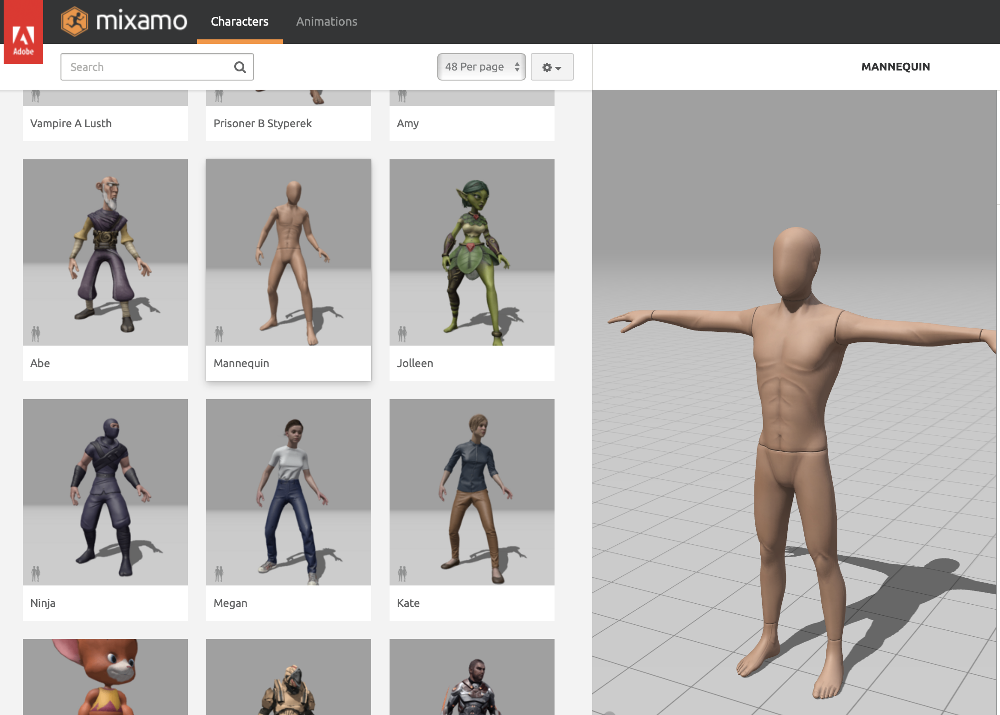
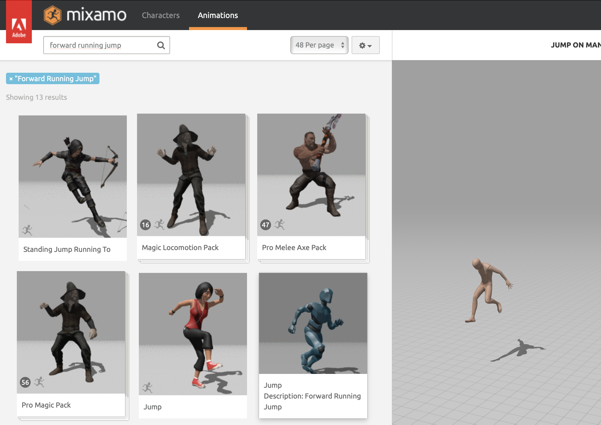
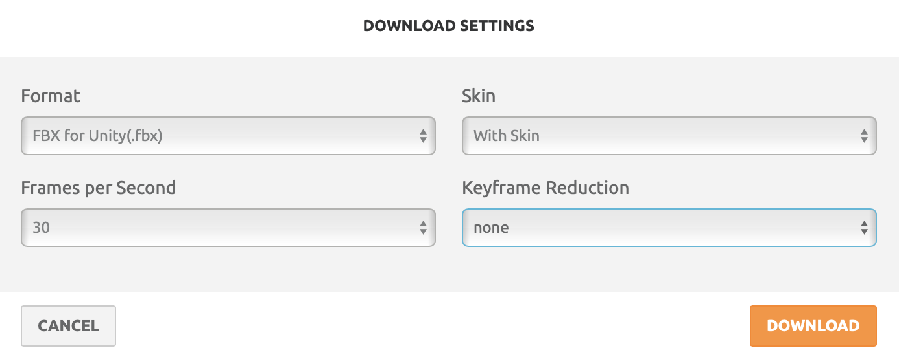
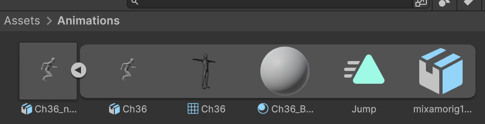
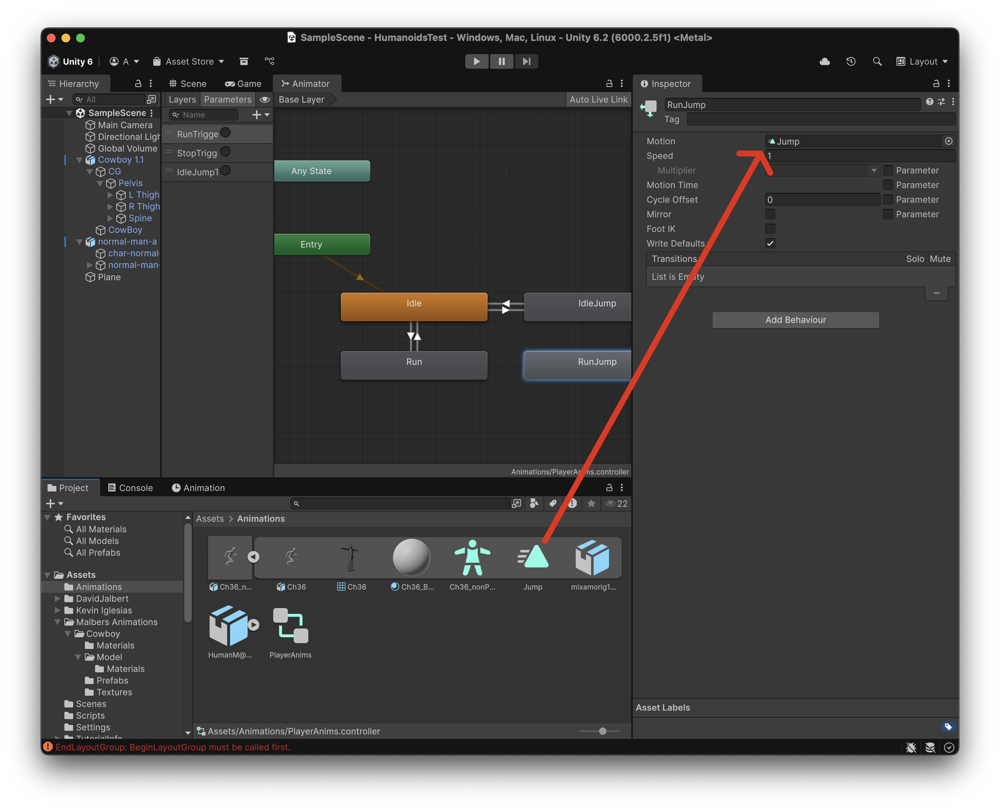
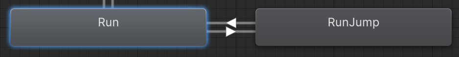

# Humanoides 02

## Animacions externes (Mixamo)

Fixa't que en aquest pack d'animacions no n'hi ha cap per saltar mentre el personatge corre. N'hem de buscar una.

[Mixamo](https://www.mixamo.com/) és una pàgina web d'**Adobe** que ofereix animacions de personatges. Registra't i ves a la pàgina:

- Primer cal escollir un personatge a l'apartat **"Characters"**

<center>

</center>
<br/>

> **Nota**: Tot i que només volem l'animació, necessitem l'avatar relacionat amb ella i per això descarreguem també un personatge, encara que no el necessitem.

- A l'apartat **"Animations"** busca **"forward running jump"** i escull l'animació de la imatge:

<center>

</center>
<br/>

- Apreta el botó **"Download"** i escull el format **"FBX for Unity (.fbx)"**

<center>

</center>
<br/>

- Arrossega l'arxiu descarregat cap a la carpeta **"Assets > Animations"**

- Veuràs que no té avatar.

<center>

</center>
<br/>

- Sel·lecciona l'objecte, i a l'inspector escull la pestanya **"Rig"** amb les opcions:

    - Animation Type: Humanoid
    - Avatar definition: Create from this model
    - Apreta el botó **"Apply"**
    - S'ha activat el botó **"Configure..."**
    - Apreta el botó **"Configure..."**
    - Desplega el camp **"Pose"**
    - Escull la opció **Enforce T-Pose"**
    - Apreta **"Apply"** 
    - Apreta **"Done"**

- A la finstra animator crea un nou estat amb el *botó dret* i **"Create State > Empty"**
- Anomena'l **"RunJump"**
- Assigna l'animació **Jump** de mixamo al camp **Motion** de l'estat **RunJump**

<center>

</center>
<br/>

- Crea dues transicions noves, entre **Run** i **RunJump**

<center>

</center>
<br/>

- Escull la transició de **Run** cap a **RunJump** i:

    - Desactiva la opció **Has Exit Time**
    - Afegeix una nova **"Condition"** i escull **"JumpTrigger"**

Modifica l'script del **Player**, per tenir en compte la nova animació:

```csharp
using UnityEngine;
using UnityEngine.InputSystem;

[RequireComponent(typeof(Animator))]
[RequireComponent(typeof(CharacterController))]
public class PlayerMoveAnimator : MonoBehaviour
{
    [Header("Refs")]
    public Camera cam;
    public Animator animator;
    public CharacterController cc;

    [Header("Animator params (Triggers)")]
    public string runTriggerName  = "RunTrigger";
    public string stopTriggerName = "StopTrigger";
    public string jumpTriggerName = "JumpTrigger";   // Idle/Run -> IdleJump / RunJump
    public string idleJumpStateName = "IdleJump";
    public string runJumpStateName  = "RunJump";

    [Header("Moviment")]
    public float moveSpeed = 3.5f;
    public float turnSpeed = 720f;
    public float inputDeadzone = 0.05f;

    [Header("Física bàsica")]
    public float gravity = -9.81f;
    public float groundedGravity = -2f;
    public float jumpForce = 4f;

    private InputAction moveAction;
    private InputAction jumpAction;

    private int runHash, stopHash, jumpHash;
    private bool isRunning = false;
    private float verticalVel = 0f;

    // --- recorda direcció de salt en moviment ---
    private Vector3 jumpDir = Vector3.zero;

    void OnEnable()
    {
        if (!animator) animator = GetComponentInChildren<Animator>(true);
        if (!cc) cc = GetComponent<CharacterController>();
        if (!cam) cam = Camera.main;

        runHash  = Animator.StringToHash(runTriggerName);
        stopHash = Animator.StringToHash(stopTriggerName);
        jumpHash = Animator.StringToHash(jumpTriggerName);

        moveAction = new InputAction("Move", type: InputActionType.Value);
        moveAction.AddCompositeBinding("2DVector")
            .With("Up", "<Keyboard>/w").With("Up", "<Keyboard>/upArrow")
            .With("Down", "<Keyboard>/s").With("Down", "<Keyboard>/downArrow")
            .With("Left", "<Keyboard>/a").With("Left", "<Keyboard>/leftArrow")
            .With("Right", "<Keyboard>/d").With("Right", "<Keyboard>/rightArrow")
            .With("Up", "<Gamepad>/leftStick/up").With("Down", "<Gamepad>/leftStick/down")
            .With("Left", "<Gamepad>/leftStick/left").With("Right", "<Gamepad>/leftStick/right");
        moveAction.Enable();

        jumpAction = new InputAction("Jump", binding: "<Keyboard>/space");
        jumpAction.AddBinding("<Gamepad>/buttonSouth");
        jumpAction.Enable();
    }

    void OnDisable()
    {
        moveAction?.Disable();
        jumpAction?.Disable();
    }

    void Update()
    {
        // --- Estat actual ---
        var st = animator.GetCurrentAnimatorStateInfo(0);
        bool inIdleJump = st.IsName(idleJumpStateName) || st.IsName("Base Layer." + idleJumpStateName);
        bool inRunJump  = st.IsName(runJumpStateName)  || st.IsName("Base Layer." + runJumpStateName);
        bool inJump = inIdleJump || inRunJump;

        // --- Input 2D ---
        Vector2 input = moveAction.ReadValue<Vector2>();
        if (input.magnitude < inputDeadzone) input = Vector2.zero;

        // --- Direcció segons càmera ---
        Vector3 forward = cam ? cam.transform.forward : Vector3.forward;
        forward.y = 0f; forward.Normalize();
        Vector3 right = cam ? cam.transform.right : Vector3.right;
        right.y = 0f; right.Normalize();
        Vector3 moveDir = (forward * input.y) + (right * input.x);
        if (moveDir.sqrMagnitude > 1e-6f) moveDir = moveDir.normalized;

        // --- MOVIMENT DURANT EL SALT ---
        if (inIdleJump)
        {
            // IdleJump: no moviment horitzontal
            moveDir = Vector3.zero;
        }
        else if (inRunJump)
        {
            // RunJump: conserva la direcció del moment del salt
            moveDir = jumpDir;
        }

        // --- Càlcul de velocitat horitzontal ---
        Vector3 horizontalVel = moveDir * moveSpeed;

        // --- Gravetat i impuls de salt ---
        if (cc.isGrounded)
        {
            if (verticalVel < 0f)
                verticalVel = groundedGravity;

            // SALT físic (només quan a terra)
            if (jumpAction.WasPressedThisFrame())
            {
                verticalVel = jumpForce;

                // Decideix quin tipus de salt fer
                if (isRunning)
                {
                    jumpDir = moveDir;        // memoritza direcció
                }
                else
                {
                    jumpDir = Vector3.zero;   // salt vertical pur
                }

                animator.SetTrigger(jumpHash);
            }
        }
        else
        {
            verticalVel += gravity * Time.deltaTime; // caiguda
        }

        // --- Aplica moviment ---
        Vector3 velocity = horizontalVel + Vector3.up * verticalVel;
        cc.Move(velocity * Time.deltaTime);

        // --- Rotació (no durant IdleJump, però sí durant RunJump) ---
        if (!inIdleJump && moveDir.sqrMagnitude > 1e-6f)
        {
            Quaternion targetRot = Quaternion.LookRotation(moveDir, Vector3.up);
            transform.rotation = Quaternion.RotateTowards(transform.rotation, targetRot, turnSpeed * Time.deltaTime);
        }

        // --- Idle <-> Run (no canviïs durant salts) ---
        bool moving = horizontalVel.sqrMagnitude > 1e-6f;
        if (!inJump)
        {
            if (moving && !isRunning)
            {
                animator.ResetTrigger(stopHash);
                animator.SetTrigger(runHash);
                isRunning = true;
            }
            else if (!moving && isRunning)
            {
                animator.ResetTrigger(runHash);
                animator.SetTrigger(stopHash);
                isRunning = false;
            }
        }
        else
        {
            if (isRunning)
            {
                animator.ResetTrigger(runHash);
                animator.SetTrigger(stopHash);
                isRunning = false;
            }
        }
    }
}
```

Prova el joc, amb el moviment i salts del personatge en mode **"Iddle"** i mode **"Run"**
