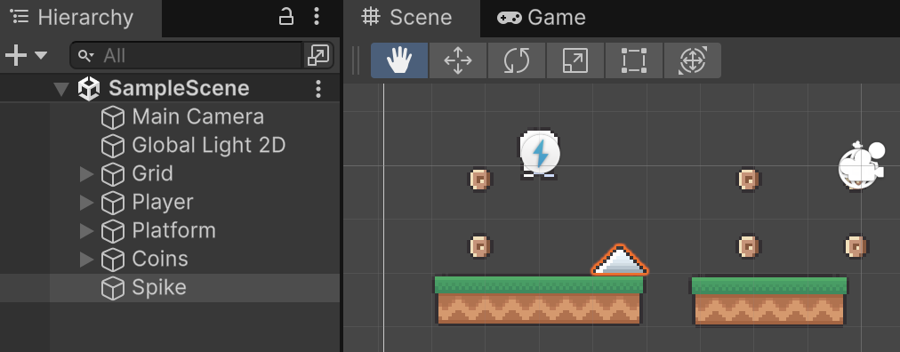
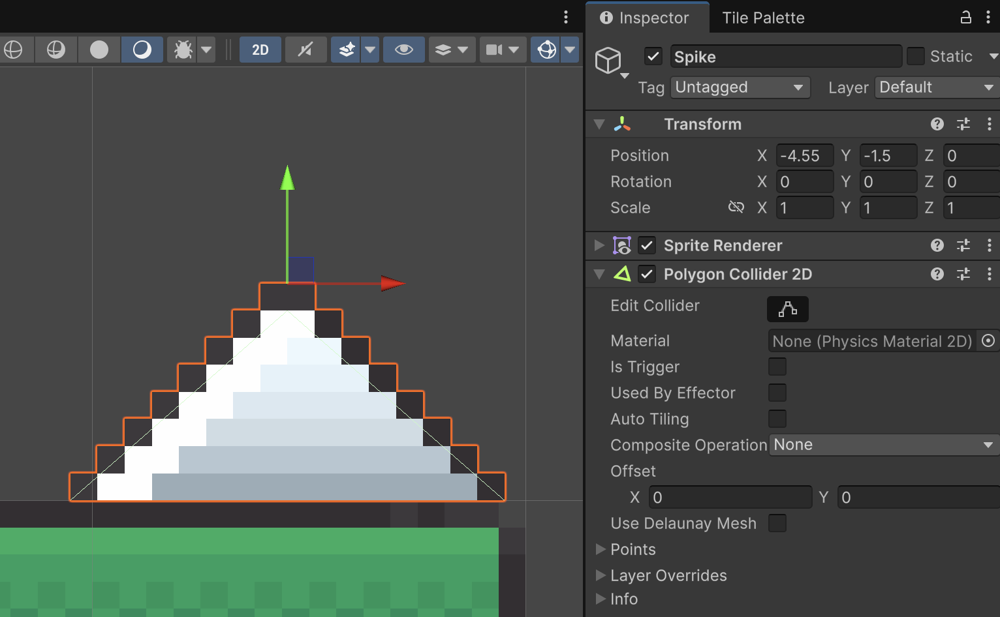
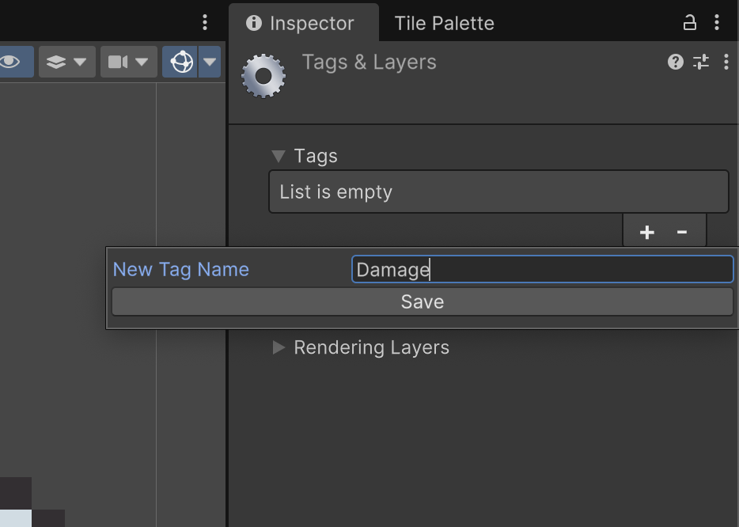
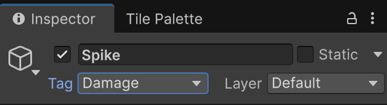

# Trampes (traps)

Les trampes poden produir dany al personatge.

## Definir trampes

Als *"Assets"*, des de la carpeta:

*Assets > Simple 2d Platformer BE2 > Sprites*

Desplega **"Objects"** i arrosega **"Spike"** cap a l'escena.

<center>

</center>
<br/>

Afegeix el component **"Polygon Colider 2D"**, que agafarà automàticament la forma dels píxels dibuixats.

<center>

</center>
<br/>

## Etiquetar objectes com a trampes

Necessitem *etiquetar* els objectes que produeixen mal amb un **Tag**, escull l'objecte **"Spike"** i al seu inspector la opció d'afegir un **Tag** (etiqueta).

<center>

</center>
<br/>

Com a nom de l'etiqueta defineix **"Damage"**

<center>

</center>
<br/>

Finalment, etiqueta l'objecte **"Spike"** amb el tag **"Damage"**

<center>

</center>
<br/>

## Script

Crea un nou script tipus "MonoBehaviour" anomenat **"PlayerDamage"** amb el següent codi. 

Afegeix el nou script com a component de l'objecte **"Player"**.

```csharp
using UnityEngine;
using System.Collections;
using System.Collections.Generic;

[RequireComponent(typeof(SpriteRenderer))]
public class PlayerDamage : MonoBehaviour
{
    [Header("Health")]
    [SerializeField] private int maxHealth = 100;
    [SerializeField] private int damagePerHit = 10;
    [SerializeField] private float damageCooldown = 0.3f; // temps mínim entre tics de dany
    [SerializeField] private string damageTag = "Damage";

    [Header("Damage Feedback")]
    [SerializeField] private int flashCount = 2;
    [SerializeField] private float flashDuration = 0.1f;

    private SpriteRenderer sr;
    private Color baseColor;

    private int health;
    private float nextDamageTime = 0f;

    // En comptes d'un bool, comptem quantes trampes ens solapen
    private int damageOverlapCount = 0;

    // Gestionar un únic coroutine de flash
    private Coroutine flashRoutine;
    private bool isFlashing = false;

    private void Awake()
    {
        sr = GetComponent<SpriteRenderer>();
        baseColor = sr.color;
        health = Mathf.Clamp(health <= 0 ? maxHealth : health, 0, maxHealth);
    }

    private void OnEnable()
    {
        // per si s'havia quedat en vermell per pauses o desactivacions
        StopFlashAndRestoreColor();
    }

    private void OnDisable()
    {
        StopFlashAndRestoreColor();
    }

    private void OnCollisionEnter2D(Collision2D col)
    {
        if (col.collider.CompareTag(damageTag))
            damageOverlapCount++;
    }

    private void OnCollisionExit2D(Collision2D col)
    {
        if (col.collider.CompareTag(damageTag))
        {
            damageOverlapCount = Mathf.Max(0, damageOverlapCount - 1);
            if (damageOverlapCount == 0) StopFlashAndRestoreColor();
        }
    }

    private void Update()
    {
        if (health <= 0) return;

        // Estem dins d'alguna trampa?
        bool inTrap = damageOverlapCount > 0;

        if (inTrap && Time.time >= nextDamageTime)
        {
            ApplyDamage(damagePerHit);
            nextDamageTime = Time.time + damageCooldown;
        }

        // Si ja no hi ha dany actiu, assegura color restaurat
        if (!inTrap && !isFlashing && sr.color != baseColor)
        {
            sr.color = baseColor;
        }
    }

    private void ApplyDamage(int amount)
    {
        int prev = health;
        health = Mathf.Max(0, health - amount);
        Debug.Log($"Vida: {prev} -> {health}");

        // Feedback de dany
        StartFlash();

        if (health <= 0)
        {
            // TODO: Lògica de GameOver
            StopFlashAndRestoreColor(); 
        }
    }

    private void StartFlash()
    {
        if (flashRoutine != null)
            StopCoroutine(flashRoutine);
        flashRoutine = StartCoroutine(FlashRed());
    }

    private void StopFlashAndRestoreColor()
    {
        if (flashRoutine != null)
        {
            StopCoroutine(flashRoutine);
            flashRoutine = null;
        }
        isFlashing = false;
        sr.color = baseColor;
    }

    private IEnumerator FlashRed()
    {
        isFlashing = true;

        for (int i = 0; i < flashCount; i++)
        {
            sr.color = Color.red;
            // Realtime evita quedar-se “penjat” si canvies Time.timeScale
            yield return new WaitForSecondsRealtime(flashDuration);

            sr.color = baseColor;
            yield return new WaitForSecondsRealtime(flashDuration);
        }

        isFlashing = false;
    }
}
```


