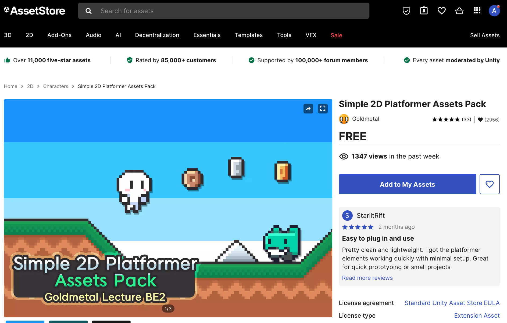

# Plataformes

En aquest tema veurem com fer un joc de plataformes amb Unity.

## Nou projecte

Crea un nou projecte Unity "Universal 2D" anometat "Platform".

## Arxius descarregats

També farem servir les imatges de fons:

<a href="./BackgroundImages.zip" download>Backgrounds</a> 
*("./BackgroundImages.zip")*

Descarrega l'arxiu, descomprimeix-lo i arrosegua'l als **"Assets"**

## Unity Asset Store

Farem servir un asset gratuït de la Unity Asset Store anomenat.

[Simple 2d platformer](https://assetstore.unity.com/packages/2d/characters/simple-2d-platformer-assets-pack-188518)

Posa'l a

 

Els assets s'afegeixen al teu compte de 'Unity', i cal obrir-los amb Unity per poder descarregar-los.

 

Unity té una utilitat que es diu **"Package Manager"** que serveix per gestionar els assets del teu compte.

Cal descarregar l'asset a l'ordinador.

 

Un cop descarregat, cal importar-lo al projecte.

 

Potser et demana que actualitzis alguns paquets, accepta.

Quan fas la importació pots escollir què vols importar exàctament, en aquest cas ho importarem tot.

Un cop importat, veuràs que s'ha creat una carpeta nova dins la carpeta **Assets** del projecte.

 

Ara ja hi ha els assets dins el projecte i els podem utilitzar.