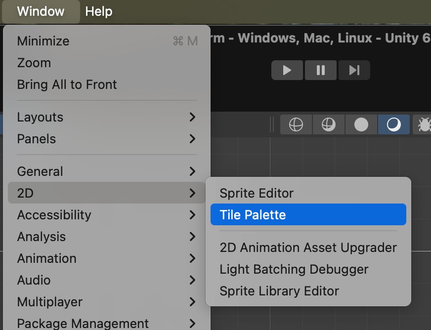
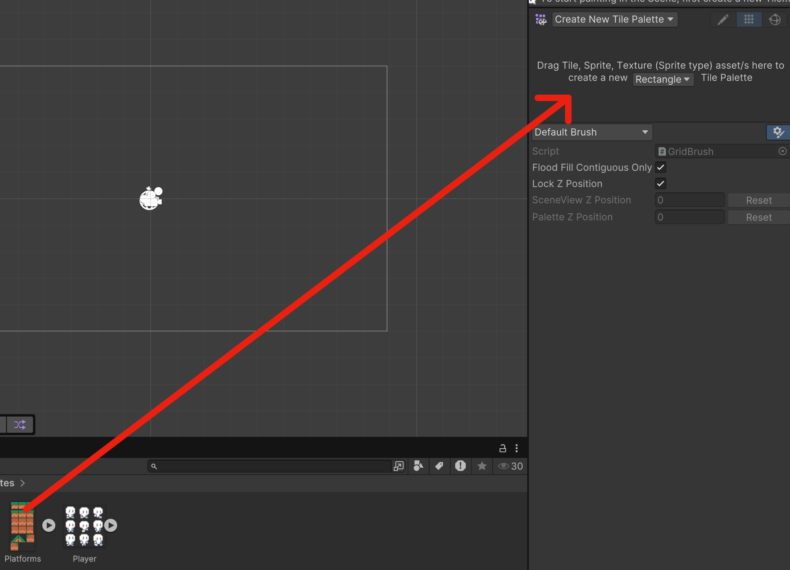
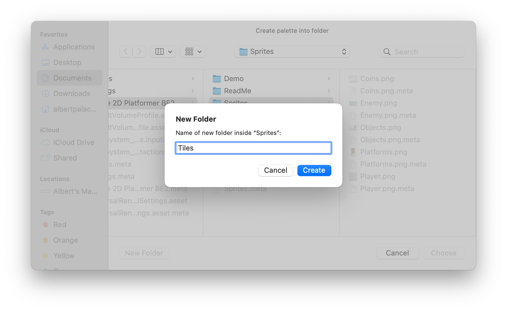
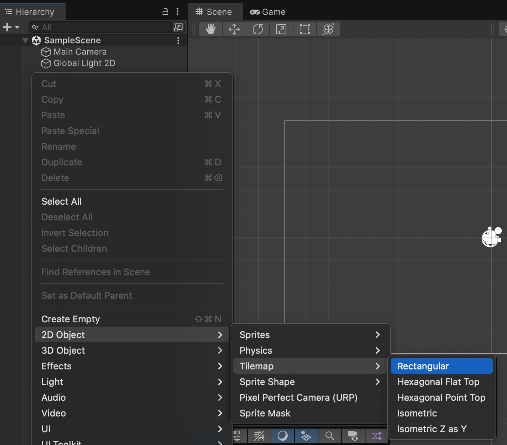
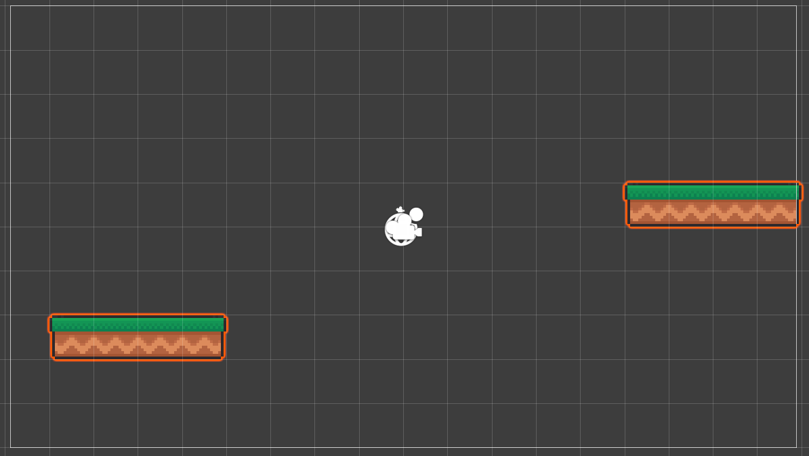
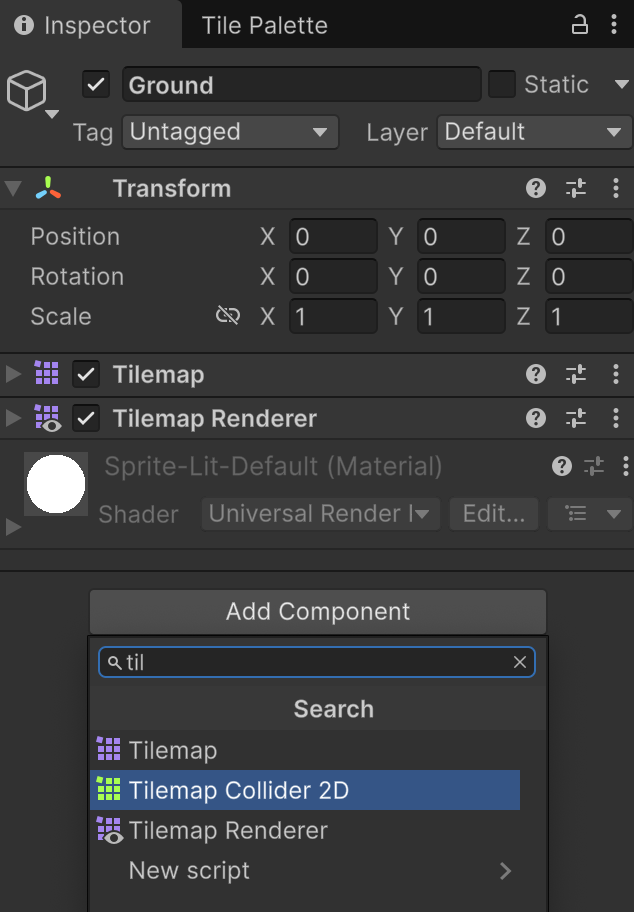

# Tilemap i plataformes

Tradicionalment, per aprofitar recursos gràfics, els jocs de plataformes utilitzen un sistema de "tiles" o *rajoles/tiles*.

Aquestes *rajoles/tiles* són imatges quadrades que es poden repetir per formar el terreny del joc.

## TileSet i TilePalette

Un **TileSet** és una imatge que conté diverses *rajoles/tiles* d'imatge.

Les imatges del TileSet, es poden fer servir per construir el mapa del joc.

Cal posar les imatges del TileSet en una paleta de *rajoles/tiles*, que es diu **TilePalette**.

Obre la pestanya/finestra de **TilePalette**.

 

Als assets, navega dins de:

*Assets > Simple 2D Platformer BE2 > Sprites*

Arrosega la imatge de **Platforms** a la paleta de *rajoles/tiles*.

 

Quan acabis d'arrossegar, et demanarà el nom de la carpeta on vols guardar les *rajoles/tiles*.

Crea una nova carpeta dins de *Assets* i posa-li de nom "Tiles".

I escull aquesta carpeta com a destinació.

## Tilemap

Per poder definir on van les imatges de les *rajoles/tiles*, cal crear un **Tilemap** de tipus *Rectangular*.

 

Renombra el *Tilemap* com a **"Ground"**.

Veuràs que apareix una graella, i que si tens una rajola seleccionada pots anar fent clic per anar posant les *rajoles/tiles*.

 

Per tal que aquest *Ground* xoqui amb els personatges, cal afegir-li un component de tipus **TilemapCollider2D**.

 

Automàticament, es marquen amb taronja les zones on hi ha *rajoles/tiles*.