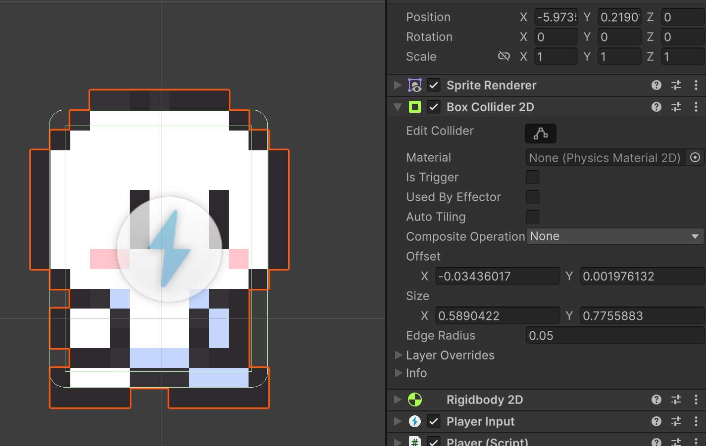

# Player

Afegirem un personatge animat al joc, a partir d'imatges d'sprite.

## Nou personatge

Per afegir un personatge al joc, cal crear un objecte.

El crearem arrossegant un **Sprite** de personatge a l'escena. Busca l'asset **"Idle 0"** dins de:

*Assets > Simple 2D Platformer BE2 > Sprites > Player > Idle 0*

Arrosega'l a sobre del terreny *Ground*, i anomena'l **"Player"**.

<center>

</center>
<br/>

Afegeix-li dos components:

- Un component de tipus **BoxCollider2D**.
- Un component de tipus **Rigidbody2D**.

Per tal d'evitar que el personatge giri amb la física, defineix:

- Gravity scale: 2, per tal que no salti massa
- *Constraints > Freeze Rotation Z*, per tal que no roti


<center>

</center>
<br/>

Edita la caixa de col·lisió del personatge, amb el botó de **Edit Collider**:

- Defineix *"Edge Radius"* a 0.05
- Canvia la mida de la caixa *verda* perquè sigui menor que el relleu del personatge.

<center>

</center>
<br/>

Fixa't que apareix com arrodonida als extrems. Per tal d'evitar problemes amb els canvis de rajoles/tiles.

## Moviment dreta/esquerra

A la carpeta **"Assets"**, crea un spript tipus "MonoBehaviour" anomenat **Player** i arrosega'l a l'inspector de l'objecte **Player**.

```csharp
using UnityEngine;
using UnityEngine.InputSystem;

[RequireComponent(typeof(Rigidbody2D), typeof(PlayerInput))]
public class Player : MonoBehaviour
{
    public float moveSpeed = 5f;

    private Rigidbody2D rb;
    private Vector2 move;

    void Awake()
    {
        rb = GetComponent<Rigidbody2D>();
    }

    // Input System: callback d'una acció "Move" (Vector2)
    void OnMove(InputValue value) { 
        move = value.Get<Vector2>();
    }

    void FixedUpdate()
    {
        // Moure el jugador a dreta i esquerra, preserva la gravetat
        rb.linearVelocity = new Vector2(move.x * moveSpeed, rb.linearVelocity.y);
    }
}
```

De l'script anterior:

- Força els components **Rigidbody2D** i **PlayerInput** a l'objecte.
- Manté la velocitat Y segons les físiques, i només canvia la velocitat X segons l'input.

Prova que el personatge cau sobre el terreny, i es mou amb les tecles de fletxa o les tecles A i D.

## Saltar

El personatge ha de poder saltar sobre el terreny i altres plataformes.

Per fer-ho genèric definirem el concepte de "jumpable", on hi apuntarem aquells objectes sobre els que es pot saltar.

Des de l'inspector de l'objecte **Ground**, crea una nova **Layer** anomenada **Jumpable**, i assigna-la a l'objecte **Ground**.

<center>

</center>
<br/>

<center>

</center>
<br/>

Assigna el nou layer **Jumpable** a l'objecte **Ground**.

<center>

</center>
<br/>

Finalment, cal afegir el cercle als peus del personatge, que farà la detecció de "jumpable".

Afegeix un cercle buit com a fill de l'objecte **"Player"**, anomena'l **"GroundCheck"**, i situa'l als peus del personatge.

<center>

</center>
<br/>

Anomena'l **"GroundCheck"** i situa'l als peus del personatge.

<center>

</center>
<br/>

A la carpeta **"Assets"**, afegeix un nou script tipus "MonoBehaviour" anomenat **PlayerJump** amb el següent codi, i afegeix-lo a l'objecte **"Player"**.


```csharp
using UnityEngine;
using UnityEngine.InputSystem;

[RequireComponent(typeof(Rigidbody2D))]
public class PlayerJump : MonoBehaviour
{
    [Header("Jump")]
    public float jumpForce = 10f;
    public float coyoteTime = 0.10f;
    public float jumpBufferTime = 0.10f;
    public bool variableJumpHeight = true;

    [Header("Jumpable Ground Check")]
    public float groundCheckRadius = 0.25f;
    public bool validateGroundNormal = true;
    [Range(0f, 1f)] public float groundNormalMinY = 0.4f;

    private Rigidbody2D rb;
    private Transform groundCheck;
    private LayerMask jumpableLayer;

    public bool isGrounded { get; private set; }
    private float lastGroundedTime = -999f;
    private float lastJumpPressedTime = -999f;

    void Awake()
    {
        rb = GetComponent<Rigidbody2D>();

        groundCheck = transform.Find("GroundCheck");
        if (!groundCheck)
            Debug.LogError("No s’ha trobat cap fill amb nom 'GroundCheck'.");

        int layerIndex = LayerMask.NameToLayer("Jumpable");
        if (layerIndex == -1)
            Debug.LogError("No existeix cap Layer 'Jumpable'. Crea-la al menú Layers!");
        else
            jumpableLayer = 1 << layerIndex; // Mask index to bit
    }

    public void OnJump(InputValue v)
    {
        if (v.isPressed)
        {
            lastJumpPressedTime = Time.time;
        }
        else if (variableJumpHeight)
        {
            if (rb.linearVelocity.y > 0f)
                rb.linearVelocity = new Vector2(rb.linearVelocity.x, rb.linearVelocity.y * 0.5f);
        }
    }

    void FixedUpdate()
    {
        UpdateGrounded();

        bool canCoyote = (Time.time - lastGroundedTime) <= coyoteTime;
        bool hasBufferedJump = (Time.time - lastJumpPressedTime) <= jumpBufferTime;

        if (hasBufferedJump && (isGrounded || canCoyote))
        {
            lastJumpPressedTime = -999f;

            rb.linearVelocity = new Vector2(rb.linearVelocity.x, 0f);
            rb.AddForce(Vector2.up * jumpForce, ForceMode2D.Impulse);
        }
    }

    private void UpdateGrounded()
    {
        bool hitSomething = false;
        Collider2D hitCollider = Physics2D.OverlapCircle(
            groundCheck.position, groundCheckRadius, jumpableLayer);

        if (hitCollider)
        {
            if (validateGroundNormal)
            {
                RaycastHit2D hit = Physics2D.Raycast(
                    groundCheck.position, Vector2.down, groundCheckRadius + 0.05f, jumpableLayer);
                hitSomething = hit.collider && hit.normal.y >= groundNormalMinY;
            }
            else
            {
                hitSomething = true;
            }
        }

        isGrounded = hitSomething;
        if (isGrounded) lastGroundedTime = Time.time;
    }

    void OnDrawGizmosSelected()
    {
        if (groundCheck)
        {
            Gizmos.color = Color.green;
            Gizmos.DrawWireSphere(groundCheck.position, groundCheckRadius);
        }
    }
}
```


