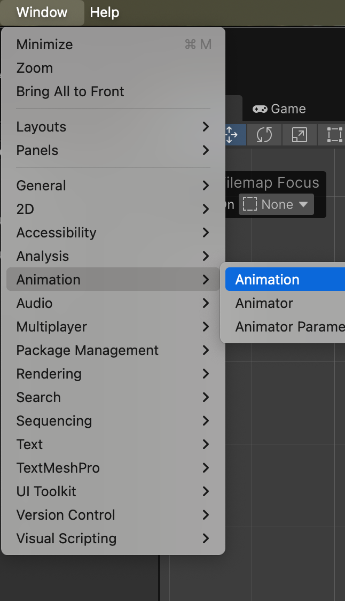
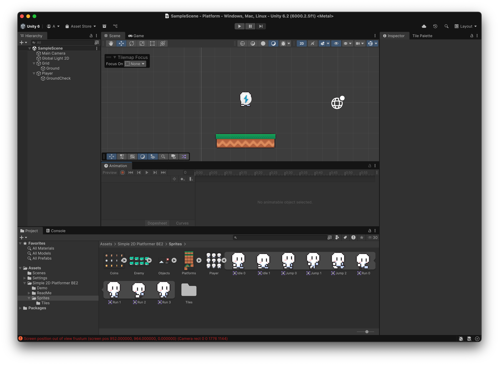
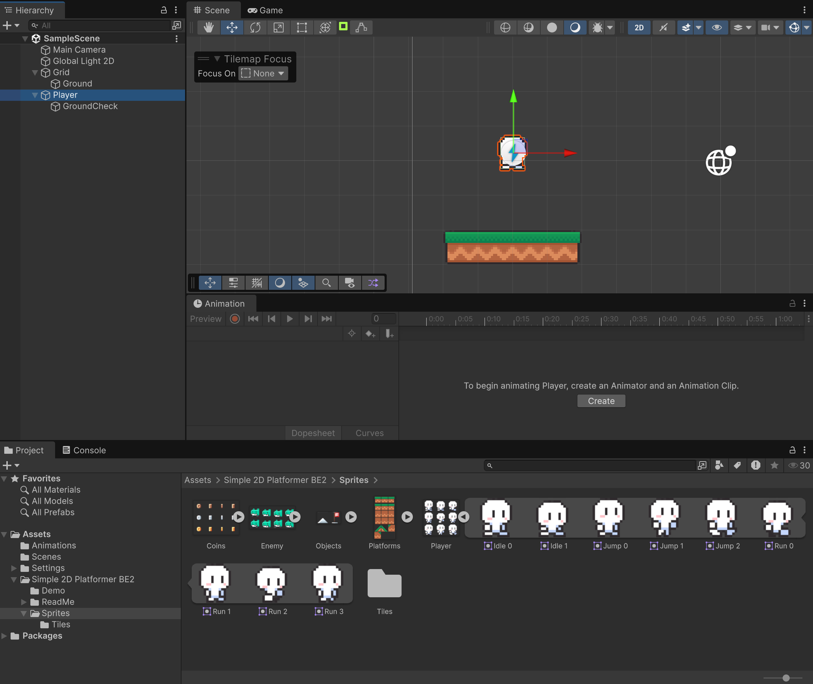
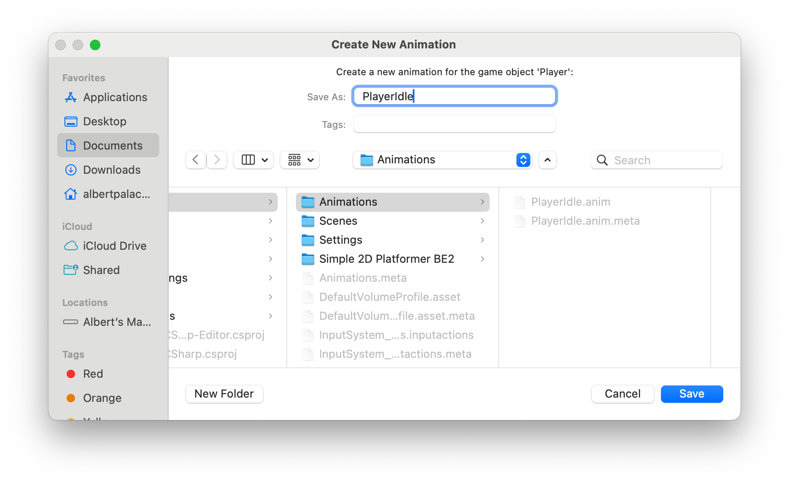
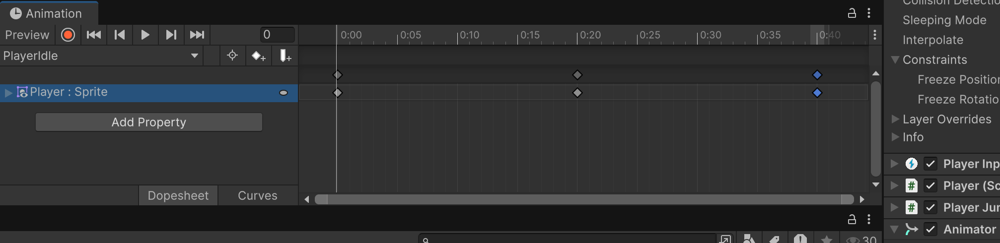
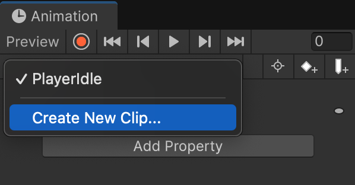
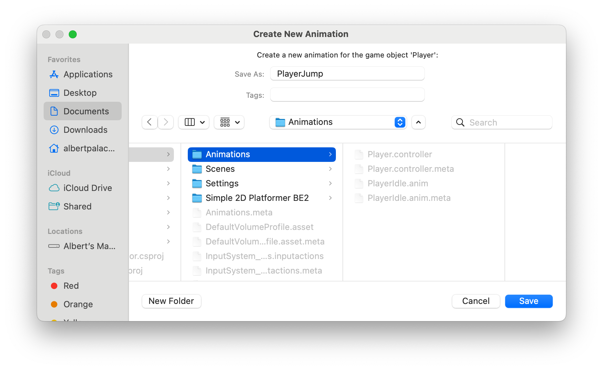
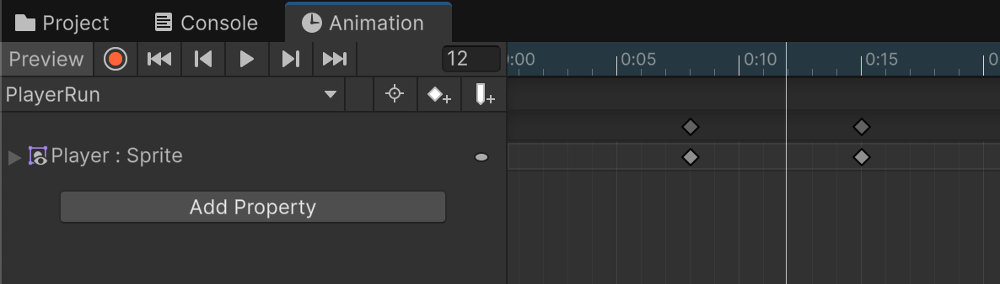
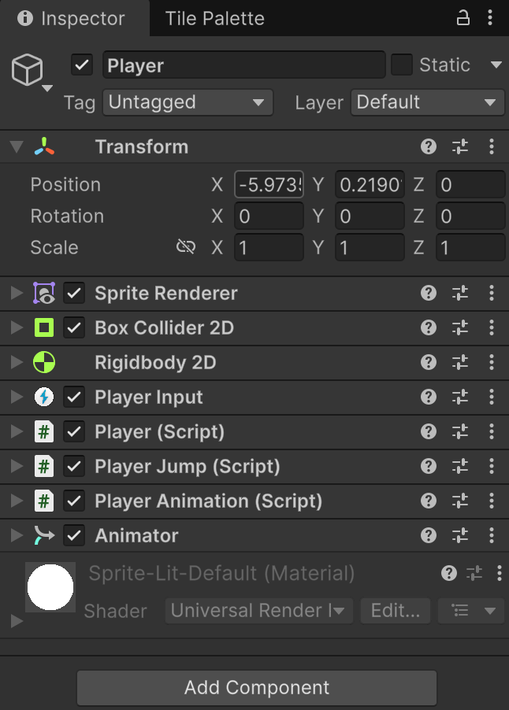

# Animacions

Les animacions es formen a partir de diverses imatges que es van mostrant en seqüència.

Es canvia d'animació, segons l'estat del personatge (quiet, caminant, saltant...).

## Animació per defecte (PlayerIdle)

Obra la finestra d'animacions:

*Window > Animation > Animation*

<center>

</center>
<br/>

Arrossega la pestanya **"animation"** a l'editor de Unity, per tenir-la a mà.

<center>

</center>
<br/>

A **"Assets"**, crea una carpeta nova anomenada **"Animations"**.

Selecciona el personatge "Player" i apreta el botó **"Create"** de la finestra d'animacions.

<center>

</center>
<br/>

Guarda l'animació a la nova carpeta **"Animations"** amb el nom **"PlayerIdle"**.

<center>

</center>
<br/>

Arrosega els sprites:

- "Idle 0" a la posició 0:00
- "Idle 1" a la posició 0:20
- "Idle 0" a la posició 0:40

Assegura't que el "check" de animator està activat.

<center>

</center>
<br/>

Si proves el joc, veuràs que el personatge es mou.

## Definir més animacions

Cal definir les diferents animacions del personatge.

### PlayerJump

A la secció d'animacions, crea un nou clip anomenat **"PlayerJump"**.

<center>

</center>
<br/>

Guarda'l a la carpeta **"Animations"**.

<center>

</center>

Posa-hi els següents sprites:

- "Jump 0" a la posició 0:00
- "Jump 1" a la posició 0:10
- "Jump 1" a la posició 5:00

El motiu és que es quedi en aquesta posició durant tot el salt.

### PlayerFall

A la secció d'animacions, crea un nou clip anomenat **"PlayerFall"**. Guarda'l a la carpeta **"Animations"**.

Posa-hi el següent sprite:

- "Jump 2" a la posició 0:00

### PlayerRun

A la secció d'animacions, crea un nou clip anomenat **"PlayerRun"**. Guarda'l a la carpeta **"Animations"**.

Posa-hi els següents sprites:

- "Run 0" a la posició 0:00
- "Run 1" a la posició 0:08
- "Run 2" a la posició 0:15
- "Run 3" a la posició 0:22
- "Run 3" a la posició 0:30

Aparta la pestanya d'animacions amb els *"tabs"* de projecte i consola, o tancal-la.

<center>

</center>
<br/>

## Codi d'animacions

Al script **"PlayerJump"**, afegeix aquesta funció per saber si el personatge està a terra o no:

```csharp
    public bool getIsGrounded() {
        return isGrounded;
    }
```

Crea un nou script tipus "MonoBehaviour" anomenat **"PlayerAnimation"**, posa-hi el següent codi i arrosega'l al personatge "Player" com un nou component:

```csharp
using UnityEngine;

[RequireComponent(typeof(Rigidbody2D), typeof(Animator))]
public class PlayerAnimation : MonoBehaviour
{
    private Rigidbody2D rb;
    private PlayerJump playerJump; // per saber si està a terra
    private Animator animator;
    private string currentAnimationState;

    void Awake()
    {
        rb = GetComponent<Rigidbody2D>();
        playerJump = GetComponent<PlayerJump>();
        animator = GetComponent<Animator>();
    }

    void Update()
    {
        SetAnimation();
    }

    private void SetAnimation()
    {
        float vy = rb.linearVelocity.y;

        if (playerJump.getIsGrounded())
        {
            if (Mathf.Approximately(rb.linearVelocity.x, 0f))
                ChangeAnimationState("PlayerIdle");
            else
                ChangeAnimationState("PlayerRun");
        }
        else
        {
            if (vy > 0f) ChangeAnimationState("PlayerJump");
            else         ChangeAnimationState("PlayerFall");
        }
    }

    private void ChangeAnimationState(string newState)
    {
        if (currentAnimationState == newState) return;
        animator.Play(newState);
        currentAnimationState = newState;
    }
}
```

Així queda l'inspector del personatge "Player":

<center>

</center>
<br/>

Per tal que el personatge es giri segons la direcció. Modifica l'script **"PlayerAnimation.cs"**:

- Afegeix aquesta variable:

```csharp
    private SpriteRenderer spriteRenderer; 
```

- Modifica la funció **Awake()**:

```csharp
    void Awake()
    {
        rb = GetComponent<Rigidbody2D>();
        playerJump = GetComponent<PlayerJump>();
        animator = GetComponent<Animator>();
        spriteRenderer = GetComponent<SpriteRenderer>();
    }
```

- Modifica la funció **Update()**:

```csharp
    void Update()
    {
        SetAnimation();
        
        // Canvia l'orientació segons la direcció en X
        if (rb.linearVelocity.x < -0.01f)
            spriteRenderer.flipX = true;
        else if (rb.linearVelocity.x > 0.01f)
            spriteRenderer.flipX = false;

    }
```