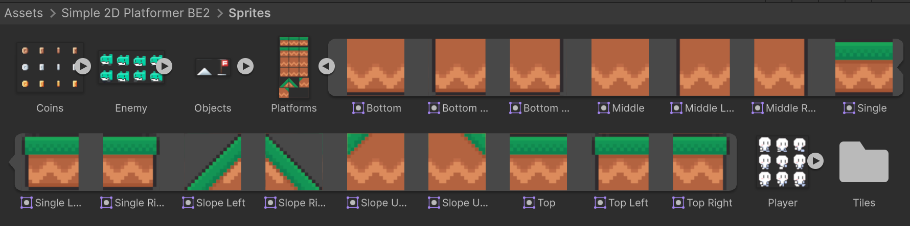
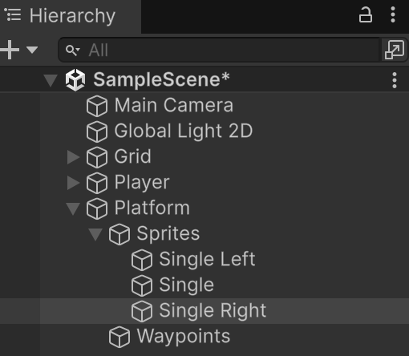
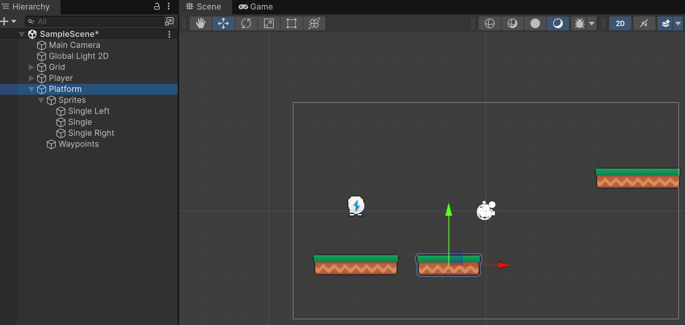
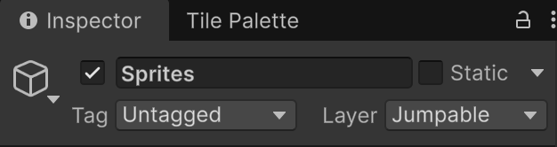
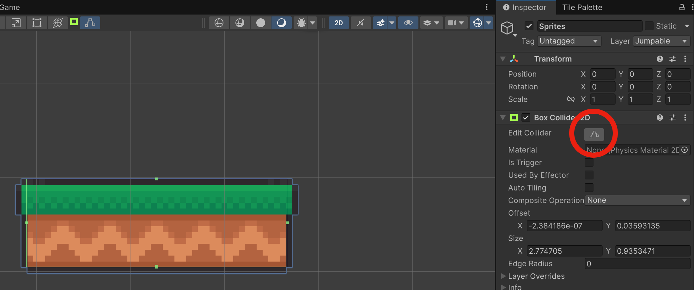
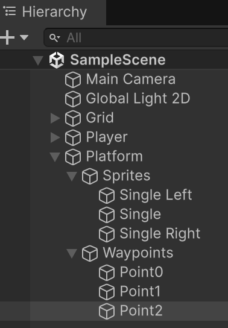
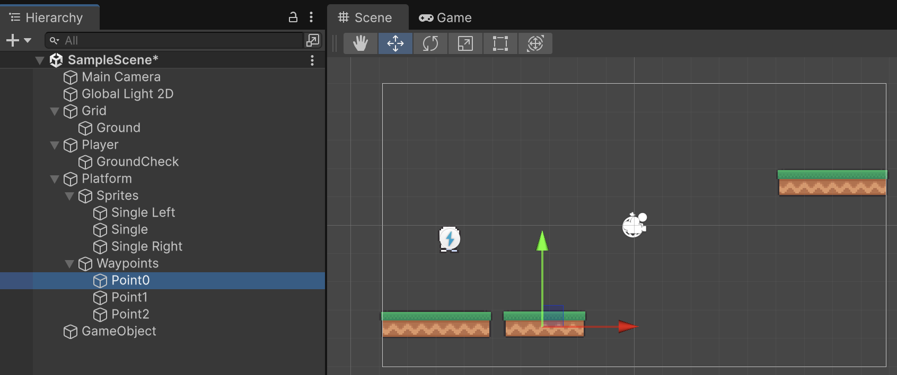
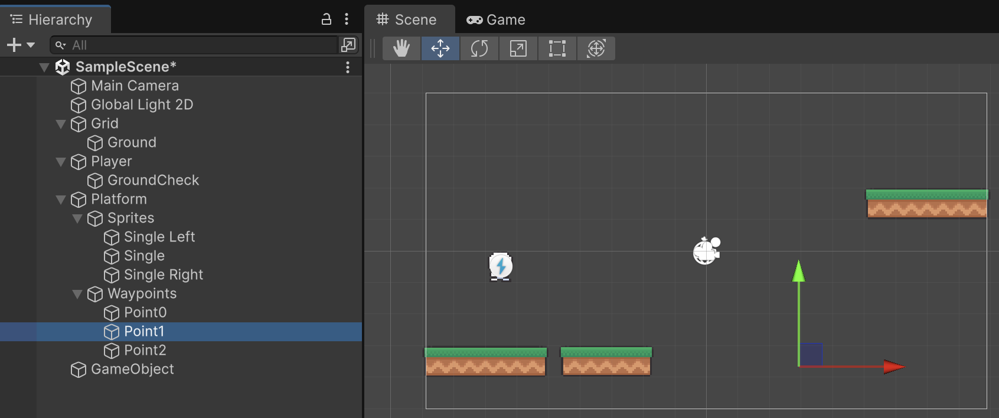
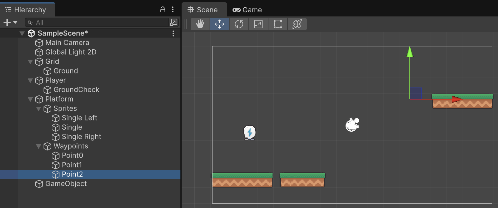

# Plataformes

Les plataformes són objectes que s'animen entre varies posicions.

Crea un objecte buit amb **"Create Empty"** a l'escena i anomena'l **"Platform"**.

Dins de l'objecte **Platform**, crea dos objectes més:

- Un objecte buit anomenat **"Sprites"** que tindrà els gràfics.
- Un objecte buit anomenat **"Waypoints"** que tindrà els punts que defineixen el recorregut.

## Sprites

Els sprites són les imatges que es veuran.

Des dels *"Assets"*:

*Assets > Simple 2D Platformer BE2 > Sprites*

Desplega l'objecte **"Platforms"**

<center>

</center>
<br/>

**Important!** No et confonguis amb els Tiles!

Arrosega els sprites [Single Left, Single, Single Right] a l'escena. I mou-los dins de l'objecte **Platform > Sprites**.

<center>

</center>
<br/>

Defineix les següents posicions:

- Single Left X = -1
- Single Left Y = 0
- Single X = 0
- Single Y = 0
- Single Right X = 1
- Single Right Y = 0

De manera que quedin de costat.

<center>

</center>
<br/>

Fes que l'objecte **"Sprites"** sigui 'Jumpable'.

**Important!** Et demanarà si vols fer els objectes fills també 'Jumpable'. No cal, es pot dir que **NO**.

<center>

</center>
<br/>

Afegeix un component **BoxCollider2D** a l'objecte **"Sprites"**. I adapta la mida de la caixa al tamany dels sprites amb el botó **Edit Collider**.

<center>

</center>
<br/>

Afegeix un component **Rigidbody2D** a l'objecte **"Sprites"**. I posa:

- **Body Type**: Kinematic

<center>

</center>
<br/>

## Waypoints

Els waypoints són els punts per on es mourà la plataforma.

Defineix tres elements buits *(Create Empty)* dins de l'objecte **Waypoints**. I anomena'ls **"Point0", "Point1", "Point2"**.

<center>

</center>
<br/>

Col·loca'ls a les posicions per on vols que passi la plataforma.

<center>

</center>
<center>

</center>
<center>

</center>
<br/>

A l'exemple:

- Point0 X: 3
- Point0 Y: -2.89
- Point1 X: 9
- Point1 Y: -2.89
- Point2 X: 9
- Point2 Y: -2

## Scripts

### Platform.cs

Crea un script tipus **MonoBehaviour** anomenat **"Platform"** i arrossega'l a l'objecte **Platform**.

```csharp
using System.Collections.Generic;
using UnityEngine;

public class Platform : MonoBehaviour
{
    [Header("References (autodetect by name if empty)")]
    [SerializeField] private Transform spritesParent;   // el contenidor "Sprites"
    [SerializeField] private Transform waypointsRoot;   // el contenidor "Waypoints"

    [Header("Movement")]
    [SerializeField] private float speed = 2f;          // unitats/segon
    [SerializeField] private bool pingPong = true;      // si false, fa loop 0->1->2->0...
    [SerializeField] private float waitAtPoint = 0f;    // pausa a cada punt
    [SerializeField] private bool startAtClosest = true;// començar al punt més proper a Sprites

    private readonly List<Transform> points = new();
    private Rigidbody2D spritesRb;
    private int idx = 0;
    private int dir = 1; // 1 endavant, -1 enrere
    private bool moving = true;

    public Vector2 surfaceVelocity { get; private set; }

    void Awake()
    {
        // Autodetecció per nom si no s’ha assignat
        if (!spritesParent)  spritesParent  = transform.Find("Sprites");
        if (!waypointsRoot)  waypointsRoot  = transform.Find("Waypoints");

        if (!spritesParent || !waypointsRoot)
        {
            Debug.LogError("[MovingPlatformSprites] Falta 'Sprites' o 'Waypoints' com a fills de Platform.");
            enabled = false;
            return;
        }

        // Recol·lecta els Waypoints en l’ordre de la jerarquia
        points.Clear();
        for (int i = 0; i < waypointsRoot.childCount; i++)
        {
            var wp = waypointsRoot.GetChild(i);
            if (wp.gameObject.activeInHierarchy) points.Add(wp);
        }

        if (points.Count < 2)
        {
            Debug.LogWarning("[MovingPlatformSprites] Es necessiten almenys 2 waypoints.");
            enabled = false;
            return;
        }

        spritesRb = spritesParent.GetComponent<Rigidbody2D>();
        if (spritesRb)
        {
            spritesRb.bodyType = RigidbodyType2D.Kinematic;
            spritesRb.constraints = RigidbodyConstraints2D.FreezeRotation;
        }

        // Punt inicial
        if (startAtClosest)
        {
            float best = float.MaxValue;
            for (int i = 0; i < points.Count; i++)
            {
                float d = Vector2.SqrMagnitude(points[i].position - spritesParent.position);
                if (d < best) { best = d; idx = i; }
            }
        }
        else
        {
            idx = 0;
        }

        // Col·loca Sprites exactament al punt inicial
        SetSpritesPosition(points[idx].position);
    }

    void FixedUpdate()
    {
        if (!moving) { surfaceVelocity = Vector2.zero; return; }

        var target = points[NextIndexPreview()].position;
        var current = spritesParent.position;
        float step = speed * Time.fixedDeltaTime;

        Vector2 nextPos = Vector2.MoveTowards(current, target, step);
        // velocitat de la plataforma aquest frame
        surfaceVelocity = (nextPos - (Vector2)current) / Time.fixedDeltaTime;

        MoveSprites(nextPos);

        if ((Vector2)current == (Vector2)nextPos && Vector2.Distance(nextPos, target) < 0.001f)
        {
            AdvanceIndex();
            if (waitAtPoint > 0f) StartCoroutine(WaitAndResume(waitAtPoint));
        }
    }

    System.Collections.IEnumerator WaitAndResume(float t)
    {
        moving = false;
        yield return new WaitForSeconds(t);
        moving = true;
    }

    int NextIndexPreview()
    {
        // Quina diana tenim ara mateix?
        int next = idx + dir;
        if (pingPong)
        {
            if (next >= points.Count) { dir = -1; next = idx + dir; }
            else if (next < 0)        { dir =  1; next = idx + dir; }
        }
        else
        {
            if (next >= points.Count) next = 0;
            else if (next < 0)        next = points.Count - 1;
        }
        return next;
    }

    void AdvanceIndex()
    {
        idx = NextIndexPreview();
    }

    void MoveSprites(Vector2 worldPos)
    {
        if (spritesRb) spritesRb.MovePosition(worldPos);
        else           spritesParent.position = worldPos; // fallback si no hi ha RB
    }

    void SetSpritesPosition(Vector2 worldPos)
    {
        if (spritesRb) spritesRb.position = worldPos;
        else           spritesParent.position = worldPos;
    }

    // Dibuixa el camí als Gizmos per veure’n l’ordre
    void OnDrawGizmosSelected()
    {
        var root = waypointsRoot ? waypointsRoot : transform.Find("Waypoints");
        if (!root) return;

        // Recull punts “al vol” per als gizmos
        var gizmoPts = new List<Transform>();
        for (int i = 0; i < root.childCount; i++) gizmoPts.Add(root.GetChild(i));
        if (gizmoPts.Count < 2) return;

        Gizmos.color = Color.cyan;
        for (int i = 0; i < gizmoPts.Count - 1; i++)
            Gizmos.DrawLine(gizmoPts[i].position, gizmoPts[i + 1].position);

        if (!pingPong)
            Gizmos.DrawLine(gizmoPts[^1].position, gizmoPts[0].position);

        // Punts
        Gizmos.color = Color.yellow;
        foreach (var p in gizmoPts) Gizmos.DrawSphere(p.position, 0.05f);
    }
}
```

### PlayerJump.cs

Modifica l'script **"PlayerJump.cs"** per:

- Afegir la variable *GroundCollider* per saber en quin terra estem.
- Modifica la funció *UpdateGrounded* per assignar el collider.

```csharp
    // Al final de les declaracions
    public Collider2D GroundCollider { get; private set; }
```

```csharp
    private void UpdateGrounded()
    {
        bool hitSomething = false;
        GroundCollider = Physics2D.OverlapCircle(groundCheck.position, groundCheckRadius, jumpableLayer);

        if (GroundCollider)
        {
            if (validateGroundNormal)
            {
                RaycastHit2D hit = Physics2D.Raycast(
                    groundCheck.position, Vector2.down, groundCheckRadius + 0.05f, jumpableLayer);
                hitSomething = hit.collider && hit.normal.y >= groundNormalMinY;
            }
            else hitSomething = true;
        }

        isGrounded = hitSomething;
        if (isGrounded) lastGroundedTime = Time.time;
    }
```

### Player.cs

Modifica l'script **"Player.cs"**:

- Afegir la variable *PlayerJump*
- Modifica la funció *Awake*, per iniciaritzar la variable *PlayerJump*
- Afegeix la funció *OnMove* per rebre l'input
- Modifica la funció *FixedUpdate* per tenir en compte la plataforma

```csharp
using UnityEngine;
using UnityEngine.InputSystem;

[RequireComponent(typeof(Rigidbody2D), typeof(PlayerInput))]
public class Player : MonoBehaviour
{
    public float moveSpeed = 5f;

    private Rigidbody2D rb;
    private Vector2 move;

    private PlayerJump playerJump;

    void Awake()
    {
        rb = GetComponent<Rigidbody2D>();
        playerJump = GetComponent<PlayerJump>();
    }

    public void OnMove(InputValue v)
    {
        move = v.Get<Vector2>();
    }

    void FixedUpdate()
    {
        float vx = move.x * moveSpeed;

        // si estem a terra i el terra és una plataforma mòbil, suma la seva velocitat X
        if (playerJump != null && playerJump.isGrounded)
        {
            var groundCol = playerJump.GroundCollider;
            if (groundCol)
            {
                // el collider acostuma a estar al fill "Sprites"; puja al pare que porta Platform
                var platform = groundCol.GetComponentInParent<Platform>();
                if (platform != null) vx += platform.surfaceVelocity.x;
            }
        }

        rb.linearVelocity = new Vector2(vx, rb.linearVelocity.y);
    }
}
```

### PlayerAnimation.cs

Per evitar que el personatge mostri l'animació de moviment, quan està quiet a sobre de la plataforma. Cal modificar l'script **"PlayerAnimation".

Defineix una nova variable, *"idleThreshold"* per decidir si el jugador està realment aturat a la plataforma.
```csharp
[SerializeField] private float idleThreshold = 0.05f;
```

Afegeix la nova funció que calcula la velocitat relativa:
```csharp
    private float GetRelativeVx()
    {
        // Velocitat X relativa al terra (si és plataforma mòbil, restem la seva).
        float vx = rb.linearVelocity.x;

        if (playerJump != null && playerJump.isGrounded)
        {
            var groundCol = playerJump.GroundCollider;       // exposat per PlayerJump
            if (groundCol)
            {
                var platform = groundCol.GetComponentInParent<Platform>();
                if (platform != null)
                    vx -= platform.surfaceVelocity.x;         // restem la velocitat de la plataforma
            }
        }
        return vx;
    }
```

Modifica la funció **"SetAnimation"** per fer servir la nova funció de càlcul de la posició relativa:
```csharp
    private void SetAnimation()
    {
        float vy = rb.linearVelocity.y;

        if (playerJump.isGrounded)
        {
            float vxRel = GetRelativeVx();
            if (Mathf.Abs(vxRel) <= idleThreshold)
                ChangeAnimationState("PlayerIdle");
            else
                ChangeAnimationState("PlayerRun");
        }
        else
        {
            if (vy > 0f) ChangeAnimationState("PlayerJump");
            else ChangeAnimationState("PlayerFall");
        }
    }
```