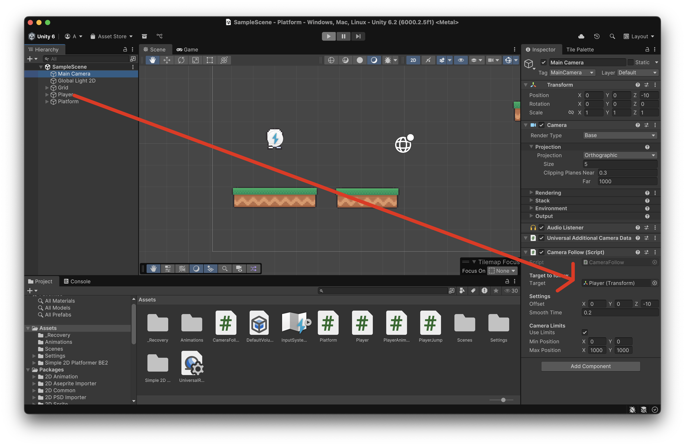
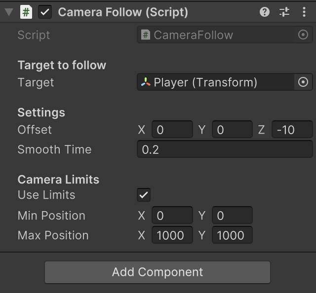

# Càmera

És habitual que la càmera segueixi al jugador, dins d'uns limits.

Crea l'script **"CameraFollow"** amb el següent codi, i afegeix-lo com a component a l'objecte **"Main Camera"**

```csharp
using UnityEngine;

public class CameraFollow : MonoBehaviour
{
    [Header("Target to follow")]
    [SerializeField] private Transform target;   // El jugador

    [Header("Settings")]
    [SerializeField] private Vector3 offset = new Vector3(0f, 0f, -10f);
    [SerializeField] private float smoothTime = 0.2f;

    [Header("Camera Limits")]
    public bool useLimits = false;
    public Vector2 minPosition;   // límit inferior esquerra
    public Vector2 maxPosition;   // límit superior dreta

    private Vector3 velocity = Vector3.zero;

    void LateUpdate()
    {
        if (!target) return;

        // Posició desitjada
        Vector3 desiredPos = target.position + offset;

        // Moviment suau
        Vector3 smoothedPos = Vector3.SmoothDamp(transform.position, desiredPos, ref velocity, smoothTime);

        // Aplica límits si estan activats
        if (useLimits)
        {
            smoothedPos.x = Mathf.Clamp(smoothedPos.x, minPosition.x, maxPosition.x);
            smoothedPos.y = Mathf.Clamp(smoothedPos.y, minPosition.y, maxPosition.y);
        }

        transform.position = smoothedPos;
    }
}
```

Assigna el **"Player"**, com a l'objecte que s'ha de seguir, arrossegant l'objecte **"Player"** a l'espai **"Target to follow > Target"** de l'script de la **"Camera"**

<center>

</center>

Activa i defineix els limits pels que es pot moure la càmera:

<center>

</center>
<br/>

Prova el joc, la càmera ha de seguir al **"Player"**, excepte al principi de la pantalla.