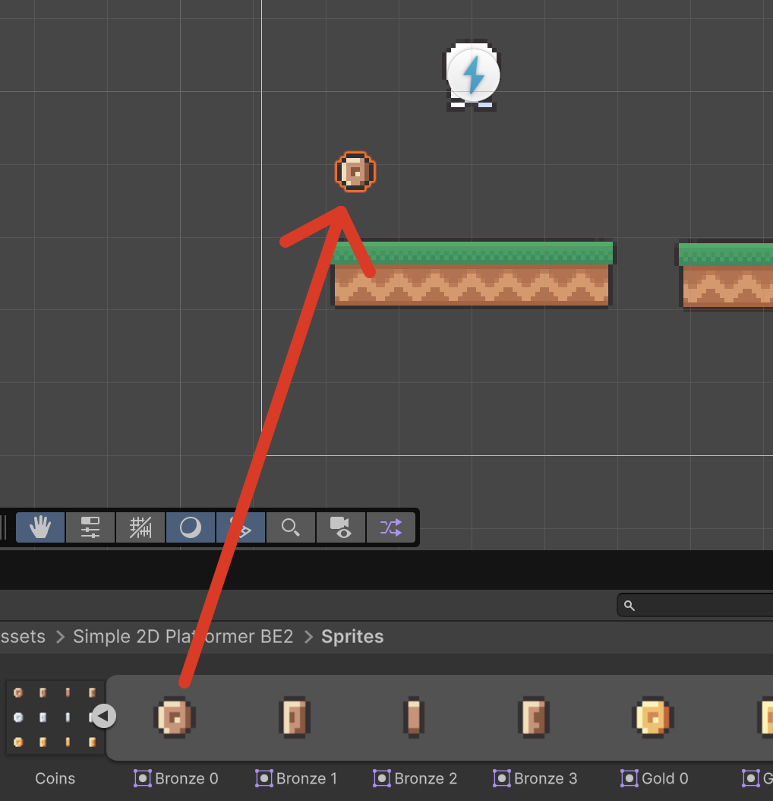
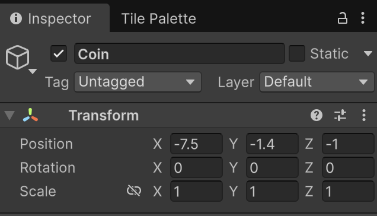
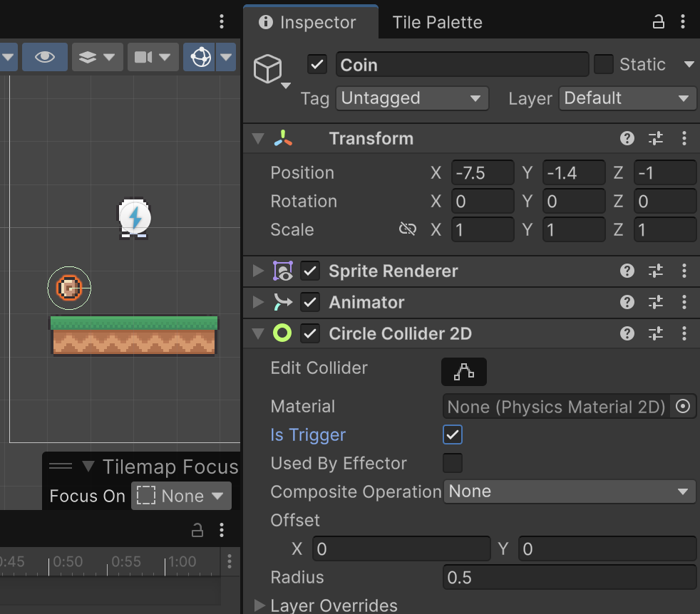
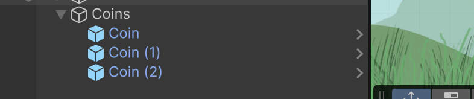

# Items

Els items són objectes que el jugador pot recollir, com monedes, power-ups, etc. 

Als *"Assets"*, des de la carpeta:

*Assets > Simple 2d Platformer BE2 > Sprites*

Desplega **"Coins"** i arrosega **"Bronze 0"** cap a l'escena.

<center>

</center>
<br/>

Canvia el nom a **"Coin"**

Obre la finestra d'animacions:

*Menú Window > Animation > Animation*

Amb l'objecte **"Coin"** sel·leccionat, crea una nova animació.

Guarda l'animació dins de **"Animations"** amb el nom **"CoinRotation"**

Arrosega els sprites:

- "Bronze 0" a la posició 0:00
- "Bronze 1" a la posició 0:10
- "Bronze 2" a la posició 0:20
- "Bronze 3" a la posició 0:30
- "Bronze 0" a la posició 0:40

Al inspector, defineix la posició Z de la **"Coin"** a **-1** per tal que quedi sempre per sobre del personatge.

<center>

</center>
<br/>

Afegeix un component tipus **"Circle collider 2d"** a l'objecte **"Coin"**.

Activa la opció **"Is trigger"** de l'objecte **"Coin"**

<center>

</center>
<br/>

## Scripts

Modifica l'script **"Player"** per afegir un contador de monedes:

```csharp
public int coins = 0;
```

Crea un nou script tipus "Monobehaviour Script" que es digui **"Coins"** i afegeix-lo com a component de l'objecte **"Coin"** arrosegant-lo a l'inspector.

```csharp
using UnityEngine;

public class Coin : MonoBehaviour
{
    private void OnTriggerEnter2D(Collider2D other)
    {
        Player player = other.GetComponent<Player>();
        if (player != null)
        {
            player.coins++;
            Debug.Log("Monedes recollides: " + player.coins);

            // Actualitza el HUD
            var hud = FindFirstObjectByType<UIHUD>();
            if (hud != null) hud.UpdateCoins(player.coins);

            Destroy(gameObject);
        }
    } 
}
```

Fes un nou objecte buit amb **"Create Empty"** a la jerarquia d'objectes, anomenat **"Coins"**. 

Mou l'objecte **"Coin"** dins del nou objecte i copia'l tants cops com vulguis.

<center>

</center>
<br/>

Fixa't que quan s'executa el joc, els objectes desapareixen de la llista al agafar-los (alliberant memòria). Això ho fa el *Destroy*