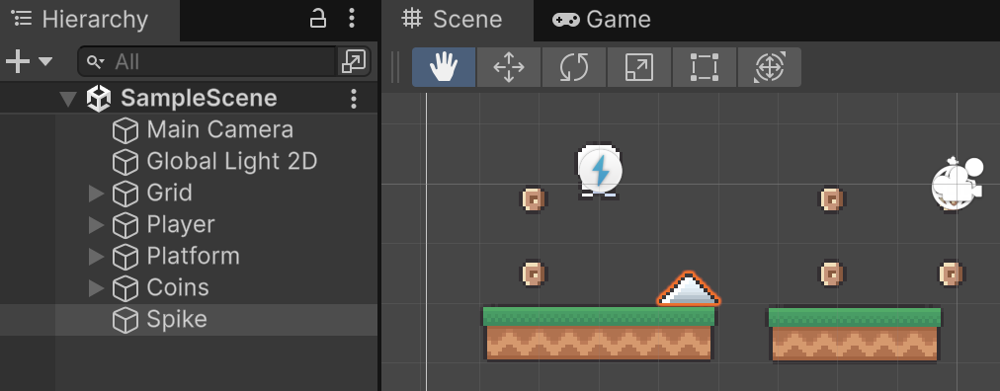
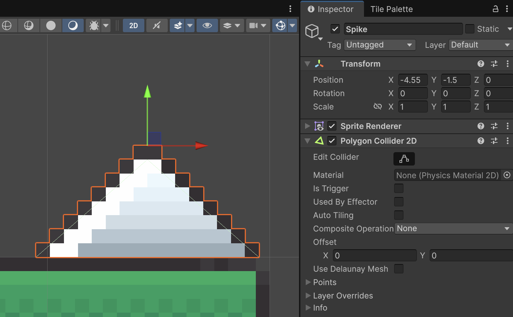
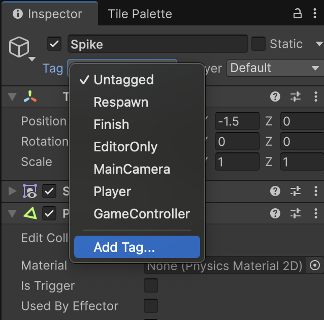
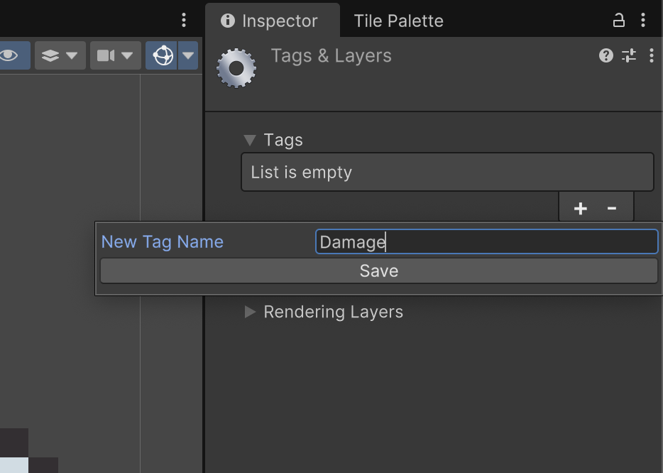
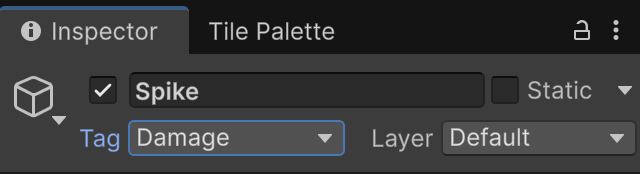

# Trampes (traps)

Les trampes poden produir dany al personatge.

## Definir trampes

Als *"Assets"*, des de la carpeta:

*Assets > Simple 2d Platformer BE2 > Sprites*

Desplega **"Objects"** i arrosega **"Spike"** cap a l'escena.

<center>

</center>
<br/>

Afegeix el component **"Polygon Colider 2D"**, que agafarà automàticament la forma dels píxels dibuixats.

<center>

</center>
<br/>

## Etiquetar objectes com a trampes

Necessitem *etiquetar* els objectes que produeixen mal amb un **Tag**, escull l'objecte **"Spike"** i al seu inspector la opció d'afegir un **Tag** (etiqueta).

<center>

</center>
<br/>

Com a nom de l'etiqueta defineix **"Damage"**

<center>

</center>
<br/>

Finalment, etiqueta l'objecte **"Spike"** amb el tag **"Damage"**

<center>

</center>
<br/>

## Script

Crea un nou script tipus "MonoBehaviour" anomenat **"PlayerDamage"** amb el següent codi. 

```csharp
using UnityEngine;
using System.Collections;

[RequireComponent(typeof(SpriteRenderer))]
public class PlayerDamage : MonoBehaviour
{
    [Header("Health")]
    public int health = 100;
    [SerializeField] private int damagePerHit = 10;
    [SerializeField] private float damageCooldown = 0.3f; // temps mínim entre danys

    [Header("Damage Feedback")]
    [SerializeField] private int flashCount = 2;
    [SerializeField] private float flashDuration = 0.1f;

    private float lastDamageTime = -999f; // temps de l'últim cop que vam rebre danys
    private SpriteRenderer sr; // per fer el flash de vermell

    void Awake()
    {
        sr = GetComponent<SpriteRenderer>();
    }

    private void OnCollisionEnter2D(Collision2D col)
    {
        Debug.Log("Collision detected with " + col.collider.name);
        if (col.collider.CompareTag("Damage"))
            TakeDamage(damagePerHit);
    }

    private void OnTriggerEnter2D(Collider2D other)
    {
        if (other.CompareTag("Damage"))
            TakeDamage(damagePerHit);
    }

    public void TakeDamage(int amount)
    {
        if (Time.time - lastDamageTime < damageCooldown) return;
        lastDamageTime = Time.time;

        health = Mathf.Max(0, health - amount);
        Debug.Log($"Vida restant: {health}");

        StartCoroutine(FlashRed());

        if (health == 0)
        {
            // Aquí podries afegir lògica de mort
            Debug.Log("El jugador ha mort!");
        }
    }

    private IEnumerator FlashRed()
    {
        Color original = sr.color;
        for (int i = 0; i < flashCount; i++)
        {
            sr.color = Color.red;
            yield return new WaitForSeconds(flashDuration);
            sr.color = original;
            yield return new WaitForSeconds(flashDuration);
        }
    }
}
```

Afegeix el nou script com a component del player.

