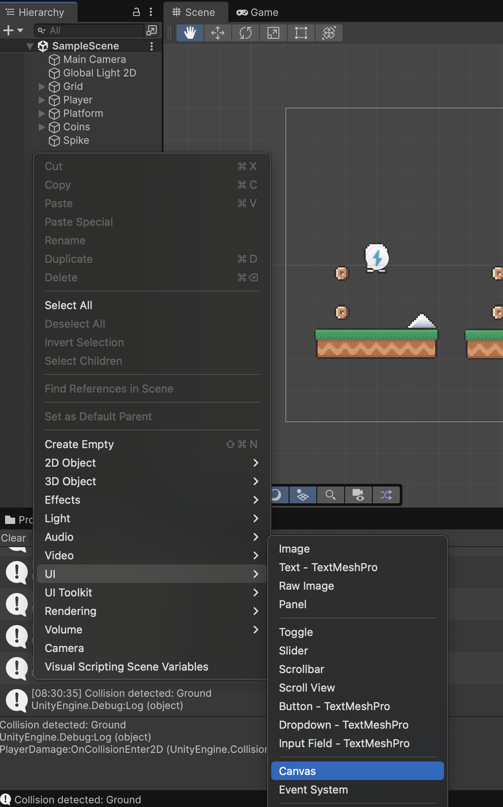
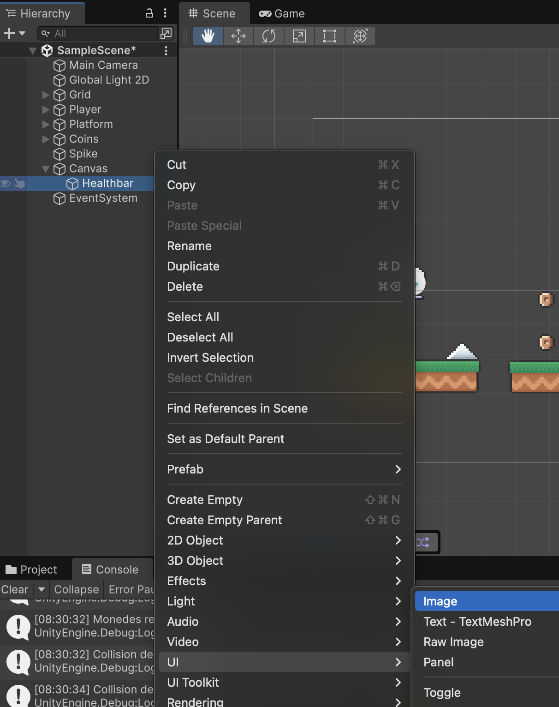
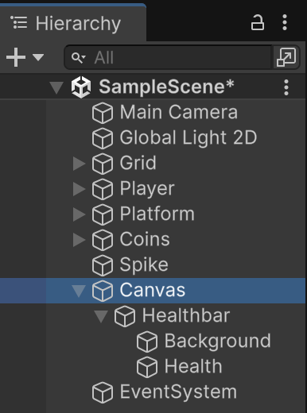
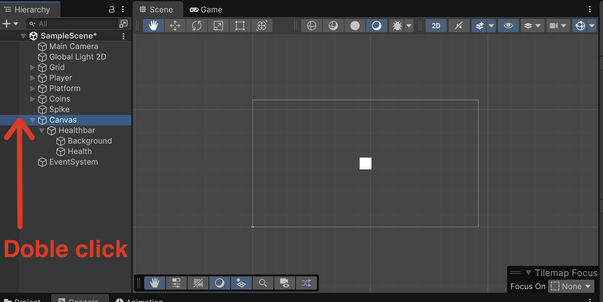
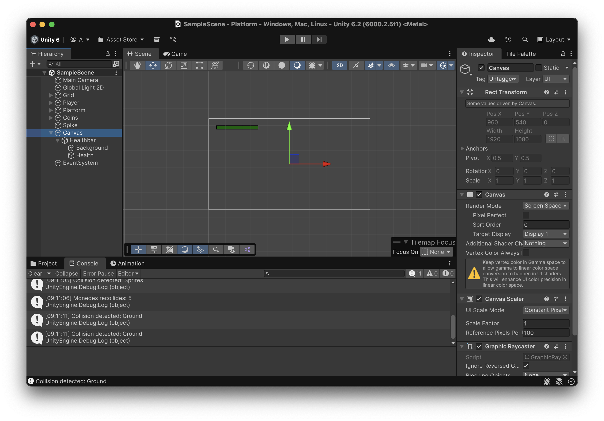
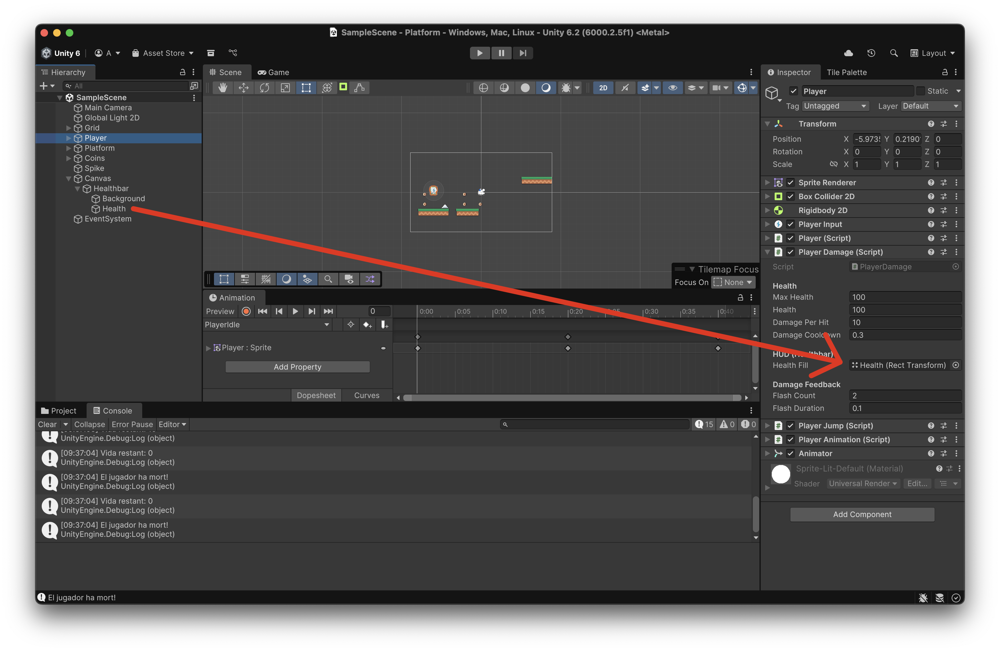
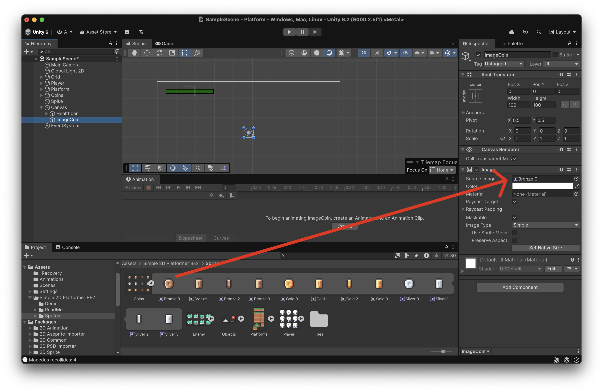
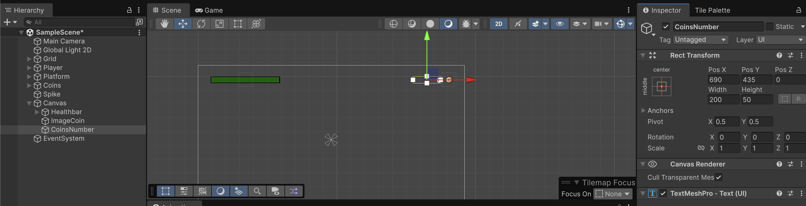
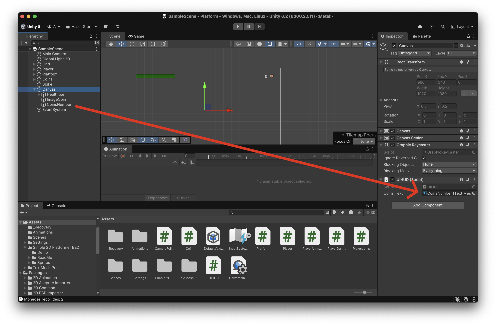

# HUD

Heads-Up-Display mostra informació important durant la partida.

Afegeix un nou objecte tipus **"Canvas"**

<center>

</center>
<br/>

**Nota:** Fixa't que automàticament ha afegit un objecte *EventSystem*, no l'esborris!

## Health bar

Dins del canvas afegeix un objecte buit i anomena'l "Healthbar", indicarà el nivell de vida.

Dins de la **"Healthbar"** crea dos objectes tipus **"Image"**.

<center>

</center>
<br/>

Anomena'ls **"Background"** i **"Health"** respectivament:

<center>

</center>
<br/>

Si fas **"doble click"** al canvas, veuràs l'area de dibuix del HUD.

<center>

</center>
<br/>

Modifica els paràmetres de l'objecte **"Healthbar"**:

- Pos X: -620
- Pos Y: 435

Modifica els paràmetres de l'objecte **"Healthbar > Background"** així:

- Scale X: 5
- Scale Y: 0.5
- Color: Negre

Modifica els paràmetres de l'objecte **"Healthbar > Health"** així:

- Pivot X: 0
- Scale X: 4.9
- Scale Y: 0.4
- Color: Verd

**Nota**: El "Pivot X" farà que la barra es faci més petita mantenint la posició esquerra fixe, enlloc de la central

De manera que quedi així:

<center>

</center>

Per tornar a la vista de l'escena (nivell de zoom de l'escena), fes doble click a **"Main Camera"**.

### Visualització

Durant la partida el canvas es sobreposa a la càmera.

Prova, com es veu la barra de nivell mentre juges.

### Script

Per tal de fer que la barra de nivell canvii, cal adaptar **"PlayerDamage.cs"**

```csharp
using UnityEngine;
using System.Collections;

[RequireComponent(typeof(SpriteRenderer))]
public class PlayerDamage : MonoBehaviour
{
    [Header("Health")]
    public int maxHealth = 100;           // <-- afegit
    public int health = 100;
    [SerializeField] private int damagePerHit = 10;
    [SerializeField] private float damageCooldown = 0.3f;

    [Header("HUD (Healthbar)")]
    [Tooltip("Arrossega aquí l'objecte UI 'Healthbar/Health' (el verd)")]
    [SerializeField] private RectTransform healthFill;  // <-- afegit
    private Vector3 fillBaseScale = Vector3.one;        // <-- escala base capturada a l'inici

    [Header("Damage Feedback")]
    [SerializeField] private int flashCount = 2;
    [SerializeField] private float flashDuration = 0.1f;

    private float lastDamageTime = -999f;
    private SpriteRenderer sr;

    void Awake()
    {
        sr = GetComponent<SpriteRenderer>();

        // Inicialitza salut i barra
        health = Mathf.Clamp(health, 0, maxHealth);
        if (healthFill != null)
        {
            fillBaseScale = healthFill.localScale; // p.ex. (4.9, 0.4, 1) segons el teu setup
            UpdateHealthUI();
        }
    }

    private void OnCollisionEnter2D(Collision2D col)
    {
        if (col.collider.CompareTag("Damage"))
            TakeDamage(damagePerHit);
    }

    private void OnCollisionStay2D(Collision2D col)
    {
        if (col.collider.CompareTag("Damage"))
            TakeDamage(damagePerHit);
    }

    private void OnTriggerEnter2D(Collider2D other)
    {
        if (other.CompareTag("Damage"))
            TakeDamage(damagePerHit);
    }

    private void OnTriggerStay2D(Collider2D other)
    {
        if (other.CompareTag("Damage"))
            TakeDamage(damagePerHit);
    }

    public void TakeDamage(int amount)
    {
        if (Time.time - lastDamageTime < damageCooldown) return;
        lastDamageTime = Time.time;

        health = Mathf.Max(0, health - amount);
        Debug.Log($"Vida restant: {health}");

        UpdateHealthUI();             // <-- actualitza la barra
        StartCoroutine(FlashRed());

        if (health == 0)
        {
            Debug.Log("El jugador ha mort!");
            // TODO: lògica de mort
        }
    }

    // (Opcional) per curar
    public void Heal(int amount)
    {
        health = Mathf.Min(maxHealth, health + amount);
        Debug.Log($"Vida després de curar: {health}");
        UpdateHealthUI();
    }

    private void UpdateHealthUI()
    {
        if (!healthFill) return;

        float t = (maxHealth > 0) ? (float)health / maxHealth : 0f; // 0..1
        // Manté l'alçada i profunditat originals, només escala l'ample en X
        healthFill.localScale = new Vector3(fillBaseScale.x * t, fillBaseScale.y, fillBaseScale.z);
    }

    private IEnumerator FlashRed()
    {
        Color original = sr.color;
        for (int i = 0; i < flashCount; i++)
        {
            sr.color = Color.red;
            yield return new WaitForSeconds(flashDuration);
            sr.color = original;
            yield return new WaitForSeconds(flashDuration);
        }
    }
}
```

Cal vincular l'objecte **"Health"** amb la nova variable **"Health fill"** de l'script **"PlayerDamage.cs"**, arrosegant l'objecte a la variable.

<center>

</center>

## Monedes

Afegeix una nova *"UI > Image"* a l'objecte **"Canvas"** i anomena-la com a **"ImageCoin"**

Aleshores, arrosega la imatge de la moneda al camp **"Source Image"** de l'objecte **"ImageCoin"**

<center>

</center>

Mou el nou objecte **"ImageCoin"** a les posicions:

- Pos X: 850
- Pos Y: 435

Afegeix un nou objecte *"UI > Text - TextMeshPro (TMP)"* a l'objecte **"Canvas"** i anomena'l "CoinsNumber". Amb les propietats:

- Pos X: 690
- Pos Y: 435
- Text: 0
- Font Size: 50
- Alignment: a la dreta

<center>

</center>
<br/>

### Scripts

Afegeix un nou script tipus "MonoBehaviour" anomenat **"UIHUD.cs"**, i posa'l com a component de l'objecte **"Canvas"**

```csharp
using UnityEngine;
using TMPro;

public class UIHUD : MonoBehaviour
{
    [SerializeField] private TextMeshProUGUI coinsText; // assigna-hi CoinsNumber al Canvas

    public void UpdateCoins(int coins)
    {
        if (coinsText)
            coinsText.text = coins.ToString();
    }
}
```

Canvia l'script **"Coin.cs"** per:

```csharp
using UnityEngine;

public class Coin : MonoBehaviour
{
    private void OnTriggerEnter2D(Collider2D other)
    {
        Player player = other.GetComponent<Player>();
        if (player != null)
        {
            player.coins++;
            Debug.Log("Monedes recollides: " + player.coins);

            // Actualitza el HUD
            var hud = FindObjectOfType<UIHUD>();
            if (hud != null) hud.UpdateCoins(player.coins);

            Destroy(gameObject);
        }
    }
}
```

Arrosega l'objecte **"CoinsNumber"** a la variable **"Coins Text"** de l'script **"UIHUD"** de l'objecte **"Canvas"**.

<center>

</center>
<br/>

Prova al joc, com s'actualitza el text de les monedes al agafar-les