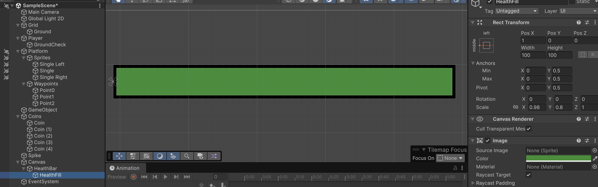

# HUD

Heads-Up-Display mostra informació important durant la partida.

Afegeix un nou objecte tipus **"UI > Canvas"**

<center>

</center>
<br/>

**Nota:** Fixa't que automàticament ha afegit un objecte *EventSystem*, no l'esborris!

## Health bar

Dins de l'objecte **"Canvas"** afegeix un objecte tipus **"UI > Image"** i anomena'l **"HealthBar"**. 

Modifica els paràmetres de l'objecte **"Healthbar"**:

- Pos X: -620
- Pos Y: 435
- Scale X: 5
- Scale Y: 0.5
- Color: Negre

Dins de l'objecte **"HealthBar"** afegeix un objecte tipus **"UI > Image"** i anomena'l **"HealthFill"**. 

La hierarchy queda:

<center>

</center>
<br/>

Modifica el posicionament de l'objecte **"HealthFill"**, al valor *"middle/left"*

<center>

</center>
<br/>

Modifica els paràmetres de l'objecte **"HealthFill"**:

- Pos X: 51
- Pivot X: 0 (automàticament canvia Pos X a 1)
- Scale X: 0.98
- Scale Y: 0.8
- Color: Verd

**Nota**: El "Pivot X" farà que la barra es faci més petita mantenint la posició esquerra fixe, enlloc de la central

S'ha de veure així:

<center>

</center>
<br/>

Per tornar a la vista de l'escena (nivell de zoom de l'escena), fes doble click a **"Main Camera"**.

### Visualització

Durant la partida el canvas es sobreposa a la càmera.

Prova, com es veu la barra de nivell mentre juges.

<center>

</center>
<br/>

### Script

Per tal de fer que la barra de nivell canvii, cal adaptar **"PlayerDamage.cs"**

Afegeix un nou import:
```csharp
using UnityEngine.UI;
```

Afegeix una nova secció de variables:
```csharp
    [Header("UI")]
    [SerializeField] private Image healthBackground; // Image de fons (amplada "100%")
    [SerializeField] private Image healthFill;       // Image del farcit (li canviarem l'amplada)
    private RectTransform bgRT;
    private RectTransform fillRT;
    private float baseWidth; 
```

Afegeix tres noves funcions després de *"Awake()"*:

```csharp
    private void Start()
    {
        if (healthBackground) bgRT = healthBackground.rectTransform;
        if (healthFill)       fillRT = healthFill.rectTransform;

        if (fillRT)
        {
            // Volem que s'encongeixi des de l'esquerra:
            fillRT.anchorMin = new Vector2(0f, fillRT.anchorMin.y);
            fillRT.anchorMax = new Vector2(0f, fillRT.anchorMax.y);
            fillRT.pivot     = new Vector2(0f, fillRT.pivot.y);

            // Si hi ha background, fem servir la seva amplada com a 100%
            baseWidth = bgRT ? bgRT.rect.width : fillRT.rect.width;

            // Opcional: fem coincidir l'alçada del fill amb el fons
            if (bgRT)
                fillRT.SetSizeWithCurrentAnchors(RectTransform.Axis.Vertical, bgRT.rect.height);

            // Inicialitza a 100% d'amplada
            fillRT.SetSizeWithCurrentAnchors(RectTransform.Axis.Horizontal, baseWidth);

            // Si el layout encara no està cuinat aquesta frame (baseWidth=0), reintenta al final
            if (baseWidth <= 0f) StartCoroutine(RefreshBaseWidthEndOfFrame());
        }

        UpdateHealthUI();
    }

    private IEnumerator RefreshBaseWidthEndOfFrame()
    {
        yield return new WaitForEndOfFrame();
        if (bgRT) baseWidth = bgRT.rect.width;
        else if (fillRT) baseWidth = fillRT.rect.width;
        UpdateHealthUI();
    }

    private void UpdateHealthUI()
    {
        if (!fillRT) return;
        float t = (maxHealth > 0) ? (float)health / maxHealth : 0f;
        t = Mathf.Clamp01(t);
        float targetWidth = (baseWidth > 0f) ? baseWidth * t : 0f;
        fillRT.SetSizeWithCurrentAnchors(RectTransform.Axis.Horizontal, targetWidth);
    }
```

Actualitza les funcions *"OnEnable"* i *"ApplyDamage"*:
```csharp
    private void OnEnable()
    {
        StopFlashAndRestoreColor();
        UpdateHealthUI();
    }

    private void ApplyDamage(int amount)
    {
        int prev = health;
        health = Mathf.Max(0, health - amount);
        Debug.Log($"Vida: {prev} -> {health}");

        // Feedback de dany
        StartFlash();
        UpdateHealthUI();

        if (health <= 0)
        {
            // TODO: Lògica de GameOver
            StopFlashAndRestoreColor(); 
        }
    }
```

Cal vincular l'objecte **"Health"** amb la nova variable **"Health fill"** de l'script **"PlayerDamage.cs"**, arrosegant l'objecte a la variable.

<center>

</center>

## Monedes

Afegeix una nova *"UI > Image"* a l'objecte **"Canvas"** i anomena-la com a **"ImageCoin"**

Aleshores, arrosega la imatge de la moneda al camp **"Source Image"** de l'objecte **"ImageCoin"**

<center>

</center>

Mou el nou objecte **"ImageCoin"** a les posicions:

- Pos X: 850
- Pos Y: 435

Afegeix un nou objecte *"UI > Text - TextMeshPro (TMP)"* a l'objecte **"Canvas"** i anomena'l "CoinsNumber". Amb les propietats:

- Pos X: 690
- Pos Y: 435
- Text: 0
- Font Size: 50
- Vertex Color: Negre *(o un color que contrasti amb el fons)*
- Alignment: a la dreta

<center>

</center>
<br/>

### Scripts

Afegeix un nou script tipus "MonoBehaviour" anomenat **"UIHUD.cs"**, i posa'l com a component de l'objecte **"Canvas"**

```csharp
using UnityEngine;
using TMPro;

public class UIHUD : MonoBehaviour
{
    [SerializeField] private TextMeshProUGUI coinsText; // assigna-hi CoinsNumber al Canvas

    public void UpdateCoins(int coins)
    {
        if (coinsText)
            coinsText.text = coins.ToString();
    }
}
```

Modifica l'script **"Coins.cs"** per:

```csharp
using UnityEngine;

public class Coin : MonoBehaviour
{
    private void OnTriggerEnter2D(Collider2D other)
    {
        var player = other.GetComponent<Player>();
        if (!player) return;

        player.coins++;
        Debug.Log($"Monedes recollides: {player.coins}");

        var hud = Object.FindFirstObjectByType<UIHUD>(); 
        if (hud) hud.UpdateCoins(player.coins);

        // Evita triggers dobles abans del Destroy
        var col = GetComponent<Collider2D>();
        if (col) col.enabled = false;

        Destroy(gameObject);
    }
}
```

Arrosega l'objecte **"CoinsNumber"** a la variable **"Coins Text"** de l'script **"UIHUD"** de l'objecte **"Canvas"**.

<center>

</center>
<br/>

Prova al joc, com s'actualitza el text de les monedes al agafar-les.