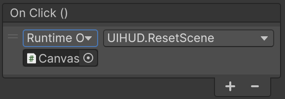

# GameOver

Hi ha dues maneres de morir al joc:

- Acabar la vida
- Caure al buit

## Pantalla Game Over

Tindrem un canvas amb la pantalla de GameOver, i quan es mostri pausarem el joc.

A l'objecte **"Canvas"** afegeix un objecte buit **"Create Empty"** i anomena'l **"GameOver"**.

<center>

</center>
<br/>

Al l'inspector de l'objecte **"GameOver"** anterior apreta el selector de posicionament:

<center>

</center>
<br/>

Escull la opció (Strech/Strech) de la última fila i última columna:

<center>

</center>
<br/>

Fes que l'objecte GameOver ocupi tot l'espai del canvas "estirant-lo" amb aquests paràmetres:

- Left: 0
- Top: 0
- Right: 0
- Bottom: 0

<center>

</center>
<br/>

Dins de l'objecte **"GameOver"** afegeix un objecte *"UI > Image"* i anomena'l **"Background"**

Estira la imatge per ocupar tot l'espai de **"GameOver"** com has fet anteriorment:

- Escollir posicionament tipus (Strech/Strech)
- Posar top/left/bottom/right a 0

Al fer *"doble click"* sobre l'objecte **"Canvas"** s'ha de veure tot l'espai del canvas de color blanc:

<center>

</center>
<br/>

Canvia les propietats el **Color** de l'objecte **"Background"** a gris semitransparent:

- R(ed): 128
- G(reen): 128
- B(lue): 128
- A(lpha): 128

Afegeix un objecte tipus *"UI > Text Mesh Pro"* dins de **"GameOver"**, amb el text **"Game Over!"** amb gran. Anomena'l **"GameOverText"**.

Afegeix un botó *"UI > Button"* dins de **"GameOver"**. 

Veuràs que dins de l'element tipus botó hi ha un text, posa-li el valor *"Reset"*

<center>

</center>
<br/>

## Scripting

Modifica l'script **"UIHUD.cs"**

```csharp
using UnityEngine;
using TMPro;
using UnityEngine.SceneManagement;

public class UIHUD : MonoBehaviour
{

    [SerializeField] private TextMeshProUGUI coinsText; // assigna-hi CoinsNumber al Canvas
    [SerializeField] private GameObject gameOverUI;

    public void Awake()
    {
        if (gameOverUI)
        {
            gameOverUI.SetActive(false);
        }
        else
        {
            Debug.LogWarning("Assigna 'gameOver' al Canvas");
        } 
        Time.timeScale = 1f; // Forçar 'play' per si està en 'pause'
    }

    public void UpdateCoins(int coins)
    {
        if (coinsText)
        {
            coinsText.text = coins.ToString();
        }
    }

    public void ShowGameOver()
    {
        if (gameOverUI)
        {
            gameOverUI.SetActive(true);
            Time.timeScale = 0f; // Pausa el joc
        }
    }

    public void ResetScene()
    {
        Debug.Log("Reiniciant l'escena...");

        // Tornem a carregar l'escena activa
        Scene currentScene = SceneManager.GetActiveScene();
        SceneManager.LoadScene(currentScene.name);
    }
} 
```

Arrosega el panell **"gameOver"** a la variable **"Game Over UI"** de l'objecte **"Canvas"**

<center>

</center>

Cal modificar l'script **"Player.cs"** per afegir una crida a **"ShowGameOver"** quan el **"Player"** cau per sota de la posició *Y=25*

Afegeix noves variables:
```csharp
    private UIHUD hud; 
    public int gameOverHeight = -25;
```

Actualitza la funció **"Awake"** amb l'inicialització de **"hud"**:
```csharp
    void Awake()
    {
        rb = GetComponent<Rigidbody2D>();
        playerJump = GetComponent<PlayerJump>();
        hud = FindFirstObjectByType<UIHUD>();
    }
```

Afegeix la funció **"Update"**:
```csharp
    void Update()
    {
        if (transform.position.y < gameOverHeight && hud != null)
        {
            hud.ShowGameOver();
        }
    }
```

Modifica l'script **"PlayerDamage.cs"** per afegir una crida a **"ShowGameOver"** :

Afegeix noves variables:
```csharp
    private UIHUD hud; 
```

Actualitza la funció **"Awake"** amb l'inicialització de **"hud"**:
```csharp
    void Awake()
    {
        sr = GetComponent<SpriteRenderer>();
        baseColor = sr.color;
        health = Mathf.Clamp(health <= 0 ? maxHealth : health, 0, maxHealth);
        hud = FindFirstObjectByType<UIHUD>();
    }
```

Modifica la funció **"ApplyDamage"** per afegir la crida a *"GameOver"*:

```csharp
    private void ApplyDamage(int amount)
    {
        int prev = health;
        health = Mathf.Max(0, health - amount);
        Debug.Log($"Vida: {prev} -> {health}");

        // Feedback de dany
        StartFlash();
        UpdateHealthUI();

        if (health <= 0)
        {
            hud.ShowGameOver();
            StopFlashAndRestoreColor(); 
        }
    }
```

## Reset de l'escena

Per cridar la funció **"ResetScene"** al apretar el botó reset.

Afegeix un event *"OnClick"* a la llista apretant al símbol *"+"*.

<center>

</center>
<br/>

Sel·lecciona l'objecte **"Button"** a l'inspector, i arrosega l'object **"Canvas"** a sota del camp *"Runtime Only"*

<center>

</center>

Al desplegable de la dreta (on diu *"No Function"*) escollir el mètode de la ruta *"UIHUD > ResetScene()"*

<center>

</center>
<br/>

Provar que el botó reinicia l'escena.
