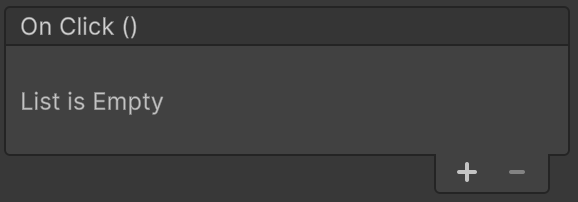
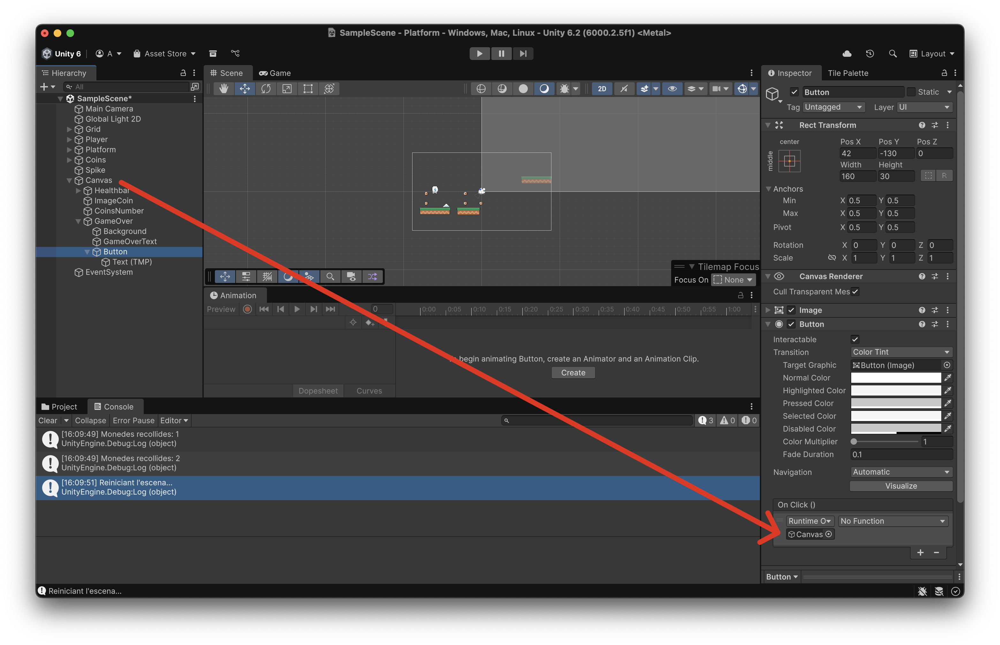
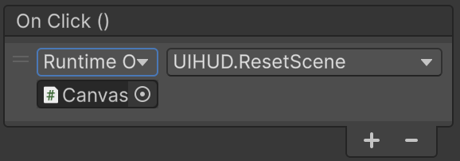

# GameOver

Hi ha dues maneres de morir al joc:

- Acabar la vida
- Caure al buit

## Pantalla Game Over

Tindrem un canvas amb la pantalla de GameOver, i quan es mostri pausarem el joc.

A l'objecte **"Canvas"** afegeix un objecte buit **"Create Empty"** i anomena'l **"GameOver"**.

<center>

</center>
<br/>

Al l'inspector de l'objecte **"GameOver"** anterior apreta el selector de posicionament:

<center>

</center>
<br/>

Escull la opció (Strech/Strech) de la última fila i última columna:

<center>

</center>
<br/>

Fes que l'objecte GameOver ocupi tot l'espai del canvas "estirant-lo" amb aquests paràmetres:

- Left: 0
- Top: 0
- Right: 0
- Bottom: 0

<center>

</center>
<br/>

Dins de l'objecte **"GameOver"** afegeix un objecte *"UI > Image"* i anomena'l **"Background"**

Estira la imatge per ocupar tot l'espai de **"GameOver"** com has fet anteriorment:

- Escollir posicionament tipus (Strech/Strech)
- Posar top/left/bottom/right a 0

Al fer *"doble click"* sobre l'objecte **"Canvas"** s'ha de veure tot l'espai del canvas de color blanc:

<center>

</center>
<br/>

Canvia les propietats el **Color** de l'objecte **"Background"** a gris semitransparent:

- R(ed): 128
- G(reen): 128
- B(lue): 128
- A(lpha): 128

Afegeix un objecte tipus *"UI > Text Mesh Pro"* dins de **"GameOver"**, amb el text **"Game Over!"** amb gran. Anomena'l **"GameOverText"**.

Afegeix un botó *"UI > Button"* dins de **"GameOver"**. 

Veuràs que dins de l'element tipus botó hi ha un text, posa-li el valor *"Reset"*

<center>

</center>
<br/>

## Scripting

Modifica l'script **"UIHUD.cs"**

```csharp
using UnityEngine;
using TMPro;
using UnityEngine.SceneManagement;

public class UIHUD : MonoBehaviour
{

    [SerializeField] private TextMeshProUGUI coinsText; // assigna-hi CoinsNumber al Canvas
    [SerializeField] private GameObject gameOverUI;

    public void Awake()
    {
        if (gameOverUI)
        {
            gameOverUI.SetActive(false);
        }
        else
        {
            Debug.LogWarning("Assigna 'gameOver' al Canvas");
        } 
        Time.timeScale = 1f; // Forçar 'play' per si està en 'pause'
    }

    public void UpdateCoins(int coins)
    {
        if (coinsText)
        {
            coinsText.text = coins.ToString();
        }
    }

    public void ShowGameOver()
    {
        if (gameOverUI)
        {
            gameOverUI.SetActive(true);
            Time.timeScale = 0f; // Pausa el joc
        }
    }

    public void ResetScene()
    {
        Debug.Log("Reiniciant l'escena...");

        // Tornem a carregar l'escena activa
        Scene currentScene = SceneManager.GetActiveScene();
        SceneManager.LoadScene(currentScene.name);
    }
} 
```

Arrosega el panell **"gameOver"** a la variable **"Game Over UI"** de l'objecte **"Canvas"**

<center>

</center>

Modifica l'script **"Player.cs"** per afegir una crida a **"ShowGameOver"** de l'objecte **"UIHUD"**

```csharp
using UnityEngine;
using UnityEngine.InputSystem;

[RequireComponent(typeof(Rigidbody2D), typeof(PlayerInput))]
public class Player : MonoBehaviour
{
    public float moveSpeed = 5f;

    private Rigidbody2D rb;
    private Vector2 move;

    private PlayerJump playerJump;

    public int coins = 0;

    private UIHUD hud; 
    public int gameOverHeight = -25;


    void Awake()
    {
        rb = GetComponent<Rigidbody2D>();
        playerJump = GetComponent<PlayerJump>();
        hud = FindFirstObjectByType<UIHUD>();
    }

    public void OnMove(InputValue v)
    {
        move = v.Get<Vector2>();
    }

    void Update()
    {
        if (transform.position.y < gameOverHeight && hud != null)
        {
            hud.ShowGameOver();
        }
    }

    void FixedUpdate()
    {
        float vx = move.x * moveSpeed;

        // si estem a terra i el terra és una plataforma mòbil, suma la seva velocitat X
        if (playerJump != null && playerJump.isGrounded)
        {
            var groundCol = playerJump.GroundCollider;
            if (groundCol)
            {
                // el collider acostuma a estar al fill "Sprites"; puja al pare que porta Platform
                var platform = groundCol.GetComponentInParent<Platform>();
                if (platform != null) vx += platform.surfaceVelocity.x;
            }
        }

        rb.linearVelocity = new Vector2(vx, rb.linearVelocity.y);
    }
}
```

Modifica l'script **"PlayerDamage.cs"** per afegir una crida a **"ShowGameOver"** de l'objecte **"UIHUD"**

```csharp
using UnityEngine;
using System.Collections;

[RequireComponent(typeof(SpriteRenderer))]
public class PlayerDamage : MonoBehaviour
{
    [Header("Health")]
    public int maxHealth = 100;           // <-- afegit
    public int health = 100;
    [SerializeField] private int damagePerHit = 10;
    [SerializeField] private float damageCooldown = 0.3f;

    [Header("HUD (Healthbar)")]
    [Tooltip("Arrossega aquí l'objecte UI 'Healthbar/Health' (el verd)")]
    [SerializeField] private RectTransform healthFill;  // <-- afegit
    private Vector3 fillBaseScale = Vector3.one;        // <-- escala base capturada a l'inici

    [Header("Damage Feedback")]
    [SerializeField] private int flashCount = 2;
    [SerializeField] private float flashDuration = 0.1f;

    private float lastDamageTime = -999f;
    private SpriteRenderer sr;

    private UIHUD hud; 

    void Awake()
    {
        sr = GetComponent<SpriteRenderer>();
        hud = FindFirstObjectByType<UIHUD>();

        // Inicialitza salut i barra
        health = Mathf.Clamp(health, 0, maxHealth);
        if (healthFill != null)
        {
            fillBaseScale = healthFill.localScale; // p.ex. (4.9, 0.4, 1) segons el teu setup
            UpdateHealthUI();
        }
    }

    private void OnCollisionEnter2D(Collision2D col)
    {
        if (col.collider.CompareTag("Damage"))
            TakeDamage(damagePerHit);
    }

    private void OnCollisionStay2D(Collision2D col)
    {
        if (col.collider.CompareTag("Damage"))
            TakeDamage(damagePerHit);
    }

    private void OnTriggerEnter2D(Collider2D other)
    {
        if (other.CompareTag("Damage"))
            TakeDamage(damagePerHit);
    }

    private void OnTriggerStay2D(Collider2D other)
    {
        if (other.CompareTag("Damage"))
            TakeDamage(damagePerHit);
    }

    public void TakeDamage(int amount)
    {
        if (Time.time - lastDamageTime < damageCooldown) return;
        lastDamageTime = Time.time;

        health = Mathf.Max(0, health - amount);
        Debug.Log($"Vida restant: {health}");

        UpdateHealthUI();             // <-- actualitza la barra
        StartCoroutine(FlashRed());

        if (health == 0 && hud)
        {
            hud.ShowGameOver();
        }
    }

    // (Opcional) per curar
    public void Heal(int amount)
    {
        health = Mathf.Min(maxHealth, health + amount);
        Debug.Log($"Vida després de curar: {health}");
        UpdateHealthUI();
    }

    private void UpdateHealthUI()
    {
        if (!healthFill) return;

        float t = (maxHealth > 0) ? (float)health / maxHealth : 0f; // 0..1
        // Manté l'alçada i profunditat originals, només escala l'ample en X
        healthFill.localScale = new Vector3(fillBaseScale.x * t, fillBaseScale.y, fillBaseScale.z);
    }

    private IEnumerator FlashRed()
    {
        Color original = sr.color;
        for (int i = 0; i < flashCount; i++)
        {
            sr.color = Color.red;
            yield return new WaitForSeconds(flashDuration);
            sr.color = original;
            yield return new WaitForSeconds(flashDuration);
        }
    }
}
```

## Reset de l'escena

Per cridar la funció **"ResetScene"** al apretar el botó reset.

Afegeix un event *"OnClick"* a la llista apretant al símbol *"+"*.

<center>

</center>
<br/>

Sel·lecciona l'objecte **"Button"** a l'inspector, i arrosega l'object **"Canvas"** a sota del camp *"Runtime Only"*

<center>

</center>

Al desplegable de la dreta (on diu *"No Function"*) escollir el mètode de la ruta *"UIHUD > ResetScene()"*

<center>

</center>
<br/>

Provar que el botó reinicia l'escena.
