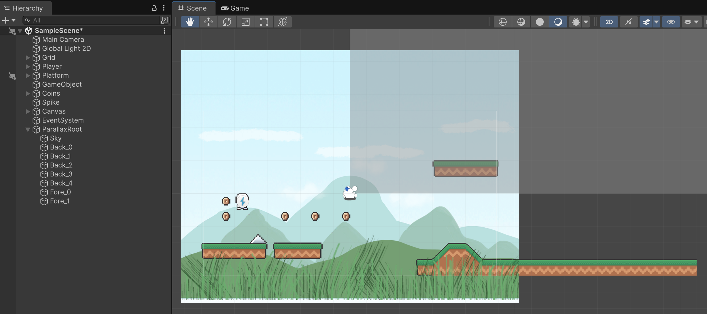
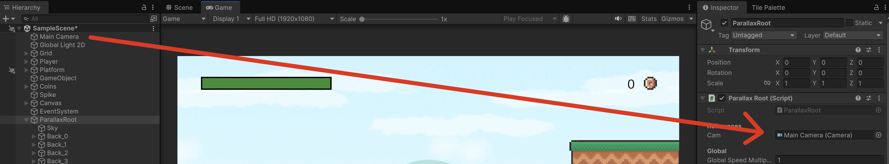

# Parallax

Parallax permet moure les capes de decoració, a diferent velocitat, per donar sensació de profunditat al joc.

[Explicació Parallax](https://www.youtube.com/shorts/I5lPwTqGDcU)

Les capes més llunyanes es mouen més lentament que les més properes.

- Les capes per darrera del jugador es mouen més lentament que el jugador
- Les capes més pròximes al jugador es mouen més ràpid que al jugador

## Estructura

Crea un nou objecte buit amb *"Create Empty"* anomenat **"Parallax Root"** a les posicions:

- Pos X: 0
- Pos Y: 0

Fes servir els *Assets* importats de la carpeta **BackgroundImages**

Cal arreglar cada una d'aquestes imatges, sel·lecciona-les i amb l'inspetor configura:

- **Sprite Mode**: Single
(Per totes les imatges *.png*, ignora l'arxiu *"Backgrounds"*)

**Important:** Guarda els canvis per cada imatge.

- Mou la imatge **Sky** dins de l'objecte **ParallaxRoot** i configura:

    - Pos X: 0
    - Pos Y: (Que toqui a baix)
    - Scale X: 3
    - Scale Y: 2.5
    - Order in Layer: -100

- Mou les imatges **Back_X** des de la 0 fins a la 4 i configura:

    - Pos X: 0
    - Pos Y: (Segons la capa, que toquin a baix excepte els núvols)
    - Scale X: 2
    - Scale Y: Segons capa
    - Order in Layer: (la 0 a -99 i anar descomptant 1 per cada capa)

- Mou les imatges **Fore_0** i **Fore_1** i configura:

    - Pos X: 0
    - Pos Y: -4
    - Scale X: 2
    - Scale Y: 1.5
    - Order in Layer: (la 0 a 100 i anar sumant 1 per cada capa)

Ha de quedar així:

<center>

</center>
<br/>

## Script

Crea l'arxiu **"ParallaxRoot"** a la carpeta **"Scripts"** i assigna'l a l'objecte **"ParallaxRoot"**

```csharp
using System.Text.RegularExpressions;
using System.Collections.Generic;
using UnityEngine;

public class ParallaxRoot : MonoBehaviour
{
    [Header("Camera (si és null, farà servir Camera.main)")]
    public Camera cam;

    [Header("Nom de la capa de cel que ha de quedar fixa")]
    public string skyName = "SKY";

    [Header("Parallax Config")]
    [Tooltip("BACK factors (0..1) — valor ALT a capes MÉS LLUNYANES (mouen poc), valor MÉS BAIX a capes prop del midground.")]
    public float backParallaxMin = 0.10f; // per capes més properes al midground
    public float backParallaxMax = 0.95f; // per capes més llunyanes (gairebé càmera)

    [Tooltip("FORE intensitat (0..1). El factor final és 1 - abs. Valors més ALTS = foreground més marcat (mou més).")]
    public float foreParallaxAbsMin = 0.4f;   // Fore_0 → factor = 1 - 0.10 = 0.90
    public float foreParallaxAbsMax = 0.5f;   // Fore_N → factor = 1 - 0.40 = 0.60

    private const string PrefixBack = "Back_";
    private const string PrefixFore = "Fore_";

    [System.Serializable]
    private class LayerTilingData
    {
        public Transform layer;      // tile central
        public Transform left;       // duplicat esquerra (local -offset)
        public Transform right;      // duplicat dreta (local +offset)

        public float x0_cam;         // x inicial càmera (per a deltes)
        public float x0_layer;       // x inicial del layer central
        public float widthWorld;     // amplada efectiva del sprite en món (inclou escales)
        public float localOffsetX;   // desplaçament local per col·locar _L/_R (widthWorld / lossyScale.x)
        public float parallaxFactor; // 0=fix (sky), 1=segueix càmera, (0..1) per back/fore
    }

    private readonly List<LayerTilingData> layers = new();

    void Awake()
    {
        if (cam == null) cam = Camera.main;
        if (cam == null) Debug.LogWarning("[ParallaxRoot] No s'ha trobat cap càmera!");
    }

    void Start()
    {
        int maxBackIdx = DetectMaxIndex(PrefixBack);
        int maxForeIdx = DetectMaxIndex(PrefixFore);

        int childCount = transform.childCount;
        for (int i = 0; i < childCount; i++)
        {
            var layer = transform.GetChild(i);

            // --- SKY: ordre i factor 0 (fix) ---
            if (layer.name == skyName)
            {
                SetSortingOrderRecursive(layer, -100);
                layers.Add(new LayerTilingData
                {
                    layer = layer,
                    left = null,
                    right = null,
                    x0_cam = cam ? cam.transform.position.x : 0f,
                    x0_layer = layer.position.x,
                    widthWorld = 0f,
                    localOffsetX = 0f,
                    parallaxFactor = 0f
                });
                continue;
            }

            var sr = layer.GetComponent<SpriteRenderer>();
            if (sr == null)
            {
                Debug.LogWarning($"[ParallaxRoot] El fill '{layer.name}' no té SpriteRenderer. S'omet.");
                continue;
            }

            // --- Assignació d'ordre segons prefix ---
            int bidx, fidx;
            if (TryParseIndexedName(layer.name, PrefixBack, out bidx))
            {
                SetSortingOrderRecursive(layer, -99 + bidx);
            }
            else if (TryParseIndexedName(layer.name, PrefixFore, out fidx))
            {
                SetSortingOrderRecursive(layer, 100 + fidx);
            }

            // --- Preparar duplicats _L/_R amb offset LOCAL ---
            Transform left = layer.Find(layer.name + "_L");
            Transform right = layer.Find(layer.name + "_R");

            float worldWidth = Mathf.Abs(sr.bounds.size.x); // en món (inclou escales/ancestres)
            float sx = Mathf.Abs(layer.lossyScale.x);
            if (sx < 1e-6f) sx = 1e-6f;
            float localOffset = worldWidth / sx; // perquè en món la separació sigui = worldWidth

            if (left == null)  left  = CreateClone(layer, -localOffset, "_L", sr);
            if (right == null) right = CreateClone(layer, +localOffset, "_R", sr);

            // --- Factor de parallax per capa (CORREGIT) ---
            float factor;
            if (TryParseIndexedName(layer.name, PrefixBack, out bidx))
            {
                // Back_0 (molt llunya) → factor alt (proper a 1, mou poc)
                float t = (maxBackIdx <= 0) ? 0f : Mathf.Clamp01((float)bidx / (float)maxBackIdx);
                factor = Mathf.Lerp(backParallaxMax, backParallaxMin, t); // swap: 0→max, 1→min
                factor = Mathf.Clamp01(factor);
            }
            else if (TryParseIndexedName(layer.name, PrefixFore, out fidx))
            {
                // Fore_0 (molt a prop) → factor 1 - abs_min (ex. 0.90) ; Fore_max → 1 - abs_max (ex. 0.60)
                float t = (maxForeIdx <= 0) ? 0f : Mathf.Clamp01((float)fidx / (float)maxForeIdx);
                float abs = Mathf.Lerp(foreParallaxAbsMin, foreParallaxAbsMax, t);
                factor = 1f - Mathf.Clamp01(abs);
            }
            else
            {
                // Sense prefix → midground (1.0)
                factor = 1f;
            }

            // --- Desa dades d'aquesta capa ---
            layers.Add(new LayerTilingData
            {
                layer = layer,
                left = left,
                right = right,
                x0_cam = cam ? cam.transform.position.x : 0f,
                x0_layer = layer.position.x,
                widthWorld = worldWidth,
                localOffsetX = localOffset,
                parallaxFactor = factor
            });
        }
    }

    void LateUpdate()
    {
        if (cam == null) return;

        float cx = cam.transform.position.x;
        float cy = cam.transform.position.y;

        foreach (var d in layers)
        {
            if (d.parallaxFactor == 0f)
            {
                // SKY: enganxat a càmera
                Vector3 p = d.layer.position;
                d.layer.position = new Vector3(cx, cy, p.z);
                continue;
            }

            if (d.widthWorld < 1e-6f) continue;

            // --- Parallax + wrap ancorat a CÀMERA ---
            float dx = (cx - d.x0_cam) * d.parallaxFactor; // desplaçament desenvolupat del layer
            float W  = d.widthWorld;

            // Centre "desenvolupat" del layer (sense wrap)
            float xUnwrapped = d.x0_layer + dx;

            // Tria el múltiple de W que deixa el centre més a prop del centre de la càmera
            int   n        = Mathf.RoundToInt((cx - xUnwrapped) / W);
            float xCentral = xUnwrapped + n * W;

            // Mou NOMÉS el tile central; _L/_R romanen a ±offset local
            var pos = d.layer.position;
            d.layer.position = new Vector3(xCentral, pos.y, pos.z);
        }
    }

    // ===== Helpers =====

    private int DetectMaxIndex(string prefix)
    {
        int maxIdx = -1;
        var rx = new Regex("^" + Regex.Escape(prefix) + @"(\d+)$");
        int childCount = transform.childCount;
        for (int i = 0; i < childCount; i++)
        {
            var layer = transform.GetChild(i);
            var m = rx.Match(layer.name);
            if (m.Success && int.TryParse(m.Groups[1].Value, out int idx))
                maxIdx = Mathf.Max(maxIdx, idx);
        }
        return maxIdx;
    }

    private bool TryParseIndexedName(string name, string prefix, out int index)
    {
        index = 0;
        if (!name.StartsWith(prefix)) return false;
        var tail = name.Substring(prefix.Length);
        return int.TryParse(tail, out index);
    }

    private void SetSortingOrderRecursive(Transform root, int order)
    {
        var srs = root.GetComponentsInChildren<SpriteRenderer>(includeInactive: true);
        foreach (var s in srs) s.sortingOrder = order;
    }

    private Transform CreateClone(Transform parentLayer, float offsetLocalX, string suffix, SpriteRenderer srcSr)
    {
        string cloneName = parentLayer.name + suffix;
        GameObject go = new GameObject(cloneName);
        go.transform.SetParent(parentLayer, worldPositionStays: false);

        // Posició LOCAL fixa (no es tocarà més)
        go.transform.localPosition = new Vector3(offsetLocalX, 0f, 0f);
        go.transform.localRotation = Quaternion.identity;
        go.transform.localScale = Vector3.one; // hereta escala del pare

        var sr = go.AddComponent<SpriteRenderer>();
        sr.sprite = srcSr.sprite;
        sr.sharedMaterial = srcSr.sharedMaterial;
        sr.color = srcSr.color;
        sr.flipX = srcSr.flipX;
        sr.flipY = srcSr.flipY;
        sr.drawMode = srcSr.drawMode;
        sr.sortingLayerID = srcSr.sortingLayerID;
        sr.sortingOrder = srcSr.sortingOrder;
        sr.maskInteraction = srcSr.maskInteraction;

        return go.transform;
    }
}
```

Assigna la **"Main Camera"** a la variable **"Cam"** de l'objecte **"ParallaxRoot"**

<center>

</center>
<br/>

Aquest objecte, automàticament configura el *Parallax*

- La capa **Sky** es queda fixe de fons
- Les capes **Back_X** s'ordenen de 0 al fons, fins a X la més pròxima al jugador
- Les capes **Fore_X** s'ordenen de 0 la més propera al jugador, fins a X la més pròxima a l'espectador

Automàticament s'assigna la propietat **"Order"** perquè es sobrepòssin adequadament.

L'script crea els objectes "Left" i "Right" per tal de mostrar-los automàticament amb el moviment de la càmera.