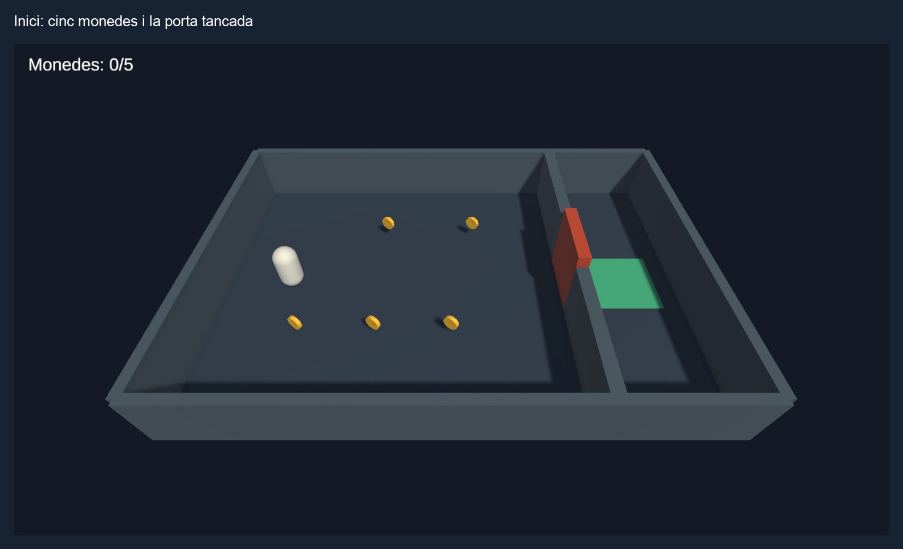
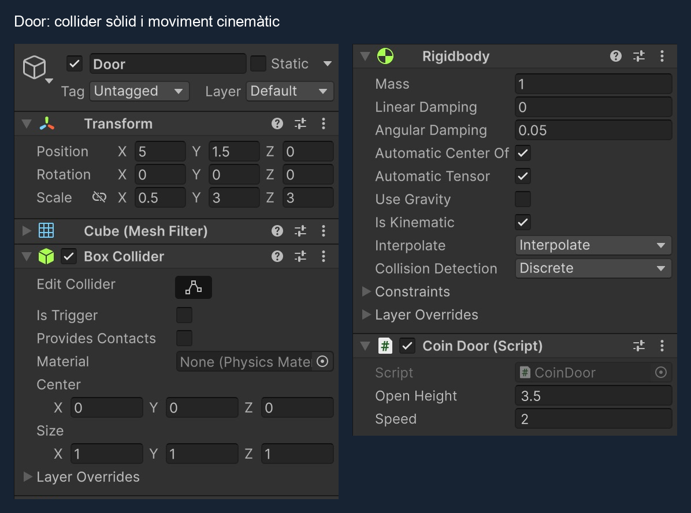
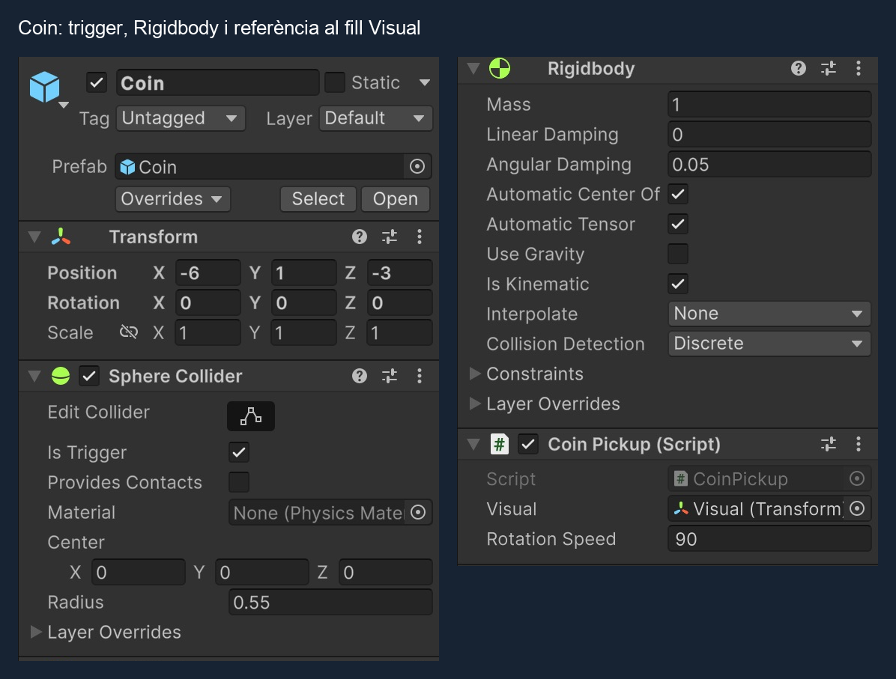
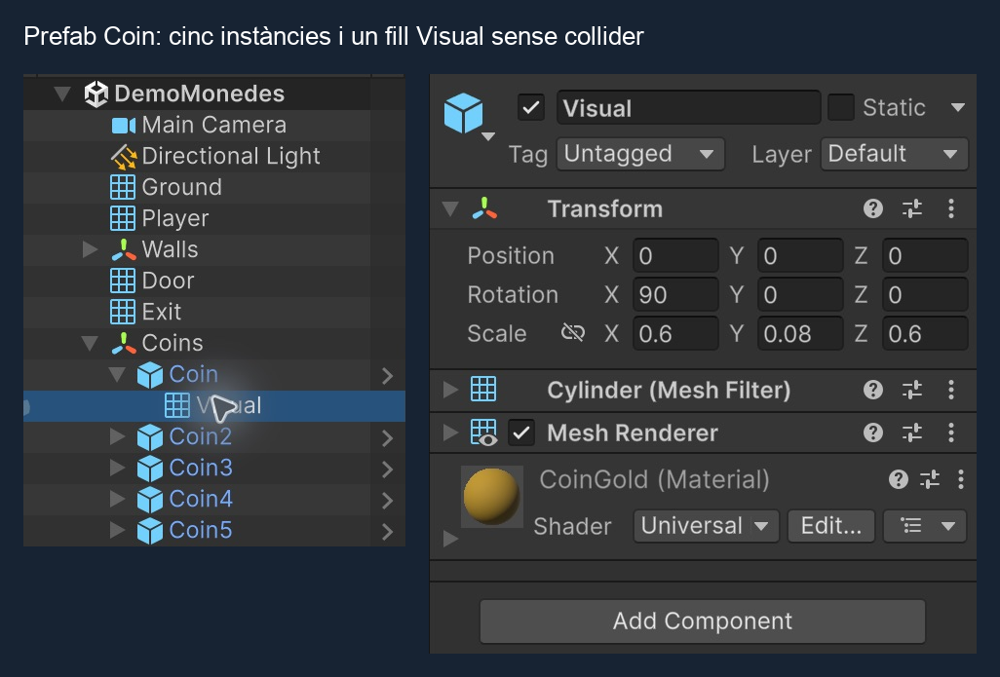
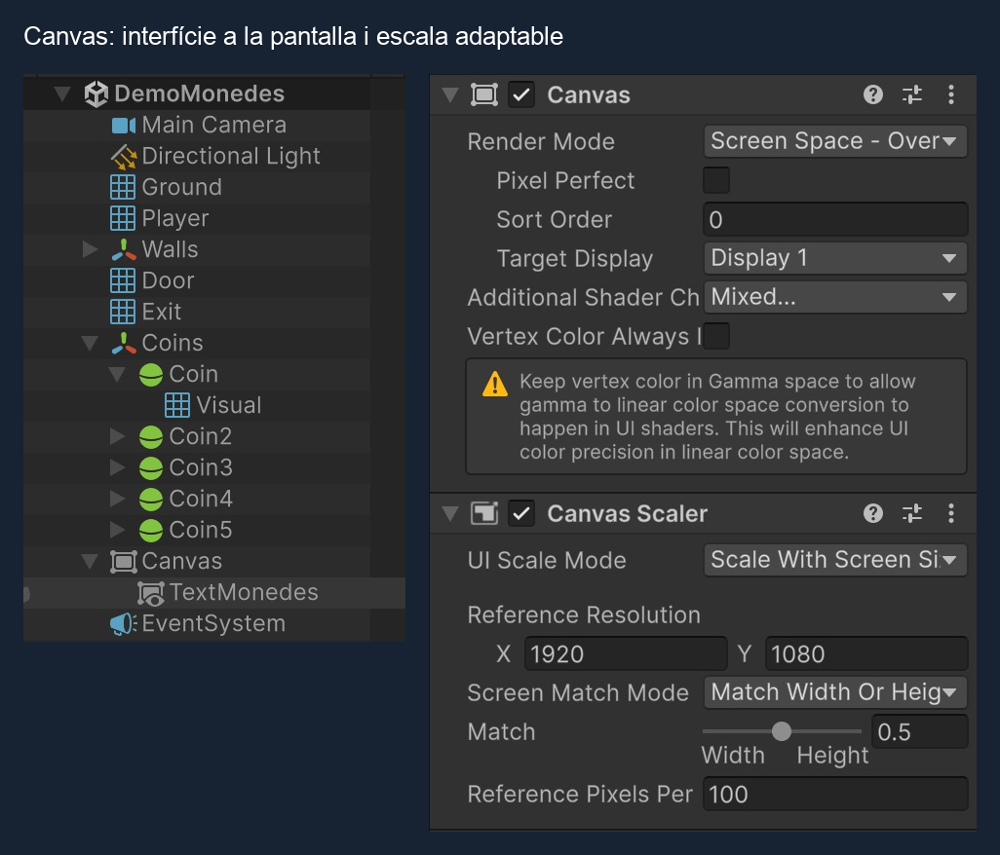
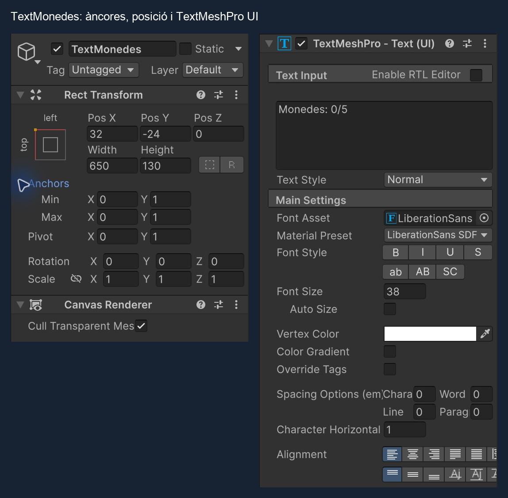
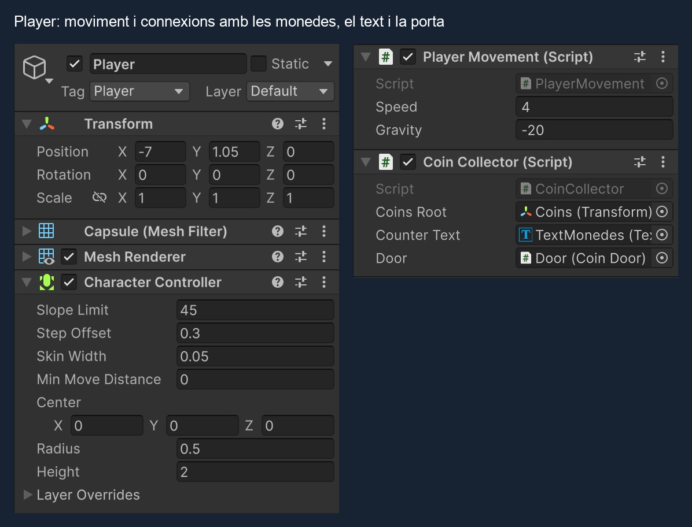
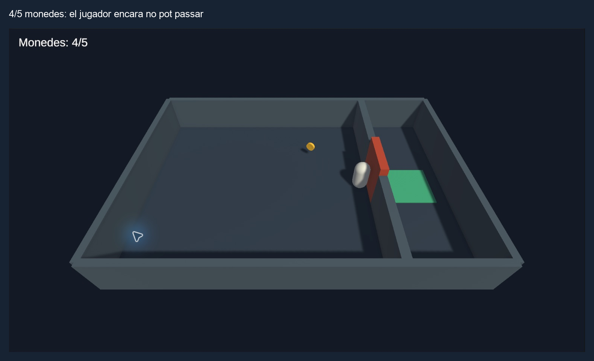
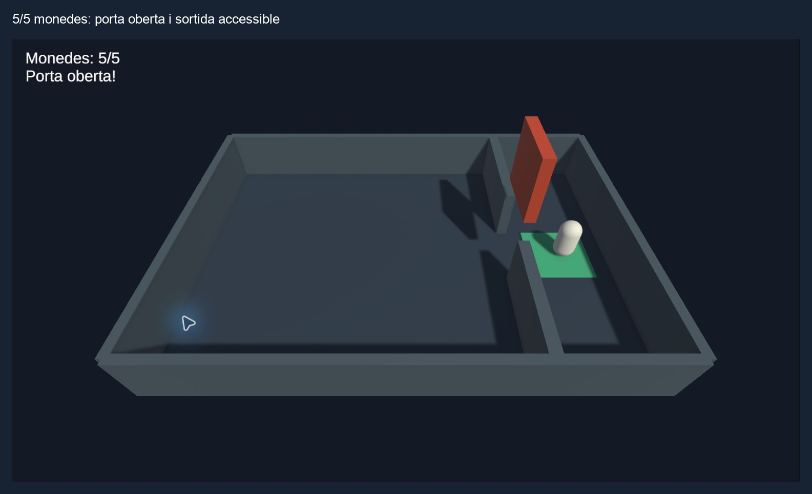

# Demo Monedes i porta

En aquesta demo:

- El jugador es mou amb les fletxes.
- Cinc monedes giren i desapareixen quan el jugador les toca.
- Un text **TextMeshPro UI** dins d'un **Canvas** mostra `Monedes: 0/5`, `Monedes: 1/5`...
- La porta bloqueja el pas fins que s'han recollit **totes** les monedes.
- Amb l'última moneda, la porta s'aixeca i apareix `Porta oberta!`.

Treballarem **triggers, prefabs, estat de partida, Canvas, TextMeshPro i moviment d'un Rigidbody cinemàtic**. No cal Animator.



*Resultat inicial: el jugador blanc recull les monedes grogues per obrir la porta taronja i arribar a la marca verda.*

# Preparar el projecte

Aquesta guia comença en un **projecte 3D nou**. Inclou tots els objectes i els quatre scripts necessaris; no cal haver fet cap altra demo.

## Projecte, escena i carpetes

1. A **Unity Hub > New project**, tria la plantilla **Universal 3D** (URP), posa el nom **DemoMonedes** i crea el projecte.
2. A Unity, crea una escena amb **File > New Scene > Empty**. Així començarem amb la Hierarchy buida. Si ja tens una escena buida, utilitza-la.
3. A la finestra **Project**, dins d'Assets, crea les carpetes amb **Create > Folder**:

```text
Assets
├─ Scenes
├─ Scripts
├─ Prefabs
└─ Materials
   └─ DemoMonedes
```

4. Desa l'escena amb **File > Save As** a `Assets/Scenes/DemoMonedes.unity`.

Les captures d'aquesta guia corresponen a **Unity 6.6 amb URP**. També pots seguir-la en un projecte 3D Built-In utilitzant materials Standard.

## Instal·lar i activar Input System

El script de moviment llegirà les fletxes del teclat amb el nou **Input System**.

1. Obre **Window > Package Manager** (en algunes versions, **Window > Package Management > Package Manager**).
2. Selecciona **Unity Registry**, cerca **Input System** i prem **Install**. Si ja està instal·lat, continua.
3. Si Unity proposa activar el nou sistema d'entrada, accepta i deixa que es reiniciï.
4. A **Edit > Project Settings > Player > Other Settings > Active Input Handling**, comprova que hi ha **Input System Package (New)** o **Both**. Si ho canvies, reinicia l'Editor quan ho demani.
5. Torna a obrir `Assets/Scenes/DemoMonedes.unity` si cal.

No cal crear un fitxer Input Actions ni afegir el component Player Input: en aquesta demo llegim `Keyboard.current` directament.

## Preparar TextMeshPro

**Canvas** és el contenidor de la interfície. **TextMeshPro** és el component que dibuixa el text dins d'aquest contenidor.

A **Window > TextMeshPro > Import TMP Essential Resources**, importa els recursos essencials. També pot aparèixer aquesta proposta quan crees el primer text TMP. No cal importar **Examples & Extras**. Si ja existeix `Assets/TextMesh Pro/Resources/Fonts & Materials/LiberationSans SDF.asset`, els recursos essencials ja estan importats.

En versions on no aparegui aquest menú, comprova a Package Manager que tens **Unity UI (uGUI)**: en Unity 6, TextMeshPro forma part d'aquest paquet. Si el text no té cap font assignada, utilitzarem **LiberationSans SDF**, que s'inclou als recursos essencials.

# Crear l'escena

## Càmera i llum

En una escena Empty no hi ha càmera ni il·luminació: les crearem ara.

1. Fes **GameObject > Camera** i anomena l'objecte **Main Camera**.
2. A la capçalera de l'Inspector, assigna-li **Tag = MainCamera**.
3. Mantén els components **Camera** i **Audio Listener**. Només hi ha d'haver una càmera i un Audio Listener en aquesta demo.
4. Configura el Transform i el component Camera:

```text
Name: Main Camera
Tag: MainCamera
Scale: 1, 1, 1
Projection: Perspective
Clipping Planes: Near = 0.3, Far = 1000
```

La posició, la rotació i el camp de visió són:

```text
Position: 0, 14, -13
Rotation: 48, 0, 0
Field of View: 60
```

Per reproduir el fons de les captures, a la càmera selecciona **Environment > Background Type = Solid Color** i un blau fosc, aproximadament `#141C29`.

Crea **GameObject > Light > Directional Light** i deixa el nom **Directional Light**. Configura-la:

```text
Position: 0, 3, 0
Rotation: 50, -30, 0
Scale: 1, 1, 1
Color: blanc
Intensity: 1
```

Per tenir una il·luminació uniforme, a **Window > Rendering > Lighting > Environment** posa **Environment Lighting > Source = Color** i un gris mitjà a **Ambient Color**. La Directional Light il·lumina tot el recinte; no calen altres llums.

## Materials

A la carpeta `Assets/Materials/DemoMonedes`, amb **Create > Material**, crea aquests materials i assigna'ls als objectes corresponents arrossegant-los sobre el seu Mesh Renderer:

| Material | Color orientatiu | Objectes |
|---|---|---|
| GroundMonedes | blau grisós `#34465E` | Ground |
| WallMonedes | gris blau `#52657A` | Els murs |
| PlayerMonedes | blanc `#E8EFF7` | Player |
| DoorMonedes | taronja `#C8553D` | Door |
| CoinGold | groc `#FFCE3A` | Visual de la moneda |
| ExitMonedes | verd `#4DBD98` | Exit |

Utilitza **Universal Render Pipeline/Lit** en URP o **Standard** en Built-In. El color és **Base Map** en URP o **Albedo** en Built-In. Els colors són només visuals: la detecció no depèn d'ells.

## Terra i jugador

Crea els objectes 3D des de **GameObject > 3D Object** o amb el menú contextual de la Hierarchy. Per afegir components, selecciona l'objecte i prem **Add Component** a l'Inspector. Els objectes buits es creen amb **GameObject > Create Empty**.

Excepte quan indiquem un pare, deixa els objectes a l'arrel de la Hierarchy. Escriu els valors del Transform: crear un objecte des de la vista Scene pot donar-li una posició inicial diferent. Per als objectes buits que agrupen fills, deixa Position i Rotation a `(0, 0, 0)` i Scale a `(1, 1, 1)`.

Crea un **3D Object > Plane**:

```text
Name: Ground
Position: 0, 0, 0
Rotation: 0, 0, 0
Scale: 2, 1, 1.4
Material: GroundMonedes
```

Mantén el **Mesh Collider**. Aquest terra ocupa aproximadament 20 × 14 unitats.

Crea un **3D Object > Capsule**:

```text
Name: Player
Position: -7, 1.05, 0
Rotation: 0, 0, 0
Scale: 1, 1, 1
Tag: Player
Material: PlayerMonedes
```

El tag **Player** ja existeix a Unity: selecciona’l al desplegable Tag de l’Inspector.

- Elimina el **Capsule Collider** original.
- Afegeix un **Character Controller** amb **Center = (0, 0, 0)**, **Height = 2**, **Radius = 0.5**, **Step Offset = 0.3**, **Skin Width = 0.05** i **Min Move Distance = 0**.
- Crea i afegeix **PlayerMovement.cs** seguint l’apartat següent, amb **Speed = 4** i **Gravity = -20**.
- No afegeixis cap Rigidbody al jugador.

## Moviment del jugador: PlayerMovement

A `Assets/Scripts`, crea un script **MonoBehaviour Script** (o **C# Script**, segons la versió) i anomena'l **PlayerMovement**. Obre'l i substitueix tot el contingut pel codi següent. El fitxer ha de dir-se **PlayerMovement.cs**, igual que la classe.

```csharp
using UnityEngine;
using UnityEngine.InputSystem;

[RequireComponent(typeof(CharacterController))]
public class PlayerMovement : MonoBehaviour
{
    public float speed = 4f;
    public float gravity = -20f;

    private CharacterController controller;
    private float verticalSpeed;

    void Awake()
    {
        controller = GetComponent<CharacterController>();
    }

    void Update()
    {
        Vector3 movement = Vector3.zero;
        Keyboard keyboard = Keyboard.current;

        if (keyboard != null)
        {
            if (keyboard.upArrowKey.isPressed)
                movement += Vector3.forward;

            if (keyboard.downArrowKey.isPressed)
                movement += Vector3.back;

            if (keyboard.leftArrowKey.isPressed)
                movement += Vector3.left;

            if (keyboard.rightArrowKey.isPressed)
                movement += Vector3.right;
        }

        // Manté el jugador en contacte amb el terra.
        if (controller.isGrounded && verticalSpeed < 0f)
            verticalSpeed = -2f;

        verticalSpeed += gravity * Time.deltaTime;

        Vector3 displacement = movement.normalized * speed * Time.deltaTime;
        displacement.y = verticalSpeed * Time.deltaTime;

        controller.Move(displacement);
    }

}
```

Desa el fitxer, torna a Unity i espera que acabi de compilar. Arrossega **PlayerMovement.cs** sobre el Player de la Hierarchy o afegeix-lo amb **Add Component > Player Movement**. No l'afegeixis dues vegades.

- `Keyboard.current` llegeix les quatre fletxes. Les fletxes mouen el jugador pels eixos X i Z del món.
- `normalized` evita anar més ràpid en diagonal.
- `Time.deltaTime` fa que la velocitat s'expressi en unitats per segon.
- `CharacterController.Move()` desplaça el jugador respectant els colliders sòlids.
- El Character Controller no aplica gravetat automàticament: `verticalSpeed` i `gravity` la calculen. No cal Rigidbody al Player.

Aquest script és complet i només depèn de Unity i del paquet Input System. La demo necessita quatre scripts en total: **PlayerMovement**, **CoinCollector**, **CoinPickup** i **CoinDoor**.

## Murs i pas de sortida

Crea un objecte buit **Walls** a l'origen. Dins, crea sis **Cubes**, sense girar-los, amb aquestes posicions i escales:

| Objecte | Position | Scale |
|---|---|---|
| WallNorth | `0, 1.25, 7` | `20, 2.5, 0.4` |
| WallSouth | `0, 1.25, -7` | `20, 2.5, 0.4` |
| WallWest | `-10, 1.25, 0` | `0.4, 2.5, 14` |
| WallEast | `10, 1.25, 0` | `0.4, 2.5, 14` |
| WallGateNorth | `5, 1.25, 4.25` | `0.5, 2.5, 5.5` |
| WallGateSouth | `5, 1.25, -4.25` | `0.5, 2.5, 5.5` |

Assigna **WallMonedes** als sis murs. Mantén els **Box Colliders**, amb **Is Trigger desactivat**. No cal Rigidbody als murs. Els quatre primers tanquen el recinte; els dos últims deixen un pas de 3 unitats entre ells. Així no podem esquivar la porta per un lateral.

Les mides de la taula són **Transform > Scale**. Deixa **Box Collider > Size = (1, 1, 1)**.

## Porta

Crea un **Cube** a l'arrel de la jerarquia:

```text
Name: Door
Position: 5, 1.5, 0
Rotation: 0, 0, 0
Scale: 0.5, 3, 3
Material: DoorMonedes
```

- Mantén **Box Collider**, amb **Is Trigger desactivat**: la porta ha de bloquejar físicament el jugador.
- Afegeix un **Rigidbody**.
- Activa **Is Kinematic** i desactiva **Use Gravity**.
- Deixa **Interpolate = Interpolate** per suavitzar el moviment visual.
- Deixa **Static** desactivat a la capçalera de l'Inspector.

Quan s'obri, pujarà 3.5 unitats: el seu centre passarà de `Y = 1.5` a `Y = 5`. La vora inferior quedarà a `Y = 3.5`, prou alta perquè passi el jugador.

## Zona de sortida

Crea un altre **Cube**:

```text
Name: Exit
Position: 7.5, 0.04, 0
Rotation: 0, 0, 0
Scale: 3, 0.08, 3
Material: ExitMonedes
```

És una marca verda darrere de la porta. No porta cap script ni trigger: en aquesta demo, l'objectiu és desbloquejar el pas i travessar-lo.

# Crear els scripts de recollida i de la porta

Ja tenim PlayerMovement. A `Assets/Scripts`, crea i completa **els tres scripts següents** abans d'afegir-los als objectes. Els scripts es referencien entre ells: espera a tenir-los tots desats i sense errors de compilació.

## Estat de la partida: CoinCollector

Aquest component anirà al **Player**. Compta les monedes de l'escena a l'inici, actualitza el text i avisa la porta quan s'ha recollit l'última.

**CoinCollector.cs**:

```csharp
using TMPro;
using UnityEngine;

public class CoinCollector : MonoBehaviour
{
    public Transform coinsRoot;
    public TMP_Text counterText;
    public CoinDoor door;

    private int totalCoins;
    private int collectedCoins;

    void Start()
    {
        if (coinsRoot == null || counterText == null || door == null)
        {
            Debug.LogError("Assigna Coins Root, Counter Text i Door al Player.", this);
            enabled = false;
            return;
        }

        // Count the active coins in this level once, before collecting any.
        totalCoins = coinsRoot.GetComponentsInChildren<CoinPickup>().Length;

        if (totalCoins == 0)
        {
            Debug.LogError("Afegeix almenys una moneda activa dins de Coins.", this);
            enabled = false;
            return;
        }

        RefreshCounter();
    }

    public void CollectCoin()
    {
        collectedCoins++;
        RefreshCounter();

        if (collectedCoins == totalCoins)
            door.Open();
    }

    void RefreshCounter()
    {
        counterText.text = $"Monedes: {collectedCoins}/{totalCoins}";

        if (collectedCoins == totalCoins)
            counterText.text += "\nPorta oberta!";
    }
}
```

- `coinsRoot` és l'objecte buit **Coins** que crearem per agrupar les monedes.
- `GetComponentsInChildren<CoinPickup>()` compta les monedes actives que conté. No cal escriure un `5` al codi.
- `TMP_Text` permet referenciar el text TextMeshPro del Canvas.
- `collectedCoins` és l'estat de partida: comença a zero cada vegada que fem Play.
- El total es calcula una vegada a `Start()`. Aquesta versió treballa amb monedes col·locades abans de començar, no amb monedes generades durant la partida.

## Recollida: CoinPickup

Aquest component anirà al **pare de la moneda**, juntament amb el trigger i el Rigidbody. El fill Visual gira, però el trigger es manté estable.

**CoinPickup.cs**:

```csharp
using UnityEngine;

public class CoinPickup : MonoBehaviour
{
    public Transform visual;
    public float rotationSpeed = 90f;

    private bool collected;

    void Update()
    {
        if (visual != null)
            visual.Rotate(Vector3.up, rotationSpeed * Time.deltaTime, Space.World);
    }

    void OnTriggerEnter(Collider other)
    {
        CoinCollector collector = other.GetComponent<CoinCollector>();

        // Only the player with an active collector can pick up a coin.
        if (collected || collector == null || !collector.isActiveAndEnabled)
            return;

        collected = true;
        collector.CollectCoin();
        gameObject.SetActive(false);
    }
}
```

- `OnTriggerEnter()` s'executa quan un collider entra al trigger.
- `GetComponent<CoinCollector>()` identifica el jugador. Tenir només el tag Player no substitueix aquest component.
- `collected` evita comptar dues vegades la mateixa moneda.
- `SetActive(false)` amaga la moneda i desactiva el seu collider i script. No modifica el prefab original de Project.
- El prefab no necessita una referència a un jugador concret de l'escena: la troba a través del collider que l'ha tocat.

## Obertura: CoinDoor

Aquest component anirà a **Door**. Comença tancada i només es mou després de rebre `Open()`.

**CoinDoor.cs**:

```csharp
using UnityEngine;

[RequireComponent(typeof(Rigidbody))]
public class CoinDoor : MonoBehaviour
{
    public float openHeight = 3.5f;
    public float speed = 2f;

    private Rigidbody body;
    private Vector3 openPosition;
    private bool opening;

    void Awake()
    {
        body = GetComponent<Rigidbody>();
        openPosition = body.position + Vector3.up * openHeight;
    }

    public void Open()
    {
        opening = true;
    }

    void FixedUpdate()
    {
        if (!opening)
            return;

        Vector3 nextPosition = Vector3.MoveTowards(
            body.position, openPosition, speed * Time.fixedDeltaTime
        );

        body.MovePosition(nextPosition);
    }
}
```

- `Awake()` calcula el destí a partir de la posició inicial.
- `Open()` activa el moviment; no teletransporta la porta.
- `FixedUpdate()` i `Rigidbody.MovePosition()` mouen el Rigidbody cinemàtic.
- El Box Collider es mou amb la porta. No cal apagar-lo ni convertir-lo en trigger.
- La porta es queda oberta en arribar al destí. No hi ha tancament automàtic en aquesta demo.

Afegeix **CoinDoor.cs** a Door i deixa **Open Height = 3.5** i **Speed = 2**.



*Is Trigger desactivat; Use Gravity desactivat; Is Kinematic activat. El script mou tot l’objecte Door, inclòs el collider.*

# Crear una moneda i convertir-la en prefab

## Pare: Coin

1. Crea un objecte buit **Coins** a l'origen, amb rotació zero i escala `(1, 1, 1)`.
2. Dins de Coins, crea un objecte buit **Coin**:

```text
Position: -6, 1, -3
Rotation: 0, 0, 0
Scale: 1, 1, 1
```

3. Afegeix un **Sphere Collider**, amb **Radius = 0.55**, **Center = (0, 0, 0)** i **Is Trigger activat**.
4. Afegeix un **Rigidbody**, amb **Is Kinematic activat**, **Use Gravity desactivat** i **Interpolate = None**.
5. Afegeix **CoinPickup.cs**.

El trigger permet travessar la moneda; no és un obstacle sòlid. El Rigidbody cinemàtic configura la detecció de triggers sense fer caure la moneda. **No** afegeixis un Rigidbody al Player.

## Fill: Visual

Dins de Coin, crea un **3D Object > Cylinder** i anomena'l **Visual**. Configura el seu Transform **local**:

```text
Position: 0, 0, 0
Rotation: 90, 0, 0
Scale: 0.6, 0.08, 0.6
```

- Elimina el collider del Cylinder. La detecció ja és al pare Coin.
- Assigna el material **CoinGold** al seu Mesh Renderer.
- Selecciona el pare Coin i arrossega el fill **Visual** al camp **Visual** de CoinPickup.
- Deixa **Rotation Speed = 90**.



*El pare Coin detecta el jugador amb un Sphere Collider de radi 0.55. El camp Visual apunta al seu propi fill.*

```text
Coins
└─ Coin                  ← Sphere Collider + Rigidbody + CoinPickup
   └─ Visual             ← Cylinder + Mesh Renderer, sense collider
```

## Guardar i repartir el prefab

1. Obre la carpeta `Assets/Prefabs` que has creat al principi.
2. Arrossega **Coin**, des de la Hierarchy fins a aquesta carpeta. Obtindràs **Coin.prefab**.
3. Duplica la instància de l'escena quatre vegades, sempre dins de Coins.
4. Canvia els noms i les posicions:

| Instància | Position |
|---|---|
| Coin | `-6, 1, -3` |
| Coin2 | `-3, 1, -3` |
| Coin3 | `0, 1, -3` |
| Coin4 | `-3, 1, 3` |
| Coin5 | `1, 1, 3` |

Totes comparteixen el mateix prefab i el mateix comportament. Només canvia la posició de cada instància. El camp Visual es conserva apuntant al fill de cada moneda; no l'assignis a un fill d'una altra instància.



*La icona blava identifica les instàncies del prefab. Visual només té la geometria i el material: no hi ha cap collider al fill.*

# Crear el Canvas i el comptador

1. Fes **GameObject > UI > Text - TextMeshPro**. Unity crearà un **Canvas** i un **EventSystem** si encara no existeixen.
2. Anomena el text **TextMonedes**.
3. Al Canvas, deixa **Render Mode = Screen Space - Overlay**.
4. A **Canvas Scaler**, selecciona **UI Scale Mode = Scale With Screen Size**, **Reference Resolution = 1920 × 1080** i **Match = 0.5**.



*TextMonedes és fill del Canvas. Screen Space - Overlay dibuixa el comptador directament a la pantalla.*

Al **Rect Transform** de TextMonedes, posa les àncores a la cantonada superior esquerra:

```text
Anchors Min: 0, 1
Anchors Max: 0, 1
Pivot: 0, 1
Pos X: 32
Pos Y: -24
Width: 650
Height: 130
```

Pots desplegar els valors d'Anchors i Pivot i escriure'ls. Pos Y és negatiu perquè el text baixa des de la cantonada superior.

Al component **TextMeshPro - Text (UI)**:

```text
Text: Monedes: 0/5
Font Asset: LiberationSans SDF
Font Size: 38
Color: blanc
Alignment: superior esquerra
Auto Size: desactivat
Raycast Target: desactivat
```

En aquesta versió de TextMeshPro, trobaràs **Raycast Target** desplegant **Extra Settings** del component de text.

El `0/5` de l'Inspector és només una previsualització: CoinCollector l'actualitza quan comença Play.



*Les àncores i el pivot són (0, 1). La posició (32, -24) deixa un marge a la cantonada superior esquerra.*

```text
Canvas
└─ TextMonedes (TextMeshPro - Text UI)
EventSystem
```

No triïs el text 3D que es crea fora del Canvas. **Screen Space - Overlay** manté el comptador fix a la pantalla encara que el jugador es mogui.

Comprova que la Hierarchy té **Canvas > TextMonedes** i un **EventSystem** a l'arrel. Si falta el Canvas, crea'l amb **GameObject > UI > Canvas** i fes que TextMonedes en sigui fill. Si falta l'EventSystem, crea'l amb **GameObject > UI > Event System**.

Si l'EventSystem té **Standalone Input Module** i utilitzes només el nou Input System, substitueix-lo per **Input System UI Input Module**. Aquesta demo només mostra text i no té botons, però així la interfície queda preparada per al sistema d'entrada del projecte.

# Assignar les referències

Selecciona **Player** a la Hierarchy i afegeix **CoinCollector.cs**:

| Camp de CoinCollector | Objecte que hi has d'arrossegar |
|---|---|
| Coins Root | L'objecte pare **Coins** de la Hierarchy |
| Counter Text | **Canvas / TextMonedes** |
| Door | L'objecte **Door**, amb CoinDoor afegit |

No arrosseguis el fitxer Coin.prefab a Coins Root: necessitem el pare de les **instàncies de l'escena**. Tampoc no arrosseguis els fitxers `.cs` als camps; selecciona els objectes que contenen els components.



*Coins Root → Coins; Counter Text → TextMonedes; Door → Door. Cap d’aquests tres camps ha de quedar a None.*

Abans de fer Play comprova:

- Hi ha cinc instàncies actives de Coin dins de Coins.
- El Player té **Character Controller**, **PlayerMovement** i **CoinCollector**.
- Cada moneda té **Sphere Collider (Is Trigger)**, **Rigidbody cinemàtic** i **CoinPickup** amb Visual assignat.
- Door té **Box Collider sòlid**, **Rigidbody cinemàtic** i **CoinDoor**.
- Els tres camps de CoinCollector estan assignats.
- No hi ha errors vermells a Console.

## Jerarquia final

Comprova que has creat tots aquests objectes. Cada instància de Coin té el seu propi fill Visual:

```text
DemoMonedes
├─ Main Camera                 Camera + Audio Listener
├─ Directional Light           Light
├─ Ground                      Mesh Collider
├─ Player                      Character Controller + PlayerMovement + CoinCollector
├─ Walls
│  ├─ WallNorth                Box Collider
│  ├─ WallSouth                Box Collider
│  ├─ WallWest                 Box Collider
│  ├─ WallEast                 Box Collider
│  ├─ WallGateNorth            Box Collider
│  └─ WallGateSouth            Box Collider
├─ Door                        Box Collider + Rigidbody + CoinDoor
├─ Exit                        Box Collider
├─ Coins
│  ├─ Coin                     Sphere Collider + Rigidbody + CoinPickup
│  │  └─ Visual                Mesh Renderer, sense collider
│  ├─ Coin2
│  │  └─ Visual
│  ├─ Coin3
│  │  └─ Visual
│  ├─ Coin4
│  │  └─ Visual
│  └─ Coin5
│     └─ Visual
├─ Canvas                      Canvas + Canvas Scaler + Graphic Raycaster
│  └─ TextMonedes              TextMeshPro - Text (UI)
└─ EventSystem                 Event System + Input System UI Input Module
```

Els objectes 3D visibles també conserven els seus Mesh Filter i Mesh Renderer. **Coin2–Coin5 tenen els mateixos components que Coin**, perquè són instàncies del mateix prefab.

Desa l'escena. Fes els canvis permanents fora de Play.

# Provar la demo

Fes **Play**, selecciona **Game** i mou-te amb les fletxes.

## 1. Porta tancada

- A l'inici, el text mostra `Monedes: 0/5`.
- Prova de travessar la porta: el collider t'ha d'aturar.
- Els murs impedeixen arribar a la sortida esquivant la porta.

## 2. Recollir monedes

- Toca una moneda: desapareix i el text passa a `Monedes: 1/5`.
- Torna a passar pel mateix lloc: el comptador no torna a pujar.
- Recull-ne quatre: a `Monedes: 4/5`, la porta encara està tancada.



*Prova real a Unity: encara queda una moneda i el collider de la porta atura el jugador davant del pas.*

## 3. Obrir la porta

- Recull l'última moneda: el text mostra `Monedes: 5/5` i `Porta oberta!`.
- La porta puja de forma gradual fins a `Y = 5`.
- Espera que deixi espai i travessa el pas fins a la marca verda Exit.
- Atura Play i torna a començar: les monedes reapareixen, el comptador torna a zero i la porta torna a estar tancada.



*Amb 5/5, la porta ha pujat fins a Y = 5. El jugador ja ha travessat el pas fins a Exit.*

## 4. Canviar el nombre de monedes

Fora de Play, afegeix una sisena instància **dins de Coins**. En tornar a fer Play, el comptador ha de mostrar `0/6` i la porta només s'obrirà després de recollir les sis. No cal modificar el codi ni el text manualment.

Aquesta prova és opcional; pots tornar a deixar les cinc instàncies de la taula per conservar la demo original.

**Comprovacions fetes en aquesta escena:** recompte de 0/5 a 5/5, absència de duplicats en tornar al lloc d’una moneda, porta bloquejada a 0/5 i 4/5, obertura gradual fins a Y = 5, pas lliure fins a Exit i reinici a 0/5. Les captures s’han pres a Unity durant aquestes comprovacions.

**Verificació de la guia independent:** s’ha reconstruït la demo des d’una escena buida, creant de nou els quatre scripts amb el codi d’aquest document. El moviment, els triggers, el comptador, el bloqueig i l’obertura de la porta funcionen sense scripts d’altres demos. També s’ha comprovat la variant de sis monedes: la porta continua tancada amb 5/6 i s’obre amb 6/6. L’escena desada conserva les cinc monedes originals.

# Si alguna cosa no funciona

| Símptoma | Què cal revisar |
|---|---|
| Error amb `UnityEngine.InputSystem` | Instal·la Input System a Package Manager i espera que Unity recompili. |
| Game mostra “No cameras rendering” | Crea Main Camera, comprova que el component Camera està habilitat i que Target Display és Display 1. |
| El jugador no es mou | Game té el focus, Pause està desactivat, Input System actiu i PlayerMovement afegit. |
| La moneda bloqueja el jugador | Is Trigger al Sphere Collider del pare; elimina el collider del fill Visual. |
| La moneda no es recull | CoinPickup al pare, Rigidbody cinemàtic, CoinCollector actiu al mateix objecte que Character Controller. |
| La moneda no gira | Visual assignat al seu propi fill i Rotation Speed major que zero. |
| El text no es veu | TextMonedes dins del Canvas, Screen Space - Overlay, recursos TMP importats, Font Asset i Rect Transform. |
| El total és incorrecte | Totes les monedes actives han de ser filles de Coins i tenir CoinPickup. El total es calcula en començar Play. |
| La porta s'obre abans d'hora | Alguna moneda pot haver quedat fora de Coins o desactivada abans de començar. |
| El jugador travessa la porta tancada | Box Collider de Door habilitat i Is Trigger desactivat. |
| La porta no puja | Door assignada a CoinCollector, CoinDoor actiu, Rigidbody cinemàtic, Open Height i Speed positius. |

# Què hem après

```text
Player entra al trigger de Coin
             ↓
CoinPickup comprova CoinCollector i evita duplicats
             ↓
CoinCollector suma una moneda i actualitza TextMonedes
             ↓
S'han recollit totes?
       sí → CoinDoor.Open()
             ↓
La porta puja i deixa passar el jugador
```

La moneda detecta el contacte; el jugador guarda el recompte; la porta controla el seu moviment; el Canvas mostra la informació. Cada script té una responsabilitat concreta.

## Referències

- [Unity: TextMeshPro i text dins del Canvas](https://docs.unity3d.com/Packages/com.unity.textmeshpro@3.0/manual/index.html).
- [Unity: OnTriggerEnter](https://docs.unity3d.com/6000.0/Documentation/ScriptReference/Collider.OnTriggerEnter.html).
- [Unity: Rigidbody.MovePosition](https://docs.unity3d.com/6000.0/Documentation/ScriptReference/Rigidbody.MovePosition.html).
