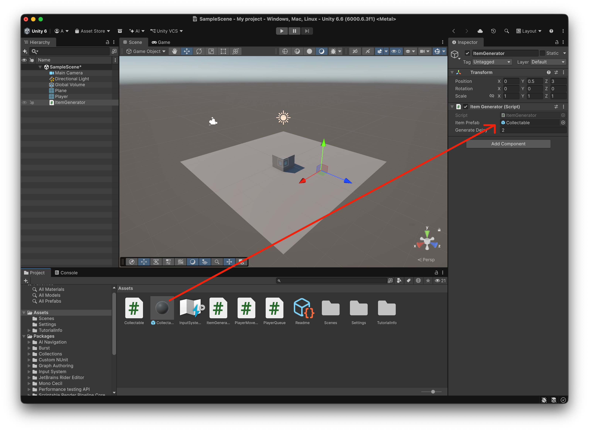

# Demo Prefabs

En aquesta demo:

- Un generador crea un objecte recollible.
- El jugador recull l'objecte en tocar-lo.
- Els objectes recollits formen una cua darrere del jugador.
- Quan es recull l'objecte del generador, al cap de 2 segons se'n genera un altre.

# Crear l'escena

Crea una escena nova.

Mou la càmera a:

```text
Position X: 0
Position Y: 5
Position Z: -5
Rotation X: 45
```

Afegeix:

- Un **Plane**
- Un **Cube** que farà de jugador, a 
  ```text
  Position X: 0
  Position Y: 0.5
  Position Z: 0
  ```
- Un objecte buit amb **"Create Empty"** i anomena'l **ItemGenerator**

Al **Cube**:

- Canvia el nom a `Player`
- Afegeix el tag `Player`
- Afegeix un component **Character Controller** amb:
- Esborra el `Box Collider` que té per defecte, la del `Character Controller` ja és suficient.

```text
Center: 0, 0, 0
Height: 1
Radius: 0.5
```

# Crear els scripts

Crea i completa els quatre scripts abans de configurar els components a l’Inspector.

Crea l'script **PlayerMovement.cs** i afegeix-lo al `Player`.

```csharp
using UnityEngine;
using UnityEngine.InputSystem;

public class PlayerMovement : MonoBehaviour
{
    public float speed = 5f;

    private CharacterController controller;

    void Start()
    {
        controller = GetComponent<CharacterController>();
    }

    void Update()
    {
        Vector3 movement = Vector3.zero;

        if (Keyboard.current.upArrowKey.isPressed)
            movement += Vector3.forward;

        if (Keyboard.current.downArrowKey.isPressed)
            movement += Vector3.back;

        if (Keyboard.current.leftArrowKey.isPressed)
            movement += Vector3.left;

        if (Keyboard.current.rightArrowKey.isPressed)
            movement += Vector3.right;

        controller.Move(
            movement.normalized * speed * Time.deltaTime
        );
    }
}
```

Crea l'script **PlayerQueue.cs** i afegeix-lo al `Player`.

```csharp
using UnityEngine;
using System.Collections.Generic;

public class PlayerQueue : MonoBehaviour
{
    public float distance = 0.6f;
    public float followSpeed = 10f;

    private List<Transform> items = new List<Transform>();

    // Add an item to the queue
    public void AddItem(Transform item)
    {
        items.Add(item);
    }

    // Update the queue after the player has moved
    void LateUpdate()
    {
        Transform target = transform;

        // Each item follows the previous one
        foreach (Transform item in items)
        {
            Vector3 direction = item.position - target.position;

            if (direction.magnitude > distance)
            {
                Vector3 targetPosition =
                    target.position + direction.normalized * distance;

                item.position = Vector3.Lerp(
                    item.position,
                    targetPosition,
                    followSpeed * Time.deltaTime
                );
            }

            target = item;
        }
    }
}
```

Crea l'script **Collectable.cs**:

```csharp
using UnityEngine;

public class Collectable : MonoBehaviour
{
    public ItemGenerator generator;

    private bool collected = false;

    void OnTriggerEnter(Collider other)
    {
        Debug.Log("Trigger detectat amb: " + other.name);

        if (collected || !other.CompareTag("Player"))
            return;

        collected = true;

        PlayerQueue queue = other.GetComponent<PlayerQueue>();
        queue.AddItem(transform);
        Debug.Log("Objecte recollit!");

        if (generator != null)
            generator.ItemCollected();
    }
}
```

Crea l'script **ItemGenerator.cs** i assigna'l a l'objecte buit `ItemGenerator`:

```csharp
using UnityEngine;
using System.Collections;

public class ItemGenerator : MonoBehaviour
{
    public GameObject itemPrefab;
    public float generateDelay = 2f;

    private GameObject currentItem;

    void Start()
    {
        Generate();
    }

    void Generate()
    {
        currentItem = Instantiate(
            itemPrefab,
            transform.position,
            Quaternion.identity
        );

        Collectable collectable = currentItem.GetComponent<Collectable>();
        collectable.generator = this;
    }

    public void ItemCollected()
    {
        currentItem = null;
        StartCoroutine(GenerateDelayed());
    }

    IEnumerator GenerateDelayed()
    {
        yield return new WaitForSeconds(generateDelay);
        Generate();
    }
}
```

# Objectes recollibles (Prefab)

Afegeix un **3D Object > Sphere**.

Configura'l:

- Nom: `Collectable`
- Escala: aproximadament `0.5, 0.5, 0.5`
- Afegeix el tag `Collectable`
- Activa **Is Trigger** al seu `Sphere Collider`
- Afegeix un **Rigidbody**
- Activa **Is Kinematic**
- Desactiva **Use Gravity**

Assigna l'script `Collectable.cs` a aquesta esfera.

Arrossega `Collectable` des de la jerarquia fins a **Assets** per convertir-lo en un **Prefab**.

**IMPORTANT:** **Esborra** després l'objecte `Collectable` de l'escena.

# Generador d'objectes

Selecciona l'objecte buit `ItemGenerator`.

Situa'l, per exemple, a:

```text
X: 0
Y: 0.5
Z: 3
```

Afegeix l'script a `ItemGenerator`.

A l'Inspector:

<center>

</center>
<br/>

- Arrossega el prefab des de *Assets* cap a `Collectable` al camp **Item Prefab**
- Deixa **Generate Delay** a `2`

# Provar la demo

Comprova que:

- `Player` té:
  - Tag `Player`
  - `Character Controller`
  - `PlayerMovement`
  - `PlayerQueue`

- El prefab `Collectable` té:
  - Tag `Collectable`
  - `Sphere Collider` amb **Is Trigger**
  - `Rigidbody` amb **Is Kinematic**
  - `Collectable`

- `ItemGenerator` té:
  - `ItemGenerator.cs`
  - El prefab assignat a **Item Prefab**

Fes **Play**.

El funcionament ha de ser:

```text
Es genera un objecte
        ↓
El jugador el toca
        ↓
S'afegeix a la cua
        ↓
Espera 2 segons
        ↓
Es genera un altre objecte
        ↓
El jugador el recull
        ↓
La cua creix
```
