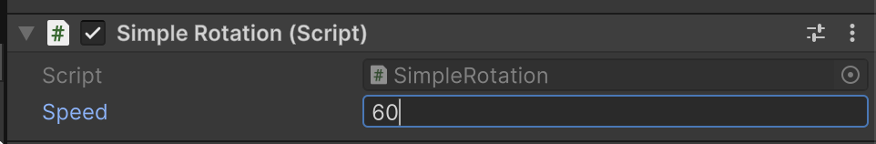
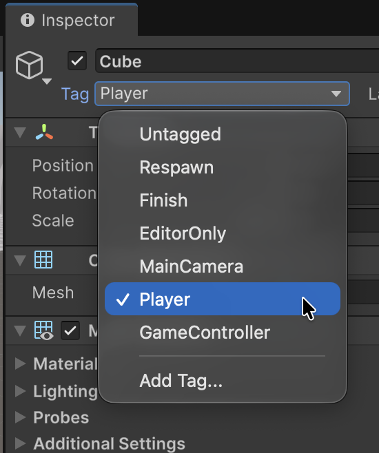
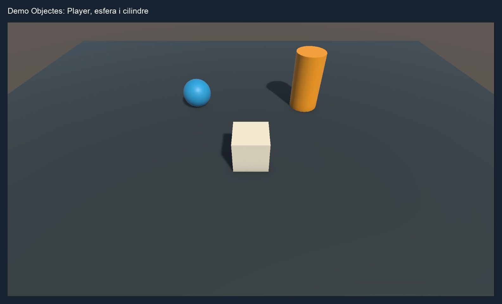
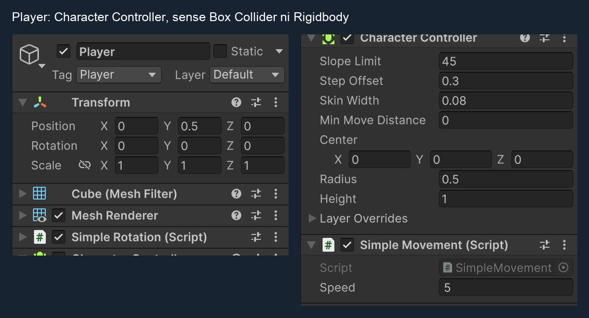
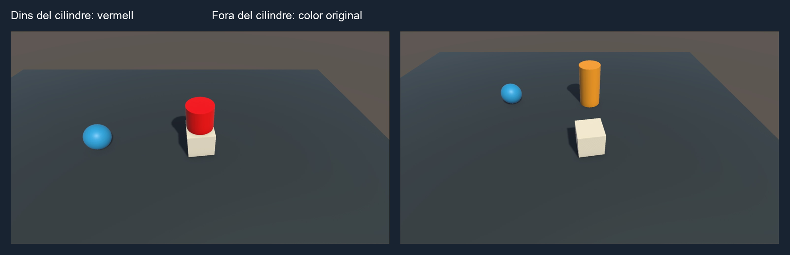

# Objectes Unity

Els GameObjects de *Unity* permeten afegir un o més arxius de codi per afectar-ne el comportament.

Crea una escena **Basic** amb **Main Camera** i **Directional Light** (si parteixes d’una escena buida, crea-les amb **GameObject > Camera** i **GameObject > Light > Directional Light**), i desa-la com a **DemoObjectes**. Utilitza un projecte **Universal 3D (URP)**: els exemples de color fan servir la propietat `_BaseColor` dels seus materials.

Per als apartats de teclat, comprova a **Window > Package Manager > Unity Registry** que **Input System** està instal·lat. 

A **Edit > Project Settings > Player > Other Settings > Configuration**, posa **Active Input Handling = Input System Package (New)** o **Both** i reinicia Unity si ho demana.

## MonoBehaviour

**El codi que s'associa a un objecte** s'ha de derivar de *MonoBehaviour*, i aquestes són les principals funcions:

- Afegeix un objecte tipus *"3D Object > Cube"* a l'escena, anomena’l **Player**, posa’l a `(0, 0.5, 0)` i assigna-li el tag **Player**.
- Posa **Main Camera** a `(0, 5, -5)`, amb rotació `(45, 0, 0)` i **Projection = Perspective**, **Field of View = 60**.
- Crea un nou script amb nom **"SimpleRotation"**, amb el següent codi
- Afegeix aquest script com a component del cub
- Fes play, s'ha de veure com gira el cub 
- A la pestanya **"Console"** es veuen els missatges de *"Debug.Log"*

Aquest codi té explicacions de les principals funcions dels objectes *MonoBehaviour*

```csharp
using UnityEngine;

/// Exemple complet per entendre el cicle de vida dels scripts Unity.
/// Mostra les funcions més importants i la seva execució en ordre.
public class SimpleRotation : MonoBehaviour
{

    // Etiqueta a la interfície de l'Inspector
    [Header("Velocitat de rotació")]

    // Variable pública que es pot modificar des de l'Inspector
    public float speed = 60f; 

    /// Es crida automàticament quan el component es carrega.
    /// Ideal per inicialitzar referències i valors que no depenen d'altres scripts.
    void Awake()
    {
        Debug.Log("Awake(): inicialització de components i variables.");
    }


    /// S'executa quan el component s'activa (després de Awake).
    /// Perfecte per subscriure's a events o reactivar estats.
    void OnEnable()
    {
        Debug.Log("OnEnable(): component activat.");
    }

    /// OnValidate s'executa automàticament quan canvia algun valor a l’Inspector o es recompila l’script.
    void OnValidate()
    {
        Debug.Log("OnValidate(): validant camps.");
    }

    /// Es crida un cop, abans del primer frame.
    /// Ideal per configurar valors inicials quan ja s’han inicialitzat tots els Awake(). 
    void Start()
    {
        Debug.Log("Start(): preparació inicial completada.");
    }

    /// S'executa cada frame (freqüència variable segons FPS).
    /// Perfecte per llegir inputs i fer moviments visuals.
    void Update()
    {
        // multiplicar per Time.deltaTime 
        // permet mantenir la velocitat de rotació, 
        // encara que hi hagi variacions de FPS
        float deltaTime = Time.deltaTime;
        transform.Rotate(0, speed * deltaTime, 0);
    }


    /// S'executa després de tots els Update().
    /// Ideal per càmeres o ajustos finals que depenen del moviment d’altres objectes.
    void LateUpdate()
    {
        // Exemple: seguir el jugador
        // cameraTransform.position = player.position + offset;
    }


    /// S'executa a intervals fixos (per defecte cada 0.02s).
    /// La freqüència es configura a "Project Settings > Time".
    /// Ideal per a física, forces o moviments amb Rigidbody.
    void FixedUpdate()
    {
        // Exemple: rb.AddForce(Vector3.up * 10f);
    }

    /// Es crida quan el component es desactiva.
    /// Ideal per desubscriure events o aturar processos.
    void OnDisable()
    {
        Debug.Log("OnDisable(): component desactivat.");
    }


    /// Es crida just abans d'eliminar l'objecte o tancar l’escena.
    /// Perfecte per alliberar recursos o guardar dades.
    void OnDestroy()
    {
        Debug.Log("OnDestroy(): objecte eliminat.");
    }
}
```

Conserva la resta del primer script: aquest fragment només mostra els canvis.

**Nota**: el camp `[Header("Velocitat de rotació")]` serveix per definir una etiqueta i és opcional

Les variables públiques dels objectes apareixen a la interfície de l'script de Unity i es poden modificar en temps d'execució.

- Apreta "Play"
- Modifica el valor a 200
- Torna'l a 60

Veuràs com canvia la velocitat de gir de l'objecte.

<center>

</center>
<br/>

## Propietats de l'objecte

Cada objecte de l’escena pot tenir components associats. 
Aquests components es poden veure i configurar des de *l’Inspector*.

**Unity** dóna accés directe a alguna informació de l'objecte:

- **gameObject**: el propi objecte vinculat
- **name**: nom de l'objecte
- **tag**: etiqueta assignada a l'objecte
- **transform**: posició, rotació, escalat

Els fragments d’aquest apartat són exemples independents: van dins d’un mètode del component, no fora de la classe ni tots seguits dins d’Update.

### Propietats de *gameObject*

- **"activeSelf"**: si l’objecte està activat localment (un pare desactivat també desactiva els seus fills):
```csharp
// Desactiva completament l'objecte (no s'actualitza ni es veu)
gameObject.SetActive(false);

// Torna a activar-lo
gameObject.SetActive(true);

// Consultar si està actiu actualment
bool actiu = gameObject.activeSelf;
Debug.Log("Objecte actiu? " + actiu);
```

- **"static"**: indica als sistemes d’optimització de l’Editor que l’objecte no es mourà; no bloqueja els canvis per codi
```csharp
// Marca l'objecte com a estàtic
// A 'true' avises a Unity que no el modificaràs
// Les optimitzacions es preparen a l’Editor; canviar aquesta
// propietat durant la partida no les recalcula.
gameObject.isStatic = true;

// Consultar si és estàtic
bool esStatic = gameObject.isStatic;
Debug.Log("És estàtic? " + esStatic);
```

- **"tag"**: etiqueta de l'objecte (per defecte 'Untagged')

<center>

</center>
<br/>

```csharp
// Obtenir el tag actual
string etiqueta = gameObject.tag;
Debug.Log("Etiqueta: " + etiqueta);

// Comparar amb una etiqueta concreta
if (gameObject.tag == "Player")
{
    Debug.Log("És el jugador!");
}

// Crea abans el tag Enemy a Inspector > Tag > Add Tag.
// Assignar un tag inexistent provoca un error.
gameObject.tag = "Enemy";
```

- **"name"**: nom de l'objecte
```csharp
// Obtenir el nom actual
string nom = gameObject.name;
Debug.Log("Nom de l’objecte: " + nom);

// Assignar un nou nom
gameObject.name = "CuboMovible";
```

### Propietats de transformació

- **"position"**: posició global de l'objecte
```csharp
// Canviar la posició global
transform.position = new Vector3(0, 2, 0);

// Desplaçar l’objecte cap amunt
transform.position += Vector3.up * 1f;

// Llegir la posició actual
Debug.Log("Posició global: " + transform.position);
```

- **"localPosition"**: posició relativa al pare si està dins d'un altre objecte
```csharp
// Canviar la posició local dins del seu pare
transform.localPosition = new Vector3(1, 0, 0);

// Consultar posició relativa
Debug.Log("Posició local dins del pare: " + transform.localPosition);
```

- **"rotation"**: rotació global de l'objecte
```csharp
// Assignar una rotació global específica
transform.rotation = Quaternion.Euler(0, 90, 0);

// Girar contínuament
transform.Rotate(0, 60f * Time.deltaTime, 0);

// Consultar rotació actual
Debug.Log("Rotació global: " + transform.rotation.eulerAngles);
```

- **"localRotation"**: rotació relativa al pare si està dins d'un altre objecte
```csharp
// Configurar una rotació relativa dins del seu pare
transform.localRotation = Quaternion.Euler(0, 45, 0);

// Mostrar angles locals
Debug.Log("Rotació local: " + transform.localRotation.eulerAngles);
```

- **"localScale"**: mida relativa al pare si està dins d'un altre objecte
```csharp
// Fer l’objecte el doble de gran
transform.localScale = new Vector3(2, 2, 2);

// Reduir-lo a la meitat
transform.localScale *= 0.5f;

// Consultar escala local
Debug.Log("Escala local: " + transform.localScale);
```

- **"lossyScale"**: escala global si té pares escalats 
```csharp
// Calcular l’escala global 
Vector3 worldScale = transform.lossyScale;
Debug.Log("Escala global efectiva: " + worldScale);
```

> **Important!** la propietat **"lossyScale"** és només de lectura.

## Moure l'objecte amb el teclat

Aquest primer moviment modifica directament el **Transform** i no necessita Rigidbody. Deixa el Player sense Rigidbody; les col·lisions es configuraran a l’apartat del Character Controller.



- Atura Play abans de modificar l’escena. Deixa el Player amb el tag **Player**; si has provat l’exemple del tag Enemy, torna’l a Player.
- Afegeix un **Plane** a `(0, 0, 0)` amb escala `(2, 1, 2)`, una **Sphere** a `(-2, 0.5, 3)` i un **Cylinder** a `(2, 1, 3)`, tots amb rotació zero. L’esfera i el cilindre conserven escala `(1, 1, 1)`.
- Crea dos materials amb **Create > Render > Material** per defecte deixa'l a **Shader = Universal Render Pipeline/Lit**, un per a l’esfera i un per al cilindre, i assigna’ls als seus Mesh Renderers. Tria colors inicials diferents del vermell.
- Crea un nou script amb nom **"SimpleMovement"**, amb el següent codi, i **afegeix-lo al Player**. Fes Play i clica la vista Game abans de prémer les fletxes.

```csharp
using UnityEngine;
using UnityEngine.InputSystem;

public class SimpleMovement : MonoBehaviour
{
    public float speed = 5f;

    void Update()
    {
        if (Keyboard.current == null)
            return;

        Vector3 movement = Vector3.zero;            // zero = (0,0,0)

        if (Keyboard.current.upArrowKey.isPressed)
            movement += Vector3.forward;            // forward = (0,0,1)

        if (Keyboard.current.downArrowKey.isPressed)
            movement += Vector3.back;               // back = (0,0,-1)

        if (Keyboard.current.leftArrowKey.isPressed)
            movement += Vector3.left;               // left = (-1,0,0)

        if (Keyboard.current.rightArrowKey.isPressed)
            movement += Vector3.right;              // right = (1,0,0)

        // Canviar la posició d'un objecte
        transform.position += movement.normalized * speed * Time.deltaTime;
    }
}
```

**Important!** Cal tenir en compte:

- **movement.normalized**: evita que es mogui més ràpid en diagonal
- **Time.deltaTime**: permet que la velocitat sigui constant encara que hi hagi variacions de FPS

### Vector 3

**Vector3** és una estructura de Unity que representa tres valors numèrics: X, Y i Z.

S'utilitza principalment per representar:

- una posició en l'espai 3D
- una direcció
- un desplaçament
- una escala

```csharp
    transform.position = new Vector3(2, 1, 5); // x,y,z
```

En Unity, normalment:

```text
        +Y
        ↑
        |
        |
        +------→ +X
       /
      /
    +Z
```

Hi ha valors predefinits per a les direccions principals:

```csharp
Vector3.up       // (0, 1, 0)
Vector3.down     // (0, -1, 0)

Vector3.right    // (1, 0, 0)
Vector3.left     // (-1, 0, 0)

Vector3.forward  // (0, 0, 1)
Vector3.back     // (0, 0, -1)
```

## Seguir l'objecte amb la càmera

Crea un script amb nom **"CameraFollow"**, amb el següent codi:

```csharp
using UnityEngine;

public class CameraFollow : MonoBehaviour
{
    public Transform target;

    public float distance = 5f;
    public float height = 5f;

    void LateUpdate()
    {
        Vector3 offset = new Vector3(0, height, -distance);

        transform.position = target.position + offset;

        transform.LookAt(target);
    }
}
```

Per tal que funcioni:

- Afegeix aquest script a la càmera
- Assigna l'objecte que vols seguir a la variable **target** de l'inspector

## Col·lisions amb *Character Controller*

- Atura Play. 
- Afegeix un component *Character Controller* al **Player**, amb **Center = (0, 0, 0)**, **Height = 1**, **Radius = 0.5** i **Min Move Distance = 0**.
- Elimina el **Box Collider** original del Player i qualsevol **Rigidbody** que hi hagis afegit. Mantén el tag **Player**.
- Afegeix un component **Sphere Collider** a l'esfera (si no el té)
- Defineix l'sphere collider com a *Trigger* (Is Trigger = true > no li aplica forces, objectes poden travessar-lo)
- Afegeix el *tag* **"ColorHit"** a l'esfera (crea el tag si no existeix)

El cub podrà travessar l'esfera: es tornarà vermella en entrar-hi i recuperarà el color original en sortir-ne.

El següent codi de **SimpleMovement** substitueix el moviment del *Transform* pel moviment del *Character Controller*, fent servir `controller.Move(...)` en lloc de canviar directament la posició del *Transform*.

```csharp
// Canviar la posició d'un objecte
transform.position += movement.normalized * speed * Time.deltaTime;
```

pel moviment del *Character Controller*:

```csharp
// Canviar la posició d'un "character controller"
controller.Move(movement.normalized * speed * Time.deltaTime);
```

`controller.Move(...)` mou el jugador respectant els colliders sòlids. Els *triggers* es poden travessar i detecten l'entrada i la sortida amb `OnTriggerEnter` i `OnTriggerExit`.

Obtén el component amb `GetComponent<CharacterController>()` a `Start()`, com al codi següent.



Modifica el codi de **SimpleMovement** així:

```csharp
using UnityEngine;
using UnityEngine.InputSystem;

public class SimpleMovement : MonoBehaviour
{
    public float speed = 5f;

    private CharacterController controller;
    private Color defaultColor;

    void Start()
    {
        controller = GetComponent<CharacterController>();
    }

    void Update()
    {
        if (Keyboard.current == null)
            return;

        Vector3 movement = Vector3.zero;

        if (Keyboard.current.upArrowKey.isPressed)
            movement += Vector3.forward;

        if (Keyboard.current.downArrowKey.isPressed)
            movement += Vector3.back;

        if (Keyboard.current.leftArrowKey.isPressed)
            movement += Vector3.left;

        if (Keyboard.current.rightArrowKey.isPressed)
            movement += Vector3.right;

        // Canviar la posició d'un "character controller"
        controller.Move(movement.normalized * speed * Time.deltaTime);
    }

    void OnTriggerEnter(Collider other)
    {
        Debug.Log("Entrada al trigger: " + other.gameObject.name);
        Debug.Log("Tag de l'objecte: " + other.gameObject.tag);

        if (other.CompareTag("ColorHit"))
        {
            Renderer objectRenderer = other.GetComponent<Renderer>();
            Material objectMaterial = objectRenderer.material;
            
            defaultColor = objectMaterial.GetColor("_BaseColor");
            objectMaterial.SetColor("_BaseColor", Color.red);
        }
    }

    void OnTriggerExit(Collider other)
    {
        Debug.Log("Sortida del trigger: " + other.gameObject.name);
        Debug.Log("Tag de l'objecte: " + other.gameObject.tag);

        if (other.CompareTag("ColorHit"))
        {
            Renderer objectRenderer = other.GetComponent<Renderer>();
            Material objectMaterial = objectRenderer.material;

            objectMaterial.SetColor("_BaseColor", defaultColor);
        }
    }
}
```

**Cal tenir en compte:**

- `OnTriggerEnter`: guarda el color original a `defaultColor` i pinta l'esfera de vermell.
- `OnTriggerExit`: recupera el color guardat.
- `defaultColor` permet aquest exemple amb una sola esfera; si entres en diversos objectes `ColorHit` alhora, cal guardar un color per objecte.

**NOTA:** Amb **Is Trigger** desactivat, aquest jugador amb *Character Controller* detectaria els impactes amb `OnControllerColliderHit`. `OnCollisionEnter` i `OnCollisionExit` corresponen a col·lisions físiques amb *Rigidbody*, no substitueixen aquests callbacks del controlador.

## Trigger del cilindre (detecció al mateix objecte)

El jugador podrà travessar el **cilindre**, que es tornarà vermell en entrar-hi i recuperarà el color original **en sortir-ne**. La detecció es fa des del codi del cilindre.

- Deixa el cilindre amb tag **Untagged**, perquè **SimpleMovement** no li canviï el color.
- Activa **Is Trigger** al seu *Capsule Collider*. Només cal aquest collider.
- Crea **CylinderColor.cs** amb aquest codi i **afegeix-lo com a component del cilindre**; tenir l'arxiu a *Assets* no és suficient.


```csharp
using UnityEngine;

public class CylinderColor : MonoBehaviour
{
    public Color contactColor = Color.red;

    private Material objectMaterial;
    private Color originalColor;

    void Awake()
    {
        objectMaterial = GetComponent<Renderer>().material;
        originalColor = objectMaterial.GetColor("_BaseColor");
    }

    void OnTriggerEnter(Collider other)
    {
        if (!other.CompareTag("Player"))
            return;

        Debug.Log("El jugador ha entrat al trigger de: " + gameObject.name);

        objectMaterial.SetColor("_BaseColor", contactColor);

    }

    void OnTriggerExit(Collider other)
    {
        if (!other.CompareTag("Player"))
            return;

        objectMaterial.SetColor("_BaseColor", originalColor);
    }
}
```

**Important!** `other` és el jugador, que ja té el tag **Player**. El cilindre guarda el seu color a `Awake()`, el canvia a `OnTriggerEnter()` i el recupera a `OnTriggerExit()`.



Fes Play, entra i surt de l’esfera i del cilindre: tots dos han de mantenir el vermell mentre hi siguis dins i recuperar el seu color quan en surtis.
