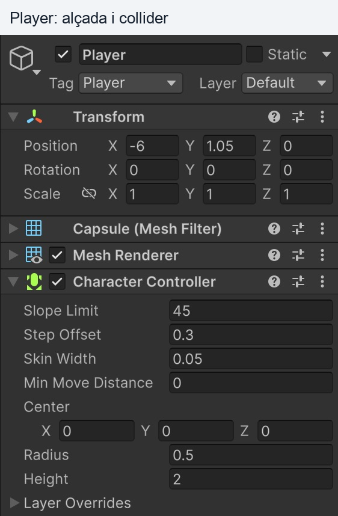
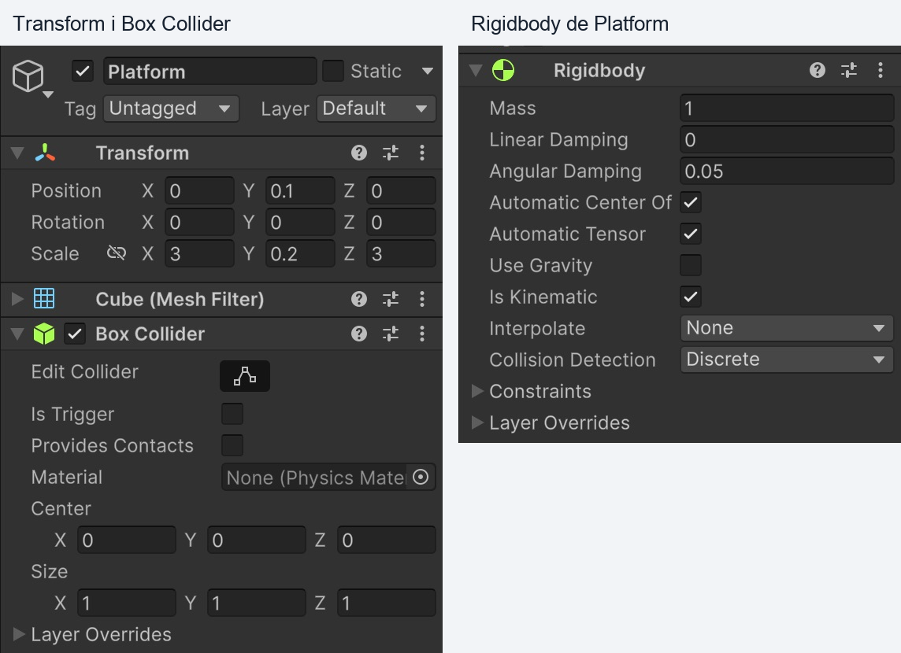
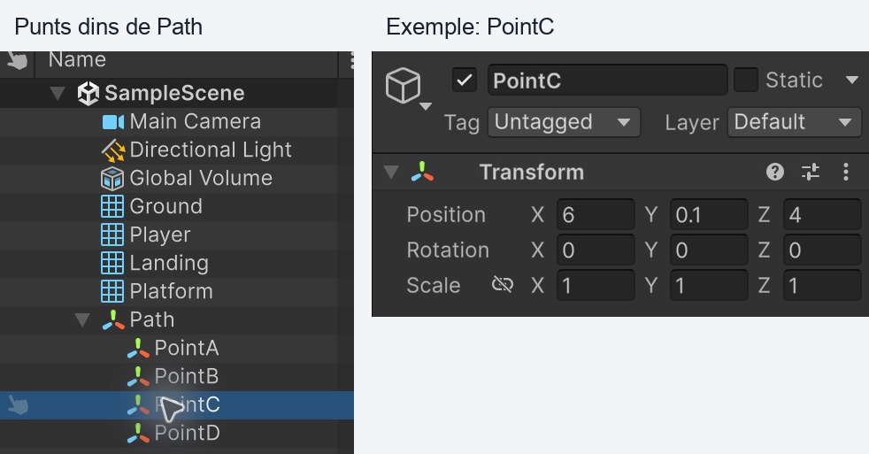
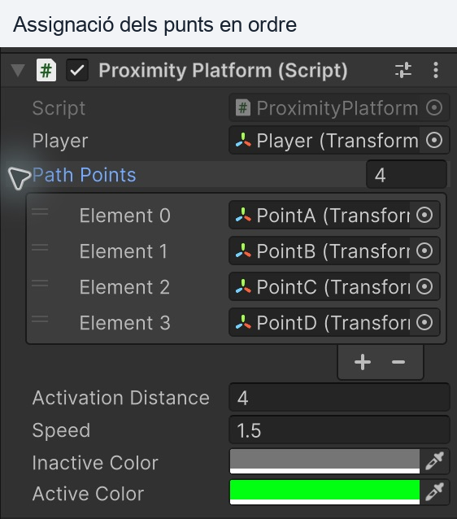
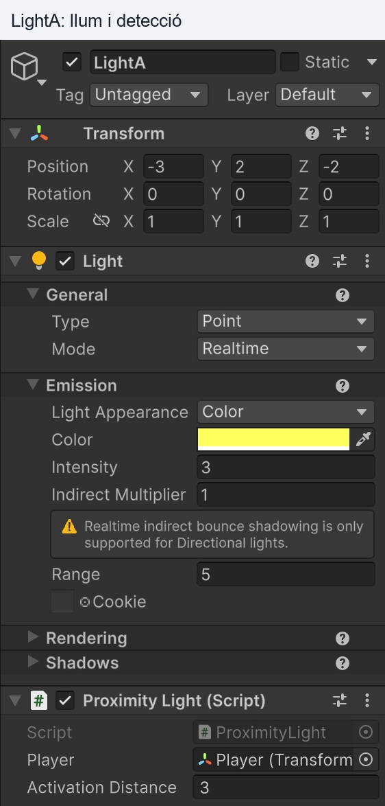
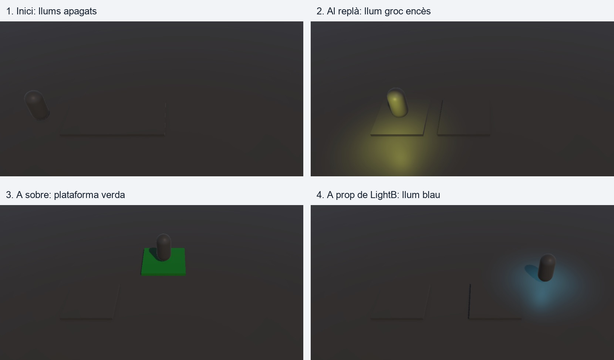

# Demo Plataforma i llums

En aquesta demo:

- El jugador es mou amb les fletxes.
- Una plataforma segueix un recorregut de quatre punts quan el jugador és a prop.
- Quan el jugador s'allunya, la plataforma s'atura on és.
- La plataforma es torna verda quan detecta el jugador dins del radi d'activació i grisa quan és fora.
- El jugador pot pujar a la plataforma i moure's amb ella.
- Uns llums s'encenen quan el jugador s'acosta i s'apaguen quan s'allunya.

# Crear el projecte

A **Unity Hub**:

- Crea un projecte nou amb **Unity 6**.
- Selecciona la plantilla **3D (Built-In Render Pipeline)**.
- Anomena'l `DemoProximitat`.

Si ja tens un projecte **Universal 3D (URP)**, també pots fer aquesta demo sense canviar de render pipeline. Utilitza materials **Universal Render Pipeline/Lit** i comprova que l'asset URP actiu a **Project Settings > Quality** (o el de **Graphics** si no hi ha cap substitució) tingui **Additional Lights** activats. Els noms i la distribució dels camps de l'Inspector poden variar segons la versió.

A **Window > Package Manager**:

- Selecciona **Unity Registry**.
- Busca **Input System** i instal·la'l.
- Accepta l'activació del nou sistema d'entrada i reinicia l'editor si ho demana.

A **Edit > Project Settings > Player > Other Settings**, deixa **Active Input Handling** a **Input System Package (New)** o **Both**.

Desa l'escena amb nom `DemoProximitat`. Si treballes en un projecte existent, pots reutilitzar **SampleScene**: el nom de l'escena no afecta els scripts.

Si l'escena és completament buida, crea una **Camera** anomenada `Main Camera` amb el tag **MainCamera** i un **Directional Light** abans de continuar. Si reutilitzes una escena, elimina els components antics que apareguin com a **Missing (Mono Script)** i comprova que no hi hagi errors de compilació a Console.

# Crear l'escena

Mou la **Main Camera** a:

```text
Position: 2, 12, -12
Rotation: 45, 0, 0
Projection: Perspective
Field of View: 60
```

Afegeix un **3D Object > Plane**:

```text
Name: Ground
Position: 0, 0, 0
Scale: 3, 1, 3
```

Mantén el component **Mesh Collider**. En aquests objectes, deixa **Rotation = (0, 0, 0)** tret que indiquem el contrari.

## Jugador

Afegeix un **3D Object > Capsule**:

```text
Name: Player
Position: -6, 1.05, 0
Scale: 1, 1, 1
Tag: Player
```

- Elimina el **Capsule Collider** original.
- Afegeix un **Character Controller**.
- No hi afegeixis cap Rigidbody.

Configura el **Character Controller**:

```text
Center: 0, 0, 0
Height: 2
Radius: 0.5
Step Offset: 0.3
Skin Width: 0.05
Min Move Distance: 0
```

**Comprovació important:** escriu `0.05` (cinc centèsimes) a **Skin Width** (afinar col·lisions)



*Compara especialment Skin Width, Center i Height. En aquest pas encara no hem afegit PlayerMovement.*

## Replà

Afegeix un **3D Object > Cube**:

```text
Name: Landing
Position: -3, 0.1, 0
Scale: 3, 0.2, 3
```

Mantén el **Box Collider** amb **Is Trigger** desactivat.

El replà té una altura de `0.2`, inferior al **Step Offset** del jugador: s'hi pot pujar caminant.

## Plataforma

Afegeix un **3D Object > Cube**:

- Deixa **Static** desactivat (A dalt a la dreta de l'inspector, al costat del nom de l’objecte)

```text
Name: Platform
Position: 0, 0.1, 0
Scale: 3, 0.2, 3
```

- Mantén el **Box Collider** amb **Is Trigger** desactivat.
- Afegeix un **Rigidbody**. (objecte detecció de triggers)
- Desactiva **Use Gravity** (desactiva la gravetat)
- Activa **Is Kinematic** (evita que la física mogui l'objecte)



*La mida de la plataforma es defineix a Transform > Scale. Box Collider > Size continua a (1, 1, 1); no hi tornis a posar (3, 0.2, 3). Is Trigger està desactivat, Is Kinematic activat i Use Gravity desactivat.*

El replà i la plataforma tenen la superfície a la mateixa altura.

L'Script canviarà el color de la plataforma per mostrar la detecció:

- **Gris:** el jugador és fora del radi; la plataforma està aturada.
- **Verd:** el jugador és dins del radi; la plataforma està activada.

El canvi afecta només **Platform**. Ground, Landing i Player conservaran el seu color encara que comparteixin material. El replà Landing és fix i no necessita aquest script.

## Definir el recorregut per trams

El recorregut serà **PointA → PointB → PointC → PointD**. En arribar a PointD, la plataforma torna pels mateixos trams: **PointD → PointC → PointB → PointA**, i repeteix.

1. A la **Hierarchy**, crea un objecte buit amb **Create Empty** i anomena'l **Path**.
2. Deixa el seu Transform a **Position = (0, 0, 0)**, **Rotation = (0, 0, 0)** i **Scale = (1, 1, 1)**.
3. Dins de Path, crea quatre objectes buits. Pots crear el primer i duplicar-lo tres vegades.
4. Assigna aquests noms i posicions. Com que Path és a l'origen i no està girat ni escalat, les posicions locals coincideixen amb les globals:

| Punt | Position X | Position Y | Position Z |
|---|---:|---:|---:|
| PointA | 0 | 0.1 | 0 |
| PointB | 6 | 0.1 | 0 |
| PointC | 6 | 0.1 | 4 |
| PointD | 0 | 0.1 | 4 |

Tots els punts tenen **Y = 0.1**: aquesta demo fa un recorregut horitzontal, amb girs però sense ascensors. Els punts indiquen on passarà **el centre** de la plataforma. Deixa prou espai lliure per a tota l'amplada de la plataforma.

```text
Vista des de dalt (X, Z)

D (0, 4) ← C (6, 4)
             ↑
A (0, 0) → B (6, 0)

Anada:   A → B → C → D
Tornada: D → C → B → A
```

**Path ha de quedar a l'arrel de la jerarquia, fora de Platform.** Els punts són fills de Path, no de la plataforma: així no es desplacen amb ella. Path només serveix per ordenar els punts; no necessita cap component especial, collider ni script.

```text
DemoProximitat
├─ Main Camera
├─ Directional Light
├─ Ground
├─ Player
├─ Landing
├─ Platform
└─ Path
   ├─ PointA
   ├─ PointB
   ├─ PointC
   └─ PointD
```



*Path és al mateix nivell que Platform. PointC és fill de Path i té la posició (6, 0.1, 4). Repeteix la comprovació amb les coordenades de cada punt de la taula.*

No cal cap clip d'Animation ni Animator. El script mourà la plataforma tram a tram amb `Vector3.MoveTowards()`. Evita una animació addicional sobre el seu Transform, perquè competiria amb aquest moviment.

**Activar o pausar el recorregut:** dins del radi, la plataforma avança i es torna verda; fora, es queda on és i es torna grisa. Conserva el punt de destí per reprendre el mateix tram quan el jugador torna. Mantén l'objecte i el script actius perquè continuïn detectant-lo.

# Crear els scripts

Crea una carpeta **Assets/Scripts**.

Crea i completa aquests tres scripts abans d'afegir-los als objectes:

```text
PlayerMovement.cs
ProximityPlatform.cs
ProximityLight.cs
```

## Moviment del jugador

**PlayerMovement.cs**:

```csharp
using UnityEngine;
using UnityEngine.InputSystem;

[RequireComponent(typeof(CharacterController))]
public class PlayerMovement : MonoBehaviour
{
    public float speed = 4f;
    public float gravity = -20f;

    private CharacterController controller;
    private ProximityPlatform platform;
    private float verticalSpeed;

    void Awake()
    {
        controller = GetComponent<CharacterController>();
    }

    void Update()
    {
        Vector3 movement = Vector3.zero;
        Keyboard keyboard = Keyboard.current;

        if (keyboard != null)
        {
            if (keyboard.upArrowKey.isPressed)
                movement += Vector3.forward;

            if (keyboard.downArrowKey.isPressed)
                movement += Vector3.back;

            if (keyboard.leftArrowKey.isPressed)
                movement += Vector3.left;

            if (keyboard.rightArrowKey.isPressed)
                movement += Vector3.right;
        }

        // El player cau cap a terra
        if (controller.isGrounded && verticalSpeed < 0f)
            verticalSpeed = -2f;

        verticalSpeed += gravity * Time.deltaTime;

        Vector3 displacement = movement.normalized * speed * Time.deltaTime;
        displacement.y = verticalSpeed * Time.deltaTime;

        // Si el player està sobre la plataforma, es mou amb ella
        if (platform != null)
            displacement += platform.FrameMovement;

        // El proper frame es detecterà la plataforma automàticament
        platform = null;

        // Moure el personatge
        controller.Move(displacement);
    }

    void OnControllerColliderHit(ControllerColliderHit hit)
    {
        // Detectar que estem sobre la plataforma (el personatge està més alt)
        if (hit.normal.y > 0.5f)
        {
            ProximityPlatform support = hit.collider.GetComponent<ProximityPlatform>();

            if (support != null)
                platform = support;
        }
    }
}
```

**Cal tenir en compte:**

- `CharacterController.Move()` no aplica gravetat automàticament; la calculem amb `verticalSpeed`.
- `OnControllerColliderHit()` detecta els contactes sòlids durant el moviment.
- `hit.normal.y > 0.5f` permet identificar una superfície de suport, en lloc d'un contacte lateral.
- El desplaçament de la plataforma se suma al moviment del jugador.

## Plataforma de proximitat

**ProximityPlatform.cs**:

```csharp
using UnityEngine;

[DefaultExecutionOrder(-100)]
public class ProximityPlatform : MonoBehaviour
{
    public Transform player;
    public Transform[] pathPoints;

    public float activationDistance = 4f;
    public float speed = 1.5f;
    public Color inactiveColor = Color.gray;
    public Color activeColor = Color.green;

    public Vector3 FrameMovement { get; private set; }

    private int targetIndex = 1;
    private int direction = 1;
    private Renderer platformRenderer;
    private MaterialPropertyBlock colorProperties;
    private bool isActive;

    void Start()
    {
        platformRenderer = GetComponent<Renderer>();
        colorProperties = new MaterialPropertyBlock();
        SetActivationColor(false);

        if (player == null || pathPoints == null || pathPoints.Length < 2)
        {
            Debug.LogError("Assigna Player i almenys dos Path Points a Platform.", this);
            enabled = false;
            return;
        }

        foreach (Transform point in pathPoints)
        {
            if (point == null)
            {
                Debug.LogError("Hi ha un Path Point sense assignar a Platform.", this);
                enabled = false;
                return;
            }
        }

        transform.position = pathPoints[0].position;

        // Actualitza la posició física del collider
        Physics.SyncTransforms(); 
    }

    void Update()
    {
        FrameMovement = Vector3.zero;

        float distance = Vector3.Distance(player.position, transform.position);
        bool playerIsNear = distance <= activationDistance;

        // Si el player està aprop canviem el color de la plataforma
        if (playerIsNear != isActive)
            SetActivationColor(playerIsNear);

        if (!playerIsNear)
            return;

        Vector3 previousPosition = transform.position;
        Vector3 targetPosition = pathPoints[targetIndex].position;

        // Moure la plataforma cap al següent punt del recorregut
        transform.position = Vector3.MoveTowards(
            transform.position,
            targetPosition,
            speed * Time.deltaTime
        );

        // Guarda el moviment aplicat a la plataforma dins de 'FrameMovement'
        // per moure el player si està a sobre de la plataforma
        FrameMovement = transform.position - previousPosition;

        // Actualitza la física amb els canvis que s'han realitzat
        Physics.SyncTransforms();

        // Hem arribat a un punt del recorregut
        if (transform.position == targetPosition)
        {
            // Invertir la direcció del recorregut
            if (targetIndex == pathPoints.Length - 1)
                direction = -1;
            else if (targetIndex == 0)
                direction = 1;

            // Escollir el següent punt del recorregut
            targetIndex += direction;
        }
    }

    void SetActivationColor(bool active)
    {
        isActive = active;

        if (platformRenderer == null)
            return;

        // Canvia el color de la plataforma
        platformRenderer.GetPropertyBlock(colorProperties);
        Color color = active ? activeColor : inactiveColor;
        colorProperties.SetColor("_BaseColor", color); // URP/Lit
        colorProperties.SetColor("_Color", color);     // Built-In/Standard
        platformRenderer.SetPropertyBlock(colorProperties);
    }
}

```

**Cal tenir en compte:**

- `Vector3.Distance()` calcula la distància 3D entre el jugador i el centre de la plataforma.
- La mateixa condició `distance <= activationDistance` controla el moviment i el color: verd dins del radi (inclòs el límit), gris fora.
- `MaterialPropertyBlock` canvia el color només d'aquest Renderer sense modificar el material compartit. `_BaseColor` correspon a URP/Lit i `_Color` a Built-In/Standard.
- El color indica la detecció de proximitat; no indica si el jugador és damunt de la plataforma.
- `Vector3.MoveTowards()` mou la plataforma cap al punt de destí.
- `pathPoints` conté els punts en ordre. `targetIndex` indica el destí del tram actual.
- En arribar a l'últim punt, `direction` passa a `-1` per tornar; en arribar al primer, passa a `1` per repetir l'anada.
- Si falta Player, hi ha menys de dos punts o algun element està buit, el script mostra un error clar i s'atura.
- Quan el jugador és lluny, s'atura sense perdre el destí actual.
- `FrameMovement` guarda el desplaçament d'aquest frame; el jugador el pot llegir.
- `[DefaultExecutionOrder(-100)]` fa que aquest script s'actualitzi abans que `PlayerMovement`.
- `Physics.SyncTransforms()` actualitza la posició física del collider després de moure el Transform.

Aquesta plataforma es desplaça horitzontalment, sense girar ni canviar d'escala. El moviment es programa directament amb codi.

## Llum de proximitat

**ProximityLight.cs**:

```csharp
using UnityEngine;

[RequireComponent(typeof(Light))]
public class ProximityLight : MonoBehaviour
{
    public Transform player;
    public float activationDistance = 3f;

    private Light pointLight;

    void Awake()
    {
        pointLight = GetComponent<Light>();
        pointLight.enabled = false;
    }

    void LateUpdate()
    {
        float distance = Vector3.Distance(player.position, transform.position);

        // Activa la llum si el player està aprop
        pointLight.enabled = distance <= activationDistance;
    }
}
```

Es canvia `enabled` del component **Light**. L'objecte continua actiu perquè l'script pugui tornar a encendre el llum.

# Assignar els scripts

Al **Player**:

- Afegeix **PlayerMovement.cs**.
- Deixa **Speed = 4** i **Gravity = -20**.

A **Platform**:

- Afegeix **ProximityPlatform.cs** al mateix objecte que el **Box Collider**.
- Arrossega `Player` al camp **Player**.
- Desplega **Path Points** i posa **Size = 4** (en algunes versions el nombre d'elements apareix al costat del nom de la llista).
- Arrossega els objectes de la **Hierarchy** als elements de la llista, en aquest ordre:

| Camp del script | Objecte que hi has d'arrossegar |
|---|---|
| Element 0 | Path / PointA |
| Element 1 | Path / PointB |
| Element 2 | Path / PointC |
| Element 3 | Path / PointD |

L'ordre de la llista defineix el recorregut; els noms dels objectes no l'ordenen automàticament. No arrosseguis Path a la llista: arrossega cadascun dels seus punts. Cap element ha de quedar a **None**.

Si vens de la versió anterior del script, els camps **Point A** i **Point B** desapareixen: cal omplir la nova llista **Path Points** abans de fer Play.

- Deixa **Activation Distance = 4** i **Speed = 1.5**.
- Deixa **Inactive Color = gris** (`#808080`) i **Active Color = verd** (`#00FF00`), amb **Alpha = 1**. Aquests camps apareixen després de desar i compilar el script.
- El color gris inicial s'aplica en començar Play; fora de Play pots continuar veient el color original del material.



*Selecciona Platform a la Hierarchy, no el fitxer ProximityPlatform.cs a Project. Assigna Player i els quatre punts al component de l'objecte. El 4 al costat de Path Points és el nombre d'elements.*

El jugador es manté a l'arrel de la jerarquia; no l'arrosseguis dins de la plataforma.

# Crear els llums

Per veure clarament quan s'encenen:

- Selecciona **Directional Light** i deixa **Light > Emission > Intensity = 0.2**.
- A **Window > Rendering > Lighting > Environment > Environment Lighting > Source**, selecciona **Color**
- Deixa **Ambient Color** en un gris fosc, per exemple `RGB(32,32,32)`.

Afegeix **GameObject > Light > Point Light**:

```text
Name: LightA
Position: -3, 2, -2
```

Al component **Light** de `LightA`:

```text
General > Mode: Realtime
Emission > Color: groc clar
Emission > Intensity: 3
Emission > Range: 5
```

- Afegeix **ProximityLight.cs** al mateix objecte `LightA`.
- Arrossega `Player` al camp **Player** de l'script. **IMPORTANT!**
- Deixa **Activation Distance = 3**.
- Mantén l'objecte actiu.



*Hi ha dos valors diferents: Range = 5 al component Light i Activation Distance = 3 a Proximity Light. El camp Player ha d'estar assignat. En aquesta versió URP pot aparèixer un avís sobre la llum indirecta dels Point Lights; no impedeix la il·luminació directa que utilitza aquesta demo.*

Duplica `LightA` i configura la còpia:

```text
Name: LightB
Position: 6, 2, 2
Color: blau clar
```

La còpia conserva l'script i la referència al jugador.

**Range** és l'abast de la llum sobre les superfícies. **Activation Distance** és la distància a la qual el jugador l'encén: augmentar Range no canvia el llindar d'activació.

`Vector3.Distance()` mesura la distància **3D entre els pivots**, inclosa l'altura Y. Si el Player flota massa amunt, pot quedar fora del radi encara que sembli estar sota el llum. Amb les posicions d'aquesta guia, a l'inici la distància a LightA és aproximadament **3.73**, superior a `3`: és correcte que els dos llums comencin apagats. Des del replà, a `(-3, 1.25, 0)`, la distància a LightA és aproximadament **2.14** i s'ha d'encendre.

Si un llum no s'encén, selecciona'l durant **Play** i comprova:

- L'objecte i el component **Proximity Light** estan actius.
- El camp **Player** mostra `Player (Transform)`, no `None` ni `Missing`. El **Tag** no assigna aquesta referència automàticament. Revisa-la a **LightA i LightB**.
- El component **Light** canvia la seva casella d'activació quan la distància passa per `3`. No desactivis l'objecte sencer per apagar-lo.
- Si la casella s'activa però el terra no s'il·lumina, comprova **Point**, **Realtime**, **Intensity = 3**, **Range = 5**, un material **Lit/Standard** compatible amb el render pipeline i les capes de la llum i del terra. En URP, comprova també **Additional Lights**.
- A **Console**, resol els errors vermells abans de continuar. `UnassignedReferenceException: ... player ... ProximityLight` indica que falta arrossegar el jugador al camp de l'script. L'script apaga el Light a `Awake`; si després falla per falta de referència, queda apagat.

Els Point Lights il·luminen les superfícies; no necessiten una esfera visible ni cap collider.

# Provar la demo

Abans de provar, surt de **Play**, revisa les referències i desa l'escena. Fes les correccions permanents fora de Play, perquè els canvis de la prova normalment es descarten en aturar-la.

Fes **Play**, selecciona la pestanya **Game** i utilitza les fletxes. Comprova que **Pause** no estigui activat. No esperis que el llum canviï de posició ni que aparegui una bombeta: mira el color de les superfícies.



*Resultats esperats en quatre moments diferents de la prova. La il·luminació ambiental és baixa expressament per distingir els Point Lights. El verd indica que la plataforma detecta el jugador; no és el color d'un llum.*

## Alçada del jugador

- Sobre Ground: el centre del Player queda aproximadament a `Y = 1.05`.
- Sobre Landing o Platform: queda aproximadament a `Y = 1.25`.
- Si queda molt més amunt, revisa primer **Skin Width = 0.05**, **Center = (0, 0, 0)**, **Height = 2**, **Scale = (1, 1, 1)** i els colliders del suport.
- Per provar la caiguda, mou temporalment el Player a `Y = 8` durant Play, en una zona del terra sense plataforma, i comprova que torna a l'altura de repòs. Atura Play per recuperar la posició inicial.

## Llums

- Acosta't a `LightA`: el terra s'il·lumina de groc.
- Allunya't: el llum s'apaga.
- Acosta't a `LightB`: el terra s'il·lumina de blau.

## Plataforma

- Acosta't a la plataforma: es torna **verda** i comença a seguir `PointA → PointB → PointC → PointD`.
- Allunya't més de `4` unitats del seu centre: es torna **grisa** i s'atura.
- Torna a acostar-t'hi: torna a **verd** i reprèn el moviment des d'on era.
- Comprova que el terra, el replà i el jugador no canvien de color. Amb poca llum ambiental el gris i el verd es veuran més foscos, perquè són materials il·luminats.
- Queda't sobre la plataforma per comprovar tot el recorregut. En arribar a D ha de tornar per C i B fins a A; no ha de saltar directament de D a A.

**Per canviar el recorregut:** atura Play i mou els punts a la vista Scene, mantenint `Y = 0.1`. Per afegir un tram, crea un altre punt dins de Path, augmenta Size i assigna'l al lloc corresponent de la llista. Necessites almenys dos punts i convé que els punts consecutius tinguin posicions diferents. La plataforma es col·loca al primer punt quan comença Play.

## Transport del jugador

- Camina pel replà i puja a la plataforma. També pots pujar-hi des del terra: l'altura és de `0.2`.
- Situa't al centre de la plataforma i deixa anar les tecles: el jugador es desplaça amb ella.
- Mou-te amb les fletxes mentre ets a sobre.
- Baixa caminant per un lateral: tornes al terra i deixes de seguir la plataforma.

```text
Jugador a prop
        ↓
La plataforma es mou i els llums propers s'encenen
        ↓
El jugador puja a la plataforma
        ↓
Es mou amb ella
        ↓
Baixa i s'allunya
        ↓
La plataforma s'atura i els llums llunyans s'apaguen
```

## Referència tècnica

- [Unity: Character Controller — Skin Width, Center i dimensions](https://docs.unity.com/en-us/engine/6000.0/manual/physics-section/physics-overview/character-control-section/class-character-controller).
