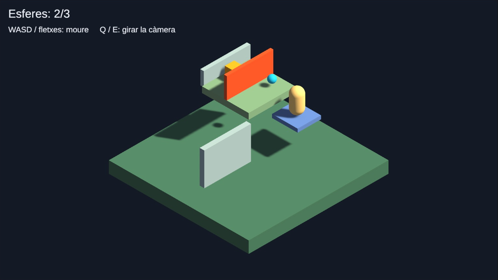
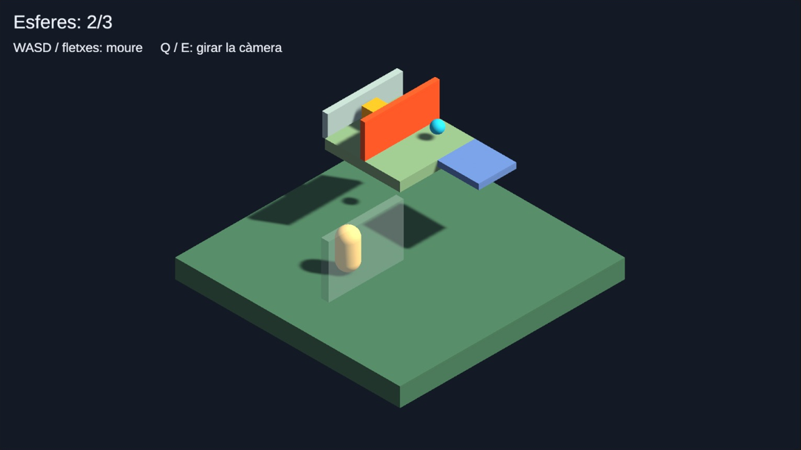

# Demo Nivells: un petit diorama

Construirem un petit nivell amb formes bàsiques, inspirat en els diorames de *Captain Toad: Treasure Tracker*. La càpsula es mou sense saltar, recull tres esferes i arriba a un tresor darrere d’una porta.

La càmera gira en passos de 90°. Quan una paret tapa el jugador, es torna semitransparent; el collider continua actiu. Un elevador permet accedir al pis superior.

**Aquesta demo comença en una escena buida.** No necessita objectes ni scripts de les altres demos.

## 1. Preparar el projecte

Utilitza un projecte **Universal 3D (URP)** de **Unity 6.6**. Els materials fan servir **Universal Render Pipeline/Lit** i la propietat de color `_BaseColor`.

1. Crea una escena nova amb **File > New Scene > Basic** i desa-la com a **DemoNivells**. Si parteixes d’una escena buida, crea una **Camera** i una **Directional Light** des de **GameObject**. Anomena la càmera **Main Camera** i assigna-li el tag **MainCamera**.
2. A **Window > Package Manager > Unity Registry**, comprova que **Input System** està instal·lat.
3. A **Edit > Project Settings > Player > Other Settings**, configura **Active Input Handling** com **Input System Package (New)** o **Both**. Reinicia Unity si ho demana.
4. A *Assets*, crea la carpeta **DemoNivells** i, dins, **Scripts** i **Materials**.
5. Importa **TMP Essential Resources** des de **Window > TextMeshPro > Import TMP Essential Resources**, si encara no existeix la carpeta *TextMesh Pro*. També pots importar-los quan Unity ho demani en crear el primer text.

Crea els set scripts dels apartats següents dins de *DemoNivells/Scripts*, amb el mateix nom que la seva classe. **Completa tots els scripts i totes les referències abans de fer Play**: alguns scripts depenen dels que s’expliquen més endavant. No afegeixis scripts de moviment d’altres demos al mateix jugador.

## 2. Materials i construcció del diorama

Crea cada material amb **Create > Material**, selecciona el shader **Universal Render Pipeline/Lit** i assigna el color a **Base Map**. Deixa **Metallic = 0** i **Smoothness = 0.15**. Els colors són orientatius; les mides i posicions sí que s’han de respectar.

| Material | Color | Surface Type |
|---|---|---|
| NivellsBase | Verd fosc | Opaque |
| NivellsWall | Blau grisenc clar | Transparent |
| NivellsUpper | Verd clar | Transparent |
| NivellsPlayer | Crema | Opaque |
| NivellsSphere | Blau cel | Opaque |
| NivellsGold | Groc | Opaque |
| NivellsDoor | Taronja | Opaque |
| NivellsLift | Blau violaci | Opaque |

Per a **NivellsWall** i **NivellsUpper**, configura també:

- **Blending Mode = Alpha**.
- **Preserve Specular Lighting** desactivat.
- **Render Face = Front** i **Alpha Clipping** desactivat.
- Alfa del color de **Base Map = 1** (o **255**, si el selector mostra el rang 0–255).

Així, inicialment es veuen completament opacs, però el codi podrà reduir-ne l’alfa. Canviar l’alfa d’un material de tipus **Opaque** no el faria transparent. És el comportament del [material Lit d’URP](https://docs.unity.com/en-us/engine/6000.7/manual/materials-and-shaders/built-in/shaders-in-universalrp/reference/lit-shader).

Afegeix els objectes següents amb **GameObject > 3D Object > Cube**. Tots són objectes independents a l’arrel de la jerarquia, amb **Rotation = (0, 0, 0)**. Arrossega el material corresponent sobre cada objecte. Conserva el **Box Collider** i deixa **Is Trigger** desactivat.

| Nom | Position (X, Y, Z) | Scale (X, Y, Z) | Material |
|---|---|---|---|
| Base | `(0, -0.5, 0)` | `(12, 1, 12)` | NivellsBase |
| UpperFloor | `(2, 3.25, 2)` | `(4, 0.5, 4)` | NivellsUpper |
| HiddenWall | `(-2, 1.4, 0)` | `(4, 2.8, 0.4)` | NivellsWall |
| UpperBackWall | `(2, 4.1, 4)` | `(4, 1.2, 0.3)` | NivellsWall |
| Lift | `(3, 0.15, -1.1)` | `(2, 0.3, 2.2)` | NivellsLift |
| Door | `(2, 4.4, 2)` | `(4, 1.8, 0.25)` | NivellsDoor |

La cara superior de **Base** queda a `Y = 0` i la d’**UpperFloor** a `Y = 3.5`. Hi ha espai per passar per sota del pis superior. **Lift** toca la vora frontal del pis superior quan arriba a dalt.

Deixa la **Directional Light** amb rotació `(50, -30, 0)`, intensitat `2` i ombres activades.

## 3. Crear la càpsula

Crea **GameObject > 3D Object > Capsule**, anomena-la **Player** i configura:

| Propietat | Valor |
|---|---|
| Tag | Player |
| Position | `(-4, 1.05, -4)` |
| Rotation | `(0, 0, 0)` |
| Scale | `(1, 1, 1)` |
| Material | NivellsPlayer |

Elimina el **Capsule Collider** que porta per defecte i afegeix un **Character Controller**. El Player no necessita **Rigidbody**.

| Character Controller | Valor |
|---|---|
| Center | `(0, 0, 0)` |
| Height | `2` |
| Radius | `0.5` |
| Step Offset | `0.35` |
| Skin Width | `0.05` |
| Min Move Distance | `0` |

La càpsula fa dues unitats d’alçada: el seu centre queda aproximadament una unitat per sobre del terra. El **Step Offset** permet pujar el petit desnivell de `0.3` de l’elevador quan és a baix.

Crea **DioramaPlayer.cs**:

```csharp
using UnityEngine;
using UnityEngine.InputSystem;

// Unity afegeix un Character Controller si l'objecte encara no en té.
[RequireComponent(typeof(CharacterController))]
public class DioramaPlayer : MonoBehaviour
{
    public Transform viewCamera;
    public float speed = 3f;
    public float gravity = -20f;
    private CharacterController controller;
    private DioramaLift support;
    private Vector3 startPosition;
    private float verticalSpeed;

    void Awake()
    {
        // Obtén el controlador del mateix objecte per moure'l respectant els colliders.
        controller = GetComponent<CharacterController>();
        // Desa la posició inicial per poder-hi tornar si el jugador cau o reinicia.
        startPosition = transform.position;
    }

    void Update()
    {
        // Aplica el desplaçament de l'ascensor amb què el jugador estava en contacte.
        if (support != null) controller.Move(support.Delta);
        // Esborra el suport anterior; els nous contactes del controlador el tornaran a detectar.
        support = null;

        Vector2 input = Vector2.zero;
        var keys = Keyboard.current;
        if (keys != null)
        {
            if (keys.wKey.isPressed || keys.upArrowKey.isPressed) input.y += 1;
            if (keys.sKey.isPressed || keys.downArrowKey.isPressed) input.y -= 1;
            if (keys.dKey.isPressed || keys.rightArrowKey.isPressed) input.x += 1;
            if (keys.aKey.isPressed || keys.leftArrowKey.isPressed) input.x -= 1;
        }
        // Limita la intensitat del moviment per evitar anar més ràpid en diagonal.
        input = Vector2.ClampMagnitude(input, 1f);
        // Projecta la direcció de la càmera sobre el terra perquè mirar cap avall no faci baixar el
        // jugador.
        Vector3 forward = Vector3.ProjectOnPlane(viewCamera.forward, Vector3.up).normalized;
        Vector3 right = Vector3.ProjectOnPlane(viewCamera.right, Vector3.up).normalized;
        // Converteix les tecles en moviment relatiu a la vista de la càmera.
        Vector3 direction = forward * input.y + right * input.x;

        if (controller.isGrounded && verticalSpeed < 0f) verticalSpeed = -2f;
        // Acumula la caiguda: CharacterController.Move no aplica gravetat automàticament.
        verticalSpeed += gravity * Time.deltaTime;
        controller.Move((direction * speed + Vector3.up * verticalSpeed) * Time.deltaTime);
        if (direction.sqrMagnitude > 0.01f) transform.rotation = Quaternion.LookRotation(direction);

        // Si cau fora del nivell, torna a l'inici i conserva les esferes recollides.
        if (transform.position.y < -8f)
        {
            // Desactiva temporalment el controlador per recol·locar el personatge directament.
            controller.enabled = false;
            transform.position = startPosition;
            controller.enabled = true;
            verticalSpeed = 0f;
            // Esborra el suport anterior; els nous contactes del controlador el tornaran a detectar.
            support = null;
        }
    }

    // Unity crida aquest mètode quan controller.Move troba un collider sòlid.
    void OnControllerColliderHit(ControllerColliderHit hit)
    {
        // Una normal que apunta prou cap amunt indica un suport sota els peus, no una paret lateral.
        if (hit.normal.y > 0.5f)
            support = hit.collider.GetComponent<DioramaLift>();
    }
}
```

Afegeix **DioramaPlayer** a **Player** i arrossega **Main Camera** al camp **View Camera**. Deixa **Speed = 3** i **Gravity = -20**.

El moviment s’obté a partir dels eixos de la càmera, projectats sobre el terra: després de girar la vista, les tecles continuen sent intuïtives. Normalitzem l’entrada per no anar més ràpid en diagonal. La gravetat es calcula explícitament perquè [`CharacterController.Move`](https://docs.unity3d.com/ScriptReference/CharacterController.Move.html) no l’aplica automàticament.

El jugador guarda l’elevador sobre el qual està recolzat i n’aplica el desplaçament al fotograma següent. Això permet pujar i baixar amb la plataforma. Si cau fora del diorama, reapareix a l’inici i conserva les esferes recollides.

## 4. Càmera en perspectiva giratòria

Crea un objecte buit amb **GameObject > Create Empty**, anomena’l **CameraPivot** i posa’l a `(0, 1.5, 0)`, amb rotació zero i escala un. No el facis fill del jugador: representa el centre del diorama.

Configura **Main Camera**:

| Propietat | Valor |
|---|---|
| Position | `(-13.902, 15.266, -13.902)` |
| Rotation | `(35, 45, 0)` |
| Projection | Perspective |
| Field of View | `45` |
| Clipping Planes | Near `0.3`, Far `100` |
| Environment > Background Type | Solid Color |
| Background | Blau molt fosc |

A la vista **Game**, escull **Full HD (1920×1080)** o una relació **16:9**. La perspectiva fa que els objectes propers es vegin més grans que els llunyans. El Field of View de 45° i la distància de 24 unitats mantenen una vista del diorama complet mentre girem.

Crea **DioramaCamera.cs**:

```csharp
using UnityEngine;
using UnityEngine.InputSystem;

// Actualitza aquest script després dels scripts amb ordre per defecte (0).
[DefaultExecutionOrder(100)]
public class DioramaCamera : MonoBehaviour
{
    public Transform pivot;
    public float distance = 24f;
    public float pitch = 35f;
    public float turnSpeed = 180f;
    private float yaw = 45f;
    private float targetYaw = 45f;

    void LateUpdate()
    {
        var keys = Keyboard.current;
        if (keys != null)
        {
            if (keys.qKey.wasPressedThisFrame) targetYaw -= 90f;
            if (keys.eKey.wasPressedThisFrame) targetYaw += 90f;
        }
        // Gira suaument fins a l'angle escollit amb Q o E, tenint en compte la volta de 360 graus.
        yaw = Mathf.MoveTowardsAngle(yaw, targetYaw, turnSpeed * Time.deltaTime);
        transform.rotation = Quaternion.Euler(pitch, yaw, 0f);
        // Col·loca la càmera darrere de la seva direcció de mirada, a la distància del centre indicada.
        transform.position = pivot.position - transform.forward * distance;
    }
}
```

Afegeix-lo a **Main Camera** i assigna **CameraPivot** al camp **Pivot**. Deixa **Distance = 24**, **Pitch = 35** i **Turn Speed = 180**.

**Q** gira 90° en un sentit i **E** en l’altre. `MoveTowardsAngle` fa la transició gradual. La posició inicial de la càmera coincideix amb la que calcula l’script.

## 5. Elevador entre dues alçades

Crea dos objectes buits, **LiftBottom** i **LiftTop**, a l’arrel de la jerarquia:

| Objecte | Position |
|---|---|
| LiftBottom | `(3, 0.15, -1.1)` |
| LiftTop | `(3, 3.35, -1.1)` |

**No els facis fills de Lift**: són punts fixos del recorregut. Les coordenades indiquen el **centre** de la plataforma. A dalt, el centre `3.35` més la meitat del gruix `0.15` deixa la superfície exactament a `Y = 3.5`.

Crea **DioramaLift.cs**:

```csharp
using UnityEngine;

// Mou primer l'ascensor perquè el jugador pugui llegir-ne el desplaçament d'aquest frame.
[DefaultExecutionOrder(-100)]
public class DioramaLift : MonoBehaviour
{
    public Transform bottom;
    public Transform top;
    public float speed = 1.2f;
    public float waitTime = 2f;
    // DioramaPlayer pot llegir aquest desplaçament per viatjar amb l'ascensor; només aquest script el
    // modifica.
    public Vector3 Delta { get; private set; }
    private bool goingUp = true;
    private float remainingWait;

    void Start()
    {
        transform.position = bottom.position;
        remainingWait = waitTime;
    }

    void Update()
    {
        Vector3 previous = transform.position;
        // Descompta l'espera de cada parada abans de reprendre el recorregut.
        if (remainingWait > 0f) remainingWait -= Time.deltaTime;
        else
        {
            // Tria el punt superior o inferior segons el sentit actual del trajecte.
            Vector3 target = goingUp ? top.position : bottom.position;
            transform.position = Vector3.MoveTowards(previous, target, speed * Time.deltaTime);
            if (Vector3.Distance(transform.position, target) < 0.001f)
            {
                // En arribar, inverteix el sentit i prepara una nova espera.
                goingUp = !goingUp;
                remainingWait = waitTime;
            }
        }
        // Desa quant s'ha mogut aquest frame; durant l'espera el desplaçament és zero.
        Delta = transform.position - previous;
    }
}
```

Afegeix-lo al cub **Lift** i assigna:

| Camp | Valor |
|---|---|
| Bottom | LiftBottom |
| Top | LiftTop |
| Speed | `1.2` |
| Wait Time | `2` |

Mantén el **Box Collider** sòlid, sense **Is Trigger** ni Rigidbody. No cal **Animator**: l’script anima el desplaçament entre els dos punts i espera dos segons a cada extrem.

`DefaultExecutionOrder(-100)` fa que l’elevador es mogui abans que el jugador. `Delta` és la diferència entre la seva posició actual i l’anterior, que el jugador utilitza per acompanyar-lo.



## 6. Parets que es tornen semitransparents

Crea una **Layer**, que no és un tag, des de **Inspector > Layer > Add Layer** i anomena-la **DioramaWalls**.

Assigna aquesta Layer només a **HiddenWall**, **UpperFloor** i **UpperBackWall**. El pis superior també ha de poder esdevenir transparent quan el jugador passa per sota. Mantén la resta d’objectes a la Layer **Default**.

Crea **DioramaWall.cs**:

```csharp
using UnityEngine;

[RequireComponent(typeof(Renderer))]
public class DioramaWall : MonoBehaviour
{
    [Range(0f, 1f)] public float hiddenAlpha = 0.25f;
    public float fadeSpeed = 3f;
    private Material ownMaterial;
    private Color originalColor;

    void Awake()
    {
        // Crea un material propi per a aquesta paret: canviar-ne la transparència no afecta les altres.
        ownMaterial = GetComponent<Renderer>().material;
        originalColor = ownMaterial.GetColor("_BaseColor");
    }

    public void SetObstructing(bool obstructing)
    {
        Color color = ownMaterial.GetColor("_BaseColor");
        // Si la paret tapa el jugador, redueix-ne l'opacitat; si no, recupera l'original.
        float target = obstructing ? hiddenAlpha : originalColor.a;
        // Canvia l'alpha gradualment perquè la transparència no aparegui de cop.
        color.a = Mathf.MoveTowards(color.a, target, fadeSpeed * Time.deltaTime);
        ownMaterial.SetColor("_BaseColor", color);
    }

    void OnDestroy()
    {
        // Allibera la còpia del material creada per aquest script.
        if (ownMaterial != null) Destroy(ownMaterial);
    }
}
```

Afegeix **DioramaWall** als tres objectes de la Layer **DioramaWalls**. Deixa **Hidden Alpha = 0.25** i **Fade Speed = 3**. Comprova que tenen el material transparent corresponent i un **Box Collider** sòlid.

L’script crea una instància del material per objecte. Així, una paret pot ser transparent mentre les altres continuen opaques, encara que comparteixin el material original.

Crea **DioramaOcclusion.cs**:

```csharp
using UnityEngine;
using System.Collections.Generic;

// Comprova què tapa el jugador després que DioramaCamera hagi actualitzat la vista.
[DefaultExecutionOrder(200)]
public class DioramaOcclusion : MonoBehaviour
{
    public Transform player;
    public LayerMask wallsMask;
    private DioramaWall[] walls;
    // Conjunt de parets que tapen el jugador; HashSet evita desar la mateixa paret dues vegades.
    private readonly HashSet<DioramaWall> obstructing = new HashSet<DioramaWall>();

    void Start()
    {
        // Busca les parets actives amb DioramaWall per poder actualitzar-ne la transparència.
        walls = FindObjectsByType<DioramaWall>();
    }

    void LateUpdate()
    {
        // Refà la llista d'obstacles a cada frame, perquè la càmera i el jugador es poden moure.
        obstructing.Clear();
        // Busca les parets entre la càmera i el jugador per fer-les transparents.
        Vector3 origin = transform.position;
        Vector3 toPlayer = player.position - origin;
        float distance = toPlayer.magnitude;
        Vector3 direction = distance > 0.001f ? toPlayer / distance : transform.forward;
        // Comprova un recorregut amb gruix fins al jugador; wallsMask limita les capes i s'ignoren els
        // triggers.
        RaycastHit[] hits = Physics.SphereCastAll(origin, 0.25f, direction,
            distance, wallsMask, QueryTriggerInteraction.Ignore);
        foreach (RaycastHit hit in hits)
        {
            DioramaWall wall = hit.collider.GetComponent<DioramaWall>();
            if (wall != null) obstructing.Add(wall);
        }
        // Actualitza totes les parets, incloses les que han deixat de tapar el jugador.
        foreach (DioramaWall wall in walls)
            if (wall != null) wall.SetObstructing(obstructing.Contains(wall));
    }
}
```

Afegeix **DioramaOcclusion** a **Main Camera**:

- Arrossega **Player** al camp **Player**.
- Al desplegable **Walls Mask**, selecciona només **DioramaWalls**. Si queda a **Nothing**, no detectarà cap paret.

La comprovació es fa després de moure la càmera. En perspectiva, la línia de visió va des de la posició de la càmera fins al centre del jugador: calculem la direcció i la distància amb `player.position - transform.position`. No fem servir raigs paral·lels a camera.forward. `SphereCastAll` comprova un petit gruix i permet detectar més d’una paret.

Només les parets que tapen el centre de la càpsula baixen fins al 25% d’opacitat. Les altres recuperen gradualment l’alfa original. **No es desactiva cap collider**: encara que vegis el jugador a través de la paret, has de rodejar-la per passar. També es poden veure altres objectes que quedin darrere de la mateixa paret.



## 7. Comptador i porta

Crea un objecte buit anomenat **Level**. Crea **DioramaProgress.cs**:

```csharp
using UnityEngine;
using TMPro;

public class DioramaProgress : MonoBehaviour
{
    public int total = 3;
    public Transform door;
    public TMP_Text statusText;
    public float openHeight = 2.5f;
    private int collected;
    private Vector3 closedPosition;
    private bool won;
    // Propietat calculada: la porta es pot obrir quan el recompte arriba al total.
    public bool IsOpen => collected >= total;

    void Start()
    {
        // Desa la posició tancada per calcular l'altura final de la porta.
        closedPosition = door.position;
        UpdateText();
    }

    void Update()
    {
        if (IsOpen)
            door.position = Vector3.MoveTowards(door.position,
                closedPosition + Vector3.up * openHeight, 2f * Time.deltaTime);
    }

    public void Collect()
    {
        // DioramaPickup avisa d'una nova esfera; actualitza el recompte i el text.
        collected++;
        UpdateText();
    }

    public void ReachTreasure()
    {
        // Només completa el repte si la porta està desbloquejada i encara no s'ha guanyat.
        if (!IsOpen || won) return;
        won = true;
        UpdateText();
    }

    void UpdateText()
    {
        statusText.text = won ? "Tresor aconseguit!" :
            $"Esferes: {collected}/{total}" + (IsOpen ? "  —  Porta oberta!" : "");
    }
}
```

Afegeix **DioramaProgress** a **Level**, deixa **Total = 3**, **Open Height = 2.5** i arrossega **Door** al camp **Door**. Assignarem **Status Text** després de crear el text.

La porta puja quan s’han recollit les tres esferes. El seu collider puja amb ella i deixa lliure el pas. La recollida i el missatge final es gestionen des d’aquest mateix component.

### Text dins d’un Canvas

1. Crea **GameObject > UI > Text - TextMeshPro** i importa **TMP Essential Resources** si Unity ho demana. Unity crea el **Canvas** automàticament si no n’hi ha cap. El text ha de ser fill del Canvas.
2. Al **Canvas**, deixa **Render Mode = Screen Space - Overlay**. Al **Canvas Scaler**, posa **UI Scale Mode = Scale With Screen Size**, **Reference Resolution = (1200, 900)** i **Match = 0.5**.
3. Anomena el text **Status**. Al **Rect Transform**, posa **Anchor Min = (0, 1)**, **Anchor Max = (0, 1)** i **Pivot = (0, 1)**. Després configura **Pos X = 24**, **Pos Y = -20**, **Width = 900**, **Height = 55**.
4. Escriu `Esferes: 0/3`, posa **Font Size = 32**, color blanc i alineació superior esquerra. Desactiva **Auto Size** i **Raycast Target**.
5. Arrossega **Status** de la jerarquia al camp **Status Text** de **Level > DioramaProgress**.
6. Duplica **Status** i anomena la còpia **Controls**. Mantén les àncores i el pivot, posa **Pos Y = -70**, **Width = 1100**, **Height = 45** i **Font Size = 22**. Escriu `WASD / fletxes: moure     Q / E: girar la càmera`. Aquest text no s’assigna a cap script.

El **Canvas** és el contenidor de la interfície. **TextMeshPro** és el component que mostra el text dins d’aquest contenidor. Aquesta demo no necessita botons ni interacció amb la UI.

## 8. Esferes i tresor

Crea **DioramaPickup.cs**:

```csharp
using UnityEngine;

public class DioramaPickup : MonoBehaviour
{
    public DioramaProgress progress;
    public bool isTreasure;
    private bool collected;

    // Unity avisa quan un collider entra al trigger; other identifica l'objecte que hi entra.
    void OnTriggerEnter(Collider other)
    {
        if (!other.CompareTag("Player") || collected) return;
        // El tresor comprova la victòria; les altres esferes incrementen el recompte.
        if (isTreasure)
        {
            progress.ReachTreasure();
            return;
        }
        collected = true;
        // Avisa el gestor del nivell que s'ha recollit una esfera.
        progress.Collect();
        // Amaga l'objecte i desactiva els seus components després de recollir-lo.
        gameObject.SetActive(false);
    }
}
```

Crea les tres esferes amb **GameObject > 3D Object > Sphere** i el tresor amb **Cube**. Tots tenen rotació zero:

| Nom | Tipus | Position | Scale | Material | Is Treasure |
|---|---|---|---|---|---|
| SphereA | Sphere | `(-3, 0.55, -3.5)` | `(0.6, 0.6, 0.6)` | NivellsSphere | Desactivat |
| SphereB | Sphere | `(-2, 0.55, 1.4)` | `(0.6, 0.6, 0.6)` | NivellsSphere | Desactivat |
| SphereC | Sphere | `(3, 4.05, 1)` | `(0.6, 0.6, 0.6)` | NivellsSphere | Desactivat |
| Treasure | Cube | `(2, 4, 3.25)` | `(0.8, 0.8, 0.8)` | NivellsGold | Activat |

En **cadascun** dels quatre objectes:

1. Activa **Is Trigger** al collider que ja porta per defecte.
2. Afegeix un **Rigidbody**, activa **Is Kinematic** i desactiva **Use Gravity**.
3. Afegeix **DioramaPickup**.
4. Arrossega **Level** al camp **Progress**.
5. Activa **Is Treasure** només a **Treasure**. No cal cap tag nou; l’script comprova el tag **Player** de qui entra al trigger.

Les esferes desapareixen una sola vegada en recollir-les. El cub del tresor continua visible i mostra el missatge final quan l’aconsegueixes després d’obrir la porta.

## 9. Provar el recorregut complet

Desa l’escena, comprova que la Console no té errors i fes **Play**. Clica dins de **Game** perquè rebi el teclat.

1. Mou-te amb **WASD** o les **fletxes** i recull **SphereA**: el comptador ha de passar a **1/3**.
2. Rodeja **HiddenWall** per un dels extrems per arribar a **SphereB**, situada al costat de Z positiu. Pots girar la vista amb **Q/E** per descobrir-la.
3. Acosta la càpsula al darrere de la paret: es torna semitransparent. Intenta travessar-la per comprovar que continua sent sòlida. Quan deixi de tapar el jugador, recupera l’opacitat.
4. Ves a **Lift**. Espera que sigui a baix i puja-hi caminant. Queda’t al centre mentre s’eleva; a dalt, camina cap a **UpperFloor**, en direcció a **SphereC**.
5. En recollir la tercera esfera, el comptador mostra **3/3** i la porta comença a pujar.
6. Travessa el pas i toca **Treasure**: apareix **Tresor aconseguit!**.
7. Atura Play i torna-hi a entrar: reapareixen les tres esferes, el comptador torna a zero i la porta queda tancada.

Si el resultat no coincideix, revisa primer les referències dels components, el tag **Player**, **Walls Mask**, els materials **Transparent** i les alçades de **LiftTop** i **UpperFloor**. Els canvis que facis a l’Inspector durant Play es perden quan l’atures; configura i desa l’escena fora de Play.
