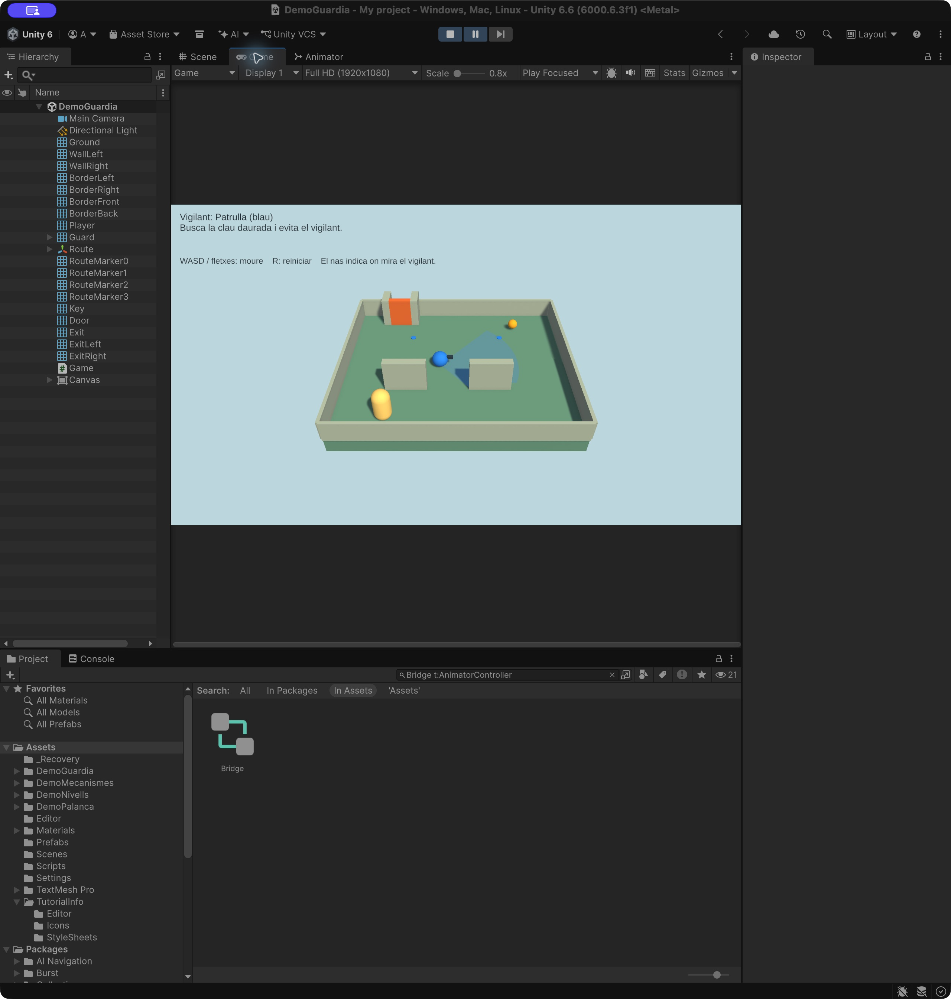
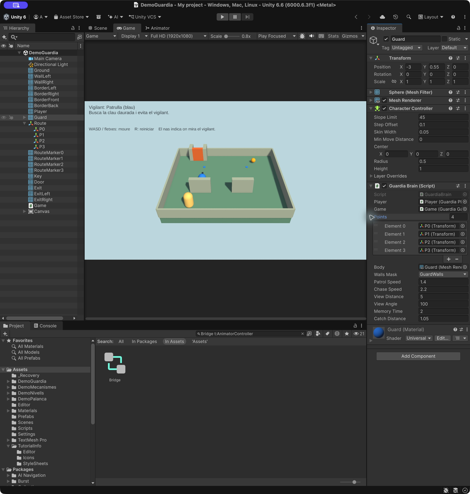
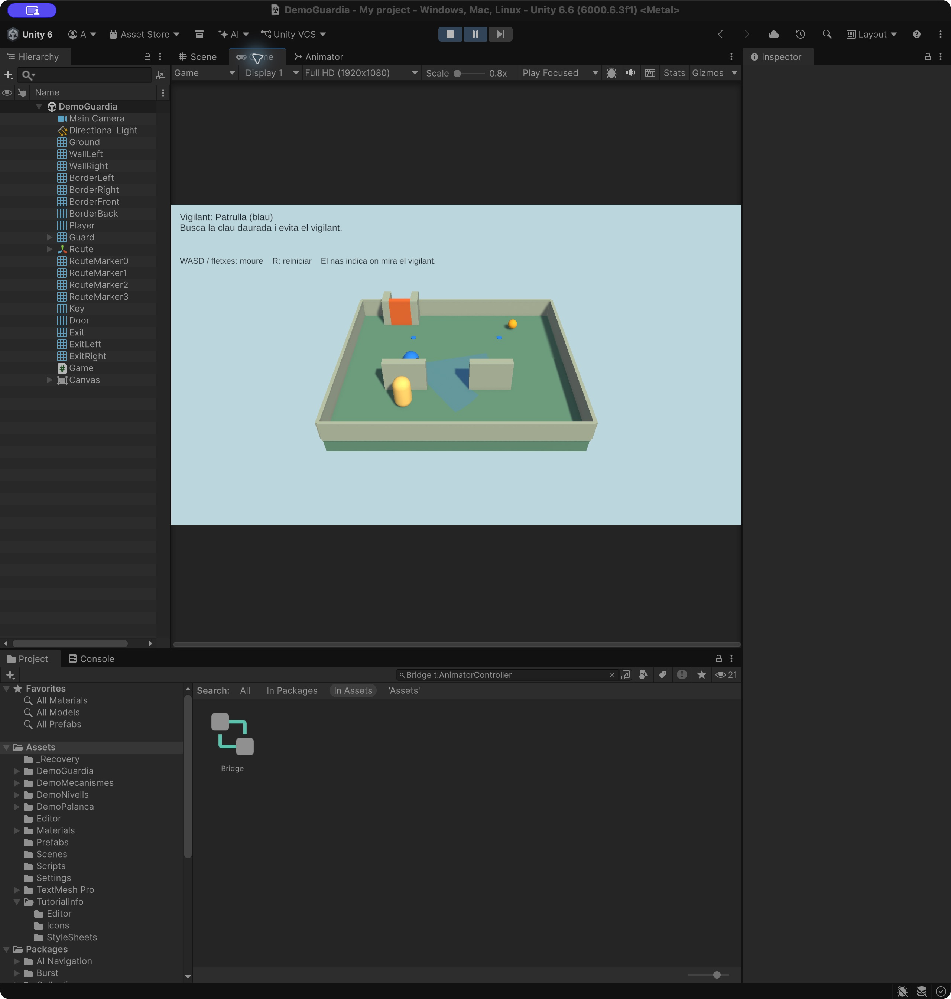
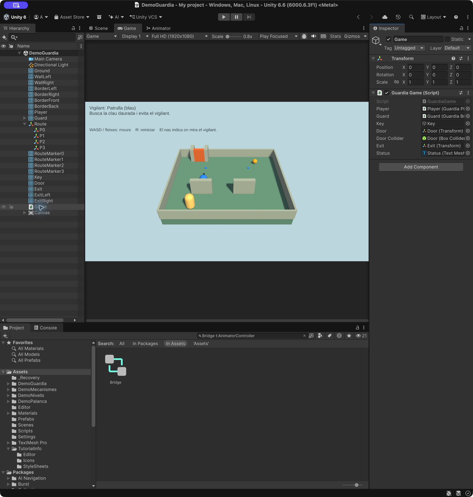
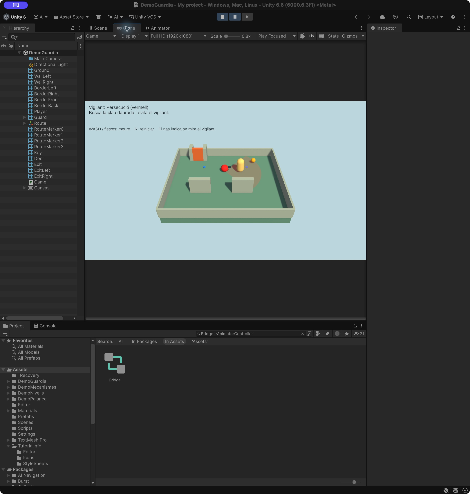
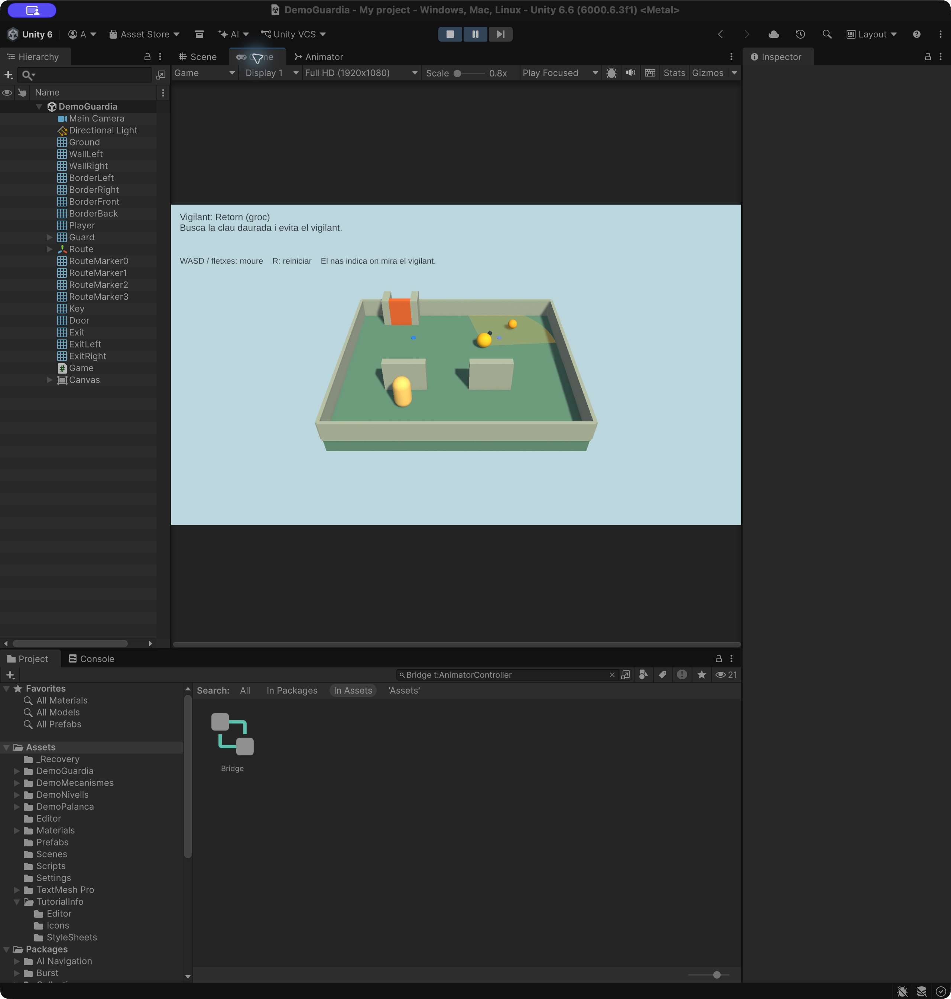
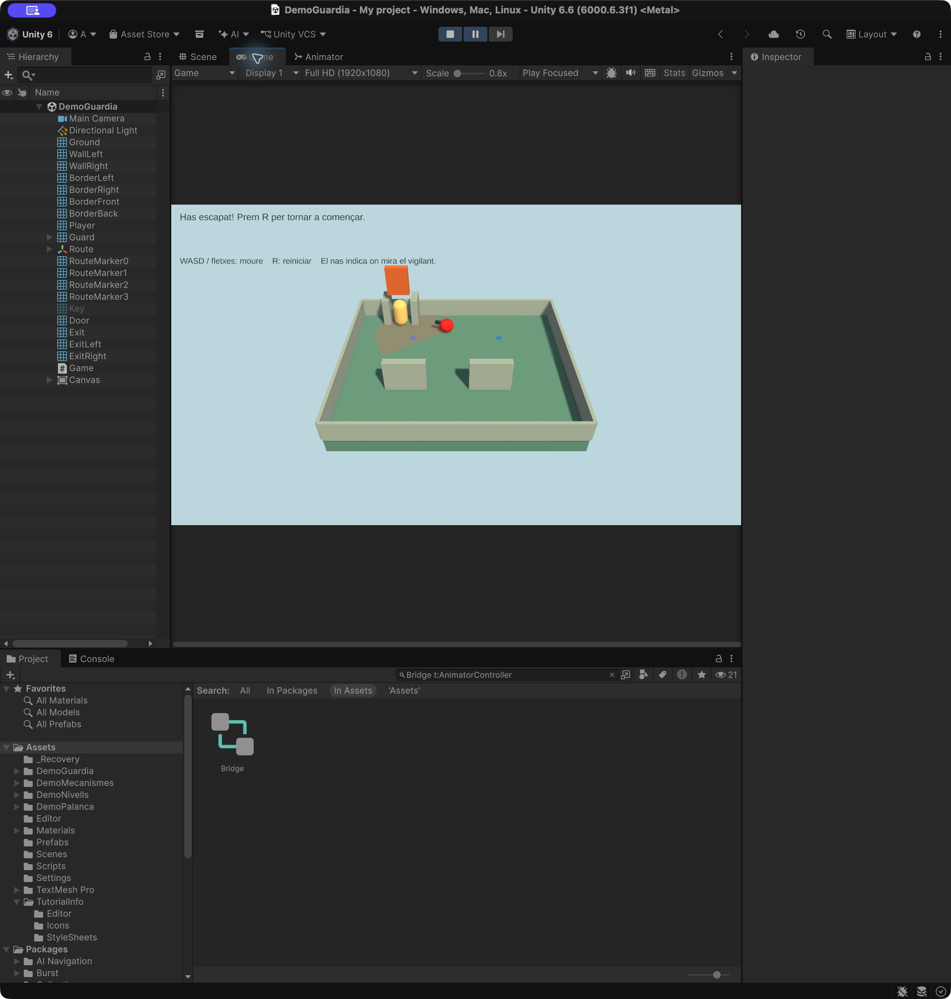

# Demo Guàrdia: patrulla, visió i persecució

Construirem un diorama amb una **càpsula**, un vigilant esfèric, dues parets per amagar-se, una clau i una porta. El repte és recollir la clau daurada i arribar a la sortida verda sense que el vigilant ens atrapi.

**Comencem des de zero.** No cal importar scripts de les demos anteriors. Practicarem una **màquina d’estats**, detecció per distància i angle, una prova de visió amb **Linecast** i una memòria de posicions per tornar al recorregut. No cal NavMesh ni crear shaders.

- **WASD o fletxes:** moure la càpsula pels eixos X/Z del món.
- **R:** reiniciar tota la demo, també després de guanyar.
- El nas del vigilant indica cap on mira.
- **Blau:** patrulla. **Vermell:** persegueix. **Groc:** torna al recorregut.
- Si t’atrapa, tots dos torneu a l’inici, la clau reapareix i la porta es tanca.



**Projecte acabat:** [Demo-6-Guardia.zip](demos/Demo-6-Guardia.zip). [Com obrir-lo](demos/README.md).

## 1. Preparar el projecte

1. Crea un projecte **Universal 3D (URP)**. Versió utilitzada: **Unity 6.6, 6000.6.3f1**.
2. A **Window > Package Manager**, comprova que **Input System** està instal·lat.
3. A **Edit > Project Settings > Player > Other Settings**, posa **Active Input Handling = Input System Package (New)** o **Both**. Reinicia l’Editor si ho demana.
4. Crea una escena Basic i desa-la com a **Assets/Scenes/DemoGuardia.unity**. Conserva **Main Camera** (tag MainCamera) i **Directional Light**. Si l’escena és buida, crea’ls des de GameObject.
5. Crea **Assets/DemoGuardia/Scripts** i **Assets/DemoGuardia/Materials**.
6. Importa **Window > TextMeshPro > Import TMP Essential Resources**. No cal Examples & Extras.
7. Crea els **quatre scripts complets de l’apartat 8** amb els noms indicats. Espera que acabin de compilar abans d’afegir-los als objectes. **No facis Play fins que hagis completat les referències de l’apartat 6.** Es referencien entre ells; mentre en falti algun, poden aparèixer errors provisionals.

## 2. Construir el diorama

Crea materials **Universal Render Pipeline/Lit**, opacs, amb Metallic 0 i Smoothness 0.15:

| Material | Color hexadecimal |
|---|---|
| Ground | `#6B9C8C` |
| Wall | `#AFBDB4` |
| Player | `#FFDB80` |
| Guard | `#268CFF` |
| Key | `#FFBA1A` |
| Exit | `#4BC985` |
| Door | `#E77535` |
| Nose | `#293F50` |

A **Inspector > Layer > Add Layer**, crea una capa d’usuari anomenada **GuardWalls**. Torna als objectes i assigna-la: crear una capa no l’assigna automàticament. No és un tag.

Crea aquests **cubs** a l’arrel de la jerarquia. Tots tenen Rotation `(0, 0, 0)`, Box Collider activat i **Is Trigger desactivat**. No afegeixis Rigidbody.

| Objecte | Position | Scale | Material | Layer |
|---|---|---|---|---|
| Ground | `(0, -0.5, 0)` | `(14, 1, 12)` | Ground | Default |
| WallLeft | `(-3, 1, -2)` | `(2.5, 2, 0.5)` | Wall | GuardWalls |
| WallRight | `(2, 1, -2)` | `(2.5, 2, 0.5)` | Wall | GuardWalls |
| BorderLeft | `(-7, 0.65, 0)` | `(0.2, 1.3, 12)` | Wall | GuardWalls |
| BorderRight | `(7, 0.65, 0)` | `(0.2, 1.3, 12)` | Wall | GuardWalls |
| BorderFront | `(0, 0.65, -6)` | `(14, 1.3, 0.2)` | Wall | GuardWalls |
| BorderBack | `(0, 0.65, 6)` | `(14, 1.3, 0.2)` | Wall | GuardWalls |
| ExitLeft | `(-5, 1, 5.3)` | `(0.5, 2, 1.4)` | Wall | GuardWalls |
| ExitRight | `(-3, 1, 5.3)` | `(0.5, 2, 1.4)` | Wall | GuardWalls |
| Door | `(-4, 1, 4.8)` | `(1.5, 2, 0.4)` | Door | GuardWalls |

La superfície del terra queda a Y = 0. Els dos cubs ExitLeft i ExitRight formen un passadís curt: s’hi entra passant per Door. La sortida és una zona dins del diorama, abans del límit posterior.

Crea també aquests objectes a l’arrel, amb rotació zero. **Elimina els seus colliders**: es recullen o detecten per distància, no per triggers.

| Objecte | Primitiva | Position | Scale | Material |
|---|---|---|---|---|
| Key | Sphere | `(4, 0.5, 4)` | `(0.65, 0.65, 0.65)` | Key |
| Exit | Cylinder | `(-4, 0.03, 5.3)` | `(1.2, 0.03, 0.8)` | Exit |

Configura **Main Camera**:

| Camp | Valor |
|---|---|
| Position | `(0, 16, -19)` |
| Rotation | `(40, 0, 0)` |
| Projection | Perspective |
| Field of View | `45` |
| Clipping Planes | Near `0.1`, Far `100` |
| Background Type | Solid Color |
| Background | `#C4DBE0` |

Al **Directional Light**, posa Rotation `(50, -30, 0)` i Intensity `1.3`. A **Window > Rendering > Lighting > Environment**, selecciona il·luminació ambiental de tipus Color amb gris `#8C8C8C`.

A Game utilitza una proporció **16:9**, per exemple Full HD (1920×1080), per obtenir l’enquadrament de les captures.

## 3. Crear el jugador i el vigilant

Crea una **Capsule** anomenada **Player**, a `(-4, 1.05, -4.5)`, amb rotació zero, escala `(1, 1, 1)` i material Player. Assigna-li el tag Player.

**Elimina el Capsule Collider** i afegeix **CharacterController**:

| Camp | Player |
|---|---:|
| Center | `(0, 0, 0)` |
| Height | `2` |
| Radius | `0.5` |
| Skin Width | `0.05` |
| Step Offset | `0.3` |
| Slope Limit | `45` |
| Min Move Distance | `0` |

Afegeix **GuardiaPlayer**. Deixa Speed `3.5`. El camp Game s’assignarà al final. No afegeixis Rigidbody ni PlayerInput: aquest exemple llegeix Keyboard amb Input System.

Crea una **Sphere** anomenada **Guard**, a `(-3, 0.55, 0)`, rotació zero i escala `(1, 1, 1)`. Assigna el material Guard. **Elimina Sphere Collider**, afegeix **CharacterController** i configura:

| Camp | Guard |
|---|---:|
| Center | `(0, 0, 0)` |
| Height | `1` |
| Radius | `0.5` |
| Skin Width | `0.05` |
| Step Offset | `0.1` |
| Slope Limit | `45` |
| Min Move Distance | `0` |

Afegeix **GuardiaBrain**. No afegeixis Rigidbody. Deixa Player i Guard a la capa Default: la prova de visió només ha de trobar parets.

Dins de Guard, crea un cub fill **Nose**. Posa **Local Position = `(0, 0.15, 0.6)`**, Local Rotation zero i Local Scale `(0.2, 0.2, 0.45)`. Assigna el material Nose i **elimina el Box Collider**. Aquest nas assenyala l’eix Z positiu del vigilant, que el codi fa servir com a direcció de visió.

## 4. Definir el recorregut per trams

1. Crea un objecte buit **Route**, a Position zero, Rotation zero i Scale `(1, 1, 1)`.
2. Crea quatre objectes buits com a fills: **P0**, **P1**, **P2** i **P3**.
3. Assigna les posicions següents. Com que Route no està transformat, coincideixen les coordenades locals i les del món.

| Punt | Position |
|---|---|
| P0 | `(-3, 0.55, 0)` |
| P1 | `(3, 0.55, 0)` |
| P2 | `(3, 0.55, 3)` |
| P3 | `(-3, 0.55, 3)` |

El recorregut és **P0 → P1 → P2 → P3 → P0**. Guard comença a P0 i es dirigeix a P1. Els punts han de ser fills de Route, **no de Guard**, perquè no es moguin amb el vigilant.

Per veure els punts durant Play, crea quatre cilindres **RouteMarker0...3** a l’arrel, amb material Guard, rotació zero i escala `(0.35, 0.025, 0.35)`. Posa’ls a les mateixes X/Z dels punts, però amb **Y = 0.025**. Elimina’n els colliders. Són marques decoratives: no els arrosseguis a Points.

A **Guard > GuardiaBrain > Points**, posa **Size = 4** i assigna els transforms P0, P1, P2 i P3 en aquest ordre.



**Per modificar el camí:** mou els punts i comprova que cada segment recte queda lliure, amb espai per al radi de 0.5 del vigilant. Aquest exemple no calcula rutes al voltant d’obstacles. El CharacterController impedeix travessar parets, però no decideix per quin costat s’han de vorejar.

## 5. Mostrar el camp de visió arran de terra

La detecció és un **sector circular de 100° i radi 5**, no una esfera. La distància i l’angle es comproven sobre X/Z; després es comprova la visibilitat entre dos punts amb alçada. Un cilindre molt baix representaria un disc de 360° i també marcaria el darrere del vigilant. Aquí dibuixarem només la porció frontal.

1. Crea el material **Vision** a Materials. Selecciona **Shader = Universal Render Pipeline/Unlit**.
2. Posa **Surface Type = Transparent**, **Blending Mode = Alpha** i Base Map de color blau, amb **Alpha = 0.18** (aproximadament 46 si el selector fa servir 0–255). Deixa la textura buida. No cal crear ni editar cap shader.
3. A Guard, crea un **objecte buit fill Vision**. Deixa **Local Position i Rotation a zero**, i Local Scale `(1, 1, 1)`.
4. Afegeix **GuardiaVision**: Unity afegirà Mesh Filter i Mesh Renderer gràcies a `RequireComponent`.
5. Al Mesh Renderer, posa el material Vision a **Materials > Element 0**. Desactiva Cast Shadows; el script també ho farà en executar-se.
6. A GuardiaVision, arrossega **Guard** al camp Guard. Deixa Segments `40` i Ground Height `0.07`.
7. **No afegeixis cap Collider ni Rigidbody a Vision.** No bloqueja ni activa res.

La malla apareix en fer Play. És plana, sense gruix, a Y = 0.07 perquè no coincideixi amb el terra. El radi i l’angle es llegeixen directament de GuardiaBrain: no cal introduir-los dues vegades. El color segueix els estats blau, vermell i groc.

El script crea triangles com els talls d’una pizza. Per a cada extrem del ventall, llança un raig horitzontal des de l’alçada dels ulls i retalla el dibuix si troba GuardWalls. És una ajuda visual mostrejada amb 40 segments; la detecció real continua fent el Linecast cap al jugador. Aquesta representació plana està pensada per a **aquest terra horitzontal**, no per a escales o pendents.



Pots desactivar l’objecte Vision per amagar el dibuix: la detecció del vigilant continuarà funcionant igual.

## 6. Text i referències

1. Crea **GameObject > UI > Canvas**, en **Screen Space - Overlay**.
2. Al Canvas Scaler, posa **Scale With Screen Size**, Reference Resolution `(1600, 900)` i Match `0.5`.
3. Crea un fill **UI > Text - TextMeshPro**, anomenat **Status**. Usa LiberationSans SDF, mida `26`, color fosc `#14262E`, alineació superior esquerra i desactiva Raycast Target.
4. Al RectTransform, posa **Anchor Min = Anchor Max = `(0, 1)`**, Pivot `(0, 1)`, Pos X `24`, Pos Y `-20`, Width `1300` i Height `125`. Text inicial: `Vigilant: Patrulla (blau)`.
5. Duplica’l com a **Controls**, posa Pos Y `-145`, mida de lletra `23` i text `WASD / fletxes: moure    R: reiniciar    El nas indica on mira el vigilant.`
6. Crea un objecte buit **Game**, amb **GuardiaGame**.

Ara completa **totes** les referències abans de fer Play:

| Component | Camp | Objecte o component que cal arrossegar |
|---|---|---|
| Player > GuardiaPlayer | Game | Game |
| Guard > GuardiaBrain | Player | Player |
| Guard > GuardiaBrain | Game | Game |
| Guard > GuardiaBrain | Body | Mesh Renderer de Guard |
| Guard > GuardiaBrain | Walls Mask | Selecciona **només GuardWalls** al desplegable |
| Guard > GuardiaBrain | Points | P0, P1, P2, P3 |
| Game > GuardiaGame | Player | Player |
| Game > GuardiaGame | Guard | Guard |
| Game > GuardiaGame | Key | Key |
| Game > GuardiaGame | Door | Door |
| Game > GuardiaGame | Door Collider | Box Collider de Door |
| Game > GuardiaGame | Exit | Exit |
| Game > GuardiaGame | Status | Status (TextMeshProUGUI) |

Deixa els valors de GuardiaBrain: Patrol Speed `1.4`, Chase Speed `2.2`, View Distance `5`, View Angle `100`, Memory Time `2` i Catch Distance `1.05`.



## 7. Entendre els tres estats

| Estat | Què fa | Quan canvia |
|---|---|---|
| Patrol | Va al següent punt de la llista | Si veu el jugador, passa a Chase |
| Chase | Es dirigeix a l’última posició on l’ha vist | Si passen 2 segons sense veure’l, passa a Return |
| Return | Desfà el camí de la persecució | Quan arriba al punt on l’havia començat, reprèn Patrol |

Si veu el jugador mentre torna, pot tornar a Chase. La memòria de dos segons es reinicia cada vegada que el veu.

**Veure el jugador requereix tres comprovacions:**

1. Està a 5 unitats o menys en el pla X/Z.
2. Està dins del camp de visió de 100°: com a màxim 50° a cada costat del nas.
3. No hi ha cap collider de GuardWalls entre els ulls del vigilant i el jugador.

`Physics.Linecast` comprova el segment entre dos punts; és la variant pràctica d’un raig quan ja coneixem origen i destinació. La LayerMask evita que el terra o els mateixos personatges tapin la detecció.



En perdre’l, el vigilant es dirigeix a **l’última posició vista**, no a la posició actual amagada. Després torna per una llista de posicions reals: si ha passat per A, B i C, desfà C → B → A. Això evita intentar tornar en línia recta travessant una paret. La llista guarda una posició aproximadament cada 0.3 unitats, no cada fotograma.



El retorn serveix en aquest escenari estàtic. Si afegeixes obstacles que es mouen i tanquen el camí, necessitaràs una solució de navegació més completa.

## 8. Scripts complets

### GuardiaPlayer.cs

El CharacterController resol les col·lisions. El codi aplica gravetat, limita el moviment diagonal i permet tornar a la posició inicial.

```csharp
using UnityEngine;
using UnityEngine.InputSystem;

[RequireComponent(typeof(CharacterController))]
public class GuardiaPlayer : MonoBehaviour
{
    public GuardiaGame game;
    public float speed = 3.5f;
    CharacterController controller;
    Vector3 start;
    float verticalSpeed;

    void Awake()
    {
        controller = GetComponent<CharacterController>();
        start = transform.position;
    }

    void Update()
    {
        if (game.Won) return;
        Vector2 input = Vector2.zero;
        var keyboard = Keyboard.current;
        if (keyboard != null)
        {
            if (keyboard.wKey.isPressed || keyboard.upArrowKey.isPressed) input.y++;
            if (keyboard.sKey.isPressed || keyboard.downArrowKey.isPressed) input.y--;
            if (keyboard.dKey.isPressed || keyboard.rightArrowKey.isPressed) input.x++;
            if (keyboard.aKey.isPressed || keyboard.leftArrowKey.isPressed) input.x--;
        }
        input = Vector2.ClampMagnitude(input, 1);
        if (controller.isGrounded && verticalSpeed < 0) verticalSpeed = -2;
        verticalSpeed += -20 * Time.deltaTime;
        controller.Move(new Vector3(input.x * speed, verticalSpeed, input.y * speed) * Time.deltaTime);
        if (transform.position.y < -5) game.ResetRound(true);
    }

    public void Respawn()
    {
        controller.enabled = false;
        transform.position = start;
        controller.enabled = true;
        verticalSpeed = 0;
    }
}
```

### GuardiaBrain.cs

`enum` dona nom als estats; `Update` decideix les transicions i executa el comportament corresponent. `trail` guarda el camí recorregut durant la persecució. El material és una instància pròpia del vigilant: els marcadors continuen blaus.

```csharp
using System.Collections.Generic;
using UnityEngine;

[RequireComponent(typeof(CharacterController))]
public class GuardiaBrain : MonoBehaviour
{
    public enum GuardState { Patrol, Chase, Return }
    public GuardiaPlayer player;
    public GuardiaGame game;
    public Transform[] points;
    public Renderer body;
    public LayerMask wallsMask;
    public float patrolSpeed = 1.4f;
    public float chaseSpeed = 2.2f;
    public float viewDistance = 5;
    public float viewAngle = 100;
    public float memoryTime = 2;
    public float catchDistance = 1.05f;
    public GuardState State { get; private set; }
    public bool SeesPlayer { get; private set; }

    CharacterController controller;
    Material material;
    int nextPoint;
    float lostTime;
    Vector3 lastSeen;
    readonly List<Vector3> trail = new List<Vector3>();

    void Awake()
    {
        controller = GetComponent<CharacterController>();
        material = body.material;
    }

    void OnDestroy()
    {
        if (material != null) Destroy(material);
    }

    public void ResetGuard()
    {
        controller.enabled = false;
        transform.position = points[0].position;
        controller.enabled = true;
        nextPoint = 1 % points.Length;
        Face(points[nextPoint].position - transform.position, true);
        lostTime = 0;
        SeesPlayer = false;
        trail.Clear();
        SetState(GuardState.Patrol);
    }

    public bool CanSeePlayer()
    {
        Vector3 delta = player.transform.position - transform.position;
        delta.y = 0;
        if (delta.magnitude > viewDistance) return false;
        if (delta.sqrMagnitude > 0.001f && Vector3.Angle(transform.forward, delta) > viewAngle * 0.5f)
            return false;
        Vector3 eye = transform.position + Vector3.up * 0.3f;
        Vector3 target = player.transform.position + Vector3.up * 0.3f;
        return !Physics.Linecast(eye, target, wallsMask, QueryTriggerInteraction.Ignore);
    }

    void Update()
    {
        if (game.Won) return;
        SeesPlayer = CanSeePlayer();
        if (SeesPlayer)
        {
            if (State == GuardState.Patrol)
            {
                trail.Clear();
                trail.Add(transform.position);
            }
            // Si el veu mentre torna, conserva el camí per poder desfer-lo després.
            SetState(GuardState.Chase);
            lostTime = 0;
            lastSeen = player.transform.position;
            lastSeen.y = transform.position.y;
        }
        else if (State == GuardState.Chase)
        {
            lostTime += Time.deltaTime;
            if (lostTime >= memoryTime) SetState(GuardState.Return);
        }

        if (State == GuardState.Patrol)
        {
            if (WalkTo(points[nextPoint].position, patrolSpeed))
                nextPoint = (nextPoint + 1) % points.Length;
        }
        else if (State == GuardState.Chase)
        {
            WalkTo(lastSeen, chaseSpeed);
            if (trail.Count == 0 || FlatDistance(transform.position, trail[trail.Count - 1]) >= 0.3f)
                trail.Add(transform.position);
            Vector3 eye = transform.position + Vector3.up * 0.3f;
            Vector3 target = player.transform.position + Vector3.up * 0.3f;
            if (FlatDistance(transform.position, player.transform.position) < catchDistance &&
                !Physics.Linecast(eye, target, wallsMask, QueryTriggerInteraction.Ignore))
                game.ResetRound(true);
        }
        else
        {
            // Recorre en ordre invers les posicions per on realment ha passat.
            if (trail.Count == 0) SetState(GuardState.Patrol);
            else if (WalkTo(trail[trail.Count - 1], patrolSpeed)) trail.RemoveAt(trail.Count - 1);
        }
    }

    bool WalkTo(Vector3 target, float speed)
    {
        Vector3 delta = target - transform.position;
        delta.y = 0;
        if (delta.magnitude < 0.06f) return true;
        Face(delta, false);
        Vector3 movement = Vector3.ClampMagnitude(delta, speed * Time.deltaTime);
        movement.y = -2 * Time.deltaTime;
        controller.Move(movement);
        return false;
    }

    void Face(Vector3 direction, bool instant)
    {
        direction.y = 0;
        if (direction.sqrMagnitude < 0.001f) return;
        Quaternion target = Quaternion.LookRotation(direction);
        transform.rotation = instant ? target : Quaternion.RotateTowards(transform.rotation, target, 540 * Time.deltaTime);
    }

    void SetState(GuardState state)
    {
        State = state;
        Color color = state == GuardState.Patrol ? new Color(0.15f, 0.55f, 1) :
                      state == GuardState.Chase ? new Color(1, 0.15f, 0.1f) : new Color(1, 0.8f, 0.1f);
        material.SetColor("_BaseColor", color);
    }

    static float FlatDistance(Vector3 a, Vector3 b)
    {
        a.y = b.y = 0;
        return Vector3.Distance(a, b);
    }
}
```

### GuardiaGame.cs

Controla clau, porta, victòria, reinici i text. Les distàncies de recollida i sortida es calculen en X/Z perquè els centres dels objectes tenen alçades diferents.

```csharp
using TMPro;
using UnityEngine;
using UnityEngine.InputSystem;

public class GuardiaGame : MonoBehaviour
{
    public GuardiaPlayer player;
    public GuardiaBrain guard;
    public GameObject key;
    public Transform door;
    public Collider doorCollider;
    public Transform exit;
    public TMP_Text status;
    public bool Won { get; private set; }
    public bool HasKey { get; private set; }
    Vector3 closedPosition;
    float messageUntil;

    void Start()
    {
        closedPosition = door.position;
        ResetRound(false);
    }

    void Update()
    {
        if (Keyboard.current != null && Keyboard.current.rKey.wasPressedThisFrame)
            ResetRound(false);
        if (!Won)
        {
            if (!HasKey && FlatDistance(player.transform.position, key.transform.position) < 1)
            {
                HasKey = true;
                key.SetActive(false);
            }
            Vector3 target = closedPosition + (HasKey ? Vector3.up * 2.5f : Vector3.zero);
            door.position = Vector3.MoveTowards(door.position, target, 3 * Time.deltaTime);
            bool open = HasKey && Vector3.Distance(door.position, target) < 0.01f;
            doorCollider.enabled = !open;
            if (open && FlatDistance(player.transform.position, exit.position) < 0.65f) Won = true;
        }
        string state = guard.State == GuardiaBrain.GuardState.Patrol ? "Patrulla (blau)" :
                       guard.State == GuardiaBrain.GuardState.Chase ? "Persecució (vermell)" : "Retorn (groc)";
        status.text = Won ? "Has escapat! Prem R per tornar a començar." :
            (Time.time < messageUntil ? "T'ha atrapat! Tornes a l'inici.\n" : "") +
            "Vigilant: " + state + "\n" + (HasKey ? "Clau recollida: arriba a la sortida verda." : "Busca la clau daurada i evita el vigilant.");
    }

    public void ResetRound(bool caught)
    {
        Won = false;
        HasKey = false;
        key.SetActive(true);
        door.position = closedPosition;
        doorCollider.enabled = true;
        player.Respawn();
        guard.ResetGuard();
        Physics.SyncTransforms();
        messageUntil = caught ? Time.time + 2 : 0;
    }

    static float FlatDistance(Vector3 a, Vector3 b)
    {
        a.y = b.y = 0;
        return Vector3.Distance(a, b);
    }
}
```

### GuardiaVision.cs

Aquest script només dibuixa. No modifica els estats ni decideix si el jugador ha estat detectat. Mesh Filter guarda la geometria i Mesh Renderer la mostra amb el material transparent estàndard.

```csharp
using UnityEngine;
using UnityEngine.Rendering;

[RequireComponent(typeof(MeshFilter), typeof(MeshRenderer))]
public class GuardiaVision : MonoBehaviour
{
    public GuardiaBrain guard;
    [Range(8, 120)] public int segments = 40;
    public float groundHeight = 0.07f;
    Mesh mesh;
    Material material;
    Vector3[] vertices;
    int[] triangles;

    void Awake()
    {
        mesh = new Mesh { name = "Camp de visió" };
        GetComponent<MeshFilter>().mesh = mesh;
        var renderer = GetComponent<MeshRenderer>();
        renderer.shadowCastingMode = ShadowCastingMode.Off;
        renderer.receiveShadows = false;
        material = renderer.material;
        vertices = new Vector3[segments + 2];
        triangles = new int[segments * 3];
        for (int i = 0; i < segments; i++)
        {
            triangles[i * 3] = 0;
            triangles[i * 3 + 1] = i + 1;
            triangles[i * 3 + 2] = i + 2;
        }
    }

    void LateUpdate()
    {
        Vector3 eye = guard.transform.position + Vector3.up * 0.3f;
        Vector3 center = guard.transform.position;
        center.y = groundHeight;
        vertices[0] = transform.InverseTransformPoint(center);
        for (int i = 0; i <= segments; i++)
        {
            float angle = Mathf.Lerp(-guard.viewAngle * 0.5f, guard.viewAngle * 0.5f, (float)i / segments);
            Vector3 direction = Quaternion.AngleAxis(angle, Vector3.up) * guard.transform.forward;
            float distance = guard.viewDistance;
            if (Physics.Raycast(eye, direction, out RaycastHit hit, distance, guard.wallsMask, QueryTriggerInteraction.Ignore))
                distance = hit.distance;
            vertices[i + 1] = transform.InverseTransformPoint(center + direction * distance);
        }
        mesh.vertices = vertices;
        mesh.triangles = triangles;
        mesh.RecalculateBounds();
        Color color = guard.State == GuardiaBrain.GuardState.Patrol ? new Color(0.15f, 0.55f, 1, 0.18f) :
                      guard.State == GuardiaBrain.GuardState.Chase ? new Color(1, 0.15f, 0.1f, 0.18f) :
                      new Color(1, 0.8f, 0.1f, 0.18f);
        material.SetColor("_BaseColor", color);
    }

    void OnDestroy()
    {
        if (mesh != null) Destroy(mesh);
        if (material != null) Destroy(material);
    }
}
```

## 9. Provar la demo

Desa l’escena, prem **Play** i clica **Game**. Comprova-ho en aquest ordre:

1. Sense moure’t, el vigilant és blau i recorre els quatre punts en bucle. El ventall gira amb el nas, es retalla davant de les parets i no impedeix el moviment.
2. Acosta’t per darrere: no hauria de detectar-te fins que entres dins del seu angle de visió. El contacte molt proper amb un vigilant que ja persegueix sí que et pot atrapar.
3. Entra davant del seu nas a menys de 5 unitats: es torna vermell i se t’acosta.
4. Amaga’t darrere d’una de les parets. Durant dos segons conserva l’última posició vista; després es torna groc i desfà el recorregut. Si et torna a veure, reprèn la persecució.
5. Deixa que t’atrapi: torna la càpsula a l’inici, reapareix la clau i es tanca la porta.
6. Recull la clau daurada. Desapareix i la porta puja. En acabar de pujar, el seu collider es desactiva.
7. Entra al passadís de la porta i trepitja la zona verda: apareix **Has escapat!**. Jugador i vigilant s’aturen.
8. Prem **R**: tot torna a l’estat inicial.



Per superar el repte, pots vorejar WallRight pel costat dret, recollir la clau, avançar per la franja que queda davant del passadís de sortida i entrar-hi des del sud. El jugador és més ràpid que el vigilant; aprofita les parets per tallar-li la visió.

### Si alguna cosa no funciona

- **Errors de referències:** revisa la taula de l’apartat 6 i que Points tingui quatre transforms vàlids.
- **Veu a través de les parets:** comprova la capa GuardWalls dels cubs, el seu Box Collider sòlid i el camp Walls Mask del vigilant.
- **No veu mai el jugador:** no incloguis Default a Walls Mask; revisa distància, angle i orientació del nas.
- **Queda encallat patrullant:** algun segment passa massa a prop d’un obstacle. Mou els punts; aquí no hi ha cerca automàtica de camins.
- **Personatges massa alts o duplicació de col·lisions:** Center ha de ser zero, l’escala dels dos personatges ha de ser 1 i s’han d’eliminar els colliders originals abans d’afegir CharacterController.
- **El teclat no respon:** comprova Input System, Play actiu, Pause desactivat i el focus a Game.

Atura Play abans d’editar posicions o referències permanents. Les modificacions fetes durant Play es perden quan l’atures.
