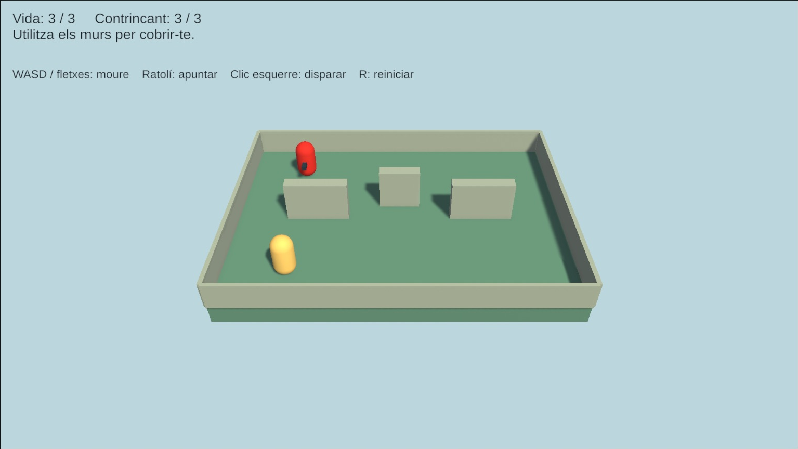
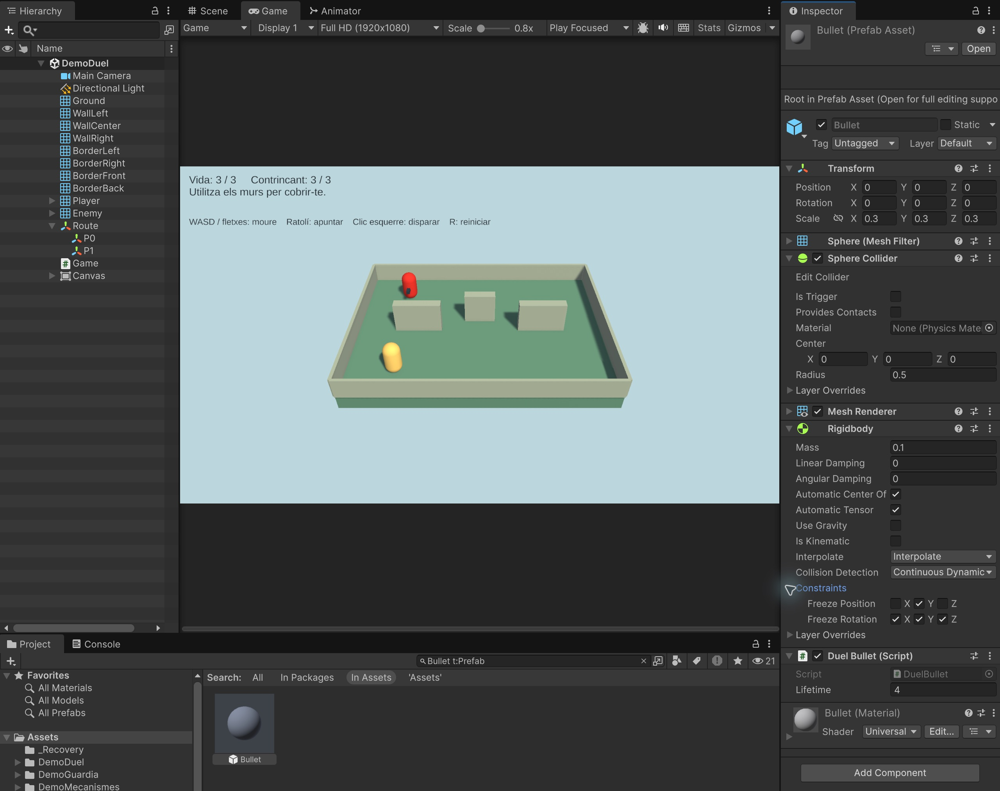
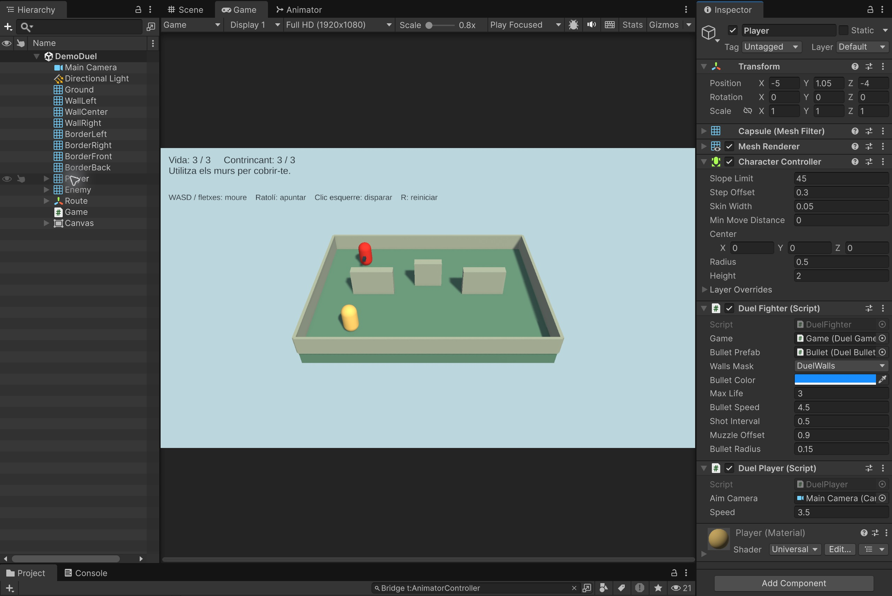
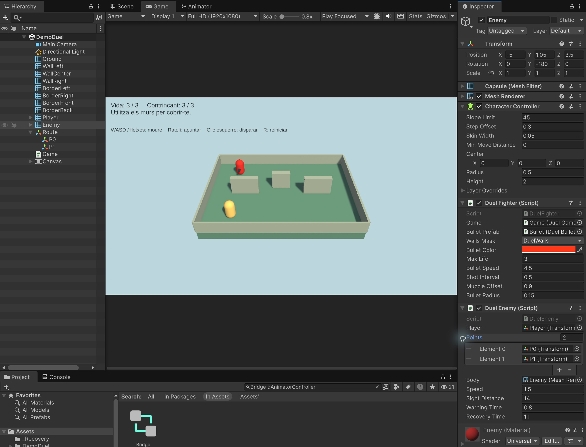
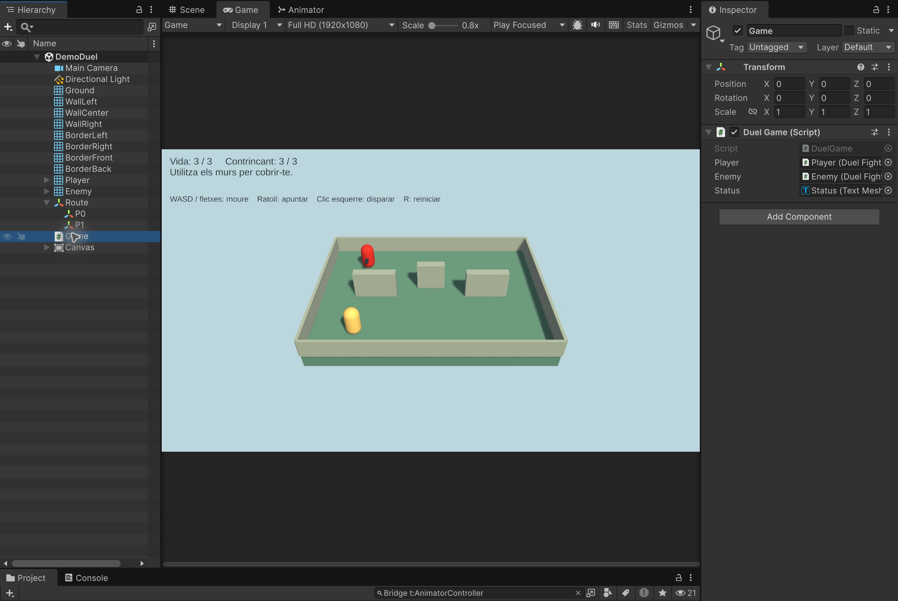
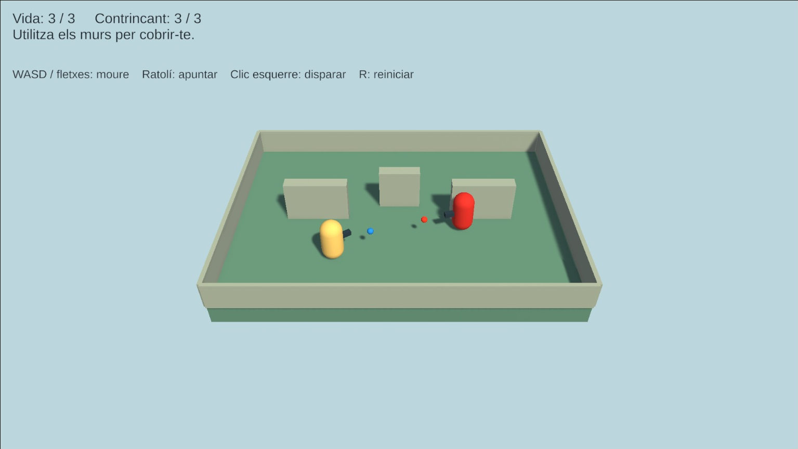
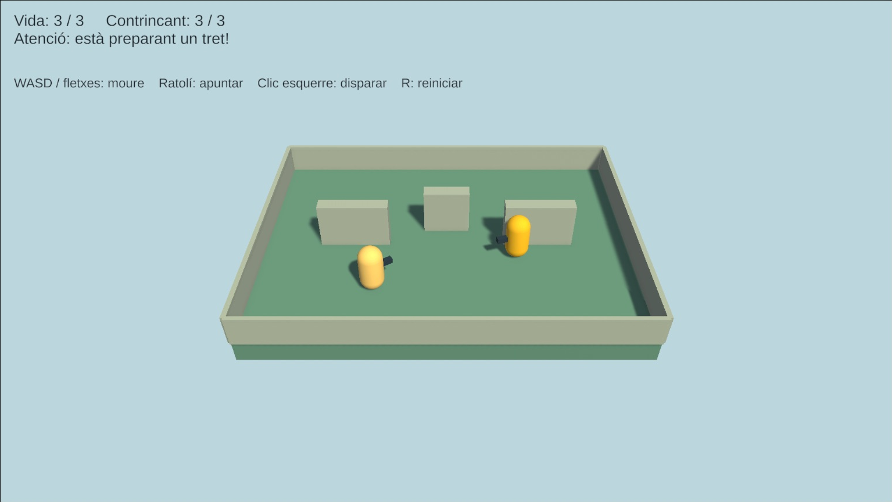
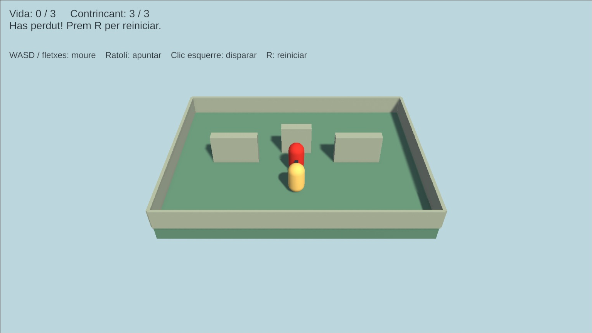

# Demo Duel: apuntar, disparar i esquivar

Construirem una arena petita amb **dues càpsules**, tres murs per cobrir-se i **esferes com a projectils**, inspirada en el ritme pausat de Tanks! de Wii. La càpsula groga és el jugador i la vermella és el contrincant.

**Comencem des de zero.** No cal importar scripts d’altres demos. Practicarem punteria amb ratolí, moviment independent de l’orientació, prefabs de projectils, col·lisions, temps entre trets, vida i final de partida.

- **WASD o fletxes:** moure el jugador pels eixos X/Z del món.
- **Ratolí:** apuntar. **Botó esquerre mantingut:** disparar cada 0.5 segons.
- **R:** reiniciar, també després de guanyar o perdre.
- Cada personatge té **3 punts de vida**.
- Les bales es mouen a **4.5 unitats/s**, només una mica més ràpid que el jugador (**3.5 unitats/s**), per poder esquivar-les.
- L’enemic es torna **groc durant 0.8 segons abans de disparar** i manté la direcció anunciada. Després espera 1.1 segons abans de decidir el següent moviment.



**Projecte acabat:** [Demo-7-Duel.zip](demos/Demo-7-Duel.zip). [Com obrir-lo](demos/README.md).

En aquesta versió les bales desapareixen en impactar; no reboten. Primer aprendrem a fer funcionar el duel bàsic.

## 1. Preparar el projecte

1. Crea un projecte **Universal 3D (URP)**. Versió utilitzada: **Unity 6.6, 6000.6.3f1**.
2. Comprova a **Window > Package Manager** que **Input System** està instal·lat.
3. A **Edit > Project Settings > Player > Other Settings**, selecciona **Active Input Handling = Input System Package (New)** o **Both** i reinicia si Unity ho demana.
4. Crea una escena Basic i desa-la a **Assets/Scenes/DemoDuel.unity**. Necessita **Main Camera** (tag MainCamera) i **Directional Light**. Si és buida, crea’ls des del menú GameObject.
5. Crea **Assets/DemoDuel**, amb les carpetes **Scripts**, **Materials** i **Prefabs**.
6. Importa **Window > TextMeshPro > Import TMP Essential Resources**. No cal Examples & Extras.
7. Crea els **cinc scripts complets de l’apartat 8** amb els noms indicats. Es referencien entre ells: espera que hi siguin tots i que acabin de compilar abans d’afegir-los com a components.

**No facis Play fins que hagis assignat les referències de l’apartat 6.** No necessitem PlayerInput, NavMesh ni escriure shaders.

## 2. Construir l’arena i configurar la càmera

Crea aquests materials amb **Shader = Universal Render Pipeline/Lit**, **Surface Type = Opaque**, Metallic `0`, Smoothness `0.15` i alfa `1`:

| Material | Color hexadecimal |
|---|---|
| Ground | `#6B9C8C` |
| Wall | `#AFBDB4` |
| Player | `#FFDB80` |
| Enemy | `#E63326` |
| Barrel | `#293F50` |
| Bullet | `#FFFFFF` |

A **Inspector > Layer > Add Layer**, crea la capa **DuelWalls**. Després torna als objectes i assigna-la. És una **Layer**, no un tag.

Crea aquests **cubs** a l’arrel de la jerarquia, amb rotació zero. Conserva Box Collider sòlid, amb **Is Trigger desactivat**. No hi afegeixis Rigidbody.

| Objecte | Position | Scale | Material | Layer |
|---|---|---|---|---|
| Ground | `(0, -0.5, 0)` | `(16, 1, 12)` | Ground | Default |
| WallLeft | `(-4, 1, 0)` | `(3, 2, 0.6)` | Wall | DuelWalls |
| WallCenter | `(0, 1, 1)` | `(2, 2, 0.6)` | Wall | DuelWalls |
| WallRight | `(4, 1, 0)` | `(3, 2, 0.6)` | Wall | DuelWalls |
| BorderLeft | `(-8, 0.65, 0)` | `(0.2, 1.3, 12)` | Wall | DuelWalls |
| BorderRight | `(8, 0.65, 0)` | `(0.2, 1.3, 12)` | Wall | DuelWalls |
| BorderFront | `(0, 0.65, -6)` | `(16, 1.3, 0.2)` | Wall | DuelWalls |
| BorderBack | `(0, 0.65, 6)` | `(16, 1.3, 0.2)` | Wall | DuelWalls |

El terra queda a Y = 0. Els límits mantenen els personatges dins de l’arena i també aturen les bales.

Configura **Main Camera**:

| Camp | Valor |
|---|---|
| Position | `(0, 17, -21)` |
| Rotation | `(40, 0, 0)` |
| Projection | Perspective |
| Field of View | `45` |
| Clipping Planes | Near `0.1`, Far `100` |
| Background Type | Solid Color |
| Background | `#C4DBE0` |

Al Directional Light, posa Rotation `(50, -30, 0)` i Intensity `1.3`. A **Window > Rendering > Lighting > Environment**, posa il·luminació ambiental de tipus Color, gris `#8C8C8C`.

A Game, selecciona una proporció **16:9**, per exemple Full HD (1920×1080), per reproduir l’enquadrament de les captures.

## 3. Crear el prefab de la bala

1. Crea una **Sphere** anomenada **Bullet**, amb Position i Rotation zero i **Scale = `(0.3, 0.3, 0.3)`**.
2. Assigna el material Bullet. El codi posarà el color de cada tirador en crear-la.
3. Conserva **Sphere Collider**, Center zero, Radius `0.5` i **Is Trigger desactivat**. Amb l’escala 0.3, el radi real és **0.15**.
4. Afegeix **Rigidbody** amb els valors següents.
5. Afegeix **DuelBullet** i deixa Lifetime `4`.
6. Arrossega Bullet de Hierarchy a **Assets/DemoDuel/Prefabs** per crear **Bullet.prefab**.
7. **Elimina Bullet de l’escena.** El prefab queda a Project i només es crearan instàncies quan algú dispari.

| Rigidbody de Bullet | Valor |
|---|---|
| Mass | `0.1` |
| Linear Damping | `0` |
| Angular Damping | `0` |
| Use Gravity | Desactivat |
| Is Kinematic | Desactivat |
| Interpolate | Interpolate |
| Collision Detection | Continuous Dynamic |
| Constraints > Freeze Position | Només **Y** |
| Constraints > Freeze Rotation | **X, Y i Z** |

No congelis Position X/Z: la bala ha de poder avançar. No la converteixis en trigger: el script utilitza `OnCollisionEnter`. La detecció contínua ajuda a evitar que travessi colliders prims entre passos de física.



## 4. Crear els dos personatges

Crea dues **Capsule** independents, amb escala `(1, 1, 1)`:

| Objecte | Position | Rotation | Material |
|---|---|---|---|
| Player | `(-5, 1.05, -4)` | `(0, 0, 0)` | Player |
| Enemy | `(-5, 1.05, 3.5)` | `(0, 180, 0)` | Enemy |

A **tots dos**, elimina el Capsule Collider i afegeix **CharacterController**. No hi afegeixis Rigidbody. Deixa la capa Default; no cal cap tag especial.

| CharacterController | Valor |
|---|---|
| Center | `(0, 0, 0)` |
| Height | `2` |
| Radius | `0.5` |
| Skin Width | `0.05` |
| Step Offset | `0.3` |
| Slope Limit | `45` |
| Min Move Distance | `0` |

Dins de **cada càpsula**, crea un cub fill **Barrel** amb **Local Position `(0, 0, 0.6)`**, Local Rotation zero i **Local Scale `(0.22, 0.22, 0.65)`**. Assigna el material Barrel i **elimina el Box Collider** del fill. És l’indicador visual de la direcció del tret, que coincideix amb l’eix Z positiu del personatge.

Afegeix **DuelFighter als dos personatges**. És el component compartit que guarda la vida i crea els projectils:

| Camp de DuelFighter | Player | Enemy |
|---|---|---|
| Bullet Prefab | Bullet.prefab de Project | El mateix prefab |
| Walls Mask | Només DuelWalls | Només DuelWalls |
| Bullet Color | Blau `#1A99FF` | Taronja `#FF401A` |
| Max Life | `3` | `3` |
| Bullet Speed | `4.5` | `4.5` |
| Shot Interval | `0.5` | `0.5` |
| Muzzle Offset | `0.9` | `0.9` |
| Bullet Radius | `0.15` | `0.15` |

Deixa el camp Game pendent fins a l’apartat 6. **Bullet Radius ha de coincidir amb el radi real del prefab.** La bala es crea a 0.9 unitats del centre, davant del personatge. Abans es comprova que aquest espai no travessi un mur: així no podem disparar a través d’una paret enganxant-nos-hi.

A **Player**, afegeix **DuelPlayer**, arrossega Main Camera al camp **Aim Camera** i posa Speed `3.5`.



A **Enemy**, afegeix **DuelEnemy**. Arrossega Player al camp Player i el **Mesh Renderer de la càpsula Enemy** al camp Body. No hi posis el renderer de Barrel.

| Camp de DuelEnemy | Valor |
|---|---|
| Speed | `1.5` |
| Sight Distance | `14` |
| Warning Time | `0.8` |
| Recovery Time | `1.1` |

## 5. Definir la patrulla de l’enemic

1. Crea un objecte buit **Route**, amb Position i Rotation zero i Scale `(1, 1, 1)`.
2. Crea dos fills buits **P0** i **P1**.
3. Posa **P0 a `(-5, 1.05, 3.5)`** i **P1 a `(5, 1.05, 3.5)`**. Les coordenades locals coincideixen amb les del món perquè Route no està transformat.
4. A Enemy > DuelEnemy > Points, posa **Size = 2**. Assigna P0 a Element 0 i P1 a Element 1.

El contrincant comença a P0, va a P1 i torna. El tram és recte i queda darrere dels tres murs. Si canvies els punts, comprova que el segment queda lliure: aquí no hi ha cerca de camins.



Quan té visió del jugador a menys de 14 unitats, s’atura i prepara un tret. En aquesta demo **pot detectar en qualsevol direcció**, sense el sector angular de la demo Guardia. Els murs de DuelWalls li bloquegen la visió.

## 6. Crear el text i connectar la partida

1. Crea **GameObject > UI > Canvas**, en **Screen Space - Overlay**.
2. Al Canvas Scaler, posa **Scale With Screen Size**, Reference Resolution `(1600, 900)` i Match `0.5`.
3. Dins del Canvas, crea **UI > Text - TextMeshPro**, anomenat **Status**. Font LiberationSans SDF, mida `28`, color fosc `#14262E`, alineació superior esquerra i Raycast Target desactivat.
4. Al RectTransform: **Anchor Min = Anchor Max = `(0, 1)`**, Pivot `(0, 1)`, Pos X `24`, Pos Y `-20`, Width `1500`, Height `110`.
5. Text inicial: `Vida: 3 / 3     Contrincant: 3 / 3`.
6. Duplica’l com a **Controls**, posa Pos Y `-135`, mida `23` i text: `WASD / fletxes: moure    Ratolí: apuntar    Clic esquerre: disparar    R: reiniciar`.
7. Crea un objecte buit **Game** i afegeix **DuelGame**.

Completa aquestes referències:

| Component | Camp | Assignació |
|---|---|---|
| Player > DuelFighter | Game | Game |
| Enemy > DuelFighter | Game | Game |
| Game > DuelGame | Player | DuelFighter de Player |
| Game > DuelGame | Enemy | DuelFighter de Enemy |
| Game > DuelGame | Status | Status (TextMeshProUGUI) |

Comprova també les referències dels apartats anteriors: Bullet Prefab, Walls Mask, Aim Camera, Player, Body i els dos Points. Conserva les col·lisions entre Default i DuelWalls a la matriu de **Project Settings > Physics**; no cal modificar-la.



## 7. Com funciona

### Apuntar sense canviar el moviment

WASD mou pels eixos X/Z del món, independentment de cap on miri la càpsula. El ratolí determina la rotació.

`ScreenPointToRay` projecta un raig des de la càmera passant pel punter. El tallem amb un **pla matemàtic horitzontal a l’alçada del centre del jugador**, Y aproximadament 1.05, que és també l’alçada dels projectils. No cal crear cap Plane a l’escena. Apunta al **centre de la càpsula rival**, no als seus peus.

### Crear una bala

`Instantiate` crea una instància del prefab. `Launch` recorda qui ha disparat, ignora els seus colliders, aplica el color i assigna `Rigidbody.linearVelocity`.

La velocitat ja s’expressa en unitats per segon: **no es multiplica per deltaTime en assignar linearVelocity**. El motor de física actualitza el desplaçament.

En impactar, la bala busca un DuelFighter a l’objecte o als seus pares. Si n’hi ha, li treu una vida. En qualsevol impacte es desactiva i es destrueix. Si no toca res, caduca als quatre segons.



### Donar temps per esquivar

| Estat de l’enemic | Comportament |
|---|---|
| Patrol | Si no veu el jugador, avança pel recorregut. Si el veu, guarda la direcció del tret |
| Warning | Es torna groc, s’atura i espera 0.8 segons, mantenint la direcció anunciada |
| Recovery | Dispara i espera 1.1 segons abans de tornar a Patrol |

No corregeix la punteria durant l’avís. Mou-te lateralment quan es torni groc: dispararà cap on eres, no cap on ets ara. Si t’amagues durant l’avís, el tret anunciat pot sortir igualment, però el mur l’aturarà.

El temps entre trets del jugador és de 0.5 segons. En l’enemic, l’avís i la recuperació allarguen el cicle a aproximadament 1.9 segons, a més de qualsevol patrulla.



### Vida i final de partida

Cada impacte resta una vida. Quan algú arriba a zero, s’aturen el moviment i els dispars, es retiren les bales actives i apareix el resultat. R recupera les vides, posicions i rotacions inicials i reinicia la patrulla.

## 8. Scripts complets

### DuelFighter.cs

Component compartit: vida, interval entre dispars i creació segura de la bala.

```csharp
using UnityEngine;

public class DuelFighter : MonoBehaviour
{
    public DuelGame game;
    public DuelBullet bulletPrefab;
    public LayerMask wallsMask;
    public Color bulletColor = Color.cyan;
    public int maxLife = 3;
    public float bulletSpeed = 4.5f;
    public float shotInterval = 0.5f;
    public float muzzleOffset = 0.9f;
    public float bulletRadius = 0.15f;
    public int Life { get; private set; }
    float nextShot;

    public void ResetFighter()
    {
        Life = maxLife;
        nextShot = 0;
    }

    public bool Fire(Vector3 direction)
    {
        if (game.IsOver || Life <= 0 || Time.time < nextShot) return false;
        direction.y = 0;
        if (direction.sqrMagnitude < 0.001f) return false;
        direction.Normalize();
        nextShot = Time.time + shotInterval;
        // Evita crear la bala a l'altra banda d'un mur molt proper.
        if (Physics.SphereCast(transform.position, bulletRadius, direction,
            out _, muzzleOffset, wallsMask, QueryTriggerInteraction.Ignore)) return false;
        DuelBullet bullet = Instantiate(bulletPrefab,
            transform.position + direction * muzzleOffset, Quaternion.LookRotation(direction));
        bullet.Launch(this, direction, bulletSpeed, bulletColor);
        return true;
    }

    public void TakeHit()
    {
        if (game.IsOver || Life <= 0) return;
        Life--;
        if (Life == 0) game.Finish(this);
    }
}
```

### DuelBullet.cs

Moviment físic, propietari, impacte i caducitat de cada projectil.

```csharp
using UnityEngine;

[RequireComponent(typeof(Rigidbody), typeof(SphereCollider))]
public class DuelBullet : MonoBehaviour
{
    public float lifetime = 4;
    DuelFighter owner;
    bool spent;
    Material material;

    public void Launch(DuelFighter shooter, Vector3 direction, float speed, Color color)
    {
        owner = shooter;
        var bulletCollider = GetComponent<Collider>();
        foreach (var ownCollider in shooter.GetComponentsInChildren<Collider>())
            Physics.IgnoreCollision(bulletCollider, ownCollider);
        material = GetComponent<Renderer>().material;
        material.SetColor("_BaseColor", color);
        GetComponent<Rigidbody>().linearVelocity = direction * speed;
        Destroy(gameObject, lifetime);
    }

    void OnCollisionEnter(Collision collision)
    {
        if (spent) return;
        var fighter = collision.collider.GetComponentInParent<DuelFighter>();
        if (fighter == owner) return;
        spent = true;
        if (fighter != null) fighter.TakeHit();
        Remove();
    }

    public void Remove()
    {
        spent = true;
        gameObject.SetActive(false);
        Destroy(gameObject);
    }

    void OnDestroy()
    {
        if (material != null) Destroy(material);
    }
}
```

### DuelPlayer.cs

Teclat per moure i ratolí per orientar i disparar.

```csharp
using UnityEngine;
using UnityEngine.InputSystem;

[RequireComponent(typeof(CharacterController), typeof(DuelFighter))]
public class DuelPlayer : MonoBehaviour
{
    public Camera aimCamera;
    public float speed = 3.5f;
    CharacterController controller;
    DuelFighter fighter;
    float verticalSpeed;

    void Awake()
    {
        controller = GetComponent<CharacterController>();
        fighter = GetComponent<DuelFighter>();
    }

    void Update()
    {
        if (fighter.game.IsOver) return;
        Vector2 input = Vector2.zero;
        var keyboard = Keyboard.current;
        if (keyboard != null)
        {
            if (keyboard.wKey.isPressed || keyboard.upArrowKey.isPressed) input.y++;
            if (keyboard.sKey.isPressed || keyboard.downArrowKey.isPressed) input.y--;
            if (keyboard.aKey.isPressed || keyboard.leftArrowKey.isPressed) input.x--;
            if (keyboard.dKey.isPressed || keyboard.rightArrowKey.isPressed) input.x++;
        }
        input = Vector2.ClampMagnitude(input, 1);
        if (controller.isGrounded && verticalSpeed < 0) verticalSpeed = -2;
        verticalSpeed -= 20 * Time.deltaTime;
        controller.Move(new Vector3(input.x * speed, verticalSpeed, input.y * speed) * Time.deltaTime);

        var mouse = Mouse.current;
        if (mouse == null) return;
        Vector2 screen = mouse.position.ReadValue();
        // Només apunta i dispara quan el punter és dins la vista de joc.
        if (!aimCamera.pixelRect.Contains(screen)) return;
        Ray ray = aimCamera.ScreenPointToRay(screen);
        Plane aimPlane = new Plane(Vector3.up, new Vector3(0, transform.position.y, 0));
        if (!aimPlane.Raycast(ray, out float distance)) return;
        Vector3 direction = ray.GetPoint(distance) - transform.position;
        direction.y = 0;
        if (direction.sqrMagnitude < 0.01f) return;
        transform.rotation = Quaternion.LookRotation(direction);
        if (mouse.leftButton.isPressed) fighter.Fire(direction);
    }

    public void ResetMotion() => verticalSpeed = 0;
}
```

### DuelEnemy.cs

Patrulla, línia de visió, avís i direcció del tret fixada.

```csharp
using UnityEngine;

[RequireComponent(typeof(CharacterController), typeof(DuelFighter))]
public class DuelEnemy : MonoBehaviour
{
    public enum EnemyState { Patrol, Warning, Recovery }
    public Transform player;
    public Transform[] points;
    public Renderer body;
    public float speed = 1.5f;
    public float sightDistance = 14;
    public float warningTime = 0.8f;
    public float recoveryTime = 1.1f;
    public EnemyState State { get; private set; }
    CharacterController controller;
    DuelFighter fighter;
    Material material;
    int nextPoint;
    float timer;
    Vector3 shotDirection;

    void Awake()
    {
        controller = GetComponent<CharacterController>();
        fighter = GetComponent<DuelFighter>();
        material = body.material;
    }

    public void ResetBrain()
    {
        nextPoint = 1 % points.Length;
        timer = 0;
        SetState(EnemyState.Patrol);
    }

    public bool CanSeePlayer()
    {
        return Vector3.Distance(transform.position, player.position) <= sightDistance &&
            !Physics.Linecast(transform.position, player.position, fighter.wallsMask, QueryTriggerInteraction.Ignore);
    }

    void Update()
    {
        if (fighter.game.IsOver) return;
        if (State == EnemyState.Patrol)
        {
            if (CanSeePlayer())
            {
                shotDirection = player.position - transform.position;
                shotDirection.y = 0;
                if (shotDirection.sqrMagnitude < 0.001f) return;
                transform.rotation = Quaternion.LookRotation(shotDirection);
                timer = warningTime;
                SetState(EnemyState.Warning);
            }
            else
            {
                Vector3 delta = points[nextPoint].position - transform.position;
                delta.y = 0;
                if (delta.magnitude < 0.06f) nextPoint = (nextPoint + 1) % points.Length;
                else
                {
                    transform.rotation = Quaternion.LookRotation(delta);
                    Vector3 movement = Vector3.ClampMagnitude(delta, speed * Time.deltaTime);
                    movement.y = -2 * Time.deltaTime;
                    controller.Move(movement);
                }
            }
        }
        else
        {
            timer -= Time.deltaTime;
            if (timer > 0) return;
            if (State == EnemyState.Warning)
            {
                // Manté la direcció anunciada: el jugador pot esquivar el tret.
                fighter.Fire(shotDirection);
                timer = recoveryTime;
                SetState(EnemyState.Recovery);
            }
            else SetState(EnemyState.Patrol);
        }
    }

    void SetState(EnemyState state)
    {
        State = state;
        material.SetColor("_BaseColor", state == EnemyState.Warning ?
            new Color(1, 0.8f, 0.1f) : new Color(0.9f, 0.2f, 0.15f));
    }

    void OnDestroy()
    {
        if (material != null) Destroy(material);
    }
}
```

### DuelGame.cs

Text, victòria, derrota i reinici complet.

```csharp
using TMPro;
using UnityEngine;
using UnityEngine.InputSystem;

public class DuelGame : MonoBehaviour
{
    public DuelFighter player;
    public DuelFighter enemy;
    public TMP_Text status;
    public bool IsOver { get; private set; }
    Vector3 playerStart, enemyStart;
    Quaternion playerRotation, enemyRotation;
    string result;

    void Start()
    {
        playerStart = player.transform.position;
        enemyStart = enemy.transform.position;
        playerRotation = player.transform.rotation;
        enemyRotation = enemy.transform.rotation;
        ResetRound();
    }

    void Update()
    {
        if (Keyboard.current != null && Keyboard.current.rKey.wasPressedThisFrame) ResetRound();
        string state = enemy.GetComponent<DuelEnemy>().State == DuelEnemy.EnemyState.Warning ?
            "Atenció: està preparant un tret!" : "Utilitza els murs per cobrir-te.";
        status.text = "Vida: " + player.Life + " / " + player.maxLife +
            "     Contrincant: " + enemy.Life + " / " + enemy.maxLife + "\n" +
            (IsOver ? result + " Prem R per reiniciar." : state);
    }

    public void Finish(DuelFighter defeated)
    {
        if (IsOver) return;
        IsOver = true;
        result = defeated == enemy ? "Has guanyat!" : "Has perdut!";
        ClearBullets();
    }

    public void ResetRound()
    {
        ClearBullets();
        IsOver = false;
        ResetActor(player, playerStart, playerRotation);
        ResetActor(enemy, enemyStart, enemyRotation);
        player.GetComponent<DuelPlayer>().ResetMotion();
        enemy.GetComponent<DuelEnemy>().ResetBrain();
        Physics.SyncTransforms();
    }

    void ResetActor(DuelFighter actor, Vector3 position, Quaternion rotation)
    {
        var controller = actor.GetComponent<CharacterController>();
        controller.enabled = false;
        actor.transform.SetPositionAndRotation(position, rotation);
        controller.enabled = true;
        actor.ResetFighter();
    }

    void ClearBullets()
    {
        foreach (var bullet in FindObjectsByType<DuelBullet>(FindObjectsSortMode.None)) bullet.Remove();
    }
}
```

## 9. Comprovar la demo

Desa l’escena, prem **Play** i clica **Game** perquè rebi el teclat i el ratolí.

1. Mou el ratolí: el canó ha d’apuntar cap al punter. Mou-te amb WASD mentre apuntes cap a un altre costat.
2. Mantén el botó esquerre: han de sortir bales blaves separades per mig segon. Han de ser prou lentes per seguir-les amb la vista.
3. Dispara contra un mur: la bala desapareix, sense travessar-lo ni danyar el rival del darrere. Comprova-ho també enganxant-te al mur.
4. Exposa’t en un passadís entre murs. L’enemic s’atura i es torna groc abans de disparar una bala taronja.
5. Durant l’avís, desplaça’t lateralment. El projectil ha de passar per la posició anterior sense perseguir-te.
6. Toca el rival amb una bala: la seva vida baixa de 3 a 2. Cada bala només pot causar un impacte.
7. Aconsegueix tres impactes: apareix **Has guanyat!** i desapareixen els projectils actius.
8. Prem R i deixa que et toquin tres bales: apareix **Has perdut!**.
9. Torna a prémer R: cadascú recupera tres vides i torna al seu lloc, sense bales sobrants.




### Si alguna cosa no funciona

- **No apareixen bales:** assigna el prefab de Project als dos DuelFighter. La referència no ha de ser una esfera de l’escena.
- **Bales immòbils o que cauen:** desactiva Use Gravity i Is Kinematic; congela només Position Y i les tres rotacions. Linear Damping ha de ser zero.
- **Les bales travessen murs:** conserva colliders sòlids, Is Trigger desactivat i Rigidbody Continuous Dynamic al prefab. Revisa la matriu de col·lisions.
- **L’enemic et veu a través de parets:** assigna DuelWalls als murs i selecciona aquesta capa, només aquesta, a Walls Mask.
- **El personatge flota massa o té col·lisions estranyes:** escala 1, Center zero i només CharacterController; elimina el Capsule Collider original.
- **La punteria sembla desplaçada:** assigna la càmera que renderitza Game i apunta al centre del rival. El pla de punteria està a l’alçada dels projectils, no a terra.
- **El teclat o ratolí no responen:** comprova Input System, Play actiu, Pause desactivat i el focus a Game. El punter ha d’estar dins la imatge del joc.
- **Errors de referències:** revisa les taules dels apartats 4, 5 i 6. Tots els scripts han d’existir amb el mateix nom que la classe.

Atura Play abans de canviar permanentment valors o referències. Els canvis durant Play es perden en aturar-lo. Per ajustar la dificultat, prova primer Bullet Speed, Warning Time i Recovery Time; mantén les bales lentes perquè l’esquiva continuï sent possible.
