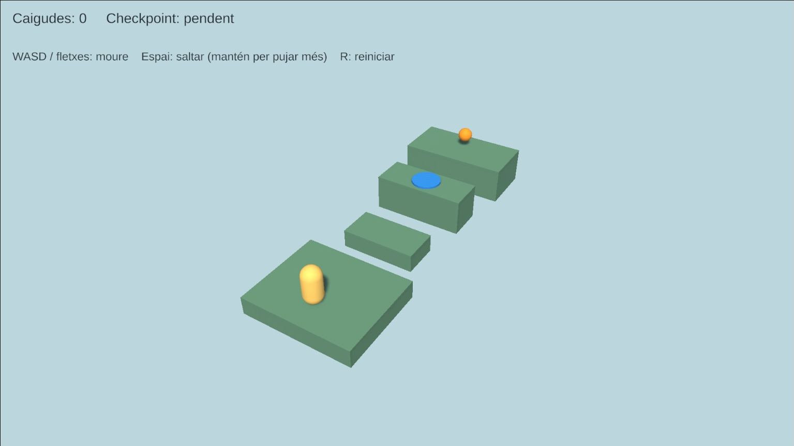
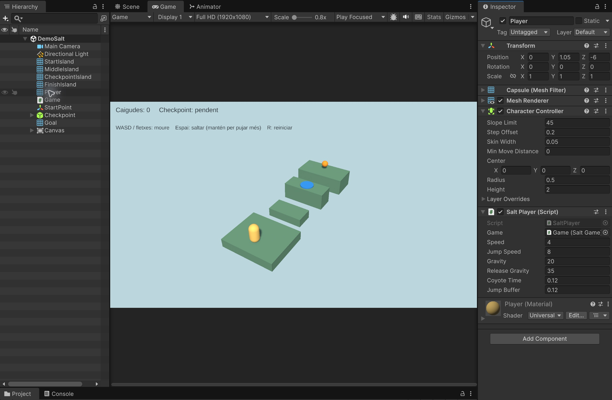
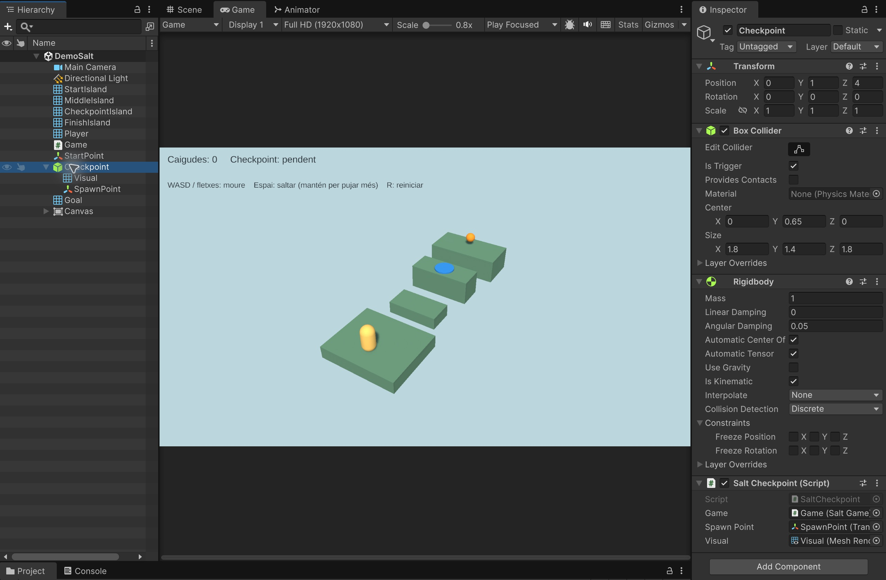
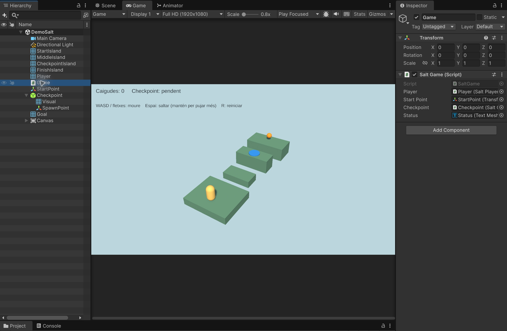
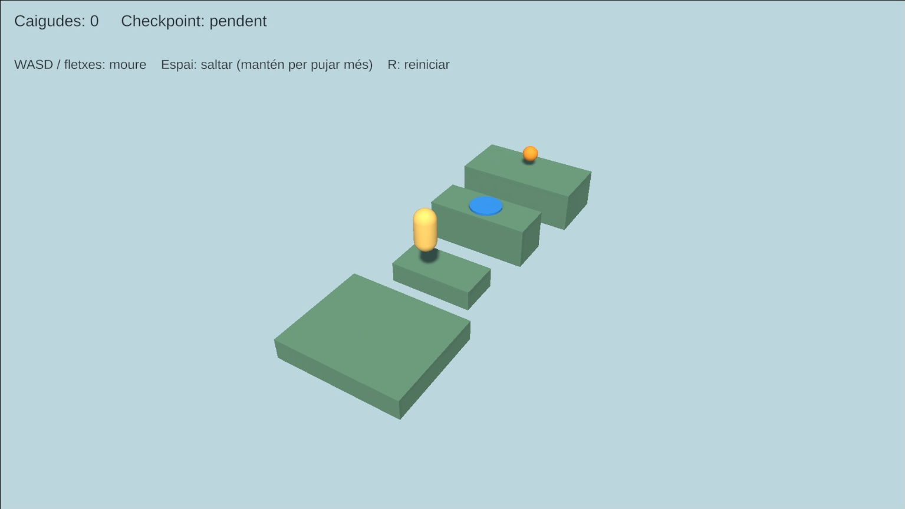
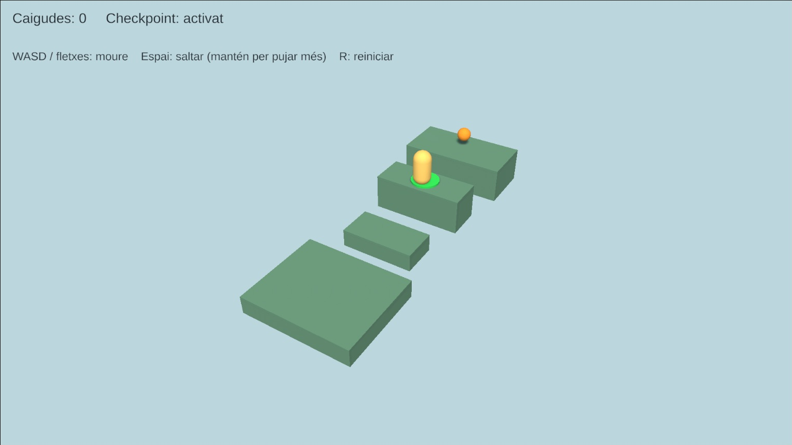
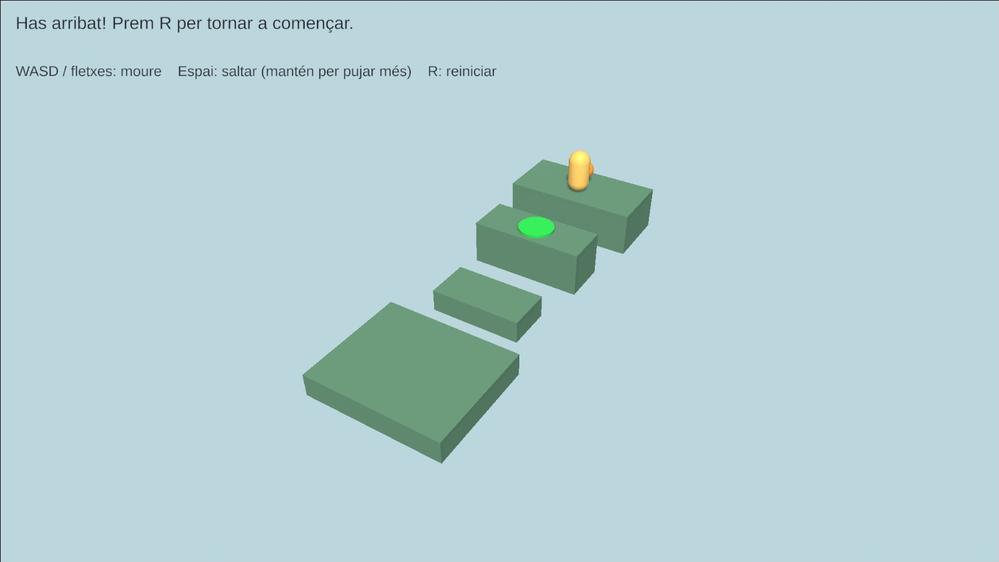

# Demo Salt: salts variables i checkpoints

Construirem un diorama amb una **càpsula**, quatre illes de cubs, un checkpoint blau i una esfera taronja com a meta. Cal saltar entre illes sense caure. La tercera illa és més alta i guarda el progrés.

**Comencem des de zero:** no cal continuar cap altra demo ni importar-ne scripts. Practicarem gravetat, detecció de terra, salt variable, tolerància al salt i reaparició.

- **WASD o fletxes:** moure pels eixos X/Z del món. W avança cap a la meta; la càmera es veu una mica de costat.
- **Espai:** saltar. Mantén-lo per pujar més; deixa’l anar aviat per fer un salt curt.
- **R:** reiniciar tot el repte, inclòs el checkpoint i el comptador de caigudes.
- Si caus, reapareixes al principi o al checkpoint activat.



**Projecte acabat:** [Demo-8-Salt.zip](demos/Demo-8-Salt.zip). [Com obrir-lo](demos/README.md).

## 1. Preparar un projecte buit

1. Crea un projecte **Universal 3D (URP)**. Versió utilitzada: **Unity 6.6, 6000.6.3f1**.
2. A **Window > Package Manager**, comprova que hi ha **Input System** instal·lat.
3. A **Edit > Project Settings > Player > Other Settings**, posa **Active Input Handling = Input System Package (New)** o **Both**. Reinicia l’editor si ho demana.
4. Crea una escena Basic i desa-la a **Assets/Scenes/DemoSalt.unity**. Conserva Main Camera i Directional Light. Si l’escena és completament buida, crea’ls des de GameObject i assigna el tag MainCamera a la càmera.
5. Crea **Assets/DemoSalt**, amb les carpetes **Scripts** i **Materials**.
6. Importa **Window > TextMeshPro > Import TMP Essential Resources**. No cal importar Examples & Extras.
7. Crea els **quatre scripts complets de l’apartat 8** a Scripts. Els noms dels fitxers i de les classes han de coincidir. Espera que hi siguin tots i acabin de compilar.

No facis Play fins a completar les referències de l’apartat 6. No necessitem PlayerInput, Animator ni scripts de les altres demos.

## 2. Construir les quatre illes

Crea aquests materials amb Shader **Universal Render Pipeline/Lit**, Surface Type **Opaque**, Metallic `0`, Smoothness `0.15` i alfa `1`:

| Material | Color hexadecimal |
|---|---|
| Platform | `#6B9C8C` |
| Player | `#FFDB80` |
| Checkpoint | `#3399FF` |
| Goal | `#FFAA33` |

Crea quatre **Cube** a l’arrel de Hierarchy. Tots tenen Rotation `(0, 0, 0)`, material Platform i **Box Collider amb Is Trigger desactivat**. No hi posis Rigidbody.

| Objecte | Position | Scale | Alçada de la superfície |
|---|---|---|---|
| StartIsland | `(0, -0.5, -5)` | `(6, 1, 5)` | Y = 0 |
| MiddleIsland | `(0, -0.5, 0)` | `(4, 1, 2)` | Y = 0 |
| CheckpointIsland | `(0, 0, 4)` | `(5, 2, 2)` | Y = 1 |
| FinishIsland | `(0, 0, 8.5)` | `(6, 2, 3)` | Y = 1 |

**No afegeixis un terra sota les illes:** els espais buits han de permetre caure. Els buits fan 1.5, 2 i 2 unitats. La plataforma del checkpoint queda una unitat més alta; per arribar-hi cal mantenir Espai i saltar a prop de la vora.

Configura Main Camera:

| Camp | Valor |
|---|---|
| Position | `(13, 18, -20)` |
| Rotation | `(36.0845, 328.2405, 0.0000)` |
| Projection | Perspective |
| Field of View | `42` |
| Clipping Planes | Near `0.1`, Far `100` |
| Background Type | Solid Color |
| Background | `#C4DBE0` |

La càmera mira aproximadament al punt `(0, 0, 1)`. No segueix el jugador: es veu tot el recorregut.

Al Directional Light, posa Rotation `(50, -30, 0)` i Intensity `1.3`. A **Window > Rendering > Lighting > Environment**, posa il·luminació ambiental de tipus Color, gris `#8C8C8C`.

A la vista Game, selecciona **16:9**, per exemple Full HD (1920×1080).

## 3. Crear el jugador i el punt inicial

1. Crea una **Capsule** anomenada **Player** a Position `(0, 1.05, -6)`, Rotation zero i Scale `(1, 1, 1)`.
2. Assigna el material Player.
3. **Elimina Capsule Collider** i afegeix **CharacterController**. No hi posis Rigidbody.
4. Configura’l amb la taula següent i afegeix **SaltPlayer**.
5. Crea un objecte buit **StartPoint** a l’arrel, amb Position `(0, 1.05, -6)`, Rotation zero i Scale 1. És una marca de reaparició; no necessita collider ni script.

| CharacterController | Valor |
|---|---|
| Center | `(0, 0, 0)` |
| Height | `2` |
| Radius | `0.5` |
| Skin Width | `0.05` |
| Step Offset | `0.2` |
| Slope Limit | `45` |
| Min Move Distance | `0` |

| SaltPlayer | Valor |
|---|---|
| Speed | `4` |
| Jump Speed | `8` |
| Gravity | `20` |
| Release Gravity | `35` |
| Coyote Time | `0.12` |
| Jump Buffer | `0.12` |

Deixa Game pendent fins a l’apartat 6. Gravity i Release Gravity són **magnituds positives**: el codi les resta de la velocitat vertical.



## 4. Crear el checkpoint

1. Crea un objecte buit **Checkpoint** a Position `(0, 1, 4)`, Rotation zero i Scale 1. Queda a la superfície de la tercera illa.
2. Afegeix **Box Collider**, amb **Is Trigger activat**, Center `(0, 0.65, 0)` i Size `(1.8, 1.4, 1.8)`.
3. Afegeix **Rigidbody**, amb **Use Gravity desactivat** i **Is Kinematic activat**. Aquest Rigidbody permet la detecció del trigger sense que el checkpoint caigui.
4. Dins de Checkpoint, crea un **Cylinder** fill anomenat **Visual**. Posa **Local Position `(0, 0.06, 0)`**, Local Rotation zero i **Local Scale `(1.6, 0.06, 1.6)`**. Assigna el material Checkpoint i **elimina el Capsule Collider del cilindre**.
5. Crea un altre fill buit, **SpawnPoint**, amb **Local Position `(0, 1.05, 0)`**, Local Rotation zero i Scale 1. La posició del món serà `(0, 2.05, 4)`.
6. Afegeix **SaltCheckpoint** al pare Checkpoint. Assigna **SpawnPoint** a Spawn Point i el **Mesh Renderer de Visual** a Visual. Game queda pendent.

El cilindre és només un indicador: no ha de sostenir ni bloquejar el jugador. El trigger és al pare i la plataforma sòlida sosté la càpsula. Quan entrem al trigger, l’indicador es torna verd i es guarda SpawnPoint com a lloc de reaparició.



## 5. Crear la meta

1. Crea una **Sphere** anomenada **Goal**, a Position `(0, 1.8, 8.7)`, Rotation zero i Scale `(0.8, 0.8, 0.8)`.
2. Assigna el material Goal.
3. Conserva Sphere Collider amb Center zero, Radius `0.5` i **Is Trigger activat**.
4. Afegeix Rigidbody amb **Use Gravity desactivat** i **Is Kinematic activat**.
5. Afegeix **SaltGoal**. Assignarem Game a continuació.

En tocar l’esfera s’acaba el repte i es bloqueja el moviment. No cal recollir-la ni destruir-la. R permet tornar a començar.

## 6. Afegir el text i connectar les referències

1. Crea **GameObject > UI > Canvas**, en **Screen Space - Overlay**.
2. Al Canvas Scaler, posa **Scale With Screen Size**, Reference Resolution `(1600, 900)` i Match `0.5`.
3. Dins de Canvas, crea **UI > Text - TextMeshPro**, anomenat **Status**. Font LiberationSans SDF, Font Size `28`, color `#14262E`, alineació superior esquerra, Auto Size desactivat i Raycast Target desactivat.
4. Al RectTransform, posa **Anchor Min = Anchor Max = `(0, 1)`**, Pivot `(0, 1)`, Pos X `24`, Pos Y `-20`, Width `1500` i Height `75`.
5. Text inicial: `Caigudes: 0     Checkpoint: pendent`.
6. Duplica Status com a **Controls**. Posa Pos Y `-100`, Font Size `23` i text `WASD / fletxes: moure    Espai: saltar (mantén per pujar més)    R: reiniciar`.
7. Crea un objecte buit **Game** a l’arrel i afegeix **SaltGame**.
8. Assigna totes aquestes referències:

| Component | Camp | Objecte que cal arrossegar |
|---|---|---|
| Player > SaltPlayer | Game | Game |
| Checkpoint > SaltCheckpoint | Game | Game |
| Goal > SaltGoal | Game | Game |
| Game > SaltGame | Player | Player |
| Game > SaltGame | Start Point | StartPoint |
| Game > SaltGame | Checkpoint | Checkpoint |
| Game > SaltGame | Status | Status |

Controls només mostra les instruccions: no s’assigna a cap script. Deixa tots els objectes a la capa Default; no cal crear cap tag ni canviar la matriu de col·lisions.



## 7. Com funciona el salt

### Velocitat vertical i terra

`CharacterController.Move` mou la càpsula i detecta col·lisions, però **no aplica gravetat automàticament**. Guardem una velocitat vertical i cada fotograma hi restem `gravity * Time.deltaTime`.

En saltar, la velocitat vertical passa a `8`. Mentre és positiva pugem; quan es torna negativa baixem. Després movem el personatge amb la velocitat multiplicada per deltaTime.

`isGrounded` indica si l’últim Move ha detectat terra. Només el considerem suport quan la velocitat vertical no és positiva. A terra mantenim una petita velocitat negativa (`-2`) per conservar el contacte. Si toquem un sostre, aturem la pujada amb `CollisionFlags.Above`.

### Salt curt o llarg

Mentre pugem amb Espai mantingut, la gravetat és `20`. Si el deixem anar durant la pujada, passa a `35`: perdem velocitat abans i arribem menys amunt. En baixar tornem a utilitzar `20`.

Amb Espai mantingut, l’alçada teòrica és aproximadament `8² / (2 × 20) = 1.6` unitats sobre el punt de sortida. La integració per fotogrames fa que el valor real sigui una mica menor. El segon salt puja una unitat i requereix un salt llarg.



### Tolerància després de sortir de la vora: coyote time

Guardem l’últim instant en què tocàvem terra. Acceptem el salt fins a **0.12 segons** després d’abandonar la vora. Això fa més còmode un salt premut una mica tard.

Quan saltem, consumim aquesta possibilitat. No serveix per fer un segon salt a l’aire.

### Recordar una pulsació abans d’aterrar: jump buffer

Guardem també l’instant de l’última pulsació d’Espai. Si aterrem abans que passin **0.12 segons**, el salt pendent s’executa en el següent Update que reconeix el terra.

La pulsació es consumeix en saltar. **Mantenir Espai no provoca salts automàtics en aterrar:** cal una nova pulsació. Si l’hem premut massa aviat, el buffer caduca.

### Caure i reaparèixer

Quan el centre de la càpsula baixa de **Y = -5**, sumem una caiguda i la traslladem al punt guardat. Desactivem breument el CharacterController per canviar la posició, el reactivem i esborrem la velocitat vertical i els temps de salt.

R reinicia tota la demo; caure conserva el checkpoint. En aquesta demo només hi ha un checkpoint.



## 8. Scripts complets

Copia cada bloc al fitxer indicat dins d’Assets/DemoSalt/Scripts. Són tots els scripts necessaris.

### SaltPlayer.cs

```csharp
using UnityEngine;
using UnityEngine.InputSystem;

[RequireComponent(typeof(CharacterController))]
public class SaltPlayer : MonoBehaviour
{
    public SaltGame game;
    public float speed = 4;
    public float jumpSpeed = 8;
    public float gravity = 20;
    public float releaseGravity = 35;
    public float coyoteTime = 0.12f;
    public float jumpBuffer = 0.12f;
    CharacterController controller;
    float verticalSpeed;
    float lastGrounded = float.NegativeInfinity;
    float lastJumpPressed = float.NegativeInfinity;

    void Awake() => controller = GetComponent<CharacterController>();

    void Update()
    {
        if (game.Won) return;
        var keyboard = Keyboard.current;
        Vector2 input = Vector2.zero;
        bool jumpHeld = false;
        if (keyboard != null)
        {
            if (keyboard.wKey.isPressed || keyboard.upArrowKey.isPressed) input.y++;
            if (keyboard.sKey.isPressed || keyboard.downArrowKey.isPressed) input.y--;
            if (keyboard.aKey.isPressed || keyboard.leftArrowKey.isPressed) input.x--;
            if (keyboard.dKey.isPressed || keyboard.rightArrowKey.isPressed) input.x++;
            jumpHeld = keyboard.spaceKey.isPressed;
            if (keyboard.spaceKey.wasPressedThisFrame) lastJumpPressed = Time.time;
        }
        input = Vector2.ClampMagnitude(input, 1);
        bool grounded = controller.isGrounded && verticalSpeed <= 0;
        if (grounded)
        {
            lastGrounded = Time.time;
            verticalSpeed = -2;
        }
        if (Time.time - lastJumpPressed <= jumpBuffer && Time.time - lastGrounded <= coyoteTime)
        {
            verticalSpeed = jumpSpeed;
            lastJumpPressed = lastGrounded = float.NegativeInfinity;
        }
        float acceleration = verticalSpeed > 0 && !jumpHeld ? releaseGravity : gravity;
        verticalSpeed -= acceleration * Time.deltaTime;
        Vector3 movement = new Vector3(input.x * speed, verticalSpeed, input.y * speed);
        CollisionFlags flags = controller.Move(movement * Time.deltaTime);
        if ((flags & CollisionFlags.Above) != 0 && verticalSpeed > 0) verticalSpeed = 0;
        if (input.sqrMagnitude > 0.01f)
            transform.rotation = Quaternion.LookRotation(new Vector3(input.x, 0, input.y));
        if (transform.position.y < -5) game.Fall();
    }

    public void Teleport(Vector3 position)
    {
        controller.enabled = false;
        transform.SetPositionAndRotation(position, Quaternion.identity);
        controller.enabled = true;
        verticalSpeed = 0;
        lastGrounded = lastJumpPressed = float.NegativeInfinity;
        Physics.SyncTransforms();
    }
}
```

### SaltCheckpoint.cs

```csharp
using UnityEngine;

public class SaltCheckpoint : MonoBehaviour
{
    public SaltGame game;
    public Transform spawnPoint;
    public Renderer visual;
    Material material;

    void Awake() => material = visual.material;

    void OnTriggerEnter(Collider other)
    {
        if (other.GetComponent<SaltPlayer>() == game.player && !game.Won)
            game.ActivateCheckpoint(this);
    }

    public void SetActiveColor(bool active)
    {
        material.SetColor("_BaseColor", active ? new Color(0.2f, 0.9f, 0.4f) : new Color(0.2f, 0.6f, 1));
    }

    void OnDestroy()
    {
        if (material != null) Destroy(material);
    }
}
```

### SaltGoal.cs

```csharp
using UnityEngine;

public class SaltGoal : MonoBehaviour
{
    public SaltGame game;

    void OnTriggerEnter(Collider other)
    {
        if (other.GetComponent<SaltPlayer>() == game.player) game.Finish();
    }
}
```

### SaltGame.cs

```csharp
using TMPro;
using UnityEngine;
using UnityEngine.InputSystem;

public class SaltGame : MonoBehaviour
{
    public SaltPlayer player;
    public Transform startPoint;
    public SaltCheckpoint checkpoint;
    public TMP_Text status;
    public bool Won { get; private set; }
    public bool HasCheckpoint { get; private set; }
    public int Falls { get; private set; }
    Vector3 respawnPosition;

    void Start() => Restart();

    void Update()
    {
        if (Keyboard.current != null && Keyboard.current.rKey.wasPressedThisFrame) Restart();
        status.text = Won ? "Has arribat! Prem R per tornar a començar." :
            "Caigudes: " + Falls + "     Checkpoint: " + (HasCheckpoint ? "activat" : "pendent");
    }

    public void ActivateCheckpoint(SaltCheckpoint point)
    {
        if (Won || HasCheckpoint) return;
        HasCheckpoint = true;
        respawnPosition = point.spawnPoint.position;
        point.SetActiveColor(true);
    }

    public void Fall()
    {
        if (Won) return;
        Falls++;
        player.Teleport(respawnPosition);
    }

    public void Finish() => Won = true;

    public void Restart()
    {
        Won = false;
        HasCheckpoint = false;
        Falls = 0;
        respawnPosition = startPoint.position;
        checkpoint.SetActiveColor(false);
        player.Teleport(respawnPosition);
    }
}
```

## 9. Seguir i comprovar el recorregut

Desa l’escena, prem **Play** i clica **Game**. La pausa ha d’estar desactivada.

1. A la primera illa, compara un toc curt d’Espai amb mantenir-lo. El salt mantingut ha d’arribar més amunt. Mantén-lo fins a aterrar: no ha de tornar a saltar sol.
2. Avança amb W fins a prop de la vora de StartIsland i prem Espai mentre continues avançant. Aterra a MiddleIsland i deixa anar W per no passar-te de llarg.
3. A MiddleIsland, acosta’t a la vora que mira cap a la meta. Prem W + Espai i **mantén Espai** per pujar a CheckpointIsland. El marge és més ajustat perquè és més alta.
4. Passa pel cilindre blau. Es torna verd i el text diu **Checkpoint: activat**.
5. Surt lateralment d’aquesta illa sense saltar i deixa’t caure. Has de reaparèixer al checkpoint; el comptador puja una unitat.
6. Salta fins a FinishIsland i toca l’esfera: apareix **Has arribat!** i el personatge s’atura.
7. Prem R: torna al principi, el checkpoint recupera el blau i les caigudes tornen a zero.



### Proves de les dues toleràncies

- **Coyote time:** camina fora d’una vora i prem Espai immediatament després. Durant les primeres 0.12 s encara ha de saltar; més tard ha de continuar caient.
- **Jump buffer:** prem Espai just abans d’aterrar. Ha de tornar a saltar en tocar terra. Si el prems molt abans i el deixes anar, no ha de saltar en aterrar.
- **Sense doble salt:** salta, deixa anar Espai i torna’l a prémer a mitja pujada. No ha d’aplicar un segon impuls.

### Si alguna cosa falla

- **La càpsula no salta:** comprova el focus a Game, Input System i que Jump Speed sigui 8. No afegeixis Rigidbody al jugador.
- **Flota o té col·lisions estranyes:** escala 1, CharacterController amb Center zero, Height 2 i cap Capsule Collider addicional.
- **No arriba a la tercera illa:** comprova totes les posicions i escales. Salta a prop de la vora, mantén W i Espai. Gravity és 20, no 35: 35 és només Release Gravity.
- **No cau entre illes:** elimina qualsevol terra o Plane addicional i comprova que els cubs tenen les dimensions indicades.
- **El checkpoint no s’activa:** revisa Is Trigger, Rigidbody cinemàtic i les referències Game, Spawn Point i Visual. El collider de Visual s’ha d’eliminar.
- **Reapareix dins de la plataforma:** SpawnPoint és fill de Checkpoint amb Local Y = 1.05; la seva Y del món ha de ser 2.05.
- **R no funciona després de guanyar:** SaltGame ha de continuar actiu; només SaltPlayer bloqueja el moviment quan Won és cert.
- **Errors de referències:** revisa les taules dels apartats 4 i 6 i el camp Game de Goal.

Atura Play abans de modificar permanentment l’escena. Per ajustar la dificultat, canvia primer les distàncies entre illes; mantén les toleràncies petites perquè ajudin sense substituir la necessitat de saltar.
