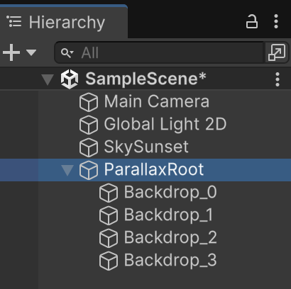

# Parallax

## Estructura

- Navega als assets:

*"Assets > Unity Technologies > EndlessRunner > Art"*

- Arrosega **"SkySunset"** a la *"Hierarchy"* i posa els paràmetres:

    - Position X: 0
    - Position Y: 0
    - Additional Settings > Order in Layer: -5

- A la *"Hierarchy"* crea un objecte buit amb *"Create Empty"* i anomena'l **"ParallaxRoot"**

- Desplega "Backdrop", arrossega les 4 imatges dins de l'objecte **"ParallaxRoot"**, per cada una:

    - Position X: 0
    - Position Y: 0

<center>

</center>
<br/>

## Script

A la carpeta *"Scripts"* crea un nou script tipus *"MonoBehaviour"*, anomenat **"ParallaxRoot"**.

```csharp
using System;
using System.Collections.Generic;
using UnityEngine;

public class ParallaxRootParallaxManager : MonoBehaviour
{
    [Header("References")]
    public Camera cam;

    [Header("Global")]
    public float globalSpeedMultiplier = 1f;
    public string overrideSortingLayerName = ""; // opcional

    [Header("Layer Rules (per NOM exacte del fill de ParallaxRoot)")]
    private List<LayerRule> layerRules = new()
    { 
        new LayerRule{ name="Backdrop_0", order=-3,  parallax=0.10f },
        new LayerRule{ name="Backdrop_1", order=-2,  parallax=0.30f },
        new LayerRule{ name="Backdrop_2", order=-1,  parallax=0.60f },
        new LayerRule{ name="Backdrop_3", order=10,  parallax=1.20f },
    };

    [Header("Auto mode (si no hi ha rule)")]
    public bool autoOrderFromSiblingIndex = true;
    public float minParallax = 0.10f;
    public float maxParallax = 1.20f;

    [Header("Debug")]
    public bool verboseLogs = true;

    // --- Interns ---
    private readonly List<LayerState> layers = new();

    [Serializable]
    public class LayerRule
    {
        public string name;
        public int order = 0;
        public float parallax = 0.3f;
    }

    private class LayerState
    {
        public Transform root;                 // el GameObject "capa" (fill directe del Root)
        public Transform visual;               // el transform del SpriteRenderer principal dins la capa
        public SpriteRenderer visualSR;
        public SpriteRenderer[] allSRsInLayer; // tots els SRs de la capa (per aplicar-hi order)
        public Transform[] tiles;              // [0]=L, [1]=C(visual), [2]=R
        public float tileWorldWidth;
        public float parallax;
        public float anchorX;
        public float startCamX;
    }

    void Start()
    {
        if (!cam) cam = Camera.main;

        var rulesByName = new Dictionary<string, LayerRule>(StringComparer.Ordinal);
        foreach (var r in layerRules)
            if (!string.IsNullOrEmpty(r.name)) rulesByName[r.name] = r;

        // Recorre fills directes del Root
        for (int i = 0; i < transform.childCount; i++)
        {
            var child = transform.GetChild(i);

            // Troba un SpriteRenderer dins de la capa (nét inclòs)
            var srs = child.GetComponentsInChildren<SpriteRenderer>(includeInactive: true);
            if (srs == null || srs.Length == 0) continue; // aquesta capa no és visual

            // Agafa el primer com a "visual" (si vols, pots escollir-ne un pel nom)
            var visualSR = srs[0];
            var visualTf = visualSR.transform;

            var state = new LayerState
            {
                root = child,
                visual = visualTf,
                visualSR = visualSR,
                allSRsInLayer = srs,
                tiles = new Transform[3]
            };

            // Sorting Layer opcional
            if (!string.IsNullOrEmpty(overrideSortingLayerName))
            {
                int layerId = SortingLayer.NameToID(overrideSortingLayerName);
                if (layerId != 0 || overrideSortingLayerName == "Default")
                {
                    foreach (var sr in srs) sr.sortingLayerID = layerId;
                }
                else
                {
                    Debug.LogWarning($"[ParallaxRoot] Sorting Layer \"{overrideSortingLayerName}\" no existeix.");
                }
            }

            // Assigna ordre + parallax segons Rule o Auto
            if (rulesByName.TryGetValue(child.name, out var rule))
            {
                ApplySortingOrderToAll(state, rule.order);
                state.parallax = rule.parallax;
                if (verboseLogs) Debug.Log($"[ParallaxRoot] Rule {child.name}: order={rule.order}, parallax={rule.parallax}");
            }
            else
            {
                if (autoOrderFromSiblingIndex)
                {
                    int idx = child.GetSiblingIndex();
                    int total = transform.childCount;
                    int order = idx; // 0 darrere … n davant (inverteix si vols)
                    ApplySortingOrderToAll(state, order);

                    float t = (total > 1) ? (float)idx / (total - 1) : 0f;
                    state.parallax = Mathf.Lerp(minParallax, maxParallax, t);

                    if (verboseLogs) Debug.Log($"[ParallaxRoot][AUTO] {child.name}: idx={idx}/{total} → order={order}, parallax={state.parallax:0.00}");
                }
                else
                {
                    ApplySortingOrderToAll(state, 0);
                    state.parallax = (minParallax + maxParallax) * 0.5f;
                    if (verboseLogs) Debug.Log($"[ParallaxRoot][AUTO-Fallback] {child.name}: order=0, parallax={state.parallax:0.00}");
                }
            }

            // Amplada del tile segons el visual
            state.tileWorldWidth = state.visualSR.bounds.size.x;
            if (state.tileWorldWidth <= 0f)
            {
                // Si ha passat alguna cosa rara, prova amb sprite.bounds * escala
                var sp = state.visualSR.sprite;
                if (sp != null)
                {
                    float ppu = sp.pixelsPerUnit > 0 ? sp.pixelsPerUnit : 100f;
                    state.tileWorldWidth = (sp.rect.width / ppu) * state.visual.lossyScale.x;
                }
            }

            // Crea L/C/R: el centre és el "visual" (no el root)
            state.tiles[1] = state.visual;
            state.tiles[0] = CreateTileClone(state, -1);
            state.tiles[2] = CreateTileClone(state, +1);

            // Ancoratge i càmera
            state.anchorX = state.visual.position.x;
            state.startCamX = cam ? cam.transform.position.x : 0f;

            layers.Add(state);
        }
    }

    void LateUpdate()
    {
        if (!cam) return;

        foreach (var L in layers)
        {
            float camDeltaX = cam.transform.position.x - L.startCamX;
            float targetX = L.anchorX + camDeltaX * L.parallax * globalSpeedMultiplier;

            // Mou la CAPA sencera (root) per no desquadrar altres elements de la capa
            var pos = L.root.position;
            float dx = targetX - L.visual.position.x; // desajust entre on volem el visual i on és
            pos.x += dx;
            L.root.position = pos;

            RecenterTilesIfNeeded(L);
        }
    }

    // --- Helpers ---

    private void ApplySortingOrderToAll(LayerState state, int order)
    {
        foreach (var sr in state.allSRsInLayer)
            sr.sortingOrder = order;
    }

    private Transform CreateTileClone(LayerState L, int offsetIndex)
    {
        // Clonem només el "visual" (no tota la capa),
        // i el pengem com a fill de la CAPA (root) per moure-ho tot junt.
        var go = new GameObject(L.root.name + (offsetIndex < 0 ? "_L" : "_R"));
        go.transform.SetParent(L.root, worldPositionStays: true);

        var sr = go.AddComponent<SpriteRenderer>();
        sr.sprite = L.visualSR.sprite;
        sr.flipX = L.visualSR.flipX;
        sr.flipY = L.visualSR.flipY;
        sr.drawMode = L.visualSR.drawMode;
        sr.sharedMaterial = L.visualSR.sharedMaterial;
        sr.color = L.visualSR.color;
        sr.sortingLayerID = L.visualSR.sortingLayerID;
        sr.sortingOrder = L.visualSR.sortingOrder;

        // Col·loca el clon al costat del visual
        go.transform.position = L.visual.position + new Vector3(L.tileWorldWidth * offsetIndex, 0f, 0f);
        go.transform.rotation = L.visual.rotation;
        go.transform.localScale = L.visual.lossyScale; // mantenim escala aparent

        if (verboseLogs) Debug.Log($"[ParallaxRoot] + Tile {(offsetIndex<0?"L":"R")} per {L.root.name}");

        return go.transform;
    }

    private void RecenterTilesIfNeeded(LayerState L)
    {
        float camX = cam.transform.position.x;
        // L.tiles: [0]=L, [1]=C(visual), [2]=R

        // cap a la dreta
        while (camX - L.tiles[1].position.x > L.tileWorldWidth * 0.5f)
        {
            L.tiles[0].position = L.tiles[2].position + new Vector3(L.tileWorldWidth, 0f, 0f);
            var tmp = L.tiles[0]; L.tiles[0] = L.tiles[1]; L.tiles[1] = L.tiles[2]; L.tiles[2] = tmp;
        }

        // cap a l'esquerra
        while (L.tiles[1].position.x - camX > L.tileWorldWidth * 0.5f)
        {
            L.tiles[2].position = L.tiles[0].position - new Vector3(L.tileWorldWidth, 0f, 0f);
            var tmp = L.tiles[2]; L.tiles[2] = L.tiles[1]; L.tiles[1] = L.tiles[0]; L.tiles[0] = tmp;
        }
    }
}
```

Afegeix l'script anterior com a component de l'objecte **"ParallaxRoot"**

Arrosega la càmera a la configuració *"References > Cam"* de l'script *"ParallaxRoot"*

TODO: Imatge arrossegant cinemachine !!