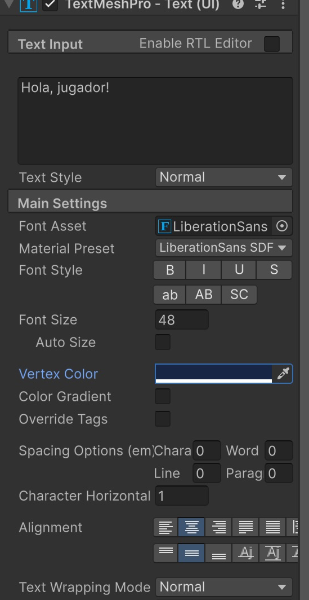
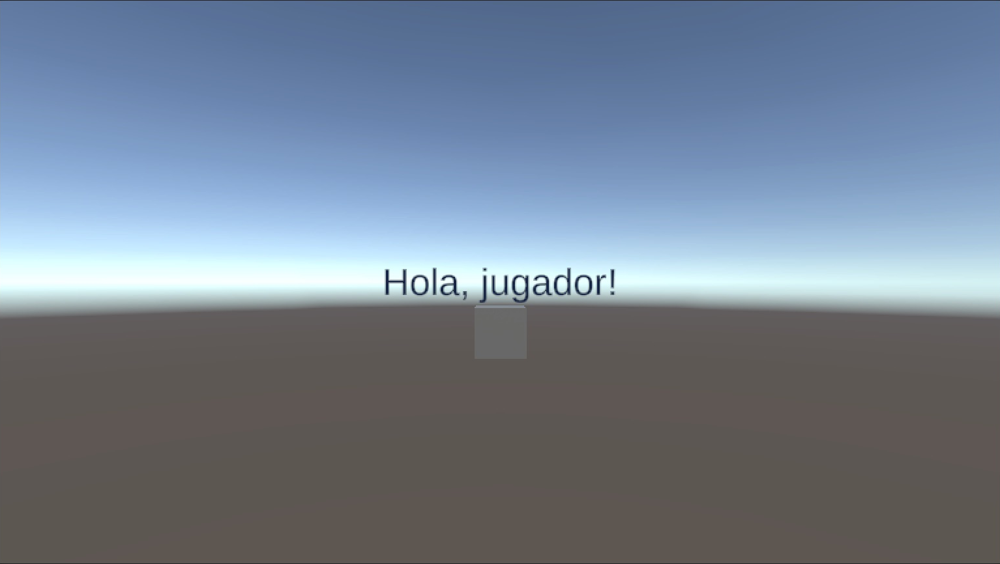

# Canvas: informació sobre la pantalla

**HUD** són les sigles de **Head-Up Display**, que podem traduir com a «pantalla de visualització amb el cap alçat». La idea és poder consultar informació sense apartar la mirada de l'acció.

En un videojoc, el **HUD** és el conjunt d'elements que mostren informació mentre jugues: la vida que et queda, les monedes recollides, el temps o les instruccions. Per exemple, un comptador de vida en una cantonada forma part del HUD.

En aquest tutorial farem un text que es manté a la pantalla encara que canviï la vista del món 3D.

Un **Canvas** és el contenidor de la interfície. Imagina una làmina transparent sobre el joc, on podem posar lletres i imatges.

## Projecte i escena

Aquest tutorial és **independent**: no necessita cap escena dels altres apartats. No escriurem scripts.

1. Obre **Unity Hub**. Si encara no tens projecte, fes **New project**, escull **Universal 3D**, anomena'l **HUD** i fes **Create project**. Si ja tens un projecte Universal 3D, el pots utilitzar.
2. A l'editor, fes **File > New Scene**, escull **Basic (URP)** i fes **Create**. Si Unity pregunta per l'escena anterior, desa-la abans de continuar.
3. Fes **File > Save As** i desa la nova escena dins d'**Assets** amb el nom **HUD-Canvas**.
4. Mantén la **Main Camera** i la llum que incorpora l'escena. Si també hi ha un **Global Volume**, deixa'l tal com està.

**On treballarem:** **Hierarchy** és la llista d'objectes de l'escena; **Inspector** mostra les propietats de l'objecte seleccionat; **Scene** serveix per editar i **Game** mostra el que veuria el jugador. **Project** mostra els fitxers del projecte, no els objectes de l'escena.

Les captures són de **Unity 6.6**. En aquesta versió, el menú es diu **GameObject > UI (Canvas)**; en versions anteriors pot dir-se **GameObject > UI**. En aquest tutorial utilitzem aquesta família de components, anomenada **uGUI**.

> Fes els canvis amb **Play desactivat**. Els canvis que facis mentre el joc està en marxa habitualment es perden en aturar-lo. Desa l'escena amb **Ctrl+S** a Windows o **Cmd+S** a macOS.

## Un objecte per veure el món 3D

1. Fes **GameObject > 3D Object > Cube**.
2. Anomena'l **Caixa**: selecciona'l a Hierarchy i canvia el nom al camp superior de l'Inspector.
3. Al seu **Transform**, posa **Position X = 0, Y = 0, Z = 0**, **Rotation X = 0, Y = 0, Z = 0** i **Scale X = 1, Y = 1, Z = 1**.
4. Selecciona **Main Camera**. Posa **Position X = 0, Y = 1, Z = -10** i **Rotation X = 0, Y = 0, Z = 0**.
5. Obre la pestanya **Game**. Hauries de veure una caixa davant del fons de l'escena.

**Position** vol dir posició. Aquí **X** mou cap als costats, **Y** amunt o avall i **Z** endavant o enrere. No cal calcular res: copia els valors a cada casella.

## Crear el Canvas

1. Fes **GameObject > UI (Canvas) > Canvas**.
2. Selecciona **Canvas** a **Hierarchy**.
3. Al component **Canvas** de l'Inspector, deixa **Render Mode = Screen Space - Overlay**. Això dibuixa la interfície sobre la pantalla del joc.
4. Al component **Canvas Scaler**, escull **UI Scale Mode = Scale With Screen Size**.
5. Posa **Reference Resolution X = 1280**, **Y = 720** i **Match = 0.5**. Treballarem com si la pantalla tingués 1280 punts d'amplada i 720 d'alçada; Unity adaptarà el conjunt a la finestra real.
6. Si Unity crea un **EventSystem**, conserva'l. És l'objecte que gestiona la interacció amb la UI. No és necessari per mostrar text, però sí per als botons que reben clics.

<center>

</center>
<br/>

## Afegir el primer text

1. Selecciona **Canvas** a Hierarchy.
2. Fes **GameObject > UI (Canvas) > Text - TextMeshPro**. No escullis el text del menú **3D Object**.
3. Anomena el nou objecte **Missatge**.

Si apareix **TMP Importer**, fes **Import TMP Essentials** i tanca la finestra quan acabi. Són els recursos bàsics de **TextMeshPro**, el sistema que dibuixa les lletres. No cal importar **Examples & Extras**. Si ja s'havien importat, la finestra no apareixerà.

4. Comprova que **Missatge** apareix una mica desplaçat a la dreta sota **Canvas**: això vol dir que és un **fill**, un objecte contingut dins del Canvas. Si no ho és, arrossega'l sobre Canvas a Hierarchy.
5. Al component **TextMeshPro - Text (UI)**, escriu **Hola, jugador!** al requadre **Text Input**.
6. Deixa **Auto Size desactivat**, posa **Font Size = 48** i **Vertex Color = blau fosc** (obre el selector de color, escriu `172B4D` a **Hexadecimal** i deixa **A = 255**).
7. A **Alignment**, escull el centre horitzontal i el mig vertical.
8. A **Rect Transform**, escull el preset **middle / center**, amb les tecles indicades a continuació.

El quadradet de la part superior esquerra de **Rect Transform** obre **Anchor Presets**. Les miniatures representen les cantonades, els costats i el centre del rectangle pare.

Per escollir un preset en aquests passos, mantén **Alt+Shift** a Windows o **Option+Shift** a macOS mentre hi fas clic. Així s'ajusten alhora l'ancoratge, el pivot i la posició inicial. Després introdueix els valors de la taula.

| Camp de Rect Transform | Valor |
|---|---|
| Pos X / Pos Y / Pos Z | `0 / 0 / 0` |
| Width | `600` |
| Height | `100` |
| Scale X / Y / Z | `1 / 1 / 1` |

**Width** és l'amplada del requadre on cap el text i **Height** n'és l'alçada. **Font Size** canvia la mida de les lletres. Són coses diferents: fer el requadre més ample no fa les lletres més grans.

<center>

</center>
<br/>

La jerarquia ha de contenir:

```text
Main Camera
Directional Light
Caixa
Canvas
    Missatge
EventSystem
```

## Comprovar que és una capa sobre el joc

1. Obre **Game**: el text ha d'aparèixer al centre de la pantalla.
2. Sense entrar a Play, selecciona **Main Camera** i canvia **Position X** de `0` a `2`.
3. Observa que la caixa canvia de lloc a la imatge, però el text continua centrat.
4. Torna **Position X** a `0` i desa l'escena.

<center>

</center>
<br/>

## Tres maneres de situar un Canvas

| Render Mode | On es col·loca la interfície? | Exemple |
|---|---|---|
| Screen Space - Overlay | Directament sobre la pantalla | Comptador de monedes |
| Screen Space - Camera | En un pla associat a una càmera assignada | UI renderitzada per una càmera concreta |
| World Space | En un lloc del món 3D | Cartell sobre una porta |

En aquest exercici deixa **Overlay**. El tutorial de UI al món explica **World Space** amb una escena pròpia. [Referència de Canvas](https://docs.unity3d.com/Packages/com.unity.ugui@2.0/manual/UICanvas.html).

## Si el text no es veu

- Comprova que és fill del Canvas i que tant Canvas com Missatge estan activats: casella al costat del nom a l'Inspector.
- Revisa **Render Mode**, la mida del requadre i el color del text. Al selector de color, **A** vol dir opacitat: amb zero és invisible.
- Si **Font Asset** és buit, comprova que s'han importat els recursos TMP i selecciona **LiberationSans SDF**.
- Fes la comprovació a **Game**. Allunyar o acostar la vista Scene no modifica la càmera del joc.
