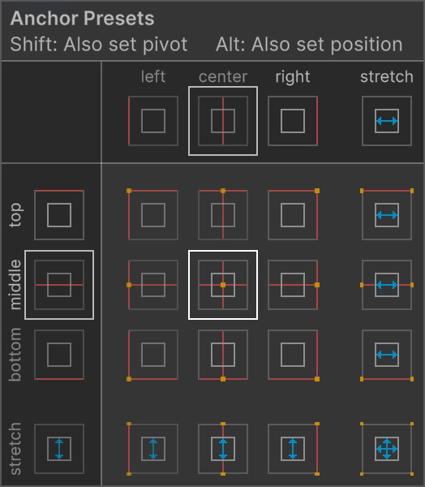
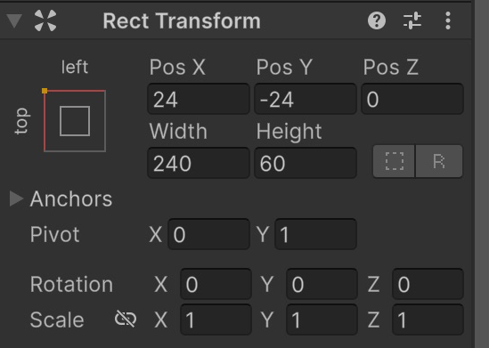
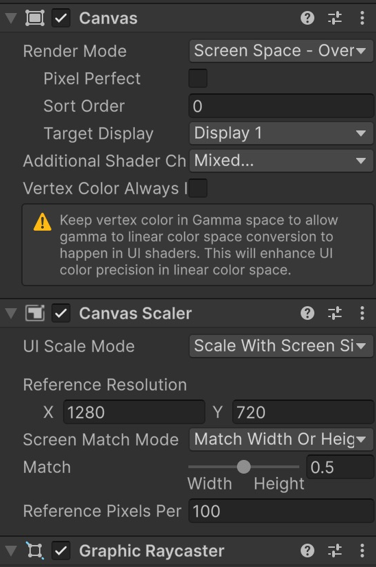

# Posició i mida de la interfície

Posarem un text a cada cantonada superior i comprovarem que continuen ben col·locats quan la finestra canvia de forma. Aprendrem què són el **rectangle**, l'**ancoratge** i el **pivot**, sense haver de fer càlculs.

## Projecte i escena

Aquest tutorial és **independent**: no necessita cap escena dels altres apartats. No escriurem scripts.

1. Obre **Unity Hub**. Si encara no tens projecte, fes **New project**, escull **Universal 3D**, anomena'l **HUD** i fes **Create project**. Si ja tens un projecte Universal 3D, el pots utilitzar.
2. A l'editor, fes **File > New Scene**, escull **Basic (URP)** i fes **Create**. Si Unity pregunta per l'escena anterior, desa-la abans de continuar.
3. Fes **File > Save As** i desa la nova escena dins d'**Assets** amb el nom **HUD-PosicioIMida**.
4. Mantén la **Main Camera** i la llum que incorpora l'escena. Si també hi ha un **Global Volume**, deixa'l tal com està.

**On treballarem:** **Hierarchy** és la llista d'objectes de l'escena; **Inspector** mostra les propietats de l'objecte seleccionat; **Scene** serveix per editar i **Game** mostra el que veuria el jugador. **Project** mostra els fitxers del projecte, no els objectes de l'escena.

Les captures són de **Unity 6.6**. En aquesta versió, el menú es diu **GameObject > UI (Canvas)**; en versions anteriors pot dir-se **GameObject > UI**. En aquest tutorial utilitzem aquesta família de components, anomenada **uGUI**.

> Fes els canvis amb **Play desactivat**. Els canvis que facis mentre el joc està en marxa habitualment es perden en aturar-lo. Desa l'escena amb **Ctrl+S** a Windows o **Cmd+S** a macOS.

## Crear el Canvas

1. Fes **GameObject > UI (Canvas) > Canvas**.
2. Selecciona **Canvas** a **Hierarchy**.
3. Al component **Canvas** de l'Inspector, deixa **Render Mode = Screen Space - Overlay**. Això dibuixa la interfície sobre la pantalla del joc.
4. Al component **Canvas Scaler**, escull **UI Scale Mode = Scale With Screen Size**.
5. Posa **Reference Resolution X = 1280**, **Y = 720** i **Match = 0.5**. Treballarem com si la pantalla tingués 1280 punts d'amplada i 720 d'alçada; Unity adaptarà el conjunt a la finestra real.
6. Si Unity crea un **EventSystem**, conserva'l. És l'objecte que gestiona la interacció amb la UI. No és necessari per mostrar text, però sí per als botons que reben clics.

## Crear un text de prova

1. Selecciona **Canvas** i fes **GameObject > UI (Canvas) > Text - TextMeshPro**.
2. Anomena'l **TextVida** i comprova que és fill de Canvas.

Si apareix **TMP Importer**, fes **Import TMP Essentials** i tanca la finestra quan acabi. Són els recursos bàsics de **TextMeshPro**, el sistema que dibuixa les lletres. No cal importar **Examples & Extras**. Si ja s'havien importat, la finestra no apareixerà.

3. Al component de text, escriu **Vida: 100**, posa **Font Size = 32**, **Auto Size desactivat**, color blau fosc (**Vertex Color > Hexadecimal = 172B4D**, **A = 255**) i **Alignment = esquerra i mig vertical**.

## Entendre Rect Transform

Cada element de la UI ocupa un **rectangle**, encara que només vegis unes lletres. Selecciona TextVida i busca **Rect Transform** a l'Inspector.

| Camp | Explicació |
|---|---|
| Width / Height | Amplada i alçada del rectangle |
| Pos X | Desplaçament horitzontal respecte de l'ancoratge: positiu cap a la dreta |
| Pos Y | Desplaçament vertical respecte de l'ancoratge: positiu cap amunt |
| Anchors | Lloc del pare al qual queda subjectat el rectangle |
| Pivot | Punt del mateix rectangle que fem servir per situar-lo |

**Ancoratge i pivot no són el mateix.** L'ancoratge indica «a quina part del contenidor em subjecto»; el pivot indica «quina part del meu rectangle poso en aquesta posició».

En aquests camps, `0` vol dir esquerra o baix, `0.5` vol dir mig i `1` vol dir dreta o dalt. Per exemple, pivot `(0, 1)` vol dir la cantonada superior esquerra del propi rectangle. Els presets ens permeten escollir-ho visualment.

## Situar la vida a dalt a l'esquerra

El quadradet de la part superior esquerra de **Rect Transform** obre **Anchor Presets**. Les miniatures representen les cantonades, els costats i el centre del rectangle pare.

Per escollir un preset en aquests passos, mantén **Alt+Shift** a Windows o **Option+Shift** a macOS mentre hi fas clic. Així s'ajusten alhora l'ancoratge, el pivot i la posició inicial. Després introdueix els valors de la taula.

1. Obre **Anchor Presets** de TextVida.
2. Amb **Alt+Shift / Option+Shift**, escull la miniatura **top / left**, a dalt a l'esquerra, sense estirar.
3. Introdueix aquests valors:

| Camp | Valor |
|---|---|
| Pos X | `24` |
| Pos Y | `-24` |
| Pos Z | `0` |
| Width / Height | `240 / 60` |
| Pivot X / Y | `0 / 1` |
| Scale X / Y / Z | `1 / 1 / 1` |

El text deixa un marge de **24** des de l'esquerra i des de dalt. Aquí Y és negatiu perquè baixem des de la vora superior cap a dins de la pantalla.

 

## Situar les monedes a dalt a la dreta

1. Selecciona **TextVida** i duplica'l amb **Ctrl+D / Cmd+D**.
2. Anomena la còpia **TextMonedes** i canvia el text a **Monedes: 0**.
3. Obre Anchor Presets i, amb les mateixes tecles, escull **top / right**, sense estirar.
4. Posa **Pos X = -24**, **Pos Y = -24**, **Width = 240** i **Height = 60**.
5. Comprova **Pivot X = 1, Y = 1** i alinea el text a la **dreta** i al **mig vertical**.

El marge X és negatiu perquè ens movem des de la vora dreta cap a dins de la pantalla.

 

## Adaptar-se a la mida de la pantalla

Selecciona **Canvas** i revisa **Canvas Scaler**:

- **Scale With Screen Size:** adapta la mida de tota la UI.
- **Reference Resolution = 1280 × 720:** és la pantalla de referència amb què dissenyem; no obliga el joc a executar-se a aquesta resolució.
- **Match = 0.5:** reparteix l'ajust entre amplada i alçada. No vol dir «la meitat de mida».

 

1. Obre la pestanya **Game**.
2. A la barra superior, obre el desplegable de proporcions, que pot indicar **Free Aspect** o **16:9**.
3. Prova **16:9** i després **4:3**. Si no hi són, utilitza **Free Aspect** i arrossega una vora del panell Game per fer-lo més ample o més estret.
4. Comprova que els textos continuen a les cantonades, amb marge i sense tallar-se.
5. Torna a la vista que prefereixis i desa l'escena.

**Proporció** vol dir la forma de la pantalla: `16:9` és més allargada que `4:3`. Els anchors mantenen la posició relativa i el Canvas Scaler adapta la mida. [Guia de Unity sobre resolucions](https://docs.unity3d.com/Packages/com.unity.ugui@2.0/manual/HOWTO-UIMultiResolution.html).

## Què vol dir Stretch?

Els presets **Stretch** fan que el rectangle s'estiri amb el pare. En aquests casos, poden aparèixer **Left, Right, Top i Bottom** en lloc de Width i Height: són els marges respecte de les vores.

És útil per a un panell que ha d'omplir tota la pantalla. Per als dos textos d'aquest exercici, utilitza els presets de cantonada, sense Stretch.

## Errors habituals

- Si un text s'allunya de la cantonada en canviar la finestra, comprova l'ancoratge.
- Si el text surt fora de la pantalla, revisa el pivot i el signe dels marges.
- Per canviar l'amplada d'un element UI, modifica **Width**; deixa **Scale = (1, 1, 1)**.
- L'ancoratge sempre és relatiu al **pare**. Un text dins d'un panell s'ancora al panell, no directament a la pantalla.

[Referència de Rect Transform i anchors](https://docs.unity3d.com/Packages/com.unity.ugui@2.0/manual/UIBasicLayout.html).
