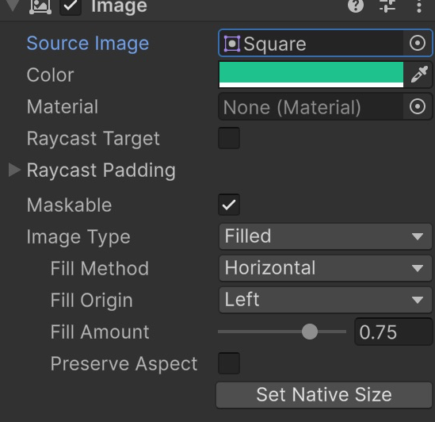
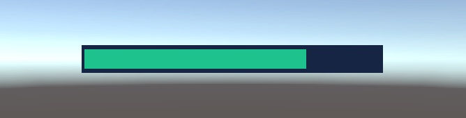

# Textos, imatges i barra de vida

Farem un indicador amb un text i una barra de vida. Canviarem la quantitat directament des de l'Inspector per veure com funciona. El joc encara no calcula la vida: aquest tutorial prepara la seva representació visual.

## Projecte i escena

Aquest tutorial és **independent**: no necessita cap escena dels altres apartats. No escriurem scripts.

1. Obre **Unity Hub**. Si encara no tens projecte, fes **New project**, escull **Universal 3D**, anomena'l **HUD** i fes **Create project**. Si ja tens un projecte Universal 3D, el pots utilitzar.
2. A l'editor, fes **File > New Scene**, escull **Basic (URP)** i fes **Create**. Si Unity pregunta per l'escena anterior, desa-la abans de continuar.
3. Fes **File > Save As** i desa la nova escena dins d'**Assets** amb el nom **HUD-Indicadors**.
4. Mantén la **Main Camera** i la llum que incorpora l'escena. Si també hi ha un **Global Volume**, deixa'l tal com està.

**On treballarem:** **Hierarchy** és la llista d'objectes de l'escena; **Inspector** mostra les propietats de l'objecte seleccionat; **Scene** serveix per editar i **Game** mostra el que veuria el jugador. **Project** mostra els fitxers del projecte, no els objectes de l'escena.

Les captures són de **Unity 6.6**. En aquesta versió, el menú es diu **GameObject > UI (Canvas)**; en versions anteriors pot dir-se **GameObject > UI**. En aquest tutorial utilitzem aquesta família de components, anomenada **uGUI**.

> Fes els canvis amb **Play desactivat**. Els canvis que facis mentre el joc està en marxa habitualment es perden en aturar-lo. Desa l'escena amb **Ctrl+S** a Windows o **Cmd+S** a macOS.

## Crear el Canvas

1. Fes **GameObject > UI (Canvas) > Canvas**.
2. Selecciona **Canvas** a **Hierarchy**.
3. Al component **Canvas** de l'Inspector, deixa **Render Mode = Screen Space - Overlay**. Això dibuixa la interfície sobre la pantalla del joc.
4. Al component **Canvas Scaler**, escull **UI Scale Mode = Scale With Screen Size**.
5. Posa **Reference Resolution X = 1280**, **Y = 720** i **Match = 0.5**. Treballarem com si la pantalla tingués 1280 punts d'amplada i 720 d'alçada; Unity adaptarà el conjunt a la finestra real.
6. Si Unity crea un **EventSystem**, conserva'l. És l'objecte que gestiona la interacció amb la UI. No és necessari per mostrar text, però sí per als botons que reben clics.

## Crear l'etiqueta de vida

1. Selecciona **Canvas** i crea **GameObject > UI (Canvas) > Text - TextMeshPro**.
2. Anomena'l **TextVida**.

Si apareix **TMP Importer**, fes **Import TMP Essentials** i tanca la finestra quan acabi. Són els recursos bàsics de **TextMeshPro**, el sistema que dibuixa les lletres. No cal importar **Examples & Extras**. Si ja s'havien importat, la finestra no apareixerà.

3. Escriu **Vida: 75 / 100** al camp **Text Input**.
4. Posa **Font Size = 32**, **Auto Size desactivat** i alineació a l'esquerra i al mig vertical.
5. A **Vertex Color**, fes clic al requadre de color. Al camp **Hexadecimal**, escriu `172B4D`, un blau fosc; deixa **A = 255** i tanca el selector.

**Color i transparència:** el color es pot escollir visualment o copiar amb un codi. No cal entendre el codi hexadecimal. **A** indica l'opacitat: `255` és completament visible i `0` és invisible quan el selector mostra valors de 0 a 255.

El quadradet de la part superior esquerra de **Rect Transform** obre **Anchor Presets**. Les miniatures representen les cantonades, els costats i el centre del rectangle pare.

Per escollir un preset en aquests passos, mantén **Alt+Shift** a Windows o **Option+Shift** a macOS mentre hi fas clic. Així s'ajusten alhora l'ancoratge, el pivot i la posició inicial. Després introdueix els valors de la taula.

6. Escull el preset **top / left** amb aquestes tecles.
7. Posa **Pos X = 24**, **Pos Y = -24**, **Pos Z = 0**, **Width = 320**, **Height = 60** i **Scale = (1, 1, 1)**. El text queda a dalt a l'esquerra, separat de les vores.

## Crear el fons de la barra

1. Selecciona **Canvas**, no TextVida.
2. Fes **GameObject > UI (Canvas) > Image** i anomena-la **FonsVida**.
3. A **Rect Transform**, escull **middle / center** amb **Alt+Shift / Option+Shift**.
4. Posa **Pos X = 0**, **Pos Y = 0**, **Pos Z = 0**, **Width = 360**, **Height = 32** i **Scale = (1, 1, 1)**.
5. A la finestra **Project**, selecciona **Assets** i fes **Assets > Create > 2D > Sprites > Square**. Deixa el nom **Square**. Això crea un quadrat blanc de vores rectes que podem tenyir i estirar. Torna a seleccionar **FonsVida** a Hierarchy.
6. Al component **Image**, prem el cercle a la dreta de **Source Image**, busca **Square** i fes doble clic sobre el quadrat blanc. Posa **Image Type = Simple** i deixa **Preserve Aspect desactivat**: volem convertir el quadrat en un rectangle.
7. A **Color**, escriu **Hexadecimal = 172B4D**, amb **A = 255**.
8. Desactiva **Raycast Target**, perquè aquesta imatge només mostra informació i no ha d'interceptar clics.

**Image** és el component que dibuixa una imatge dins del Canvas. **Source Image** és el dibuix que utilitza, anomenat **sprite**. **Color** el tenyeix. Per a aquesta pràctica creem un sprite amb les eines de Unity i no cal descarregar res.

## Afegir el farciment

1. Selecciona **FonsVida** i duplica'l amb **Ctrl+D / Cmd+D**.
2. Anomena la còpia **Vida**. Deixa-la com a germana de FonsVida, dins del Canvas i immediatament després seu a Hierarchy.
3. Mantén **Pos X = 0, Pos Y = 0** i canvia **Width = 352**, **Height = 24**. És una mica més petita perquè es vegi la vora del fons.
4. A Image, posa **Color = 20C997**, amb **A = 255**: és un verd turquesa.
5. Canvia **Image Type = Filled**.
6. Posa **Fill Method = Horizontal** i **Fill Origin = Left**.
7. Posa **Fill Amount = 0.75** i deixa **Preserve Aspect desactivat**.

<center>

</center>
<br/>

**Fill Amount** vol dir «quantitat de farciment». Pots escriure un valor o arrossegar el control:

| Valor | Què es veu |
|---|---|
| `1` | Barra plena |
| `0.75` | Tres quartes parts; vida 75 de 100 |
| `0.5` | Mitja barra |
| `0` | Sense farciment; només queda el fons |

Escriu els decimals amb **punt**, com `0.75`. No has de canviar l'escala ni l'amplada de Vida cada vegada que vulguis mostrar menys vida.

<center>

</center>
<br/>


El fons i el farciment han de tenir vores rectes i definides. Evita estirar un sprite amb vores difuminades: el desenfocament també s'estiraria. A Game, el control **Scale** només amplia la previsualització; no modifica la qualitat del joc.

## Ordre dels elements

La jerarquia ha de contenir aquests fills del Canvas:

```text
Canvas
    TextVida
    FonsVida
    Vida
EventSystem
```

Entre germans d'un mateix Canvas, els elements que apareixen més avall a la llista es dibuixen per sobre dels anteriors. **Vida** ha d'estar després de **FonsVida** perquè el farciment es vegi. Si més endavant poses text damunt de la barra, col·loca aquest text després de les imatges.

## Provar el resultat

1. Obre **Game**.
2. Selecciona **Vida** i prova **Fill Amount = 1**, després `0.5` i finalment `0.75`.
3. Observa que el fons conserva la mida i que el farciment disminueix des de la dreta.
4. Comprova que **TextVida** continua dient `Vida: 75 / 100`: el text i la barra són independents. Canviar un no actualitza l'altre sense programació.
5. Deixa el farciment a `0.75` i desa l'escena.

## Posar-hi una icona pròpia

Aquest pas és opcional i es fa a la mateixa escena:

1. Arrossega una imatge PNG pròpia a la finestra **Project**, dins d'Assets.
2. Selecciona el fitxer. A l'Inspector, posa **Texture Type = Sprite (2D and UI)**, **Sprite Mode = Single** i prem **Apply**.
3. Selecciona Canvas i crea una altra **UI (Canvas) > Image**, anomenada **Icona**.
4. Escull el preset **middle / center** amb les tecles indicades abans. Posa **Pos X = -220**, **Pos Y = 0**, **Width = 48** i **Height = 48**.
5. Arrossega el fitxer PNG des de Project al camp **Source Image** d'Icona.
6. Deixa **Image Type = Simple**, **Color = blanc**, activa **Preserve Aspect** i desactiva **Raycast Target**.

**Preserve Aspect** conserva la forma original: evita que una icona rodona es deformi en un oval. Un PNG amb transparència permet veure el joc al voltant de la icona.

## Si alguna cosa no funciona

- Si no apareix **Image Type** o no funciona Filled, comprova que **Source Image** conté un sprite; no el deixis a None.
- Si no veus el farciment, comprova **Fill Amount**, el color, l'opacitat i l'ordre a Hierarchy.
- Si les lletres no caben, augmenta **Width** o redueix **Font Size**. Deixa Scale a `(1, 1, 1)`.

[Referència del component Image](https://docs.unity3d.com/Packages/com.unity.ugui@2.0/manual/script-Image.html).
