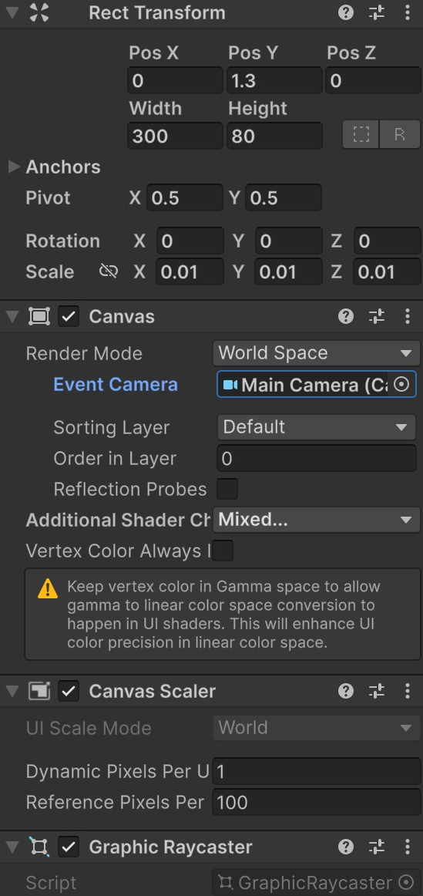
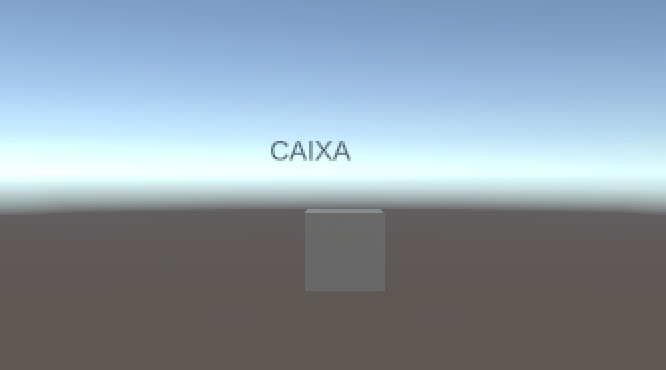

# Informació sobre objectes del món 3D

Crearem una caixa amb una etiqueta situada a sobre. L'etiqueta formarà part del món: si la caixa es mou, la seguirà, i si allunyem la càmera, es veurà més petita.

## Projecte i escena

Aquest tutorial és **independent**: no necessita cap escena dels altres apartats. No escriurem scripts.

1. Obre **Unity Hub**. Si encara no tens projecte, fes **New project**, escull **Universal 3D**, anomena'l **HUD** i fes **Create project**. Si ja tens un projecte Universal 3D, el pots utilitzar.
2. A l'editor, fes **File > New Scene**, escull **Basic (URP)** i fes **Create**. Si Unity pregunta per l'escena anterior, desa-la abans de continuar.
3. Fes **File > Save As** i desa la nova escena dins d'**Assets** amb el nom **HUD-UIAlMon**.
4. Mantén la **Main Camera** i la llum que incorpora l'escena. Si també hi ha un **Global Volume**, deixa'l tal com està.

**On treballarem:** **Hierarchy** és la llista d'objectes de l'escena; **Inspector** mostra les propietats de l'objecte seleccionat; **Scene** serveix per editar i **Game** mostra el que veuria el jugador. **Project** mostra els fitxers del projecte, no els objectes de l'escena.

Les captures són de **Unity 6.6**. En aquesta versió, el menú es diu **GameObject > UI (Canvas)**; en versions anteriors pot dir-se **GameObject > UI**. En aquest tutorial utilitzem aquesta família de components, anomenada **uGUI**.

> Fes els canvis amb **Play desactivat**. Els canvis que facis mentre el joc està en marxa habitualment es perden en aturar-lo. Desa l'escena amb **Ctrl+S** a Windows o **Cmd+S** a macOS.

## Preparar la caixa i la càmera

1. Fes **GameObject > 3D Object > Cube** i anomena'l **Caixa**.
2. Al **Transform** de Caixa, posa **Position = (0, 0, 0)**, **Rotation = (0, 0, 0)** i **Scale = (1, 1, 1)**.
3. Selecciona **Main Camera** i posa **Position = (0, 1, -10)** i **Rotation = (0, 0, 0)**.

Quan indiquem tres valors entre parèntesis, escriu-los a les caselles **X, Y i Z**, en aquest ordre. X indica els costats, Y l'alçada i Z la profunditat.

## Crear un Canvas dins del món

1. Fes **GameObject > UI (Canvas) > Canvas** i anomena'l **Etiqueta**.
2. Al seu component **Canvas**, canvia **Render Mode = World Space**.
3. Arrossega **Etiqueta** sobre **Caixa** a Hierarchy. Etiqueta ha de quedar desplaçada cap a la dreta, sota Caixa: ara és un objecte fill.
4. Després de fer-la filla, introdueix aquests valors al **Rect Transform** d'Etiqueta:

| Camp | Valor |
|---|---|
| Pos X / Pos Y / Pos Z | `0 / 1.3 / 0` |
| Width / Height | `300 / 80` |
| Pivot X / Y | `0.5 / 0.5` |
| Rotation X / Y / Z | `0 / 0 / 0` |
| Scale X / Y / Z | `0.01 / 0.01 / 0.01` |

La posició ara és relativa a **Caixa**: Y `1.3` situa el cartell per sobre. **Scale = 0.01** redueix el Canvas perquè no sigui gegant al costat de la caixa. Width i Height continuen oferint espai per maquetar el text.

5. Si apareix **Event Camera**, arrossega-hi **Main Camera** des de Hierarchy. Aquest camp serveix per a la interacció amb la UI; no és el que fa que el text es dibuixi.
6. Deixa **Canvas Scaler** amb els valors de World Space que posa Unity. Aquí no utilitzem **Scale With Screen Size**.

<center>

</center>
<br/>

## Afegir el nom de la caixa

1. Selecciona **Etiqueta** i fes **GameObject > UI (Canvas) > Text - TextMeshPro**.
2. Anomena el text **NomCaixa**. Ha de quedar dins d'Etiqueta.

Si apareix **TMP Importer**, fes **Import TMP Essentials** i tanca la finestra quan acabi. Són els recursos bàsics de **TextMeshPro**, el sistema que dibuixa les lletres. No cal importar **Examples & Extras**. Si ja s'havien importat, la finestra no apareixerà.

El quadradet de la part superior esquerra de **Rect Transform** obre **Anchor Presets**. Les miniatures representen les cantonades, els costats i el centre del rectangle pare.

Per escollir un preset en aquests passos, mantén **Alt+Shift** a Windows o **Option+Shift** a macOS mentre hi fas clic. Així s'ajusten alhora l'ancoratge, el pivot i la posició inicial. Després introdueix els valors de la taula.

3. A Rect Transform, escull **middle / center** amb les tecles indicades. Posa **Pos X = 0, Pos Y = 0, Pos Z = 0**, **Width = 300**, **Height = 80** i **Scale = (1, 1, 1)**.
4. Escriu **CAIXA** al camp **Text Input**.
5. Posa **Font Size = 36**, **Auto Size desactivat**, color blau fosc (**Vertex Color > Hexadecimal = 172B4D**, **A = 255**) i alineació centrada horitzontalment i verticalment.
6. Desplega **Extra Settings** del component de text i desactiva **Raycast Target**.

El text fill manté Scale a `1`: ja rep l'escala petita del Canvas pare. Si també el reduïssim a `0.01`, es faria massa petit.

```text
Main Camera
Directional Light
Caixa
    Etiqueta                 Canvas en World Space
        NomCaixa             TextMeshPro UI
EventSystem
```

## Veure i moure l'etiqueta

1. Obre **Game**: has de veure **CAIXA** sobre el cub.
2. Selecciona **Caixa** i canvia **Position X** de `0` a `2`. Tant el cub com l'etiqueta s'han de moure junts.
3. Torna Caixa a **X = 0**.
4. Selecciona **Main Camera** i canvia **Position Z** de `-10` a `-15`: el cub i l'etiqueta es veuen més petits.
5. Torna la càmera a **Z = -10**.

<center>

</center>
<br/>

## Comprovar que un obstacle la pot tapar

1. Crea un segon **3D Object > Cube**, anomenat **Paret**. Comprova que queda a l'arrel de Hierarchy; si és fill d'un altre objecte, arrossega'l a una zona buida de la llista.
2. Posa **Position = (0, 1, -2)**, **Rotation = (0, 0, 0)** i **Scale = (4, 3, 0.2)**.
3. Mira **Game**: la paret queda entre la càmera i l'etiqueta i la tapa amb els materials estàndard.
4. Desactiva **Paret** amb la casella al costat del seu nom a l'Inspector. L'etiqueta torna a aparèixer.
5. Desa l'escena amb Paret desactivada.

## Una etiqueta al món no és un indicador fix de pantalla

| Etiqueta World Space d'aquest exercici | Indicador de pantalla que segueix un objecte |
|---|---|
| Té una posició dins del món 3D | Es col·loca a la pantalla segons la posició de l'objecte |
| Es veu més petita en allunyar-se | Pot conservar una mida constant a la pantalla |
| Pot quedar darrere d'una paret | En Overlay es dibuixa sobre l'escena |
| Segueix Caixa perquè n'és filla | Necessita actualitzar la posició amb codi |

Tampoc gira automàticament per mirar la càmera. En aquesta escena la càmera mira de cara al cartell. Si la càmera ha de donar voltes, més endavant podem afegir un comportament **billboard**, que orienta el cartell cap a la càmera.

## Si l'etiqueta no es veu

- Si és enorme, revisa l'escala `0.01` del Canvas.
- Si és diminuta, comprova que no has reduït també l'escala del text fill.
- Si es veu de cantell, revisa la rotació i la posició de la càmera.
- Si no segueix la caixa, comprova que Etiqueta n'és filla i que NomCaixa és fill d'Etiqueta.

[Referència dels modes de Canvas](https://docs.unity3d.com/Packages/com.unity.ugui@2.0/manual/UICanvas.html).
