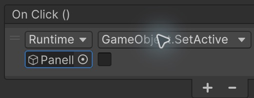
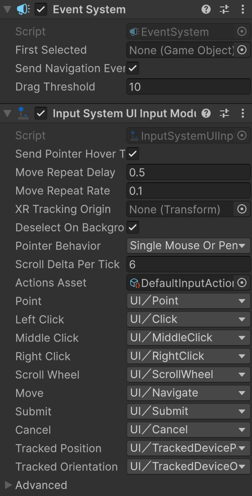

# Panells i botons sense programar

Farem un botó **Ajuda** que obre un requadre amb instruccions i un botó **Tancar** que l'amaga. Tot es construeix dins d'una sola escena.

## Projecte i escena

Aquest tutorial és **independent**: no necessita cap escena dels altres apartats. No escriurem scripts.

1. Obre **Unity Hub**. Si encara no tens projecte, fes **New project**, escull **Universal 3D**, anomena'l **HUD** i fes **Create project**. Si ja tens un projecte Universal 3D, el pots utilitzar.
2. A l'editor, fes **File > New Scene**, escull **Basic (URP)** i fes **Create**. Si Unity pregunta per l'escena anterior, desa-la abans de continuar.
3. Fes **File > Save As** i desa la nova escena dins d'**Assets** amb el nom **HUD-PanellsIBotons**.
4. Mantén la **Main Camera** i la llum que incorpora l'escena. Si també hi ha un **Global Volume**, deixa'l tal com està.

**On treballarem:** **Hierarchy** és la llista d'objectes de l'escena; **Inspector** mostra les propietats de l'objecte seleccionat; **Scene** serveix per editar i **Game** mostra el que veuria el jugador. **Project** mostra els fitxers del projecte, no els objectes de l'escena.

Les captures són de **Unity 6.6**. En aquesta versió, el menú es diu **GameObject > UI (Canvas)**; en versions anteriors pot dir-se **GameObject > UI**. En aquest tutorial utilitzem aquesta família de components, anomenada **uGUI**.

> Fes els canvis amb **Play desactivat**. Els canvis que facis mentre el joc està en marxa habitualment es perden en aturar-lo. Desa l'escena amb **Ctrl+S** a Windows o **Cmd+S** a macOS.

## Crear el Canvas

1. Fes **GameObject > UI (Canvas) > Canvas**.
2. Selecciona **Canvas** a **Hierarchy**.
3. Al component **Canvas** de l'Inspector, deixa **Render Mode = Screen Space - Overlay**. Això dibuixa la interfície sobre la pantalla del joc.
4. Al component **Canvas Scaler**, escull **UI Scale Mode = Scale With Screen Size**.
5. Posa **Reference Resolution X = 1280**, **Y = 720** i **Match = 0.5**. Treballarem com si la pantalla tingués 1280 punts d'amplada i 720 d'alçada; Unity adaptarà el conjunt a la finestra real.
6. Si Unity crea un **EventSystem**, conserva'l. És l'objecte que gestiona la interacció amb la UI. No és necessari per mostrar text, però sí per als botons que reben clics.


## Crear el botó Ajuda

1. Selecciona **Canvas** i fes **GameObject > UI (Canvas) > Button - TextMeshPro**.
2. Si apareix **TMP Importer**, prem **Import TMP Essentials**, espera que acabi i tanca la finestra. No cal importar Examples & Extras.
3. Anomena el botó **BotoAjuda** al camp superior de l'Inspector.
4. A **Rect Transform**, obre el quadradet **Anchor Presets**. Mantén **Alt+Shift** a Windows o **Option+Shift** a macOS i escull **middle / center**, el centre sense estirar. Aquestes tecles ajusten l'ancoratge, el pivot i la posició inicial.
5. Posa **Pos X = 0**, **Pos Y = 240**, **Pos Z = 0**, **Width = 200**, **Height = 60** i **Scale = (1, 1, 1)**. X mou als costats i Y amunt o avall; Width i Height són amplada i alçada.
6. A Hierarchy, desplega la fletxa de BotoAjuda i selecciona el fill **Text (TMP)**. Al seu component de text, escriu **Ajuda**, posa **Font Size = 28**, **Auto Size desactivat** i alineació centrada horitzontalment i verticalment. Mantén el color fosc del text i el fons blanc del botó.

El component **Image** dibuixa el fons del botó, el fill **Text (TMP)** dibuixa les lletres i **Button** respon al clic. Són tres funcions diferents.

## Construir el panell

Un **panell** és un requadre que agrupa informació. El farem amb una Image perquè així comença amb un rectangle centrat fàcil d'ajustar.

1. Selecciona **Canvas**, no BotoAjuda, i fes **GameObject > UI (Canvas) > Image**.
2. Anomena-la **PanellAjuda**. Ha de ser filla directa de Canvas, al mateix nivell que BotoAjuda.
3. A Rect Transform, escull **middle / center** amb les mateixes tecles. Posa **Pos X / Y / Z = 0 / 0 / 0**, **Width = 500**, **Height = 300** i **Scale = (1, 1, 1)**.
4. A **Image**, deixa **Source Image = None**: Unity dibuixa un rectangle de color. Obre **Color**, escriu **172B4D** a **Hexadecimal** i posa **A = 255**. A és l'opacitat: amb 255 el panell tapa completament el que hi ha darrere.
5. Selecciona PanellAjuda i crea **UI (Canvas) > Text - TextMeshPro**. Anomena el fill **Instruccions**.
6. A Rect Transform d'Instruccions, escull **middle / center** amb les tecles anteriors. Posa **Pos X = 0**, **Pos Y = 40**, **Pos Z = 0**, **Width = 440**, **Height = 140** i **Scale = (1, 1, 1)**.
7. Escriu **Aquest és el panell d'ajuda. Prem Tancar per tornar al joc.** Posa **Font Size = 28**, **Auto Size desactivat**, **Vertex Color = blanc** i alineació centrada horitzontalment i verticalment.
8. A **Extra Settings** del text, desactiva **Raycast Target**. El text només informa i no necessita interceptar el ratolí.
9. Selecciona de nou **PanellAjuda** i crea **UI (Canvas) > Button - TextMeshPro**. Anomena'l **BotoTancar**.
10. Centra'l amb **middle / center** i les tecles anteriors. Posa **Pos X = 0**, **Pos Y = -90**, **Pos Z = 0**, **Width = 200**, **Height = 60** i **Scale = (1, 1, 1)**.
11. Selecciona el seu fill **Text (TMP)**: escriu **Tancar**, posa **Font Size = 28**, **Auto Size desactivat** i deixa el text fosc centrat.

La jerarquia ha de quedar així. Els fills apareixen una mica desplaçats a la dreta:

```text
Canvas
    BotoAjuda
        Text (TMP)
    PanellAjuda
        Instruccions
        BotoTancar
            Text (TMP)
EventSystem
```

**BotoAjuda ha de quedar fora de PanellAjuda.** Si fos fill seu, també desapareixeria quan amaguéssim el panell i no podríem tornar-lo a obrir.

## Fer que Ajuda obri el panell

1. Selecciona **BotoAjuda**, l'objecte pare del text.
2. Al component **Button**, busca **On Click ()** i prem **+**. Apareix una línia amb **Runtime Only**, **None (Object)** i **No Function**.
3. Arrossega **PanellAjuda** des de **Hierarchy** al camp **None (Object)**. També pots prémer el cercle del camp, obrir la pestanya **Scene**, buscar PanellAjuda i fer-hi doble clic.
4. Obre **No Function** i escull **GameObject > SetActive (bool)**.
5. **Marca la casella** que apareix al costat del camp de l'objecte. Deixa **Runtime Only**.

**On Click** indica què farà Unity quan premem el botó. **SetActive** activa o desactiva un objecte. **bool** vol dir que només hi ha dues opcions: casella marcada = activar; desmarcada = desactivar. Aquí utilitzem una acció que Unity ja incorpora.


## Fer que Tancar amagui el panell

1. Selecciona **BotoTancar**.
2. A **Button > On Click ()**, prem **+**.
3. Assigna **PanellAjuda** al camp de l'objecte, igual que abans.
4. Escull **GameObject > SetActive (bool)**.
5. **Deixa la casella desmarcada**. El clic desactivarà PanellAjuda i tots els seus fills.

<center>

</center>
<br/>


## Preparar la interacció

1. Selecciona **Canvas**: conserva el component **Graphic Raycaster**. Detecta sobre quin element de la UI cau el clic.
2. Selecciona **EventSystem**. En un projecte amb el nou Input System, ha de tenir **Input System UI Input Module**. Si Unity mostra **Replace with InputSystemUIInputModule**, prem aquest botó.
3. Si el mòdul mostra **Assign Default Actions** perquè no té accions assignades, prem-lo. Han de quedar configurats camps com **Point**, **Left Click**, **Move**, **Submit** i **Cancel**.
4. Si el projecte utilitza el sistema d'entrada antic, **Standalone Input Module** pot ser el mòdul correcte. No afegeixis tots dos ni dupliquis EventSystem.
5. A cada Button, comprova **Interactable activat**; a la seva Image, **Raycast Target activat**.

<center>

</center>
<br/>


**Raycast Target** no és un collider de física: indica si un gràfic de la UI participa en la detecció del punter. Una imatge transparent amb aquesta opció activada també pot interceptar clics i impedir que arribin a un botó situat darrere.

## Provar-ho

1. Amb Play aturat, selecciona **PanellAjuda** i desmarca la casella del costat del seu nom, a la part superior de l'Inspector. No és la casella del component Image: volem desactivar tot l'objecte.
2. Desa l'escena. A Game només s'ha de veure el botó Ajuda.
3. Prem **Play**, obre **Game** i fes clic a **Ajuda**: apareix el panell.
4. Fes clic a **Tancar**: desapareix el panell. Repeteix-ho per comprovar que el botó Ajuda continua accessible.
5. Atura Play. El panell torna a l'estat inicial que havies desat.

Mostrar un panell **no atura el temps ni pausa el joc**. Aquí només canviem la visibilitat i l'activació d'objectes; la pausa i l'actualització de dades del joc es tractaran amb programació.

## Si el botó no funciona

- Prova'l dins de **Game**, amb **Play** activat.
- Revisa **EventSystem**, el mòdul d'entrada i **Graphic Raycaster**.
- Comprova que el destinatari d'On Click és **PanellAjuda**, no el botó ni un recurs de Project.
- Si s'amaga però no torna, comprova que **BotoAjuda no sigui fill de PanellAjuda**.
- Si no canvia res, revisa **Interactable**, la casella de SetActive i si hi ha una Image davant que intercepta clics.

[Referència de Button](https://docs.unity3d.com/Packages/com.unity.ugui@2.0/manual/script-Button.html) · [UI amb Input System](https://docs.unity3d.com/Packages/com.unity.inputsystem@1.11/manual/UISupport.html).
