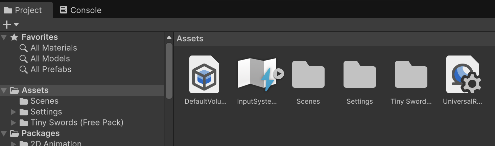

# RPG

En aquest tema veurem com fer un joc de plataformes amb Unity.

## Nou projecte

Crea un nou projecte Unity "Universal 2D" anometat "RPG".

## Unity Asset Store

Farem servir un asset gratuït **extern** a la Unity Asset Store anomenat:

[Tiny Swords](https://pixelfrog-assets.itch.io/tiny-swords)

Descarrega la versió:

```text
Tiny Swords (Free Pack).zip 1.5 MB
```

Descomprimeix la carpeta i arrosega-la dins dels *"Assets"* del projecte.

<center>

</center>
<br/>

Ara ja hi ha els assets dins el projecte i els podem utilitzar.