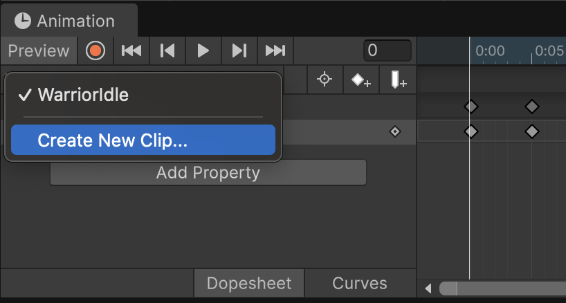
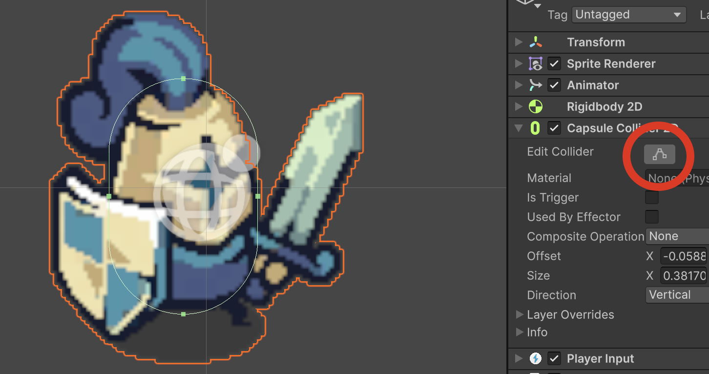

# Gerrer

## Animació Idle

Afegirem un gerrer i li donarem moviment i les primeres animacions.

Arrossega l'Sprite ubicat a:

*"Assets > Tiny Swords (Free Pack) > Units > Blue Units > Warrior > Warrior Idle 0"*

Com un nou objecte de l'escena, anomena'l "Warrior", ubica'l a:

- Pos X: 0
- Pox Y: 0

A la carpeta **"Assets"** fes una nova carpeta anomenada **"Animations"**

Obre la finestra d'animacions: 

*"Menu Window > Animation > Animation"*

Sel·lecciona l'objecte **"Warrior"**, i apreta el botó "Create". Guarda l'animació **"WarriorIdle"** a la carpeta **"Animations"**

Arrossega cada un dels sprites *(Warrior_Idle_X)*, als frames d'animació cada 5 segons.

## Animació Run

Crea un nou "Clip d'animació" a la carpeta  **"Animations"** anomenat **"WarriorRun"**

<center>

</center>
<br/>

Arrossega cada un dels sprites *(Warrior_Run_X)*, als frames d'animació cada 5 segons.

## Components

Afegeix un component tipus **"Rigid Body 2D"**, amb els paràmetres:

- Gravity Scale: 0
- Constrains: Freeze Rotation Z (actiu)

Afegeix un component tipus **"Capsule Collider 2d"** i adapta'l per ocupar només el cos del guerrer, amb el botó **"Edit Collider"**

<center>

</center>
<br/>

## Scripts

A **"Assets"** crea una nova carpeta anomenada **"Scripts"**

Dins de la carpeta **"Scripts"** crea un script tipus **"MonoBehaviour"** anomenat **"Warrior".

Assigna'l a l'objecte **"Warrior"** com a un nou component.

```csharp
using UnityEngine;
using UnityEngine.InputSystem;

[RequireComponent(typeof(Rigidbody2D), typeof(PlayerInput))]
public class Player : MonoBehaviour
{
    public float moveSpeed = 4f;
    private Rigidbody2D rb;
    private Vector2 move;

    void Awake()
    {
        rb = GetComponent<Rigidbody2D>();
    }

    public void OnMove(InputValue v)
    {
        move = v.Get<Vector2>();
    }

    void FixedUpdate()
    {
        Vector2 m = move;
        if (m.sqrMagnitude > 1f) m = m.normalized; // normalize diagonals (keyboard)
        rb.linearVelocity = m * moveSpeed;               // set velocity
    }
}
```

Dins de la carpeta **"Scripts"** crea un script tipus **"MonoBehaviour"** anomenat **"WarriorAnimation"**.

Assigna'l a l'objecte **"Warrior"** com a un nou component.

```csharp
using UnityEngine;

[RequireComponent(typeof(Rigidbody2D), typeof(Animator))]
public class PlayerAnimation : MonoBehaviour
{
    private Rigidbody2D rb;
    private Animator animator;
    private SpriteRenderer spriteRenderer;
    private string currentAnimationState;

    [SerializeField] private float idleThreshold = 0.05f;

    void Awake()
    {
        rb = GetComponent<Rigidbody2D>();
        animator = GetComponent<Animator>();
        spriteRenderer = GetComponent<SpriteRenderer>();
    }

    void UpdateFacing() {
        // Canvia l'orientació segons la direcció en X
        if (rb.linearVelocity.x < -0.01f)
            spriteRenderer.flipX = true;
        else if (rb.linearVelocity.x > 0.01f)
            spriteRenderer.flipX = false;
    }

    void Update()
    {
        UpdateFacing();
        SetAnimation();
    }

    private void SetAnimation()
    {
        float vx = rb.linearVelocity.x;
        float vy = rb.linearVelocity.y;
        if (Mathf.Abs(vx) <= idleThreshold && Mathf.Abs(vy) <= idleThreshold)
            ChangeAnimationState("WarriorIdle");
        else
            ChangeAnimationState("WarriorRun");
    }

    private void ChangeAnimationState(string newState)
    {
        if (currentAnimationState == newState) return;
        animator.Play(newState);
        currentAnimationState = newState;
    }
}
```
