# Terreny

Per crear el terreny, tenim que fer el "TileSet".

Però amb els assets de *"Tiny Swords (Free Pack)"* els tiles no ens venen separats correctament.

Cal fer servir la eina *"Sprite Editor"* per separar-los.

## Dividir tiles

Crea la carpeta **"Sprites"** a l'arrel **"Assets"**

Selecciona els assets ubicats a:

*"Assets > Tiny Swords (Free Pack) > Terrain > Tilemap_color1"*

Al inspector escull la opció:

- Pixels Per Unit: 64

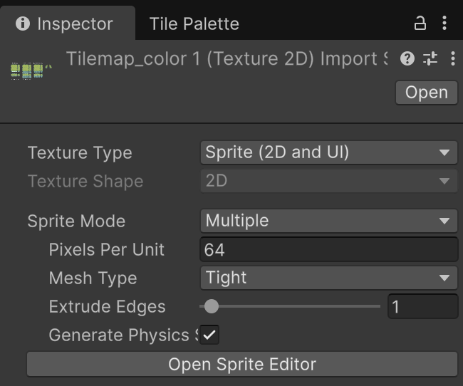

 

Assegura't que continuen sel·leccionats els assets de:

*"Assets > Tiny Swords (Free Pack) > Terrain > Tilemap_color1"*

Obre la eina **"Window > 2D > Sprite Editor"**

Veuràs com apareix al editor de sprites:

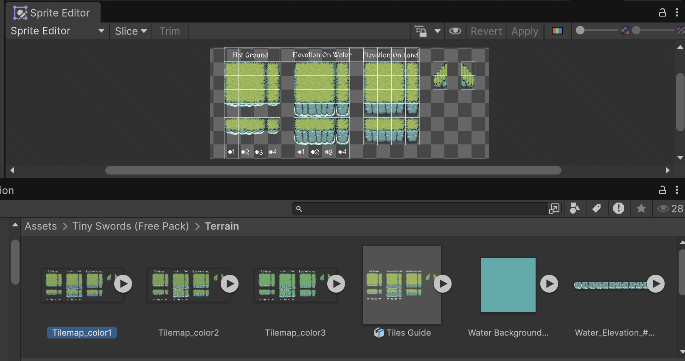

 

Apreta el botó **"Slice"** i escull:

- Type: Grid by Cell Size
- X: 64
- Y: 64

Apreteu el botó **"Slice"** del quadre emergent:

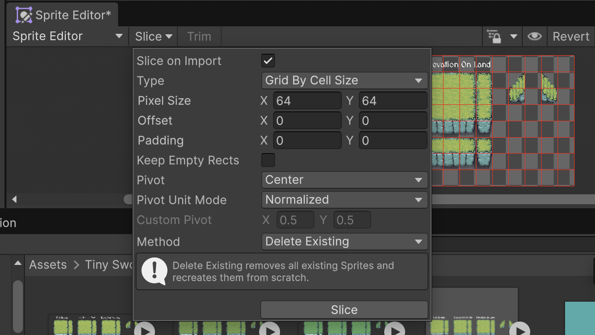

 

Veuràs que els assets ara estàn correctament dividits:

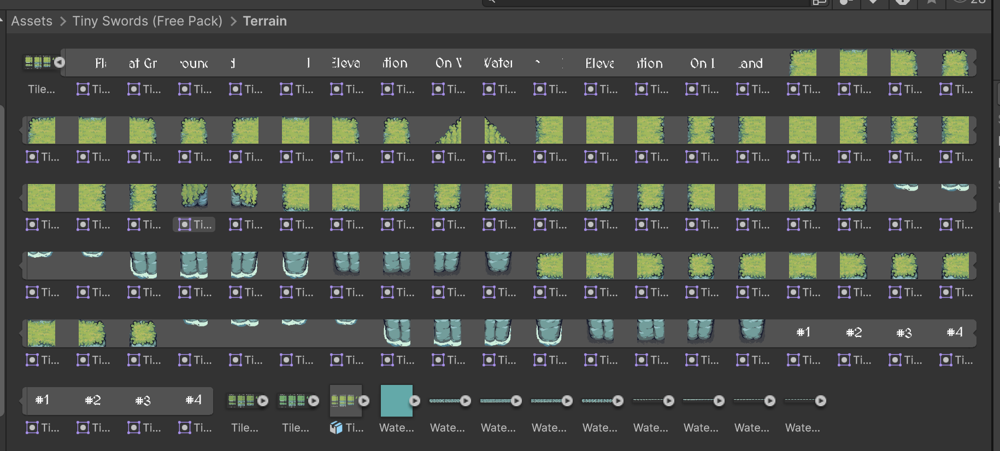

 

## Afegir tiles al TileSet

Crea una nova carpeta dins de **"Assets > Sprites"** anomenada **"Grass Palette"**

A la einta de **"Tile Palette"** creeu una nova paleta anomenada **"Grass Palette"**, guarda-la dins de:

*"Assets > Sprites > Grass Palette"*

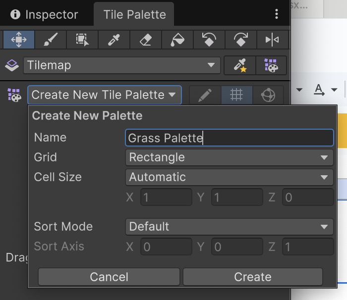

 

Arrossega els tiles de gespa cap aquesta nova paleta. Escull la carpeta que acabem de crear **"Grass Palette"**

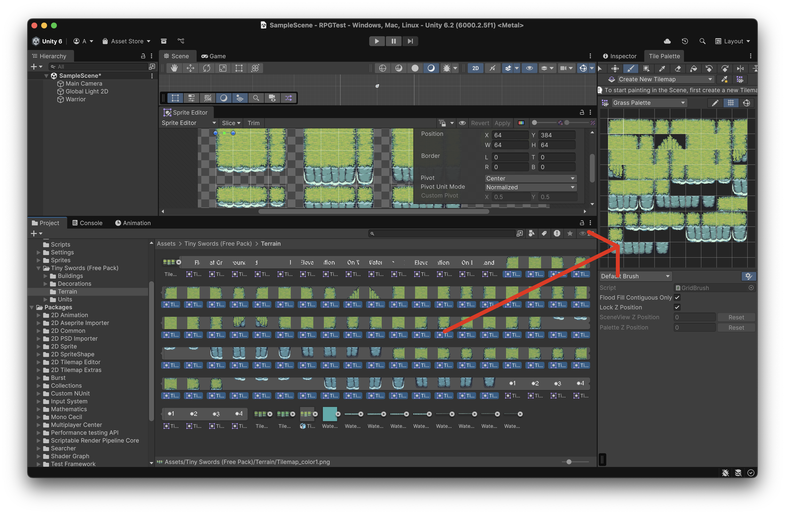

A la **"Hierarchy"** afegeix un nou tilemap anomenat **"Ground"**

*"2D Object > Tilemap > Rectangular"*

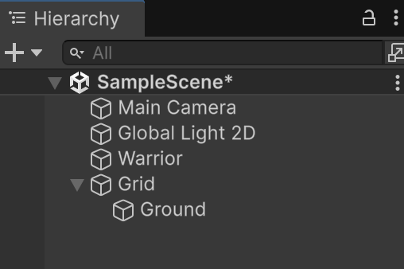

 

Dibuixa un terreny senzill:

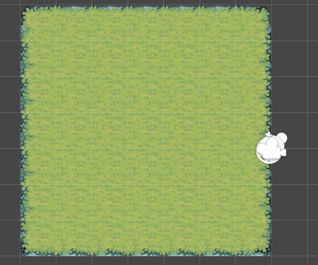

 

Si proves el joc, veuràs que el terreny queda per sobre del jugador.

Al inspector de l'objecte **"Ground"**, a l'apartat **"Tilemap Renderer"** escull la opció:

- Order in Layer: -1

Això el posa per sota del jugador.

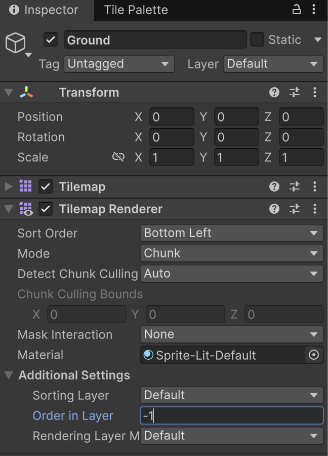

 

## Elevated grass

Escull l'asset amb la herva de color diferent:

*"Assets > Tiny Swords (Free Pack) > Terrain > Tilemap_color3"*

- Defineix els **"Pixels per Unit"** a 64

- Retalla-la amb el **"Sprite Editor"**

    - Slice type: Grid by Cell Size
    - Mida: 64x64
    - Slice
    - Apply

- Arrossega els tiles generats cap a **"Tile Palette"** i guarda-la a una nova carpeta **"Sprites > Elevated Grass Pallete"**

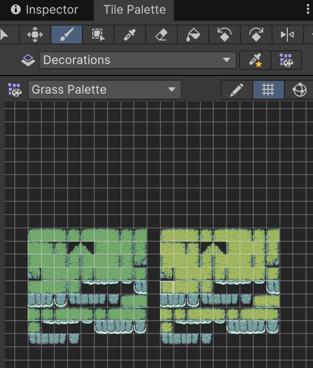

 

Al l'object **"Grid"** afegeix un nou tilemap anomenat **"Elevated"**

*"2D Object > Tilemap > Rectangular"*

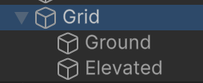

 

Per dibuixar sobre aquest nou tilemap, s'ha de tenir escollit a la **"Tile Palette"**

 

Crea una nova estructura elevada, en aquesta nou TileMap **"Elevated"**

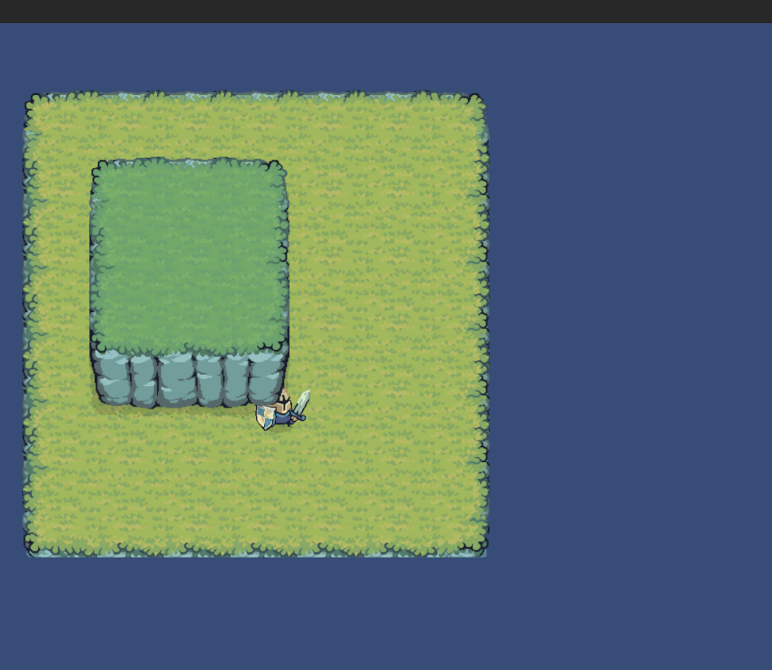

 

Veuràs que el player ara passa per sota de les decoracions i per sobre del terreny.

## Xocs i profunditat

Posa un nou component **"Tilemap Collider 2D"** al tilemap **"Elevated"**

A l'inspector del **"Player"**, a l'apartat **"Sprite Renderer"** posa el paràmetre:

- Order in Layer: 5