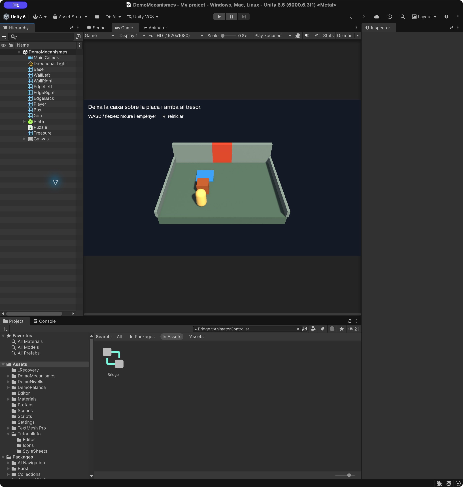
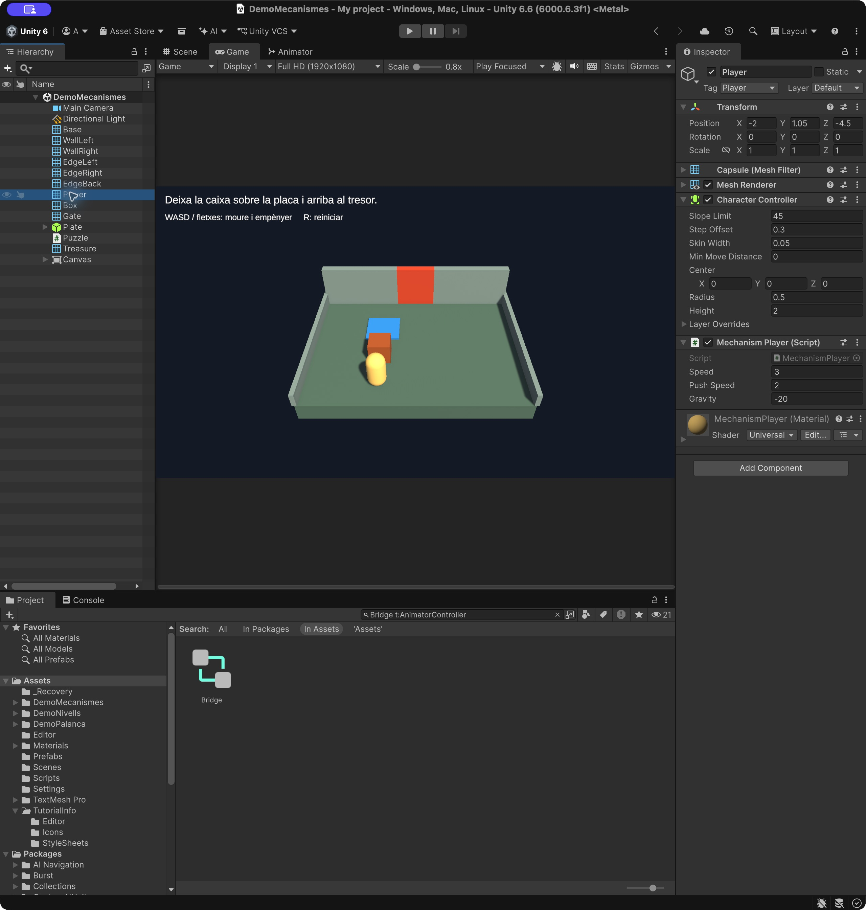
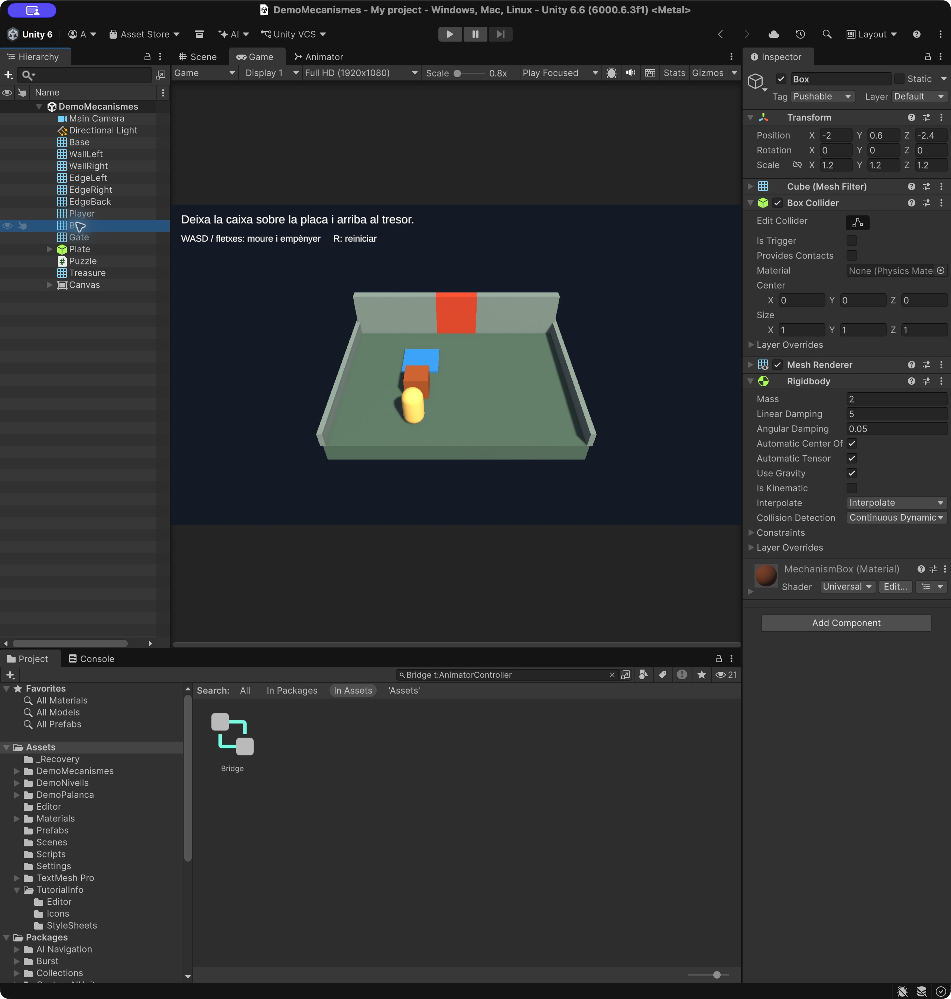
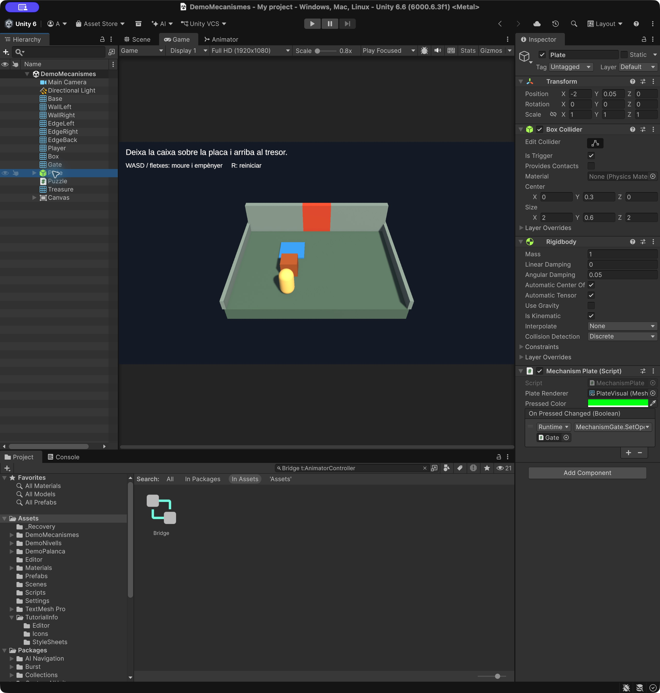
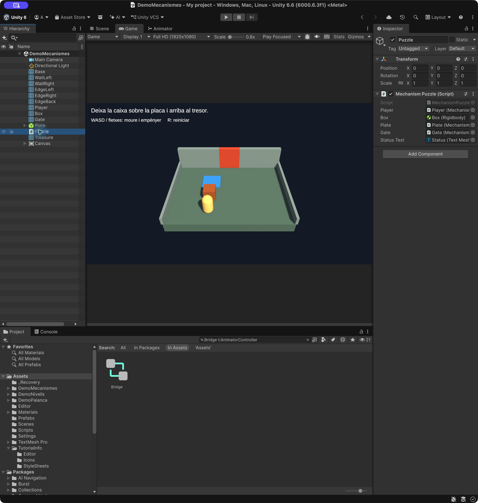
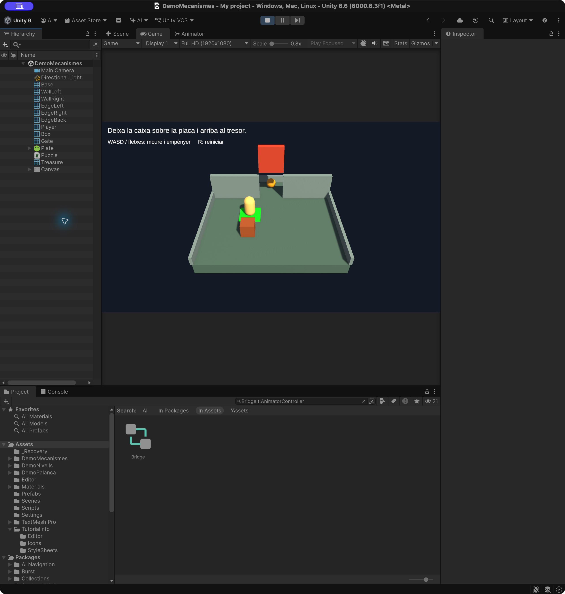
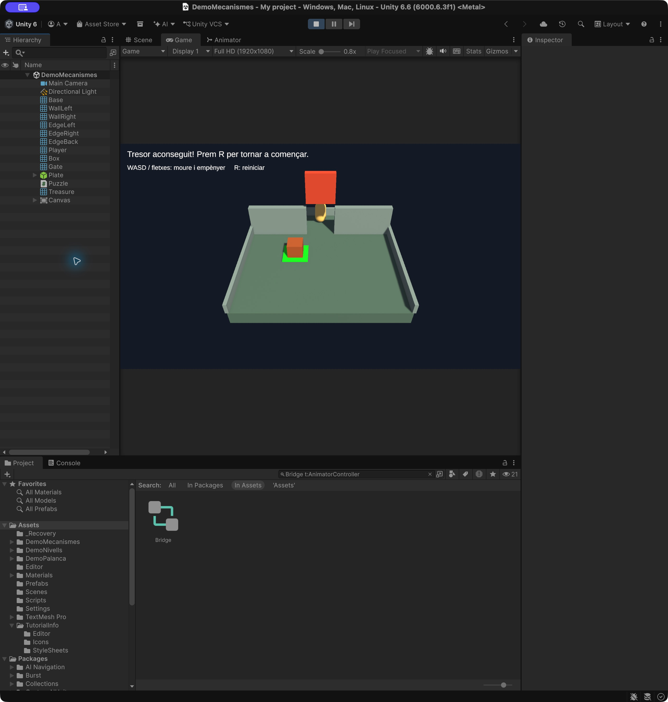

# Demo Mecanismes: la caixa i la placa

Construirem un petit temple amb una **càpsula** de protagonista, una caixa que es pot empènyer, una placa de pressió i una reixa. L’objectiu és deixar la caixa sobre la placa perquè mantingui la reixa oberta i arribar al tresor.

La placa també s’activa quan la trepitja el jugador, però es desactiva quan en surt. Si hi ha el jugador i la caixa alhora, continua activada mentre en quedi almenys un. La tecla **R** reinicia el puzle.

**Comencem de zero:** no cal continuar cap altra demo ni copiar-ne scripts. La càmera és fixa per centrar-nos en la física de la caixa, els triggers i els esdeveniments.



**Projecte acabat:** [Demo-5-Mecanismes.zip](demos/Demo-5-Mecanismes.zip). [Com obrir-lo](demos/README.md).

## 1. Preparar el projecte i l’escena

A Unity Hub, crea un projecte nou amb la plantilla **Universal 3D (URP)** i **Unity 6.6, 6000.6.3f1**.

1. A l’escena inicial **SampleScene** de Universal 3D, fes **File > Save As** i desa **Assets/Scenes/DemoMecanismes.unity**. Conserva **Main Camera**, **Directional Light** i **Global Volume**. Més avall ajustarem la càmera i la llum existents. El component Transform de la càmera conserva **Scale `(1, 1, 1)`** i el tag **MainCamera**.
2. A **Window > Package Management > Package Manager > Unity Registry**, comprova que tens **Input System** instal·lat.
3. A **Edit > Project Settings > Player > Other Settings**, posa **Active Input Handling = Input System Package (New)** o **Both**. Reinicia Unity si ho demana.
4. Crea **Assets/DemoMecanismes** i, dins, les carpetes **Scripts** i **Materials**.
5. Si encara no tens els recursos de TextMeshPro, importa **Window > TextMeshPro > Import TMP Essential Resources**. També ho pots fer quan aparegui l’avís en crear el primer text.

Crea els **cinc scripts** dels apartats següents amb el mateix nom que la seva classe. Completa’ls tots abans de fer Play: alguns fan referència a classes que s’expliquen més endavant. Assigna totes les referències de l’Inspector i desa els canvis fora de Play.

**Coordenades i jerarquia:** abans de crear cada objecte independent, deixa de seleccionar qualsevol pare de la Hierarchy. Comprova que quedi a l’arrel. En crear un objecte buit, fes **Transform > ⋮ > Reset** i després introdueix els valors indicats. Les posicions de les taules són del món per als objectes a l’arrel; en els fills són **locals respecte al pare**. No facis fills del terra els murs ni el jugador. Si dupliques, revisa tots tres valors de Position, Rotation i Scale.

**Colors i materials:** a Project, dins de Materials, fes **clic dret > Create > Rendering > Material**. Obre el selector del color de **Base Map** i selecciona **RGB, rang 0–255**: introdueix R, G i B separadament. Deixa **A = 255**, excepte quan s’indiqui transparència. En el codi, `new Color(...)` continua utilitzant components entre 0 i 1.

**Interfície de Unity 6.6:** els textos i Canvas són a **GameObject > UI (Canvas)**; en altres versions el menú es diu UI. El menú Package Manager pot aparèixer directament sota Window en versions anteriors. El Canvas d’aquesta demo només mostra text: si Unity crea un **EventSystem**, elimina’l de la Hierarchy; no cal per llegir el teclat amb Input System.

## 2. Construir el temple

Crea materials amb **Create > Rendering > Material**, shader **Universal Render Pipeline/Lit**, **Surface Type = Opaque**, **Metallic = 0** i **Smoothness = 0.15**. Introdueix aquests colors RGB a **Base Map**, amb alfa 255:

| Material | Color RGB (0–255) |
|---|---|
| MechanismBase | RGB `(82, 110, 102)` |
| MechanismStone | RGB `(128, 148, 153)` |
| MechanismPlayer | RGB `(255, 214, 122)` |
| MechanismBox | RGB `(166, 87, 38)` |
| MechanismPlate | RGB `(46, 140, 230)` |
| MechanismGate | RGB `(204, 71, 41)` |
| MechanismGold | RGB `(255, 173, 13)` |

Crea els objectes de la taula amb **GameObject > 3D Object > Cube**. Deixa **Rotation = (0, 0, 0)** a tots, conserva el **Box Collider** i deixa **Is Trigger** desactivat. Són objectes independents a l’arrel de la jerarquia.

| Nom | Position (X, Y, Z) | Scale (X, Y, Z) | Material |
|---|---|---|---|
| Base | `(0, -0.5, 0)` | `(12, 1, 12)` | MechanismBase |
| WallLeft | `(-3.6, 1.3, 3)` | `(4.8, 2.6, 0.5)` | MechanismStone |
| WallRight | `(3.6, 1.3, 3)` | `(4.8, 2.6, 0.5)` | MechanismStone |
| EdgeLeft | `(-6, 0.4, 0)` | `(0.25, 0.8, 12)` | MechanismStone |
| EdgeRight | `(6, 0.4, 0)` | `(0.25, 0.8, 12)` | MechanismStone |
| EdgeBack | `(0, 0.4, 6)` | `(12, 0.8, 0.25)` | MechanismStone |
| Gate | `(0, 1.3, 3)` | `(2.4, 2.6, 0.5)` | MechanismGate |

La superfície de **Base** queda a `Y = 0`. Les dues parets deixen un pas central de `2.4` unitats que ocupa **Gate**. Així no es pot arribar al tresor rodejant la reixa pels costats.

Configura **Main Camera**:

| Propietat | Valor |
|---|---|
| Tag | MainCamera |
| Position | `(0, 14, -17)` |
| Rotation | `(40, 0, 0)` |
| Projection | Perspective |
| Field of View | `45` |
| Clipping Planes | Near `0.3`, Far `100` |
| Environment > Background Type | Solid Color |
| Background | RGB `(19, 28, 41)` |

A **Game**, selecciona **Full HD (1920×1080)** o **16:9**. La càmera no porta cap script. Amb aquesta orientació, **W/fletxa amunt** avança cap a Z positiu i **D/fletxa dreta** cap a X positiu.

A la **Directional Light** existent, selecciona **Color** a Light Appearance i posa rotació `(50, -30, 0)`, intensitat `2` i ombres activades.

A **Window > Rendering > Lighting > Environment**, selecciona **Environment Lighting > Source = Color** i Ambient Color **RGB `(128, 128, 128)`**.

## 3. La càpsula i el moviment

Crea **GameObject > 3D Object > Capsule**, anomena-la **Player** i configura:

- **Tag = Player**.
- **Position = (-2, 1.05, -4.5)**, rotació zero i escala `(1, 1, 1)`.
- Material **MechanismPlayer**.
- Elimina el **Capsule Collider** original.
- Afegeix **Character Controller**. No afegeixis Rigidbody al jugador.

| Character Controller | Valor |
|---|---|
| Center | `(0, 0, 0)` |
| Height | `2` |
| Radius | `0.5` |
| Step Offset | `0.3` |
| Skin Width | `0.05` |
| Min Move Distance | `0` |

Crea **MechanismPlayer.cs**:

```csharp
using UnityEngine;
using UnityEngine.InputSystem;

// Unity afegeix un Character Controller si l'objecte encara no en té.
[RequireComponent(typeof(CharacterController))]
public class MechanismPlayer : MonoBehaviour
{
    public float speed = 3f;
    public float pushSpeed = 2f;
    public float gravity = -20f;
    private CharacterController controller;
    private Vector3 startPosition;
    private float verticalSpeed;

    void Awake()
    {
        // Obtén el controlador del mateix objecte per moure'l respectant els colliders.
        controller = GetComponent<CharacterController>();
        // Desa la posició inicial per poder-hi tornar si el jugador cau o reinicia.
        startPosition = transform.position;
    }

    void Update()
    {
        Vector3 direction = Vector3.zero;
        var keys = Keyboard.current;
        if (keys != null)
        {
            if (keys.wKey.isPressed || keys.upArrowKey.isPressed) direction.z += 1;
            if (keys.sKey.isPressed || keys.downArrowKey.isPressed) direction.z -= 1;
            if (keys.dKey.isPressed || keys.rightArrowKey.isPressed) direction.x += 1;
            if (keys.aKey.isPressed || keys.leftArrowKey.isPressed) direction.x -= 1;
        }
        // Conserva la direcció però iguala la velocitat del moviment diagonal i recte.
        direction = direction.normalized;
        if (controller.isGrounded && verticalSpeed < 0f) verticalSpeed = -2f;
        // Acumula la caiguda: CharacterController.Move no aplica gravetat automàticament.
        verticalSpeed += gravity * Time.deltaTime;
        controller.Move((direction * speed + Vector3.up * verticalSpeed) * Time.deltaTime);
    }

    // Unity crida aquest mètode quan controller.Move troba un collider sòlid.
    void OnControllerColliderHit(ControllerColliderHit hit)
    {
        // Busca el cos físic al qual pertany el collider amb què ha topat el jugador.
        Rigidbody body = hit.collider.attachedRigidbody;
        // Només empeny cossos moguts per la física i marcats amb el tag Pushable.
        if (body == null || body.isKinematic || !body.CompareTag("Pushable")) return;
        // Si el contacte és amb la part superior de la caixa, evita empènyer-la en trepitjar-la.
        if (hit.normal.y > 0.5f) return;
        // Elimina el component vertical del moviment per empènyer només sobre el pla del terra.
        Vector3 direction = Vector3.ProjectOnPlane(hit.moveDirection, Vector3.up).normalized;
        // Empeny la caixa horitzontalment i conserva la velocitat vertical perquè pugui continuar
        // caient.
        body.linearVelocity = new Vector3(direction.x * pushSpeed,
            body.linearVelocity.y, direction.z * pushSpeed);
    }

    public void ResetPosition()
    {
        // Desactiva temporalment el controlador per recol·locar el personatge directament.
        controller.enabled = false;
        transform.position = startPosition;
        controller.enabled = true;
        verticalSpeed = 0f;
    }
}
```

Afegeix **MechanismPlayer** al Player. Deixa **Speed = 3**, **Push Speed = 2** i **Gravity = -20**.

El Character Controller mou la càpsula i respecta els colliders sòlids. Cal calcular la gravetat al codi. Quan toca una caixa, `OnControllerColliderHit` en modifica la velocitat horitzontal, conservant la vertical. És una empenta de velocitat controlada, adequada per al puzle; la caixa continua utilitzant la física per caure i col·lidir.

La comprovació de `hit.normal.y` evita empènyer la caixa quan el contacte és sobre la seva cara superior. El tag **Pushable**, que crearem a continuació, limita quins objectes es poden empènyer. Consulta la funció a la [documentació de CharacterController](https://docs.unity3d.com/6000.0/Documentation/ScriptReference/CharacterController.OnControllerColliderHit.html).



## 4. La caixa amb Rigidbody

Crea un **Cube** anomenat **Box**, amb:

| Propietat | Valor |
|---|---|
| Position | `(-2, 0.6, -2.4)` |
| Rotation | `(0, 0, 0)` |
| Scale | `(1.2, 1.2, 1.2)` |
| Material | MechanismBox |

Crea el tag **Pushable** a **Inspector > Tag > Add Tag**. Després torna a seleccionar **Box** i assigna-li el tag: crear-lo no l’assigna automàticament.

Conserva el **Box Collider**, amb **Is Trigger** desactivat, i afegeix un **Rigidbody**:

| Rigidbody | Valor |
|---|---|
| Mass | `2` |
| Linear Damping | `5` |
| Angular Damping | `0.05` |
| Use Gravity | Activat |
| Is Kinematic | Desactivat |
| Interpolate | Interpolate |
| Collision Detection | Continuous Dynamic |
| Constraints > Freeze Rotation | X, Y i Z activats |
| Constraints > Freeze Position | Cap eix activat |

El bloqueig de rotació evita que la caixa bolqui. **Linear Damping** frena el lliscament quan deixem d’empènyer-la. No necessita cap script propi: **MechanismPlayer** reconeix el seu Rigidbody i el tag.



## 5. La reixa mòbil

Selecciona **Gate**, conserva el seu **Box Collider** sòlid i afegeix **Rigidbody** amb **Is Kinematic** activat, **Use Gravity** desactivat i **Interpolate = Interpolate**.

Crea **MechanismGate.cs**:

```csharp
using UnityEngine;

// Aquest script necessita un Rigidbody al mateix objecte.
[RequireComponent(typeof(Rigidbody))]
public class MechanismGate : MonoBehaviour
{
    public float openHeight = 3f;
    public float speed = 5f;
    private Rigidbody body;
    private Vector3 closedPosition;
    private bool open;

    void Awake()
    {
        // Obtén el cos físic del mateix objecte per controlar-ne el moviment.
        body = GetComponent<Rigidbody>();
        closedPosition = body.position;
    }

    public void SetOpen(bool value)
    {
        // Rep l'estat de la placa; FixedUpdate farà obrir o tancar la porta.
        open = value;
    }

    // Unity executa aquest mètode a intervals fixos per actualitzar la física.
    void FixedUpdate()
    {
        // Tria la posició oberta o tancada segons si la placa està premuda.
        Vector3 target = closedPosition + (open ? Vector3.up * openHeight : Vector3.zero);
        body.MovePosition(Vector3.MoveTowards(body.position, target, speed * Time.fixedDeltaTime));
    }

    public void ResetGate()
    {
        open = false;
        body.position = closedPosition;
    }
}
```

Afegeix **MechanismGate** a Gate i deixa **Open Height = 3** i **Speed = 5**. Quan s’obre, el centre passa de `Y = 1.3` a `Y = 4.3`, i queda prou espai perquè hi passi la càpsula.

La placa enviarà `true` o `false` a **SetOpen**. El Rigidbody és cinemàtic perquè el codi dirigeix el moviment. `MovePosition` s’executa a `FixedUpdate`, al ritme de la física. No cal crear un Animator ni cap clip d’animació.

## 6. La placa de pressió

Crea un objecte buit **Plate** a `(-2, 0.05, 0)`, amb rotació zero i escala `(1, 1, 1)`.

Afegeix-li:

- **Box Collider**, amb **Is Trigger** activat, **Center = (0, 0.3, 0)** i **Size = (2, 0.6, 2)**.
- **Rigidbody**, amb **Is Kinematic** activat i **Use Gravity** desactivat.

Dins de Plate, crea un cub fill **PlateVisual**. Les coordenades següents són **locals**, relatives a Plate:

| Propietat | Valor |
|---|---|
| Local Position | `(0, 0, 0)` |
| Local Rotation | `(0, 0, 0)` |
| Local Scale | `(2, 0.1, 2)` |
| Material | MechanismPlate |

**Elimina el Box Collider de PlateVisual.** Aquest cub només representa la placa; el trigger del pare fa la detecció i el terra suporta el pes. La placa no ha de bloquejar el moviment de la caixa.

Crea **MechanismPlate.cs**:

```csharp
using UnityEngine;
using UnityEngine.Events;
using System.Collections.Generic;

public class MechanismPlate : MonoBehaviour
{
    public Renderer plateRenderer;
    public Color pressedColor = Color.green;
    // Esdeveniment connectable a l'Inspector: envia true en prémer la placa i false en alliberar-la.
    public UnityEvent<bool> onPressedChanged = new UnityEvent<bool>();
    // Desa els colliders sobre la placa sense duplicats; un de sol ja la manté premuda.
    private readonly HashSet<Collider> occupants = new HashSet<Collider>();
    private Material ownMaterial;
    private Color originalColor;
    private bool pressed;

    void Awake()
    {
        // Crea una còpia del material per canviar només el color d'aquesta placa.
        ownMaterial = plateRenderer.material;
        originalColor = ownMaterial.GetColor("_BaseColor");
    }

    bool IsWeight(Collider other)
    {
        // Accepta el jugador o una caixa amb Rigidbody i tag Pushable com a pes.
        return other.CompareTag("Player") ||
            (other.attachedRigidbody != null && other.attachedRigidbody.CompareTag("Pushable"));
    }

    // Unity avisa quan un collider entra al trigger; other identifica l'objecte que hi entra.
    void OnTriggerEnter(Collider other)
    {
        if (IsWeight(other)) occupants.Add(other);
        UpdateState();
    }

    // Unity avisa quan un collider surt del trigger.
    void OnTriggerExit(Collider other)
    {
        occupants.Remove(other);
        UpdateState();
    }

    void Update()
    {
        // Elimina els objectes desactivats o destruïts: poden no haver avisat amb OnTriggerExit.
        occupants.RemoveWhere(c => c == null || !c.enabled || !c.gameObject.activeInHierarchy);
        UpdateState();
    }

    void UpdateState()
    {
        // La placa està premuda mentre quedi almenys un collider vàlid dins del trigger.
        bool next = occupants.Count > 0;
        // Envia l'avís només quan canvia l'estat, no a cada frame.
        if (next == pressed) return;
        pressed = next;
        ownMaterial.SetColor("_BaseColor", pressed ? pressedColor : originalColor);
        // Avisa els mètodes connectats a l'Inspector, com MechanismGate.SetOpen.
        onPressedChanged.Invoke(pressed);
    }

    public void ResetPlate()
    {
        occupants.Clear();
        pressed = false;
        ownMaterial.SetColor("_BaseColor", originalColor);
        onPressedChanged.Invoke(false);
    }

    void OnDestroy()
    {
        // Allibera la còpia del material creada per aquest script.
        if (ownMaterial != null) Destroy(ownMaterial);
    }
}
```

Afegeix **MechanismPlate** a **Plate**, arrossega **PlateVisual** al camp **Plate Renderer** i deixa **Pressed Color = RGB `(0, 255, 0)`**, amb A = 255.

`HashSet<Collider>` guarda els colliders acceptats sense duplicats. La placa s’activa quan el conjunt deixa d’estar buit i es desactiva quan surt l’últim ocupant. Si la caixa i la càpsula hi són alhora, la sortida d’una no desactiva la placa.

### Connectar la placa amb la reixa

A **Plate > MechanismPlate > On Pressed Changed (Boolean)**:

1. Prem **+** per afegir una resposta.
2. Arrossega **Gate** des de la jerarquia al camp de l’objecte.
3. Obre **No Function > MechanismGate**.
4. Tria **SetOpen** dins de **Dynamic bool**.
5. Mantén **Runtime Only**.

**És important triar la versió dinàmica.** La versió estàtica amb una casella de bool fixa enviaria sempre el mateix valor. La dinàmica rep el `true` o `false` que emet la placa. Aquest és el funcionament dels [UnityEvents configurables a l’Inspector](https://docs.unity3d.com/6000.0/Documentation/Manual/unity-events.html).

La placa només comunica si està activada. La reixa decideix com moure’s en resposta: no hi ha una referència directa a MechanismGate dins del codi de la placa.



## 7. Reiniciar el puzle i mostrar el resultat

Crea un objecte buit **Puzzle**. Crea **MechanismPuzzle.cs**:

```csharp
using UnityEngine;
using UnityEngine.InputSystem;
using TMPro;

public class MechanismPuzzle : MonoBehaviour
{
    public MechanismPlayer player;
    public Rigidbody box;
    public MechanismPlate plate;
    public MechanismGate gate;
    public TMP_Text statusText;
    private Vector3 boxStart;
    private Quaternion boxRotation;
    private bool won;

    void Start()
    {
        // Desa la posició i la rotació originals de la caixa per reiniciar el trencaclosques.
        boxStart = box.position;
        boxRotation = box.rotation;
        ShowInstructions();
    }

    void Update()
    {
        var keys = Keyboard.current;
        if ((keys != null && keys.rKey.wasPressedThisFrame) ||
            player.transform.position.y < -8f || box.position.y < -8f)
            ResetPuzzle();
    }

    public void Win()
    {
        if (won) return;
        won = true;
        statusText.text = "Tresor aconseguit! Prem R per tornar a començar.";
    }

    public void ResetPuzzle()
    {
        player.ResetPosition();
        // Atura el desplaçament i el gir de la caixa perquè no conservi l'impuls en reiniciar.
        box.linearVelocity = Vector3.zero;
        box.angularVelocity = Vector3.zero;
        box.position = boxStart;
        box.rotation = boxRotation;
        // Reinicia també els mecanismes perquè coincideixin amb la posició inicial dels objectes.
        plate.ResetPlate();
        gate.ResetGate();
        // Actualitza la informació física dels colliders amb els canvis de posició.
        Physics.SyncTransforms();
        won = false;
        ShowInstructions();
    }

    void ShowInstructions()
    {
        statusText.text = "Deixa la caixa sobre la placa i arriba al tresor.";
    }
}
```

Afegeix **MechanismPuzzle** a Puzzle. Arrossega els objectes de la jerarquia als camps:

| Camp | Objecte |
|---|---|
| Player | Player |
| Box | Box |
| Plate | Plate |
| Gate | Gate |
| Status Text | Status, que crearem ara |

El reinici recupera les posicions inicials, atura la caixa, buida els contactes de la placa, tanca la reixa i restaura el missatge. També s’executa si la càpsula o la caixa cauen fora del nivell. No recarrega l’escena ni necessita configurar una llista d’escenes per a una build.

### Text dins d’un Canvas

1. Crea **GameObject > UI (Canvas) > Text - TextMeshPro**. Importa **TMP Essential Resources** si Unity ho demana. El text ha de ser fill d’un **Canvas**, que Unity crea si encara no n’hi ha cap.
2. Al **Canvas**, configura **Render Mode = Screen Space - Overlay**. Al **Canvas Scaler**, posa **UI Scale Mode = Scale With Screen Size**, **Reference Resolution = (1200, 900)** i **Match = 0.5**.
3. Anomena el text **Status**. Al **Rect Transform**, posa **Anchor Min = (0, 1)**, **Anchor Max = (0, 1)** i **Pivot = (0, 1)**. Després posa **Pos X = 24**, **Pos Y = -20**, **Width = 1150** i **Height = 55**.
4. Posa **Font Size = 28**, color blanc i alineació superior esquerra. Desactiva **Auto Size** i **Raycast Target**. Escriu `Deixa la caixa sobre la placa i arriba al tresor.`
5. Assigna **Status** al camp **Status Text** de **Puzzle > MechanismPuzzle**.
6. Duplica Status i anomena la còpia **Controls**. Posa **Pos Y = -70** i **Font Size = 22**. Escriu `WASD / fletxes: moure i empènyer     R: reiniciar`. La resta de valors es mantenen. Controls no s’assigna a cap script.

El Canvas és el contenidor de la interfície; TextMeshPro mostra els textos que hi ha dins. No necessitem botons.



## 8. El tresor

Crea **GameObject > 3D Object > Sphere**, anomena-la **Treasure** i configura:

- **Position = (0, 0.6, 4.8)**, rotació zero i escala `(1, 1, 1)`.
- Material **MechanismGold**.
- **Sphere Collider > Is Trigger** activat.
- **Rigidbody** amb **Is Kinematic** activat i **Use Gravity** desactivat.

Crea **MechanismGoal.cs**:

```csharp
using UnityEngine;

public class MechanismGoal : MonoBehaviour
{
    public MechanismPuzzle puzzle;

    // Unity avisa quan un collider entra al trigger; other identifica l'objecte que hi entra.
    void OnTriggerEnter(Collider other)
    {
        // Només el jugador pot completar el repte entrant a la zona del tresor.
        if (other.CompareTag("Player")) puzzle.Win();
    }
}
```

Afegeix-lo a **Treasure** i arrossega **Puzzle** al camp **Puzzle**. No necessita un tag especial: comprova el tag Player de qui entra.

## 9. Provar el puzle

Comprova que la Console no té errors, desa l’escena i fes **Play**. Clica dins de **Game** perquè rebi el teclat.

### Primer intent: només el jugador

Rodeja la caixa sense empènyer-la i trepitja la placa blava. Ha de tornar-se verda i la reixa ha de pujar. Surt de la placa: recupera el blau i la reixa es tanca. Amb aquesta distribució no dona temps de deixar la placa i passar abans que es tanqui.



### Solució: deixar-hi la caixa

1. Prem **R** per tornar a l’inici.
2. Avança amb **W** o la fletxa amunt per empènyer la caixa cap a la placa. Atura’t quan el cub quedi centrat sobre la placa verda.
3. Separa’t lateralment de la caixa: ha de quedar quieta i la reixa ha de continuar oberta.
4. Camina cap al pas central, travessa la reixa i toca l’esfera daurada.
5. Ha d’aparèixer **Tresor aconseguit! Prem R per tornar a començar.**




### Comprovacions finals

- Amb la caixa i la càpsula sobre la placa, allunya la càpsula: la reixa continua oberta.
- Si treus també la caixa de la placa, aquesta recupera el blau i la reixa es tanca.
- Amb la placa buida, la reixa tancada impedeix el pas del jugador.
- Prem **R** després de guanyar o de desplaçar malament la caixa: tots els objectes recuperen l’estat inicial i pots resoldre el puzle una altra vegada.

Si la caixa no es mou, revisa **Pushable**, **Is Kinematic** desactivat i les restriccions de posició. Si la placa canvia de color però la reixa no es mou, revisa la connexió **Dynamic bool > SetOpen**. Si apareix un error de referència, comprova els camps dels scripts a l’Inspector.

## Desar i tornar a obrir

Atura Play i desa l’escena amb **File > Save**. A **File > Build Profiles > Scene List**, afegeix l’escena oberta amb **Add Open Scenes** i deixa aquesta demo com a primera escena activada; treu SampleScene de la llista.

Al ZIP d’aquesta pràctica, un petit script dins d’**Assets/Editor** obre aquesta escena la primera vegada que s’importa el projecte. No forma part del joc. En les obertures següents Unity conserva l’escena on estaves treballant. Si cal recuperar la demo, utilitza **Demo > Obrir escena principal**. La primera vegada, els materials poden trigar una estona a mostrar els colors correctes.
