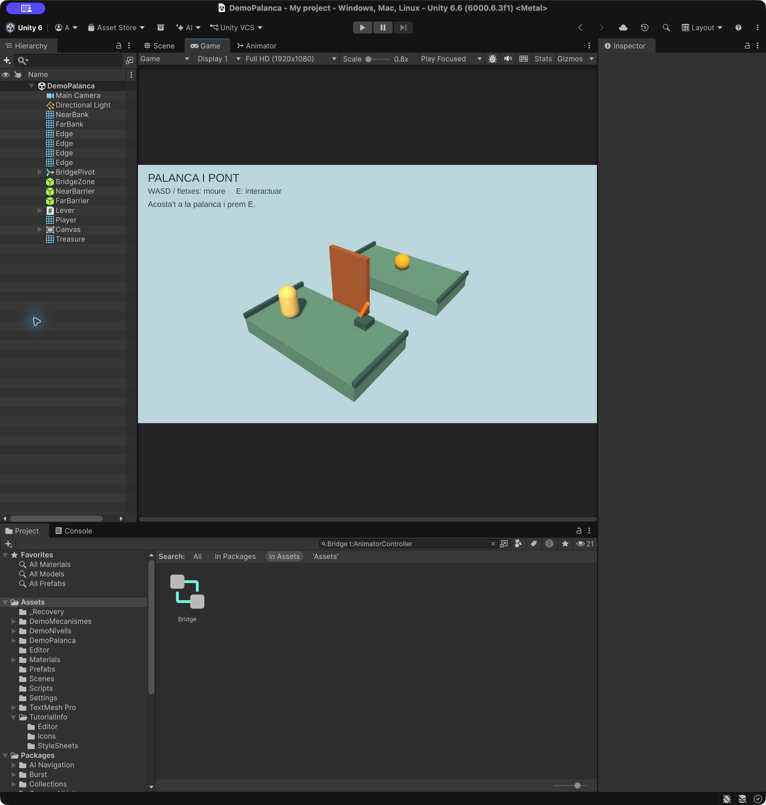
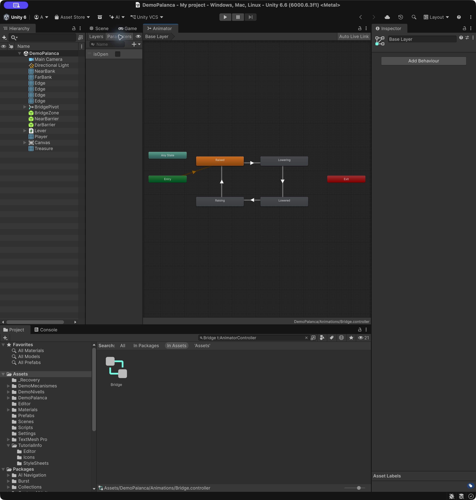
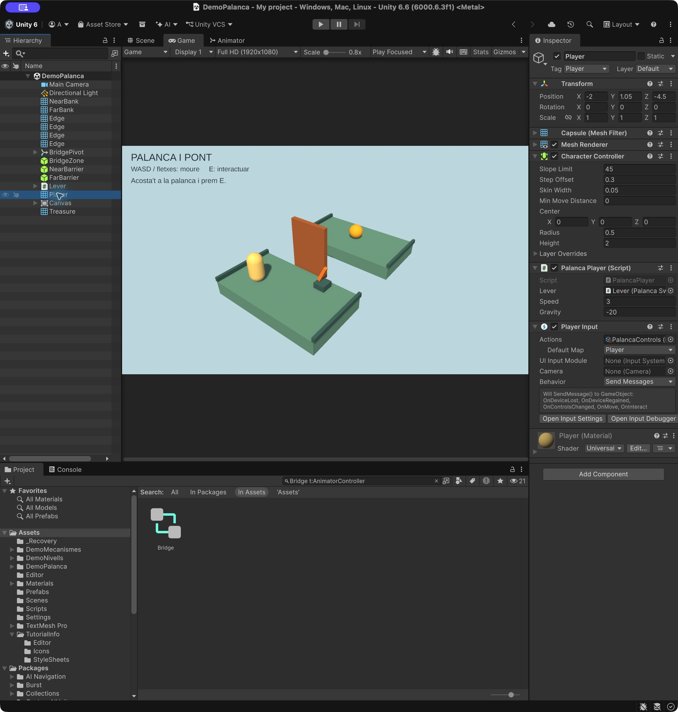
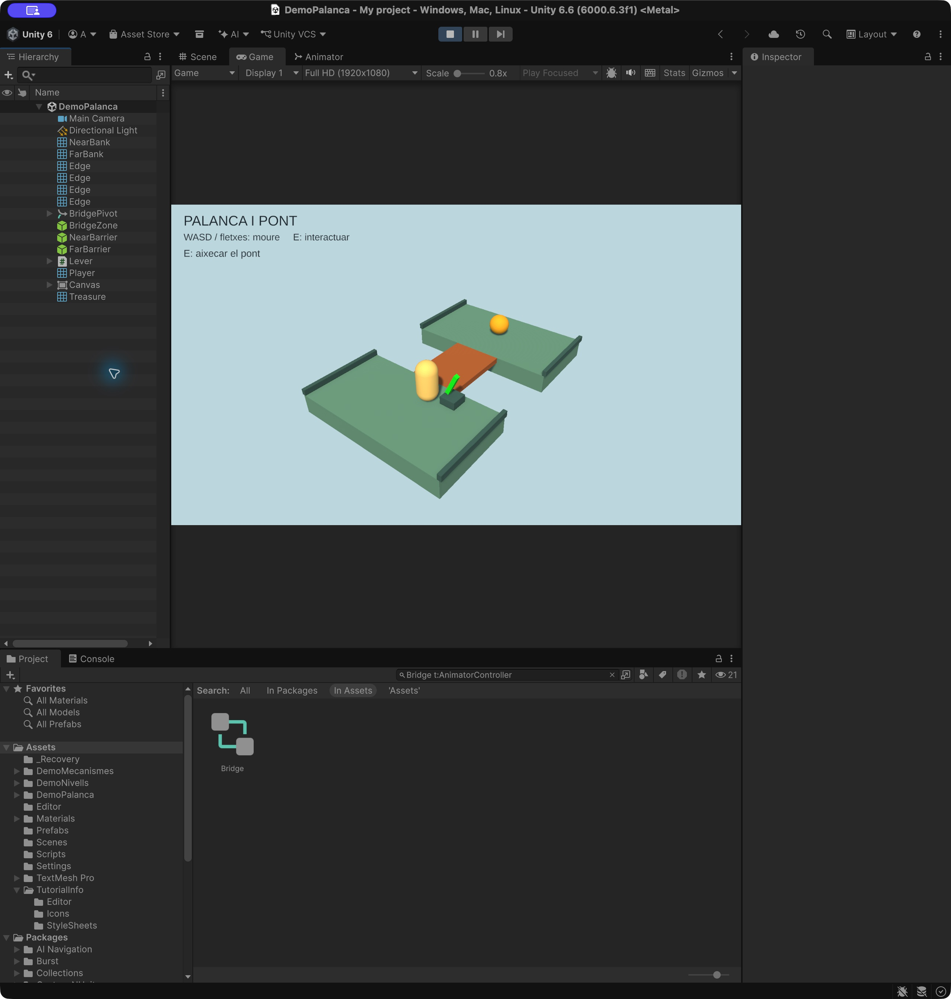

# Demo Palanca: Input Actions i un pont amb Animator

Construirem un petit diorama amb una **càpsula**, dues illes, una palanca i un pont llevadís. El jugador activa la palanca, espera que el pont baixi i el travessa per recollir una esfera daurada.

**Comencem des de zero.** No cal continuar cap altra demo. Les novetats són **Input Actions**, **PlayerInput** i **Animator**. La càpsula es mou per codi; el pont gira amb clips d’animació.

- **WASD o fletxes:** moure la càpsula sobre els eixos X/Z del món.
- **E:** utilitzar la palanca quan ets a prop.
- La palanca és taronja amb el pont aixecat i verda quan està abaixat.
- El pas queda bloquejat durant l’animació. No es pot aixecar el pont amb el jugador al damunt.
- Si caus per un lateral, tornes a la posició inicial. Per reiniciar tota la demo, atura Play i torna a prémer-lo.



**Projecte acabat:** [Demo-6-Palanca.zip](demos/Demo-6-Palanca.zip). [Instruccions per obrir-lo](demos/README.md).

## 1. Preparar el projecte

1. Crea un projecte **Universal 3D (URP)**. Versió utilitzada: **Unity 6.6, 6000.6.3f1**.
2. Comprova a **Window > Package Management > Package Manager** que **Input System** està instal·lat.
3. A **Edit > Project Settings > Player > Other Settings**, selecciona **Active Input Handling = Input System Package (New)** o **Both**. Reinicia si Unity ho demana.
4. A l’escena inicial **SampleScene** de Universal 3D, fes **File > Save As** i desa **Assets/Scenes/DemoPalanca.unity**. Conserva **Main Camera**, **Directional Light** i **Global Volume**. Més avall ajustarem la càmera i la llum existents. El component Transform de la càmera conserva **Scale `(1, 1, 1)`** i el tag **MainCamera**.
5. Crea **Assets/DemoPalanca** amb les carpetes **Scripts**, **Materials**, **Animations** i **Input**.
6. Importa **Window > TextMeshPro > Import TMP Essential Resources** si encara no hi ha els recursos de text. No cal importar Examples & Extras.

Els quatre scripts complets són més avall. Crea’ls tots abans de fer Play, perquè fan referència els uns als altres. El nom de cada fitxer ha de coincidir amb el de la classe.

**Coordenades i jerarquia:** abans de crear cada objecte independent, deixa de seleccionar qualsevol pare de la Hierarchy. Comprova que quedi a l’arrel. En crear un objecte buit, fes **Transform > ⋮ > Reset** i després introdueix els valors indicats. Les posicions de les taules són del món per als objectes a l’arrel; en els fills són **locals respecte al pare**. No facis fills del terra els murs ni el jugador. Si dupliques, revisa tots tres valors de Position, Rotation i Scale.

**Colors i materials:** a Project, dins de Materials, fes **clic dret > Create > Rendering > Material**. Obre el selector del color de **Base Map** i selecciona **RGB, rang 0–255**: introdueix R, G i B separadament. Deixa **A = 255**, excepte quan s’indiqui transparència. En el codi, `new Color(...)` continua utilitzant components entre 0 i 1.

**Interfície de Unity 6.6:** els textos i Canvas són a **GameObject > UI (Canvas)**; en altres versions el menú es diu UI. El menú Package Manager pot aparèixer directament sota Window en versions anteriors. El Canvas d’aquesta demo només mostra text: si Unity crea un **EventSystem**, elimina’l de la Hierarchy; no cal per llegir el teclat amb Input System.

## 2. Construir les illes i preparar la càmera

Crea materials **Universal Render Pipeline/Lit**, amb **Surface Type = Opaque**, **Metallic = 0**, **Smoothness = 0.15** i alfa 255.

| Material | Color RGB (0–255) |
|---|---|
| Bank | Verd grisós, `RGB (107, 156, 140)` |
| Edge | Verd fosc, `RGB (64, 102, 102)` |
| Bridge | Marró, `RGB (179, 102, 51)` |
| Player | Groc crema, `RGB (255, 219, 128)` |
| Handle | Taronja, `RGB (255, 140, 38)` |
| Gold | Daurat, `RGB (255, 186, 26)` |

Crea aquests **cubs**, independents a l’arrel, amb rotació zero i Box Collider sòlid. Les dues illes deixen un buit entre Z = -1.8 i Z = 1.8. La superfície de les illes queda a Y = 0.

| Objecte | Position | Scale | Material |
|---|---|---|---|
| NearBank | `(0, -0.5, -4)` | `(8, 1, 4.4)` | Bank |
| FarBank | `(0, -0.5, 4)` | `(8, 1, 4.4)` | Bank |
| NearLeftEdge | `(-4, 0.15, -4)` | `(0.2, 0.3, 4.4)` | Edge |
| NearRightEdge | `(4, 0.15, -4)` | `(0.2, 0.3, 4.4)` | Edge |
| FarLeftEdge | `(-4, 0.15, 4)` | `(0.2, 0.3, 4.4)` | Edge |
| FarRightEdge | `(4, 0.15, 4)` | `(0.2, 0.3, 4.4)` | Edge |

No posis un Plane sota el buit. Els petits marges laterals són decoratius: la càpsula pot sortir-ne i caure.

A Game, selecciona **16:9** o Full HD (1920×1080).

Configura **Main Camera**:

| Camp | Valor |
|---|---|
| Position | `(10, 11, -13)` |
| Rotation | `(33.85, -37.57, 0)` aproximadament; mira cap a `(0, 0, 0)` |
| Projection | Perspective |
| Field of View | `45` |
| Clipping Planes | Near `0.1`, Far `100` |
| Background Type | Solid Color |
| Background | Blau grisós clar, `RGB (196, 219, 224)` |

Al Directional Light existent, selecciona **Color** a Light Appearance i posa **Rotation = (50, -30, 0)** i **Intensity = 1.3**. A **Window > Rendering > Lighting > Environment**, selecciona una il·luminació ambiental de tipus **Color**, gris `RGB (140, 140, 140)`.

## 3. El pont i el seu pivot

El pont ha de girar des d’un extrem, no des del centre del cub.

1. Crea un objecte buit **BridgePivot** a **Position = (0, 0, -1.8)** i escala `(1, 1, 1)`.
2. Deixa’l inicialment amb rotació zero mentre construeixes el tauler.
3. Crea un cub **Deck** com a fill de BridgePivot.
4. Al Deck, configura **Local Position = (0, -0.15, 1.8)**, **Local Rotation = (0, 0, 0)** i **Local Scale = (2.6, 0.3, 3.6)**.
5. Assigna el material Bridge. Conserva el Box Collider, amb Is Trigger desactivat, però **desactiva el component Box Collider**: el codi l’activarà quan el pont estigui abaixat.
6. Gira **BridgePivot** a **Rotation X = -90**. El tauler queda aixecat. No giris Deck.

```text
BridgePivot     ← Animator i pivot de gir; escala 1
└─ Deck         ← cub desplaçat respecte al pivot; collider desactivat inicialment
```

A 0° el Deck cobreix el buit i la seva superfície queda a Y = 0. A -90° queda vertical a l’extrem proper. No afegeixis Rigidbody al pivot ni al Deck: no transportarem el jugador durant l’animació.

## 4. Crear els clips d’animació

Selecciona **BridgePivot** i obre **Window > Animation > Animation**. Prem **Create**, desa el primer clip com a **Assets/DemoPalanca/Animations/Raised.anim** i comprova que Unity ha afegit un **Animator** al pivot i ha creat un Animator Controller. Anomena aquest Controller **Bridge** i desa’l a Animations.

Crea els altres clips des del desplegable del clip de la finestra Animation amb **Create New Clip**. Tots animen **BridgePivot > Transform > Rotation**, no Deck. Deixa **Samples = 60**.

| Clip | Fotograma inicial | Fotograma final | Rotation X inicial → final |
|---|---:|---:|---|
| Raised | 0 | 1 | `-90 → -90` |
| Lowering | 0 | 72 | `-90 → 0` |
| Lowered | 0 | 1 | `0 → 0` |
| Raising | 0 | 72 | `0 → -90` |

72 fotogrames a 60 Samples equivalen a **1.2 segons**. En tots els clips, Rotation Y i Z valen 0.

Per crear les claus de cada clip:

1. Selecciona el clip al desplegable d’Animation.
2. Afegeix la propietat **Transform > Rotation** amb Add Property.
3. Activa el botó vermell **Record**, situa el cursor al fotograma 0 i escriu la rotació inicial a l’Inspector del pivot.
4. Situa el cursor al fotograma final i escriu la rotació final. Per als clips estàtics Raised i Lowered, afegeix també una clau al final amb el mateix valor.
5. Atura Record. A Curves, selecciona les claus de rotació i posa les tangents a **Linear** per obtenir una velocitat angular uniforme.
6. Selecciona cada `.anim` a Project i desactiva **Loop Time**. No han de repetir-se.

Si Unity representa -90 com a 270 a l’Inspector, és la mateixa orientació. Als clips utilitza els valors de la taula per fer un gir curt de 90°.

**Surt del mode de gravació i de previsualització** abans de continuar construint l’escena. Deixa BridgePivot a X = -90 fora de Play.

## 5. Configurar l’Animator Controller

Obre **Bridge.controller** amb doble clic. Ha de tenir aquests quatre estats, cadascun amb el clip homònim al camp **Motion**. Si un estat no hi és, arrossega el clip a la finestra Animator.

1. A Parameters, crea un paràmetre **Bool** amb el nom exacte **isOpen** i valor inicial desactivat.
2. Fes clic dret a **Raised > Set as Layer Default State**: ha de quedar taronja.
3. Crea les quatre transicions següents amb **Make Transition**.

| Transició | Has Exit Time | Exit Time | Conditions | Transition Duration |
|---|---|---|---|---|
| Raised → Lowering | No | — | `isOpen = true` | `0` |
| Lowering → Lowered | Sí | `1` | Cap | `0` |
| Lowered → Raising | No | — | `isOpen = false` | `0` |
| Raising → Raised | Sí | `1` | Cap | `0` |

No creïs transicions des d’Any State. No afegeixis condicions a les dues transicions que esperen el final del clip. Així baixar i pujar sempre es completen.

```text
Raised ── isOpen = true ──> Lowering
   ↑                           │ acaba el clip
   │ acaba el clip             ↓
Raising <── isOpen = false ── Lowered
```

Al component **Animator** de BridgePivot, assigna **Controller = Bridge**, desactiva **Apply Root Motion** i deixa **Culling Mode = Always Animate**. Els noms **Raised**, **Lowering**, **Lowered**, **Raising** i **Base Layer** han de coincidir amb els que comprova el codi.



## 6. Bloquejar el pas i detectar l’ocupació

Crea dos objectes buits amb un **Box Collider sòlid**, sense Renderer ni Rigidbody:

| Objecte | Position | Box Collider > Size |
|---|---|---|
| NearBarrier | `(0, 0.7, -1.95)` | `(2.8, 1.4, 0.2)` |
| FarBarrier | `(0, 0.7, 1.95)` | `(2.8, 1.4, 0.2)` |

Tots dos tenen Rotation zero, Scale `(1, 1, 1)` i Collider Center zero. Estan actius inicialment. Són barreres invisibles que tanquen els dos accessos mentre no es pot travessar el pont.

Crea un objecte buit **BridgeZone**, independent del pivot:

- Position `(0, 1, 0)`, Rotation zero i Scale `(1, 1, 1)`.
- **Box Collider:** Center zero, Size `(2.8, 2.2, 3.6)` i **Is Trigger** activat.
- **Rigidbody:** Is Kinematic activat i Use Gravity desactivat.
- Component **PalancaBridge**, que crearem més avall.

BridgeZone cobreix el pas del jugador i es queda immòbil quan gira el pont. La detecció d’ocupació i l’Animator són components en objectes diferents; els connectarem amb una referència.

## 7. La palanca, la càpsula i el tresor

Crea un objecte buit **Lever** a `(1.7, 0, -2.5)`, amb rotació zero i escala 1. Afegeix-li aquests fills:

| Fill | Tipus | Local Position | Local Rotation | Local Scale | Material |
|---|---|---|---|---|---|
| Base | Cube | `(0, 0.2, 0)` | `(0, 0, 0)` | `(0.8, 0.4, 0.8)` | Edge |
| Handle | Cube | `(0, 1, 0)` | `(0, 0, -25)` | `(0.2, 1.2, 0.2)` | Handle |

Conserva el collider sòlid de Base i elimina el collider de Handle. El mànec indicarà l’estat amb el color; l’Animator només anima el pont. Afegeix **PalancaSwitch** a Lever.

Crea una **Capsule** anomenada **Player** a `(-2, 1.05, -4.5)`, escala 1 i tag **Player**. Assigna el material Player, elimina el Capsule Collider original i afegeix **Character Controller**:

| Propietat | Valor |
|---|---|
| Center | `(0, 0, 0)` |
| Height | `2` |
| Radius | `0.5` |
| Step Offset | `0.3` |
| Skin Width | `0.05` |
| Min Move Distance | `0` |

Afegeix **PalancaPlayer** al Player. No li afegeixis Rigidbody. A l’apartat següent hi afegirem PlayerInput.

Crea una **Sphere** anomenada **Treasure** a `(0, 0.65, 4)`, escala `(1.1, 1.1, 1.1)` i material Gold. Activa **Is Trigger** al Sphere Collider, afegeix un **Rigidbody cinemàtic sense gravetat** i el component **PalancaTreasure**.

## 8. Input Actions i PlayerInput

A **Assets/DemoPalanca/Input**, fes **Create > Input Actions** i anomena l’asset **PalancaControls**. Obre’l amb doble clic. Si el menú està dins d’un submenú Input, tria igualment Input Actions.

1. Crea un **Action Map** anomenat **Player**.
2. Crea l’acció **Move**, amb **Action Type = Value** i **Control Type = Vector2**.
3. A Move, afegeix un **2D Vector Composite**. Segons la versió apareix com a **Add Up/Down/Left/Right Composite**. Assigna els quatre bindings a W, S, A i D, respectivament.
4. Afegeix un segon composite 2D Vector a Move, aquesta vegada amb les fletxes. Deixa els composites en mode Digital Normalized.
5. Crea **Interact**, amb **Action Type = Button** i un binding a **E**. No afegeixis Hold ni altres Interactions.
6. Desa amb **Save Asset** si Auto-Save no està activat. No cal generar una classe C# ni crear Control Schemes.

| Acció | Tipus | Bindings |
|---|---|---|
| Move | Value / Vector2 | Composite WASD i composite fletxes |
| Interact | Button | `<Keyboard>/e` |

Afegeix el component **Player Input** al **mateix GameObject Player** que té PalancaPlayer:

| Camp | Valor |
|---|---|
| Actions | PalancaControls |
| Default Map | Player |
| Behavior | Send Messages |

**Send Messages** crida mètodes segons el nom de l’acció: Move → `OnMove(InputValue value)` i Interact → `OnInteract(InputValue value)`. El component PalancaPlayer ha d’estar al mateix objecte. No escullis Invoke Unity Events: aquest exemple fa servir InputValue, no CallbackContext.

PlayerInput habilita el mapa Player. El nostre codi no consulta Keyboard.current: rep la intenció de moure’s o interactuar a través de les accions. Pots canviar una tecla a l’asset sense modificar l’script.



## 9. Text de la interfície

Crea **GameObject > UI (Canvas) > Text - TextMeshPro**. Si es demana, importa els recursos essencials. El text ha de ser fill d’un **Canvas**.

- Canvas: **Screen Space - Overlay**.
- Canvas Scaler: **Scale With Screen Size**, Reference Resolution `(1200, 900)` i Match `0.5`.
- Crea tres textos TMP anomenats **Title**, **Controls** i **Status**. Si ja tens el primer, reanomena’l i duplica’l dues vegades.
- A cada Rect Transform, posa els ancoratges mínim i màxim i el pivot a `(0, 1)`, mida `(1140, 60)` i escala 1. Els valors de posició següents són respecte de la cantonada superior esquerra.
- Utilitza la font LiberationSans SDF, alineació a l’esquerra, color blau molt fosc `RGB (20, 38, 46)` i **Raycast Target** desactivat.

| Text | Pos X / Y | Font Size | Contingut inicial |
|---|---|---:|---|
| Title | `30 / -20` | 34 | PALANCA I PONT |
| Controls | `30 / -66` | 23 | WASD / fletxes: moure — E: interactuar |
| Status | `30 / -105` | 24 | Acosta’t a la palanca i prem E. |

No cal cap EventSystem per llegir el teclat amb PlayerInput ni per mostrar aquests textos sense botons. Si Unity n’ha creat un automàticament, pots eliminar-lo en aquesta demo.

## 10. Scripts complets

Crea els quatre fitxers següents a **Assets/DemoPalanca/Scripts**. Desa’ls tots i espera que desapareguin els errors de compilació abans d’assignar les referències.

### PalancaPlayer.cs

Rep les accions de PlayerInput. El valor de Move es guarda i s’aplica cada Update; quan deixes anar les tecles, l’acció envia un Vector2 zero. Interact només actua en prémer el botó.

```csharp
using UnityEngine;
using UnityEngine.InputSystem;

// Unity afegeix un Character Controller si l'objecte encara no en té.
[RequireComponent(typeof(CharacterController))]
public class PalancaPlayer : MonoBehaviour
{
    public PalancaSwitch lever;
    public float speed = 3f;
    public float gravity = -20f;
    private CharacterController controller;
    private Vector2 moveInput;
    private float verticalSpeed;
    private Vector3 startPosition;

    void Awake()
    {
        // Obtén el controlador del mateix objecte per moure'l respectant els colliders.
        controller = GetComponent<CharacterController>();
        // Desa la posició inicial per poder-hi tornar si el jugador cau o reinicia.
        startPosition = transform.position;
    }

    // Player Input crida aquest mètode quan canvia l'acció Move configurada amb Send Messages.
    public void OnMove(InputValue value)
    {
        // Desa els dos eixos d'entrada; Update els convertirà en moviment sobre X i Z.
        moveInput = value.Get<Vector2>();
    }

    // Player Input envia aquí l'acció Interact; la palanca comprovarà si és prou a prop.
    public void OnInteract(InputValue value)
    {
        // Intenta activar la palanca en prémer el botó, no quan es deixa anar.
        if (value.isPressed) lever.TryUse();
    }

    void Update()
    {
        // Limita l'entrada per mantenir la mateixa velocitat en diagonal.
        Vector2 input = Vector2.ClampMagnitude(moveInput, 1f);
        Vector3 direction = new Vector3(input.x, 0f, input.y);
        if (controller.isGrounded && verticalSpeed < 0f) verticalSpeed = -2f;
        // Acumula la caiguda: CharacterController.Move no aplica gravetat automàticament.
        verticalSpeed += gravity * Time.deltaTime;
        controller.Move((direction * speed + Vector3.up * verticalSpeed) * Time.deltaTime);
        if (transform.position.y < -6f)
        {
            // Desactiva temporalment el controlador per recol·locar el personatge directament.
            controller.enabled = false;
            transform.position = startPosition;
            controller.enabled = true;
            verticalSpeed = 0f;
        }
    }
}
```

### PalancaBridge.cs

Es col·loca a **BridgeZone**. Envia el bool isOpen a l’Animator, consulta l’estat actual i només habilita el tauler quan s’ha arribat a Lowered. Les barreres es tornen a activar immediatament quan es demana un canvi. El bool isOpen de l’Animator és una petició; la propietat IsOpen del nostre component indica que ja ha acabat la baixada. El conjunt occupants evita aixecar el pont si encara hi ha un collider del jugador dins. La comprovació de bounds també descarta ocupants que han estat teletransportats fora de la zona.

```csharp
using UnityEngine;
using System.Collections.Generic;

public class PalancaBridge : MonoBehaviour
{
    public Animator animator;
    public Collider deckCollider;
    public Collider[] barriers;
    // Guarda els colliders del jugador que ocupen el pont, sense duplicats.
    private readonly HashSet<Collider> occupants = new HashSet<Collider>();
    private bool requestedOpen;
    private Collider zone;

    public bool IsOpen { get; private set; }
    public bool IsMoving { get; private set; }
    // TryToggle consulta si hi ha algú al pont; la palanca també ho mostra al panell.
    public bool IsOccupied => occupants.Count > 0;

    void Awake()
    {
        zone = GetComponent<Collider>();
    }

    void Update()
    {
        // Neteja contactes antics, inclosos objectes desactivats o que ja no són dins de la zona.
        occupants.RemoveWhere(c => c == null || !c.enabled || !c.gameObject.activeInHierarchy
            || !zone.bounds.Intersects(c.bounds));
        // Llegeix l'estat de la primera capa de l'Animator per saber en quin punt és l'animació.
        AnimatorStateInfo state = animator.GetCurrentAnimatorStateInfo(0);
        bool transitioning = animator.IsInTransition(0);
        // Considera el pont obert al pas quan és abaixat i no està en una transició.
        IsOpen = state.IsName("Base Layer.Lowered") && !transitioning;
        bool settled = state.IsName(requestedOpen ? "Base Layer.Lowered" : "Base Layer.Raised");
        IsMoving = transitioning || !settled;
        // Permet trepitjar el tauler només quan està abaixat i aturat.
        deckCollider.enabled = IsOpen && !IsMoving;
        // Bloqueja els accessos mentre no es pot passar pel tauler.
        foreach (Collider barrier in barriers) barrier.enabled = !deckCollider.enabled;
    }

    public bool TryToggle()
    {
        // Rebutja l'acció si el pont encara es mou o hi ha un jugador a sobre.
        if (IsMoving || IsOccupied) return false;
        // Alterna entre demanar que el pont baixi i que pugi.
        requestedOpen = !requestedOpen;
        IsMoving = true;
        deckCollider.enabled = false;
        foreach (Collider barrier in barriers) barrier.enabled = true;
        // Canvia el paràmetre de l'Animator que activa les transicions del pont.
        animator.SetBool("isOpen", requestedOpen);
        return true;
    }

    // Unity avisa quan un collider entra al trigger; other identifica l'objecte que hi entra.
    void OnTriggerEnter(Collider other)
    {
        if (other.CompareTag("Player")) occupants.Add(other);
    }

    // Unity avisa quan un collider surt del trigger.
    void OnTriggerExit(Collider other)
    {
        occupants.Remove(other);
    }
}
```

### PalancaSwitch.cs

Es col·loca a **Lever**. Comprova la distància 3D entre els pivots, actualitza el color i mostra el missatge. PalancaPlayer li demana la interacció; PalancaBridge decideix si el canvi és possible.

```csharp
using UnityEngine;
using TMPro;

public class PalancaSwitch : MonoBehaviour
{
    public Transform player;
    public PalancaBridge bridge;
    public Renderer handleRenderer;
    public TMP_Text statusText;
    public float interactionDistance = 2.5f;
    private Material ownMaterial;
    private bool won;

    void Awake()
    {
        ownMaterial = handleRenderer.material;
    }

    public void TryUse()
    {
        // La palanca només respon si el jugador és dins de la distància d'interacció.
        if (Vector3.Distance(player.position, transform.position) > interactionDistance) return;
        bridge.TryToggle();
    }

    public void Win()
    {
        won = true;
    }

    void Update()
    {
        // Mostra l'estat del pont amb el color de la palanca i el missatge del panell.
        ownMaterial.SetColor("_BaseColor", bridge.IsOpen ? Color.green : new Color(1f, 0.55f, 0.15f));
        if (won) statusText.text = "Repte completat!";
        else if (bridge.IsMoving) statusText.text = "Espera que el pont acabi de moure's.";
        else if (bridge.IsOccupied) statusText.text = "Pont ocupat: no es pot aixecar.";
        else if (Vector3.Distance(player.position, transform.position) <= interactionDistance)
            statusText.text = bridge.IsOpen ? "E: aixecar el pont" : "E: abaixar el pont";
        else statusText.text = "Acosta't a la palanca i prem E.";
    }

    void OnDestroy()
    {
        // Allibera la còpia del material creada per aquest script.
        if (ownMaterial != null) Destroy(ownMaterial);
    }
}
```

### PalancaTreasure.cs

Es col·loca a **Treasure**. En entrar el Player, mostra la victòria i desactiva l’esfera.

```csharp
using UnityEngine;

public class PalancaTreasure : MonoBehaviour
{
    public PalancaSwitch lever;
    private bool collected;

    // Unity avisa quan un collider entra al trigger; other identifica l'objecte que hi entra.
    void OnTriggerEnter(Collider other)
    {
        if (collected || !other.CompareTag("Player")) return;
        collected = true;
        // El tresor avisa la palanca perquè mostri el missatge de repte completat.
        lever.Win();
        // Amaga l'objecte i desactiva els seus components després de recollir-lo.
        gameObject.SetActive(false);
    }
}
```

## 11. Assignar les referències

Atura Play. Arrossega els objectes de la **Hierarchy** als camps dels components; tenir els scripts a Assets no els afegeix automàticament als objectes.

| Objecte / component | Camp | Assignació |
|---|---|---|
| Player / PalancaPlayer | Lever | Lever |
| Player / PalancaPlayer | Speed / Gravity | `3 / -20` |
| Player / PlayerInput | Actions / Default Map / Behavior | PalancaControls / Player / Send Messages |
| BridgePivot / Animator | Controller | Bridge.controller |
| BridgeZone / PalancaBridge | Animator | BridgePivot |
| BridgeZone / PalancaBridge | Deck Collider | BridgePivot / Deck |
| BridgeZone / PalancaBridge | Barriers > Size | `2` |
| BridgeZone / PalancaBridge | Barriers > Element 0 / 1 | NearBarrier / FarBarrier |
| Lever / PalancaSwitch | Player | Player |
| Lever / PalancaSwitch | Bridge | BridgeZone |
| Lever / PalancaSwitch | Handle Renderer | Lever / Handle |
| Lever / PalancaSwitch | Status Text | Canvas / Status |
| Lever / PalancaSwitch | Interaction Distance | `2.5` |
| Treasure / PalancaTreasure | Lever | Lever |

Deixa tots els GameObjects actius. Només el component **Box Collider de Deck** comença desactivat. El script el tornarà a activar al final de l’animació de baixada.

Desa l’escena amb aquesta estructura principal:

```text
DemoPalanca
├─ Main Camera
├─ Directional Light
├─ Global Volume
├─ NearBank / FarBank
├─ NearLeftEdge / NearRightEdge / FarLeftEdge / FarRightEdge
├─ BridgePivot                Animator
│  └─ Deck                   Mesh Renderer + Box Collider
├─ BridgeZone                trigger + Rigidbody cinemàtic + PalancaBridge
├─ NearBarrier / FarBarrier  Box Colliders sòlids
├─ Lever                     PalancaSwitch
│  ├─ Base
│  └─ Handle
├─ Player                    CharacterController + PalancaPlayer + PlayerInput
├─ Treasure                  trigger + Rigidbody cinemàtic + PalancaTreasure
└─ Canvas
   ├─ Title
   ├─ Controls
   └─ Status
```

## 12. Provar la demo

Fes Play i clica Game. Prova tant WASD com les fletxes.

1. **Lluny de la palanca:** E no ha de moure el pont.
2. **A prop de la palanca:** apareix «E: abaixar el pont». Prem E una vegada.
3. **Durant la baixada:** el pont gira durant 1.2 segons, el pas queda bloquejat i una altra pulsació no inverteix l’animació.
4. **Pont abaixat:** el mànec és verd, el Deck té collider i es pot travessar. Pots mirar com l’Animator ha passat a Lowered.
5. **Pont ocupat:** situa’t al principi del tauler, a prop de la palanca, i prem E. S’ha de mantenir abaixat. Si ets al centre, també estàs massa lluny de la palanca; per provar específicament l’ocupació fes-ho a l’extrem proper.
6. **Aixecar-lo:** torna a l’illa propera, deixa de trepitjar el tauler i prem E. Ha de passar per Raising fins a Raised.
7. **Guanyar:** torna a abaixar-lo, travessa’l i toca l’esfera. Desapareix i es mostra «Repte completat!».
8. **Canviar un binding:** fora de Play, canvia Interact de E a una altra tecla, desa l’asset i torna a provar. No cal canviar el codi; el text de la UI continua dient E fins que també l’actualitzis.




## Si alguna cosa no funciona

| Símptoma | Comprova |
|---|---|
| La càpsula no es mou | Focus de Game; paquet Input System; PlayerInput habilitat amb Actions i Default Map assignats; OnMove al mateix objecte |
| MissingMethodException d’OnMove o OnInteract | Behavior = Send Messages; noms exactes i mètodes amb InputValue |
| E no funciona | Binding Interact; distància 2.5; pont immòbil i sense ocupants; camp Lever del Player |
| El pont no gira | Animator al pivot, Controller assignat, bool isOpen escrit igual i quatre transicions correctes |
| Gira sobre el centre | Deck ha de ser fill desplaçat del pivot; el clip anima BridgePivot |
| Fa una volta llarga o gira malament | Claus de Rotation X -90 i 0, Y/Z a 0, sense claus addicionals ni animació de Deck |
| S’encalla entre estats | Exit Time 1 als clips de moviment, Duration 0, Loop Time desactivat i cap condició a les transicions de final de clip |
| Es cau quan el pont està abaixat | Deck Collider assignat; estat anomenat Lowered a Base Layer; altura i mides de les illes i del Deck |
| No es pot tornar a aixecar | El jugador encara pot solapar BridgeZone amb el seu radi; allunya’t una mica del tauler sense sortir del radi de la palanca |
| No es pot travessar amb el pont obert | NearBarrier i FarBarrier assignats a la llista; Deck és sòlid, no trigger |
| La palanca no canvia de color | Material URP/Lit, Handle Renderer assignat |
| No apareix el text o la victòria | Canvas i TMP; Status Text; Rigidbody cinemàtic i Is Trigger al Treasure; tag Player |

## Referència de teoria

- [Entrada: Input Actions i PlayerInput](<Teoria-2-Entrada.md>).
- [Animator, clips, paràmetres i transicions](<Teoria-7-Animacions.md>).
- [Referències i jerarquia](<Teoria-1-Referencies i jerarquia.md>).
- [Física i col·lisions](<Teoria-4-Fisica i collisions.md>).
- [Moviment del jugador](<Teoria-8-Moviment del jugador.md>).

## Desar i tornar a obrir

Atura Play i desa l’escena amb **File > Save**. A **File > Build Profiles > Scene List**, afegeix l’escena oberta amb **Add Open Scenes** i deixa aquesta demo com a primera escena activada; treu SampleScene de la llista.

Al ZIP d’aquesta pràctica, un petit script dins d’**Assets/Editor** obre aquesta escena la primera vegada que s’importa el projecte. No forma part del joc. En les obertures següents Unity conserva l’escena on estaves treballant. Si cal recuperar la demo, utilitza **Demo > Obrir escena principal**. La primera vegada, els materials poden trigar una estona a mostrar els colors correctes.
