# Terrenys

Unity té una eina específica per definir terrenys.

Per crear un nou terreny:

- A la **"Hierarchy"** afegeix un nou **"3D Object > Terrain"**

- Allunya el nivell de *Zoom*, veuràs que ha creat un terreny plà molt gran en comparació a l'escena inicial.

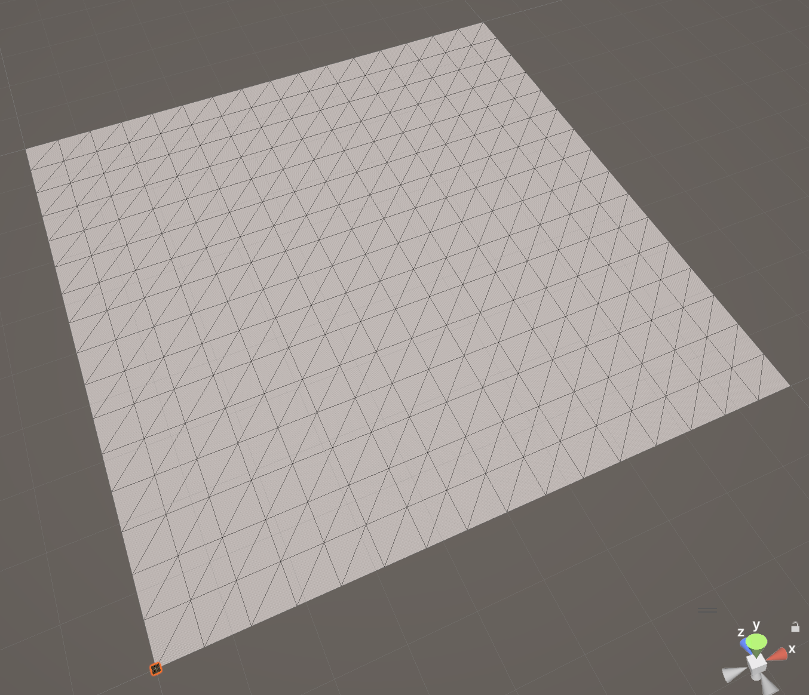

 

## Terrain Settings

Per defecte *Unity* crea un terreny de mida **1000×1000**, si es vol canviar els paràmetres de mida o resolució de la malla cal fer-ho al panell *"Terrain Settings"* apretant la última pestanya del component *"Terrain"* a l'inspector.

Canvia les configuracions:

- Terrain Settings > Mesh Resolution > Terrian Width: 100
- Terrain Settings > Mesh Resolution > Terrian Length: 100

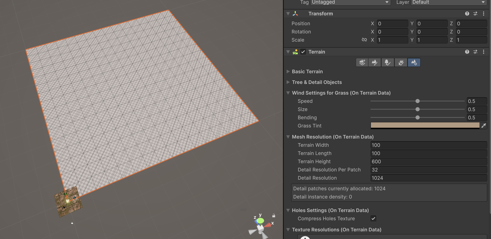

 

## Paint Terrain

El primer que cal fer és definir les parts del terreny que estàn més elevades (i les que estàn més enfonsades).

Amb el mode **Sculpt** es pot *pintar* sobre del terreny, per canviar el nivell d'alçada.

- Amb el 'mouse apretat' 'eleves' el terreny.
- Amb 'mayúscules/shift' i el 'mouse apretat' l'enfonses.

> **Nota:** No es pot enfonsar el terreny, més que la base. Si es necessita terreny per sota del 0, posar una *"Position Y negativa"*.

Els paràmetres:

- **Brushes**: Estil de *"dibuix"* al elevar el terreny
- **Brush Size**: Amplada de l’àrea afectada de l'elevació
- **Opacity**: Intensitat de l’efecte del pinzell

Escull les opcions:

- **Brushes**: "builtin_brush_2"
- **Brush Size**: 25
- **Opacity**: 5

Fes unes petites "muntanyes" al terreny

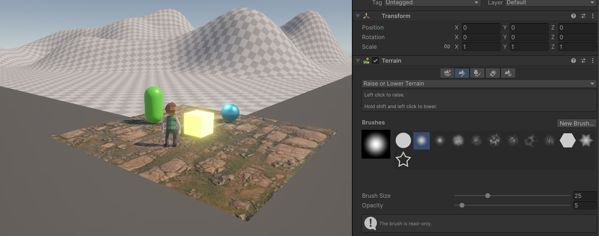

 

## Paint Trees

Importa els assets de:

[Low-Poly Simple Nature Pack](https://assetstore.unity.com/packages/3d/environments/landscapes/low-poly-simple-nature-pack-162153)

Veuràs que la carpeta *"Assets > SimpleNaturePack > Prefabs"* es veu en lila, cal transformar-la amb:

*"Menú Window > Rendering > Render Pipeline Converter"*

- Escull totes les opcions
- Fes "Initialize and Convert"

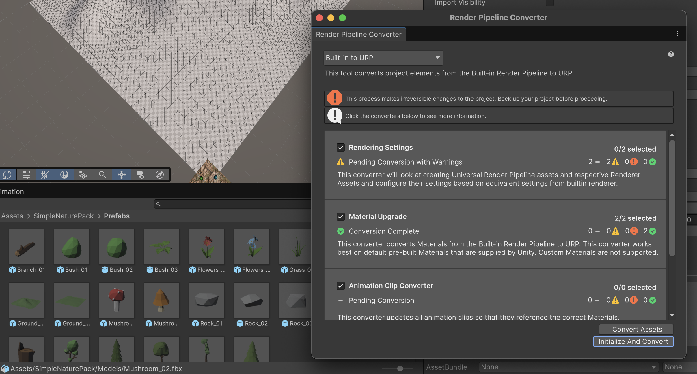

 

Per posar arbres al terreny, cal afegir-los a la eina de terrenys.

- Escull la opció **"Paint Trees"**

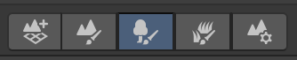

 

- Escull la opció **"Edit Trees > Add Tree"**

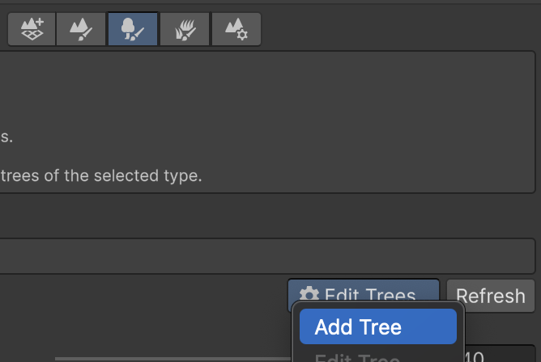

 

Des de la carpeta *"Assets > Simple Nature Pack > Prefabs"*

- Arrossega el tipus d'arbre que vols afegir al terreny, arrossegant-lo cap a la opció **"Tree Prefab"**

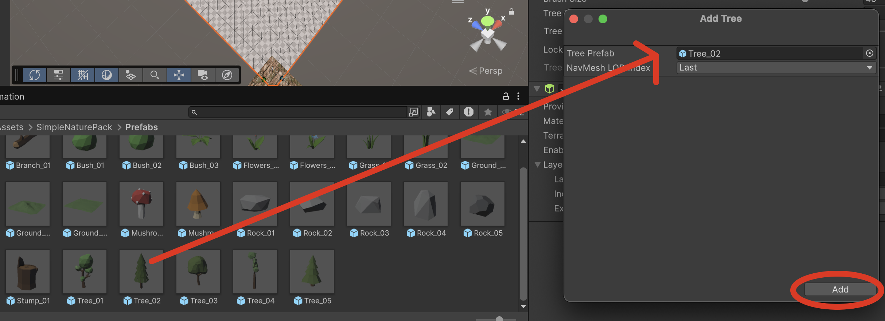

 

- Apreta el botó **"Add"**

> **Nota:** Pots afegir tants tipus d'objectes com volguis, no només arbres, també arbustos, pedres, volets, ...

Modifica els valors, per pintar més/menys arbres:

- Brush Size: 20
- Tree Density: 10

Pinta diferents tipus de arbres, arbustos i bolets

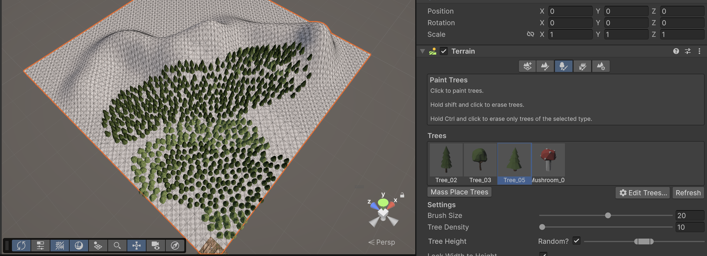

 

Prova com es veu durant la partida:

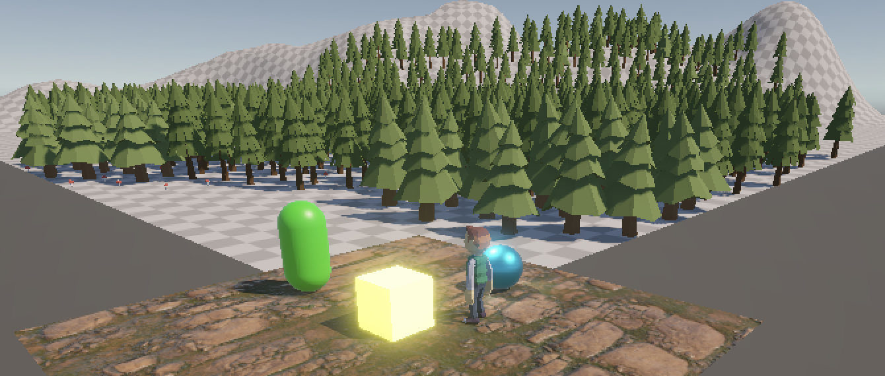

 

Si n'hi ha masses, esborra'ls amb la tecla **"Shift"** apretada, enlloc d'afegir arbres els esborrarà.

Torna a pintar arbres, però aquest cop amb els paràmetres:

- Brush Size: 1
- Tree Density: 10

Veuràs que pots definir a nivell de arbre on els vols posar:

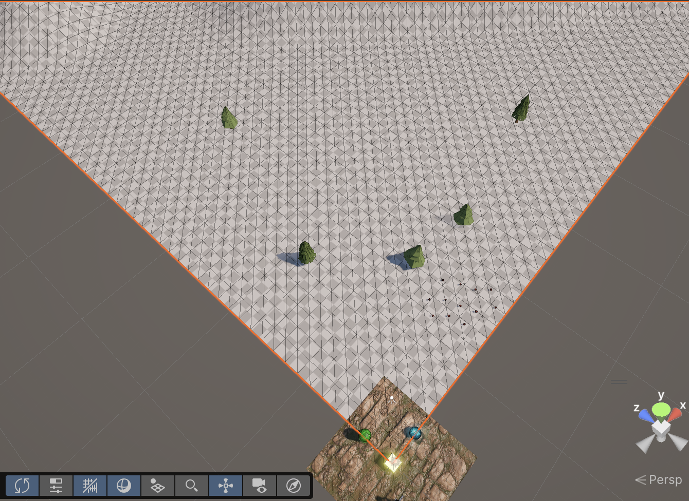

 

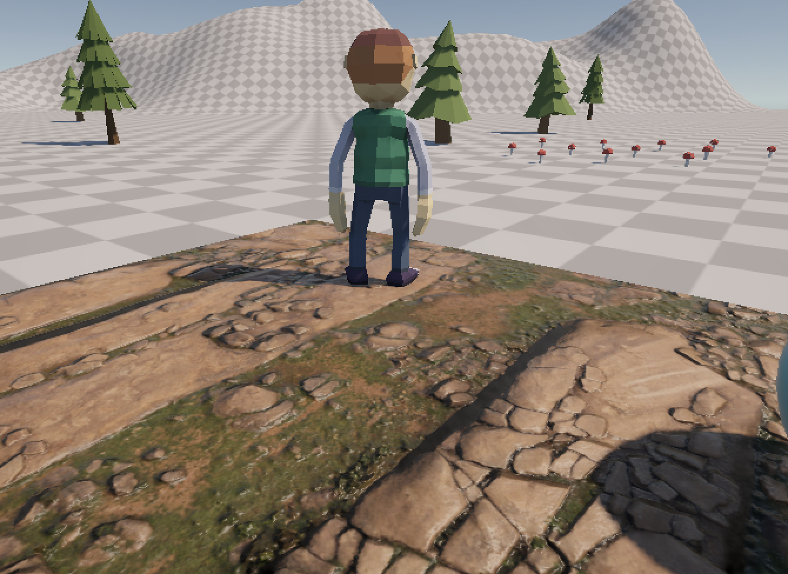

 

## LOD (level of detail)

Cal fixar-se que els objectes **prefab** per afegir **"arbres"** o decoracions als terrenys. Tenen diverses representacions, segons la distànca que estàn del càmera. 

D'això se'n diu **"Level of detail (LOD)"**, és a dir tenir models més detallats quan estàn aprop de la càmera i amb menys polígons quan estàn més lluny.

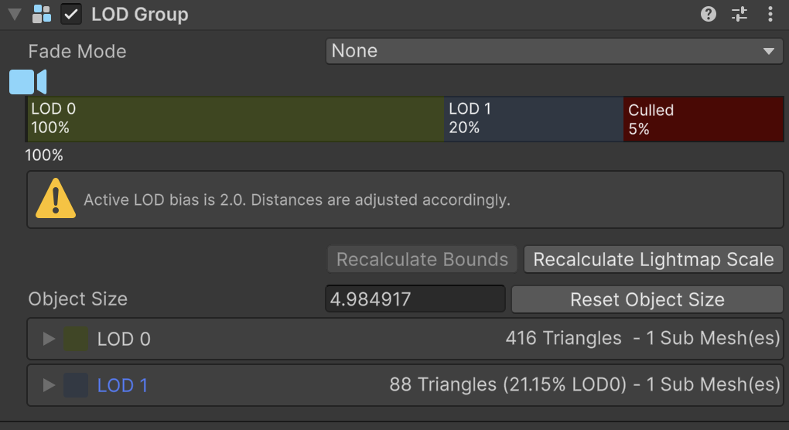

 

A la imatge anterior veiem dos objectes amb dos nivells de detall diferents. A la **"hierarchy"** del *prefab* també es pot veure:

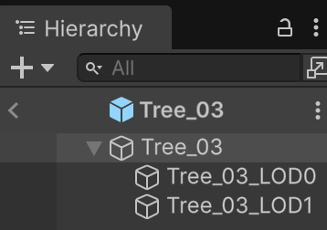

 

I al *prefab* per cada objecte:

**LOD0**:

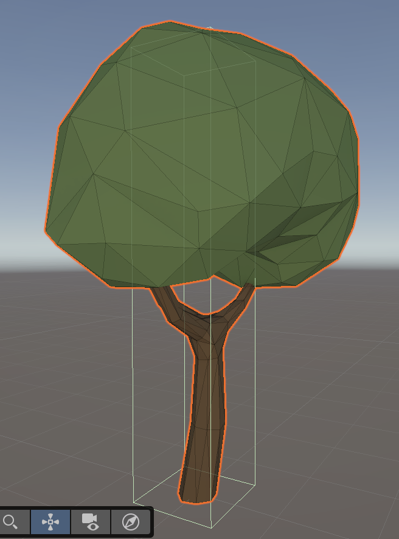

**LOD1**:

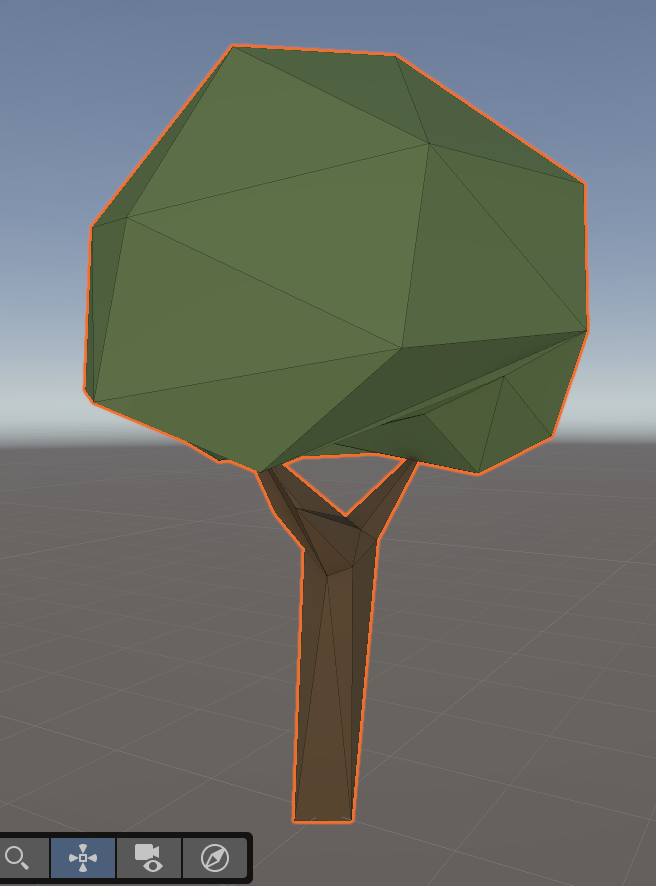

 

## Paint Details

La opció **"Paint Details"** serveix per afegir detalls petits i nombrosos al un terreny.

- **Herba 2D**: imatges planes que sempre miren a la càmera (ideal per gespa, flors petites).

- **Detalls 3D**: prefabs petits i lleugers (pedres petites, arbustos baixos...).

Són objectes molt més lleugers que els “Trees”, pensats perquè se’n puguin instanciar milers sense col·lapsar el rendiment.

### Crear herva 'Mesh'

- Navega a:

*"Assets > Simple Nature Pack > Models"*

- Arrossega **"Grass_01"** a la **"Hierarchy"**

- Amb el *"botó dret"* sobre l'objecte **"Gras_01"** escull la opció:

*"Prefab > Unpack"*

Veuràs que ha deixat de ser un objecte amb dos nivells de detall **LOD** i han passat a ser dos objectes *"normals"*

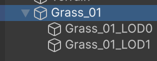

 

Crea un nou material a la carpeta **"Assets > Materials"**, anomena'l **Grass**, dona-li un **Base Map**, amb les propietats:

- Base Map: (color verd)
- Enable GPU Instancig: **activat**

 

Assigna'l a l'objecte **"Grass_01_LOD0"**

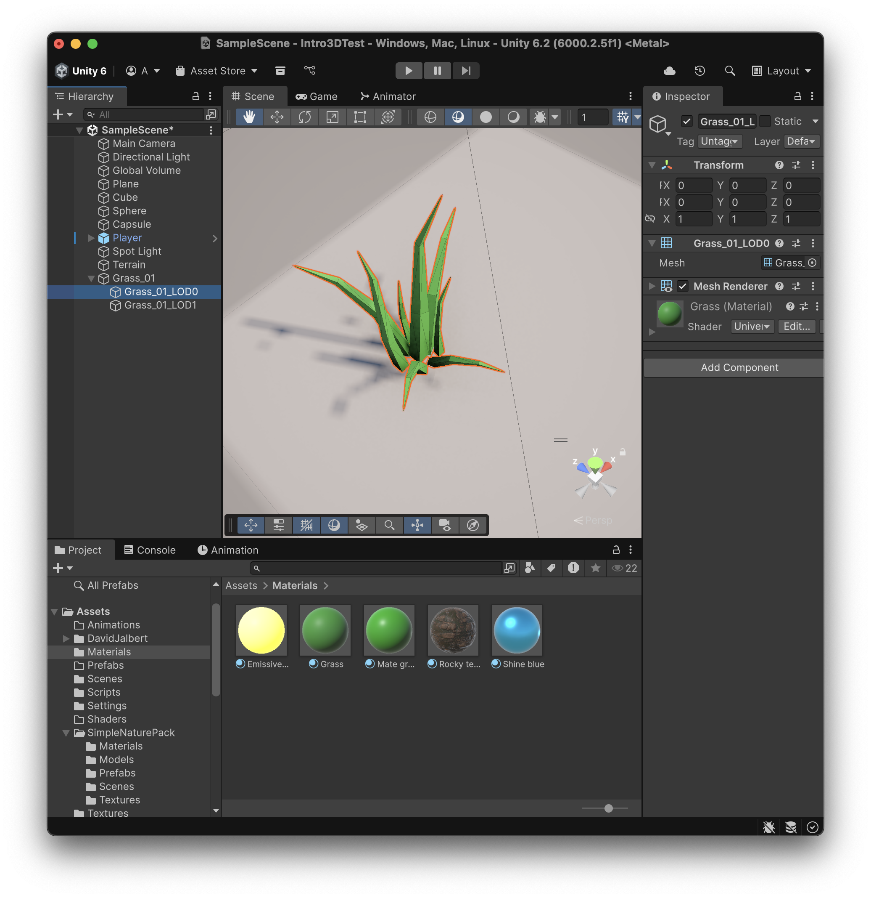

 

Arrossega l'objecte **"Grass_01_LOD0"** cap a la carpeta **"Assets > Prefabs"** i renombra'l a **"Grass Mesh"**

 

Esborra l'objecte **"Grass_01"** de la hierarchy.

### Assignar herva 'Mesh'

Igual que amb els arbres (objectes grans), cal definir els objectes que farem servir per "pintar" detalls.

- Escull la opció **"Paint Details"**

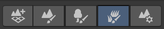

 

- Escull la opció **"Edit Details > Add Detail Mesh"**

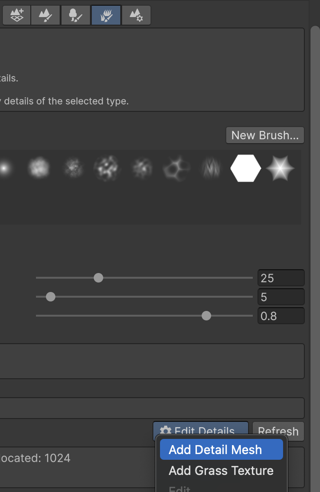

 

Des de la carpeta *"Assets > Simple Nature Pack > Prefabs"*

- Arrossega el tipus d'herva que vols afegir al terreny, arrossegant-lo cap a la opció **"Detail Prefab"** i apreta **"Add"**

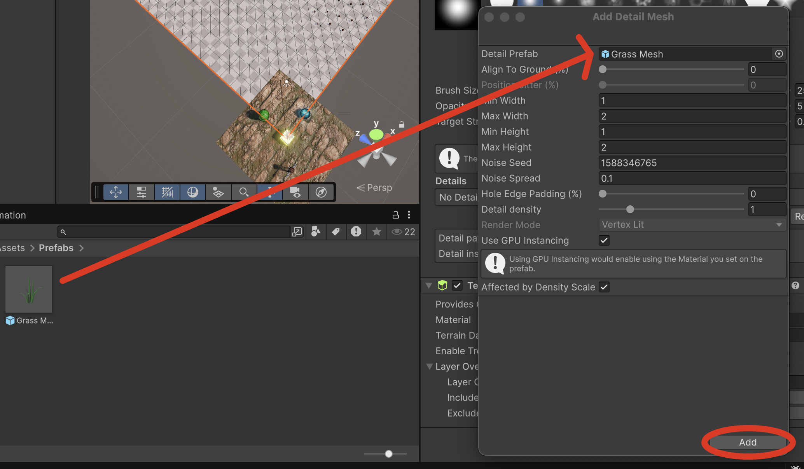

 

- Pinta la herva sobre el terreny:

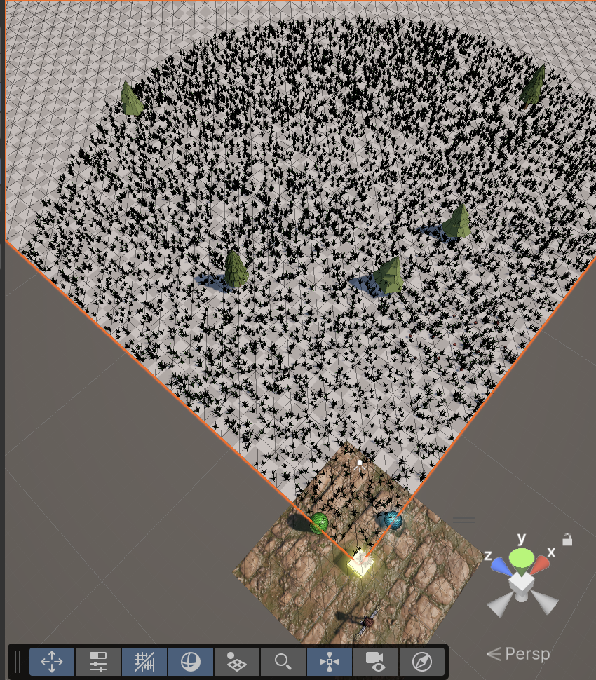

 

- Mira com es veu al joc:

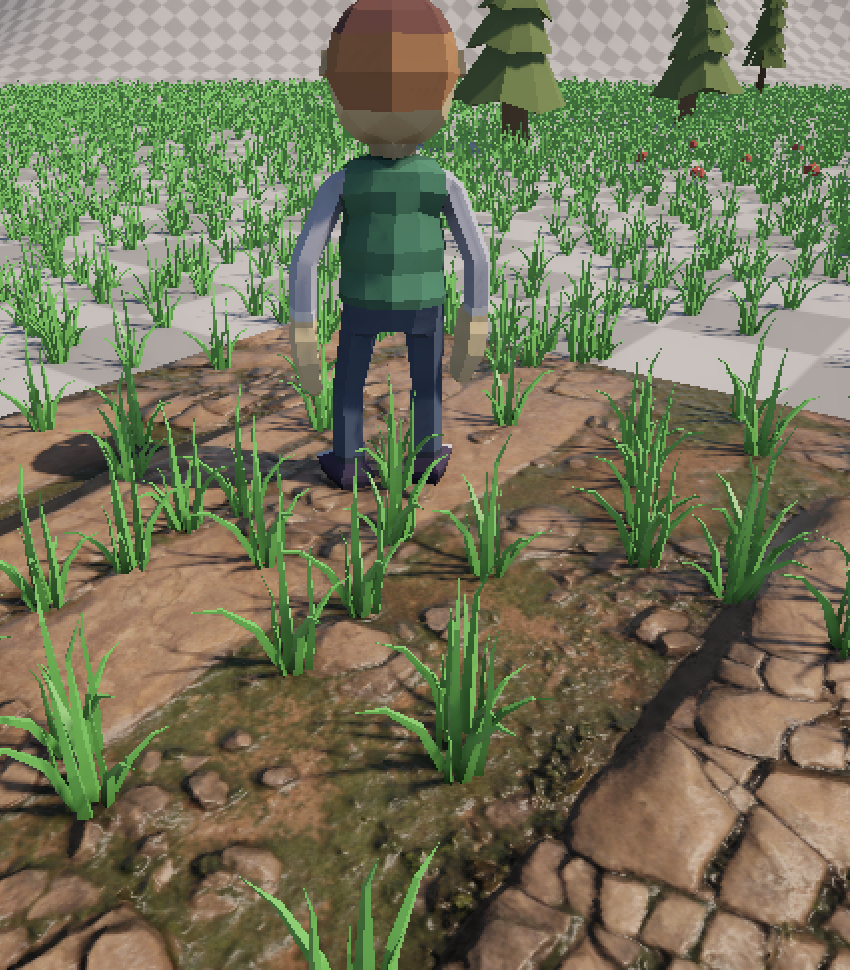

 

## Textures al terra

