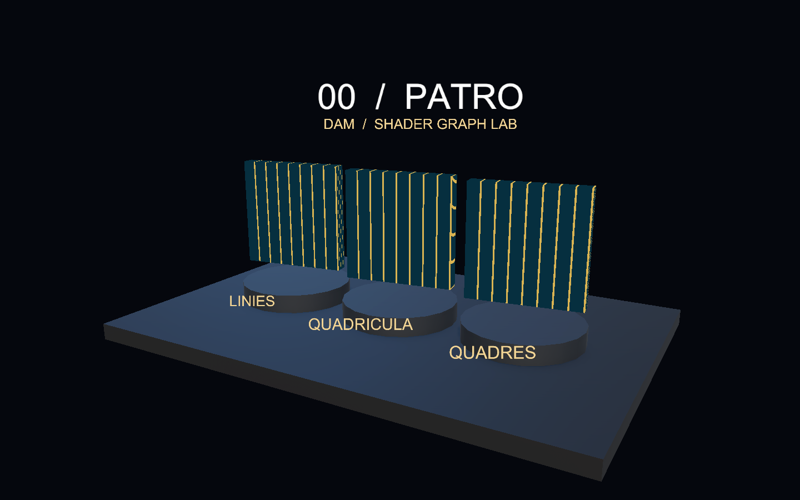
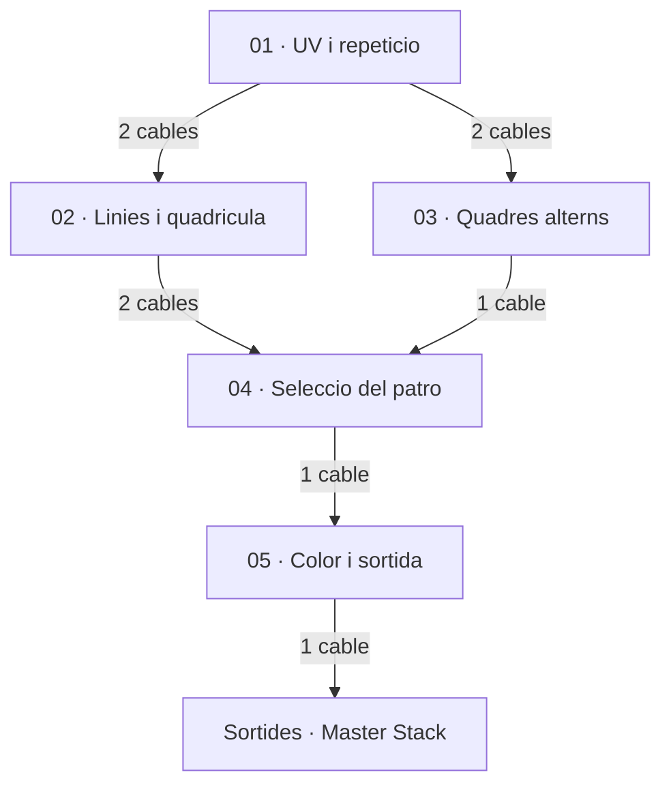
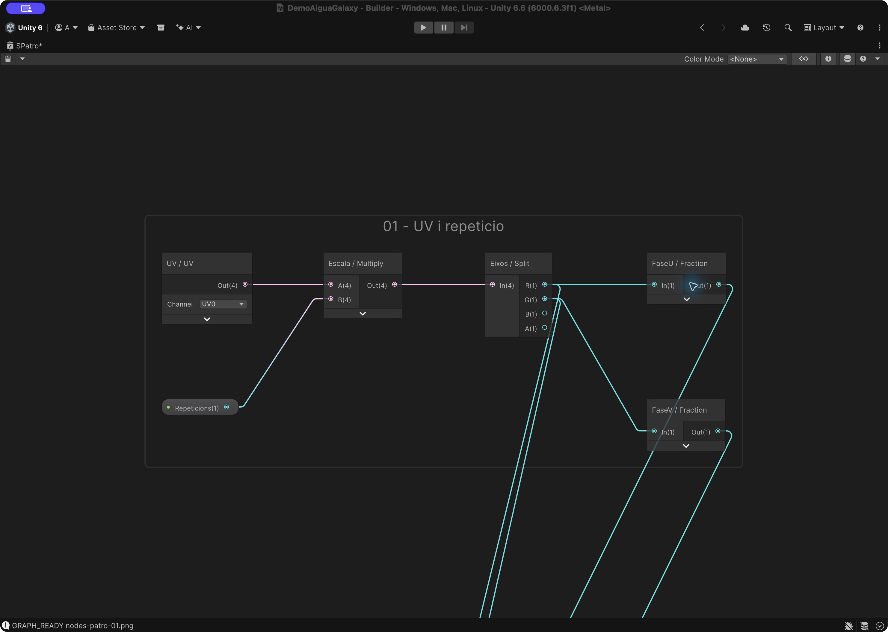
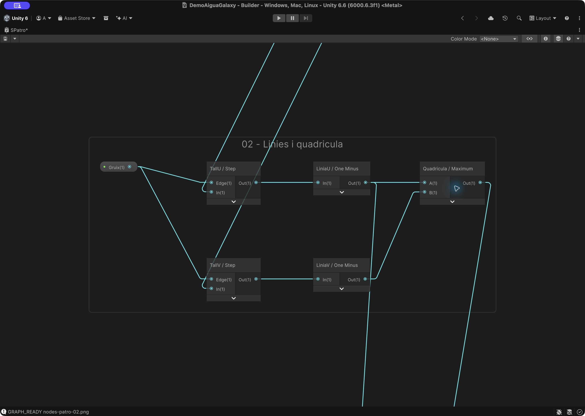
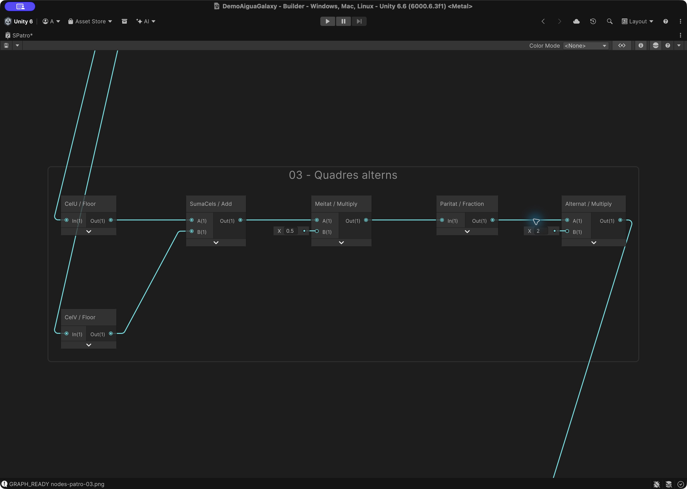
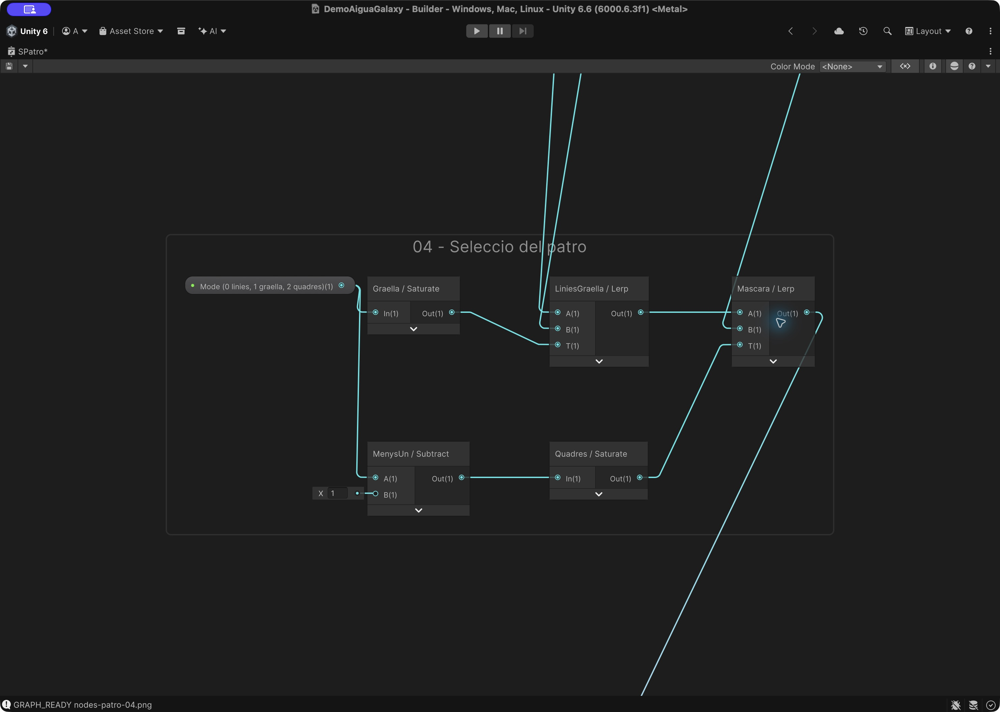
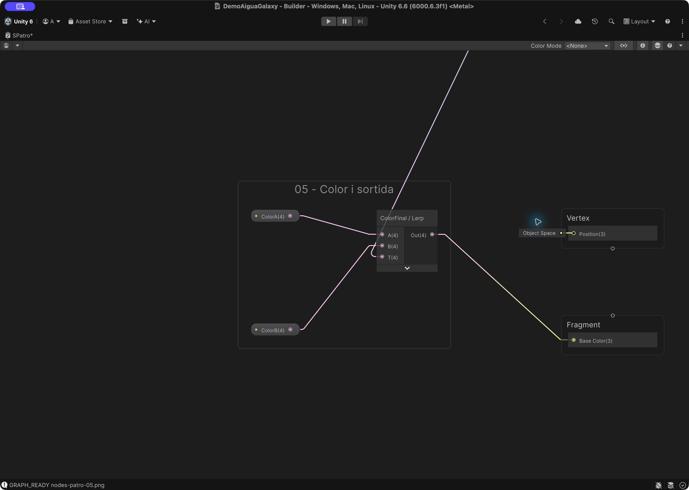
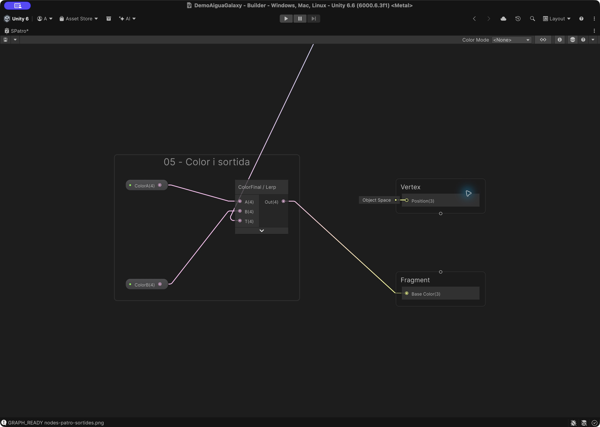
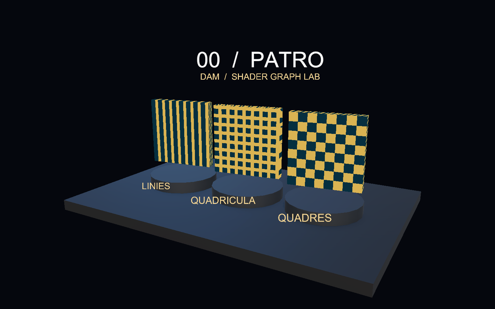

# Demo 0: Patró: línies, quadrícula i quadres

Construirem un material Unlit que mostra tres patrons a partir de les mateixes UV. La primera versió només necessita línies; després hi afegirem la quadrícula i els quadres alternats. No cal haver fet cap altra demo.

**Projecte acabat:** [Demo-0-Patro.zip](demos/Demo-0-Patro.zip). Descomprimeix-lo i obre la carpeta amb Assets, Packages i ProjectSettings des de Unity Hub. Obre `Assets/Demos/Patro/Scenes/DemoPatro.unity` i prem Play.



## 1. Preparar un projecte buit

1. Utilitza **Unity 6000.6.3f1**, la versió de les demos de Codi. Crea un projecte **Universal 3D (URP)**.
2. A Package Manager, comprova **Universal RP 17.6.0**, **Shader Graph 17.6.0** i **Input System 1.20.0**. Shader Graph arriba com a dependència d’URP.
3. A **Project Settings > Player > Active Input Handling**, selecciona **Input System Package (New)**. Accepta el reinici si Unity el demana.
4. Crea `Assets/Demos/Patro` amb les carpetes **Shaders**, **Materials**, **Scenes** i **Meshes**. Crea també **Assets/Common** per als scripts.
5. Crea una escena buida, afegeix una Camera amb tag **MainCamera** i desa l’escena com a `DemoPatro` dins de Scenes.

## 2. Crear el Shader Graph

A Shaders, crea **Shader Graph > URP > Unlit Shader Graph**, amb nom **SPatro**. A Graph Inspector > Graph Settings, fixa:

| Opció | Valor |
|---|---|
| Target | Universal |
| Material | Unlit |
| Surface Type | Opaque |
| Alpha Clipping | Desactivat |
| Render Face | Front |
| Cast Shadows | Desactivat |

Afegeix al Blackboard aquestes propietats. Activa **Exposed** i escriu les **Reference exactes**, inclòs el guió baix. Els colors s’indiquen com a RGBA normalitzat; si el selector mostra bytes 0–255, multiplica cada component per 255.

| Nom | Tipus | Reference | Valor inicial |
|---|---|---|---|
| ColorA | Color | `_ColorA` | (0.025, 0.19, 0.25, 1) |
| ColorB | Color | `_ColorB` | (0.85, 0.7, 0.32, 1) |
| Gruix | Float | `_Gruix` | 0.12 |
| Mode (0 linies, 1 graella, 2 quadres) | Float | `_Mode` | 0 |
| Repeticions | Float | `_Repeticions` | 8 |

Arrossega les propietats al gràfic per crear els seus nodes. La propietat no es crea escrivint-ne el nom en un node Float: s’ha de crear al Blackboard.

## 3. Entendre l’efecte

### Primer només línies

UV0 proporciona U i V. Multiply amb Repeticions divideix el domini en cel·les. Split permet treballar primer només amb U. Fraction repeteix una rampa 0–1 i Step separa la part seleccionada de la resta. One Minus inverteix la selecció.

```text
liniaU = 1 - Step(Gruix, Fraction(U * Repeticions))
color = Lerp(ColorA, ColorB, liniaU)
```

Construeix només la branca UV → Escala → Eixos → FaseU → TallU → LiniaU i un Lerp entre ColorA i ColorB. Connecta’l a Base Color i comprova vuit línies abans d’afegir la resta.

### Afegir la quadrícula

Repeteix la branca amb G de Split, que correspon a V. Maximum entre les dues màscares conserva tant les línies verticals com les horitzontals.

### Afegir els quadres

Floor identifica la cel·la. La suma dels índexs, multiplicada per 0.5 i passada per Fraction × 2, alterna entre 0 i 1. La propietat Mode tria línies (0), quadrícula (1) o quadres (2). Els valors intermedis barregen patrons: al material utilitzarem enters.

## 4. Connectar els nodes

Cada fila identifica un node. `Eixos:R` vol dir la sortida **R** del node identificat com Eixos; `Nom:Out` vol dir la seva sortida. Si el nom correspon a una propietat del Blackboard, utilitza el seu node Property. Els números sense `:` són valors literals escrits al port d’entrada. Els àlies Temps, Mode i Centre corresponen a les propietats amb Reference `_Temps`, `_Mode` i `_Centre`, quan existeixen en aquesta demo. En un port vectorial, un literal únic s’ha de repetir a tots els components: per exemple Frequency = 12 vol dir (12,12).

Les captures següents provenen del Shader Graph de Unity. A les captures de cada pas s’han ocultat els cables que només travessen el grup sense connectar-hi; es mantenen les seves entrades i sortides. Alguns camps numèrics es veuen arrodonits per l’amplada del node: utilitza els valors exactes de la taula. Cada grup numerat és un pas del mateix graf final. Segueix l’ordre, afegeix els nodes del pas i connecta’ls com a la captura i a la taula. Les propietats es creen al Blackboard segons l’apartat 2; els nodes Property simplement les llegeixen.

Els cables que entren des de fora del grup provenen de passos anteriors: el nom de la taula identifica l’origen. Al projecte acabat pots seleccionar un grup i prémer **F** per enquadrar-lo. Les previsualitzacions dels nodes estan plegades a les captures per deixar llegir ports i valors; pots desplegar-les per inspeccionar una màscara.

### Connexions entre grups

Aquest mapa mostra com es connecten els grups del graf. Cada fletxa agrupa el nombre de cables indicat; la taula inferior detalla **tots els cables entre grups i cap al Master Stack**, amb els ports exactes. Les captures dels passos següents mostren les connexions interiors.



Llegeix cada fila d’esquerra a dreta: **grup d’origen → node i port de sortida → grup de destinació → node i port d’entrada**. Per exemple, `Eixos:R` és el port R del node Eixos. Un mateix port pot alimentar diversos grups; conserva totes les branques indicades.

| Grup origen | Node:sortida | Grup destinació | Node:entrada |
|---|---|---|---|
| 01 | `FaseU:Out` | 02 | `TallU:In` |
| 01 | `FaseV:Out` | 02 | `TallV:In` |
| 01 | `Eixos:R` | 03 | `CelU:In` |
| 01 | `Eixos:G` | 03 | `CelV:In` |
| 02 | `LiniaU:Out` | 04 | `LiniesGraella:A` |
| 02 | `Quadricula:Out` | 04 | `LiniesGraella:B` |
| 03 | `Alternat:Out` | 04 | `Mascara:B` |
| 04 | `Mascara:Out` | 05 | `ColorFinal:T` |
| 05 | `ColorFinal:Out` | Master Stack | `Fragment:Base Color` |

A Unity, allunya el zoom per veure dos grups alhora. **F** enquadra la selecció; **A** enquadra tot el graf. Per seguir un cable llarg, identifica primer els dos extrems a la taula i localitza els grups numerats.

### Pas 1. UV i repeticio

Multiply escala les UV. Split separa U i V; Fraction repeteix la rampa de cada cel·la.



| ID | Node | Entrades |
|---|---|---|
| `UV` | UV |   |
| `Escala` | Multiply | A ← UV:Out; B ← Repeticions:Out |
| `Eixos` | Split | In ← Escala:Out |
| `FaseU` | Fraction | In ← Eixos:R |
| `FaseV` | Fraction | In ← Eixos:G |

### Pas 2. Linies i quadricula

Step compara la fase amb Gruix. One Minus deixa les línies blanques i Maximum uneix els dos eixos.



| ID | Node | Entrades |
|---|---|---|
| `TallU` | Step | Edge ← Gruix:Out; In ← FaseU:Out |
| `LiniaU` | One Minus | In ← TallU:Out |
| `TallV` | Step | Edge ← Gruix:Out; In ← FaseV:Out |
| `LiniaV` | One Minus | In ← TallV:Out |
| `Quadricula` | Maximum | A ← LiniaU:Out; B ← LiniaV:Out |

### Pas 3. Quadres alterns

Floor identifica la cel·la. La suma, multiplicada per 0.5, crea una paritat; Fraction × 2 produeix els quadres alternats.



| ID | Node | Entrades |
|---|---|---|
| `CelU` | Floor | In ← Eixos:R |
| `CelV` | Floor | In ← Eixos:G |
| `SumaCels` | Add | A ← CelU:Out; B ← CelV:Out |
| `Meitat` | Multiply | A ← SumaCels:Out; B ← 0.5 |
| `Paritat` | Fraction | In ← Meitat:Out |
| `Alternat` | Multiply | A ← Paritat:Out; B ← 2 |

### Pas 4. Seleccio del patro

Els dos Saturate transformen Mode en selectors: 0 = línies, 1 = quadrícula, 2 = quadres.



| ID | Node | Entrades |
|---|---|---|
| `Graella` | Saturate | In ← Mode:Out |
| `LiniesGraella` | Lerp | A ← LiniaU:Out; B ← Quadricula:Out; T ← Graella:Out |
| `MenysUn` | Subtract | A ← Mode:Out; B ← 1 |
| `Quadres` | Saturate | In ← MenysUn:Out |
| `Mascara` | Lerp | A ← LiniesGraella:Out; B ← Alternat:Out; T ← Quadres:Out |

### Pas 5. Color i sortida

Lerp assigna els dos colors a la màscara. Prova primer Mode = 0 abans de comparar els tres patrons.



| ID | Node | Entrades |
|---|---|---|
| `ColorFinal` | Lerp | A ← ColorA:Out; B ← ColorB:Out; T ← Mascara:Out |

### Pas 6. Master Stack i connexions finals

Connecta les branques als blocs del Master Stack indicats a continuació. Comprova l’espai de les normals i si les sortides són de Vertex o de Fragment. Els blocs sense cable conserven el valor per defecte.



| ID | Node | Entrades |
|---|---|---|
| Sortida | BaseColor | ColorFinal:Out |

Els números de les entrades són valors literals. En un vector, repeteix el valor a tots els components quan s’indica un únic nombre. A Combine, tria RG per a Vector2; a Split, R/G/B equivalen a X/Y/Z. Desa el graf abans de crear els materials.

## 5. Crear els materials

Amb el botó dret sobre SPatro, crea els materials i assigna-hi el shader. `MPatro0`, `MPatro1` i `MPatro2`: fixa Mode a **0, 1 i 2**, respectivament. Mantén Repeticions = 8 i Gruix = 0.12.

## 6. Construir l’escena

Les posicions són globals i les escales corresponen a les primitives de Unity. Mantén els objectes a l’arrel, sense un pare escalat. Els elements decoratius i textos es poden ometre: no intervenen en el shader.

| Objecte | Primitiva | Posicio | Escala |
|---|---|---|---|
| Base | Cube | (0, -0.22, 0) | (12, 0.4, 8) |
| Mostra0 | Cube | (-3.2, 2.25, 0) | (2.7, 2.7, 0.35) |
| Peanya0 | Cylinder | (-3.2, 0.24, 0) | (2.85, 0.23, 2.85) |
| Mostra1 | Cube | (0, 2.25, 0) | (2.7, 2.7, 0.35) |
| Peanya1 | Cylinder | (0, 0.24, 0) | (2.85, 0.23, 2.85) |
| Mostra2 | Cube | (3.2, 2.25, 0) | (2.7, 2.7, 0.35) |
| Peanya2 | Cylinder | (3.2, 0.24, 0) | (2.85, 0.23, 2.85) |

Aplica una rotació Y = **−8°** a les tres mostres i assigna el material numerat que correspon a cadascuna.

### Càmera i llums

Posa Main Camera a **(8,6,−14)**, amb projecció **Perspective**, Field of View **40**, Near **0.1**, Far **100** i fons de color sòlid **RGB (0.018,0.029,0.052)**. Orienta-la cap al punt **(0,1.7,0)**. La rotació Euler corresponent és aproximadament **(14.932, -29.745, 0)**.

Afegeix dues llums Directional: **Key Light**, rotació (45,−30,0), intensitat 2 i color RGB (1,0.88,0.74); **Fill Light**, rotació (25,140,0), intensitat 1 i color RGB (0.35,0.67,1). A Lighting > Environment, utilitza ambient de color (0.32,0.38,0.48). La base porta un material Lit gris blavós (0.055,0.072,0.095), Smoothness 0.25; les peanyes, (0.1,0.14,0.19).

## 7. Afegir els controls

### Càmera orbital i zoom

Descarrega [DemoOrbitCamera.cs](demos/DemoOrbitCamera.cs) i desa’l a **Assets/Common/DemoOrbitCamera.cs**. Afegeix el component **Demo Orbit Camera** a **Main Camera**. Al ZIP ja està configurat.

- **Center = (0, 1.7, 0)**: punt fix al voltant del qual gira la càmera.
- **Minimum Distance = 3**, **Maximum Distance = 35**.
- **Rotation Sensitivity = 0.2**, **Zoom Sensitivity = 0.0015**.
- **Minimum Elevation = 5**, **Maximum Elevation = 85**: límits d’inclinació en graus.

En **Play**, clica **Game**. Mantén premut el **botó dret** i arrossega per girar; utilitza la **roda del ratolí** per apropar-te o allunyar-te. **Home** recupera la posició i orientació inicials. El centre no es desplaça i no cal afegir-hi cap objecte Target. La roda positiva apropa la càmera; la negativa l’allunya.

El controlador del panell, que trobaràs a continuació, informa la càmera de quan el punter és sobre els controls perquè el lliscador no mogui el punt de vista. La càmera funciona igualment quan el temps del shader està en pausa.

Crea **Assets/Common/DemoControls.cs** amb aquest codi complet:

```csharp
using UnityEngine;
using UnityEngine.InputSystem;

// Controls comuns a les demos. Els materials s'instancien per no modificar els assets.
public class DemoControls : MonoBehaviour
{
    public string title;
    public string description;
    public Renderer[] surfaces;
    public string parameter = "_Gruix";
    public float minimum = 0.02f;
    public float maximum = 0.3f;
    public float initialValue = 0.12f;
    public float timeScale = 1f;
    public bool paused;
    public float elapsed;
    public bool showPanel = true;
    Material[] materials;
    float value;

    void Awake()
    {
        materials = new Material[surfaces.Length];
        for (int i = 0; i < surfaces.Length; i++) materials[i] = surfaces[i].material;
        value = initialValue;
        var orbit = Camera.main ? Camera.main.GetComponent<DemoOrbitCamera>() : null;
        if (orbit) orbit.IsPointerOverControls = point => showPanel && new Rect(16, 16, 380, 180).Contains(point);
    }
    void Update()
    {
        if (Keyboard.current != null)
        {
            if (Keyboard.current.spaceKey.wasPressedThisFrame) paused = !paused;
            if (Keyboard.current.hKey.wasPressedThisFrame) showPanel = !showPanel;
            if (Keyboard.current.rKey.wasPressedThisFrame) { elapsed = 0; SetParameter(initialValue); }
        }
        if (!paused) elapsed += Time.deltaTime * timeScale;
        ApplyTime(elapsed);
    }
    public void ApplyTime(float seconds)
    {
        if (materials == null) return;
        foreach (Material material in materials)
            if (material.HasProperty("_Temps")) material.SetFloat("_Temps", seconds);
    }
    public void SetParameter(float next)
    {
        value = Mathf.Clamp(next, minimum, maximum);
        if (materials == null) return;
        foreach (Material material in materials)
            if (material.HasProperty(parameter)) material.SetFloat(parameter, value);
    }
    void OnGUI()
    {
        if (!showPanel) return;
        GUI.Box(new Rect(16, 16, 380, 180), "");
        GUILayout.BeginArea(new Rect(30, 25, 350, 162));
        GUILayout.Label(title);
        GUILayout.Label(description);
        GUILayout.Label(parameter + ": " + value.ToString("0.00"));
        float next = GUILayout.HorizontalSlider(value, minimum, maximum);
        if (next != value) SetParameter(next);
        GUILayout.Label("Espai: pausa | R: reinicia | H: amaga el panell");
        GUILayout.Label("Boto dret: orbita | Roda: zoom | Home: vista inicial");
        GUILayout.EndArea();
    }
    void OnDestroy()
    {
        if (materials == null) return;
        foreach (Material material in materials) Destroy(material);
    }
}
```

Crea un objecte buit **Controls** i afegeix-hi DemoControls. A **Surfaces**, assigna els tres Renderers de les mostres, en ordre d’esquerra a dreta. No hi afegeixis la base, els textos ni les peanyes.

| Camp | Valor |
|---|---|
| Title | 00 / Patro |
| Description | Compara les variants i modifica el material. |
| Parameter | `_Gruix` |
| Minimum | 0.02 |
| Maximum | 0.4 |
| Initial Value | 0.12 |

**Controls:** lliscador per modificar `_Gruix`; Espai pausa el temps; R reinicia temps i paràmetre; H amaga el panell. En moure el lliscador, el valor s’aplica a totes les mostres. Abans de tocar-lo, cada material conserva les variants de l’apartat 5. Els rètols de l’escena identifiquen aquestes variants inicials; el panell mostra el valor actual del control.

Els canvis durant Play són temporals. Per canviar els valors inicials de manera permanent, atura Play i edita els assets de material.

## 8. Provar la demo

1. Comprova que les tres mostres mostren línies, quadrícula i quadres, en aquest ordre.
2. Mou Gruix de 0.02 a 0.4: les línies i juntes s’eixamplen, mentre els quadres alternats mantenen la seva distribució.
3. Atura Play i canvia Repeticions al material: 4 mostra menys cel·les que 8.
4. Canvia ColorA i comprova que s’aplica a la zona seleccionada pel Lerp.



## Si alguna cosa no funciona

Si els tres patrons són iguals, comprova que hi ha tres materials diferents i els valors de Mode. Si veus línies massa fines, abaixa Repeticions o augmenta Gruix.

Si el material és rosa, comprova URP, la compilació del gràfic i la Console. Si el teclat no respon, comprova Input System, entra a Play i clica Game.

## Ampliació

Afegeix una propietat Vector2 per controlar les repeticions per separat en U i V. Intenta construir línies horitzontals sense duplicar el shader.
