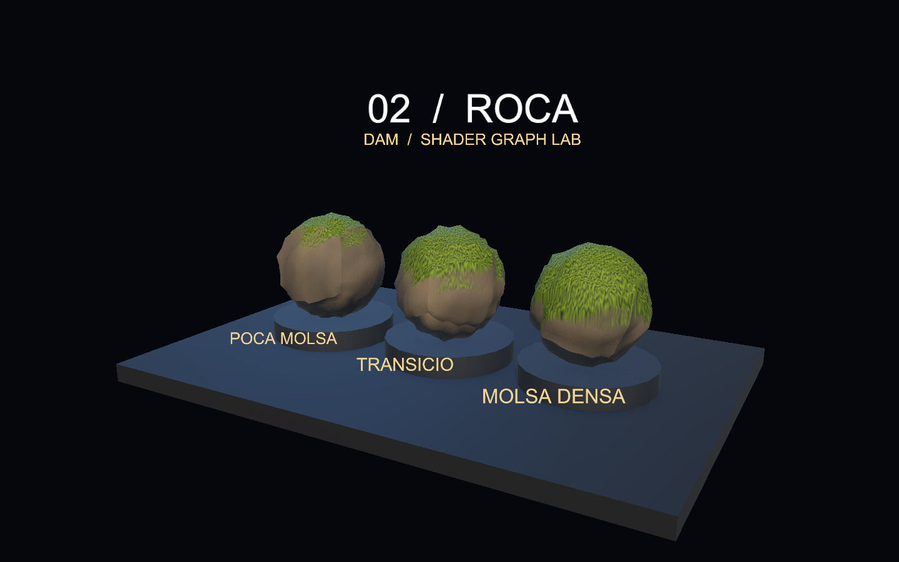
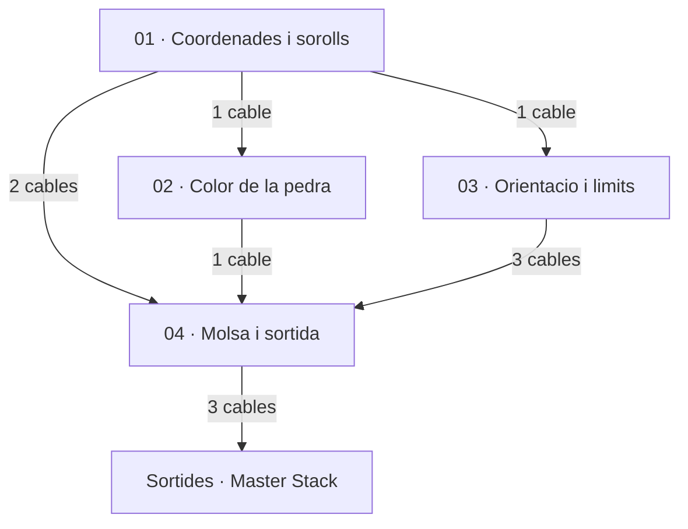
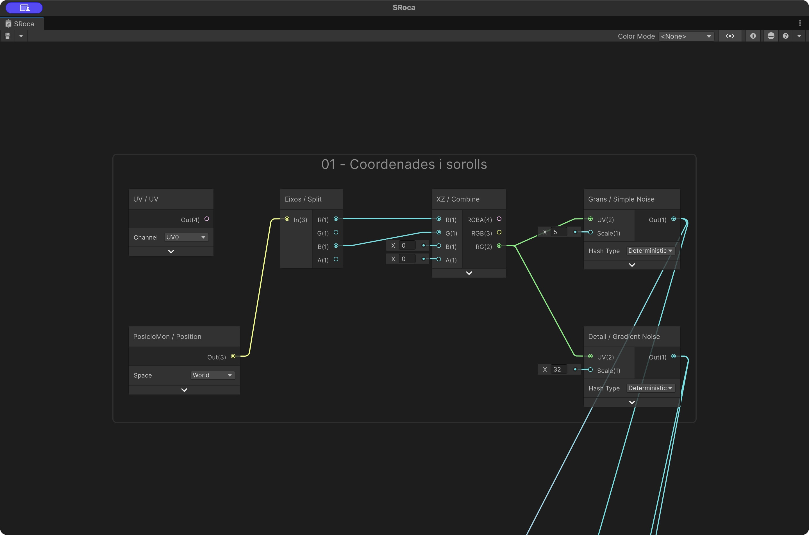
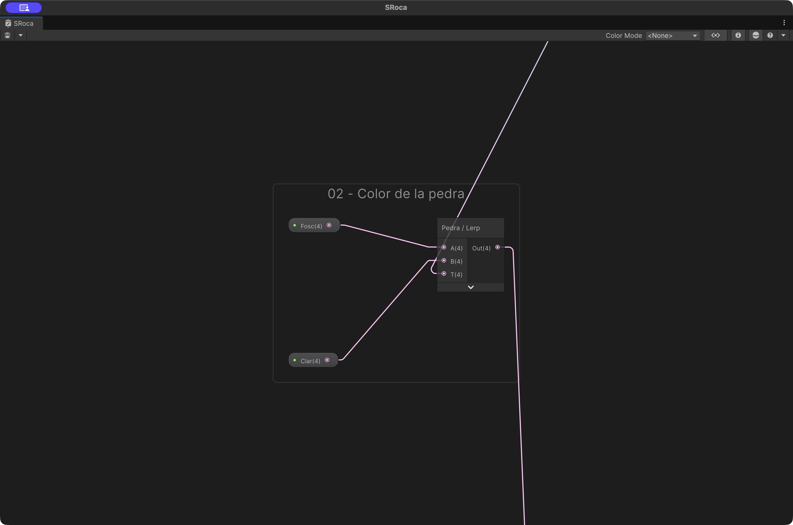
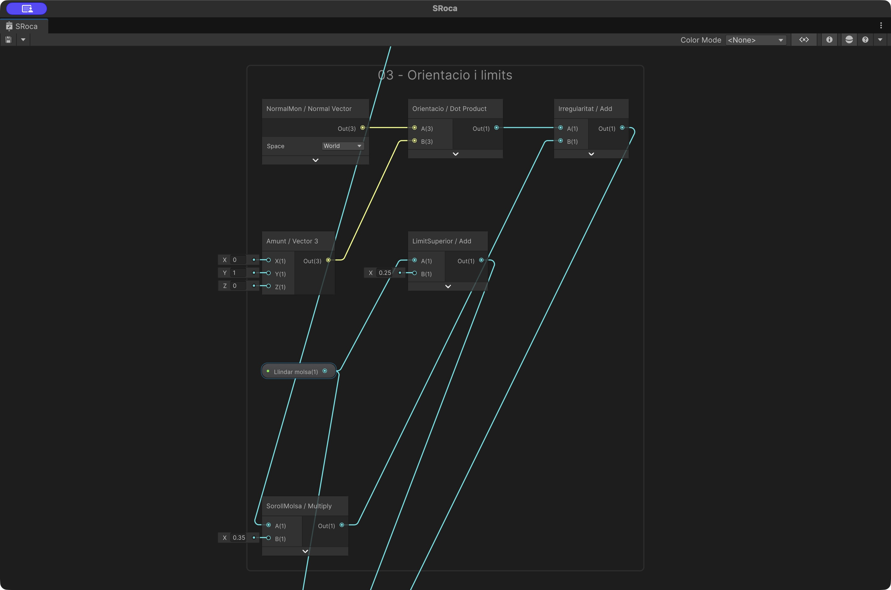
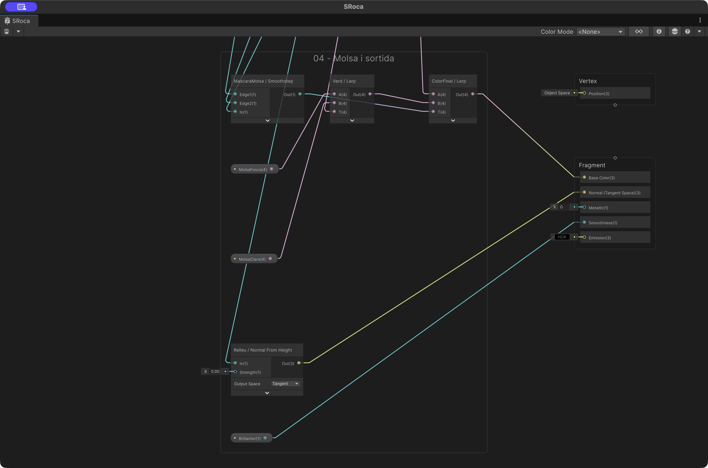
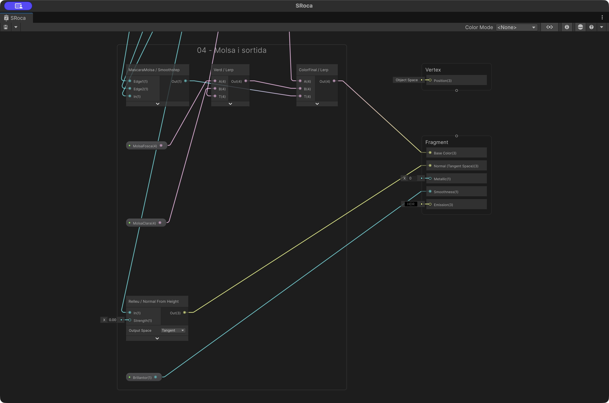
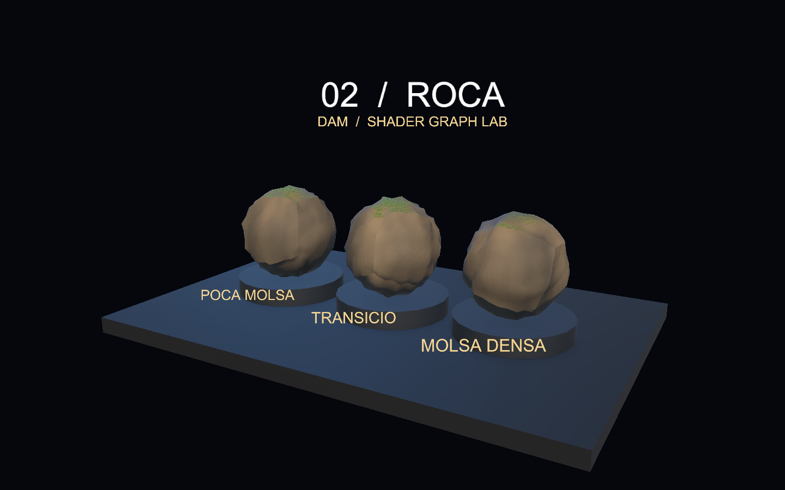

# Demo 2: Roca: pedra i molsa segons l’orientació

Construirem una roca amb tons minerals, detall de superfície i molsa que apareix sobretot a les cares orientades cap amunt. Separarem la geometria irregular, el color i les normals per entendre què aporta cadascun.

**Projecte acabat:** [Demo-2-Roca.zip](demos/Demo-2-Roca.zip). Descomprimeix-lo i obre la carpeta amb Assets, Packages i ProjectSettings des de Unity Hub. Obre `Assets/Demos/Roca/Scenes/DemoRoca.unity` i prem Play.



## 1. Preparar un projecte buit

1. Utilitza **Unity 6000.6.3f1**, la versió de les demos de Codi. Crea un projecte **Universal 3D (URP)**.
2. A Package Manager, comprova **Universal RP 17.6.0**, **Shader Graph 17.6.0** i **Input System 1.20.0**. Shader Graph arriba com a dependència d’URP.
3. A **Project Settings > Player > Active Input Handling**, selecciona **Input System Package (New)**. Accepta el reinici si Unity el demana.
4. Crea `Assets/Demos/Roca` amb les carpetes **Shaders**, **Materials**, **Scenes** i **Meshes**. Crea també **Assets/Common** per als scripts.
5. Crea una escena buida, afegeix una Camera amb tag **MainCamera** i desa l’escena com a `DemoRoca` dins de Scenes.

## 2. Crear el Shader Graph

A Shaders, crea **Shader Graph > URP > Lit Shader Graph**, amb nom **SRoca**. A Graph Inspector > Graph Settings, fixa:

| Opció | Valor |
|---|---|
| Target | Universal |
| Material | Lit |
| Surface Type | Opaque |
| Alpha Clipping | Desactivat |
| Render Face | Front |
| Cast Shadows | Desactivat |

Afegeix al Blackboard aquestes propietats. Activa **Exposed** i escriu les **Reference exactes**, inclòs el guió baix. Els colors s’indiquen com a RGBA normalitzat; si el selector mostra bytes 0–255, multiplica cada component per 255.

| Nom | Tipus | Reference | Valor inicial |
|---|---|---|---|
| Brillantor | Float | `_Brillantor` | 0.18 |
| Clar | Color | `_Clar` | (0.52, 0.48, 0.4, 1) |
| Fosc | Color | `_Fosc` | (0.12, 0.15, 0.18, 1) |
| Llindar molsa | Float | `_Llindar` | 0.35 |
| MolsaClara | Color | `_MolsaClara` | (0.4, 0.53, 0.07, 1) |
| MolsaFosca | Color | `_MolsaFosca` | (0.07, 0.17, 0.025, 1) |

Arrossega les propietats al gràfic per crear els seus nodes. La propietat no es crea escrivint-ne el nom en un node Float: s’ha de crear al Blackboard.

## 3. Entendre l’efecte

### Pedra

Position World es divideix i es combinen X i Z com a coordenades. Simple Noise varia el color mineral i Gradient Noise afegeix detall. És una projecció planar: a les cares gairebé verticals pot allargar el patró. Aquesta limitació es pot millorar amb projecció triplanar en una ampliació.

### Molsa

Dot Product entre Normal Vector World i (0,1,0) mesura l’orientació cap amunt. Afegim una petita irregularitat de soroll i usem Smoothstep entre Llindar i Llindar + 0.25. El resultat barreja la pedra amb dos verds de molsa.

Girar una roca canvia quines cares miren amunt. Un llindar més baix estén la molsa; un llindar més alt la concentra. El relleu de normals té Strength 0.002 per conservar un detall discret.

## 4. Connectar els nodes

Cada fila identifica un node. `Eixos:R` vol dir la sortida **R** del node identificat com Eixos; `Nom:Out` vol dir la seva sortida. Si el nom correspon a una propietat del Blackboard, utilitza el seu node Property. Els números sense `:` són valors literals escrits al port d’entrada. Els àlies Temps, Mode i Centre corresponen a les propietats amb Reference `_Temps`, `_Mode` i `_Centre`, quan existeixen en aquesta demo. En un port vectorial, un literal únic s’ha de repetir a tots els components: per exemple Frequency = 12 vol dir (12,12).

Les captures següents provenen del Shader Graph de Unity. A les captures de cada pas s’han ocultat els cables que només travessen el grup sense connectar-hi; es mantenen les seves entrades i sortides. Alguns camps numèrics es veuen arrodonits per l’amplada del node: utilitza els valors exactes de la taula. Cada grup numerat és un pas del mateix graf final. Segueix l’ordre, afegeix els nodes del pas i connecta’ls com a la captura i a la taula. Les propietats es creen al Blackboard segons l’apartat 2; els nodes Property simplement les llegeixen.

Els cables que entren des de fora del grup provenen de passos anteriors: el nom de la taula identifica l’origen. Al projecte acabat pots seleccionar un grup i prémer **F** per enquadrar-lo. Les previsualitzacions dels nodes estan plegades a les captures per deixar llegir ports i valors; pots desplegar-les per inspeccionar una màscara.

### Connexions entre grups

Aquest mapa mostra com es connecten els grups del graf. Cada fletxa agrupa el nombre de cables indicat; la taula inferior detalla **tots els cables entre grups i cap al Master Stack**, amb els ports exactes. Les captures dels passos següents mostren les connexions interiors.



Llegeix cada fila d’esquerra a dreta: **grup d’origen → node i port de sortida → grup de destinació → node i port d’entrada**. Per exemple, `Eixos:R` és el port R del node Eixos. Un mateix port pot alimentar diversos grups; conserva totes les branques indicades.

| Grup origen | Node:sortida | Grup destinació | Node:entrada |
|---|---|---|---|
| 01 | `Grans:Out` | 02 | `Pedra:T` |
| 01 | `Grans:Out` | 03 | `SorollMolsa:A` |
| 01 | `Detall:Out` | 04 | `Relleu:In` |
| 01 | `Detall:Out` | 04 | `Verd:T` |
| 02 | `Pedra:Out` | 04 | `ColorFinal:A` |
| 03 | `Llindar:Out` | 04 | `MascaraMolsa:Edge1` |
| 03 | `LimitSuperior:Out` | 04 | `MascaraMolsa:Edge2` |
| 03 | `Irregularitat:Out` | 04 | `MascaraMolsa:In` |
| 04 | `ColorFinal:Out` | Master Stack | `Fragment:Base Color` |
| 04 | `Relleu:Out` | Master Stack | `Fragment:Normal (Tangent Space)` |
| 04 | `Brillantor:Out` | Master Stack | `Fragment:Smoothness` |

A Unity, allunya el zoom per veure dos grups alhora. **F** enquadra la selecció; **A** enquadra tot el graf. Per seguir un cable llarg, identifica primer els dos extrems a la taula i localitza els grups numerats.

### Pas 1. Coordenades i sorolls

Combina X i Z de Position World. Els dos sorolls comparteixen coordenades però tenen escales diferents.



| ID | Node | Entrades |
|---|---|---|
| `UV` | UV |   |
| `PosicioMon` | Position | Space: World |
| `Eixos` | Split | In ← PosicioMon:Out |
| `XZ` | Combine | R ← Eixos:R; G ← Eixos:B |
| `Grans` | Simple Noise | UV ← XZ:RG; Scale ← 5 |
| `Detall` | Gradient Noise | UV ← XZ:RG; Scale ← 32 |

### Pas 2. Color de la pedra

Aquest Lerp crea el color mineral abans d’afegir la molsa.



| ID | Node | Entrades |
|---|---|---|
| `Pedra` | Lerp | A ← Fosc:Out; B ← Clar:Out; T ← Grans:Out |

### Pas 3. Orientacio i limits

Dot Product amb el vector (0,1,0) selecciona la part superior. El soroll irregularitza el límit.



| ID | Node | Entrades |
|---|---|---|
| `NormalMon` | Normal Vector | Space: World |
| `Amunt` | Vector 3 | X ← 0; Y ← 1; Z ← 0 |
| `Orientacio` | Dot Product | A ← NormalMon:Out; B ← Amunt:Out |
| `LimitSuperior` | Add | A ← Llindar:Out; B ← 0.25 |
| `SorollMolsa` | Multiply | A ← Grans:Out; B ← 0.35 |
| `Irregularitat` | Add | A ← Orientacio:Out; B ← SorollMolsa:Out |

### Pas 4. Molsa i sortida

Smoothstep crea la transició pedra–molsa. El relleu de normals és deliberadament discret.



| ID | Node | Entrades |
|---|---|---|
| `MascaraMolsa` | Smoothstep | Edge1 ← Llindar:Out; Edge2 ← LimitSuperior:Out; In ← Irregularitat:Out |
| `Verd` | Lerp | A ← MolsaFosca:Out; B ← MolsaClara:Out; T ← Detall:Out |
| `ColorFinal` | Lerp | A ← Pedra:Out; B ← Verd:Out; T ← MascaraMolsa:Out |
| `Relleu` | Normal From Height | In ← Detall:Out; Strength ← 0.002 |

### Pas 5. Master Stack i connexions finals

Connecta les branques als blocs del Master Stack indicats a continuació. Comprova l’espai de les normals i si les sortides són de Vertex o de Fragment. Els blocs sense cable conserven el valor per defecte.



| ID | Node | Entrades |
|---|---|---|
| Sortida | BaseColor | ColorFinal:Out |
| Sortida | Normal (Tangent) | Relleu:Out |
| Sortida | Smoothness | Brillantor:Out |

Els números de les entrades són valors literals. En un vector, repeteix el valor a tots els components quan s’indica un únic nombre. A Combine, tria RG per a Vector2; a Split, R/G/B equivalen a X/Y/Z. Desa el graf abans de crear els materials.

## 5. Crear els materials

Amb el botó dret sobre SRoca, crea els materials i assigna-hi el shader. `MRoca0`, `MRoca1`, `MRoca2`: Llindar = **0.65, 0.35, 0.05**. Les roques utilitzen Rock1, Rock2 i Rock3. Rotacions Euler: **(15,0,10), (15,40,10), (15,80,10)**.

## 6. Construir l’escena

Les posicions són globals i les escales corresponen a les primitives de Unity. Mantén els objectes a l’arrel, sense un pare escalat. Els elements decoratius i textos es poden ometre: no intervenen en el shader.

| Objecte | Primitiva | Posicio | Escala |
|---|---|---|---|
| Base | Cube | (0, -0.22, 0) | (12, 0.4, 8) |
| Roca0 | Sphere | (-3.2, 1.65, 0) | (2.5, 2.4, 2.3) |
| Peanya0 | Cylinder | (-3.2, 0.24, 0) | (2.85, 0.23, 2.85) |
| Roca1 | Sphere | (0, 1.65, 0) | (2.5, 2.4, 2.3) |
| Peanya1 | Cylinder | (0, 0.24, 0) | (2.85, 0.23, 2.85) |
| Roca2 | Sphere | (3.2, 1.65, 0) | (2.5, 2.4, 2.3) |
| Peanya2 | Cylinder | (3.2, 0.24, 0) | (2.85, 0.23, 2.85) |

### Generar les malles

Crea **Assets/Editor/GenerarMalles.cs** amb aquest codi. Espera que compili. El menú **Demos** permet crear una graella d’aigua i cinc roques; els assets apareixen a **Assets/Meshes**. Les malles del ZIP ja estan desades dins de la carpeta de la demo.

```csharp
using UnityEngine;
using UnityEditor;
using System.IO;

// Utilitat opcional per reconstruir les malles dels exemples des de zero.
public static class GenerarMalles
{
    [MenuItem("Demos/Crear malla d'aigua")]
    public static void Aigua()
    {
        const int n = 80;
        var mesh = new Mesh { name = "WaterGrid" };
        var vertices = new Vector3[(n + 1) * (n + 1)];
        var uv = new Vector2[vertices.Length];
        var triangles = new int[n * n * 6];
        for (int z = 0; z <= n; z++)
            for (int x = 0; x <= n; x++)
            {
                int i = z * (n + 1) + x;
                vertices[i] = new Vector3((float)x / n * 8 - 4, 0, (float)z / n * 5 - 2.5f);
                uv[i] = new Vector2((float)x / n, (float)z / n);
            }
        int k = 0;
        for (int z = 0; z < n; z++)
            for (int x = 0; x < n; x++)
            {
                int i = z * (n + 1) + x;
                triangles[k++] = i; triangles[k++] = i + n + 1; triangles[k++] = i + 1;
                triangles[k++] = i + 1; triangles[k++] = i + n + 1; triangles[k++] = i + n + 2;
            }
        mesh.vertices = vertices; mesh.uv = uv; mesh.triangles = triangles;
        mesh.RecalculateNormals(); mesh.RecalculateTangents();
        mesh.bounds = new Bounds(Vector3.zero, new Vector3(8, 2, 5));
        Save(mesh, "WaterGrid");
    }

    [MenuItem("Demos/Crear cinc malles de roca")]
    public static void Roques()
    {
        for (int seed = 1; seed <= 5; seed++)
        {
            var temporary = GameObject.CreatePrimitive(PrimitiveType.Sphere);
            var mesh = Object.Instantiate(temporary.GetComponent<MeshFilter>().sharedMesh);
            Object.DestroyImmediate(temporary);
            var vertices = mesh.vertices;
            for (int i = 0; i < vertices.Length; i++)
            {
                Vector3 d = vertices[i].normalized;
                float factor = 1 + .045f * Mathf.Sin(d.x * 13 + seed) * Mathf.Cos(d.y * 11 + seed)
                    + .035f * Mathf.Sin(d.z * 17 + seed);
                vertices[i] *= factor;
            }
            mesh.vertices = vertices; mesh.RecalculateNormals(); mesh.RecalculateBounds();
            Save(mesh, "Rock" + seed);
        }
    }

    static void Save(Mesh mesh, string name)
    {
        Directory.CreateDirectory("Assets/Meshes");
        string path = AssetDatabase.GenerateUniqueAssetPath("Assets/Meshes/" + name + ".asset");
        AssetDatabase.CreateAsset(mesh, path);
        AssetDatabase.SaveAssets();
        Selection.activeObject = mesh;
    }
}
```

Executa **Demos > Crear cinc malles de roca**. Als Mesh Filter de Roca0, Roca1 i Roca2, substitueix la malla Sphere per Rock1, Rock2 i Rock3. Les rotacions i materials són els de l’apartat anterior.

### Càmera i llums

Posa Main Camera a **(8,6,−14)**, amb projecció **Perspective**, Field of View **40**, Near **0.1**, Far **100** i fons de color sòlid **RGB (0.018,0.029,0.052)**. Orienta-la cap al punt **(0,1.7,0)**. La rotació Euler corresponent és aproximadament **(14.932, -29.745, 0)**.

Afegeix dues llums Directional: **Key Light**, rotació (45,−30,0), intensitat 2 i color RGB (1,0.88,0.74); **Fill Light**, rotació (25,140,0), intensitat 1 i color RGB (0.35,0.67,1). A Lighting > Environment, utilitza ambient de color (0.32,0.38,0.48). La base porta un material Lit gris blavós (0.055,0.072,0.095), Smoothness 0.25; les peanyes, (0.1,0.14,0.19).

## 7. Afegir els controls

### Càmera orbital i zoom

Descarrega [DemoOrbitCamera.cs](demos/DemoOrbitCamera.cs) i desa’l a **Assets/Common/DemoOrbitCamera.cs**. Afegeix el component **Demo Orbit Camera** a **Main Camera**. Al ZIP ja està configurat.

- **Center = (0, 1.7, 0)**: punt fix al voltant del qual gira la càmera.
- **Minimum Distance = 3**, **Maximum Distance = 35**.
- **Rotation Sensitivity = 0.2**, **Zoom Sensitivity = 0.0015**.
- **Minimum Elevation = 5**, **Maximum Elevation = 85**: límits d’inclinació en graus.

En **Play**, clica **Game**. Mantén premut el **botó dret** i arrossega per girar; utilitza la **roda del ratolí** per apropar-te o allunyar-te. **Home** recupera la posició i orientació inicials. El centre no es desplaça i no cal afegir-hi cap objecte Target. La roda positiva apropa la càmera; la negativa l’allunya.

El controlador del panell, que trobaràs a continuació, informa la càmera de quan el punter és sobre els controls perquè el lliscador no mogui el punt de vista. La càmera funciona igualment quan el temps del shader està en pausa.

Crea **Assets/Common/DemoControls.cs** amb aquest codi complet:

```csharp
using UnityEngine;
using UnityEngine.InputSystem;

// Controls comuns a les demos. Els materials s'instancien per no modificar els assets.
public class DemoControls : MonoBehaviour
{
    public string title;
    public string description;
    public Renderer[] surfaces;
    public string parameter = "_Gruix";
    public float minimum = 0.02f;
    public float maximum = 0.3f;
    public float initialValue = 0.12f;
    public float timeScale = 1f;
    public bool paused;
    public float elapsed;
    public bool showPanel = true;
    Material[] materials;
    float value;

    void Awake()
    {
        materials = new Material[surfaces.Length];
        for (int i = 0; i < surfaces.Length; i++) materials[i] = surfaces[i].material;
        value = initialValue;
        var orbit = Camera.main ? Camera.main.GetComponent<DemoOrbitCamera>() : null;
        if (orbit) orbit.IsPointerOverControls = point => showPanel && new Rect(16, 16, 380, 180).Contains(point);
    }
    void Update()
    {
        if (Keyboard.current != null)
        {
            if (Keyboard.current.spaceKey.wasPressedThisFrame) paused = !paused;
            if (Keyboard.current.hKey.wasPressedThisFrame) showPanel = !showPanel;
            if (Keyboard.current.rKey.wasPressedThisFrame) { elapsed = 0; SetParameter(initialValue); }
        }
        if (!paused) elapsed += Time.deltaTime * timeScale;
        ApplyTime(elapsed);
    }
    public void ApplyTime(float seconds)
    {
        if (materials == null) return;
        foreach (Material material in materials)
            if (material.HasProperty("_Temps")) material.SetFloat("_Temps", seconds);
    }
    public void SetParameter(float next)
    {
        value = Mathf.Clamp(next, minimum, maximum);
        if (materials == null) return;
        foreach (Material material in materials)
            if (material.HasProperty(parameter)) material.SetFloat(parameter, value);
    }
    void OnGUI()
    {
        if (!showPanel) return;
        GUI.Box(new Rect(16, 16, 380, 180), "");
        GUILayout.BeginArea(new Rect(30, 25, 350, 162));
        GUILayout.Label(title);
        GUILayout.Label(description);
        GUILayout.Label(parameter + ": " + value.ToString("0.00"));
        float next = GUILayout.HorizontalSlider(value, minimum, maximum);
        if (next != value) SetParameter(next);
        GUILayout.Label("Espai: pausa | R: reinicia | H: amaga el panell");
        GUILayout.Label("Boto dret: orbita | Roda: zoom | Home: vista inicial");
        GUILayout.EndArea();
    }
    void OnDestroy()
    {
        if (materials == null) return;
        foreach (Material material in materials) Destroy(material);
    }
}
```

Crea un objecte buit **Controls** i afegeix-hi DemoControls. A **Surfaces**, assigna els tres Renderers de les mostres, en ordre d’esquerra a dreta. No hi afegeixis la base, els textos ni les peanyes.

| Camp | Valor |
|---|---|
| Title | 02 / Roca |
| Description | Compara les variants i modifica el material. |
| Parameter | `_Llindar` |
| Minimum | -0.2 |
| Maximum | 1 |
| Initial Value | 0.35 |

**Controls:** lliscador per modificar `_Llindar`; Espai pausa el temps; R reinicia temps i paràmetre; H amaga el panell. En moure el lliscador, el valor s’aplica a totes les mostres. Abans de tocar-lo, cada material conserva les variants de l’apartat 5. Els rètols de l’escena identifiquen aquestes variants inicials; el panell mostra el valor actual del control.

Els canvis durant Play són temporals. Per canviar els valors inicials de manera permanent, atura Play i edita els assets de material.

## 8. Provar la demo

1. Comprova que la molsa tendeix a aparèixer a les parts superiors.
2. Mou Llindar cap a 1: retrocedeix la molsa. Mou-lo cap a −0.2: s’estén.
3. Atura Play i gira una roca: la selecció continua seguint la vertical del món.
4. Desactiva les normals de detall i distingeix el relleu aparent de la forma real de la malla.



## Si alguna cosa no funciona

Si la molsa apareix en un costat estrany, comprova que Normal Vector és World. Si veus estirament vertical, és la limitació de projectar amb XZ; no es resol canviant el color.

Si el material és rosa, comprova URP, la compilació del gràfic i la Console. Si el teclat no respon, comprova Input System, entra a Play i clica Game.

## Ampliació

Compara la projecció XZ amb una triplanar. Afegeix una textura de color i un normal map, mantenint la màscara de molsa per orientació.
