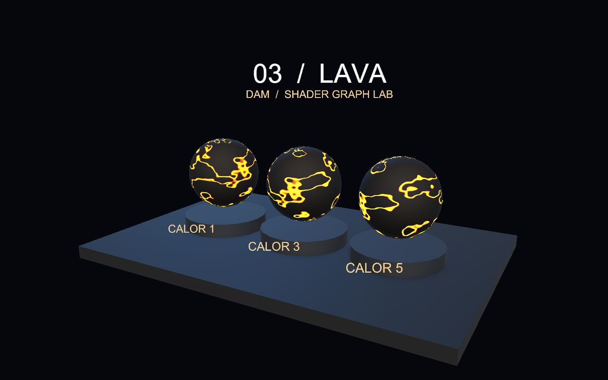
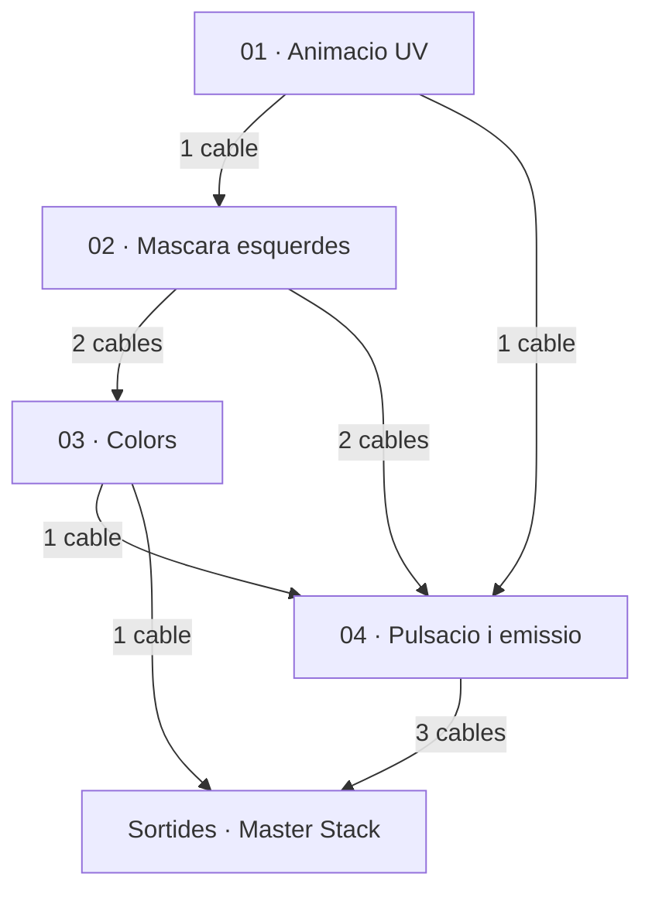
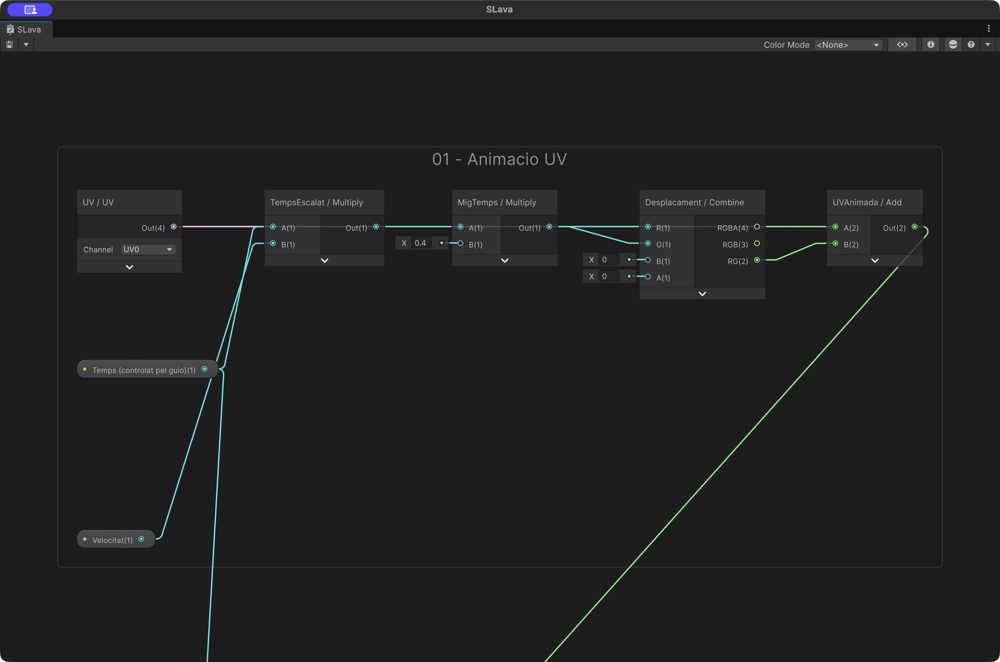
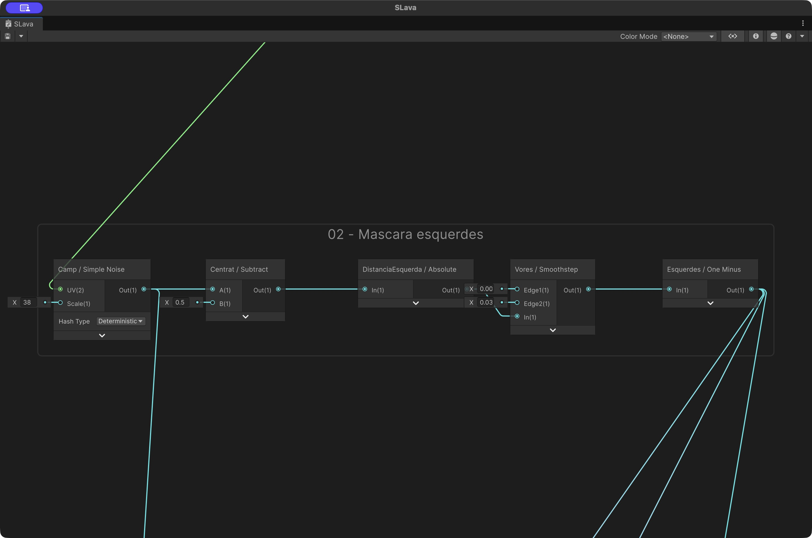
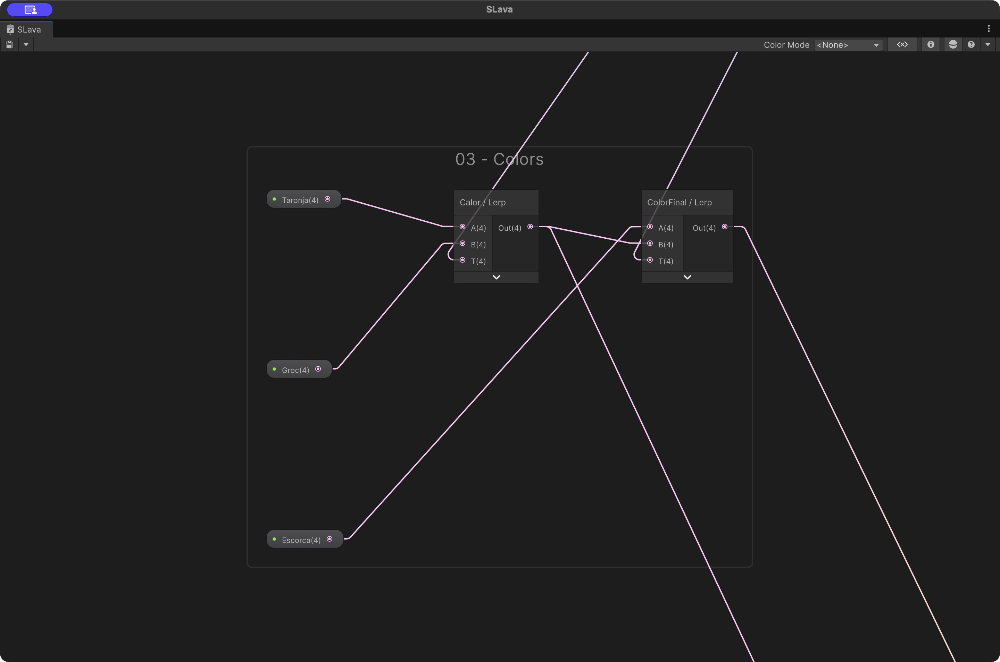
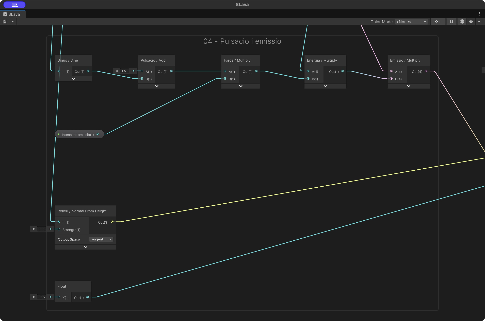
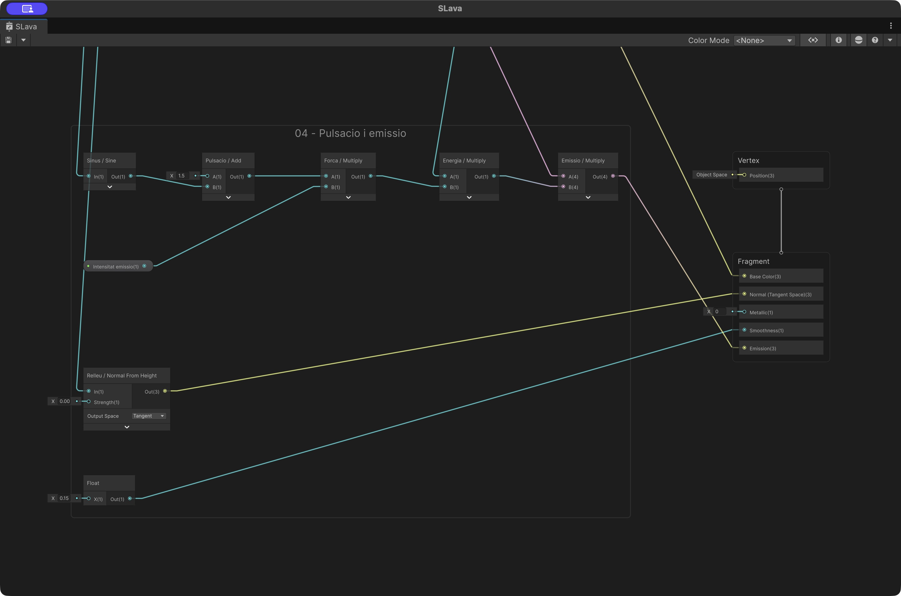
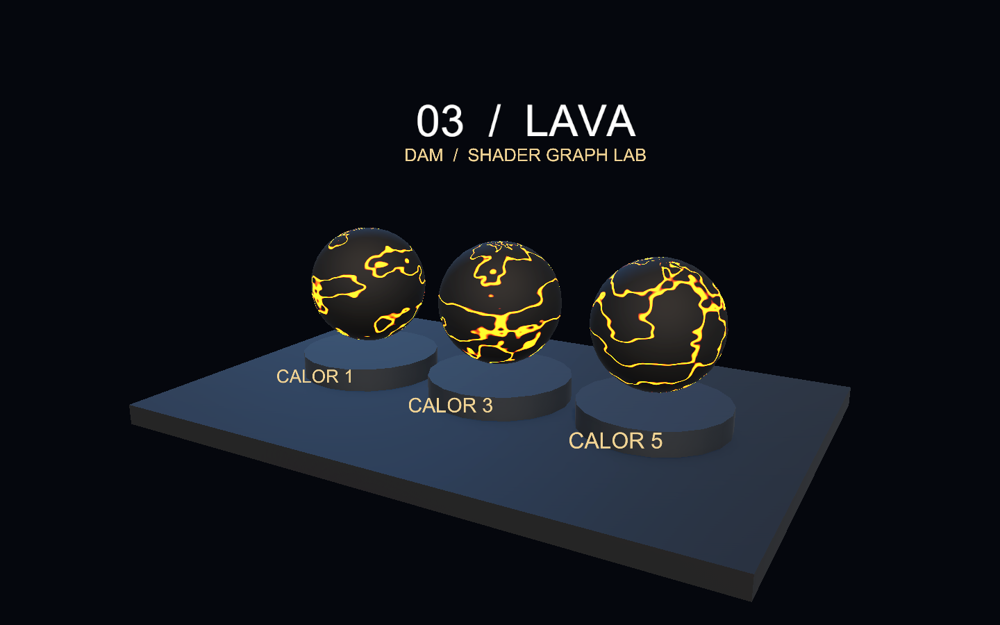

# Demo 3: Lava: esquerdes i emissió animada

Construirem una superfície fosca travessada per esquerdes calentes. El temps desplaça el camp de soroll i fa variar l’emissió. Tres materials mostren intensitats i velocitats diferents.

**Projecte acabat:** [Demo-3-Lava.zip](demos/Demo-3-Lava.zip). Descomprimeix-lo i obre la carpeta amb Assets, Packages i ProjectSettings des de Unity Hub. Obre `Assets/Demos/Lava/Scenes/DemoLava.unity` i prem Play.



## 1. Preparar un projecte buit

1. Utilitza **Unity 6000.6.3f1**, la versió de les demos de Codi. Crea un projecte **Universal 3D (URP)**.
2. A Package Manager, comprova **Universal RP 17.6.0**, **Shader Graph 17.6.0** i **Input System 1.20.0**. Shader Graph arriba com a dependència d’URP.
3. A **Project Settings > Player > Active Input Handling**, selecciona **Input System Package (New)**. Accepta el reinici si Unity el demana.
4. Crea `Assets/Demos/Lava` amb les carpetes **Shaders**, **Materials**, **Scenes** i **Meshes**. Crea també **Assets/Common** per als scripts.
5. Crea una escena buida, afegeix una Camera amb tag **MainCamera** i desa l’escena com a `DemoLava` dins de Scenes.

## 2. Crear el Shader Graph

A Shaders, crea **Shader Graph > URP > Lit Shader Graph**, amb nom **SLava**. A Graph Inspector > Graph Settings, fixa:

| Opció | Valor |
|---|---|
| Target | Universal |
| Material | Lit |
| Surface Type | Opaque |
| Alpha Clipping | Desactivat |
| Render Face | Front |
| Cast Shadows | Desactivat |

Afegeix al Blackboard aquestes propietats. Activa **Exposed** i escriu les **Reference exactes**, inclòs el guió baix. Els colors s’indiquen com a RGBA normalitzat; si el selector mostra bytes 0–255, multiplica cada component per 255.

| Nom | Tipus | Reference | Valor inicial |
|---|---|---|---|
| Escorca | Color | `_Escorca` | (0.02, 0.028, 0.035, 1) |
| Groc | Color | `_Groc` | (1, 0.65, 0.05, 1) |
| Intensitat emissio | Float | `_Intensitat` | 3 |
| Taronja | Color | `_Taronja` | (1, 0.07, 0.004, 1) |
| Temps (controlat pel guio) | Float | `_Temps` | 0 |
| Velocitat | Float | `_Velocitat` | 0.18 |

Arrossega les propietats al gràfic per crear els seus nodes. La propietat no es crea escrivint-ne el nom en un node Float: s’ha de crear al Blackboard.

## 3. Entendre l’efecte

### Esquerdes

Simple Noise genera el camp. Subtract 0.5 i Absolute calculen la proximitat a un valor central. One Minus de Smoothstep selecciona una franja estreta d’aquest camp, amb transició entre 0.008 i 0.035.

### Animació

Temps × Velocitat desplaça les UV; l’eix V utilitza un 40% del desplaçament d’U. Un sinus modifica la intensitat, independentment de la velocitat de desplaçament. La propietat Temps rep segons del controlador; això permet pausar i reiniciar. Si només vols temps continu, es pot substituir per la sortida Time del node Time.

### Emissió

La màscara controla l’emissió taronja/groga, multiplicada per Intensitat i la pulsació. La superfície fosca té Smoothness 0.15. Bloom afegeix resplendor, però no il·lumina físicament els objectes veïns.

## 4. Connectar els nodes

Cada fila identifica un node. `Eixos:R` vol dir la sortida **R** del node identificat com Eixos; `Nom:Out` vol dir la seva sortida. Si el nom correspon a una propietat del Blackboard, utilitza el seu node Property. Els números sense `:` són valors literals escrits al port d’entrada. Els àlies Temps, Mode i Centre corresponen a les propietats amb Reference `_Temps`, `_Mode` i `_Centre`, quan existeixen en aquesta demo. En un port vectorial, un literal únic s’ha de repetir a tots els components: per exemple Frequency = 12 vol dir (12,12).

Les captures següents provenen del Shader Graph de Unity. A les captures de cada pas s’han ocultat els cables que només travessen el grup sense connectar-hi; es mantenen les seves entrades i sortides. Alguns camps numèrics es veuen arrodonits per l’amplada del node: utilitza els valors exactes de la taula. Cada grup numerat és un pas del mateix graf final. Segueix l’ordre, afegeix els nodes del pas i connecta’ls com a la captura i a la taula. Les propietats es creen al Blackboard segons l’apartat 2; els nodes Property simplement les llegeixen.

Els cables que entren des de fora del grup provenen de passos anteriors: el nom de la taula identifica l’origen. Al projecte acabat pots seleccionar un grup i prémer **F** per enquadrar-lo. Les previsualitzacions dels nodes estan plegades a les captures per deixar llegir ports i valors; pots desplegar-les per inspeccionar una màscara.

### Connexions entre grups

Aquest mapa mostra com es connecten els grups del graf. Cada fletxa agrupa el nombre de cables indicat; la taula inferior detalla **tots els cables entre grups i cap al Master Stack**, amb els ports exactes. Les captures dels passos següents mostren les connexions interiors.



Llegeix cada fila d’esquerra a dreta: **grup d’origen → node i port de sortida → grup de destinació → node i port d’entrada**. Per exemple, `Eixos:R` és el port R del node Eixos. Un mateix port pot alimentar diversos grups; conserva totes les branques indicades.

| Grup origen | Node:sortida | Grup destinació | Node:entrada |
|---|---|---|---|
| 01 | `UVAnimada:Out` | 02 | `Camp:UV` |
| 02 | `Esquerdes:Out` | 03 | `Calor:T` |
| 02 | `Esquerdes:Out` | 03 | `ColorFinal:T` |
| 01 | `Temps:Out` | 04 | `Sinus:In` |
| 02 | `Esquerdes:Out` | 04 | `Energia:A` |
| 02 | `Camp:Out` | 04 | `Relleu:In` |
| 03 | `Calor:Out` | 04 | `Emissio:A` |
| 03 | `ColorFinal:Out` | Master Stack | `Fragment:Base Color` |
| 04 | `Emissio:Out` | Master Stack | `Fragment:Emission` |
| 04 | `Relleu:Out` | Master Stack | `Fragment:Normal (Tangent Space)` |
| 04 | `Rugositat:Out` | Master Stack | `Fragment:Smoothness` |

A Unity, allunya el zoom per veure dos grups alhora. **F** enquadra la selecció; **A** enquadra tot el graf. Per seguir un cable llarg, identifica primer els dos extrems a la taula i localitza els grups numerats.

### Pas 1. Animacio UV

Les UV es desplacen amb Temps × Velocitat. Combine envia un moviment diferent a cada eix.



| ID | Node | Entrades |
|---|---|---|
| `UV` | UV |   |
| `TempsEscalat` | Multiply | A ← Temps:Out; B ← Velocitat:Out |
| `MigTemps` | Multiply | A ← TempsEscalat:Out; B ← 0.4 |
| `Desplacament` | Combine | R ← TempsEscalat:Out; G ← MigTemps:Out |
| `UVAnimada` | Add | A ← UV:Out; B ← Desplacament:RG |

### Pas 2. Mascara esquerdes

La proximitat del soroll a 0.5 defineix les esquerdes. Absolute tracta igual els dos costats.



| ID | Node | Entrades |
|---|---|---|
| `Camp` | Simple Noise | UV ← UVAnimada:Out; Scale ← 38 |
| `Centrat` | Subtract | A ← Camp:Out; B ← 0.5 |
| `DistanciaEsquerda` | Absolute | In ← Centrat:Out |
| `Vores` | Smoothstep | Edge1 ← 0.008; Edge2 ← 0.035; In ← DistanciaEsquerda:Out |
| `Esquerdes` | One Minus | In ← Vores:Out |

### Pas 3. Colors

La màscara barreja l’escorça fosca amb els colors calents.



| ID | Node | Entrades |
|---|---|---|
| `Calor` | Lerp | A ← Taronja:Out; B ← Groc:Out; T ← Esquerdes:Out |
| `ColorFinal` | Lerp | A ← Escorca:Out; B ← Calor:Out; T ← Esquerdes:Out |

### Pas 4. Pulsacio i emissio

El sinus controla la pulsació. La màscara limita l’emissió a les esquerdes, mentre Normal From Height afecta el relleu aparent.



| ID | Node | Entrades |
|---|---|---|
| `Sinus` | Sine | In ← Temps:Out |
| `Pulsacio` | Add | A ← 1.5; B ← Sinus:Out |
| `Forca` | Multiply | A ← Pulsacio:Out; B ← Intensitat:Out |
| `Energia` | Multiply | A ← Esquerdes:Out; B ← Forca:Out |
| `Emissio` | Multiply | A ← Calor:Out; B ← Energia:Out |
| `Relleu` | Normal From Height | In ← Camp:Out; Strength ← 0.002 |
| `Rugositat` | Float | X ← 0.15 |

### Pas 5. Master Stack i connexions finals

Connecta les branques als blocs del Master Stack indicats a continuació. Comprova l’espai de les normals i si les sortides són de Vertex o de Fragment. Els blocs sense cable conserven el valor per defecte.



| ID | Node | Entrades |
|---|---|---|
| Sortida | BaseColor | ColorFinal:Out |
| Sortida | Emission | Emissio:Out |
| Sortida | Normal (Tangent) | Relleu:Out |
| Sortida | Smoothness | Rugositat:Out |

Els números de les entrades són valors literals. En un vector, repeteix el valor a tots els components quan s’indica un únic nombre. A Combine, tria RG per a Vector2; a Split, R/G/B equivalen a X/Y/Z. Desa el graf abans de crear els materials.

## 5. Crear els materials

Amb el botó dret sobre SLava, crea els materials i assigna-hi el shader. `MLava0`, `MLava1`, `MLava2`: Intensitat = **1, 3, 5** i Velocitat = **0.09, 0.17, 0.25**, respectivament.

## 6. Construir l’escena

Les posicions són globals i les escales corresponen a les primitives de Unity. Mantén els objectes a l’arrel, sense un pare escalat. Els elements decoratius i textos es poden ometre: no intervenen en el shader.

| Objecte | Primitiva | Posicio | Escala |
|---|---|---|---|
| Base | Cube | (0, -0.22, 0) | (12, 0.4, 8) |
| Nucli0 | Sphere | (-3.2, 1.9, 0) | (2.4, 2.4, 2.4) |
| Peanya0 | Cylinder | (-3.2, 0.24, 0) | (2.85, 0.23, 2.85) |
| Nucli1 | Sphere | (0, 1.9, 0) | (2.4, 2.4, 2.4) |
| Peanya1 | Cylinder | (0, 0.24, 0) | (2.85, 0.23, 2.85) |
| Nucli2 | Sphere | (3.2, 1.9, 0) | (2.4, 2.4, 2.4) |
| Peanya2 | Cylinder | (3.2, 0.24, 0) | (2.85, 0.23, 2.85) |

### Càmera i llums

Posa Main Camera a **(8,6,−14)**, amb projecció **Perspective**, Field of View **40**, Near **0.1**, Far **100** i fons de color sòlid **RGB (0.018,0.029,0.052)**. Orienta-la cap al punt **(0,1.7,0)**. La rotació Euler corresponent és aproximadament **(14.932, -29.745, 0)**.

Afegeix dues llums Directional: **Key Light**, rotació (45,−30,0), intensitat 2 i color RGB (1,0.88,0.74); **Fill Light**, rotació (25,140,0), intensitat 1 i color RGB (0.35,0.67,1). A Lighting > Environment, utilitza ambient de color (0.32,0.38,0.48). La base porta un material Lit gris blavós (0.055,0.072,0.095), Smoothness 0.25; les peanyes, (0.1,0.14,0.19).

Activa **HDR** i **Post Processing** a la càmera. Afegeix un **Global Volume**, crea un perfil i afegeix **Bloom**, activant els overrides: Intensity **0.35**, Threshold **1**, Scatter **0.6**.

## 7. Afegir els controls

### Càmera orbital i zoom

Descarrega [DemoOrbitCamera.cs](demos/DemoOrbitCamera.cs) i desa’l a **Assets/Common/DemoOrbitCamera.cs**. Afegeix el component **Demo Orbit Camera** a **Main Camera**. Al ZIP ja està configurat.

- **Center = (0, 1.7, 0)**: punt fix al voltant del qual gira la càmera.
- **Minimum Distance = 3**, **Maximum Distance = 35**.
- **Rotation Sensitivity = 0.2**, **Zoom Sensitivity = 0.0015**.
- **Minimum Elevation = 5**, **Maximum Elevation = 85**: límits d’inclinació en graus.

En **Play**, clica **Game**. Mantén premut el **botó dret** i arrossega per girar; utilitza la **roda del ratolí** per apropar-te o allunyar-te. **Home** recupera la posició i orientació inicials. El centre no es desplaça i no cal afegir-hi cap objecte Target. La roda positiva apropa la càmera; la negativa l’allunya.

El controlador del panell, que trobaràs a continuació, informa la càmera de quan el punter és sobre els controls perquè el lliscador no mogui el punt de vista. La càmera funciona igualment quan el temps del shader està en pausa.

Crea **Assets/Common/DemoControls.cs** amb aquest codi complet:

```csharp
using UnityEngine;
using UnityEngine.InputSystem;

// Controls comuns a les demos. Crea còpies dels materials per conservar els originals del projecte.
public class DemoControls : MonoBehaviour
{
    public string title;
    public string description;
    // Arrossega els objectes visibles als quals aquest panell modificarà el material.
    public Renderer[] surfaces;
    // Nom intern (Reference) de la propietat del Shader Graph que controlarà el lliscador.
    public string parameter = "_Gruix";
    public float minimum = 0.02f;
    public float maximum = 0.3f;
    public float initialValue = 0.12f;
    public float timeScale = 1f;
    public bool paused;
    // Temps propi de la demo: es pot pausar sense aturar la càmera ni tota la partida.
    public float elapsed;
    public bool showPanel = true;
    Material[] materials;
    float value;

    // Prepara els materials i la connexió amb la càmera quan es carrega el component.
    void Awake()
    {
        // Reserva una entrada per al material de cada superfície assignada a l'Inspector.
        materials = new Material[surfaces.Length];
        // Accedir a .material crea una còpia per a cada Renderer; així es conserven els materials del
        // projecte.
        for (int i = 0; i < surfaces.Length; i++) materials[i] = surfaces[i].material;
        value = initialValue;
        // Busca el controlador orbital a la càmera amb el tag MainCamera, si n'hi ha.
        var orbit = Camera.main ? Camera.main.GetComponent<DemoOrbitCamera>() : null;
        // Passa una funció a la càmera perquè detecti el punter sobre el panell i no mogui la vista en
        // usar-lo.
        if (orbit) orbit.IsPointerOverControls = point => showPanel && new Rect(16, 16, 380, 180).Contains(point);
    }
    void Update()
    {
        // Comprova que hi hagi teclat abans de llegir les tecles de control.
        if (Keyboard.current != null)
        {
            // Alterna la pausa amb una sola pulsació, sense repetir-la mentre la tecla es manté premuda.
            if (Keyboard.current.spaceKey.wasPressedThisFrame) paused = !paused;
            if (Keyboard.current.hKey.wasPressedThisFrame) showPanel = !showPanel;
            if (Keyboard.current.rKey.wasPressedThisFrame) { elapsed = 0; SetParameter(initialValue); }
        }
        // Avança el rellotge de l'efecte només si no està en pausa; timeScale en regula la velocitat.
        if (!paused) elapsed += Time.deltaTime * timeScale;
        // Envia aquest temps als shaders que tenen la propietat _Temps.
        ApplyTime(elapsed);
    }
    public void ApplyTime(float seconds)
    {
        if (materials == null) return;
        foreach (Material material in materials)
            // Comprova que la propietat existeixi abans d'actualitzar l'animació del material.
            if (material.HasProperty("_Temps")) material.SetFloat("_Temps", seconds);
    }
    public void SetParameter(float next)
    {
        // Limita el valor triat al rang permès per a aquesta demo.
        value = Mathf.Clamp(next, minimum, maximum);
        if (materials == null) return;
        foreach (Material material in materials)
            // Actualitza la propietat indicada pel seu nom intern a cada material compatible.
            if (material.HasProperty(parameter)) material.SetFloat(parameter, value);
    }
    // Unity crida OnGUI per dibuixar i gestionar aquest panell senzill de controls.
    void OnGUI()
    {
        if (!showPanel) return;
        GUI.Box(new Rect(16, 16, 380, 180), "");
        // Delimita en píxels l'àrea on GUILayout col·locarà els textos i el lliscador.
        GUILayout.BeginArea(new Rect(30, 25, 350, 162));
        GUILayout.Label(title);
        GUILayout.Label(description);
        GUILayout.Label(parameter + ": " + value.ToString("0.00"));
        // Dibuixa el lliscador i llegeix el valor que l'usuari hi selecciona.
        float next = GUILayout.HorizontalSlider(value, minimum, maximum);
        // Aplica el paràmetre als materials només quan l'usuari en canvia el valor.
        if (next != value) SetParameter(next);
        GUILayout.Label("Espai: pausa | R: reinicia | H: amaga el panell");
        GUILayout.Label("Boto dret: orbita | Roda: zoom | Home: vista inicial");
        GUILayout.EndArea();
    }
    void OnDestroy()
    {
        if (materials == null) return;
        // Allibera les còpies de materials creades a Awake quan es destrueix el component.
        foreach (Material material in materials) Destroy(material);
    }
}
```

Crea un objecte buit **Controls** i afegeix-hi DemoControls. A **Surfaces**, assigna els tres Renderers de les mostres, en ordre d’esquerra a dreta. No hi afegeixis la base, els textos ni les peanyes.

| Camp | Valor |
|---|---|
| Title | 03 / Lava |
| Description | Compara les variants i modifica el material. |
| Parameter | `_Intensitat` |
| Minimum | 0 |
| Maximum | 8 |
| Initial Value | 3 |

**Controls:** lliscador per modificar `_Intensitat`; Espai pausa el temps; R reinicia temps i paràmetre; H amaga el panell. En moure el lliscador, el valor s’aplica a totes les mostres. Abans de tocar-lo, cada material conserva les variants de l’apartat 5. Els rètols de l’escena identifiquen aquestes variants inicials; el panell mostra el valor actual del control.

Els canvis durant Play són temporals. Per canviar els valors inicials de manera permanent, atura Play i edita els assets de material.

## 8. Provar la demo

1. Prem Play: canvien les esquerdes i la pulsació.
2. Prem Espai: el patró queda congelat; torna a prémer per continuar.
3. Mou Intensitat a 0: desapareix l’emissió, però continua existint el color de la superfície.
4. Prem R: el temps torna a zero i la intensitat al valor del controlador.




## Si alguna cosa no funciona

Si no s’anima, comprova la Reference `_Temps`, la llista Surfaces del controlador i que no estigui pausat. Si no hi ha resplendor, comprova HDR, Post Processing i Bloom.

Si el material és rosa, comprova URP, la compilació del gràfic i la Console. Si el teclat no respon, comprova Input System, entra a Play i clica Game.

## Ampliació

Afegeix una segona escala de soroll per trencar la regularitat de les esquerdes. Compara el cost i el resultat amb una sola capa.
