# Demo 4: Aigua: ones i textures animades

Construirem una piscina estilitzada amb una malla subdividida, moviment de vèrtexs i una franja d’escuma al voltant de les roques. La profunditat de l’escena permet detectar proximitat visual amb la riba.

**Projecte acabat:** [Demo-4-Aigua.zip](demos/Demo-4-Aigua.zip). Descomprimeix-lo i obre la carpeta amb Assets, Packages i ProjectSettings des de Unity Hub. Obre `Assets/Demos/Aigua/Scenes/DemoAigua.unity` i prem Play.


El ZIP inclou també **DemoAiguaGalaxy.unity**, una segona escena amb superfície plana, textures animades, distorsió del fons i escuma de contacte. La seva construcció s’explica a l’apartat 9; comparteix projecte i controls amb aquesta primera versió.

## 1. Preparar un projecte buit

1. Utilitza **Unity 6000.6.3f1**, la versió de les demos de Codi. Crea un projecte **Universal 3D (URP)**.
2. A Package Manager, comprova **Universal RP 17.6.0**, **Shader Graph 17.6.0** i **Input System 1.20.0**. Shader Graph arriba com a dependència d’URP.
3. A **Project Settings > Player > Active Input Handling**, selecciona **Input System Package (New)**. Accepta el reinici si Unity el demana.
4. Crea `Assets/Demos/Aigua` amb les carpetes **Shaders**, **Materials**, **Scenes** i **Meshes**. Crea també **Assets/Common** per als scripts.
5. Crea una escena buida, afegeix una Camera amb tag **MainCamera** i desa l’escena com a `DemoAigua` dins de Scenes.

## 2. Crear el Shader Graph

A Shaders, crea **Shader Graph > URP > Lit Shader Graph**, amb nom **SAigua**. A Graph Inspector > Graph Settings, fixa:

| Opció | Valor |
|---|---|
| Target | Universal |
| Material | Lit |
| Surface Type | Transparent |
| Alpha Clipping | Desactivat |
| Render Face | Front |
| Cast Shadows | Desactivat |

Per a Transparent, utilitza Blending Mode **Alpha**.

Afegeix al Blackboard aquestes propietats. Activa **Exposed** i escriu les **Reference exactes**, inclòs el guió baix. Els colors s’indiquen com a RGBA normalitzat; si el selector mostra bytes 0–255, multiplica cada component per 255.

| Nom | Tipus | Reference | Valor inicial |
|---|---|---|---|
| Amplada escuma | Float | `_AmpladaEscuma` | 0.6 |
| Amplitud | Float | `_Amplitud` | 0.12 |
| Blanc | Color | `_Blanc` | (0.8, 1, 1, 1) |
| Brillantor | Float | `_Brillantor` | 0.5 |
| Frequencia | Float | `_Frequencia` | 2.2 |
| Opacitat | Float | `_Opacitat` | 0.8 |
| Profund | Color | `_Profund` | (0.005, 0.16, 0.28, 1) |
| Superficie | Color | `_Superficie` | (0.015, 0.65, 0.65, 1) |
| Temps (controlat pel guio) | Float | `_Temps` | 0 |

Arrossega les propietats al gràfic per crear els seus nodes. La propietat no es crea escrivint-ne el nom en un node Float: s’ha de crear al Blackboard.

## 3. Entendre l’efecte

### Ones geomètriques

Position Object proporciona X. El sinus de X × Frequencia + Temps, multiplicat per Amplitud, es suma només a Y. Connecta la posició completa resultant a Vertex / Position. Una malla de dos triangles no pot dibuixar aquesta forma: farem una graella de 80 × 80 cel·les.

### Escuma

Scene Depth en mode Eye llegeix la profunditat del fons. La profunditat de la superfície es calcula com −Position View.z. La diferència entra a Smoothstep entre 0 i AmpladaEscuma; One Minus dona blanc quan fons i aigua són propers en profunditat.

Aquesta escena té fons opac sota tota l’aigua. El càlcul mesura separació en l’eix de vista, no una col·lisió física. Una profunditat negativa queda a la banda blanca del Smoothstep.

### Color i normals

Un soroll barreja dos colors d’aigua. La màscara d’escuma substitueix aquest color per blanc turquesa. Les normals afegeixen detall aparent, mentre que les ones mouen realment els vèrtexs. El collider no es deforma i les normals geomètriques no es recalculen automàticament amb l’ona: l’amplitud és moderada.

## 4. Connectar els nodes

Cada fila identifica un node. `Eixos:R` vol dir la sortida **R** del node identificat com Eixos; `Nom:Out` vol dir la seva sortida. Si el nom correspon a una propietat del Blackboard, utilitza el seu node Property. Els números sense `:` són valors literals escrits al port d’entrada. Els àlies Temps, Mode i Centre corresponen a les propietats amb Reference `_Temps`, `_Mode` i `_Centre`, quan existeixen en aquesta demo. En un port vectorial, un literal únic s’ha de repetir a tots els components: per exemple Frequency = 12 vol dir (12,12).

Les captures següents provenen del Shader Graph de Unity. A les captures de cada pas s’han ocultat els cables que només travessen el grup sense connectar-hi; es mantenen les seves entrades i sortides. Alguns camps numèrics es veuen arrodonits per l’amplada del node: utilitza els valors exactes de la taula. Cada grup numerat és un pas del mateix graf final. Segueix l’ordre, afegeix els nodes del pas i connecta’ls com a la captura i a la taula. Les propietats es creen al Blackboard segons l’apartat 2; els nodes Property simplement les llegeixen.

Els cables que entren des de fora del grup provenen de passos anteriors: el nom de la taula identifica l’origen. Al projecte acabat pots seleccionar un grup i prémer **F** per enquadrar-lo. Les previsualitzacions dels nodes estan plegades a les captures per deixar llegir ports i valors; pots desplegar-les per inspeccionar una màscara.

### Connexions entre grups

Aquest mapa mostra com es connecten els grups del graf. Cada fletxa agrupa el nombre de cables indicat; la taula inferior detalla **tots els cables entre grups i cap al Master Stack**, amb els ports exactes. Les captures dels passos següents mostren les connexions interiors.

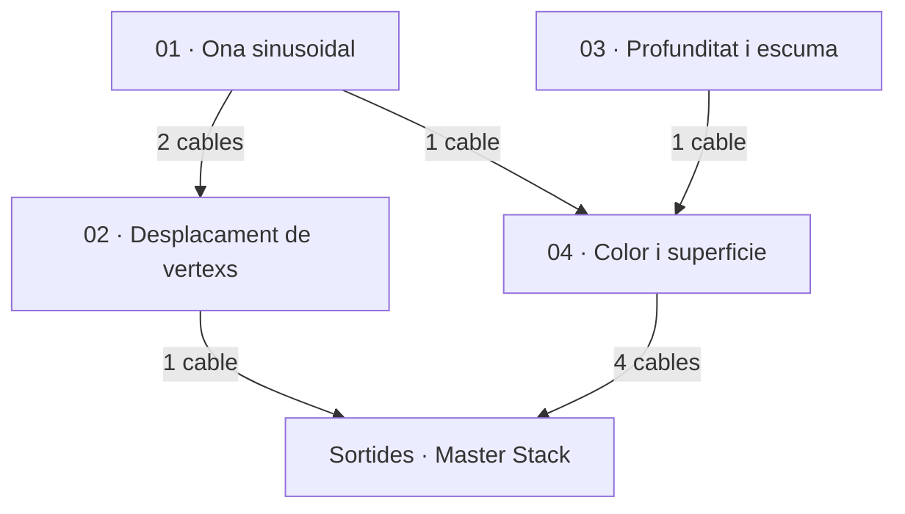
```mermaid
flowchart TD
    G1["01 · Ona sinusoidal"]
    G2["02 · Desplacament de vertexs"]
    G3["03 · Profunditat i escuma"]
    G4["04 · Color i superficie"]
    G5["Sortides · Master Stack"]
    G1 -->|"2 cables"| G2
    G1 -->|"1 cable"| G4
    G2 -->|"1 cable"| G5
    G3 -->|"1 cable"| G4
    G4 -->|"4 cables"| G5
```

Llegeix cada fila d’esquerra a dreta: **grup d’origen → node i port de sortida → grup de destinació → node i port d’entrada**. Per exemple, `Eixos:R` és el port R del node Eixos. Un mateix port pot alimentar diversos grups; conserva totes les branques indicades.

| Grup origen | Node:sortida | Grup destinació | Node:entrada |
|---|---|---|---|
| 01 | `Ona:Out` | 02 | `Altura:A` |
| 01 | `Posicio:Out` | 02 | `PosicioFinal:A` |
| 01 | `UV:Out` | 04 | `Soroll:UV` |
| 03 | `Escuma:Out` | 04 | `ColorFinal:T` |
| 02 | `PosicioFinal:Out` | Master Stack | `Vertex:Position` |
| 04 | `Opacitat:Out` | Master Stack | `Fragment:Alpha` |
| 04 | `ColorFinal:Out` | Master Stack | `Fragment:Base Color` |
| 04 | `Normals:Out` | Master Stack | `Fragment:Normal (Tangent Space)` |
| 04 | `Brillantor:Out` | Master Stack | `Fragment:Smoothness` |

A Unity, allunya el zoom per veure dos grups alhora. **F** enquadra la selecció; **A** enquadra tot el graf. Per seguir un cable llarg, identifica primer els dos extrems a la taula i localitza els grups numerats.

### Pas 1. Ona sinusoidal

Construeix la fase amb Position Object.x, Frequencia i Temps; Sine produeix l’ona.

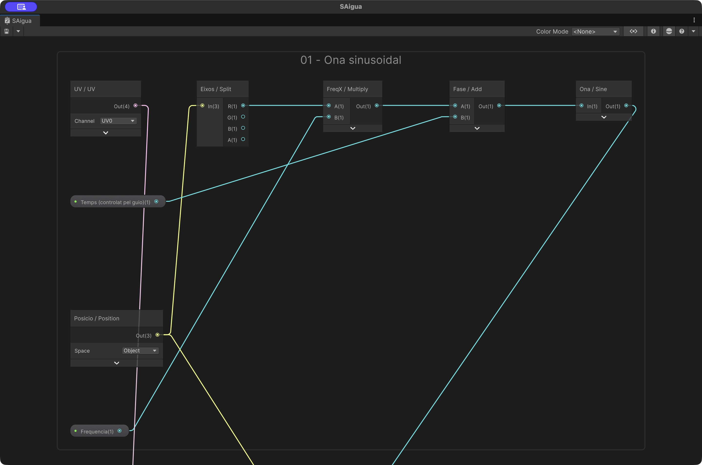

| ID | Node | Entrades |
|---|---|---|
| `UV` | UV |   |
| `Posicio` | Position | Space: Object |
| `Eixos` | Split | In ← Posicio:Out |
| `FreqX` | Multiply | A ← Eixos:R; B ← Frequencia:Out |
| `Fase` | Add | A ← FreqX:Out; B ← Temps:Out |
| `Ona` | Sine | In ← Fase:Out |

### Pas 2. Desplacament de vertexs

Multiplica l’ona per Amplitud i suma-la només a Y. Aquesta sortida va a Vertex / Position.

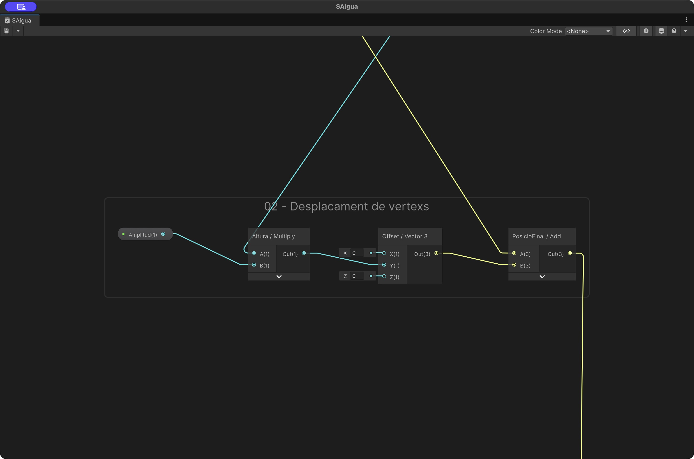

| ID | Node | Entrades |
|---|---|---|
| `Altura` | Multiply | A ← Ona:Out; B ← Amplitud:Out |
| `Offset` | Vector 3 | X ← 0; Y ← Altura:Out; Z ← 0 |
| `PosicioFinal` | Add | A ← Posicio:Out; B ← Offset:Out |

### Pas 3. Profunditat i escuma

Scene Depth i Position View han d’utilitzar la mateixa profunditat lineal: Eye i −Z, respectivament.

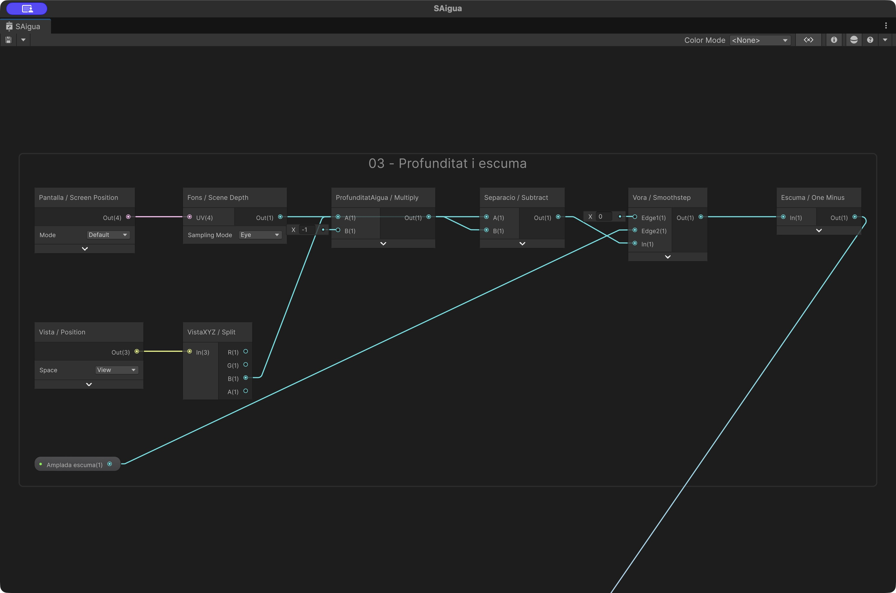

| ID | Node | Entrades |
|---|---|---|
| `Pantalla` | Screen Position |   |
| `Fons` | Scene Depth | Sampling: Eye; UV ← Pantalla:Out |
| `Vista` | Position | Space: View |
| `VistaXYZ` | Split | In ← Vista:Out |
| `ProfunditatAigua` | Multiply | A ← VistaXYZ:B; B ← -1 |
| `Separacio` | Subtract | A ← Fons:Out; B ← ProfunditatAigua:Out |
| `Vora` | Smoothstep | Edge1 ← 0; Edge2 ← AmpladaEscuma:Out; In ← Separacio:Out |
| `Escuma` | One Minus | In ← Vora:Out |

### Pas 4. Color i superficie

El soroll barreja els dos blaus; l’escuma força el color clar. Alpha i Smoothness són propietats independents.

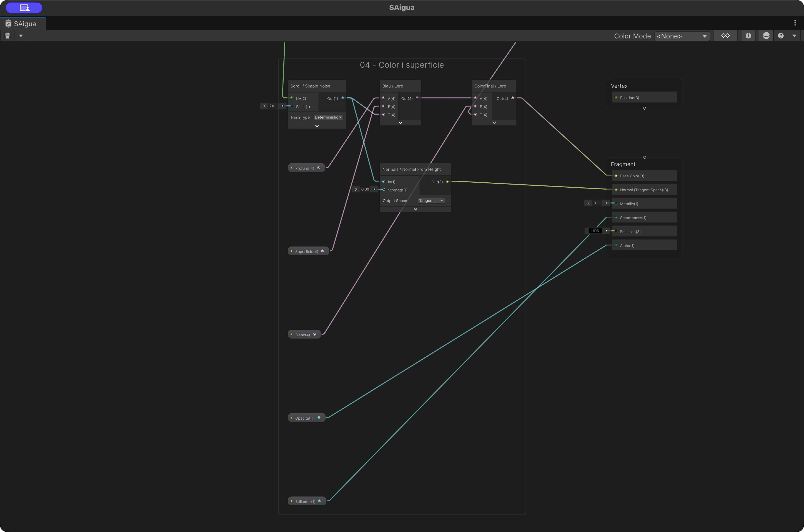

| ID | Node | Entrades |
|---|---|---|
| `Soroll` | Simple Noise | UV ← UV:Out; Scale ← 24 |
| `Blau` | Lerp | A ← Profund:Out; B ← Superficie:Out; T ← Soroll:Out |
| `ColorFinal` | Lerp | A ← Blau:Out; B ← Blanc:Out; T ← Escuma:Out |
| `Normals` | Normal From Height | In ← Soroll:Out; Strength ← 0.003 |

### Pas 5. Master Stack i connexions finals

Connecta les branques als blocs del Master Stack indicats a continuació. Comprova l’espai de les normals i si les sortides són de Vertex o de Fragment. Els blocs sense cable conserven el valor per defecte.

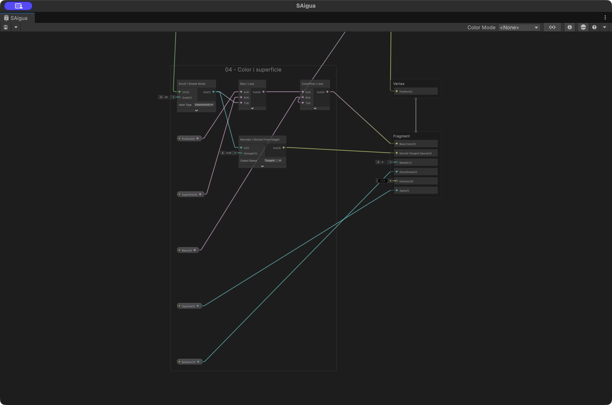

| ID | Node | Entrades |
|---|---|---|
| Sortida | Position | PosicioFinal:Out |
| Sortida | BaseColor | ColorFinal:Out |
| Sortida | Alpha | Opacitat:Out |
| Sortida | Smoothness | Brillantor:Out |
| Sortida | Normal (Tangent) | Normals:Out |

Els números de les entrades són valors literals. En un vector, repeteix el valor a tots els components quan s’indica un únic nombre. A Combine, tria RG per a Vector2; a Split, R/G/B equivalen a X/Y/Z. Desa el graf abans de crear els materials.

## 5. Crear els materials

Amb el botó dret sobre SAigua, crea els materials i assigna-hi el shader. Crea un material `MAigua` amb els valors inicials. Assigna’l al Mesh Renderer de l’objecte Aigua. Els materials de les roques de la riba són Lit de color gris (0.25,0.3,0.31).

## 6. Construir l’escena

Les posicions són globals i les escales corresponen a les primitives de Unity. Mantén els objectes a l’arrel, sense un pare escalat. Els elements decoratius i textos es poden ometre: no intervenen en el shader.

| Objecte | Primitiva | Posicio | Escala |
|---|---|---|---|
| Base | Cube | (0, -0.22, 0) | (12, 0.4, 8) |
| FonsPiscina | Cube | (0, 0.05, 0) | (8, 0.2, 5) |
| RibaEsquerra | Cube | (-4.15, 0.3, 0) | (0.4, 0.6, 5.7) |
| RibaDreta | Cube | (4.15, 0.3, 0) | (0.4, 0.6, 5.7) |
| RibaDarrera | Cube | (0, 0.3, 2.65) | (8, 0.6, 0.4) |
| RocaRiba0 | Sphere | (-2.5, 0.5, 0.4) | (1.4, 1.7, 1.3) |
| RocaRiba1 | Sphere | (-1.3, 0.5, 1.3) | (1.4, 1.7, 1.3) |
| RocaRiba2 | Sphere | (-0.1, 0.5, 0.4) | (1.4, 1.7, 1.3) |
| RocaRiba3 | Sphere | (1.1, 0.5, 1.3) | (1.4, 1.7, 1.3) |
| RocaRiba4 | Sphere | (2.3, 0.5, 0.4) | (1.4, 1.7, 1.3) |

### Generar les malles

Crea **Assets/Editor/GenerarMalles.cs** amb aquest codi. Espera que compili. El menú **Demos** permet crear una graella d’aigua i cinc roques; els assets apareixen a **Assets/Meshes**. Les malles del ZIP ja estan desades dins de la carpeta de la demo.

```csharp
using UnityEngine;
using UnityEditor;
using System.IO;

// Utilitat opcional per reconstruir les malles dels exemples des de zero.
public static class GenerarMalles
{
    // Afegeix una opció al menú de l'Editor; aquesta utilitat es desa dins d'una carpeta Editor.
    [MenuItem("Demos/Crear malla d'aigua")]
    public static void Aigua()
    {
        // Divideix cada costat en 80 trams per tenir prou vèrtexs per dibuixar les onades.
        const int n = 80;
        var mesh = new Mesh { name = "WaterGrid" };
        // Una graella de n trams necessita n + 1 punts a cada costat.
        var vertices = new Vector3[(n + 1) * (n + 1)];
        // Les UV indiquen on correspon cada vèrtex dins del patró o textura, normalment entre 0 i 1.
        var uv = new Vector2[vertices.Length];
        // Cada casella es dibuixa amb dos triangles de tres índexs cadascun.
        var triangles = new int[n * n * 6];
        for (int z = 0; z <= n; z++)
            for (int x = 0; x <= n; x++)
            {
                // Converteix la fila i la columna de la graella en un índex de la llista de vèrtexs.
                int i = z * (n + 1) + x;
                // Reparteix els punts sobre un rectangle de 8 per 5 unitats centrat a l'origen.
                vertices[i] = new Vector3((float)x / n * 8 - 4, 0, (float)z / n * 5 - 2.5f);
                // Associa cada punt de la graella amb la seva coordenada UV proporcional.
                uv[i] = new Vector2((float)x / n, (float)z / n);
            }
        // Recorre la llista d'índexs per construir les dues cares triangulars de cada casella.
        int k = 0;
        for (int z = 0; z < n; z++)
            for (int x = 0; x < n; x++)
            {
                // Converteix la fila i la columna de la graella en un índex de la llista de vèrtexs.
                int i = z * (n + 1) + x;
                triangles[k++] = i; triangles[k++] = i + n + 1; triangles[k++] = i + 1;
                triangles[k++] = i + 1; triangles[k++] = i + n + 1; triangles[k++] = i + n + 2;
            }
        mesh.vertices = vertices; mesh.uv = uv; mesh.triangles = triangles;
        // Calcula les normals i les tangents que els shaders fan servir per orientar la il·luminació i
        // el relleu.
        mesh.RecalculateNormals(); mesh.RecalculateTangents();
        // Reserva altura al volum visible perquè les onades del shader no quedin fora dels límits de la
        // malla.
        mesh.bounds = new Bounds(Vector3.zero, new Vector3(8, 2, 5));
        Save(mesh, "WaterGrid");
    }

    // Afegeix al menú de l'Editor la generació de cinc variants de roca.
    [MenuItem("Demos/Crear cinc malles de roca")]
    public static void Roques()
    {
        for (int seed = 1; seed <= 5; seed++)
        {
            var temporary = GameObject.CreatePrimitive(PrimitiveType.Sphere);
            // Copia la malla de l'esfera per deformar-la sense modificar la malla original de Unity.
            var mesh = Object.Instantiate(temporary.GetComponent<MeshFilter>().sharedMesh);
            // Elimina l'objecte auxiliar de l'Editor; ja conservem la còpia de la seva malla.
            Object.DestroyImmediate(temporary);
            var vertices = mesh.vertices;
            for (int i = 0; i < vertices.Length; i++)
            {
                // Obtén la direcció del vèrtex des del centre per calcular-ne la deformació.
                Vector3 d = vertices[i].normalized;
                // Combina ones per crear irregularitats; seed produeix una forma diferent a cada roca.
                float factor = 1 + .045f * Mathf.Sin(d.x * 13 + seed) * Mathf.Cos(d.y * 11 + seed)
                    + .035f * Mathf.Sin(d.z * 17 + seed);
                // Acosta o allunya el vèrtex del centre segons la deformació calculada.
                vertices[i] *= factor;
            }
            // Aplica la forma nova i actualitza les normals i el volum que l'envolta.
            mesh.vertices = vertices; mesh.RecalculateNormals(); mesh.RecalculateBounds();
            Save(mesh, "Rock" + seed);
        }
    }

    static void Save(Mesh mesh, string name)
    {
        Directory.CreateDirectory("Assets/Meshes");
        // Genera un nom de fitxer lliure per no sobreescriure una malla creada abans.
        string path = AssetDatabase.GenerateUniqueAssetPath("Assets/Meshes/" + name + ".asset");
        // Desa la malla com a recurs del projecte per poder-la assignar a un Mesh Filter.
        AssetDatabase.CreateAsset(mesh, path);
        AssetDatabase.SaveAssets();
        // Selecciona la malla creada perquè es pugui veure a l'Inspector.
        Selection.activeObject = mesh;
    }
}
```

Executa els dos menús. Crea un objecte buit **Aigua** a **(0,0.65,0)**, escala **(1,1,1)**, amb **Mesh Filter = WaterGrid** i **Mesh Renderer = MAigua**. Assigna Rock1–Rock5 als Mesh Filter de les roques. No cal cap collider per a l’aigua.

### Càmera i llums

Posa Main Camera a **(9,8,−11)**, amb projecció **Perspective**, Field of View **40**, Near **0.1**, Far **100** i fons de color sòlid **RGB (0.018,0.029,0.052)**. Orienta-la cap al punt **(0,1.7,0)**. La rotació Euler corresponent és aproximadament **(23.906, -39.289, 0)**.

Afegeix dues llums Directional: **Key Light**, rotació (45,−30,0), intensitat 2 i color RGB (1,0.88,0.74); **Fill Light**, rotació (25,140,0), intensitat 1 i color RGB (0.35,0.67,1). A Lighting > Environment, utilitza ambient de color (0.32,0.38,0.48). La base porta un material Lit gris blavós (0.055,0.072,0.095), Smoothness 0.25; les peanyes, (0.1,0.14,0.19).

A l’URP Asset actiu, activa **Depth Texture** i comprova que la càmera no ho sobreescriu desactivant-la. Utilitza el renderer 3D Universal. **Opaque Texture no és necessària en aquest gràfic**, perquè no utilitza Scene Color. El projecte la té disponible per experimentar. El material Sorra és RGB (0.5,0.39,0.23).

## 7. Afegir els controls

### Càmera orbital i zoom

Descarrega [DemoOrbitCamera.cs](demos/DemoOrbitCamera.cs) i desa’l a **Assets/Common/DemoOrbitCamera.cs**. Afegeix el component **Demo Orbit Camera** a **Main Camera**. Al ZIP ja està configurat.

- **Center = (0, 1.7, 0)**: punt fix al voltant del qual gira la càmera.
- **Minimum Distance = 3**, **Maximum Distance = 35**.
- **Rotation Sensitivity = 0.2**, **Zoom Sensitivity = 0.0015**.
- **Minimum Elevation = 5**, **Maximum Elevation = 85**: límits d’inclinació en graus.

En **Play**, clica **Game**. Mantén premut el **botó dret** i arrossega per girar; utilitza la **roda del ratolí** per apropar-te o allunyar-te. **Home** recupera la posició i orientació inicials. El centre no es desplaça i no cal afegir-hi cap objecte Target. La roda positiva apropa la càmera; la negativa l’allunya.

El controlador del panell, que trobaràs a continuació, informa la càmera de quan el punter és sobre els controls perquè el lliscador no mogui el punt de vista. La càmera funciona igualment quan el temps del shader està en pausa.

A **DemoAiguaGalaxy**, utilitza **Center = (0, 1, 0)**. Aquesta escena també porta el component configurat.

Crea **Assets/Common/DemoControls.cs** amb aquest codi complet:

```csharp
using UnityEngine;
using UnityEngine.InputSystem;

// Controls comuns a les demos. Crea còpies dels materials per conservar els originals del projecte.
public class DemoControls : MonoBehaviour
{
    public string title;
    public string description;
    // Arrossega els objectes visibles als quals aquest panell modificarà el material.
    public Renderer[] surfaces;
    // Nom intern (Reference) de la propietat del Shader Graph que controlarà el lliscador.
    public string parameter = "_Gruix";
    public float minimum = 0.02f;
    public float maximum = 0.3f;
    public float initialValue = 0.12f;
    public float timeScale = 1f;
    public bool paused;
    // Temps propi de la demo: es pot pausar sense aturar la càmera ni tota la partida.
    public float elapsed;
    public bool showPanel = true;
    Material[] materials;
    float value;

    // Prepara els materials i la connexió amb la càmera quan es carrega el component.
    void Awake()
    {
        // Reserva una entrada per al material de cada superfície assignada a l'Inspector.
        materials = new Material[surfaces.Length];
        // Accedir a .material crea una còpia per a cada Renderer; així es conserven els materials del
        // projecte.
        for (int i = 0; i < surfaces.Length; i++) materials[i] = surfaces[i].material;
        value = initialValue;
        // Busca el controlador orbital a la càmera amb el tag MainCamera, si n'hi ha.
        var orbit = Camera.main ? Camera.main.GetComponent<DemoOrbitCamera>() : null;
        // Passa una funció a la càmera perquè detecti el punter sobre el panell i no mogui la vista en
        // usar-lo.
        if (orbit) orbit.IsPointerOverControls = point => showPanel && new Rect(16, 16, 380, 180).Contains(point);
    }
    void Update()
    {
        // Comprova que hi hagi teclat abans de llegir les tecles de control.
        if (Keyboard.current != null)
        {
            // Alterna la pausa amb una sola pulsació, sense repetir-la mentre la tecla es manté premuda.
            if (Keyboard.current.spaceKey.wasPressedThisFrame) paused = !paused;
            if (Keyboard.current.hKey.wasPressedThisFrame) showPanel = !showPanel;
            if (Keyboard.current.rKey.wasPressedThisFrame) { elapsed = 0; SetParameter(initialValue); }
        }
        // Avança el rellotge de l'efecte només si no està en pausa; timeScale en regula la velocitat.
        if (!paused) elapsed += Time.deltaTime * timeScale;
        // Envia aquest temps als shaders que tenen la propietat _Temps.
        ApplyTime(elapsed);
    }
    public void ApplyTime(float seconds)
    {
        if (materials == null) return;
        foreach (Material material in materials)
            // Comprova que la propietat existeixi abans d'actualitzar l'animació del material.
            if (material.HasProperty("_Temps")) material.SetFloat("_Temps", seconds);
    }
    public void SetParameter(float next)
    {
        // Limita el valor triat al rang permès per a aquesta demo.
        value = Mathf.Clamp(next, minimum, maximum);
        if (materials == null) return;
        foreach (Material material in materials)
            // Actualitza la propietat indicada pel seu nom intern a cada material compatible.
            if (material.HasProperty(parameter)) material.SetFloat(parameter, value);
    }
    // Unity crida OnGUI per dibuixar i gestionar aquest panell senzill de controls.
    void OnGUI()
    {
        if (!showPanel) return;
        GUI.Box(new Rect(16, 16, 380, 180), "");
        // Delimita en píxels l'àrea on GUILayout col·locarà els textos i el lliscador.
        GUILayout.BeginArea(new Rect(30, 25, 350, 162));
        GUILayout.Label(title);
        GUILayout.Label(description);
        GUILayout.Label(parameter + ": " + value.ToString("0.00"));
        // Dibuixa el lliscador i llegeix el valor que l'usuari hi selecciona.
        float next = GUILayout.HorizontalSlider(value, minimum, maximum);
        // Aplica el paràmetre als materials només quan l'usuari en canvia el valor.
        if (next != value) SetParameter(next);
        GUILayout.Label("Espai: pausa | R: reinicia | H: amaga el panell");
        GUILayout.Label("Boto dret: orbita | Roda: zoom | Home: vista inicial");
        GUILayout.EndArea();
    }
    void OnDestroy()
    {
        if (materials == null) return;
        // Allibera les còpies de materials creades a Awake quan es destrueix el component.
        foreach (Material material in materials) Destroy(material);
    }
}
```

Crea un objecte buit **Controls** i afegeix-hi DemoControls. A **Surfaces**, assigna el Mesh Renderer d’Aigua. No hi afegeixis la base, els textos ni les peanyes.

| Camp | Valor |
|---|---|
| Title | 04 / Aigua |
| Description | Compara les variants i modifica el material. |
| Parameter | `_Amplitud` |
| Minimum | 0 |
| Maximum | 0.35 |
| Initial Value | 0.12 |

**Controls:** lliscador per modificar `_Amplitud`; Espai pausa el temps; R reinicia temps i paràmetre; H amaga el panell. En moure el lliscador, el valor s’aplica a totes les mostres. Abans de tocar-lo, cada material conserva les variants de l’apartat 5. Els rètols de l’escena identifiquen aquestes variants inicials; el panell mostra el valor actual del control.

Els canvis durant Play són temporals. Per canviar els valors inicials de manera permanent, atura Play i edita els assets de material.

## 8. Provar la demo

1. Prem Play i observa que es mou la silueta de l’aigua.
2. Mou Amplitud a 0: desapareix el desplaçament de vèrtexs.
3. Comprova que les roques tenen una franja clara al contacte visual amb l’aigua.
4. Atura Play i desactiva Depth Texture: observa per què la profunditat és un requisit; torna-la a activar.
5. Canvia AmpladaEscuma al material i compara la mida de la franja.

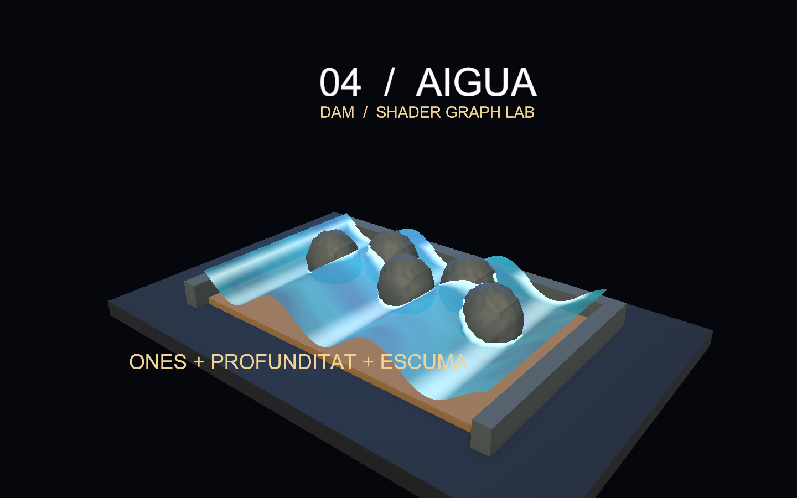

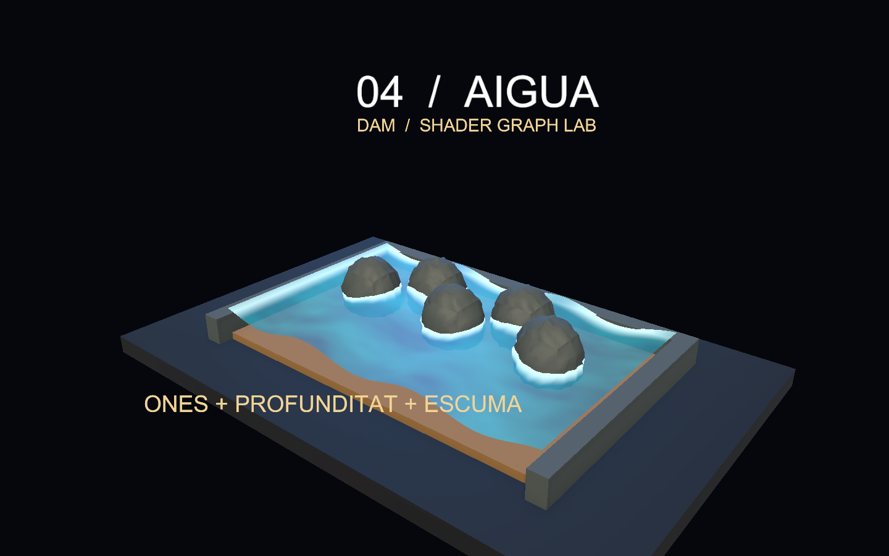

## Si alguna cosa no funciona

Si tota la superfície és blanca, revisa Depth Texture, el mode Eye de Scene Depth i el signe negatiu de Position View.z. Si la superfície és rígida, comprova la malla subdividida i la connexió Vertex/Position.

Si el material és rosa, comprova URP, la compilació del gràfic i la Console. Si el teclat no respon, comprova Input System, entra a Play i clica Game.

## Ampliació

Afegeix una segona ona perpendicular amb menys amplitud. Després investiga com calcular normals coherents amb el desplaçament.

## 9. Variant inspirada en Super Mario Galaxy

Aquesta recreació didàctica pren com a referència visual els reflexos i el fons de la [recreació d’Eyan Martucci](https://eyanmartucci.com/stylized-water-shader/). No és el shader original de Nintendo ni una reproducció exacta del joc. Utilitzem textures pròpies incloses al ZIP.

L’efecte separa una superfície plana que retalla taques blanques i un fons amb textura distorsionada, càustiques i tint segons profunditat. Hi afegim escuma de contacte amb Scene Depth per detectar les roques; l’escuma de vores UV de l’article, per si sola, no les detecta.

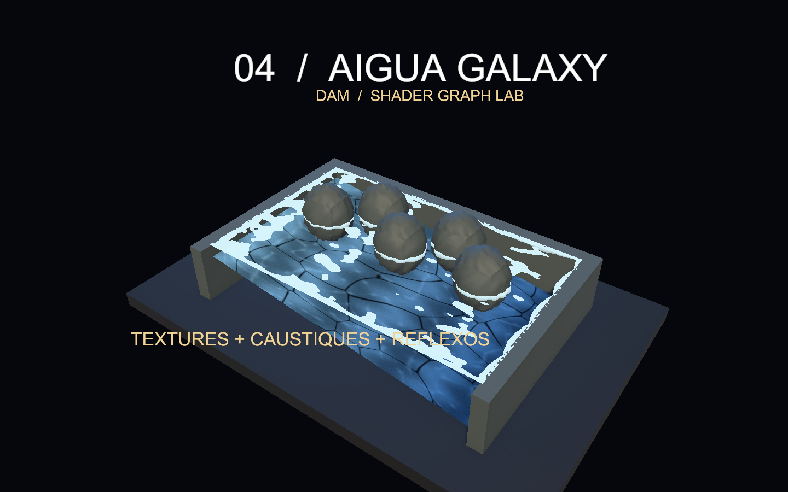

### 9.1. Textures i importació

Copia la carpeta `Assets/Demos/Aigua/Textures` del projecte descarregat al teu projecte de pràctiques. No cal descarregar cap textura externa.

| Textura | Ús | sRGB | Texture Type | Wrap Mode | Filter Mode |
|---|---|---|---|---|---|
| Ripples.png | Camp suau per crear taques de reflexos | Desactivat | Default | Repeat | Trilinear |
| Distorsio.png | R/G codifiquen el desplaçament UV | Desactivat | Default | Repeat | Trilinear |
| Caustiques.png | Il·luminació que es mou pel fons | Desactivat | Default | Repeat | Trilinear |
| Pedres.png | Color de les pedres del fons | Activat | Default | Repeat | Trilinear |

Les quatre imatges són de 512 × 512. Mantén Generate Mip Maps activat i Compression = None en aquesta pràctica. Una Texture2D al Blackboard no substitueix Sample Texture 2D: connecta la propietat al port Texture i les coordenades al port UV del mostrejador.

### 9.2. Shader del fons

Crea **SGalaxyFons**: URP / **Unlit**, Surface **Opaque**, Alpha Clipping desactivat, Render Face **Front**, Cast Shadows desactivat. Deixa Vertex / Position sense connectar. El fons està il·luminat artísticament pel mateix color i les càustiques.

| Nom | Tipus | Reference | Valor inicial |
|---|---|---|---|
| Temps | Float | `_Temps` | 0 |
| Distorsio | Texture2D | `_Distorsio` | Distorsio.png |
| Forca distorsio | Float | `_Refraccio` | 0.045 |
| Pedres | Texture2D | `_Pedres` | Pedres.png |
| TexturaCaustiques | Texture2D | `_Caustiques` | Caustiques.png |
| Nivell aigua (Y mon) | Float | `_NivellAigua` | 0.8 |
| PocFons | Color | `_PocFons` | (0.7, 0.92, 1, 1) |
| MoltFons | Color | `_MoltFons` | (0.12, 0.42, 0.75, 1) |

### Connexions entre grups

Aquest mapa mostra com es connecten els grups del graf. Cada fletxa agrupa el nombre de cables indicat; la taula inferior detalla **tots els cables entre grups i cap al Master Stack**, amb els ports exactes. Les captures dels passos següents mostren les connexions interiors.

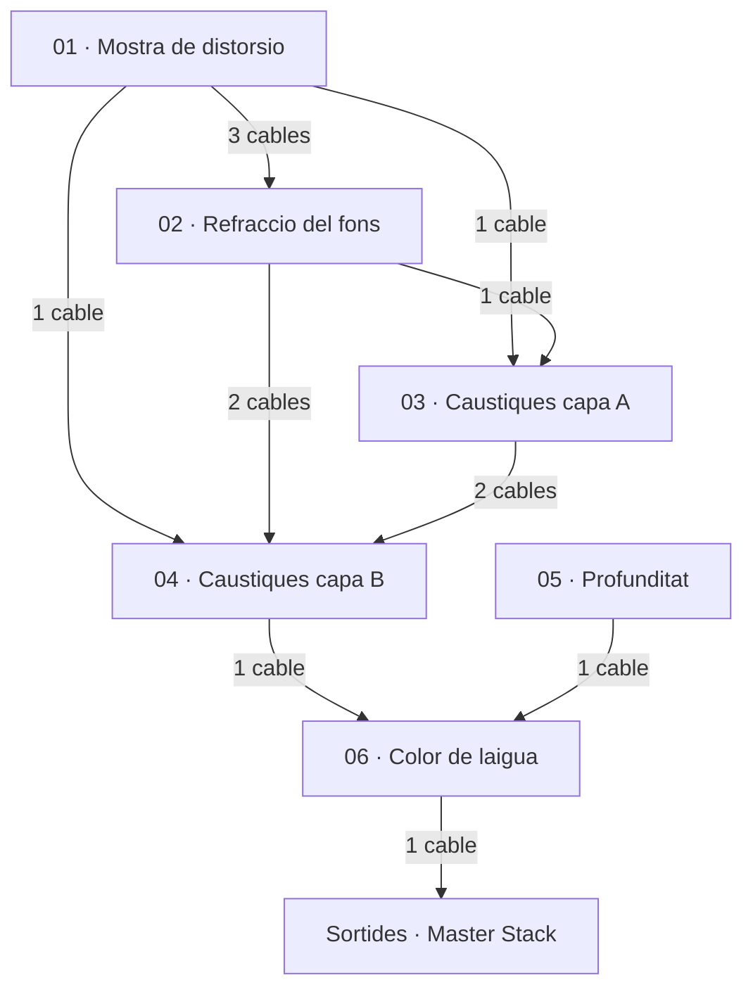
```mermaid
flowchart TD
    G1["01 · Mostra de distorsio"]
    G2["02 · Refraccio del fons"]
    G3["03 · Caustiques capa A"]
    G4["04 · Caustiques capa B"]
    G5["05 · Profunditat"]
    G6["06 · Color de laigua"]
    G7["Sortides · Master Stack"]
    G1 -->|"3 cables"| G2
    G1 -->|"1 cable"| G3
    G1 -->|"1 cable"| G4
    G2 -->|"1 cable"| G3
    G2 -->|"2 cables"| G4
    G3 -->|"2 cables"| G4
    G4 -->|"1 cable"| G6
    G5 -->|"1 cable"| G6
    G6 -->|"1 cable"| G7
```

Llegeix cada fila d’esquerra a dreta: **grup d’origen → node i port de sortida → grup de destinació → node i port d’entrada**. Per exemple, `Eixos:R` és el port R del node Eixos. Un mateix port pot alimentar diversos grups; conserva totes les branques indicades.

| Grup origen | Node:sortida | Grup destinació | Node:entrada |
|---|---|---|---|
| 01 | `UV:Out` | 02 | `UVRefractada:A` |
| 01 | `MostraDistorsio:G` | 02 | `VectorRG:G` |
| 01 | `MostraDistorsio:R` | 02 | `VectorRG:R` |
| 01 | `Temps:Out` | 03 | `CausticaAOffset:A` |
| 02 | `UVRefractada:Out` | 03 | `CausticaAUV:UV` |
| 01 | `Temps:Out` | 04 | `CausticaBOffset:A` |
| 02 | `UVRefractada:Out` | 04 | `CausticaBUV:UV` |
| 02 | `MostraPedres:RGBA` | 04 | `FonsIlluminat:A` |
| 03 | `MostraCausticaA:R` | 04 | `LlumCaustica:A` |
| 03 | `TexturaCaustiques:Out` | 04 | `MostraCausticaB:Texture` |
| 04 | `FonsIlluminat:Out` | 06 | `ColorFinal:A` |
| 05 | `Absorcio:Out` | 06 | `ColorAigua:T` |
| 06 | `ColorFinal:Out` | Master Stack | `Fragment:Base Color` |

A Unity, allunya el zoom per veure dos grups alhora. **F** enquadra la selecció; **A** enquadra tot el graf. Per seguir un cable llarg, identifica primer els dos extrems a la taula i localitza els grups numerats.

### Pas 1. Mostra de distorsio

Llegeix Distorsio com a dades lineals. No configuris aquesta textura com a normal map: farem servir els seus canals R i G directament.

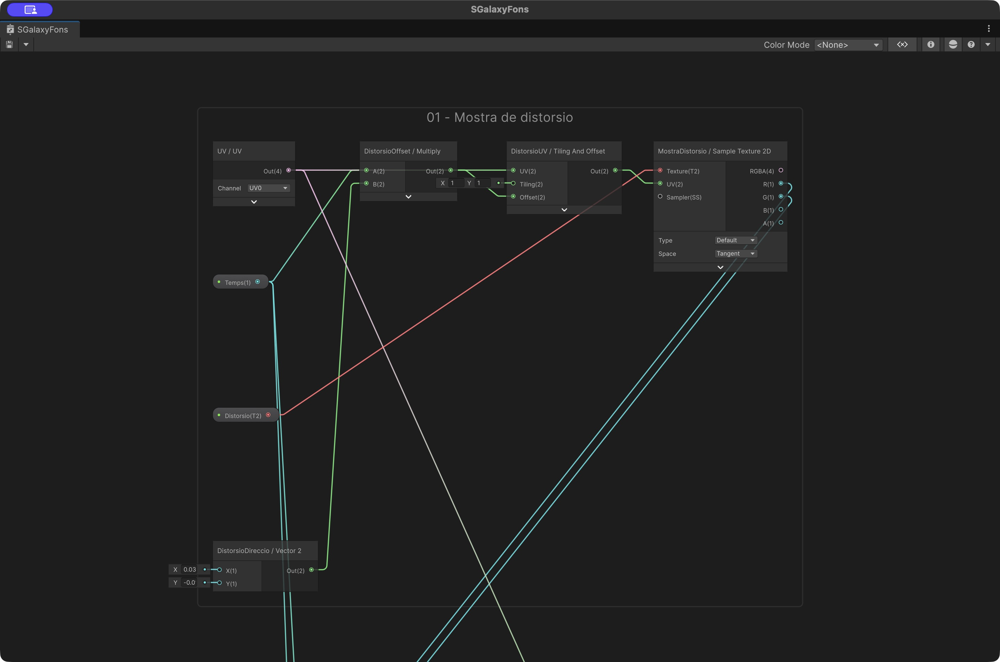

| ID | Node | Entrades |
|---|---|---|
| `UV` | UV |   |
| `DistorsioDireccio` | DistorsioDireccio / Vector 2 | X ← 0.035; Y ← -0.019 |
| `DistorsioOffset` | DistorsioOffset / Multiply | A ← Temps:Out; B ← DistorsioDireccio:Out |
| `DistorsioUV` | DistorsioUV / Tiling And Offset | UV ← UV:Out; Tiling ← 1; Offset ← DistorsioOffset:Out |
| `MostraDistorsio` | MostraDistorsio / Sample Texture 2D | Texture ← Distorsio:Out; UV ← DistorsioUV:Out |

### Pas 2. Refraccio del fons

Combine recupera RG; Subtract 0.5 centra el vector i Multiply n’ajusta la força. Les UV resultants distorsionen el dibuix de les pedres.

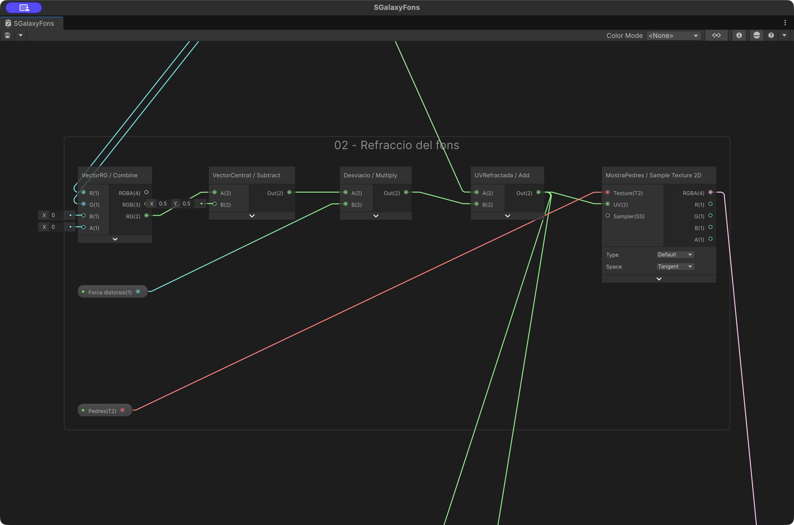

| ID | Node | Entrades |
|---|---|---|
| `VectorRG` | VectorRG / Combine | R ← MostraDistorsio:R; G ← MostraDistorsio:G |
| `VectorCentrat` | VectorCentrat / Subtract | A ← VectorRG:RG; B ← 0.5 |
| `Desviacio` | Desviacio / Multiply | A ← VectorCentrat:Out; B ← Refraccio:Out |
| `UVRefractada` | UVRefractada / Add | A ← UV:Out; B ← Desviacio:Out |
| `MostraPedres` | MostraPedres / Sample Texture 2D | Texture ← Pedres:Out; UV ← UVRefractada:Out |

### Pas 3. Caustiques capa A

Les càustiques fan servir les UV ja distorsionades. Aquesta és la primera mostra animada.

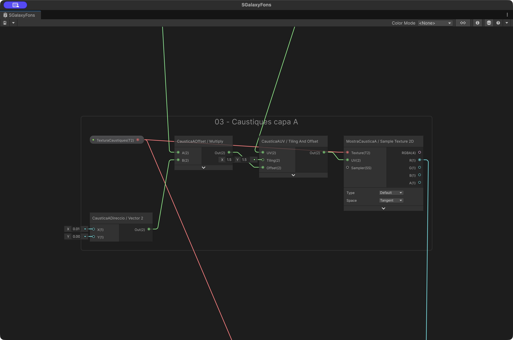

| ID | Node | Entrades |
|---|---|---|
| `CausticaADireccio` | CausticaADireccio / Vector 2 | X ← 0.013; Y ← 0.007 |
| `CausticaAOffset` | CausticaAOffset / Multiply | A ← Temps:Out; B ← CausticaADireccio:Out |
| `CausticaAUV` | CausticaAUV / Tiling And Offset | UV ← UVRefractada:Out; Tiling ← 1.5; Offset ← CausticaAOffset:Out |
| `MostraCausticaA` | MostraCausticaA / Sample Texture 2D | Texture ← TexturaCaustiques:Out; UV ← CausticaAUV:Out |

### Pas 4. Caustiques capa B

Una segona mostra es mou en una altra direcció. Minimum selecciona coincidències suaus; Multiply amb 0.22 regula la llum que se suma al fons.

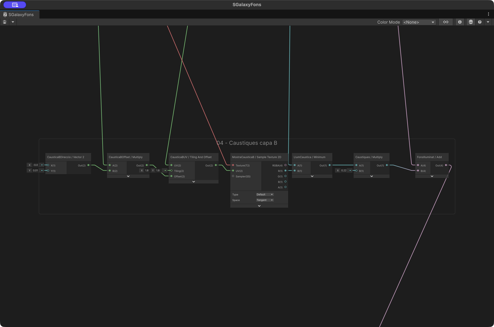

| ID | Node | Entrades |
|---|---|---|
| `CausticaBDireccio` | CausticaBDireccio / Vector 2 | X ← -0.01; Y ← 0.011 |
| `CausticaBOffset` | CausticaBOffset / Multiply | A ← Temps:Out; B ← CausticaBDireccio:Out |
| `CausticaBUV` | CausticaBUV / Tiling And Offset | UV ← UVRefractada:Out; Tiling ← 1.8; Offset ← CausticaBOffset:Out |
| `MostraCausticaB` | MostraCausticaB / Sample Texture 2D | Texture ← TexturaCaustiques:Out; UV ← CausticaBUV:Out |
| `LlumCaustica` | LlumCaustica / Minimum | A ← MostraCausticaA:R; B ← MostraCausticaB:R |
| `Caustiques` | Caustiques / Multiply | A ← LlumCaustica:Out; B ← 0.22 |
| `FonsIlluminat` | FonsIlluminat / Add | A ← MostraPedres:RGBA; B ← Caustiques:Out |

### Pas 5. Profunditat

La profunditat és vertical en espai de món: NivellAigua − Position World.y. Divide i Saturate la normalitzen.

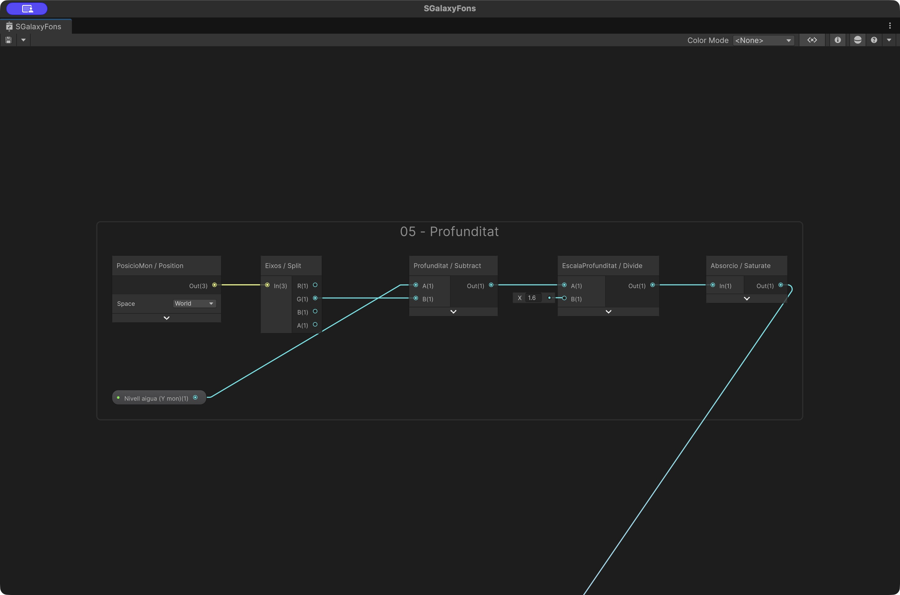

| ID | Node | Entrades |
|---|---|---|
| `PosicioMon` | Position | Space: World |
| `Eixos` | Eixos / Split | In ← PosicioMon:Out |
| `Profunditat` | Profunditat / Subtract | A ← NivellAigua:Out; B ← Eixos:G |
| `EscalaProfunditat` | EscalaProfunditat / Divide | A ← Profunditat:Out; B ← 1.6 |
| `Absorcio` | Absorcio / Saturate | In ← EscalaProfunditat:Out |

### Pas 6. Color de laigua

Lerp calcula el tint segons profunditat i Multiply el combina amb el fons il·luminat. No modifiquis Vertex / Position.

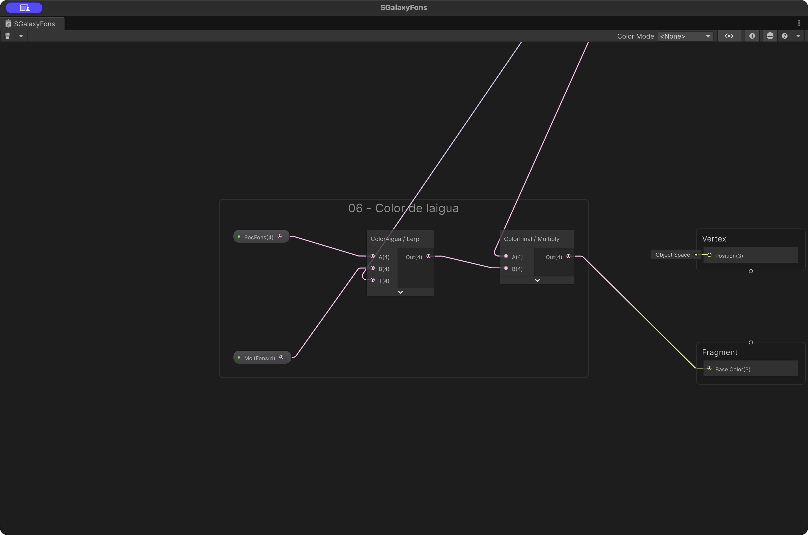

| ID | Node | Entrades |
|---|---|---|
| `ColorAigua` | ColorAigua / Lerp | A ← PocFons:Out; B ← MoltFons:Out; T ← Absorcio:Out |
| `ColorFinal` | ColorFinal / Multiply | A ← FonsIlluminat:Out; B ← ColorAigua:Out |

### Pas 7. Master Stack i connexions finals

Connecta les branques als blocs del Master Stack indicats a continuació. Comprova l’espai de les normals i si les sortides són de Vertex o de Fragment. Els blocs sense cable conserven el valor per defecte.

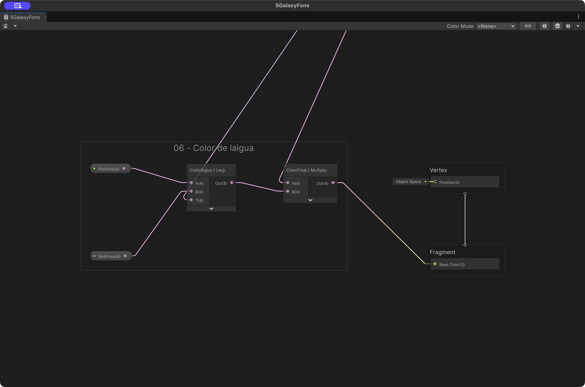

| ID | Node | Entrades |
|---|---|---|
| Sortida | BaseColor | ColorFinal:Out |


### 9.3. Shader de la superfície

Crea **SGalaxySuperficie**: URP / **Unlit**, Surface **Transparent**, Blending **Alpha**, **Alpha Clipping activat**, Render Face **Front**, Cast Shadows desactivat. Afegeix Alpha Clip Threshold al Master Stack. Deixa Vertex / Position sense connectar: no hi ha ones geomètriques.

| Nom | Tipus | Reference | Valor inicial |
|---|---|---|---|
| Temps | Float | `_Temps` | 0 |
| Ripples | Texture2D | `_Ripples` | Ripples.png |
| Llindar reflexos | Float | `_Llindar` | 0.42 |
| BlancEscuma | Color | `_BlancEscuma` | (0.85, 0.97, 1, 1) |

### Connexions entre grups

Aquest mapa mostra com es connecten els grups del graf. Cada fletxa agrupa el nombre de cables indicat; la taula inferior detalla **tots els cables entre grups i cap al Master Stack**, amb els ports exactes. Les captures dels passos següents mostren les connexions interiors.

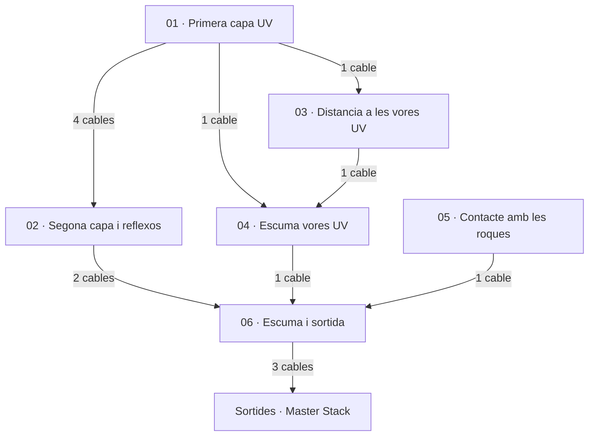
```mermaid
flowchart TD
    G1["01 · Primera capa UV"]
    G2["02 · Segona capa i reflexos"]
    G3["03 · Distancia a les vores UV"]
    G4["04 · Escuma vores UV"]
    G5["05 · Contacte amb les roques"]
    G6["06 · Escuma i sortida"]
    G7["Sortides · Master Stack"]
    G1 -->|"4 cables"| G2
    G1 -->|"1 cable"| G3
    G1 -->|"1 cable"| G4
    G2 -->|"2 cables"| G6
    G3 -->|"1 cable"| G4
    G4 -->|"1 cable"| G6
    G5 -->|"1 cable"| G6
    G6 -->|"3 cables"| G7
```

Llegeix cada fila d’esquerra a dreta: **grup d’origen → node i port de sortida → grup de destinació → node i port d’entrada**. Per exemple, `Eixos:R` és el port R del node Eixos. Un mateix port pot alimentar diversos grups; conserva totes les branques indicades.

| Grup origen | Node:sortida | Grup destinació | Node:entrada |
|---|---|---|---|
| 01 | `Temps:Out` | 02 | `CapaBOffset:A` |
| 01 | `UV:Out` | 02 | `CapaBUV:UV` |
| 01 | `MostraA:R` | 02 | `Interferencia:A` |
| 01 | `Ripples:Out` | 02 | `MostraB:Texture` |
| 01 | `UV:Out` | 03 | `Eixos:In` |
| 01 | `MostraA:R` | 04 | `Amplada:T` |
| 03 | `DistanciaVora:Out` | 04 | `Interior:In` |
| 02 | `MostraB:R` | 06 | `AmpladaContacte:T` |
| 02 | `Reflexos:Out` | 06 | `Mascara:A` |
| 04 | `Escuma:Out` | 06 | `EscumaCompleta:A` |
| 05 | `SeparacioRoques:Out` | 06 | `VoraContacte:In` |
| 06 | `Alpha:Out` | Master Stack | `Fragment:Alpha` |
| 06 | `Retall:Out` | Master Stack | `Fragment:Alpha Clip Threshold` |
| 06 | `BlancEscuma:Out` | Master Stack | `Fragment:Base Color` |

A Unity, allunya el zoom per veure dos grups alhora. **F** enquadra la selecció; **A** enquadra tot el graf. Per seguir un cable llarg, identifica primer els dos extrems a la taula i localitza els grups numerats.

### Pas 1. Primera capa UV

Mostreja Ripples amb les UV de la primera capa. La textura es repeteix i es desplaça lentament en dos eixos.

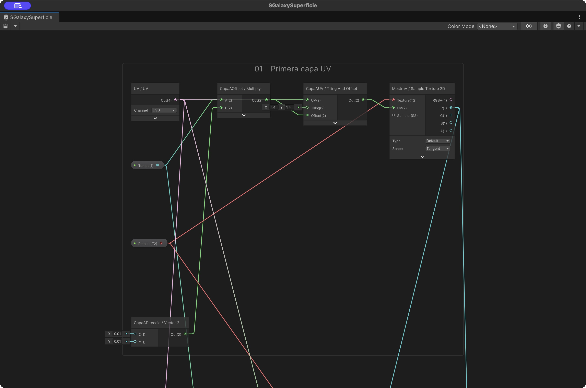

| ID | Node | Entrades |
|---|---|---|
| `UV` | UV |   |
| `CapaADireccio` | CapaADireccio / Vector 2 | X ← 0.018; Y ← 0.011 |
| `CapaAOffset` | CapaAOffset / Multiply | A ← Temps:Out; B ← CapaADireccio:Out |
| `CapaAUV` | CapaAUV / Tiling And Offset | UV ← UV:Out; Tiling ← 1.4; Offset ← CapaAOffset:Out |
| `MostraA` | MostraA / Sample Texture 2D | Texture ← Ripples:Out; UV ← CapaAUV:Out |

### Pas 2. Segona capa i reflexos

Mostreja la mateixa textura amb una altra escala i direcció. Multiply i Step retenen només les taques brillants que superen Llindar.

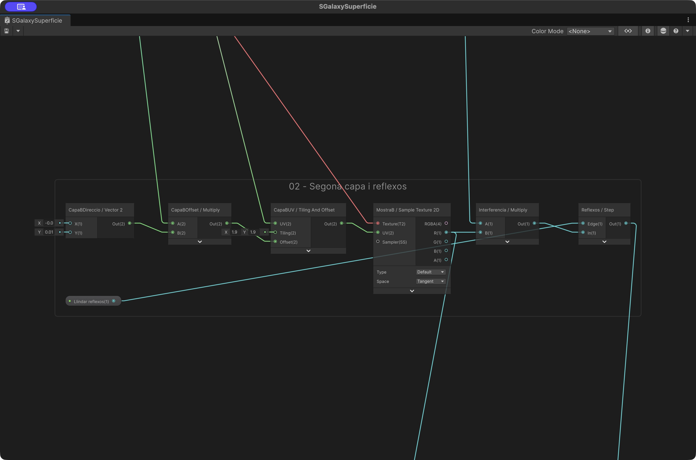

| ID | Node | Entrades |
|---|---|---|
| `CapaBDireccio` | CapaBDireccio / Vector 2 | X ← -0.012; Y ← 0.016 |
| `CapaBOffset` | CapaBOffset / Multiply | A ← Temps:Out; B ← CapaBDireccio:Out |
| `CapaBUV` | CapaBUV / Tiling And Offset | UV ← UV:Out; Tiling ← 1.9; Offset ← CapaBOffset:Out |
| `MostraB` | MostraB / Sample Texture 2D | Texture ← Ripples:Out; UV ← CapaBUV:Out |
| `Interferencia` | Interferencia / Multiply | A ← MostraA:R; B ← MostraB:R |
| `Reflexos` | Reflexos / Step | Edge ← Llindar:Out; In ← Interferencia:Out |

### Pas 3. Distancia a les vores UV

Minimum entre U, 1−U, V i 1−V mesura la proximitat al contorn del pla; encara no detecta cap roca.

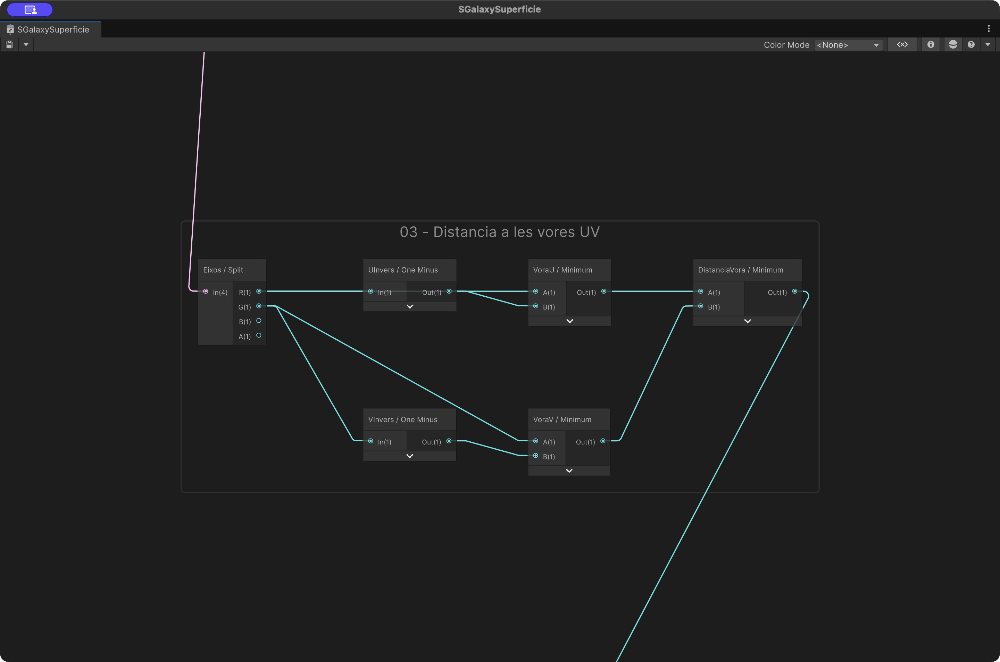

| ID | Node | Entrades |
|---|---|---|
| `Eixos` | Eixos / Split | In ← UV:Out |
| `UInvers` | UInvers / One Minus | In ← Eixos:R |
| `VoraU` | VoraU / Minimum | A ← Eixos:R; B ← UInvers:Out |
| `VInvers` | VInvers / One Minus | In ← Eixos:G |
| `VoraV` | VoraV / Minimum | A ← Eixos:G; B ← VInvers:Out |
| `DistanciaVora` | DistanciaVora / Minimum | A ← VoraU:Out; B ← VoraV:Out |

### Pas 4. Escuma vores UV

La textura anima l’amplada de la vora. One Minus deixa escuma blanca a l’exterior de la franja interior.

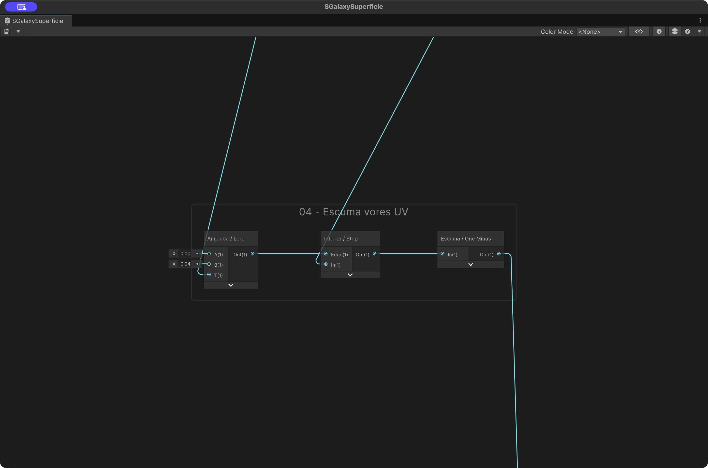

| ID | Node | Entrades |
|---|---|---|
| `Amplada` | Amplada / Lerp | A ← 0.008; B ← 0.045; T ← MostraA:R |
| `Interior` | Interior / Step | Edge ← Amplada:Out; In ← DistanciaVora:Out |
| `Escuma` | Escuma / One Minus | In ← Interior:Out |

### Pas 5. Contacte amb les roques

Scene Depth Eye menys −Position View.z dona la separació visual entre superfície i geometria opaca. El cable Pantalla → ProfunditatEscena ha d’entrar a UV.

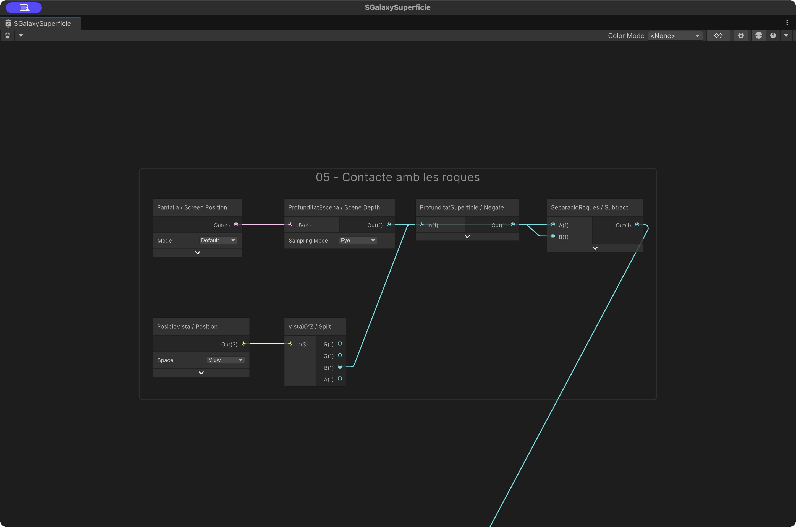

| ID | Node | Entrades |
|---|---|---|
| `Pantalla` | ScreenPosition |   |
| `ProfunditatEscena` | SceneDepth | Sampling: Eye; UV ← Pantalla:Out |
| `PosicioVista` | Position | Space: View |
| `VistaXYZ` | VistaXYZ / Split | In ← PosicioVista:Out |
| `ProfunditatSuperficie` | ProfunditatSuperficie / Negate | In ← VistaXYZ:B |
| `SeparacioRoques` | SeparacioRoques / Subtract | A ← ProfunditatEscena:Out; B ← ProfunditatSuperficie:Out |

### Pas 6. Escuma i sortida

La segona textura varia l’amplada de contacte entre 0.12 i 0.65. Maximum uneix l’escuma de contacte, les vores UV i els reflexos. Alpha Clipping retalla la resta.

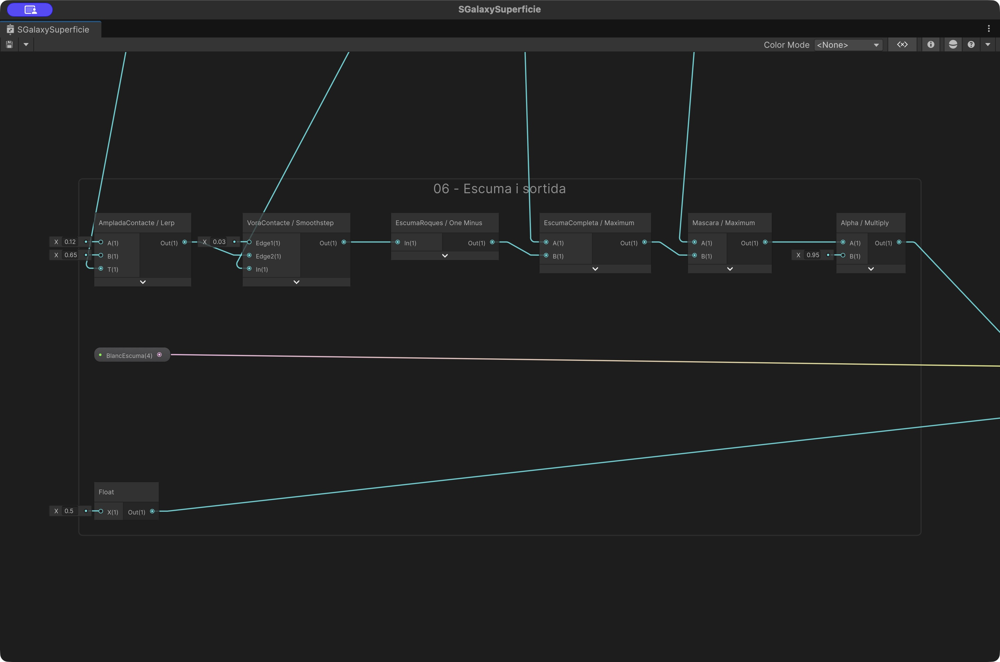

| ID | Node | Entrades |
|---|---|---|
| `AmpladaContacte` | AmpladaContacte / Lerp | A ← 0.12; B ← 0.65; T ← MostraB:R |
| `VoraContacte` | VoraContacte / Smoothstep | Edge1 ← 0.035; Edge2 ← AmpladaContacte:Out; In ← SeparacioRoques:Out |
| `EscumaRoques` | EscumaRoques / One Minus | In ← VoraContacte:Out |
| `EscumaCompleta` | EscumaCompleta / Maximum | A ← Escuma:Out; B ← EscumaRoques:Out |
| `Mascara` | Mascara / Maximum | A ← Reflexos:Out; B ← EscumaCompleta:Out |
| `Alpha` | Alpha / Multiply | A ← Mascara:Out; B ← 0.95 |
| `Retall` | Retall / Float | X ← 0.5 |

### Pas 7. Master Stack i connexions finals

Connecta les branques als blocs del Master Stack indicats a continuació. Comprova l’espai de les normals i si les sortides són de Vertex o de Fragment. Els blocs sense cable conserven el valor per defecte.

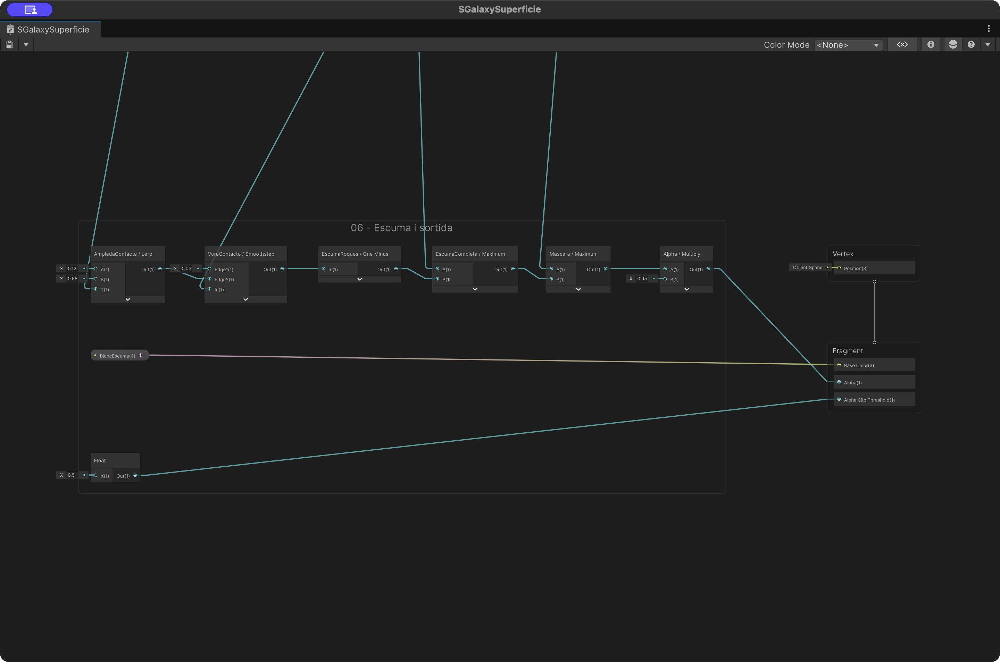

| ID | Node | Entrades |
|---|---|---|
| Sortida | BaseColor | BlancEscuma:Out |
| Sortida | Alpha | Alpha:Out |
| Sortida | Alpha Clip Threshold | Retall:Out |


### 9.4. Muntar la segona escena

1. Duplica DemoAigua i desa-la com **DemoAiguaGalaxy**. No sobreescriguis l’escena amb ones.
2. Crea **MGalaxyFons** i **MGalaxySuperficie** amb els shaders nous. Assigna les quatre textures a les propietats corresponents dels materials.
3. Mantén Aigua amb WaterGrid i escala (1,1,1), situa-la a **(0,0.8,0)** i assigna-hi MGalaxySuperficie. No reutilitzis MAigua: aquell shader mou vèrtexs.
4. Elimina FonsPiscina només d’aquesta escena duplicada. Crea FonsGalaxy a **(0,0,0)** amb Mesh Filter i Mesh Renderer. Assigna-hi FonsInclinat i MGalaxyFons. La malla inclosa al ZIP baixa de Y=0.45 a Y=−0.7 al llarg de X; també es pot generar amb el codi següent.
5. Situa Base a (0,−1,0). A les tres ribes, canvia només la Y a −0.05 i l’escala Y a 1.7. Situa les cinc roques a Y=0.8, conservant X/Z i escala.
6. Situa la càmera a **(8,11,−11)** i orienta-la cap a **(0,1,0)**; mantén FOV 40. Activa Depth Texture a l’URP Asset actiu i a la càmera. Les roques han de continuar sent **opaques** perquè apareguin a la textura de profunditat.
7. A DemoControls, posa Surfaces de mida 2: primer el Renderer d’Aigua, després el de FonsGalaxy. Configura Parameter = `_Llindar`, Minimum = **0.05**, Maximum = **0.65** i Initial Value = **0.42** i Time Scale = **2**. El temps avança al doble de velocitat; posa Time Scale = 1 per comparar amb la velocitat inicial. Els dos shaders reben `_Temps`; el lliscador afecta només la superfície.
8. Comprova que `_NivellAigua` del material del fons és **0.8**, la Y global del pla. Si mous el pla, actualitza aquesta propietat.

Per reconstruir el fons sense importar-ne la malla, crea `Assets/Editor/GenerarFonsGalaxy.cs` i executa **Demos > Crear fons inclinat Galaxy**. Assigna l’asset generat a FonsGalaxy. Quatre vèrtexs són suficients perquè el pla no es deforma durant el joc.

```csharp
using UnityEngine;
using UnityEditor;
using System.IO;

public static class GenerarFonsGalaxy
{
    // Crea una opció de menú de l'Editor per generar la superfície del fons.
    [MenuItem("Demos/Crear fons inclinat Galaxy")]
    public static void Crear()
    {
        // Quatre vèrtexs són suficients: aquest shader no deforma la geometria.
        var mesh = new Mesh { name = "FonsInclinat" };
        mesh.vertices = new[] {
            new Vector3(-4, .45f, -2.5f), new Vector3(4, -.7f, -2.5f),
            new Vector3(-4, .45f, 2.5f), new Vector3(4, -.7f, 2.5f)
        };
        // Assigna les quatre cantonades UV per estendre el patró per tota la superfície.
        mesh.uv = new[] { Vector2.zero, Vector2.right, Vector2.up, Vector2.one };
        // Forma el rectangle amb dos triangles que comparteixen una diagonal.
        mesh.triangles = new[] { 0, 2, 1, 1, 2, 3 };
        // Actualitza l'orientació de la superfície i els límits de la malla acabada de crear.
        mesh.RecalculateNormals(); mesh.RecalculateTangents(); mesh.RecalculateBounds();
        Directory.CreateDirectory("Assets/Meshes");
        AssetDatabase.CreateAsset(mesh, AssetDatabase.GenerateUniqueAssetPath("Assets/Meshes/FonsInclinat.asset"));
        AssetDatabase.SaveAssets();
        // Selecciona la malla creada perquè es pugui veure a l'Inspector.
        Selection.activeObject = mesh;
    }
}

```

### 9.5. Comprovar el resultat per capes

Comença amb el Renderer de la superfície desactivat. El fons ha de conservar la textura de pedra, una deformació suau i il·luminació que canvia amb el temps. `_Refraccio = 0` elimina el desplaçament UV; les càustiques continuen animades.

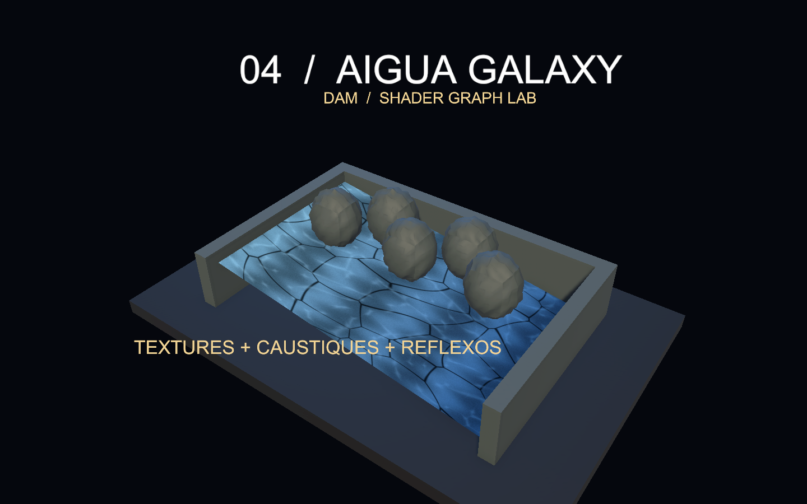

Activa la superfície. Han d’aparèixer taques blanques irregulars, una vora d’escuma i franges de contacte al voltant de les roques. El contorn de contacte prové de Scene Depth, no de les UV de la roca.

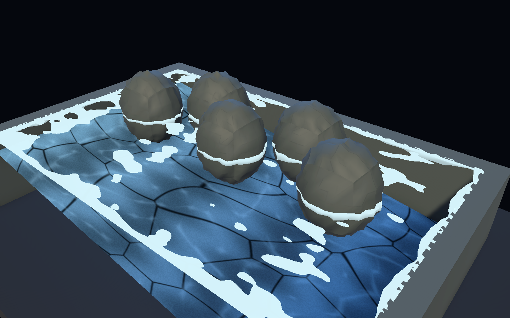

Prem Espai per pausar. La geometria no ha canviat d’alçada; només s’han animat les mostres de textura. Torna a activar el temps per comparar un altre instant:

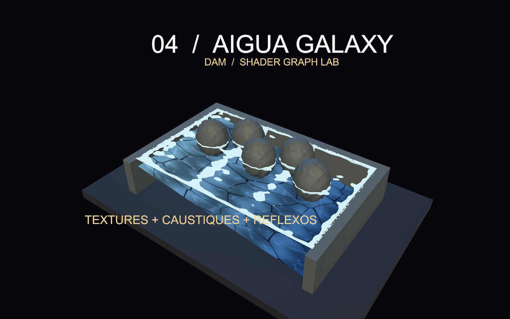

Augmenta `_Llindar` cap a 0.65: desapareixen molts reflexos, però es conserva l’escuma. Si desapareix també el contorn de les roques, revisa Maximum entre EscumaCompleta i Reflexos.

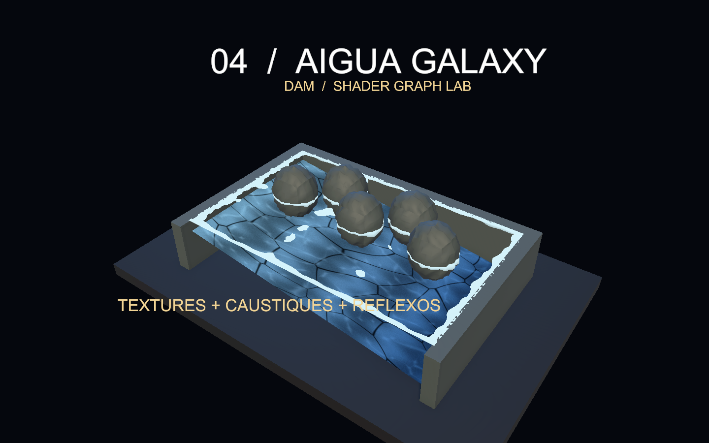

### 9.6. Límits d’aquesta aproximació

- La distorsió afecta la textura del fons, no tota la imatge de la càmera; no deforma automàticament les roques ni altres objectes submergits.
- El tint de profunditat es calcula al shader del fons. Un objecte submergit amb un altre material no rep automàticament aquest tint.
- L’escuma de contacte depèn de l’angle de vista i de la profunditat opaca disponible. No és una simulació física.
- El contorn UV segueix el rectangle del pla. En un llac de forma irregular caldria una màscara de riba diferent.
- Alpha Clipping crea vores dures, adequades per a l’estil de la referència. No hi ha reflexions de l’escena ni simulació de fluids.
