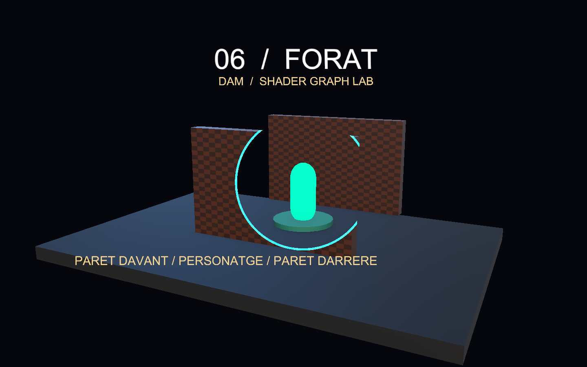
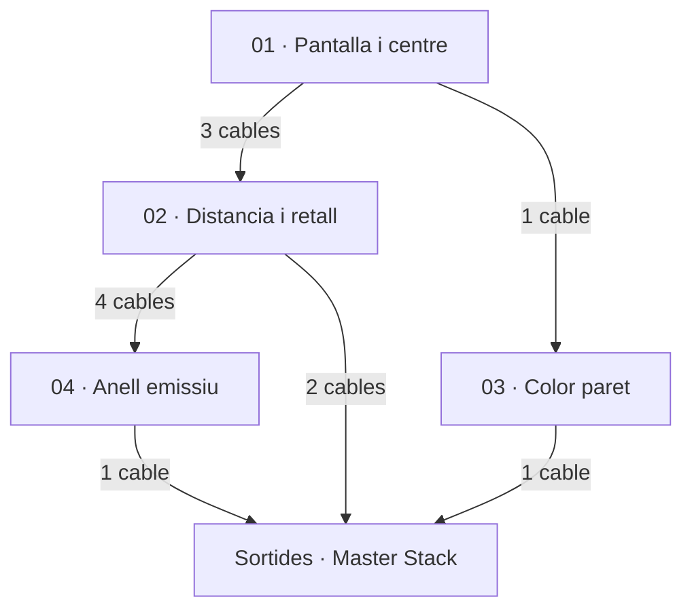
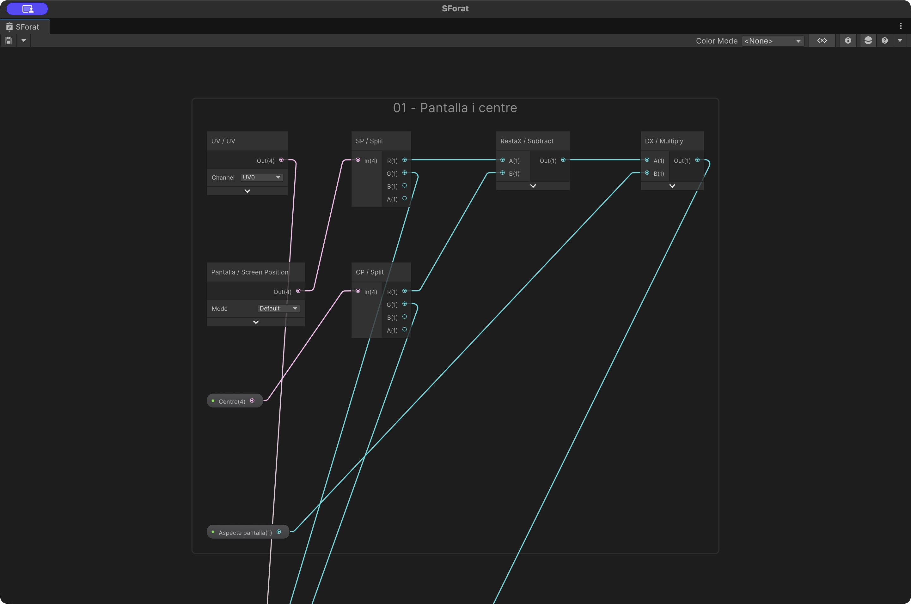
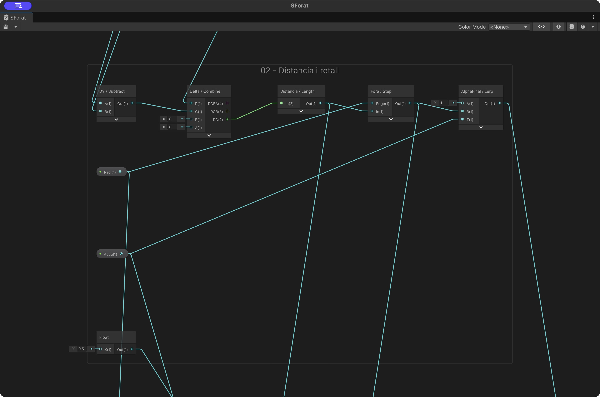
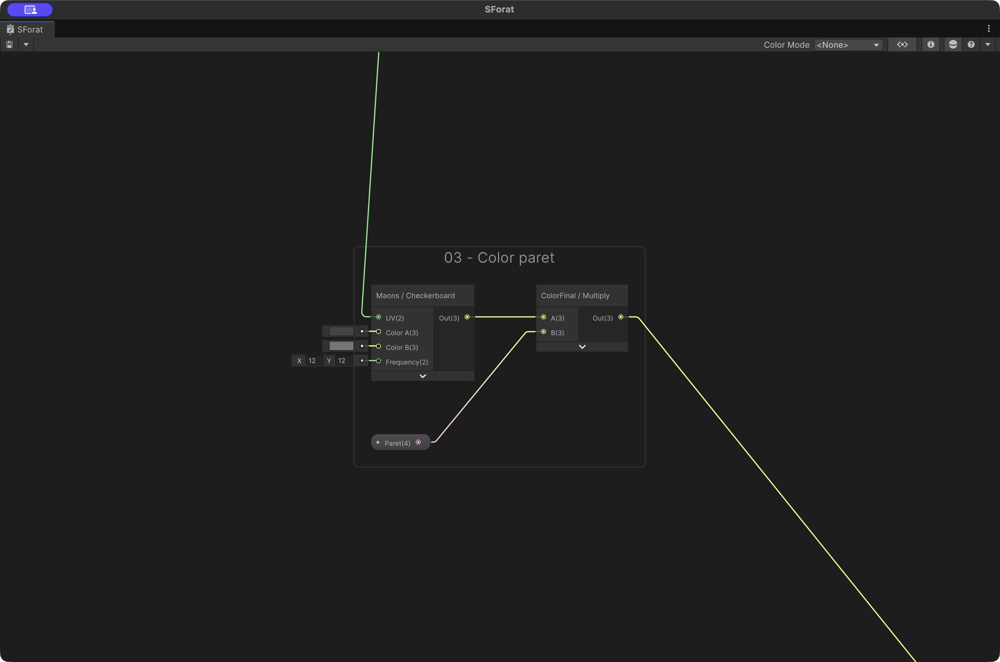
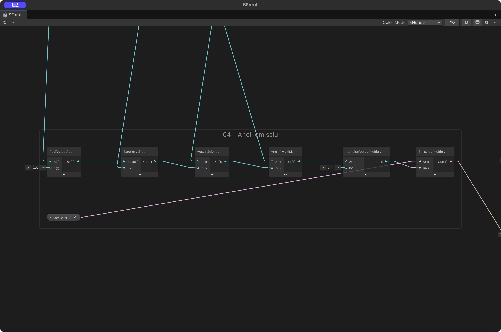
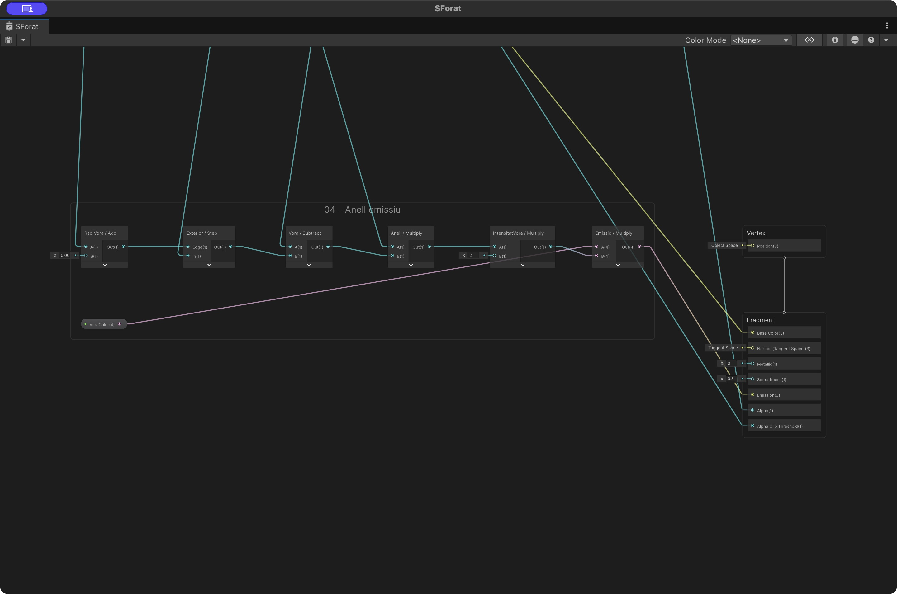
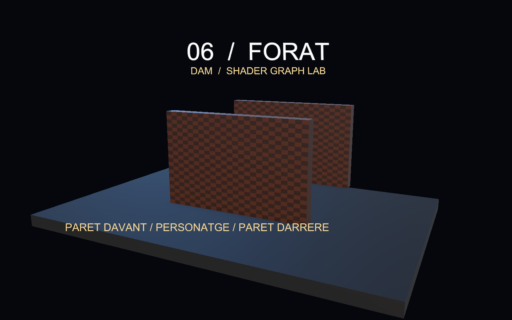
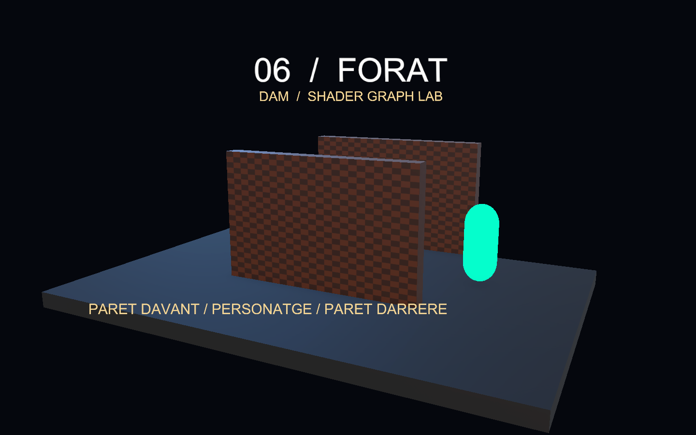

# Demo 6: Forat: veure el personatge darrere d’una paret

Construirem una paret que es retalla al voltant del personatge quan l’oculta. Una segona paret, situada darrere del personatge i amb el mateix material, permet comprovar que només s’activa la paret interposada.

**Projecte acabat:** [Demo-6-Forat.zip](demos/Demo-6-Forat.zip). Descomprimeix-lo i obre la carpeta amb Assets, Packages i ProjectSettings des de Unity Hub. Obre `Assets/Demos/Forat/Scenes/DemoForat.unity` i prem Play.



## 1. Preparar un projecte buit

1. Utilitza **Unity 6000.6.3f1**, la versió de les demos de Codi. Crea un projecte **Universal 3D (URP)**.
2. A Package Manager, comprova **Universal RP 17.6.0**, **Shader Graph 17.6.0** i **Input System 1.20.0**. Shader Graph arriba com a dependència d’URP.
3. A **Project Settings > Player > Active Input Handling**, selecciona **Input System Package (New)**. Accepta el reinici si Unity el demana.
4. Crea `Assets/Demos/Forat` amb les carpetes **Shaders**, **Materials**, **Scenes** i **Meshes**. Crea també **Assets/Common** per als scripts.
5. Crea una escena buida, afegeix una Camera amb tag **MainCamera** i desa l’escena com a `DemoForat` dins de Scenes.

## 2. Crear el Shader Graph

A Shaders, crea **Shader Graph > URP > Lit Shader Graph**, amb nom **SForat**. A Graph Inspector > Graph Settings, fixa:

| Opció | Valor |
|---|---|
| Target | Universal |
| Material | Lit |
| Surface Type | Opaque |
| Alpha Clipping | Activat; llindar 0.5 |
| Render Face | Front |
| Cast Shadows | Desactivat |

Afegeix al Blackboard aquestes propietats. Activa **Exposed** i escriu les **Reference exactes**, inclòs el guió baix. Els colors s’indiquen com a RGBA normalitzat; si el selector mostra bytes 0–255, multiplica cada component per 255.

| Nom | Tipus | Reference | Valor inicial |
|---|---|---|---|
| Actiu | Float | `_Actiu` | 0 |
| Aspecte pantalla | Float | `_Aspecte` | 1.778 |
| Centre | Vector4 | `_Centre` | (0.5, 0.5, 0, 0) |
| Paret | Color | `_Paret` | (0.55, 0.28, 0.12, 1) |
| Radi | Float | `_Radi` | 0.18 |
| VoraColor | Color | `_VoraColor` | (0.03, 1, 1, 1) |

Arrossega les propietats al gràfic per crear els seus nodes. La propietat no es crea escrivint-ne el nom en un node Float: s’ha de crear al Blackboard.

## 3. Entendre l’efecte

### Qui decideix si hi ha una paret?

El controlador projecta un punt del personatge amb WorldToViewportPoint i consulta el segment càmera–personatge amb Physics.RaycastAll. Només els colliders de la capa 8, DioramaWalls, poden activar l’efecte. El raig arriba fins al personatge, no més enllà.

### Què fa el shader?

Screen Position Default proporciona les coordenades de cada fragment. Restem el centre projectat del personatge, corregim X amb la relació d’aspecte i calculem Length. Step retorna 0 dins del radi i 1 fora.

```text
delta = screenUV - Centre.xy
distancia = length((delta.x * Aspecte, delta.y))
fora = Step(Radi, distancia)
alpha = Lerp(1, fora, Actiu)
```

Alpha Clipping amb llindar 0.5 elimina l’interior del cercle quan Actiu = 1. Una segona diferència de llindars crea una vora emissiva de gruix 0.006. La paret manté el collider.

### Materials compartits

Les dues parets comparteixen MParet. El controlador utilitza MaterialPropertyBlock per donar Actiu, Centre i Radi a cada Renderer: activar una paret no activa l’altra. Això pot afectar el batching; per a la demo prioritzem distingir clarament l’estat de cada paret.

S’ha desactivat Cast Shadows al target del shader per evitar que una màscara dependent de la càmera generi ombres incoherents. El personatge és un marcador visual que es mou lateralment; aquesta demo no implementa un controlador físic de joc complet.

## 4. Connectar els nodes

Cada fila identifica un node. `Eixos:R` vol dir la sortida **R** del node identificat com Eixos; `Nom:Out` vol dir la seva sortida. Si el nom correspon a una propietat del Blackboard, utilitza el seu node Property. Els números sense `:` són valors literals escrits al port d’entrada. Els àlies Temps, Mode i Centre corresponen a les propietats amb Reference `_Temps`, `_Mode` i `_Centre`, quan existeixen en aquesta demo. En un port vectorial, un literal únic s’ha de repetir a tots els components: per exemple Frequency = 12 vol dir (12,12).

Les captures següents provenen del Shader Graph de Unity. A les captures de cada pas s’han ocultat els cables que només travessen el grup sense connectar-hi; es mantenen les seves entrades i sortides. Alguns camps numèrics es veuen arrodonits per l’amplada del node: utilitza els valors exactes de la taula. Cada grup numerat és un pas del mateix graf final. Segueix l’ordre, afegeix els nodes del pas i connecta’ls com a la captura i a la taula. Les propietats es creen al Blackboard segons l’apartat 2; els nodes Property simplement les llegeixen.

Els cables que entren des de fora del grup provenen de passos anteriors: el nom de la taula identifica l’origen. Al projecte acabat pots seleccionar un grup i prémer **F** per enquadrar-lo. Les previsualitzacions dels nodes estan plegades a les captures per deixar llegir ports i valors; pots desplegar-les per inspeccionar una màscara.

### Connexions entre grups

Aquest mapa mostra com es connecten els grups del graf. Cada fletxa agrupa el nombre de cables indicat; la taula inferior detalla **tots els cables entre grups i cap al Master Stack**, amb els ports exactes. Les captures dels passos següents mostren les connexions interiors.



Llegeix cada fila d’esquerra a dreta: **grup d’origen → node i port de sortida → grup de destinació → node i port d’entrada**. Per exemple, `Eixos:R` és el port R del node Eixos. Un mateix port pot alimentar diversos grups; conserva totes les branques indicades.

| Grup origen | Node:sortida | Grup destinació | Node:entrada |
|---|---|---|---|
| 01 | `SP:G` | 02 | `DY:A` |
| 01 | `CP:G` | 02 | `DY:B` |
| 01 | `DX:Out` | 02 | `Delta:R` |
| 01 | `UV:Out` | 03 | `Maons:UV` |
| 02 | `Actiu:Out` | 04 | `Anell:A` |
| 02 | `Distancia:Out` | 04 | `Exterior:In` |
| 02 | `Radi:Out` | 04 | `RadiVora:A` |
| 02 | `Fora:Out` | 04 | `Vora:A` |
| 02 | `AlphaFinal:Out` | Master Stack | `Fragment:Alpha` |
| 02 | `Llindar:Out` | Master Stack | `Fragment:Alpha Clip Threshold` |
| 03 | `ColorFinal:Out` | Master Stack | `Fragment:Base Color` |
| 04 | `Emissio:Out` | Master Stack | `Fragment:Emission` |

A Unity, allunya el zoom per veure dos grups alhora. **F** enquadra la selecció; **A** enquadra tot el graf. Per seguir un cable llarg, identifica primer els dos extrems a la taula i localitza els grups numerats.

### Pas 1. Pantalla i centre

Resta el centre enviat pel controlador a Screen Position. Multiplica només X per Aspecte.



| ID | Node | Entrades |
|---|---|---|
| `UV` | UV |   |
| `Pantalla` | Screen Position |   |
| `SP` | Split | In ← Pantalla:Out |
| `CP` | Split | In ← Centre:Out |
| `RestaX` | Subtract | A ← SP:R; B ← CP:R |
| `DX` | Multiply | A ← RestaX:Out; B ← Aspecte:Out |

### Pas 2. Distancia i retall

Length dona una distància circular corregida. Actiu decideix si s’aplica el retall.



| ID | Node | Entrades |
|---|---|---|
| `DY` | Subtract | A ← SP:G; B ← CP:G |
| `Delta` | Combine | R ← DX:Out; G ← DY:Out |
| `Distancia` | Length | In ← Delta:RG |
| `Fora` | Step | Edge ← Radi:Out; In ← Distancia:Out |
| `AlphaFinal` | Lerp | A ← 1; B ← Fora:Out; T ← Actiu:Out |
| `Llindar` | Float | X ← 0.5 |

### Pas 3. Color paret

Checkerboard aporta textura a la paret i Multiply la tenyeix.



| ID | Node | Entrades |
|---|---|---|
| `Maons` | Checkerboard | UV ← UV:Out; Color A ← 0.3; Color B ← 0.5; Frequency ← 12 |
| `ColorFinal` | Multiply | A ← Maons:Out; B ← Paret:Out |

### Pas 4. Anell emissiu

La diferència entre dos Step forma un anell estret. Actiu també controla aquesta emissió.



| ID | Node | Entrades |
|---|---|---|
| `RadiVora` | Add | A ← Radi:Out; B ← 0.006 |
| `Exterior` | Step | Edge ← RadiVora:Out; In ← Distancia:Out |
| `Vora` | Subtract | A ← Fora:Out; B ← Exterior:Out |
| `Anell` | Multiply | A ← Actiu:Out; B ← Vora:Out |
| `IntensitatVora` | Multiply | A ← Anell:Out; B ← 2 |
| `Emissio` | Multiply | A ← VoraColor:Out; B ← IntensitatVora:Out |

### Pas 5. Master Stack i connexions finals

Connecta les branques als blocs del Master Stack indicats a continuació. Comprova l’espai de les normals i si les sortides són de Vertex o de Fragment. Els blocs sense cable conserven el valor per defecte.



| ID | Node | Entrades |
|---|---|---|
| Sortida | Alpha | AlphaFinal:Out |
| Sortida | Alpha Clip Threshold | Llindar:Out |
| Sortida | BaseColor | ColorFinal:Out |
| Sortida | Emission | Emissio:Out |

Els números de les entrades són valors literals. En un vector, repeteix el valor a tots els components quan s’indica un únic nombre. A Combine, tria RG per a Vector2; a Split, R/G/B equivalen a X/Y/Z. Desa el graf abans de crear els materials.

## 5. Crear els materials

Amb el botó dret sobre SForat, crea els materials i assigna-hi el shader. Crea un únic material `MParet` i assigna’l a les dues parets. El personatge porta un material URP/Unlit turquesa (0.02,1,0.8). No assignis el shader Forat al personatge.

## 6. Construir l’escena

Les posicions són globals i les escales corresponen a les primitives de Unity. Mantén els objectes a l’arrel, sense un pare escalat. Els elements decoratius i textos es poden ometre: no intervenen en el shader.

| Objecte | Primitiva | Posicio | Escala |
|---|---|---|---|
| Base | Cube | (0, -0.22, 0) | (12, 0.4, 8) |
| Personatge | Capsule | (0, 1.05, 1.5) | (0.85, 1, 0.85) |
| ParetDavant | Cube | (0, 1.65, -0.7) | (5.2, 3.3, 0.4) |
| ParetDarrera | Cube | (0, 1.65, 4) | (5.2, 3.3, 0.4) |
| Destinacio | Cylinder | (0, 0.1, 1.5) | (2, 0.08, 2) |

### Càmera i llums

Posa Main Camera a **(7,5,−13)**, amb projecció **Perspective**, Field of View **40**, Near **0.1**, Far **100** i fons de color sòlid **RGB (0.018,0.029,0.052)**. Orienta-la cap al punt **(0,1.5,0.8)**. La rotació Euler corresponent és aproximadament **(12.745, -26.896, 0)**.

Afegeix dues llums Directional: **Key Light**, rotació (45,−30,0), intensitat 2 i color RGB (1,0.88,0.74); **Fill Light**, rotació (25,140,0), intensitat 1 i color RGB (0.35,0.67,1). A Lighting > Environment, utilitza ambient de color (0.32,0.38,0.48). La base porta un material Lit gris blavós (0.055,0.072,0.095), Smoothness 0.25; les peanyes, (0.1,0.14,0.19).

Activa **HDR** i **Post Processing** a la càmera. Afegeix un **Global Volume**, crea un perfil i afegeix **Bloom**, activant els overrides: Intensity **0.35**, Threshold **1**, Scatter **0.6**.

## 7. Afegir els controls

### Càmera orbital i zoom

Descarrega [DemoOrbitCamera.cs](demos/DemoOrbitCamera.cs) i desa’l a **Assets/Common/DemoOrbitCamera.cs**. Afegeix el component **Demo Orbit Camera** a **Main Camera**. Al ZIP ja està configurat.

- **Center = (0, 1.5, 0.8)**: punt fix al voltant del qual gira la càmera.
- **Minimum Distance = 3**, **Maximum Distance = 35**.
- **Rotation Sensitivity = 0.2**, **Zoom Sensitivity = 0.0015**.
- **Minimum Elevation = 5**, **Maximum Elevation = 85**: límits d’inclinació en graus.

En **Play**, clica **Game**. Mantén premut el **botó dret** i arrossega per girar; utilitza la **roda del ratolí** per apropar-te o allunyar-te. **Home** recupera la posició i orientació inicials. El centre no es desplaça i no cal afegir-hi cap objecte Target. La roda positiva apropa la càmera; la negativa l’allunya.

El controlador del panell, que trobaràs a continuació, informa la càmera de quan el punter és sobre els controls perquè el lliscador no mogui el punt de vista. La càmera funciona igualment quan el temps del shader està en pausa.

La càmera té ordre d’execució **−100** i es mou abans del `LateUpdate` de ForatController. Així, el retall utilitza la posició nova de la càmera en el mateix fotograma.

Crea **Assets/Common/ForatController.cs** amb aquest codi complet:

```csharp
using UnityEngine;
using UnityEngine.InputSystem;

// El codi decideix quina paret oculta el jugador; el shader calcula el cercle.
public class ForatController : MonoBehaviour
{
    public Camera viewCamera;
    public Transform player;
    public Renderer[] walls;
    public LayerMask wallMask = 1 << 8;
    public float radius = 0.18f;
    public bool effectEnabled = true;
    public bool autoMove = true;
    public bool showPanel = true;
    public int activeWalls;
    MaterialPropertyBlock block;
    float elapsed;

    void Awake()
    {
        block = new MaterialPropertyBlock();
        var orbit = viewCamera ? viewCamera.GetComponent<DemoOrbitCamera>() : null;
        if (orbit) orbit.IsPointerOverControls = point => showPanel && new Rect(16, 16, 450, 140).Contains(point);
    }
    void Update()
    {
        elapsed += Time.deltaTime;
        var keyboard = Keyboard.current;
        if (keyboard != null)
        {
            if (keyboard.fKey.wasPressedThisFrame) effectEnabled = !effectEnabled;
            if (keyboard.spaceKey.wasPressedThisFrame) autoMove = !autoMove;
            if (keyboard.hKey.wasPressedThisFrame) showPanel = !showPanel;
            float input = (keyboard.dKey.isPressed ? 1 : 0) - (keyboard.aKey.isPressed ? 1 : 0);
            if (input != 0)
            {
                autoMove = false;
                Vector3 p = player.position;
                p.x = Mathf.Clamp(p.x + input * Time.deltaTime * 2, -3.4f, 3.4f);
                player.position = p;
            }
            if (keyboard.rKey.wasPressedThisFrame) { elapsed = 0; autoMove = true; effectEnabled = true; }
        }
        if (autoMove) player.position = new Vector3(Mathf.Sin(elapsed * 0.6f) * 3.4f, player.position.y, player.position.z);
    }
    void LateUpdate() { RefreshMask(); }
    public void RefreshMask()
    {
        if (block == null) block = new MaterialPropertyBlock();
        Vector3 target = player.position + Vector3.up * 0.35f;
        Vector3 viewport = viewCamera.WorldToViewportPoint(target);
        Vector3 segment = target - viewCamera.transform.position;
        Physics.SyncTransforms();
        RaycastHit[] hits = Physics.RaycastAll(viewCamera.transform.position, segment.normalized,
            segment.magnitude, wallMask, QueryTriggerInteraction.Ignore);
        activeWalls = 0;
        foreach (Renderer wall in walls)
        {
            bool blocked = false;
            if (effectEnabled && viewport.z > 0)
                foreach (RaycastHit hit in hits)
                    if (hit.collider.GetComponent<Renderer>() == wall) { blocked = true; break; }
            if (blocked) activeWalls++;
            wall.GetPropertyBlock(block);
            block.SetVector("_Centre", new Vector4(viewport.x, viewport.y, 0, 0));
            block.SetFloat("_Aspecte", viewCamera.aspect);
            block.SetFloat("_Radi", radius);
            block.SetFloat("_Actiu", blocked ? 1 : 0);
            wall.SetPropertyBlock(block);
        }
    }
    void OnDisable()
    {
        if (walls == null) return;
        if (block == null) block = new MaterialPropertyBlock();
        foreach (Renderer wall in walls)
        {
            if (!wall) continue;
            wall.GetPropertyBlock(block); block.SetFloat("_Actiu", 0); wall.SetPropertyBlock(block);
        }
    }
    void OnGUI()
    {
        if (!showPanel) return;
        GUI.Box(new Rect(16, 16, 450, 140), "");
        GUILayout.BeginArea(new Rect(30, 25, 420, 124));
        GUILayout.Label("06 / FORAT — Parets actives: " + activeWalls);
        GUILayout.Label("A / D: moure | F: efecte | Espai: automatic | R: reinicia");
        GUILayout.Label("Radi: " + radius.ToString("0.00") + " | H: amaga panell");
        radius = GUILayout.HorizontalSlider(radius, 0.06f, 0.3f);
        GUILayout.Label("Boto dret: orbita | Roda: zoom | Home: vista inicial");
        GUILayout.EndArea();
    }
}
```

Crea un objecte buit **ControlForat** i afegeix-hi ForatController. Configura:

| Camp | Assignació |
|---|---|
| View Camera | Main Camera |
| Player | Personatge (Transform) |
| Walls, Size 2 | ParetDavant i ParetDarrera (Renderer) |
| Wall Mask | Només la capa **8: DioramaWalls** |
| Radius | 0.18 |
| Effect Enabled / Auto Move | Activats |

Crea **DioramaWalls a l’índex 8** a Project Settings > Tags and Layers i assigna aquesta capa a les dues parets. Mantén els Box Collider de les parets amb Is Trigger desactivat. El personatge queda a Default. La consulta és un segment central; no comprova tota la silueta ni fa que el personatge travessi físicament la paret.

**Controls:** A/D mouen lateralment i aturen el moviment automàtic; Espai alterna automàtic/manual; F activa l’efecte; R reinicia; H amaga el panell. El lliscador modifica el radi.

## 8. Provar la demo

1. Amb el personatge centrat, el comptador ha de mostrar una paret activa i s’ha de veure el personatge pel retall.
2. Prem F: desapareix el forat i la paret torna a ocultar el personatge.
3. Prem A o D fins a sortir del darrere de la paret: el comptador torna a zero.
4. Comprova que la paret posterior continua sencera, tot i compartir material.
5. Varia el radi; el forat ha de mantenir la forma circular en diferents proporcions de Game View.
6. Desactiva ForatController: ha de restaurar el material.





## Si alguna cosa no funciona

Si no s’activa, comprova la capa 8 dels colliders, Wall Mask, Player i View Camera. Si es retallen les dues parets, revisa que el codi utilitzi MaterialPropertyBlock. Si apareix una el·lipse, comprova `_Aspecte` i la multiplicació de Delta.x.

Si el material és rosa, comprova URP, la compilació del gràfic i la Console. Si el teclat no respon, comprova Input System, entra a Play i clica Game.

## Ampliació

Prova dues parets davant del personatge. Després anima el radi quan comença o acaba l’oclusió. Mantén desactivades les parets situades al darrere.
