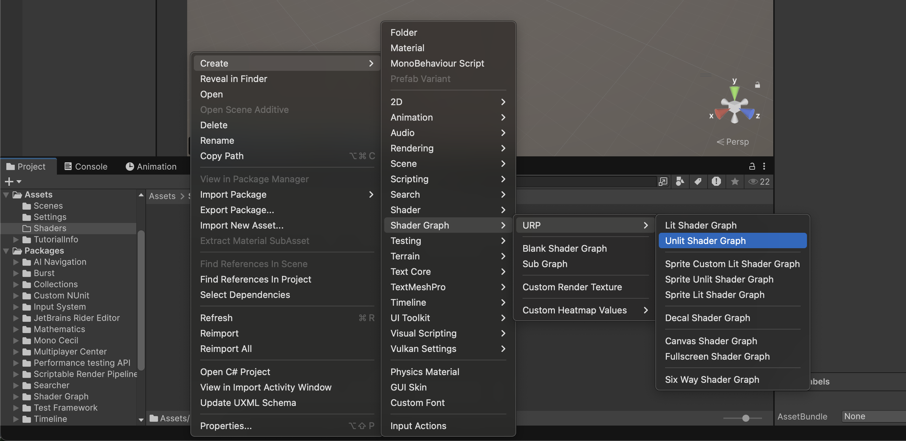
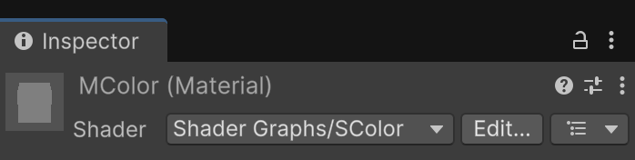
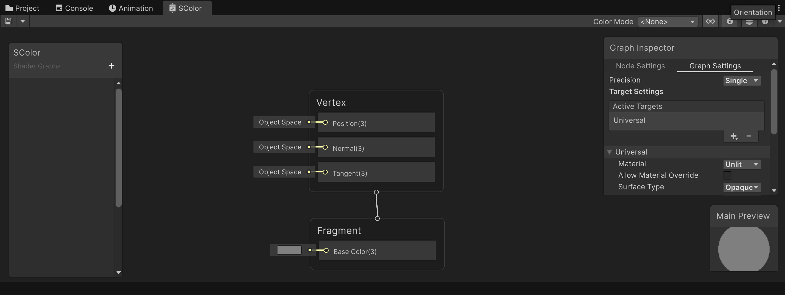
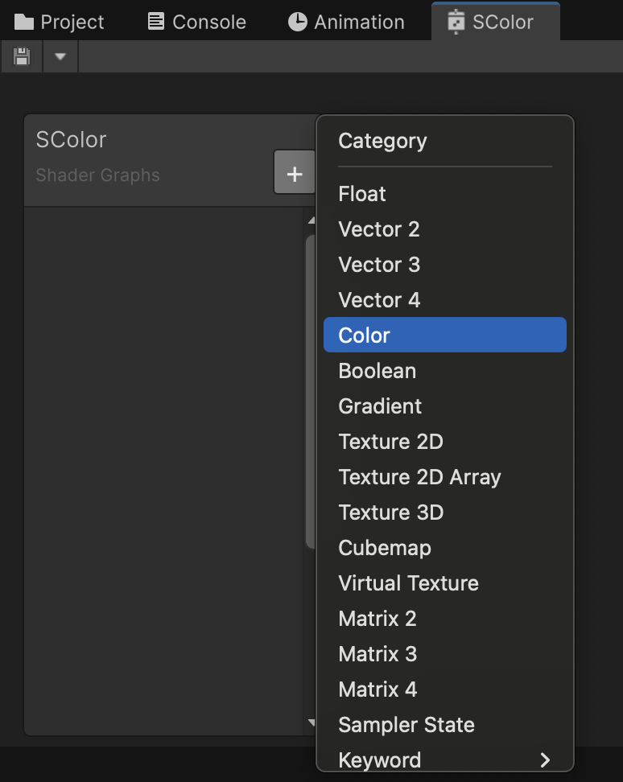
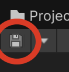
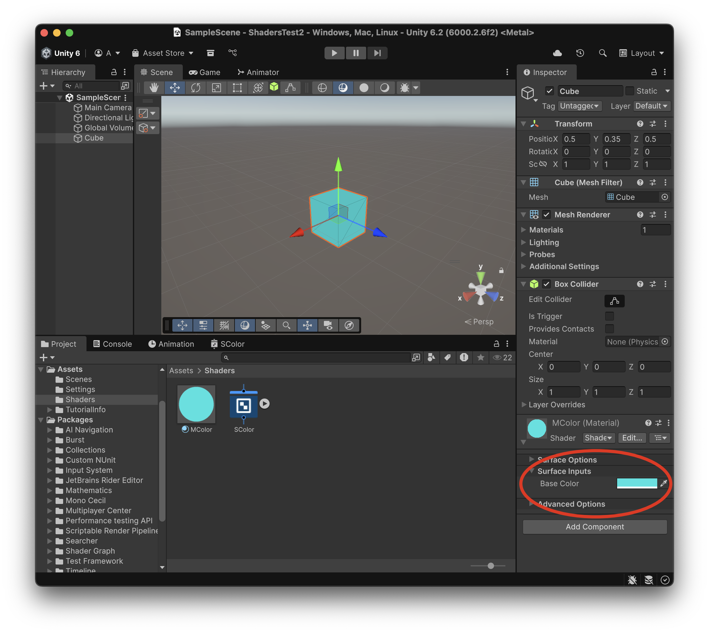

# Guia: primer shader de color

Guia pràctica de familiarització amb Shader Graph. Llegeix abans [Fonaments](Teoria-0-Fonaments.md) i [Dades i propietats](<Teoria-1-Dades i propietats.md>). La demo **0-Patro** desenvolupa els patrons de línies i quadres.

## Projecte

Fes un nou projecte tipus **"Universal 3D"** anomenat **ShadersTest**

Als *Assets* crea una nova carpeta **"Shaders"**

## Primer Shader

A la carpeta *Assets > Shaders* crea un nou **"Unlit Shader"** i anomena'l **"SColor"**

*Create > Shader Graph > URP > Unlit Shader Graph*

 

Amb el *"botó dret"* a sobre de l'icona del shader, crea un nou material amb:

- *Create Material*

Anomena al nou material **"MColor"**, fixa't a l'**Inspector** del material, que automàticament té el shader **"SColor"** assignat:

 

Fes doble clic a sobre del *shader* per obrir la pestanya de definició del shader.

 

Inicialment només es veuen les sortides del material:

- **Vertex**: controla els valors que afecten la geometria de l’objecte (per exemple, la posició dels vèrtexs o la seva deformació).

- **Fragment** controla propietats de la superfície com el color. Aquest gràfic és Unlit: el color no depèn de la il·luminació habitual de l’escena.

A l'esquerra tenim un espai on podem definir els paràmetres que l'usuari podrà configurar del nostre *shader*.

Prem el botó **+** i afegeix un paràmetre de tipus **Color** anomenat **"Base Color"**

 

Arrossega el nou paràmetre **"Base Color"** cap a l'àrea del gràfic, i connecta la seva sortida amb l'entrada de **"Fragment > Base Color(3)"**

<video src="./assets/primer-dragparameter.mov" width="600" controls></video>

Comprova que la propietat té **Exposed** activat per poder-la editar al material.

Això farà que el color escollit per l'usuari s'apliqui com a color de sortida del shader.

> **NOTA**: És **MOLT IMPORTANT!** guardar el shader prement el **disquet** cada vegada que vulguem aplicar els canvis a l'escena.

 

Crea un nou objecte tipus *3D Object > Cube* a l'escena:

- Posa'l a la posició X:0, Y:0, Z:0
- Aplica-li el material *"MColor"*

El color inicial depèn del valor per defecte de la propietat; pots canviar-lo amb el selector de:

*Inspector > MColor (Material) > Surface Inputs > Base Color*

 

## Comprovar el resultat

- Canvia el color al material i comprova que el cub el mostra.
- Crea un segon material amb el mateix shader: comprova que pot tenir un color diferent.
- Si no apareix la propietat, comprova Exposed i desa el gràfic.
- Si no canvia el cub, comprova quin material té assignat el seu Renderer.
