# Recursos: referències visuals de Super Mario 3D World

Recull de referències per analitzar materials i efectes. Les imatges no permeten determinar com es van implementar: poden combinar textures, geometria i càlcul procedural.

Per a cada imatge, identifica el patró, els colors, el relleu aparent i la repetició. Després proposa una manera de reproduir-ne un aspecte amb els conceptes del tema.

| Observació | Possible tècnica per experimentar |
|---|---|
| Juntes i zones regulars | UV, quadrícula i màscares |
| Pedra amb variacions | Textura, soroll i normals |
| Esquerdes brillants | Màscara i emissió |
| Aigua amb vores clares | Animació i profunditat d'escena |

Aquestes són hipòtesis d'exercici, no afirmacions sobre els shaders originals.

## Parets i formacions rocoses:

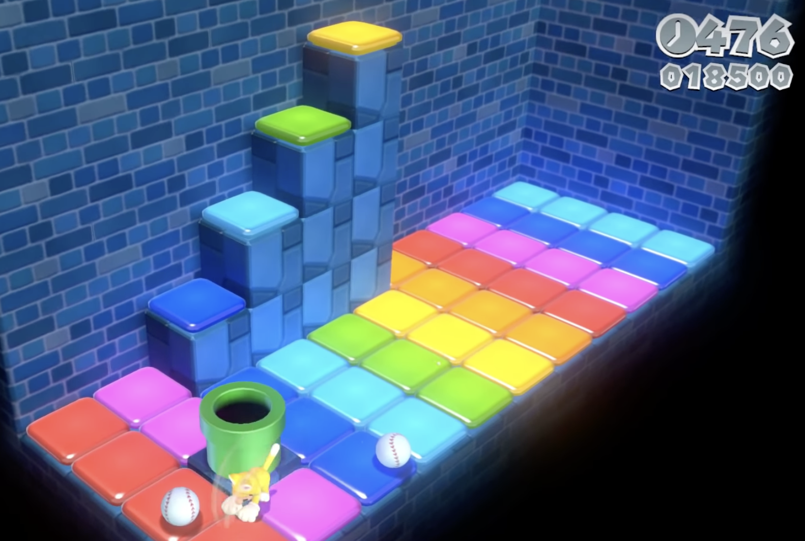

 

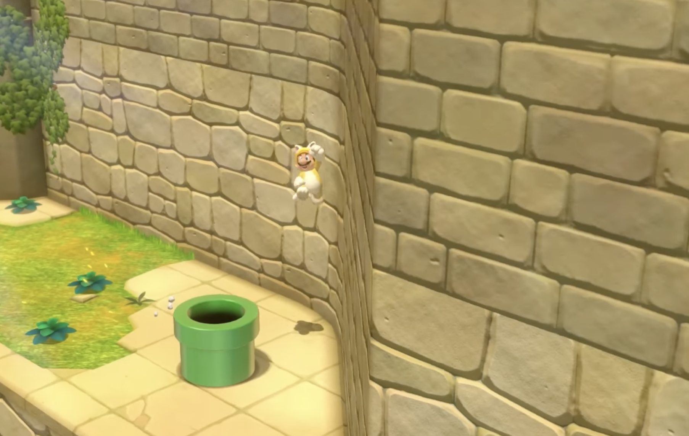

 

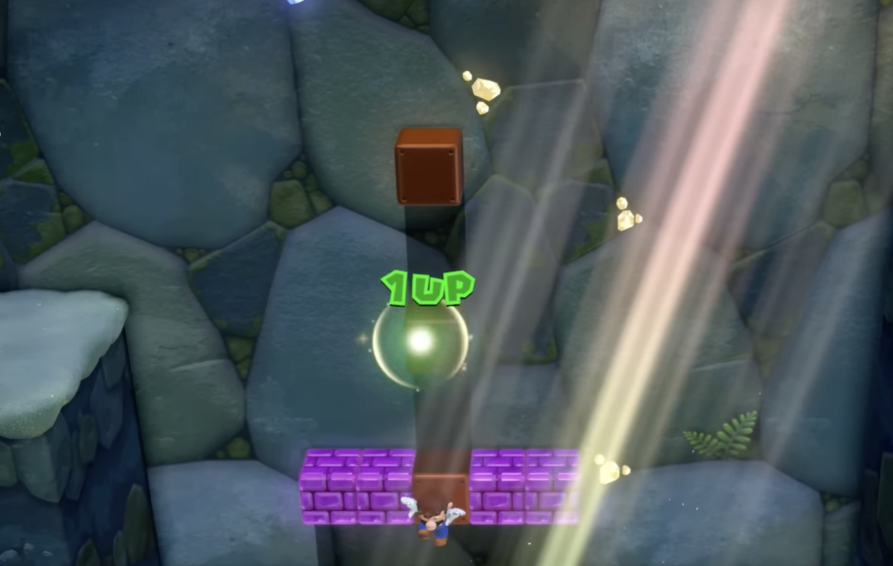

 

## Terres, aigua, sorra i gel:

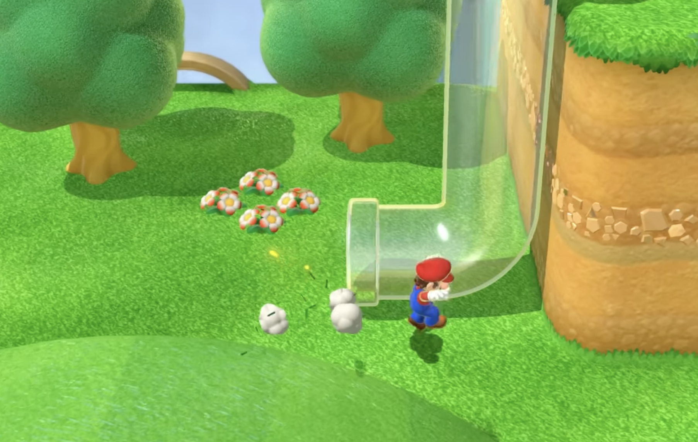

 

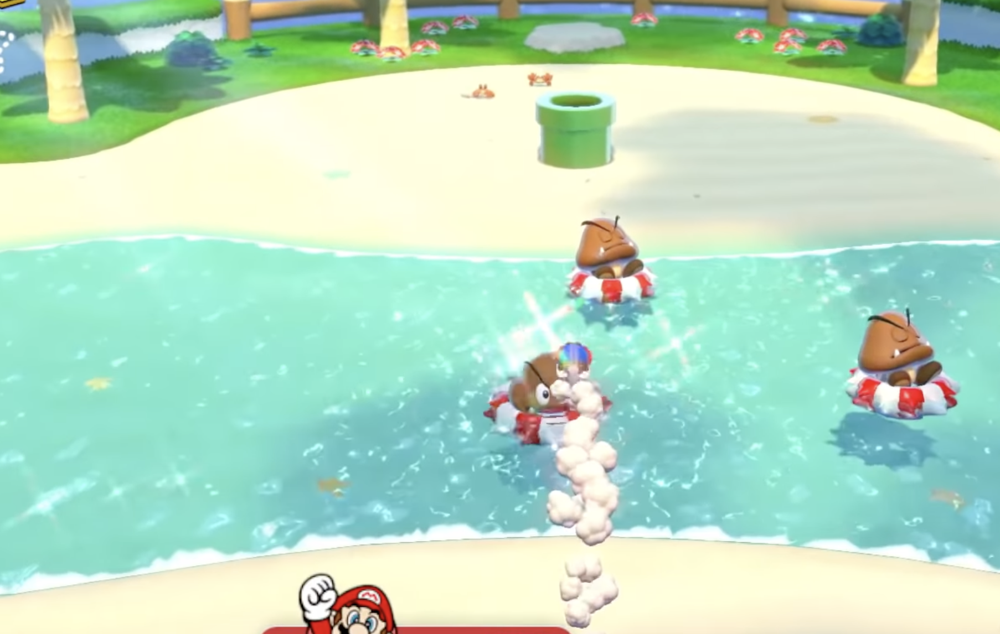

 

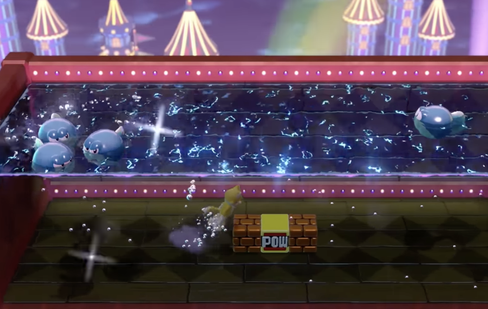

 

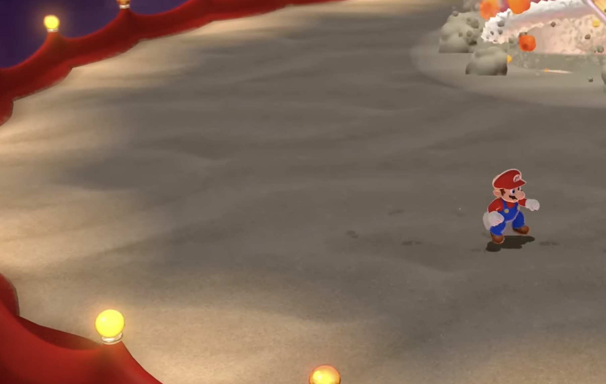

 

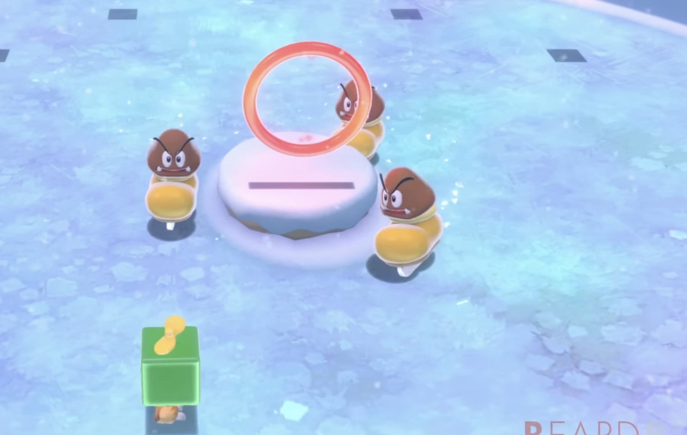

 

## Tecnologia, lava, fantasia:

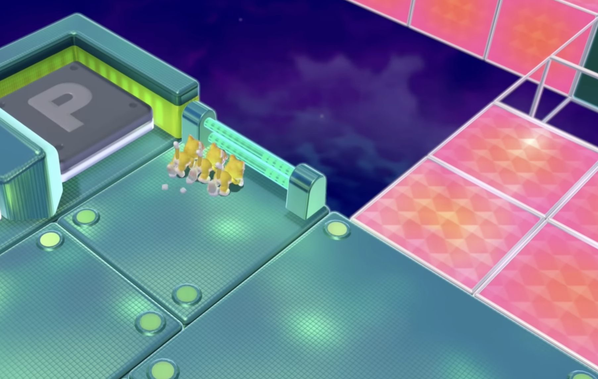

 

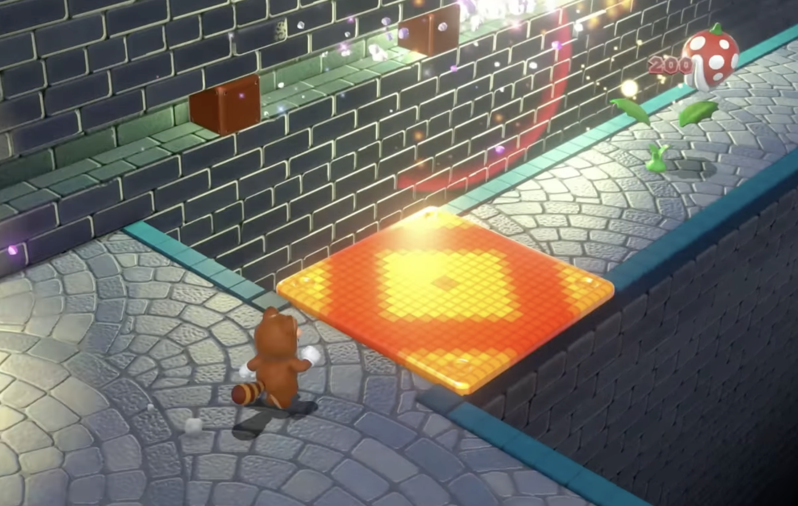

 

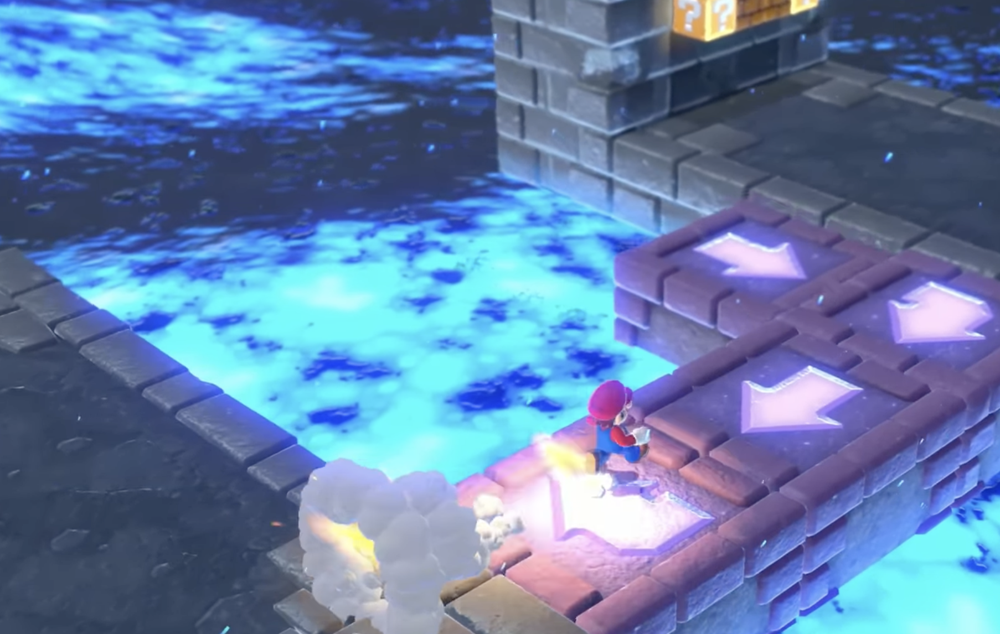

 

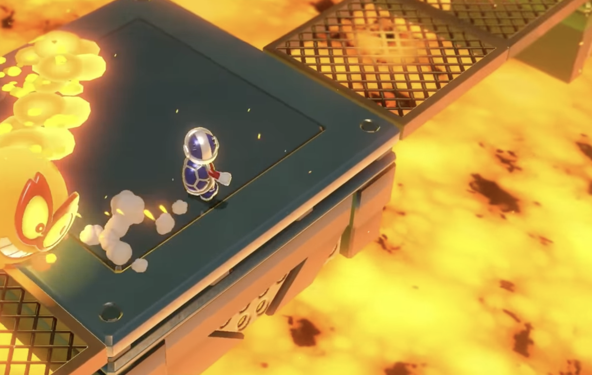

 

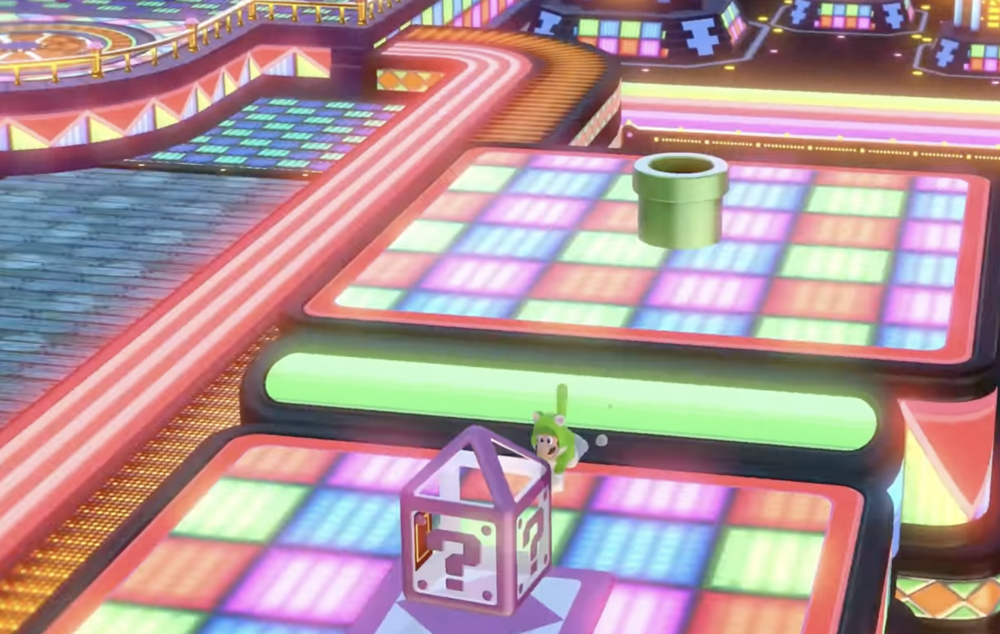

 

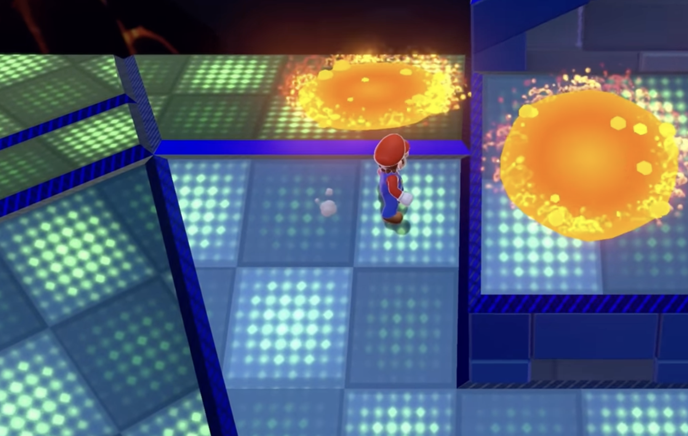

 

## Tèxtils:

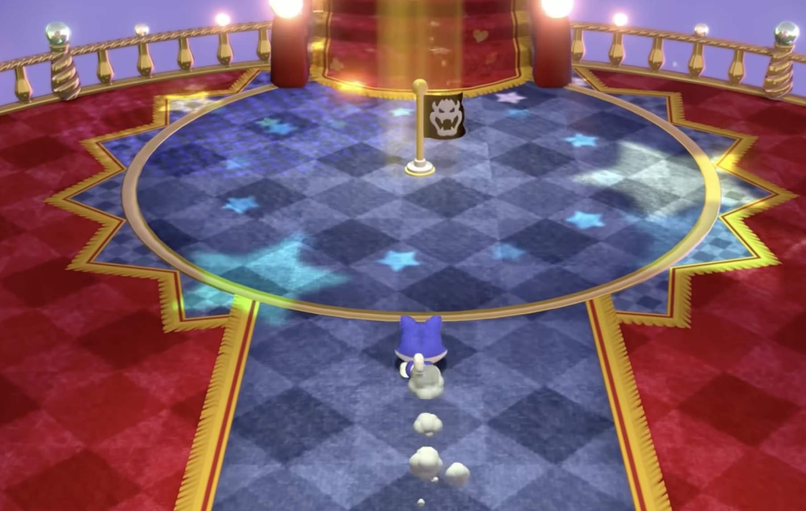

 
