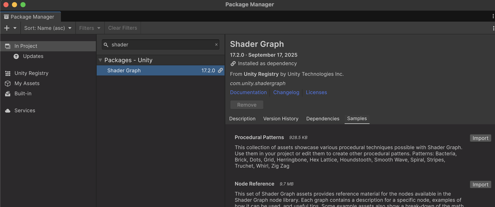
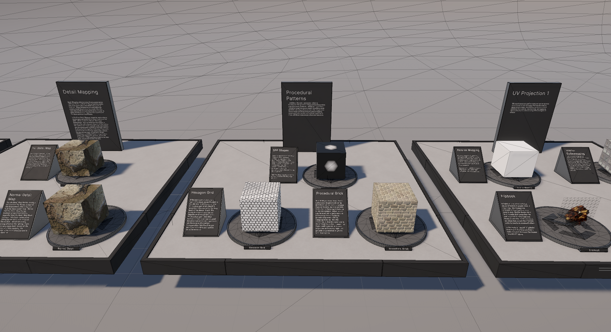
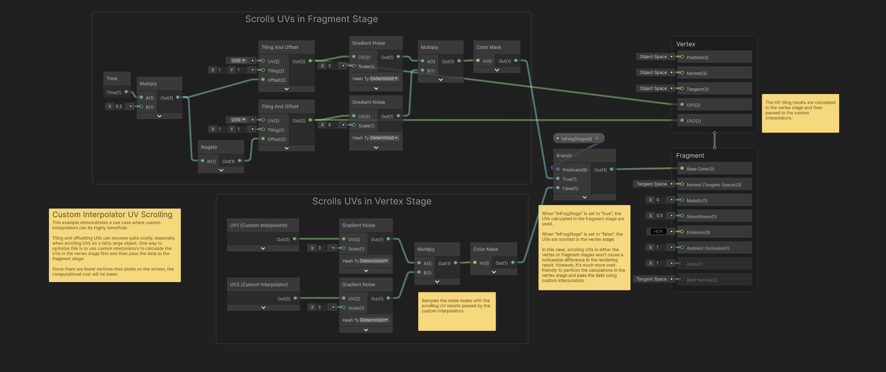
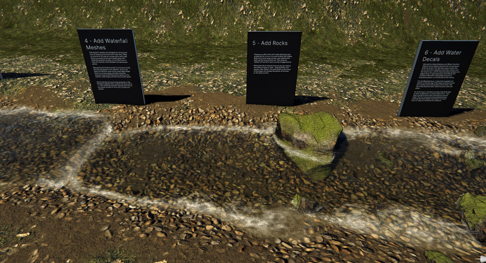

# Recursos: mostres de Shader Graph

**Unity** té un paquet amb shaders professionals pre-definits, per a veure tècniques i aprendre a fer-ne de nous.

Al package manager:

*Menú Window > Package Management > Package Manager*

A la pestanya **"In Project"** buscar: **"Shader Graph"**

En un projecte URP, comprova que Shader Graph apareix instal·lat. Les mostres són recursos opcionals: obre **"Samples"** i importa el conjunt que vulguis estudiar. Els noms i les carpetes poden variar segons la versió del paquet.

 

## Feature Examples

Exemples simples, obrir l'escena de demostració a:

*Assets > Samples > Shader Graph > XX.Y.Z > Feature Examples > Scenes > URPFeatureExamplesScene.unity*

 

Els shaders estan comentats amb notes explicatives:

 

## Production Ready

Exemples professionals avançats, obrir l'escena de demostració a:

*Assets > Samples > Shader Graph > XX.Y.Z > Production Ready Shaders > Scenes > URPProductionReadyShaders.unity*

 

Alguns materials es poden fer servir directament sobre objectes. Per exemple, arrossega aquest material a un cub:

*Assets > Samples > Shader Graph > XX.Y.Z > Production Ready Shaders > Environment > Ice > Ice Shader.mat*

<video src="./assets/libs-icematerial.mov" width="500" controls></video>

## Com estudiar una mostra

1. Obre l’escena compatible amb URP i localitza el material de l’efecte.
2. Segueix el gràfic des de les coordenades fins a la sortida.
3. Identifica propietats, màscares i textures. Canvia un paràmetre cada vegada.
4. Extreu una idea petita que puguis explicar i reconstruir.

Les mostres no substitueixen les demos guiades del curs.
