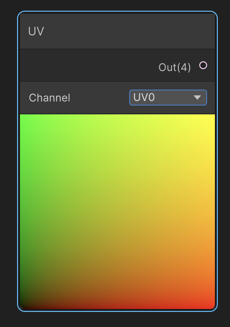
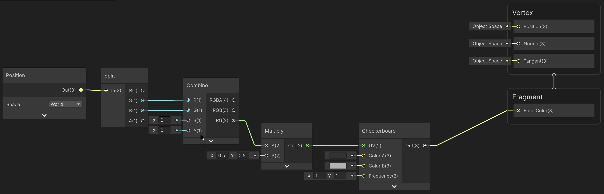

# Coordenades i textures

Per dibuixar un patró cal decidir **on el calculem**. Les coordenades són dades d'entrada: canviar-les modifica on llegim una textura o com avaluem una funció.

## UV de la malla

Les UV associen punts de la superfície a coordenades de dues dimensions: **U** i **V**. Sovint s'utilitza el rang 0–1, però poden quedar fora d'aquest rang. No són índexs de píxels d'una imatge.

El node **UV** permet triar UV0, UV1, UV2 o UV3. Aquests canals són conjunts de coordenades guardats a la malla, no els canals RGB d'una textura. El canal ha de contenir dades adequades.



Visualitzar U com a gris mostra una rampa en una direcció; visualitzar V mostra la rampa en l'altra. Visualitzar (U,V,0) com a RGB ajuda a detectar orientació, costures i deformacions de les UV.

## Llegir una textura

```text
Propietat Texture2D → Sample Texture 2D / Texture
UV → Sample Texture 2D / UV
Sample Texture 2D / RGB → Base Color
```

**Sample Texture 2D** retorna el color o les dades de la textura a la posició indicada. Les sortides R, G, B i A permeten llegir-ne els canals per separat.

| Configuració | Efecte |
|---|---|
| Wrap Mode: Repeat | Repeteix la imatge fora del rang 0–1 |
| Wrap Mode: Clamp | Allarga el valor de la vora |
| Filter Mode | Determina com s'interpolen les mostres |
| Mip Maps | Versions reduïdes que ajuden a filtrar textures llunyanes |
| sRGB | Adequat per a textures de color; les dades numèriques acostumen a requerir lectura lineal |

Un normal map requereix configuració específica, explicada a [Superfície i geometria](<Teoria-5-Superficie i geometria.md>). No tots els assets de textura són fotografies de color.

## Tiling i Offset

El node **Tiling And Offset** expressa:

```text
uvFinal = uv * tiling + offset
```

Amb tiling (4,2), el domini avança quatre unitats en U i dues en V. Una textura amb Repeat es repetirà quatre i dues vegades, respectivament. Offset (0.25,0) canvia el punt de mostreig un quart d'unitat en U.

Això canvia el mostreig, no mou físicament l'objecte. Si augmentem l'offset U, els detalls de la imatge acostumen a semblar que es desplacen en el sentit contrari.

## Espais de coordenades

| Entrada | A què queda lligat el patró? | Què passa quan es mou l'objecte? |
|---|---|---|
| UV | Desplegament de la malla | El patró acompanya la superfície |
| Position: Object | Sistema local de l'objecte | Acompanya l'objecte; l'escala de l'objecte afecta la mida visible |
| Position: World | Posicions del món | L'objecte travessa un patró fix al món |
| Screen Position: Default, XY | Posicions normalitzades de pantalla | El patró queda fix a la pantalla mentre la silueta es mou |

No barregis posicions de dos espais sense transformar-les. En un patró mundial, moure la càmera canvia la projecció visible, però no la posició del patró al món.

Per projectar una textura sobre un terra, es poden utilitzar les components XZ de Position World com a UV. En una paret vertical, aquesta projecció pot estirar-se o col·lapsar: cal triar altres eixos o una projecció triplanar.



## Coordenades de pantalla

Per als càlculs 2D, utilitza XY de **Screen Position en mode Default**. Els modes Raw i Center tenen significats diferents; no són intercanviables.

Perquè una distància en pantalla dibuixi un cercle i no una el·lipse, corregeix la relació d'aspecte:

```text
delta = screenUV - centreUV
deltaCorregit = (delta.x * amplada / alcada, delta.y)
distancia = length(deltaCorregit)
```

El radi queda expressat com a fracció de l'alçada de la imatge. Centre i screenUV han de seguir la mateixa convenció i correspondre a la mateixa càmera.

**Errors habituals:** confondre UV amb píxels; esperar repetició amb Clamp; utilitzar XY en un terra XZ; assumir que World i Screen mantenen el mateix comportament.

**Referència:** [Screen Position](https://docs.unity3d.com/Packages/com.unity.shadergraph@17.0/manual/Screen-Position-Node.html).
