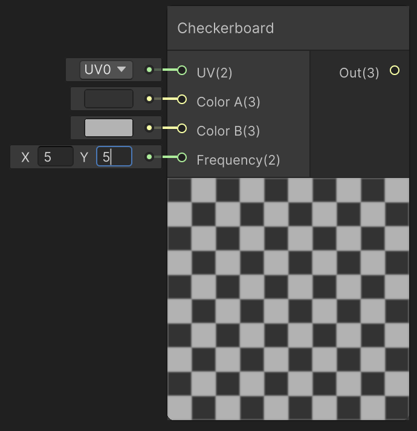
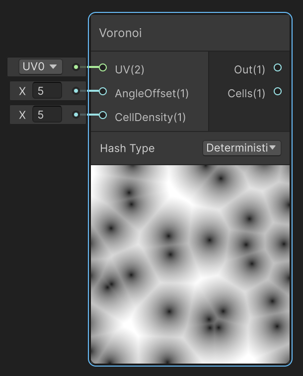

# Patrons i animació

Un patró procedural és una funció de coordenades. Abans de donar-li color, convé visualitzar-ne el resultat com una màscara en blanc i negre. Aquesta fitxa prepara la demo **0-Patro**: línies, quadrícula i quadres alternats.

## Línies repetides

Partim d'UV0 i separem U i V amb Split. Amb N repeticions i un gruix G entre 0 i 1:

```text
faseU = Fraction(U * N)
liniaU = 1 - Step(G, faseU)
```

N = 8 genera vuit franges en una unitat UV. G = 0.1 selecciona el primer 10% de cada cel·la. En els ports del node Step, connecta **G a Edge** i **faseU a In**; passa el resultat per One Minus.

Les línies són perpendiculars a la direcció en què varia U. En unes UV planes convencionals, formen franges verticals. Canviar U per V produeix franges en l'altra direcció.

Per acolorir-les:

```text
color = Lerp(colorFons, colorLinia, liniaU)
```

## Quadrícula i quadres alternats

Una quadrícula uneix línies de les dues direccions:

```text
liniaV = 1 - Step(G, Fraction(V * N))
quadricula = Maximum(liniaU, liniaV)
```

Les zones interiors de les cel·les són **1 − quadricula**. Aquesta separació entre juntes i interiors prepara les rajoles.

Un tauler alternat requereix saber si la suma dels índexs de cel·la és parella o senar:

```text
celU = Floor(U * N)
celV = Floor(V * N)
alternat = Fraction((celU + celV) * 0.5) * 2
```

El resultat és 0 o 1. Amb N = 8 hi ha vuit cel·les per eix en el domini UV 0–1. El node **Checkerboard** ofereix directament un patró alternat amb colors i freqüència configurables; la fórmula permet entendre'n el principi.



Un patró regular ajuda a detectar UV deformades. Si l'objecte no té proporcions quadrades, pot caldre una freqüència diferent per eix.

## Vores i aliasing

Step crea vores dures. Quan una línia ocupa menys d'un píxel pot parpellejar o desaparèixer. Smoothstep permet una transició controlada, però un suavitzat fix no resol totes les distàncies ni tots els salts de Fraction.

Per als patrons repetits, les vores a banda i banda de la cel·la també han de ser coherents. En ampliacions es pot adaptar el suavitzat a les derivades de pantalla; per començar, evita freqüències excessives i comprova el resultat de prop i de lluny.

## Soroll, cel·les i gradients

| Node o família | Què proporciona | Ús |
|---|---|---|
| Simple Noise | Soroll coherent a partir de coordenades | Taques i variació de superfície |
| Gradient Noise | Un altre tipus de soroll coherent | Deformació i detall orgànic |
| Voronoi | Distàncies i informació de cel·les | Zones irregulars i patrons cel·lulars |
| Gradient + Sample Gradient | Definició d'una paleta i avaluació en un valor | Convertir una màscara en una progressió de colors |

**Gradient no és Gradient Noise.** El primer defineix claus de color/alpha; el segon genera soroll. Els generadors són deterministes: amb les mateixes coordenades i paràmetres obtenim el mateix resultat.



Una roca pot combinar una textura amb soroll de baixa freqüència per reduir la repetició visible. La lava pot utilitzar una màscara irregular per separar escorça i esquerdes. Afegir molts generadors encadenats augmenta el cost: cada capa ha de tenir una funció visual clara.

## Temps, velocitat i desplaçament

El node **Time** proporciona temps i sortides periòdiques. Per controlar la velocitat d'un desplaçament:

```text
uvAnimada = uv + temps * velocitatUV
```

VelocitatUV = (0.1,0) avança 0.1 unitats UV de mostreig per segon. Pot ser zero, negativa o superior a 1; no hi ha l'obligació de multiplicar el temps per un valor menor que 1.

Utilitza un Vector2 per controlar cada eix. Desplaçar les UV anima el patró sobre l'objecte; no deforma la malla.

## Sinus, freqüència i amplitud

```text
oscil = sin(2 * PI * frequenciaHz * temps + fase)
pulsacio01 = oscil * 0.5 + 0.5
```

| Paràmetre | Efecte |
|---|---|
| Freqüència (Hz) | Cicles per segon |
| Fase (radians) | Punt inicial del cicle |
| Amplitud | Quantitat de variació |
| Valor central | Valor al voltant del qual oscil·lem |

Per fer oscil·lar una intensitat entre 2 i 4: **3 + sin(...) × 1**. El node Sine treballa en radians. Les sortides sinusoidals predefinides de Time són útils, però per ajustar freqüència convé usar Time, Multiply i Sine.

## Distorsió de coordenades

Es poden calcular dues coordenades noves a partir de les originals:

```text
uNou = u + cos(v * freqV + temps * velocitatV) * amplitudU
vNou = v + sin(u * freqU + temps * velocitatU) * amplitudV
```

Aquí les freqüències són radians per unitat UV i les velocitats són radians per segon. Totes dues expressions fan servir **u i v originals**. Després es combinen uNou i vNou per mostrejar una textura o avaluar un patró.

<video src="assets/nodes-pixeluvanimvideo.mov" width="500" controls loop></video>

**Errors habituals:** confondre quadrícula amb tauler alternat; donar la velocitat sense unitats; esperar que el soroll canviï sense variar les entrades; confondre distorsió UV amb moviment dels vèrtexs.
