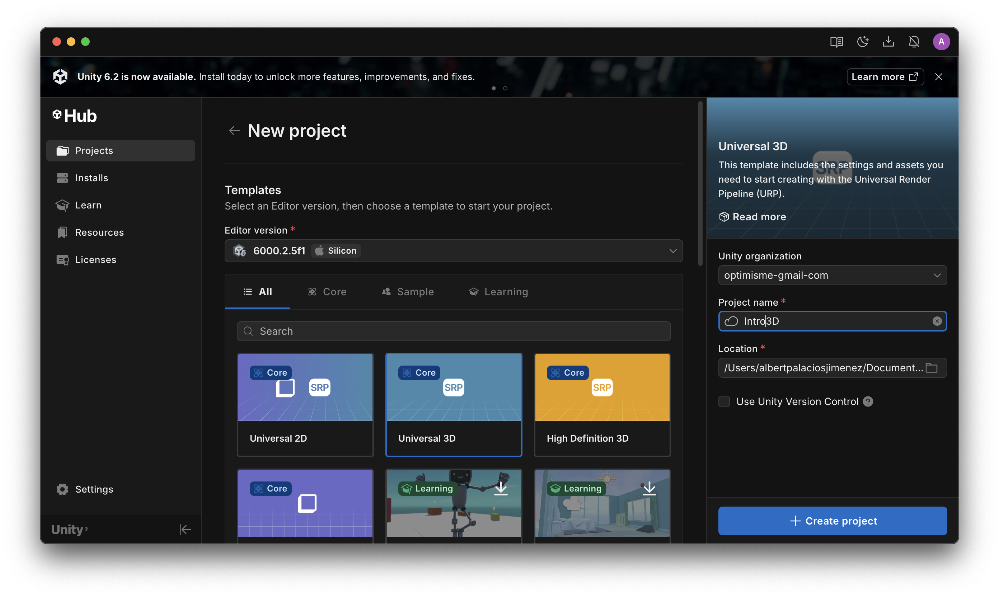
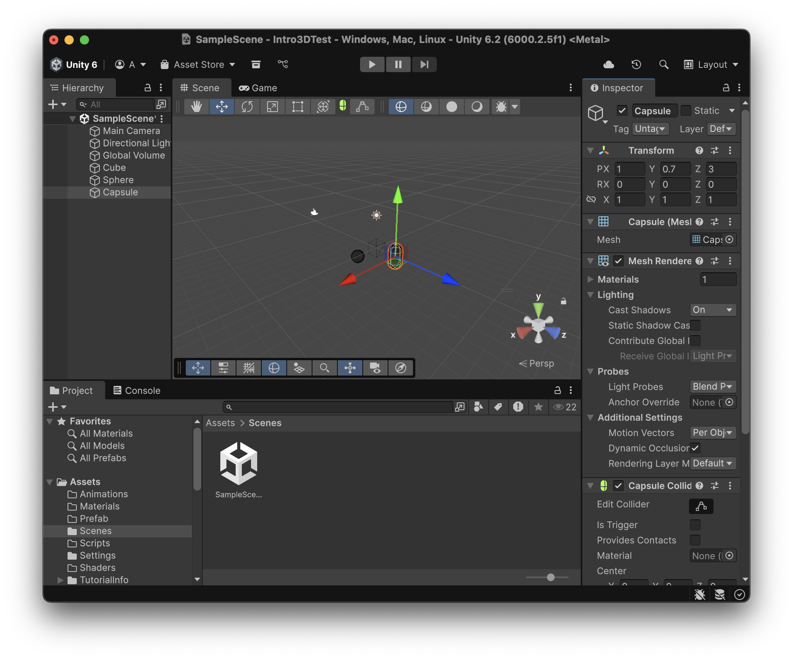
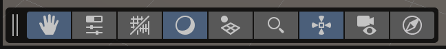
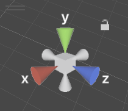
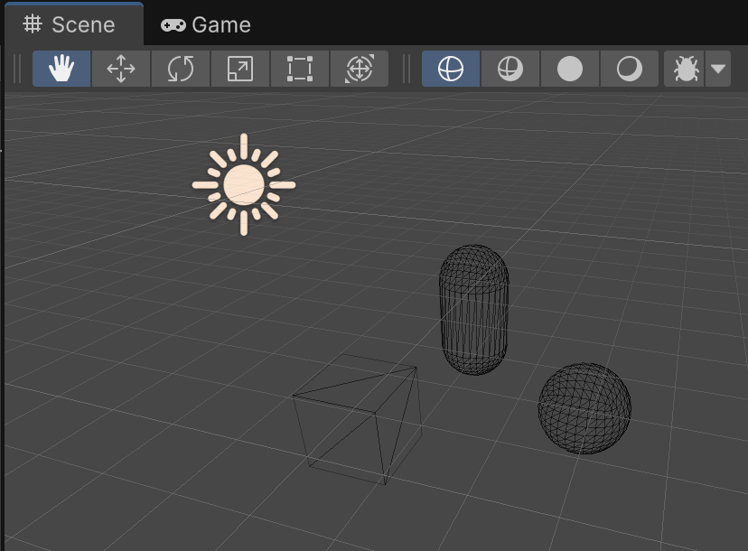
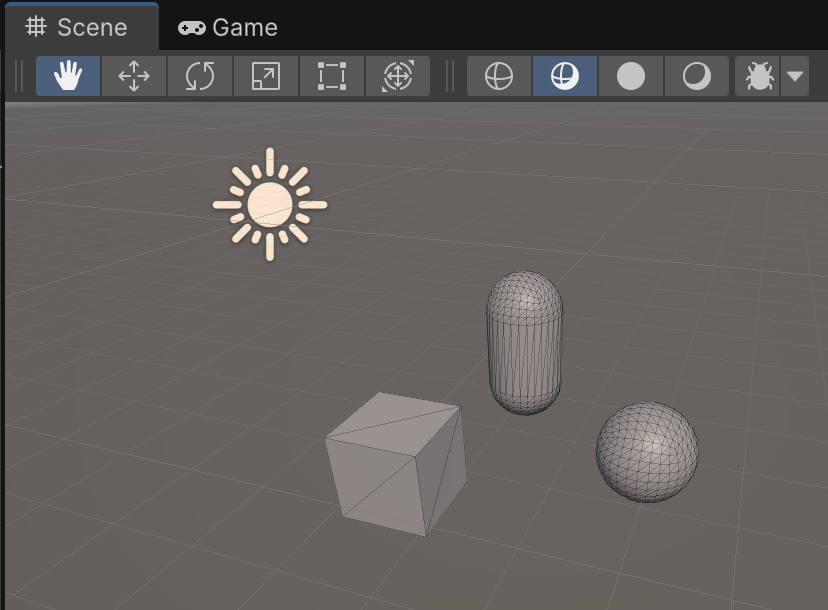
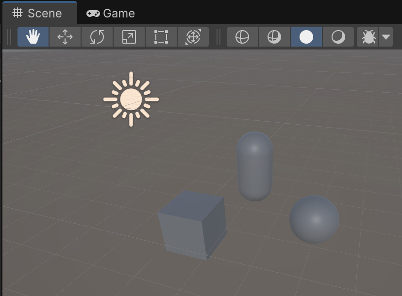
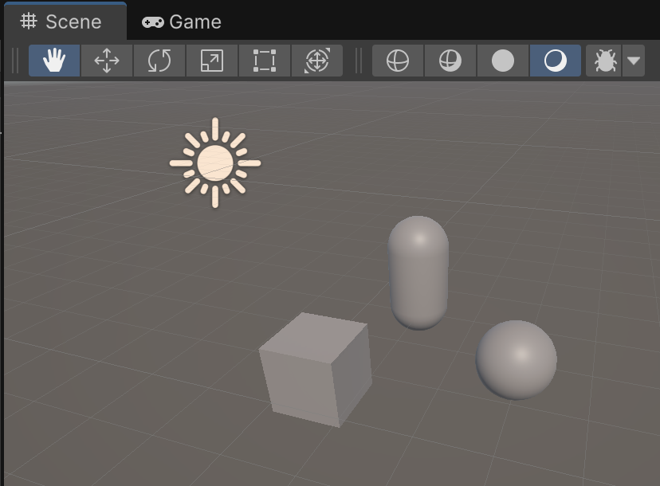
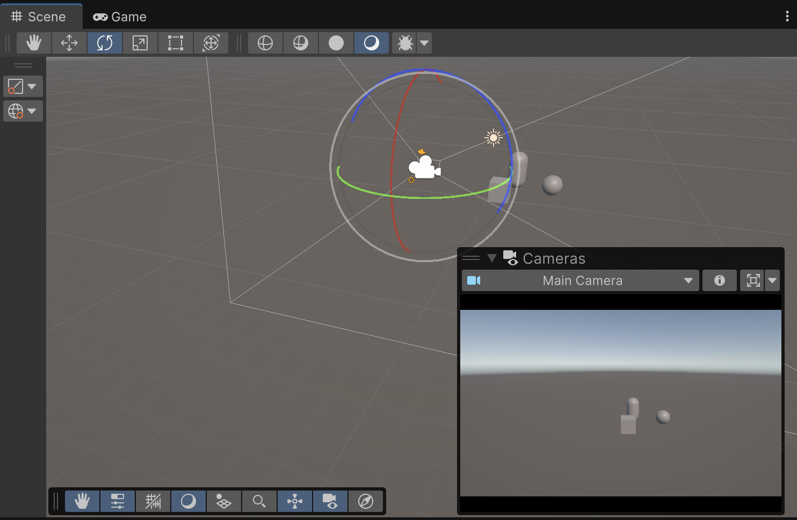

# Projecte

## Nou projecte

A Unity HUB, crea un nou projecte tipus **"Universal 3D"** anomenat **"Intro3D"**

 

A la pestanya **"Project"**, escull la carpeta **"Assets"** i afegeix aquestes noves carpetes amb **"Create > Folder"**

- Animations
- Materials
- Prefabs
- Scripts
- Shaders

## Interfície 3D

La interfície de desenvolupament 3D és igual a la 2D, però amb eines adaptades.

Crea dos nous objectes a la pestanya **"Hierarchy"**:

- 3D Object > **Cube**: amb els paràmetres per defecte
- 3D Object > **Sphere**: a la posició X = 3
- 3D Object > **Capsule**: a la posició Z = 3

 

## Menu eines 3D

Aquest menú:

 

Permet activar/desactivar altres menús:

- **Tools**: Menú d’eines bàsiques de manipulació
- **Tool Settings**: Configuració de l’eina activa segons l’objecte
- **Grid and Snap**: Opcions de graella i ajustament precís
- **View Options**: Configurar com es mostra l’escena
- **Search**: Cercar objectes dins de l’escena
- **Orientation**: Controlar l’orientació de la càmera de l’escena
- **Cameras**: Veure a través de les càmeres de la escena
- **AI navigation**: Opcions per generar i gestionar camins de navegació

## Orientation (orientació)

A la interfície 3D podem moure i rotar la càmera a l'espai 3D.

 

La eina d'orientació permet:

- Indicar l’orientació dels eixos X, Y i Z (roig, verd, blau).
- Permetre canviar el punt de vista: si fas clic a un dels cons (X, Y, Z), la càmera de l’escena es col·loca en vista otogràfica frontal alineada a aquell eix.
- Fer clic al cubet del centre, alterna entre perspectiva i isomètrica.

### Visió perspectiva
- Representa els objectes amb profunditat, com la percep l’ull humà o una càmera real.
- Els objectes més llunyans es veuen més petits, creant sensació d’espai tridimensional.

### Visió ortogràfica
- Representa els objectes sense perspectiva, com en un plànol tècnic o un mapa.
- Els objectes mantenen la mateixa mida independentment de la seva distància a la càmera.

### Visió isomètrica
- És un tipus especial de visió ortogràfica.
- La càmera s’orienta de manera que els tres eixos (X, Y, Z) es mostren amb el mateix angle (120° entre ells).
- És molt usada en videojocs clàssics 2.5D (com Age of Empires o Diablo).

## Draw mode

El *mode de dibuix* permet canviar la visualització de l'escena entre:

- **Wireframe**: mostra només les arestes de la malla.

 

- **Shaded Wireframe**: mostra el model amb materials i la malla superposada.

 

- **Unlit**: mostra els colors i textures sense il·luminació.

 

- **Shaded**: mostra els objectes amb materials i llums de l’escena.

 

## Càmera

La visualització de l'espai **"Scene"** és diferent al punt de vista de les diferents càmeres.

Activant l'icona de càmera, podem veure la imatge captada per la càmera, i posicionar-la segons convingui.

 

