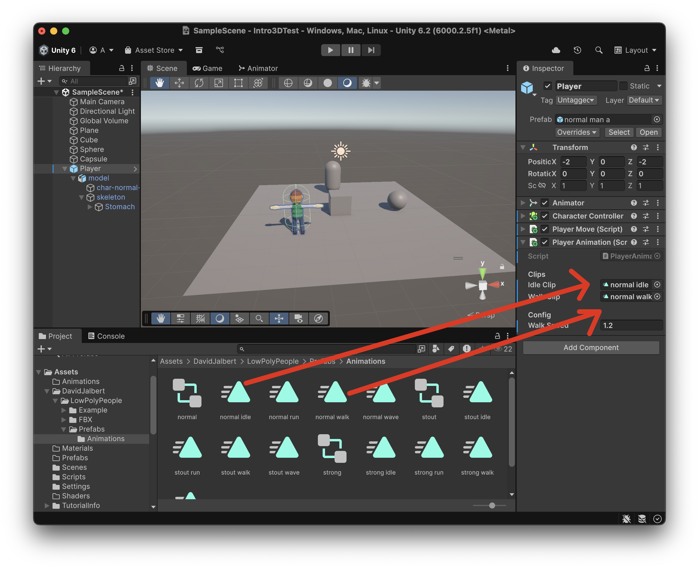

# Escena

Farem una escena 3D senzilla.

En una escena buida afegeix:

- 3D Object > **Plane**
    - Pos X: 0
    - Pos Y: 0.01
    - Pos Z: 0

- 3D Object > **Cube**
    - Pos X: 0
    - Pos Y: 0.5
    - Pos Z: 0
    - Color: Verd

- 3D Object > **Sphere**
    - Pos X: 3
    - Pos Y: 0.5
    - Pos Z: 0

- 3D Object > **Capsule**
    - Pos X: 0
    - Pos Y: 1
    - Pos Z: 3

<center>

</center>
<br/>

Configura la **"Main Camera"** amb:
- Pos X: 0
- Pos Y: 4
- Pos Z: -10
- Rotation X: 14
- Rotation Y: 0
- Rotation Z: 0

<center>

</center>
<br/>

## Personatge

Descarrega, i afegeix al projecte els assets d'aquest paquet:

[Low Poly People by David Jalbert](https://assetstore.unity.com/packages/3d/characters/humanoids/low-poly-people-by-david-jalbert-274814)

**Nota**: Aquest paquet té una incompatibilitat amb els shaders i la **"Universal Pipeline Rendering"**

Comprova que els shaders no es veuen bé, navega als assets:

*Assets > DavidJalbert > LowPolyPeople > FBX > Materials*

Es veuen tots en lila, i per tant no són vàlids.

<center>

</center>
<br/>

Per arreglar els shaders del paquet obre el menú:

*Window > Rendering > Render Pipeline Converter*

<center>

</center>
<br/>

Escull totes les opcions i apreta **"Initialize and Convert"**:

<center>

</center>

Ja hi ha els materials arreglats:

<center>

</center>
<br/>

Desplega la carpeta:

*Assets > DavidJalbert > LowPolyPeople > Prefabs*

Arrossega un dels personatges a l'escena i modifica els paràmetres del personatge:

Afegir el component *"Character Controller"*

- Nom: Player
- Pos X: -2
- Pos Y: 0
- Pos Z: -2
- Character Controller > Center Y: 1.1

<center>

</center>

## Scripts

Afegeix els següents scripts a la carpeta **"Scripts"**

**CameraController.cs**, assigna'l a la **"Main Camera"**:
```csharp
using UnityEngine;
using UnityEngine.InputSystem;

public class CameraController : MonoBehaviour
{
    public Transform pivot;

    [Header("Distance")]
    public float distance = 4f;
    public float minDistance = 2f, maxDistance = 25f;
    public float zoomSpeed = 10f; // unitats per notch

    [Header("Angles")]
    public float minPitch = 10f, maxPitch = 80f;

    [Header("Sensitivity (degrees per pixel)")]
    public float yawPerPixel = 0.25f;
    public float pitchPerPixel = 0.20f;

    [Header("Boost (while Alt/Option held)")]
    public float altBoost = 2.0f;

    private float yaw;
    private float pitch = 35f;

    // Input System actions
    private InputAction lookDelta;       // <Pointer>/delta
    private InputAction leftBtn;         // LMB
    private InputAction rightBtn;        // RMB
    private InputAction altModifier;     // LeftAlt / RightAlt

    // Estat d'entrada
    private bool _lmbHeld = false;
    private bool _rmbHeld = false;
    private bool _altHeld = false;
    private bool _isOrbiting = false;
    private bool _skipFirstDelta = false;

    // Handlers (no lambdes anònimes)
    private void OnLmbStarted(InputAction.CallbackContext ctx) { _lmbHeld = true;  TryBeginOrbit(); }
    private void OnLmbCanceled(InputAction.CallbackContext ctx){ _lmbHeld = false; TryEndOrbit(); }

    private void OnRmbStarted(InputAction.CallbackContext ctx) { _rmbHeld = true;  TryBeginOrbit(); }
    private void OnRmbCanceled(InputAction.CallbackContext ctx){ _rmbHeld = false; TryEndOrbit(); }

    private void OnAltStarted(InputAction.CallbackContext ctx) { _altHeld = true;  TryBeginOrbit(); }
    private void OnAltCanceled(InputAction.CallbackContext ctx){ _altHeld = false; TryEndOrbit(); }

    void OnEnable()
    {
        // Delta de pointer (evita salts en canvis de mode)
        lookDelta = new InputAction("LookDelta", type: InputActionType.Value);
        lookDelta.AddBinding("<Pointer>/delta");
        lookDelta.Enable();

        // LMB (per combinació amb Alt/Option)
        leftBtn = new InputAction("LMB", type: InputActionType.Button);
        leftBtn.AddBinding("<Mouse>/leftButton");
        leftBtn.started  += OnLmbStarted;
        leftBtn.canceled += OnLmbCanceled;
        leftBtn.Enable();

        // RMB (orbita directa)
        rightBtn = new InputAction("RMB", type: InputActionType.Button);
        rightBtn.AddBinding("<Mouse>/rightButton");
        rightBtn.started  += OnRmbStarted;
        rightBtn.canceled += OnRmbCanceled;
        rightBtn.Enable();

        // Alt/Option
        altModifier = new InputAction("Alt", type: InputActionType.Button);
        altModifier.AddBinding("<Keyboard>/leftAlt");
        altModifier.AddBinding("<Keyboard>/rightAlt");
        altModifier.started  += OnAltStarted;
        altModifier.canceled += OnAltCanceled;
        altModifier.Enable();

        Application.focusChanged += OnAppFocusChanged;
    }

    void OnDisable()
    {
        if (lookDelta != null) lookDelta.Disable();

        if (leftBtn != null)  { leftBtn.started  -= OnLmbStarted;  leftBtn.canceled  -= OnLmbCanceled;  leftBtn.Disable(); }
        if (rightBtn != null) { rightBtn.started -= OnRmbStarted;   rightBtn.canceled -= OnRmbCanceled; rightBtn.Disable(); }
        if (altModifier != null){ altModifier.started -= OnAltStarted; altModifier.canceled -= OnAltCanceled; altModifier.Disable(); }

        Application.focusChanged -= OnAppFocusChanged;
        EndOrbitImmediate();
    }

    private void OnAppFocusChanged(bool hasFocus)
    {
        if (!hasFocus) EndOrbitImmediate();
    }

    void Start()
    {
        if (!pivot)
        {
            var go = new GameObject("Pivot");
            pivot = go.transform;
            pivot.position = Vector3.zero;
        }

        Vector3 dir = (transform.position - pivot.position).normalized;
        pitch = Mathf.Asin(Mathf.Clamp(dir.y, -0.999f, 0.999f)) * Mathf.Rad2Deg;
        yaw   = Mathf.Atan2(dir.x, dir.z) * Mathf.Rad2Deg;
    }

    void Update()
    {
        if (_isOrbiting)
        {
            Vector2 d = lookDelta.ReadValue<Vector2>();
            if (_skipFirstDelta) { d = Vector2.zero; _skipFirstDelta = false; }

            float boost = _altHeld ? altBoost : 1f;
            yaw   += d.x * yawPerPixel   * boost;
            pitch -= d.y * pitchPerPixel * boost;
            pitch = Mathf.Clamp(pitch, minPitch, maxPitch);
        }

        // Zoom
        if (Mouse.current != null)
        {
            float scrollY = Mouse.current.scroll.ReadValue().y;
            if (Mathf.Abs(scrollY) > 0.01f)
            {
                distance -= scrollY * (zoomSpeed * 0.01f);
                distance = Mathf.Clamp(distance, minDistance, maxDistance);
            }
        }
    }

    void LateUpdate()
    {
        if (!pivot) return;

        Quaternion rot = Quaternion.Euler(pitch, yaw, 0f);
        Vector3 pos = pivot.position + rot * new Vector3(0f, 0f, -distance);
        transform.SetPositionAndRotation(pos, rot);
    }

    public void SetPivot(Transform newPivot) => pivot = newPivot;

    // Condició d'òrbita: RMB || (Alt && LMB)
    private bool OrbitCondition() => _rmbHeld || (_altHeld && _lmbHeld);

    private void TryBeginOrbit()
    {
        if (_isOrbiting) return;
        if (OrbitCondition())
        {
            _isOrbiting = true;
            _skipFirstDelta = true;
            Cursor.lockState = CursorLockMode.Locked;
            Cursor.visible = false;
        }
    }

    private void TryEndOrbit()
    {
        if (!_isOrbiting) return;
        if (!OrbitCondition())
        {
            EndOrbitImmediate();
        }
    }

    private void EndOrbitImmediate()
    {
        _isOrbiting = false;
        _skipFirstDelta = false;
        Cursor.lockState = CursorLockMode.None;
        Cursor.visible = true;
    }
}
```

**PlayerMove.cs**, assigna'l al **"Player"**:
```csharp
using UnityEngine;
using UnityEngine.InputSystem;

public class CameraController : MonoBehaviour
{
    public Transform pivot; 

    [Header("Camera Mode")]
    public bool use3rdPersonFollow = true; // TRUE = 3rd person, FALSE = orbit

    [Header("3rd Person Follow Settings")]
    public Vector3 followOffset = new Vector3(0f, 2f, -4f);
    public float followSmoothSpeed = 10f;

    [Header("Distance")]
    public float distance = 4f;
    public float minDistance = 2f, maxDistance = 25f;
    public float zoomSpeed = 10f;

    [Header("Angles")]
    public float minPitch = 10f, maxPitch = 80f;

    [Header("Sensitivity (degrees per pixel)")]
    public float yawPerPixel = 0.25f;
    public float pitchPerPixel = 0.20f;

    [Header("Boost (while Alt/Option held)")]
    public float altBoost = 2.0f;

    private float yaw;
    private float pitch = 35f;
    private Vector3 currentVelocity;

    // Input System actions
    private InputAction lookDelta;
    private InputAction leftBtn;
    private InputAction rightBtn;
    private InputAction altModifier;

    // Estat d'entrada
    private bool _lmbHeld = false;
    private bool _rmbHeld = false;
    private bool _altHeld = false;
    private bool _isOrbiting = false;
    private bool _skipFirstDelta = false;

    // Handlers
    private void OnLmbStarted(InputAction.CallbackContext ctx) { _lmbHeld = true;  TryBeginOrbit(); }
    private void OnLmbCanceled(InputAction.CallbackContext ctx){ _lmbHeld = false; TryEndOrbit(); }

    private void OnRmbStarted(InputAction.CallbackContext ctx) { _rmbHeld = true;  TryBeginOrbit(); }
    private void OnRmbCanceled(InputAction.CallbackContext ctx){ _rmbHeld = false; TryEndOrbit(); }

    private void OnAltStarted(InputAction.CallbackContext ctx) { _altHeld = true;  TryBeginOrbit(); }
    private void OnAltCanceled(InputAction.CallbackContext ctx){ _altHeld = false; TryEndOrbit(); }

    void OnEnable()
    {
        lookDelta = new InputAction("LookDelta", type: InputActionType.Value);
        lookDelta.AddBinding("<Pointer>/delta");
        lookDelta.Enable();

        leftBtn = new InputAction("LMB", type: InputActionType.Button);
        leftBtn.AddBinding("<Mouse>/leftButton");
        leftBtn.started  += OnLmbStarted;
        leftBtn.canceled += OnLmbCanceled;
        leftBtn.Enable();

        rightBtn = new InputAction("RMB", type: InputActionType.Button);
        rightBtn.AddBinding("<Mouse>/rightButton");
        rightBtn.started  += OnRmbStarted;
        rightBtn.canceled += OnRmbCanceled;
        rightBtn.Enable();

        altModifier = new InputAction("Alt", type: InputActionType.Button);
        altModifier.AddBinding("<Keyboard>/leftAlt");
        altModifier.AddBinding("<Keyboard>/rightAlt");
        altModifier.started  += OnAltStarted;
        altModifier.canceled += OnAltCanceled;
        altModifier.Enable();

        Application.focusChanged += OnAppFocusChanged;
    }

    void OnDisable()
    {
        if (lookDelta != null) lookDelta.Disable();

        if (leftBtn != null)  { leftBtn.started  -= OnLmbStarted;  leftBtn.canceled  -= OnLmbCanceled;  leftBtn.Disable(); }
        if (rightBtn != null) { rightBtn.started -= OnRmbStarted;   rightBtn.canceled -= OnRmbCanceled; rightBtn.Disable(); }
        if (altModifier != null){ altModifier.started -= OnAltStarted; altModifier.canceled -= OnAltCanceled; altModifier.Disable(); }

        Application.focusChanged -= OnAppFocusChanged;
        EndOrbitImmediate();
    }

    private void OnAppFocusChanged(bool hasFocus)
    {
        if (!hasFocus) EndOrbitImmediate();
    }

    void Start()
    {
        if (!pivot)
        {
            var go = new GameObject("Pivot");
            pivot = go.transform;
            pivot.position = Vector3.zero;
        }

        if (use3rdPersonFollow && pivot)
        {
            // Mode 3rd person: inicialitza yaw amb la direcció del player
            yaw = pivot.eulerAngles.y;
        }
        else
        {
            // Mode orbit: calcula angles des de la posició inicial
            Vector3 dir = (transform.position - pivot.position).normalized;
            pitch = Mathf.Asin(Mathf.Clamp(dir.y, -0.999f, 0.999f)) * Mathf.Rad2Deg;
            yaw   = Mathf.Atan2(dir.x, dir.z) * Mathf.Rad2Deg;
        }
    }

    void Update()
    {
        if (_isOrbiting)
        {
            // Mode manual orbit (RMB o Alt+LMB)
            Vector2 d = lookDelta.ReadValue<Vector2>();
            if (_skipFirstDelta) { d = Vector2.zero; _skipFirstDelta = false; }

            float boost = _altHeld ? altBoost : 1f;
            yaw   += d.x * yawPerPixel   * boost;
            pitch -= d.y * pitchPerPixel * boost;
            pitch = Mathf.Clamp(pitch, minPitch, maxPitch);
        }
        else if (use3rdPersonFollow)
        {
            // Mode 3rd person: segueix la rotació Y del player suaument
            if (pivot)
            {
                float targetYaw = pivot.eulerAngles.y;
                yaw = Mathf.LerpAngle(yaw, targetYaw, followSmoothSpeed * Time.deltaTime);
            }
        }
        // Si use3rdPersonFollow == false i no està orbitant, yaw/pitch es mantenen fixos

        // Zoom (funciona en tots dos modes)
        if (Mouse.current != null)
        {
            float scrollY = Mouse.current.scroll.ReadValue().y;
            if (Mathf.Abs(scrollY) > 0.01f)
            {
                distance -= scrollY * (zoomSpeed * 0.01f);
                distance = Mathf.Clamp(distance, minDistance, maxDistance);
            }
        }
    }

    void LateUpdate()
    {
        if (!pivot) return;

        Quaternion rot = Quaternion.Euler(pitch, yaw, 0f);
        Vector3 targetPos = pivot.position + rot * new Vector3(0f, followOffset.y, -distance);

        if (use3rdPersonFollow && !_isOrbiting)
        {
            // Suavitza el moviment en mode 3rd person
            Vector3 smoothedPos = Vector3.SmoothDamp(transform.position, targetPos, ref currentVelocity, 1f / followSmoothSpeed);
            transform.SetPositionAndRotation(smoothedPos, rot);
        }
        else
        {
            // Posició directa en mode orbit o quan està orbitant manualment
            transform.SetPositionAndRotation(targetPos, rot);
        }
    }

    public void SetPivot(Transform newPivot) => pivot = newPivot;

    private bool OrbitCondition() => _rmbHeld || (_altHeld && _lmbHeld);

    private void TryBeginOrbit()
    {
        if (_isOrbiting) return;
        if (OrbitCondition())
        {
            _isOrbiting = true;
            _skipFirstDelta = true;
            Cursor.lockState = CursorLockMode.Locked;
            Cursor.visible = false;
        }
    }

    private void TryEndOrbit()
    {
        if (!_isOrbiting) return;
        if (!OrbitCondition())
        {
            EndOrbitImmediate();
        }
    }

    private void EndOrbitImmediate()
    {
        _isOrbiting = false;
        _skipFirstDelta = false;
        Cursor.lockState = CursorLockMode.None;
        Cursor.visible = true;
    }

    // Mètode públic per canviar de mode en temps d'execució
    public void SetCameraMode(bool enable3rdPerson)
    {
        use3rdPersonFollow = enable3rdPerson;
        
        if (enable3rdPerson && pivot && !_isOrbiting)
        {
            // Sincronitza yaw amb el player quan canvies a 3rd person
            yaw = pivot.eulerAngles.y;
        }
    }
}
```

**PlayerAnimation.cs**, assigna'l al **"Player"**:
```csharp
using UnityEngine;
using UnityEngine.Playables;
using UnityEngine.Animations;

[RequireComponent(typeof(CharacterController))]
[RequireComponent(typeof(Animator))]
public class PlayerAnimation : MonoBehaviour
{
    [Header("Clips")]
    public AnimationClip idleClip;
    public AnimationClip walkClip;

    [Header("Config")]
    public float walkSpeed = 1.2f;   // velocitat a partir de la qual és 100% walk

    private CharacterController cc;
    private Animator animator;
    private PlayableGraph graph;
    private AnimationMixerPlayable mixer;

    void OnEnable()
    {
        cc = GetComponent<CharacterController>();
        animator = GetComponent<Animator>();

        graph = PlayableGraph.Create("PlayerAnimGraph");
        var output = AnimationPlayableOutput.Create(graph, "AnimOutput", animator);

        mixer = AnimationMixerPlayable.Create(graph, 2, true);

        var idlePlayable = AnimationClipPlayable.Create(graph, idleClip);
        var walkPlayable = AnimationClipPlayable.Create(graph, walkClip);

        graph.Connect(idlePlayable, 0, mixer, 0);
        graph.Connect(walkPlayable, 0, mixer, 1);

        mixer.SetInputWeight(0, 1f); // idle
        mixer.SetInputWeight(1, 0f); // walk

        output.SetSourcePlayable(mixer);
        graph.Play();
    }

    void OnDisable()
    {
        if (graph.IsValid()) graph.Destroy();
    }

    void Update()
    {
        Vector3 v = cc.velocity;
        float speed = new Vector2(v.x, v.z).magnitude;

        // t: 0 = idle, 1 = walk
        float t = Mathf.InverseLerp(0f, walkSpeed, speed);
        mixer.SetInputWeight(0, 1f - t);
        mixer.SetInputWeight(1, t);
    }
}
```

Desplega la carpeta d'animacions del player:

*Assets > DavidJalbert > LowPolyPeople > Prefabs > Animations*

Arrossega les següents animacions, cap els camps *"Clip"* de l'script **"PlayerAnimation"**:

- **Normal Idle** cap a **Idle Clip**
- **Normal Walk** cap a **Walk Clip**

<center>

</center>

Selecciona la càmera i arrossega l'objecte **"Player"** a la variable **"Pivot"** de l'script de la càmera.

<center>

</center>